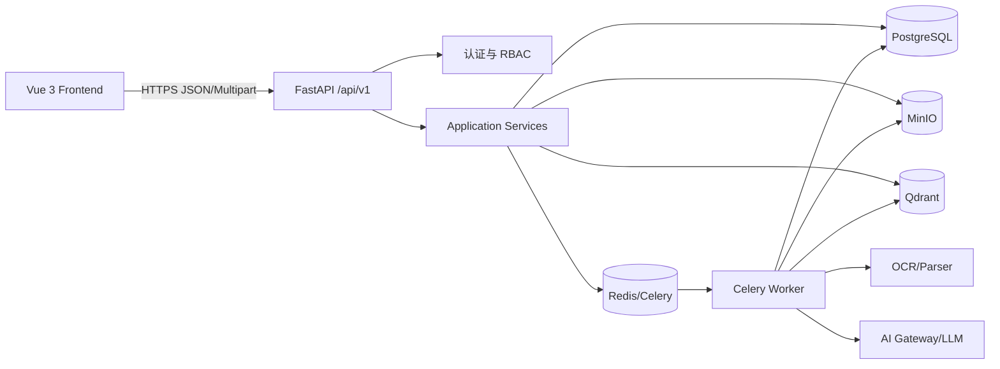
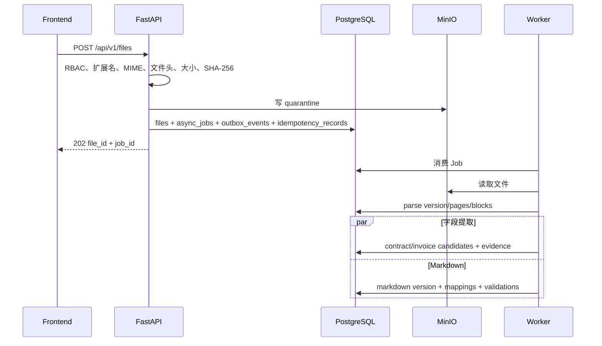
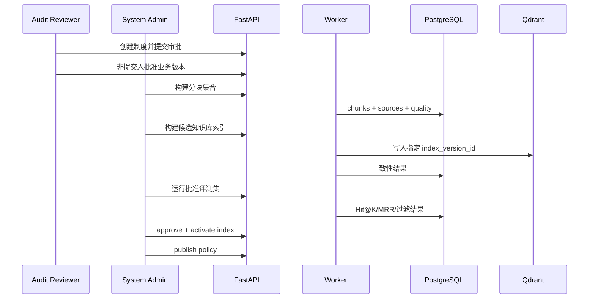
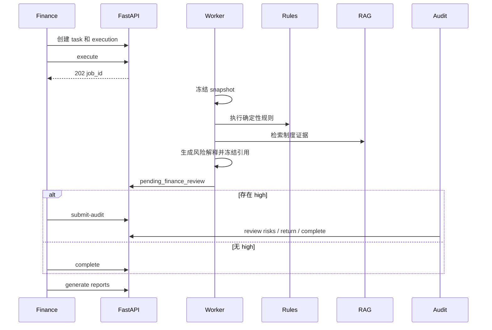

# FinAudit Agent API 接口设计说明书

## 文档信息

| 项目 | 内容 |
| --- | --- |
| 项目名称 | FinAudit Agent——企业财务文档智能审核与风险分析平台 |
| 文档名称 | API 接口设计说明书 |
| 文档版本 | V1.0 |
| 编制日期 | 2026-08-05 |
| 需求基线 | 《FinAudit Agent 项目需求规格说明书 V1.3》 |
| 架构基线 | 《FinAudit Agent 系统架构设计说明书 V1.0》 |
| 数据库基线 | 《FinAudit Agent 数据库设计说明书 V1.0》 |
| 接口范围 | P0 MVP 完整业务接口，含必要的详细设计补全接口；P1 监控能力仅作预留 |
| 接口数量 | 122 |
| 目标读者 | 前端工程师、后端工程师、AI 工程师、测试工程师、运维工程师、安全工程师 |
| 设计原则 | 页面可用、流程闭环、数据库可落地、权限后端强制、异步任务可恢复、版本不可变、证据可追溯 |

## 修订记录

| 版本 | 日期 | 说明 | 状态 |
| --- | --- | --- | --- |
| V1.0 | 2026-08-05 | 根据需求 V1.3、架构 V1.0、数据库 V1.0 形成首版详细 API 设计 | 当前版本 |
| CR-001-R2 / CR-002-R4 | 2026-08-07 | 同步强制换密、break-glass、上传意图、可恢复 Job、六态扫描和 AI 审计合同；新增 AUTH-010～AUTH-015 | 已批准合同；AI Provider 网络仍未放行 |
| CR-012-R3 | 2026-08-09 | 同步财务主数据身份和空表 `20260807_006` DDL 边界；API 路径、动作和包络增量为 0 | 已批准 contract；GAP-064 运行时、真实数据、Provider/网络和 production 未授权 |
| CR-004-R2 | 2026-08-09 | approved contract scope：同步 FILE-007/AUDIT-007/AUDIT-008/OPS-001 的 Job `row_version`、重试/取消投影和唯一新错误码 `JOB_VERSION_CONFLICT` | 已批准 contract；API path 仍为 122，runtime 未授权 |
| CR-011-R4 | 2026-08-09 | approved contract scope：同步内部 Policy/Event DTO、Sink Port 与既有错误分类兼容说明；API 增量为 0 | 已批准 contract；不新增 route、状态码或客户端 Provider 能力，持久化、网络和 production 未授权 |
| CR-011-R5 | 2026-08-10 | approved contract-offline startup scope：同步本地 startup fail-closed 的零 API 边界 | 已批准 contract；route、status、body 增量为 0，不开放 Provider、网络或 production 能力 |
| CR-011-R6 | 2026-08-10 | approved startup evidence-boundary successor：同步分层 startup evidence 的零 API 变化 | 已批准 contract；route、status、body 增量为 0，evidence marker 不成为公开 API |
| CR-003-R3 | 2026-08-11 | approved privileged-auth current-baseline successor：同步 AUTH-011～AUTH-015 的既有 contract 语义 | 已批准 contract；区分 `api.AUTH-005` 与 `work_package.AUTH-005`；route/status/错误码数量不变，响应字段按 R1/R2 以 `decided_by` 规范替换 `approved_by` 且不保留别名；runtime 未授权 |

## 已批准 CR-011-R4 零 API 投影

- 本轮只冻结 Backend 内部 Policy validator、`AiCallEventV1` DTO、`AiCallEventSink` Port、结果枚举与 fail-closed 兼容说明；P0 API 路径仍为 122，既有 HTTP 状态码和业务错误码集合不变。
- 不新增客户端可调用的 Provider、Policy、Event 或 Sink route；前端与外部调用方不得取得 secret、内部 permit、原始 Provider 响应或运行时网络能力。
- Fake/in-memory Gate B 证据不代表 AI-005 持久化、真实 HTTP、Provider 或业务结果采用已经实现。

## 已批准 CR-011-R5 零 API 投影

- 本地启动验证只产生进程内部 fail-closed 结果，不新增或修改公开 route、HTTP status、response body、业务错误码或客户端合同。
- 前端和外部调用方不得通过 API 读取 Policy/secret、触发 Provider，或把 startup internal error 解释为新的公开 API 能力。

## 已批准 CR-011-R6 startup evidence-boundary 零 API 投影

- route、status、body 的 delta 均为 0；evidence marker 不成为公开 API。

## 已批准 CR-003-R3 特权授权 current-baseline API 投影

本节精确绑定 R1 24270/cbe087aeb13f149fe6961f4daa71791ef8dd62b5d43bd1b1bb03b17c64cb8045、R2 35977/7a69b8555d422a7c2bee9d74da7030b8170692c934d83c12dd722c15c85c8363 与 R3 29321/35b1cdd758128afa485f91e34c5ef0dcfd95c4a648906e488099f68ff792e68c effective contract；R2 仍为 0/9 且未同步；与本文件中尚未同步的旧说明冲突时，以本节及 CR-003-R3 exact effective contract 为准。

- `api.AUTH-005` 与 `work_package.AUTH-005` 是不同事实；保留 AUTH-011～AUTH-015 的 CAS、幂等与 action-time 语义，响应/事实字段按 R1/R2 以 `decided_by` 规范替换 `approved_by` 且不保留别名。
- 本次同步不增加 route、status 或错误码数量，不授权 Auth runtime、wrapper、ACL、operation log、真实账号或业务 E2E。

# 1. 设计范围与结论

本说明书不是独立编造接口，而是按以下推导顺序生成：

```text
P0 页面与交互
→ 用户角色与职责分离
→ 核心业务流程与对象状态机
→ FastAPI 模块边界与同步/异步划分
→ PostgreSQL 表、约束与版本模型
→ 请求方法、URL、Schema、错误语义、幂等和验收条件
```

核心结论：

1. API 前缀统一为 `/api/v1`；健康检查和 Prometheus 指标分别保留 `/health`、`/health/dependencies`、`/metrics`。
2. Backend 只执行短事务、权限校验、状态迁移和 Job 创建；OCR、解析、Markdown、分块、Embedding、索引、评测、审核和报告生成由 Worker 异步执行。
3. PostgreSQL 是业务事实唯一来源；Qdrant Payload 只作初筛，权限、制度状态、有效日期和版本关系必须回到 PostgreSQL 复核。
4. 所有状态动作均采用显式动作接口，不允许前端直接 PATCH 任意状态。
5. 关键创建和异步动作必须使用 `Idempotency-Key`；业务对象修改必须携带 `row_version`。
6. 原始解析、Markdown、分块、索引、评测、审核执行和报告均版本化；已发布或活动版本不得原地覆盖。
7. `return-for-correction`、规则目录、重复检测、日志查询和指标接口属于详细设计阶段为闭合已确认流程而补充的接口，不改变既有业务状态机和角色职责。

## 1.1 CR-012-R3 API 零增量边界

- `api_path_delta=0`、`api_action_delta=0`、接口总数仍为 122；CR-012-R3 不新增或改写 endpoint、方法、请求/响应 DTO、ErrorResponse、HTTP 状态、业务错误码、幂等或权限规则。
- `uq_contracts_organization_contract_no`、`uq_suppliers_organization_tax_identity`、供应商双来源列/来源矩阵和四个 `NO ACTION` 循环外键只是 PostgreSQL DDL 事实，不得由 Router、Service 或前端自行投影为 API 合同。
- 合同编号或供应商身份唯一冲突的 HTTP/业务错误映射、供应商统一税务字段的读写投影、`SUPP-003`、CON-005 确认/精确复用、来源回填及 AI generic tax 输入映射继续由 GAP-064 阻断；本文件现有相关接口条目不构成实施授权，也不得用通用 409 或任意字段猜测冒充闭合。
- 本次批准只允许九份 Request 同步、空表 `20260807_006` DDL/ORM 和离线或专用全合成 PostgreSQL 16 验证；不得接入真实数据、Provider 或其他网络调用，不得部署或 production 放行。

## 1.2 CR-004-R2 Job fencing 与接口投影

本节规范性替换下文 FILE-007、AUDIT-007、AUDIT-008、OPS-001 中冲突的旧请求、响应、幂等和验收示例；未明确改变的字段继续沿用。

- API path 总数保持 122，只新增 409 `JOB_VERSION_CONFLICT`。`FILE-007` 与 `AUDIT-007` Body 均新增必填正整数 `row_version`；重试事务校验当前 failed/retryable Job 和冻结 Registry scope，执行 `failed -> queued` 时保持 `attempt_no` 不变、写 `current_attempt_start_step_code`、`row_version` 加一并创建 `event_sequence=attempt_no+1` Outbox，不创建 Step。
- FILE-007 响应精确为 `job_id/attempt_no/scheduled_attempt_no/status/stage/row_version/job_url`；AUDIT-007 响应保留 `execution_id/status/preserved_results` 并包含 `job_id/attempt_no/scheduled_attempt_no/row_version`。两者 status 为 queued；`stage` 是已批准 scope 的计划起点，不是当前运行阶段。
- audit execution 与 Job 的 retry、claim、阶段终结、取消和 Job-aware finalizer 固定按 `audit_task_executions -> async_jobs -> outbox_events` 加锁并重验不可变 identity，所有 affected-row 必须恰为 1。retry 同事务把 execution 与 Job 从 failed 置 queued 并清空当前失败投影；历史确定性结果和追加证据保留。
- AUDIT-008 Body 在 reason 外新增必填但可空的 `row_version: positive integer|null`。draft/validating 无 Job，必须传 null 并直接取消 execution；queued/running 必须传匹配 Job 版本。queued 同事务取消 execution+Job；running 只把 Job 置 cancel_requested，Worker 安全检查点再原子终结 Step、Job 与 execution。
- AUDIT-008 响应精确包含 `execution_id/status/cancelled_at/job_id/row_version`。相同 Idempotency-Key/hash replay 不重复 mutation，必须重读并返回当前权威取消投影，故首次 cancel_requested 后完成的 replay 返回 cancelled；不同 hash 仍为 `IDEMPOTENCY_CONFLICT`。
- OPS-001 Job item 增加权威 `row_version` 与只读派生 `retryable`；页面动作只携带最近 OPS-001 或动作响应返回的 Job 版本，不得使用 execution 版本、缓存或错误文案推断。
- 具体 Router/Service/Repository、Handler artifact、FILE/AUDIT scope mapping、operation action、Job/Worker runtime 均不由本次同步授权；`20260807_007` 空表 Gate 不能冒充上述接口已实现。

# 2. API 总体架构



## 2.1 同步接口

登录、列表、详情、草稿修改、字段确认、关系确认、风险复核、制度审批、索引批准/激活和下载鉴权采用同步接口。

## 2.2 异步接口

以下操作成功受理后返回 HTTP 202：

- 文件扫描、解析、OCR、字段提取。
- Markdown 转换和校验。
- 分块构建与质量检查。
- Embedding、Qdrant 索引构建和一致性检查。
- 检索评测。
- 审核执行和 AI 风险解释。
- PDF、XLSX、CSV 导出。

异步响应必须包含 `job_id`、资源 ID、当前 `stage` 和 `/api/v1/jobs/{job_id}`，不得返回未经计算的进度百分比。

# 3. 通用协议规范

## 3.1 请求头

| 请求头 | 必填条件 | 说明 |
|---|---|---|
| `Authorization: Bearer <token>` | 除登录、健康探针外 | Access Token |
| `Idempotency-Key` | 关键 POST、异步动作、业务创建 | 1—200 字符；同组织、用户范围内唯一 |
| `X-Request-ID` | 建议 | 客户端请求关联 ID |
| `traceparent` | 可选 | W3C Trace Context |
| `Content-Type` | 是 | `application/json` 或 `multipart/form-data` |
| `If-Match` | 可选扩展 | 可映射为 `row_version`，P0 以请求体字段为准 |

## 3.2 数据格式

- UUID 使用标准小写字符串。
- 时间使用 UTC RFC 3339，例如 `2026-08-05T05:00:00Z`。
- 业务日期使用 `YYYY-MM-DD`。
- 金额、税额、税率和相似度使用十进制字符串，禁止 JSON 浮点参与财务计算。
- 枚举值使用数据库设计说明书中的英文小写值。
- `null` 表示未知或不适用，不使用空字符串替代。
- 所有文本输入执行长度限制、HTML/脚本过滤和 Unicode 规范化。

## 3.3 统一成功响应

```json
{
  "code": "OK",
  "message": "success",
  "data": {},
  "trace_id": "90000000-0000-0000-0000-000000000001",
  "timestamp": "2026-08-05T05:00:00Z"
}
```

文件流和 HTTP 204 不使用上述包装。

## 3.4 统一错误响应

```json
{
  "code": "RESOURCE_VERSION_CONFLICT",
  "message": "资源已被其他用户修改，请刷新后重试",
  "details": [
    {
      "field": "row_version",
      "reason": "expected=3, actual=4"
    }
  ],
  "trace_id": "90000000-0000-0000-0000-000000000001",
  "timestamp": "2026-08-05T05:00:00Z"
}
```

生产环境不得返回 SQL、文件路径、堆栈、模型系统 Prompt、密钥或完整敏感正文。

# 4. 分页、排序、过滤与并发控制

## 4.1 分页

```text
page >= 1
1 <= page_size <= 100
```

响应：

```json
{
  "pagination": {
    "page": 1,
    "page_size": 20,
    "total": 157,
    "total_pages": 8
  }
}
```

## 4.2 排序

使用 `sort_by` 和 `sort_order=asc|desc`；每个接口必须维护字段白名单，禁止将客户端字段名直接拼接为 SQL。

## 4.3 乐观锁

可变主数据的 PATCH/状态动作携带 `row_version`。更新 SQL 必须包含：

```sql
WHERE id = :id AND row_version = :expected_row_version
```

影响行数为 0 时返回 `RESOURCE_VERSION_CONFLICT`。

## 4.4 幂等记录

关键接口在同一事务中写入 `idempotency_records`。相同 Key：

- 请求哈希相同：返回首次状态码和响应体。
- 请求哈希不同：返回 `IDEMPOTENCY_CONFLICT`。
- 异步任务：不得重复创建 `async_jobs` 和 `outbox_events`。

# 5. 认证、授权与职责分离

## 5.1 固定角色

| 角色代码 | 中文名称 | API 核心职责 |
|---|---|---|
| `system_admin` | 系统管理员 | 用户、技术配置、失败任务、分块配置、索引构建/批准/激活、技术发布、健康与日志 |
| `finance_reviewer` | 财务审核人员 | 合同/发票上传与确认、主合同确认、任务执行、非 high 风险处理、报告导出 |
| `audit_reviewer` | 审计复核人员 | high 风险、制度业务审批、评测证据审批、退回修正 |
| `contract_admin` | 合同管理员 | 合同、补充协议、合同附件维护和关联建议 |
| `read_only` | 只读用户 | 授权范围内已完成任务和报告查看；P0 无下载/导出 |

## 5.2 后端强制规则

1. 前端隐藏按钮不能替代 API 鉴权。
2. `system_admin` 默认不能修改合同、补充协议、发票或风险结论。
3. high 风险只能由 `audit_reviewer` 最终处理。
4. 制度提交人与批准人不得为同一账号。
5. 评测数据集提交人与批准人不得为同一账号。
6. 生产环境禁止账号长期同时拥有 `system_admin` 与 `finance_reviewer` 或 `audit_reviewer`。
7. 所有拒绝访问写入 `operation_logs`，但不得泄露资源是否真实存在。

# 6. 页面—接口追踪矩阵

| 页面 | 主要接口 |
| --- | --- |
| UI-001 登录页 | AUTH-001、AUTH-002、AUTH-003 |
| UI-002 工作台 | AUTH-004、AUDIT-001、OPS-001 |
| UI-003 文件管理 | FILE-001～FILE-008、PARSE-001～PARSE-005、MD-001～MD-008、OPS-001 |
| UI-004 合同列表 | CON-001 |
| UI-005 合同详情 | CON-002～CON-007、SAGR-001～SAGR-004、SUPP-001～SUPP-003、FILE-005 |
| UI-006 发票列表 | INV-001、INV-006、SUPP-001 |
| UI-007 发票详情 | INV-002～INV-006、SUPP-001～SUPP-003、FILE-005 |
| UI-008 合同发票关联 | LINK-001～LINK-004 |
| UI-009 制度知识库与检索测试 | KB-001～KB-004、POL-001～POL-010、CHUNK-001～CHUNK-007、INDEX-001～INDEX-005、RET-001、EVAL-001～EVAL-008 |
| UI-010 AI 问答 | QA-001、QA-002 |
| UI-011 审核任务列表 | AUDIT-001～AUDIT-005、AUDIT-007 |
| UI-012 审核任务详情 | AUDIT-003～AUDIT-008、RULE-001～RULE-002、RISK-001～RISK-002、REVIEW-001～REVIEW-003 |
| UI-013 报告页 | REPORT-001～REPORT-003、EXPORT-001、OPS-001 |
| UI-014 用户管理 | AUTH-005～AUTH-009 |

# 7. 关键业务时序

## 7.1 文件上传到业务对象



## 7.2 制度发布



## 7.3 审核执行



# 8. 接口总目录

| 编号 | 接口名称 | 方法 | URL | 成功状态 | 主要角色 |
| --- | --- | --- | --- | --- | --- |
| AUTH-001 | 用户登录 | POST | /api/v1/auth/login | 200 | 匿名用户 |
| AUTH-002 | 刷新访问令牌 | POST | /api/v1/auth/refresh | 200 | 已登录用户 |
| AUTH-003 | 退出登录 | POST | /api/v1/auth/logout | 204 | 已登录用户 |
| AUTH-004 | 获取当前用户 | GET | /api/v1/auth/me | 200 | 全部已登录角色 |
| AUTH-005 | 创建用户 | POST | /api/v1/users | 201 | system_admin |
| AUTH-006 | 更新用户状态与角色 | PATCH | /api/v1/users/{user_id} | 200 | system_admin |
| FILE-001 | 单文件上传并启动处理 | POST | /api/v1/files | 202 | finance_reviewer（合同/发票）、contract_admin（合同/补充协议）、audit_reviewer（制度）、system_admin（运维补传） |
| FILE-002 | 批量上传文件 | POST | /api/v1/files/batch | 202 | 同 FILE-001 |
| FILE-003 | 文件列表查询 | GET | /api/v1/files | 200 | 全部已登录角色（按数据范围） |
| FILE-004 | 文件详情与处理聚合状态 | GET | /api/v1/files/{file_id} | 200 | 有权查看该文件的角色 |
| FILE-005 | 获取文件预览 | GET | /api/v1/files/{file_id}/preview | 200 | 有权查看该文件的角色 |
| FILE-006 | 归档文件 | POST | /api/v1/files/{file_id}/archive | 200 | 原业务对象维护角色；system_admin 仅技术归档 |
| FILE-007 | 重试文件处理 | POST | /api/v1/files/{file_id}/retry | 202 | system_admin；对应业务角色可重试可恢复失败 |
| PARSE-001 | 查询文件解析版本 | GET | /api/v1/files/{file_id}/parse-versions | 200 | 有权查看文件的角色 |
| PARSE-002 | 获取解析版本详情 | GET | /api/v1/document-parse-versions/{parse_version_id} | 200 | 有权查看来源文件的角色 |
| PARSE-003 | 查询解析结构块 | GET | /api/v1/document-parse-versions/{parse_version_id}/blocks | 200 | 有权查看来源文件的角色 |
| PARSE-004 | 纠正文档结构块并创建新解析版本 | POST | /api/v1/document-blocks/{block_id}/correct | 202 | finance_reviewer（合同/发票）、contract_admin（合同/补充协议）、audit_reviewer（制度）、system_admin（技术协助） |
| PARSE-005 | 激活解析版本 | POST | /api/v1/document-parse-versions/{parse_version_id}/activate | 200 | system_admin；对应业务纠错角色在质量门禁通过后可激活 |
| MD-001 | 启动 Markdown 转换 | POST | /api/v1/files/{file_id}/markdown/convert | 202 | system_admin；对应业务角色可对有权文件发起 |
| MD-002 | 查询 Markdown 版本列表 | GET | /api/v1/files/{file_id}/markdown-versions | 200 | 有权查看文件的角色 |
| MD-003 | 获取 Markdown 详情 | GET | /api/v1/document-markdown-versions/{markdown_version_id} | 200 | 有权查看来源文件的角色 |
| MD-004 | 执行 Markdown 质量校验 | POST | /api/v1/document-markdown-versions/{markdown_version_id}/validate | 202 | system_admin；对应业务角色可发起 |
| MD-005 | 查询 Markdown 校验结果与来源映射 | GET | /api/v1/document-markdown-versions/{markdown_version_id}/quality | 200 | 有权查看来源文件的角色 |
| MD-006 | 激活 Markdown 版本 | POST | /api/v1/document-markdown-versions/{markdown_version_id}/activate | 200 | system_admin；对应业务角色在质量门禁通过后可激活 |
| MD-007 | 下载 Markdown 文件 | GET | /api/v1/document-markdown-versions/{markdown_version_id}/download | 200 | 有权查看来源文件的角色；read_only 按 P0 策略无导出权限 |
| CON-001 | 合同列表 | GET | /api/v1/contracts | 200 | finance_reviewer、audit_reviewer（只读）、contract_admin、read_only（授权范围） |
| CON-002 | 从文件创建合同候选 | POST | /api/v1/contracts/from-file/{file_id} | 201 | finance_reviewer、contract_admin |
| CON-003 | 合同详情 | GET | /api/v1/contracts/{contract_id} | 200 | 有权查看合同的角色 |
| CON-004 | 修改合同草稿或确认字段 | PATCH | /api/v1/contracts/{contract_id} | 200 | finance_reviewer、contract_admin |
| CON-005 | 批量确认合同字段 | POST | /api/v1/contracts/{contract_id}/confirm-fields | 200 | finance_reviewer、contract_admin |
| CON-006 | 合同普通附件关联 | POST | /api/v1/contracts/{contract_id}/documents | 201 | contract_admin、finance_reviewer |
| SAGR-001 | 从文件创建补充协议 | POST | /api/v1/supplementary-agreements/from-file/{file_id} | 201 | contract_admin、finance_reviewer |
| SAGR-002 | 补充协议详情 | GET | /api/v1/supplementary-agreements/{agreement_id} | 200 | 有权查看主合同的角色 |
| SAGR-003 | 修改补充协议及变更项 | PATCH | /api/v1/supplementary-agreements/{agreement_id} | 200 | contract_admin、finance_reviewer |
| SAGR-004 | 确认或拒绝补充协议 | POST | /api/v1/supplementary-agreements/{agreement_id}/confirm | 200 | contract_admin；finance_reviewer 可在审核范围确认 |
| INV-001 | 发票列表 | GET | /api/v1/invoices | 200 | finance_reviewer、audit_reviewer（只读）、contract_admin（关联查看）、read_only（授权范围） |
| INV-002 | 从文件创建发票候选 | POST | /api/v1/invoices/from-file/{file_id} | 201 | finance_reviewer |
| INV-003 | 发票详情 | GET | /api/v1/invoices/{invoice_id} | 200 | 有权查看发票的角色 |
| INV-004 | 修改发票字段或明细 | PATCH | /api/v1/invoices/{invoice_id} | 200 | finance_reviewer |
| INV-005 | 确认发票 | POST | /api/v1/invoices/{invoice_id}/confirm | 200 | finance_reviewer |
| INV-006 | 执行发票重复检测 | POST | /api/v1/invoices/{invoice_id}/duplicate-check | 200 | finance_reviewer、system_admin（运维触发） |
| LINK-001 | 查询合同发票候选关系 | GET | /api/v1/contract-invoices/candidates | 200 | finance_reviewer、contract_admin、audit_reviewer（只读） |
| LINK-002 | 创建人工关联建议 | POST | /api/v1/contract-invoices | 201 | finance_reviewer、contract_admin |
| LINK-003 | 确认主合同关系 | POST | /api/v1/contract-invoices/{relation_id}/confirm | 200 | finance_reviewer |
| LINK-004 | 取消合同发票关系 | DELETE | /api/v1/contract-invoices/{relation_id} | 200 | finance_reviewer；contract_admin 仅可取消本人未确认建议 |
| KB-001 | 知识库列表 | GET | /api/v1/knowledge-bases | 200 | 全部已登录角色（按权限） |
| KB-002 | 创建知识库 | POST | /api/v1/knowledge-bases | 201 | system_admin |
| POL-001 | 制度列表 | GET | /api/v1/policy-documents | 200 | system_admin、audit_reviewer、finance_reviewer/contract_admin/read_only（已发布授权范围） |
| POL-002 | 创建制度草稿 | POST | /api/v1/policy-documents | 201 | audit_reviewer；system_admin 可技术上传但不能提交业务审批 |
| POL-003 | 制度详情 | GET | /api/v1/policy-documents/{policy_id} | 200 | 有权查看制度的角色 |
| POL-004 | 修改制度草稿 | PATCH | /api/v1/policy-documents/{policy_id} | 200 | audit_reviewer |
| POL-005 | 提交制度业务审批 | POST | /api/v1/policy-documents/{policy_id}/submit-review | 200 | audit_reviewer |
| POL-006 | 批准制度业务版本 | POST | /api/v1/policy-documents/{policy_id}/approve | 200 | audit_reviewer |
| POL-007 | 驳回制度业务版本 | POST | /api/v1/policy-documents/{policy_id}/reject | 200 | audit_reviewer |
| POL-008 | 技术发布制度 | POST | /api/v1/policy-documents/{policy_id}/publish | 200 | system_admin |
| POL-009 | 撤销制度 | POST | /api/v1/policy-documents/{policy_id}/revoke | 200 | audit_reviewer 发起业务撤销，system_admin 执行技术状态落地（双角色流程） |
| CHUNK-001 | 创建分块配置版本 | POST | /api/v1/chunking-configs | 201 | system_admin |
| CHUNK-002 | 发布分块配置 | POST | /api/v1/chunking-configs/{config_id}/publish | 200 | system_admin |
| CHUNK-003 | 构建制度分块集合 | POST | /api/v1/policy-documents/{policy_id}/chunk-sets | 202 | system_admin |
| CHUNK-004 | 分块集合详情与质量结果 | GET | /api/v1/document-chunk-sets/{chunk_set_id} | 200 | system_admin、audit_reviewer、finance_reviewer/contract_admin/read_only（制度授权范围） |
| CHUNK-005 | 查询分块列表与详情 | GET | /api/v1/document-chunk-sets/{chunk_set_id}/chunks | 200 | 有权查看对应制度的角色 |
| CHUNK-006 | 激活分块集合 | POST | /api/v1/document-chunk-sets/{chunk_set_id}/activate | 200 | system_admin |
| INDEX-001 | 知识库索引版本列表 | GET | /api/v1/knowledge-bases/{knowledge_base_id}/index-versions | 200 | system_admin、audit_reviewer、finance_reviewer/contract_admin/read_only（只读摘要） |
| INDEX-002 | 重建知识库候选索引 | POST | /api/v1/knowledge-bases/{knowledge_base_id}/reindex | 202 | system_admin |
| INDEX-003 | 索引版本详情与一致性报告 | GET | /api/v1/document-index-versions/{index_version_id} | 200 | system_admin、audit_reviewer、其他角色只读活动摘要 |
| INDEX-004 | 批准候选索引 | POST | /api/v1/document-index-versions/{index_version_id}/approve | 200 | system_admin |
| INDEX-005 | 激活知识库索引 | POST | /api/v1/document-index-versions/{index_version_id}/activate | 200 | system_admin |
| RET-001 | 单次检索调试 | POST | /api/v1/retrieval/debug | 200 | system_admin、audit_reviewer；finance_reviewer/contract_admin 只可对授权已发布知识库调试 |
| EVAL-001 | 创建检索评测数据集 | POST | /api/v1/retrieval-eval/datasets | 201 | audit_reviewer |
| EVAL-002 | 新增或批量导入评测用例 | POST | /api/v1/retrieval-eval/datasets/{dataset_id}/cases | 201 | audit_reviewer |
| EVAL-003 | 提交评测数据集审批 | POST | /api/v1/retrieval-eval/datasets/{dataset_id}/submit-review | 200 | audit_reviewer |
| EVAL-004 | 批准评测数据集 | POST | /api/v1/retrieval-eval/datasets/{dataset_id}/approve | 200 | audit_reviewer |
| EVAL-005 | 启动检索评测运行 | POST | /api/v1/retrieval-eval/runs | 202 | system_admin |
| EVAL-006 | 查询评测运行与逐题结果 | GET | /api/v1/retrieval-eval/runs/{run_id} | 200 | system_admin、audit_reviewer、finance_reviewer/contract_admin（只读结果） |
| EVAL-007 | 导出检索评测结果 | POST | /api/v1/retrieval-eval/runs/{run_id}/export | 202 | system_admin、audit_reviewer |
| QA-001 | 企业制度 RAG 问答 | POST | /api/v1/qa/query | 200 | 全部已登录角色（按知识库和制度权限） |
| QA-002 | 提交问答反馈 | POST | /api/v1/qa/feedback | 201 | 全部已登录角色 |
| AUDIT-001 | 审核任务列表 | GET | /api/v1/audit-tasks | 200 | finance_reviewer、audit_reviewer、contract_admin（只读关联）、read_only（已完成授权） |
| AUDIT-002 | 创建审核任务 | POST | /api/v1/audit-tasks | 201 | finance_reviewer |
| AUDIT-003 | 审核任务详情 | GET | /api/v1/audit-tasks/{task_id} | 200 | 有权查看任务的角色 |
| AUDIT-004 | 创建新的审核执行版本 | POST | /api/v1/audit-tasks/{task_id}/executions | 201 | finance_reviewer |
| AUDIT-005 | 启动审核执行 | POST | /api/v1/audit-task-executions/{execution_id}/execute | 202 | finance_reviewer |
| AUDIT-006 | 获取审核执行详情 | GET | /api/v1/audit-task-executions/{execution_id} | 200 | 有权查看任务的角色 |
| AUDIT-007 | 重试失败审核执行 | POST | /api/v1/audit-task-executions/{execution_id}/retry | 202 | finance_reviewer；system_admin 可技术重试 |
| AUDIT-008 | 取消审核执行 | POST | /api/v1/audit-task-executions/{execution_id}/cancel | 200 | finance_reviewer |
| RULE-001 | 审核规则目录 | GET | /api/v1/audit-rules | 200 | finance_reviewer、audit_reviewer、contract_admin、read_only（只读）；system_admin 技术查看 |
| RULE-002 | 查询执行的规则结果 | GET | /api/v1/audit-task-executions/{execution_id}/rule-executions | 200 | 有权查看执行的角色 |
| RISK-001 | 审核风险列表 | GET | /api/v1/audit-task-executions/{execution_id}/risks | 200 | finance_reviewer、audit_reviewer、read_only（完成任务）、contract_admin（受限只读） |
| RISK-002 | 人工复核单条风险 | POST | /api/v1/audit-risks/{risk_id}/review | 200 | finance_reviewer（notice/low/medium）、audit_reviewer（全部及 high） |
| REVIEW-001 | 提交高风险任务给审计 | POST | /api/v1/audit-task-executions/{execution_id}/submit-audit | 200 | finance_reviewer |
| REVIEW-002 | 审计退回事实修正 | POST | /api/v1/audit-task-executions/{execution_id}/return-for-correction | 200 | audit_reviewer |
| REVIEW-003 | 完成审核执行 | POST | /api/v1/audit-task-executions/{execution_id}/complete | 200 | finance_reviewer（无有效 high）、audit_reviewer（处理 high 后） |
| REPORT-001 | 生成审核报告 | POST | /api/v1/audit-task-executions/{execution_id}/reports | 202 | finance_reviewer、audit_reviewer |
| REPORT-002 | 报告列表 | GET | /api/v1/audit-task-executions/{execution_id}/reports | 200 | finance_reviewer、audit_reviewer、contract_admin（授权摘要）、read_only（查看但不可下载） |
| REPORT-003 | 报告详情与预览 | GET | /api/v1/audit-reports/{report_id} | 200 | 有权查看执行的角色 |
| EXPORT-001 | 下载审核报告或风险明细 | GET | /api/v1/audit-reports/{report_id}/download | 200 | finance_reviewer、audit_reviewer |
| OPS-001 | 查询异步任务状态 | GET | /api/v1/jobs/{job_id} | 200 | 任务创建人、相关业务对象查看者、system_admin |
| OPS-002 | 基础健康检查 | GET | /health | 200 | 匿名或内网探针（生产可限制来源） |
| OPS-003 | 依赖健康检查 | GET | /health/dependencies | 200/503 | system_admin、内网探针 |
| OPS-004 | 查询操作审计日志 | GET | /api/v1/operation-logs | 200 | system_admin（技术范围）、audit_reviewer（审计范围） |
| OPS-005 | 查询 AI 调用摘要 | GET | /api/v1/ai-call-logs | 200 | system_admin（技术）、audit_reviewer（审计范围） |
| OPS-006 | Prometheus 指标接口 | GET | /metrics | 200 | Prometheus 内网采集账号 |
| AUTH-007 | 用户列表 | GET | /api/v1/users | 200 | system_admin |
| AUTH-008 | 替换用户固定角色 | PUT | /api/v1/users/{user_id}/roles | 200 | system_admin |
| AUTH-009 | 管理员重置用户密码 | POST | /api/v1/users/{user_id}/password-reset | 200 | system_admin |
| AUTH-010 | 完成强制换密 | POST | /api/v1/auth/password-change | 204 | 持有一次性 `password:change` Token 的用户 |
| AUTH-011 | 创建 break-glass 请求 | POST | /api/v1/break-glass-requests | 201 | system_admin |
| AUTH-012 | 查询 break-glass 请求 | GET | /api/v1/break-glass-requests | 200 | system_admin、audit_reviewer（审计只读） |
| AUTH-013 | 批准 break-glass 请求 | POST | /api/v1/break-glass-requests/{request_id}/approve | 200 | 独立 system_admin |
| AUTH-014 | 拒绝 break-glass 请求 | POST | /api/v1/break-glass-requests/{request_id}/reject | 200 | 独立 system_admin |
| AUTH-015 | 撤销 break-glass 授权 | POST | /api/v1/break-glass-requests/{request_id}/revoke | 200 | system_admin（受后端人员关系约束） |
| FILE-008 | 下载原始文件 | GET | /api/v1/files/{file_id}/download | 200 | finance_reviewer、audit_reviewer、contract_admin（按业务范围）；read_only 无 P0 下载权 |
| MD-008 | 分页查询 Markdown 来源映射 | GET | /api/v1/document-markdown-versions/{markdown_version_id}/source-mappings | 200 | 有权查看来源文件的角色 |
| CON-007 | 取消合同普通附件关系 | DELETE | /api/v1/contract-documents/{contract_document_id} | 200 | contract_admin、finance_reviewer（本人添加的审核证据） |
| SUPP-001 | 供应商列表 | GET | /api/v1/suppliers | 200 | finance_reviewer、contract_admin、audit_reviewer（只读） |
| SUPP-002 | 供应商详情 | GET | /api/v1/suppliers/{supplier_id} | 200 | 有权查看关联合同/发票的角色 |
| SUPP-003 | 确认或修改供应商候选 | PATCH | /api/v1/suppliers/{supplier_id} | 200 | finance_reviewer、contract_admin |
| KB-003 | 知识库详情 | GET | /api/v1/knowledge-bases/{knowledge_base_id} | 200 | 全部已登录角色（按权限） |
| KB-004 | 修改知识库配置 | PATCH | /api/v1/knowledge-bases/{knowledge_base_id} | 200 | system_admin |
| POL-010 | 归档制度版本 | POST | /api/v1/policy-documents/{policy_id}/archive | 200 | audit_reviewer 业务确认、system_admin 技术执行 |
| CHUNK-007 | 分块详情 | GET | /api/v1/document-chunks/{chunk_id} | 200 | 有权查看对应制度的角色 |
| EVAL-008 | 分页查询评测逐题结果 | GET | /api/v1/retrieval-eval/runs/{run_id}/results | 200 | system_admin、audit_reviewer、finance_reviewer/contract_admin（只读） |

# 9. 接口详细设计阅读说明

每个接口均给出请求参数、请求示例、响应字段、响应示例、错误码、权限要求、幂等性、关联数据表和验收条件。

示例中的 UUID、Token、签名 URL 和哈希均为模拟值；实现时不得硬编码。响应示例中的 `data` 为业务数据，实际响应必须包含统一 `code/message/trace_id/timestamp`。

# 10. 认证与用户权限接口

### AUTH-001 用户登录

| 项目 | 设计 |
| --- | --- |
| 接口编号 | AUTH-001 |
| 接口名称 | 用户登录 |
| 请求方法 | `POST` |
| URL | `/api/v1/auth/login` |
| 成功状态 | 200；命中强制换密门禁时返回 403 受限流程，不属于普通登录成功 |
| 使用角色 | 匿名用户 |
| 关联页面 | UI-001 登录页 |

#### 请求参数

| 位置 | 参数 | 类型 | 必填 | 说明 |
| --- | --- | --- | --- | --- |
| Body | `username` | string | 是 | 登录名，大小写不敏感 |
| Body | `password` | string | 是 | 明文密码，仅通过 HTTPS 传输 |
| Body | `remember_me` | boolean | 否 | 是否使用较长 Refresh Token 生命周期，默认 false |

#### 请求示例

```json
{
  "username": "finance01",
  "password": "********",
  "remember_me": false
}
```

#### 响应字段

| 字段 | 类型 | 说明 |
| --- | --- | --- |
| `access_token` | string | Bearer Access Token |
| `refresh_token` | string | 仅本次返回，服务端只保存哈希 |
| `expires_in` | integer | Access Token 有效秒数 |
| `user` | object | 用户及有效角色 |

#### 响应示例

```json
{
  "code": "OK",
  "message": "success",
  "data": {
    "access_token": "eyJ...",
    "refresh_token": "rft_...",
    "token_type": "Bearer",
    "expires_in": 1800,
    "user": {
      "id": "10000000-0000-0000-0000-000000000001",
      "display_name": "财务审核员A",
      "roles": [
        "finance_reviewer"
      ]
    }
  },
  "trace_id": "90000000-0000-0000-0000-000000000001",
  "timestamp": "2026-08-05T05:00:00Z"
}
```

#### 错误码

| 错误码 | HTTP | 说明 |
| --- | --- | --- |
| `AUTH_INVALID_CREDENTIALS` | 401 | 用户名或密码错误 |
| `AUTH_ACCOUNT_LOCKED` | 423 | 连续失败导致账号锁定 |
| `AUTH_USER_DISABLED` | 403 | 账号已禁用 |
| `AUTH_PASSWORD_CHANGE_REQUIRED` | 403 | 凭据正确但必须先换密；`data` 只返回 5 分钟一次性 `password_change_token/expires_in=300` |
| `RATE_LIMITED` | 429 | 登录频率超限 |

#### 权限要求

匿名可调用；凭据正确后仍须按 users.status、locked_until、token_invalid_before 和 `force_change_on_login` 校验。命中强制换密时不得签发 Access/Refresh Token、不得创建 `token_sessions`，受限 Token 只能调用 AUTH-010。登录失败和门禁动作写脱敏审计。

#### 幂等性

不要求 Idempotency-Key；普通登录重复可创建不同 token_session；强制换密状态重复登录仍只返回受限 Token，不创建会话。

#### 关联数据表

users、user_roles、roles、token_sessions、operation_logs

#### 验收条件

1. 普通正确账号返回 Access/Refresh Token 和角色；强制换密账号只返回 403 受限换密信息。
2. 错误密码不泄露账号是否存在。
3. 连续失败达到阈值后锁定并记录 operation_logs。
4. 受限换密 Token 不得访问任何其他业务接口，也不得进入 URL、日志或前端持久化存储。

### AUTH-002 刷新访问令牌

| 项目 | 设计 |
| --- | --- |
| 接口编号 | AUTH-002 |
| 接口名称 | 刷新访问令牌 |
| 请求方法 | `POST` |
| URL | `/api/v1/auth/refresh` |
| 成功状态 | 200 |
| 使用角色 | 已登录用户 |
| 关联页面 | UI-001 登录页 |

#### 请求参数

| 位置 | 参数 | 类型 | 必填 | 说明 |
| --- | --- | --- | --- | --- |
| Body | `refresh_token` | string | 是 | 当前 Refresh Token |

#### 请求示例

```json
{
  "refresh_token": "rft_..."
}
```

#### 响应字段

| 字段 | 类型 | 说明 |
| --- | --- | --- |
| `access_token` | string | 新 Access Token |
| `refresh_token` | string | 旋转后的新 Refresh Token |
| `expires_in` | integer | 有效秒数 |
| `session_id` | uuid | 会话 ID |

#### 响应示例

```json
{
  "code": "OK",
  "message": "success",
  "data": {
    "access_token": "eyJ...new",
    "refresh_token": "rft_new...",
    "token_type": "Bearer",
    "expires_in": 1800,
    "session_id": "11000000-0000-0000-0000-000000000001"
  },
  "trace_id": "90000000-0000-0000-0000-000000000001",
  "timestamp": "2026-08-05T05:00:00Z"
}
```

#### 错误码

| 错误码 | HTTP | 说明 |
| --- | --- | --- |
| `AUTH_TOKEN_REVOKED` | 401 | Access Token 已过期、被撤销或用户已禁用 |
| `AUTH_REFRESH_EXPIRED` | 401 | Refresh Token 已过期 |
| `AUTH_REUSE_DETECTED` | 401 | 检测到已旋转 Token 重放 |

#### 权限要求

仅允许有效 token_session；用户禁用、token_invalid_before 更新或会话撤销后立即拒绝。

#### 幂等性

不幂等；采用 Refresh Token 旋转。旧 Token 二次使用返回 AUTH_REUSE_DETECTED。

#### 关联数据表

users、token_sessions、operation_logs

#### 验收条件

1. 刷新后旧 Refresh Token 失效。
2. 用户禁用后刷新立即失败。
3. 不在日志中记录完整 Token。

### AUTH-003 退出登录

| 项目 | 设计 |
| --- | --- |
| 接口编号 | AUTH-003 |
| 接口名称 | 退出登录 |
| 请求方法 | `POST` |
| URL | `/api/v1/auth/logout` |
| 成功状态 | 204 |
| 使用角色 | 已登录用户 |
| 关联页面 | UI-001 登录页 |

#### 请求参数

| 位置 | 参数 | 类型 | 必填 | 说明 |
| --- | --- | --- | --- | --- |
| Header | `Authorization` | Bearer token | 是 | 当前 Access Token |
| Body | `refresh_token` | string | 否 | 提供时撤销指定会话；省略时撤销当前会话 |

#### 请求示例

```json
{
  "refresh_token": "rft_..."
}
```

#### 响应字段

| 字段 | 类型 | 说明 |
| --- | --- | --- |
| `无响应体` | - | HTTP 204 |

#### 响应示例

HTTP 204，无响应体。

#### 错误码

| 错误码 | HTTP | 说明 |
| --- | --- | --- |
| `AUTH_TOKEN_REVOKED` | 401 | Access Token 已过期、被撤销或用户已禁用 |
| `INTERNAL_ERROR` | 500 | 未分类内部错误，响应包含 trace_id |

#### 权限要求

只能撤销本人会话；系统管理员通过用户管理接口撤销他人会话。

#### 幂等性

天然幂等；重复退出仍返回 204。

#### 关联数据表

token_sessions、operation_logs

#### 验收条件

1. 退出后对应 Refresh Token 不可再使用。
2. 重复调用不产生 500。
3. 退出事件包含 actor、session、trace_id。

### AUTH-004 获取当前用户

| 项目 | 设计 |
| --- | --- |
| 接口编号 | AUTH-004 |
| 接口名称 | 获取当前用户 |
| 请求方法 | `GET` |
| URL | `/api/v1/auth/me` |
| 成功状态 | 200 |
| 使用角色 | 全部已登录角色 |
| 关联页面 | UI-002 工作台、全局导航 |

#### 请求参数

| 位置 | 参数 | 类型 | 必填 | 说明 |
| --- | --- | --- | --- | --- |
| Header | `Authorization` | Bearer token | 是 | 当前 Access Token |

#### 请求示例

```http
GET /api/v1/auth/me
```

#### 响应字段

| 字段 | 类型 | 说明 |
| --- | --- | --- |
| `id` | uuid | 用户 ID |
| `username` | string | 登录名 |
| `display_name` | string | 显示名 |
| `roles` | array | 当前有效角色 |
| `permissions` | array | 前端可用于展示的权限快照 |

#### 响应示例

```json
{
  "code": "OK",
  "message": "success",
  "data": {
    "id": "10000000-0000-0000-0000-000000000001",
    "username": "finance01",
    "display_name": "财务审核员A",
    "roles": [
      "finance_reviewer"
    ],
    "permissions": [
      "files:upload",
      "contracts:update",
      "audit:execute",
      "reports:export"
    ]
  },
  "trace_id": "90000000-0000-0000-0000-000000000001",
  "timestamp": "2026-08-05T05:00:00Z"
}
```

#### 错误码

| 错误码 | HTTP | 说明 |
| --- | --- | --- |
| `AUTH_TOKEN_REVOKED` | 401 | Access Token 已过期、被撤销或用户已禁用 |

#### 权限要求

仅返回本人信息；permissions 仅供 UI 展示，不能替代后端鉴权。

#### 幂等性

GET 幂等。

#### 关联数据表

users、user_roles、roles

#### 验收条件

1. 角色变更或撤销后下一次请求反映最新权限。
2. 不返回 password_hash、Refresh Token 哈希等敏感字段。

### AUTH-005 创建用户

| 项目 | 设计 |
| --- | --- |
| 接口编号 | AUTH-005 |
| 接口名称 | 创建用户 |
| 请求方法 | `POST` |
| URL | `/api/v1/users` |
| 成功状态 | 201 |
| 使用角色 | system_admin |
| 关联页面 | UI-014 用户管理 |

#### 请求参数

| 位置 | 参数 | 类型 | 必填 | 说明 |
| --- | --- | --- | --- | --- |
| Header | `Idempotency-Key` | string | 是 | 创建请求幂等键 |
| Body | `username` | string | 是 | 组织内唯一 |
| Body | `display_name` | string | 是 | 显示名 |
| Body | `email` | string | 否 | 组织内活动用户唯一 |
| Body | `initial_password` | string | 是 | 满足密码策略 |
| Body | `role_codes` | array<string> | 是 | 固定角色代码 |

#### 请求示例

```json
{
  "username": "audit02",
  "display_name": "审计复核员B",
  "email": "audit02@example.com",
  "initial_password": "********",
  "role_codes": [
    "audit_reviewer"
  ]
}
```

#### 响应字段

| 字段 | 类型 | 说明 |
| --- | --- | --- |
| `id` | uuid | 用户 ID |
| `status` | string | active |
| `role_codes` | array | 已分配角色 |
| `row_version` | integer | 乐观锁版本 |

#### 响应示例

```json
{
  "code": "OK",
  "message": "success",
  "data": {
    "id": "10000000-0000-0000-0000-000000000002",
    "username": "audit02",
    "status": "active",
    "role_codes": [
      "audit_reviewer"
    ],
    "row_version": 1
  },
  "trace_id": "90000000-0000-0000-0000-000000000001",
  "timestamp": "2026-08-05T05:00:00Z"
}
```

#### 错误码

| 错误码 | HTTP | 说明 |
| --- | --- | --- |
| `AUTH_TOKEN_REVOKED` | 401 | Access Token 已过期、被撤销或用户已禁用 |
| `AUTH_FORBIDDEN` | 403 | 角色或数据范围无权访问 |
| `IDEMPOTENCY_CONFLICT` | 409 | 相同 Idempotency-Key 对应不同请求体 |
| `VALIDATION_ERROR` | 422 | 请求参数或字段约束不满足 |
| `USERNAME_DUPLICATED` | 409 | 用户名已存在 |
| `ROLE_COMBINATION_FORBIDDEN` | 409 | 角色组合违反职责分离 |

#### 权限要求

仅 system_admin；生产环境禁止长期同时分配 system_admin 与 finance_reviewer 或 audit_reviewer。

#### 幂等性

必须；相同 Key 和相同请求返回首次结果，不重复创建用户。

#### 关联数据表

users、roles、user_roles、idempotency_records、operation_logs

#### 验收条件

1. 用户、角色分配和幂等记录在同一事务完成。
2. 非法角色组合返回 409 并写 denied 日志。

### AUTH-006 更新用户状态与角色

| 项目 | 设计 |
| --- | --- |
| 接口编号 | AUTH-006 |
| 接口名称 | 更新用户状态与角色 |
| 请求方法 | `PATCH` |
| URL | `/api/v1/users/{user_id}` |
| 成功状态 | 200 |
| 使用角色 | system_admin |
| 关联页面 | UI-014 用户管理 |

#### 请求参数

| 位置 | 参数 | 类型 | 必填 | 说明 |
| --- | --- | --- | --- | --- |
| Path | `user_id` | uuid | 是 | 用户 ID |
| Body | `row_version` | integer | 是 | 当前版本 |
| Body | `status` | enum | 否 | active/disabled/locked |
| Body | `display_name` | string | 否 | 显示名 |
| Body | `role_codes` | array<string> | 否 | 完整替换有效角色 |
| Body | `reason` | string | 是 | 变更原因 |

#### 请求示例

```json
{
  "row_version": 3,
  "status": "disabled",
  "reason": "员工离职，停用账号"
}
```

#### 响应字段

| 字段 | 类型 | 说明 |
| --- | --- | --- |
| `id` | uuid | 用户 ID |
| `status` | string | 更新后状态 |
| `role_codes` | array | 有效角色 |
| `token_invalid_before` | datetime | 旧 Token 失效边界 |
| `row_version` | integer | 新版本 |

#### 响应示例

```json
{
  "code": "OK",
  "message": "success",
  "data": {
    "id": "10000000-0000-0000-0000-000000000001",
    "status": "disabled",
    "role_codes": [
      "finance_reviewer"
    ],
    "token_invalid_before": "2026-08-05T05:10:00Z",
    "row_version": 4
  },
  "trace_id": "90000000-0000-0000-0000-000000000001",
  "timestamp": "2026-08-05T05:00:00Z"
}
```

#### 错误码

| 错误码 | HTTP | 说明 |
| --- | --- | --- |
| `AUTH_TOKEN_REVOKED` | 401 | Access Token 已过期、被撤销或用户已禁用 |
| `AUTH_FORBIDDEN` | 403 | 角色或数据范围无权访问 |
| `RESOURCE_NOT_FOUND` | 404 | 目标资源不存在或不可见 |
| `RESOURCE_VERSION_CONFLICT` | 409 | row_version 乐观锁冲突 |
| `ROLE_COMBINATION_FORBIDDEN` | 409 | 职责分离冲突 |

#### 权限要求

仅 system_admin；不得通过本接口授予业务审批绕过权；变更自身敏感角色时应受双人控制策略约束。

#### 幂等性

以 row_version 实现条件幂等；同一版本只能成功一次。

#### 关联数据表

users、roles、user_roles、token_sessions、operation_logs

#### 验收条件

1. 禁用用户后现有 Access/Refresh Token 立即失效。
2. 并发更新只有一个成功。
3. 角色变更保留分配与撤销历史。

### AUTH-007 用户列表

| 项目 | 设计 |
| --- | --- |
| 接口编号 | AUTH-007 |
| 接口名称 | 用户列表 |
| 请求方法 | `GET` |
| URL | `/api/v1/users` |
| 成功状态 | 200 |
| 使用角色 | system_admin |
| 关联页面 | UI-014 用户管理 |

#### 请求参数

| 位置 | 参数 | 类型 | 必填 | 说明 |
| --- | --- | --- | --- | --- |
| Query | `page/page_size` | integer | 否 | 分页 |
| Query | `status` | enum | 否 | active/disabled/locked |
| Query | `role_code` | string | 否 | 固定角色 |
| Query | `keyword` | string | 否 | 用户名、显示名、邮箱 |

#### 请求示例

```http
GET /api/v1/users?page=1&page_size=20&status=active
```

#### 响应字段

| 字段 | 类型 | 说明 |
| --- | --- | --- |
| `items` | array | 用户、状态和有效角色 |
| `pagination` | object | 分页 |

#### 响应示例

```json
{
  "code": "OK",
  "message": "success",
  "data": {
    "items": [
      {
        "id": "10000000-0000-0000-0000-000000000001",
        "username": "finance01",
        "display_name": "财务审核员A",
        "status": "active",
        "role_codes": [
          "finance_reviewer"
        ],
        "row_version": 3
      }
    ],
    "pagination": {
      "page": 1,
      "page_size": 20,
      "total": 1
    }
  },
  "trace_id": "90000000-0000-0000-0000-000000000001",
  "timestamp": "2026-08-05T05:00:00Z"
}
```

#### 错误码

| 错误码 | HTTP | 说明 |
| --- | --- | --- |
| `AUTH_TOKEN_REVOKED` | 401 | Access Token 已过期、被撤销或用户已禁用 |
| `AUTH_FORBIDDEN` | 403 | 角色或数据范围无权访问 |
| `VALIDATION_ERROR` | 422 | 请求参数或字段约束不满足 |

#### 权限要求

仅 system_admin；不返回 password_hash、Refresh Token 哈希和登录失败敏感明细。

#### 幂等性

GET 幂等。

#### 关联数据表

users、user_roles、roles

#### 验收条件

1. UI-014 可按状态和角色筛选。
2. 列表不泄露敏感认证字段。

### AUTH-008 替换用户固定角色

| 项目 | 设计 |
| --- | --- |
| 接口编号 | AUTH-008 |
| 接口名称 | 替换用户固定角色 |
| 请求方法 | `PUT` |
| URL | `/api/v1/users/{user_id}/roles` |
| 成功状态 | 200 |
| 使用角色 | system_admin |
| 关联页面 | UI-014 用户管理 |

#### 请求参数

| 位置 | 参数 | 类型 | 必填 | 说明 |
| --- | --- | --- | --- | --- |
| Header | `Idempotency-Key` | string | 是 | 角色变更幂等键 |
| Path | `user_id` | uuid | 是 | 用户 ID |
| Body | `role_codes` | array<string> | 是 | 完整角色集合 |
| Body | `reason` | string | 是 | 分配原因 |

#### 请求示例

```json
{
  "role_codes": [
    "audit_reviewer"
  ],
  "reason": "任命审计复核职责"
}
```

#### 响应字段

| 字段 | 类型 | 说明 |
| --- | --- | --- |
| `user_id` | uuid | 用户 |
| `role_codes` | array | 更新后有效角色 |
| `revoked_roles` | array | 撤销角色 |
| `assigned_roles` | array | 新增角色 |

#### 响应示例

```json
{
  "code": "OK",
  "message": "success",
  "data": {
    "user_id": "10000000-0000-0000-0000-000000000001",
    "role_codes": [
      "audit_reviewer"
    ],
    "revoked_roles": [
      "finance_reviewer"
    ],
    "assigned_roles": [
      "audit_reviewer"
    ]
  },
  "trace_id": "90000000-0000-0000-0000-000000000001",
  "timestamp": "2026-08-05T05:00:00Z"
}
```

#### 错误码

| 错误码 | HTTP | 说明 |
| --- | --- | --- |
| `AUTH_TOKEN_REVOKED` | 401 | Access Token 已过期、被撤销或用户已禁用 |
| `AUTH_FORBIDDEN` | 403 | 角色或数据范围无权访问 |
| `RESOURCE_NOT_FOUND` | 404 | 目标资源不存在或不可见 |
| `IDEMPOTENCY_CONFLICT` | 409 | 相同 Idempotency-Key 对应不同请求体 |
| `ROLE_COMBINATION_FORBIDDEN` | 409 | 职责分离冲突 |

#### 权限要求

仅 system_admin；本接口只管理普通固定角色，不得创建或修改 break-glass 临时授权。临时授权必须使用 AUTH-011～AUTH-015。

#### 幂等性

必须；相同目标角色集合重复提交不重复插入 user_roles。

#### 关联数据表

users、roles、user_roles、idempotency_records、operation_logs；不访问 break_glass_requests

#### 验收条件

1. 撤销记录保留历史。
2. 非法长期角色组合返回 409。

### AUTH-009 管理员重置用户密码

| 项目 | 设计 |
| --- | --- |
| 接口编号 | AUTH-009 |
| 接口名称 | 管理员重置用户密码 |
| 请求方法 | `POST` |
| URL | `/api/v1/users/{user_id}/password-reset` |
| 成功状态 | 200 |
| 使用角色 | system_admin |
| 关联页面 | UI-014 用户管理 |

#### 请求参数

| 位置 | 参数 | 类型 | 必填 | 说明 |
| --- | --- | --- | --- | --- |
| Header | `Idempotency-Key` | string | 是 | 重置幂等键 |
| Path | `user_id` | uuid | 是 | 用户 ID |
| Body | `temporary_password` | string | 是 | 满足密码策略的临时密码 |
| Body | `reason` | string | 是 | 重置原因 |

#### 请求示例

```json
{
  "temporary_password": "********",
  "reason": "用户忘记密码"
}
```

#### 响应字段

| 字段 | 类型 | 说明 |
| --- | --- | --- |
| `user_id` | uuid | 用户 |
| `password_changed_at` | datetime | 重置时间 |
| `sessions_revoked` | integer | 撤销会话数 |
| `force_change_on_login` | boolean | 下次登录修改 |

#### 响应示例

```json
{
  "code": "OK",
  "message": "success",
  "data": {
    "user_id": "10000000-0000-0000-0000-000000000001",
    "password_changed_at": "2026-08-05T05:15:00Z",
    "sessions_revoked": 2,
    "force_change_on_login": true
  },
  "trace_id": "90000000-0000-0000-0000-000000000001",
  "timestamp": "2026-08-05T05:00:00Z"
}
```

#### 错误码

| 错误码 | HTTP | 说明 |
| --- | --- | --- |
| `AUTH_TOKEN_REVOKED` | 401 | Access Token 已过期、被撤销或用户已禁用 |
| `AUTH_FORBIDDEN` | 403 | 角色或数据范围无权访问 |
| `RESOURCE_NOT_FOUND` | 404 | 目标资源不存在或不可见 |
| `IDEMPOTENCY_CONFLICT` | 409 | 相同 Idempotency-Key 对应不同请求体 |
| `VALIDATION_ERROR` | 422 | 请求参数或字段约束不满足 |

#### 权限要求

仅 system_admin；P0 固定把 `force_change_on_login` 设为 true，不接受关闭该门禁的请求字段。临时密码不写日志、不回显。

#### 幂等性

必须；相同 Key 不重复重置 password_changed_at。

#### 关联数据表

users、token_sessions、idempotency_records、operation_logs

#### 验收条件

1. 重置后全部旧会话失效。
2. 日志仅记录动作，不记录密码。

### AUTH-010 完成强制换密

| 项目 | 设计 |
|---|---|
| 接口编号 | AUTH-010 |
| 请求方法与 URL | `POST /api/v1/auth/password-change` |
| 成功状态 | 204 |
| 使用角色 | 持有一次性 `password:change` 受限 Token 的用户 |

| 位置 | 参数 | 类型 | 必填 | 说明 |
|---|---|---|---:|---|
| Header | `Authorization` | string | 是 | `Bearer <password_change_token>`；5 分钟、一次性、scope 固定 `password:change` |
| Body | `current_password` | string | 是 | 当前临时密码；不得记录 |
| Body | `new_password` | string | 是 | 符合密码策略且不得与临时密码相同 |

AUTH-001 命中 `force_change_on_login=true` 时返回 `403 AUTH_PASSWORD_CHANGE_REQUIRED`，错误 `data` 只含 `password_change_token` 与 `expires_in=300`；不签发 Access/Refresh Token，也不创建 `token_sessions`。成功后在单一事务更新密码哈希、`password_changed_at/token_invalid_before`、清除门禁、撤销既有会话并消费受限 Token，响应无 Body；用户必须重新登录。

错误至少包括 `AUTH_PASSWORD_CHANGE_TOKEN_INVALID`、`AUTH_INVALID_CREDENTIALS`、`PASSWORD_POLICY_VIOLATION` 和 `RATE_LIMITED`。受限 Token 对其他接口一律 403，不得进入 URL、日志、数据库明文字段、Cookie、LocalStorage、SessionStorage 或持久化 Store。重复/过期使用不得改变状态。

### AUTH-011～AUTH-015 break-glass 独立接口

| 编号 | 方法与 URL | 作用 | 成功状态 |
|---|---|---|---:|
| AUTH-011 | `POST /api/v1/break-glass-requests` | 创建单角色临时授权请求 | 201 |
| AUTH-012 | `GET /api/v1/break-glass-requests` | 按状态、目标、请求人和时间查询可见请求 | 200 |
| AUTH-013 | `POST /api/v1/break-glass-requests/{request_id}/approve` | 批准并在同一事务创建临时 `user_roles` | 200 |
| AUTH-014 | `POST /api/v1/break-glass-requests/{request_id}/reject` | 拒绝待处理请求 | 200 |
| AUTH-015 | `POST /api/v1/break-glass-requests/{request_id}/revoke` | 撤销已批准且尚未过期的授权 | 200 |

AUTH-011 Body 固定为：

```json
{
  "target_user_id": "10000000-0000-0000-0000-000000000002",
  "target_role_code": "audit_reviewer",
  "reason": "紧急复核阻断中的高风险任务",
  "requested_duration_seconds": 3600
}
```

角色只允许 `system_admin/finance_reviewer/audit_reviewer/contract_admin`，时长必须是整数 `1..14400`；不接受未来生效时间、多个角色、`read_only`、延期或续期。请求人必须是同组织有效 `system_admin`，目标必须是同组织有效用户且当前不持有该有效角色；请求人可以等于目标。

AUTH-012 支持 `status/target_user_id/requested_by/requested_from/requested_to/page/page_size`，只返回调用者权限范围内的记录。通用响应对象至少包含 `id/target_user_id/target_role_code/requested_by/reason/requested_duration_seconds/status/effective_from/expires_at/approved_by/decision_at/row_version`；待处理字段为空时返回 null，不推算授权已生效。

AUTH-013/014 Body 为 `decision_reason + row_version`，AUTH-015 Body 为 `revoke_reason + row_version`；三者均要求 `Idempotency-Key`。批准人必须是另一名有效 `system_admin`，且不得等于请求人或目标；单管理员环境 fail closed。批准事务使用数据库当前时间同时写请求的 `effective_from/expires_at` 和临时 `user_roles.assigned_at/expires_at`，禁止客户端时间参与授权。拒绝、撤销和过期后不可恢复；继续授权须创建新请求。

AUTH-011、013、014、015 要求 `Idempotency-Key`；AUTH-013～015 要求 `row_version`。状态固定为 `pending/approved/rejected/revoked/expired`，记录不可物理删除或修改已决关键申请内容。错误至少包括 `BREAK_GLASS_SELF_APPROVAL_FORBIDDEN`、`BREAK_GLASS_APPROVER_CONFLICT`、`BREAK_GLASS_ROLE_FORBIDDEN`、`BREAK_GLASS_DURATION_INVALID`、`BREAK_GLASS_ACTIVE_ROLE_EXISTS`、`BREAK_GLASS_STATE_CONFLICT`、`BREAK_GLASS_CROSS_ORGANIZATION`、`BREAK_GLASS_USER_DISABLED` 和 `ROW_VERSION_CONFLICT`。关联表为 `break_glass_requests/user_roles/users/roles/idempotency_records/operation_logs`。


# 11. 文件上传与文件管理接口

### FILE-001 单文件上传并启动处理

| 项目 | 设计 |
| --- | --- |
| 接口编号 | FILE-001 |
| 接口名称 | 单文件上传并启动处理 |
| 请求方法 | `POST` |
| URL | `/api/v1/files` |
| 成功状态 | 202 |
| 使用角色 | finance_reviewer（合同/发票）、contract_admin（合同/补充协议）、audit_reviewer（制度）、system_admin（运维补传） |
| 关联页面 | UI-003 文件管理 |

#### 请求参数

| 位置 | 参数 | 类型 | 必填 | 说明 |
| --- | --- | --- | --- | --- |
| Header | `Idempotency-Key` | string | 是 | 上传业务幂等键 |
| Form | `file` | binary | 是 | PDF/DOCX/JPG/JPEG/PNG，默认≤50MB |
| Form | `intended_business_type` | enum | 是 | contract/supplementary_agreement/invoice/policy；持久化后不可改写 |
| Form | `auto_process_requested` | boolean | 否 | 默认 true；只允许 FALSE→TRUE，不影响持久化和安全扫描 |
| Form | `target_knowledge_base_id` | uuid | 条件 | intended_business_type=policy 时必填，其他类型必须为空 |

#### 请求示例

```json
{
  "content_type": "multipart/form-data",
  "file": "HT-2026-001.pdf",
  "intended_business_type": "contract",
  "auto_process_requested": true
}
```

#### 响应字段

| 字段 | 类型 | 说明 |
| --- | --- | --- |
| `file_id` | uuid | 文件 ID |
| `status` | string | uploaded |
| `job_id` | uuid | 处理 Job |
| `job_url` | string | 任务状态地址 |
| `reused` | boolean | 是否复用已有文件 |
| `intended_business_type` | string | 已持久化的有效分类 |
| `target_knowledge_base_id` | uuid\|null | 已持久化的目标知识库 |
| `auto_process_requested` | boolean | 单向合并后的有效处理意图 |
| `job_status` | string\|null | 复用或创建 Job 后的权威状态 |

#### 响应示例

```json
{
  "code": "OK",
  "message": "success",
  "data": {
    "file_id": "20000000-0000-0000-0000-000000000001",
    "status": "uploaded",
    "job_id": "70000000-0000-0000-0000-000000000001",
    "job_url": "/api/v1/jobs/70000000-0000-0000-0000-000000000001",
    "reused": false,
    "intended_business_type": "contract",
    "target_knowledge_base_id": null,
    "auto_process_requested": true,
    "job_status": "queued"
  },
  "trace_id": "90000000-0000-0000-0000-000000000001",
  "timestamp": "2026-08-05T05:00:00Z"
}
```

#### 错误码

| 错误码 | HTTP | 说明 |
| --- | --- | --- |
| `AUTH_TOKEN_REVOKED` | 401 | Access Token 已过期、被撤销或用户已禁用 |
| `AUTH_FORBIDDEN` | 403 | 角色或数据范围无权访问 |
| `IDEMPOTENCY_CONFLICT` | 409 | 相同 Idempotency-Key 对应不同请求体 |
| `FILE_FORMAT_NOT_SUPPORTED` | 400 | 扩展名不支持 |
| `FILE_SIGNATURE_MISMATCH` | 400 | MIME/文件头不一致 |
| `FILE_TOO_LARGE` | 413 | 超过单文件上限 |
| `FILE_DUPLICATED` | 409 | 重复文件且调用方要求禁止复用 |
| `FILE_CLASSIFICATION_CONFLICT` | 409 | 去重文件的业务类型或目标知识库与本次请求冲突 |
| `STORAGE_UNAVAILABLE` | 503 | MinIO 不可用 |

#### 权限要求

按 intended_business_type 校验角色；system_admin 仅用于技术补传，不因此获得业务事实修改权。

#### 幂等性

必须；同时使用 SHA-256+size 去重。相同内容默认返回已有 file_id，不创建第二个主业务对象。分类或目标知识库冲突时返回 409；新请求 TRUE、已有意图 FALSE 时在行锁下原子升级并最多创建一个 Job；新请求 FALSE 不得取消已有 TRUE，响应返回真实有效值和现有 Job 状态。

#### 关联数据表

files、file_primary_business_objects（后续绑定）、async_jobs、idempotency_records、outbox_events、operation_logs

#### 验收条件

1. 合法文件 P95 3 秒内返回 202，不等待 OCR。
2. 伪装文件和超限文件分别返回规定错误。
3. MinIO 写入失败时数据库事务回滚，不返回伪成功。

### FILE-002 批量上传文件

| 项目 | 设计 |
| --- | --- |
| 接口编号 | FILE-002 |
| 接口名称 | 批量上传文件 |
| 请求方法 | `POST` |
| URL | `/api/v1/files/batch` |
| 成功状态 | 202 |
| 使用角色 | 同 FILE-001 |
| 关联页面 | UI-003 文件管理 |

#### 请求参数

| 位置 | 参数 | 类型 | 必填 | 说明 |
| --- | --- | --- | --- | --- |
| Header | `Idempotency-Key` | string | 是 | 整批请求幂等键 |
| Form | `files[]` | array<binary> | 是 | 默认最多 20 个 |
| Form | `intended_business_type` | enum | 是 | 本批统一业务类型 |
| Form | `auto_process_requested` | boolean | 否 | 默认 true；采用与 FILE-001 相同的单向合并规则 |
| Form | `target_knowledge_base_id` | uuid | 条件 | 制度批次必填，其他类型必须为空 |

#### 请求示例

```json
{
  "files": [
    "invoice-01.pdf",
    "invoice-02.pdf"
  ],
  "intended_business_type": "invoice",
  "auto_process_requested": true
}
```

#### 响应字段

| 字段 | 类型 | 说明 |
| --- | --- | --- |
| `batch_id` | uuid | 批次标识 |
| `accepted` | array | 每项返回文件、`reused`、已生效上传意图、`job_id` 与真实 `job_status`；沿用 FILE-001 四种去重矩阵 |
| `rejected` | array | 逐文件错误 |
| `summary` | object | 数量汇总 |

#### 响应示例

```json
{
  "code": "OK",
  "message": "success",
  "data": {
    "batch_id": "20100000-0000-0000-0000-000000000001",
    "accepted": [
      {
        "file_name": "invoice-01.pdf",
        "file_id": "20000000-0000-0000-0000-000000000001",
        "reused": true,
        "intended_business_type": "invoice",
        "target_knowledge_base_id": null,
        "auto_process_requested": true,
        "job_id": "70000000-0000-0000-0000-000000000001",
        "job_status": "queued"
      }
    ],
    "rejected": [
      {
        "file_name": "invoice-02.exe",
        "code": "FILE_SIGNATURE_MISMATCH"
      }
    ],
    "summary": {
      "total": 2,
      "accepted": 1,
      "rejected": 1
    }
  },
  "trace_id": "90000000-0000-0000-0000-000000000001",
  "timestamp": "2026-08-05T05:00:00Z"
}
```

#### 错误码

| 错误码 | HTTP | 说明 |
| --- | --- | --- |
| `AUTH_TOKEN_REVOKED` | 401 | Access Token 已过期、被撤销或用户已禁用 |
| `AUTH_FORBIDDEN` | 403 | 角色或数据范围无权访问 |
| `IDEMPOTENCY_CONFLICT` | 409 | 相同 Idempotency-Key 对应不同请求体 |
| `BATCH_LIMIT_EXCEEDED` | 413 | 超过单批文件数 |
| `FILE_CLASSIFICATION_CONFLICT` | 409 | 去重复用文件的业务类型或目标知识库冲突；逐文件返回且不得改写既有意图 |
| `STORAGE_UNAVAILABLE` | 503 | 对象存储不可用 |

#### 权限要求

逐文件按角色和类型校验；不允许一批中混合制度与财务业务对象。

#### 幂等性

必须；批次结果整体缓存，单文件仍按内容哈希去重。

#### 关联数据表

files、async_jobs、idempotency_records、outbox_events、operation_logs

#### 验收条件

1. 单批最多 20 个。
2. 部分失败时返回逐文件结果，不回滚已成功文件。
3. 重复提交不重复创建文件或 Job。

### FILE-003 文件列表查询

| 项目 | 设计 |
| --- | --- |
| 接口编号 | FILE-003 |
| 接口名称 | 文件列表查询 |
| 请求方法 | `GET` |
| URL | `/api/v1/files` |
| 成功状态 | 200 |
| 使用角色 | 全部已登录角色（按数据范围） |
| 关联页面 | UI-003 文件管理 |

#### 请求参数

| 位置 | 参数 | 类型 | 必填 | 说明 |
| --- | --- | --- | --- | --- |
| Query | `page/page_size` | integer | 否 | 默认 1/20，page_size≤100 |
| Query | `business_type` | enum | 否 | 业务类型筛选 |
| Query | `file_status` | enum | 否 | 上传存储状态 |
| Query | `security_scan_status` | enum | 否 | pending/clean/infected/scan_failed/unsupported/not_configured |
| Query | `parse_status` | enum | 否 | 活动解析版本状态 |
| Query | `markdown_status` | enum | 否 | 活动 Markdown 状态 |
| Query | `keyword` | string | 否 | 文件名或业务编号 |

#### 请求示例

```http
GET /api/v1/files?page=1&page_size=20&business_type=invoice&parse_status=active
```

#### 响应字段

| 字段 | 类型 | 说明 |
| --- | --- | --- |
| `items` | array | 文件摘要 |
| `pagination` | object | 分页信息 |
| `aggregations` | object | 可选状态计数 |

#### 响应示例

```json
{
  "code": "OK",
  "message": "success",
  "data": {
    "items": [
      {
        "id": "20000000-0000-0000-0000-000000000001",
        "original_name": "invoice-01.pdf",
        "business_type": "invoice",
        "file_status": "stored",
        "security_scan_status": "clean",
        "parse_status": "active",
        "markdown_status": "active"
      }
    ],
    "pagination": {
      "page": 1,
      "page_size": 20,
      "total": 1
    }
  },
  "trace_id": "90000000-0000-0000-0000-000000000001",
  "timestamp": "2026-08-05T05:00:00Z"
}
```

#### 错误码

| 错误码 | HTTP | 说明 |
| --- | --- | --- |
| `AUTH_TOKEN_REVOKED` | 401 | Access Token 已过期、被撤销或用户已禁用 |
| `AUTH_FORBIDDEN` | 403 | 角色或数据范围无权访问 |
| `VALIDATION_ERROR` | 422 | 请求参数或字段约束不满足 |

#### 权限要求

只返回用户可见业务范围；read_only 仅能看被授权且未归档的历史对象。

#### 幂等性

GET 幂等。

#### 关联数据表

files、file_primary_business_objects、document_parse_versions、document_markdown_versions

#### 验收条件

1. 文件、解析、Markdown 状态分别返回，不合并为一个状态。
2. 列表 P95≤800ms。
3. 越权记录不可通过 ID 枚举获取。

### FILE-004 文件详情与处理聚合状态

| 项目 | 设计 |
| --- | --- |
| 接口编号 | FILE-004 |
| 接口名称 | 文件详情与处理聚合状态 |
| 请求方法 | `GET` |
| URL | `/api/v1/files/{file_id}` |
| 成功状态 | 200 |
| 使用角色 | 有权查看该文件的角色 |
| 关联页面 | UI-003 文件管理 |

#### 请求参数

| 位置 | 参数 | 类型 | 必填 | 说明 |
| --- | --- | --- | --- | --- |
| Path | `file_id` | uuid | 是 | 文件 ID |

#### 请求示例

```http
GET /api/v1/files/20000000-0000-0000-0000-000000000001
```

#### 响应字段

| 字段 | 类型 | 说明 |
| --- | --- | --- |
| `file` | object | 文件元数据 |
| `primary_business_object` | object\|null | 主业务对象绑定 |
| `active_versions` | object | 活动解析/Markdown 版本 |
| `latest_job` | object\|null | 最近处理 Job |

#### 响应示例

```json
{
  "code": "OK",
  "message": "success",
  "data": {
    "file": {
      "id": "20000000-0000-0000-0000-000000000001",
      "original_name": "HT-2026-001.pdf",
      "sha256": "aaaaaaaaaaaaaaaaaaaaaaaaaaaaaaaaaaaaaaaaaaaaaaaaaaaaaaaaaaaaaaaa",
      "status": "stored"
    },
    "primary_business_object": {
      "type": "contract",
      "id": "30000000-0000-0000-0000-000000000001"
    },
    "active_versions": {
      "parse_version_id": "21000000-0000-0000-0000-000000000001",
      "markdown_version_id": "22000000-0000-0000-0000-000000000001"
    },
    "latest_job": {
      "id": "70000000-0000-0000-0000-000000000001",
      "status": "succeeded",
      "stage": "markdown_validated"
    }
  },
  "trace_id": "90000000-0000-0000-0000-000000000001",
  "timestamp": "2026-08-05T05:00:00Z"
}
```

#### 错误码

| 错误码 | HTTP | 说明 |
| --- | --- | --- |
| `AUTH_TOKEN_REVOKED` | 401 | Access Token 已过期、被撤销或用户已禁用 |
| `AUTH_FORBIDDEN` | 403 | 角色或数据范围无权访问 |
| `RESOURCE_NOT_FOUND` | 404 | 目标资源不存在或不可见 |

#### 权限要求

必须同时通过文件访问权限和关联业务对象访问权限。

#### 幂等性

GET 幂等。

#### 关联数据表

files、file_primary_business_objects、document_parse_versions、document_markdown_versions、async_jobs

#### 验收条件

1. 可追溯到唯一主业务对象。
2. 不得返回 MinIO Secret 或内部对象存储凭证。

### FILE-005 获取文件预览

| 项目 | 设计 |
| --- | --- |
| 接口编号 | FILE-005 |
| 接口名称 | 获取文件预览 |
| 请求方法 | `GET` |
| URL | `/api/v1/files/{file_id}/preview` |
| 成功状态 | 200 |
| 使用角色 | 有权查看该文件的角色 |
| 关联页面 | UI-003、UI-005、UI-007、UI-009 |

#### 请求参数

| 位置 | 参数 | 类型 | 必填 | 说明 |
| --- | --- | --- | --- | --- |
| Path | `file_id` | uuid | 是 | 文件 ID |
| Query | `page_no` | integer | 否 | 指定页码 |
| Query | `mode` | enum | 否 | original/page_image/blocks/markdown，默认 original |

#### 请求示例

```http
GET /api/v1/files/20000000-0000-0000-0000-000000000001/preview?mode=page_image&page_no=1
```

#### 响应字段

| 字段 | 类型 | 说明 |
| --- | --- | --- |
| `preview_type` | string | 预览类型 |
| `signed_url` | string\|null | 短时签名 URL |
| `expires_at` | datetime\|null | 签名过期时间 |
| `content` | object\|null | 结构块或 Markdown 预览数据 |

#### 响应示例

```json
{
  "code": "OK",
  "message": "success",
  "data": {
    "preview_type": "page_image",
    "signed_url": "https://minio.example/presigned/...",
    "expires_at": "2026-08-05T05:20:00Z"
  },
  "trace_id": "90000000-0000-0000-0000-000000000001",
  "timestamp": "2026-08-05T05:00:00Z"
}
```

#### 错误码

| 错误码 | HTTP | 说明 |
| --- | --- | --- |
| `AUTH_TOKEN_REVOKED` | 401 | Access Token 已过期、被撤销或用户已禁用 |
| `AUTH_FORBIDDEN` | 403 | 角色或数据范围无权访问 |
| `RESOURCE_NOT_FOUND` | 404 | 目标资源不存在或不可见 |
| `PREVIEW_NOT_READY` | 409 | 预览尚未生成 |
| `STORAGE_UNAVAILABLE` | 503 | MinIO 不可用 |

#### 权限要求

下载/预览都需要服务端授权；签名 URL 短时有效且仅针对单对象。

#### 幂等性

GET 幂等；签名 URL 每次可不同。

#### 关联数据表

files、document_pages、document_blocks、document_markdown_versions、operation_logs

#### 验收条件

1. 只读用户可按授权预览但不能下载原文件。
2. 签名 URL 过期后不可用。
3. 预览操作记录资源和 trace_id。

### FILE-006 归档文件

| 项目 | 设计 |
| --- | --- |
| 接口编号 | FILE-006 |
| 接口名称 | 归档文件 |
| 请求方法 | `POST` |
| URL | `/api/v1/files/{file_id}/archive` |
| 成功状态 | 200 |
| 使用角色 | 原业务对象维护角色；system_admin 仅技术归档 |
| 关联页面 | UI-003 文件管理 |

#### 请求参数

| 位置 | 参数 | 类型 | 必填 | 说明 |
| --- | --- | --- | --- | --- |
| Header | `Idempotency-Key` | string | 是 | 归档动作幂等键 |
| Path | `file_id` | uuid | 是 | 文件 ID |
| Body | `row_version` | integer | 是 | 文件版本 |
| Body | `reason` | string | 是 | 归档原因 |

#### 请求示例

```json
{
  "row_version": 2,
  "reason": "重复上传且未被业务对象引用"
}
```

#### 响应字段

| 字段 | 类型 | 说明 |
| --- | --- | --- |
| `id` | uuid | 文件 ID |
| `status` | string | archived |
| `archived_at` | datetime | 归档时间 |
| `row_version` | integer | 新版本 |

#### 响应示例

```json
{
  "code": "OK",
  "message": "success",
  "data": {
    "id": "20000000-0000-0000-0000-000000000001",
    "status": "archived",
    "archived_at": "2026-08-05T05:15:00Z",
    "row_version": 3
  },
  "trace_id": "90000000-0000-0000-0000-000000000001",
  "timestamp": "2026-08-05T05:00:00Z"
}
```

#### 错误码

| 错误码 | HTTP | 说明 |
| --- | --- | --- |
| `AUTH_TOKEN_REVOKED` | 401 | Access Token 已过期、被撤销或用户已禁用 |
| `AUTH_FORBIDDEN` | 403 | 角色或数据范围无权访问 |
| `RESOURCE_NOT_FOUND` | 404 | 目标资源不存在或不可见 |
| `RESOURCE_VERSION_CONFLICT` | 409 | row_version 乐观锁冲突 |
| `IDEMPOTENCY_CONFLICT` | 409 | 相同 Idempotency-Key 对应不同请求体 |
| `RESOURCE_IN_USE` | 409 | 文件被业务对象、快照或报告引用，只允许按业务归档规则处理 |

#### 权限要求

财务可归档其合同/发票文件，合同管理员可归档合同/补充协议，审计可归档制度草稿；已被快照引用的证据不可删除。

#### 幂等性

必须；重复归档返回当前归档结果。

#### 关联数据表

files、file_primary_business_objects、operation_logs、idempotency_records

#### 验收条件

1. 不物理删除 MinIO 对象。
2. 被历史审核引用的文件仍可通过快照访问。
3. 原因必填。

### FILE-007 重试文件处理

| 项目 | 设计 |
| --- | --- |
| 接口编号 | FILE-007 |
| 接口名称 | 重试文件处理 |
| 请求方法 | `POST` |
| URL | `/api/v1/files/{file_id}/retry` |
| 成功状态 | 202 |
| 使用角色 | system_admin；对应业务角色可重试可恢复失败 |
| 关联页面 | UI-003 文件管理 |

#### 请求参数

| 位置 | 参数 | 类型 | 必填 | 说明 |
| --- | --- | --- | --- | --- |
| Header | `Idempotency-Key` | string | 是 | 重试幂等键 |
| Path | `file_id` | uuid | 是 | 文件 ID |
| Body | `stage` | enum | 是 | scan/parse/extraction/markdown/all |
| Body | `reason` | string | 是 | 重试原因 |

#### 请求示例

```json
{
  "stage": "parse",
  "reason": "OCR 服务恢复后重试"
}
```

#### 响应字段

| 字段 | 类型 | 说明 |
| --- | --- | --- |
| `job_id` | uuid | 原失败 Job ID；技术重试必须复用 |
| `attempt_no` | integer | 原子递增后的尝试号 |
| `status` | string | queued |
| `stage` | string | 初始阶段 |
| `job_url` | string | 查询地址 |

#### 响应示例

```json
{
  "code": "OK",
  "message": "success",
  "data": {
    "job_id": "70000000-0000-0000-0000-000000000001",
    "attempt_no": 2,
    "status": "queued",
    "stage": "parse",
    "job_url": "/api/v1/jobs/70000000-0000-0000-0000-000000000001"
  },
  "trace_id": "90000000-0000-0000-0000-000000000001",
  "timestamp": "2026-08-05T05:00:00Z"
}
```

#### 错误码

| 错误码 | HTTP | 说明 |
| --- | --- | --- |
| `AUTH_TOKEN_REVOKED` | 401 | Access Token 已过期、被撤销或用户已禁用 |
| `AUTH_FORBIDDEN` | 403 | 角色或数据范围无权访问 |
| `RESOURCE_NOT_FOUND` | 404 | 目标资源不存在或不可见 |
| `IDEMPOTENCY_CONFLICT` | 409 | 相同 Idempotency-Key 对应不同请求体 |
| `JOB_NOT_RETRYABLE` | 409 | 当前状态或错误不可重试 |
| `ACTIVE_JOB_EXISTS` | 409 | 已有同阶段活动 Job |

#### 权限要求

system_admin 可运维重试；财务/合同/审计仅能重试自己有权维护对象且错误标记为可恢复的阶段。

#### 幂等性

必须；同文件+阶段+输入哈希只创建一个活动 Job。

#### 关联数据表

files、async_jobs、async_job_steps、outbox_events、idempotency_records、operation_logs

#### 验收条件

1. 重试沿用原 `job_id`、原子递增 `attempt_no` 并追加 `async_job_steps`；不得创建第二个业务 Job，也不得覆盖旧失败步骤。
2. 旧活动解析/Markdown 在新版本失败时继续可用。

### FILE-008 下载原始文件

| 项目 | 设计 |
| --- | --- |
| 接口编号 | FILE-008 |
| 接口名称 | 下载原始文件 |
| 请求方法 | `GET` |
| URL | `/api/v1/files/{file_id}/download` |
| 成功状态 | 200 |
| 使用角色 | finance_reviewer、audit_reviewer、contract_admin（按业务范围）；read_only 无 P0 下载权 |
| 关联页面 | UI-003 文件管理 |

#### 请求参数

| 位置 | 参数 | 类型 | 必填 | 说明 |
| --- | --- | --- | --- | --- |
| Path | `file_id` | uuid | 是 | 文件 ID |

#### 请求示例

```http
GET /api/v1/files/20000000-0000-0000-0000-000000000001/download
```

#### 响应字段

| 字段 | 类型 | 说明 |
| --- | --- | --- |
| `响应体` | binary | 原始文件 |
| `Content-Type` | string | 检测后的 MIME |
| `Content-Disposition` | string | 安全文件名 |
| `ETag` | string | SHA-256 |

#### 响应示例

```http
HTTP/1.1 200 OK
Content-Type: application/pdf
Content-Disposition: attachment; filename="HT-2026-001.pdf"
ETag: "sha256-..."
```

#### 错误码

| 错误码 | HTTP | 说明 |
| --- | --- | --- |
| `AUTH_TOKEN_REVOKED` | 401 | Access Token 已过期、被撤销或用户已禁用 |
| `AUTH_FORBIDDEN` | 403 | 角色或数据范围无权访问 |
| `RESOURCE_NOT_FOUND` | 404 | 目标资源不存在或不可见 |
| `FILE_NOT_READY` | 409 | 文件未通过校验/扫描 |
| `STORAGE_UNAVAILABLE` | 503 | MinIO 不可用 |

#### 权限要求

必须通过文件和业务对象双重授权；system_admin 仅受控排障下载；read_only 无下载权。

#### 幂等性

GET 幂等；每次下载写 operation_logs。

#### 关联数据表

files、file_primary_business_objects、operation_logs

#### 验收条件

1. 文件哈希与 files.sha256 一致。
2. 下载文件名防路径穿越。
3. 越权返回 403/404 而不泄露资源。


# 12. 文件解析、人工纠错与 Markdown 接口

### PARSE-001 查询文件解析版本

| 项目 | 设计 |
| --- | --- |
| 接口编号 | PARSE-001 |
| 接口名称 | 查询文件解析版本 |
| 请求方法 | `GET` |
| URL | `/api/v1/files/{file_id}/parse-versions` |
| 成功状态 | 200 |
| 使用角色 | 有权查看文件的角色 |
| 关联页面 | UI-003 文件管理 |

#### 请求参数

| 位置 | 参数 | 类型 | 必填 | 说明 |
| --- | --- | --- | --- | --- |
| Path | `file_id` | uuid | 是 | 文件 ID |
| Query | `status` | enum | 否 | 解析版本状态 |
| Query | `page/page_size` | integer | 否 | 分页 |

#### 请求示例

```http
GET /api/v1/files/20000000-0000-0000-0000-000000000001/parse-versions?status=active
```

#### 响应字段

| 字段 | 类型 | 说明 |
| --- | --- | --- |
| `items` | array | 解析版本摘要 |
| `active_version_id` | uuid\|null | 当前活动版本 |
| `pagination` | object | 分页 |

#### 响应示例

```json
{
  "code": "OK",
  "message": "success",
  "data": {
    "items": [
      {
        "id": "21000000-0000-0000-0000-000000000001",
        "version_no": 2,
        "source_type": "manual_correction",
        "status": "active",
        "page_count": 20,
        "average_confidence": "0.98210"
      }
    ],
    "active_version_id": "21000000-0000-0000-0000-000000000001",
    "pagination": {
      "page": 1,
      "page_size": 20,
      "total": 2
    }
  },
  "trace_id": "90000000-0000-0000-0000-000000000001",
  "timestamp": "2026-08-05T05:00:00Z"
}
```

#### 错误码

| 错误码 | HTTP | 说明 |
| --- | --- | --- |
| `AUTH_TOKEN_REVOKED` | 401 | Access Token 已过期、被撤销或用户已禁用 |
| `AUTH_FORBIDDEN` | 403 | 角色或数据范围无权访问 |
| `RESOURCE_NOT_FOUND` | 404 | 目标资源不存在或不可见 |

#### 权限要求

继承文件访问权限。

#### 幂等性

GET 幂等。

#### 关联数据表

files、document_parse_versions

#### 验收条件

1. 历史版本按 version_no 返回且不可被覆盖。
2. 同一文件最多一个 active 解析版本。

### PARSE-002 获取解析版本详情

| 项目 | 设计 |
| --- | --- |
| 接口编号 | PARSE-002 |
| 接口名称 | 获取解析版本详情 |
| 请求方法 | `GET` |
| URL | `/api/v1/document-parse-versions/{parse_version_id}` |
| 成功状态 | 200 |
| 使用角色 | 有权查看来源文件的角色 |
| 关联页面 | UI-003 文件管理 |

#### 请求参数

| 位置 | 参数 | 类型 | 必填 | 说明 |
| --- | --- | --- | --- | --- |
| Path | `parse_version_id` | uuid | 是 | 解析版本 ID |
| Query | `include_pages` | boolean | 否 | 是否带页面摘要，默认 true |

#### 请求示例

```http
GET /api/v1/document-parse-versions/21000000-0000-0000-0000-000000000001?include_pages=true
```

#### 响应字段

| 字段 | 类型 | 说明 |
| --- | --- | --- |
| `parse_version` | object | 处理器、状态、哈希和置信度 |
| `pages` | array | 页面摘要 |
| `quality_issues` | array | 低置信、顺序或多文档问题 |

#### 响应示例

```json
{
  "code": "OK",
  "message": "success",
  "data": {
    "parse_version": {
      "id": "21000000-0000-0000-0000-000000000001",
      "version_no": 2,
      "parser_name": "pdf-layout",
      "parser_version": "1.0.0",
      "ocr_name": "paddleocr",
      "status": "active",
      "page_count": 20
    },
    "pages": [
      {
        "page_no": 1,
        "confidence": "0.99120"
      }
    ],
    "quality_issues": []
  },
  "trace_id": "90000000-0000-0000-0000-000000000001",
  "timestamp": "2026-08-05T05:00:00Z"
}
```

#### 错误码

| 错误码 | HTTP | 说明 |
| --- | --- | --- |
| `AUTH_TOKEN_REVOKED` | 401 | Access Token 已过期、被撤销或用户已禁用 |
| `AUTH_FORBIDDEN` | 403 | 角色或数据范围无权访问 |
| `RESOURCE_NOT_FOUND` | 404 | 目标资源不存在或不可见 |

#### 权限要求

继承文件权限；不返回原始 OCR 服务密钥和内部日志正文。

#### 幂等性

GET 幂等。

#### 关联数据表

document_parse_versions、document_pages、document_assets

#### 验收条件

1. 可定位解析器/OCR/代码版本。
2. manual_review_required 时返回明确质量问题。

### PARSE-003 查询解析结构块

| 项目 | 设计 |
| --- | --- |
| 接口编号 | PARSE-003 |
| 接口名称 | 查询解析结构块 |
| 请求方法 | `GET` |
| URL | `/api/v1/document-parse-versions/{parse_version_id}/blocks` |
| 成功状态 | 200 |
| 使用角色 | 有权查看来源文件的角色 |
| 关联页面 | UI-003、UI-009 |

#### 请求参数

| 位置 | 参数 | 类型 | 必填 | 说明 |
| --- | --- | --- | --- | --- |
| Path | `parse_version_id` | uuid | 是 | 解析版本 ID |
| Query | `page_no` | integer | 否 | 页码 |
| Query | `block_type` | enum | 否 | title/paragraph/list/table/asset/other |
| Query | `effective_only` | boolean | 否 | 默认 true |

#### 请求示例

```http
GET /api/v1/document-parse-versions/21000000-0000-0000-0000-000000000001/blocks?page_no=2&effective_only=true
```

#### 响应字段

| 字段 | 类型 | 说明 |
| --- | --- | --- |
| `items` | array | 结构块 |
| `page` | object | 页面尺寸和坐标单位 |
| `pagination` | object | 分页 |

#### 响应示例

```json
{
  "code": "OK",
  "message": "success",
  "data": {
    "items": [
      {
        "id": "21100000-0000-0000-0000-000000000001",
        "page_no": 2,
        "block_index": 16,
        "block_type": "paragraph",
        "text_content": "付款申请应关联有效合同和合法发票。",
        "bbox": [
          80,
          120,
          960,
          180
        ],
        "reading_order": 16,
        "confidence": "0.98700"
      }
    ],
    "page": {
      "page_no": 2,
      "unit": "pixel"
    }
  },
  "trace_id": "90000000-0000-0000-0000-000000000001",
  "timestamp": "2026-08-05T05:00:00Z"
}
```

#### 错误码

| 错误码 | HTTP | 说明 |
| --- | --- | --- |
| `AUTH_TOKEN_REVOKED` | 401 | Access Token 已过期、被撤销或用户已禁用 |
| `AUTH_FORBIDDEN` | 403 | 角色或数据范围无权访问 |
| `RESOURCE_NOT_FOUND` | 404 | 目标资源不存在或不可见 |
| `VALIDATION_ERROR` | 422 | 请求参数或字段约束不满足 |

#### 权限要求

继承文件权限；制度结构块仅 audit_reviewer 可发起纠错，其他角色只读。

#### 幂等性

GET 幂等。

#### 关联数据表

document_pages、document_blocks、document_content_exclusions

#### 验收条件

1. 结构块包含页码、类型、阅读顺序、置信度和可用坐标。
2. 已批准排除项可通过 effective_only 过滤。

### PARSE-004 纠正文档结构块并创建新解析版本

| 项目 | 设计 |
| --- | --- |
| 接口编号 | PARSE-004 |
| 接口名称 | 纠正文档结构块并创建新解析版本 |
| 请求方法 | `POST` |
| URL | `/api/v1/document-blocks/{block_id}/correct` |
| 成功状态 | 202 |
| 使用角色 | finance_reviewer（合同/发票）、contract_admin（合同/补充协议）、audit_reviewer（制度）、system_admin（技术协助） |
| 关联页面 | UI-003 文件管理 |

#### 请求参数

| 位置 | 参数 | 类型 | 必填 | 说明 |
| --- | --- | --- | --- | --- |
| Header | `Idempotency-Key` | string | 是 | 纠错幂等键 |
| Path | `block_id` | uuid | 是 | 来源块 ID |
| Body | `field_name` | enum | 是 | text_content/block_type/reading_order/bbox |
| Body | `after_value` | any | 是 | 修正值 |
| Body | `reason` | string | 是 | 修正原因 |
| Body | `source_parse_version_id` | uuid | 是 | 防止修正过期版本 |

#### 请求示例

```json
{
  "field_name": "text_content",
  "after_value": "累计开票金额不得超过合同金额。",
  "reason": "OCR 将“不得”识别为“不符”",
  "source_parse_version_id": "21000000-0000-0000-0000-000000000001"
}
```

#### 响应字段

| 字段 | 类型 | 说明 |
| --- | --- | --- |
| `correction_id` | uuid | 纠错记录 |
| `result_parse_version_id` | uuid | 新解析版本 |
| `job_id` | uuid | 重新转换/提取 Job |
| `status` | string | queued |

#### 响应示例

```json
{
  "code": "OK",
  "message": "success",
  "data": {
    "correction_id": "21200000-0000-0000-0000-000000000001",
    "result_parse_version_id": "21000000-0000-0000-0000-000000000002",
    "job_id": "70000000-0000-0000-0000-000000000001",
    "status": "queued"
  },
  "trace_id": "90000000-0000-0000-0000-000000000001",
  "timestamp": "2026-08-05T05:00:00Z"
}
```

#### 错误码

| 错误码 | HTTP | 说明 |
| --- | --- | --- |
| `AUTH_TOKEN_REVOKED` | 401 | Access Token 已过期、被撤销或用户已禁用 |
| `AUTH_FORBIDDEN` | 403 | 角色或数据范围无权访问 |
| `RESOURCE_NOT_FOUND` | 404 | 目标资源不存在或不可见 |
| `IDEMPOTENCY_CONFLICT` | 409 | 相同 Idempotency-Key 对应不同请求体 |
| `PARSE_VERSION_NOT_CURRENT` | 409 | 来源解析版本不是当前可纠错版本 |
| `CORRECTION_VALUE_INVALID` | 422 | 修正值不符合字段类型 |

#### 权限要求

按文件业务类型限制；system_admin 的技术协助必须写原因且不能顺带确认业务字段。

#### 幂等性

必须；相同来源块、字段、after_value 和 Key 只创建一个纠错及结果版本。

#### 关联数据表

document_blocks、document_block_corrections、document_parse_versions、async_jobs、outbox_events、operation_logs、idempotency_records

#### 验收条件

1. 保存前值、后值、页码、坐标、原因和操作者。
2. 创建新解析版本，不修改旧块。
3. 自动触发 Markdown 重转和字段重提取。

### PARSE-005 激活解析版本

| 项目 | 设计 |
| --- | --- |
| 接口编号 | PARSE-005 |
| 接口名称 | 激活解析版本 |
| 请求方法 | `POST` |
| URL | `/api/v1/document-parse-versions/{parse_version_id}/activate` |
| 成功状态 | 200 |
| 使用角色 | system_admin；对应业务纠错角色在质量门禁通过后可激活 |
| 关联页面 | UI-003 文件管理 |

#### 请求参数

| 位置 | 参数 | 类型 | 必填 | 说明 |
| --- | --- | --- | --- | --- |
| Header | `Idempotency-Key` | string | 是 | 激活动作幂等键 |
| Path | `parse_version_id` | uuid | 是 | 解析版本 ID |
| Body | `reason` | string | 是 | 激活原因 |

#### 请求示例

```json
{
  "reason": "人工纠错完成，低置信问题已消除"
}
```

#### 响应字段

| 字段 | 类型 | 说明 |
| --- | --- | --- |
| `id` | uuid | 解析版本 ID |
| `status` | string | active |
| `superseded_version_id` | uuid\|null | 被替代版本 |
| `activated_at` | datetime | 激活时间 |

#### 响应示例

```json
{
  "code": "OK",
  "message": "success",
  "data": {
    "id": "21000000-0000-0000-0000-000000000001",
    "status": "active",
    "superseded_version_id": "21000000-0000-0000-0000-000000000000",
    "activated_at": "2026-08-05T05:30:00Z"
  },
  "trace_id": "90000000-0000-0000-0000-000000000001",
  "timestamp": "2026-08-05T05:00:00Z"
}
```

#### 错误码

| 错误码 | HTTP | 说明 |
| --- | --- | --- |
| `AUTH_TOKEN_REVOKED` | 401 | Access Token 已过期、被撤销或用户已禁用 |
| `AUTH_FORBIDDEN` | 403 | 角色或数据范围无权访问 |
| `RESOURCE_NOT_FOUND` | 404 | 目标资源不存在或不可见 |
| `IDEMPOTENCY_CONFLICT` | 409 | 相同 Idempotency-Key 对应不同请求体 |
| `PARSE_REVIEW_REQUIRED` | 409 | 仍存在人工复核阻断项 |
| `PARSE_VERSION_STATE_CONFLICT` | 409 | 版本状态不允许激活 |

#### 权限要求

必须能维护该业务类型；活动切换在同一事务内锁定 files 行。

#### 幂等性

必须；重复激活同一版本返回当前结果。

#### 关联数据表

document_parse_versions、files、operation_logs、idempotency_records、outbox_events

#### 验收条件

1. 同一文件激活后仍仅一个 active 版本。
2. 旧版本变为 superseded。
3. 激活后下游重转任务可可靠投递。

### MD-001 启动 Markdown 转换

| 项目 | 设计 |
| --- | --- |
| 接口编号 | MD-001 |
| 接口名称 | 启动 Markdown 转换 |
| 请求方法 | `POST` |
| URL | `/api/v1/files/{file_id}/markdown/convert` |
| 成功状态 | 202 |
| 使用角色 | system_admin；对应业务角色可对有权文件发起 |
| 关联页面 | UI-003、UI-009 |

#### 请求参数

| 位置 | 参数 | 类型 | 必填 | 说明 |
| --- | --- | --- | --- | --- |
| Header | `Idempotency-Key` | string | 是 | 转换请求幂等键 |
| Path | `file_id` | uuid | 是 | 文件 ID |
| Body | `parse_version_id` | uuid | 否 | 默认活动解析版本 |
| Body | `converter_version` | string | 否 | 默认系统当前已发布转换器 |
| Body | `reason` | string | 是 | 首次转换或重转原因 |

#### 请求示例

```json
{
  "parse_version_id": "21000000-0000-0000-0000-000000000001",
  "converter_version": "md-converter-v1",
  "reason": "解析版本激活后重新转换"
}
```

#### 响应字段

| 字段 | 类型 | 说明 |
| --- | --- | --- |
| `markdown_version_id` | uuid | 预创建版本 ID |
| `job_id` | uuid | 转换 Job |
| `status` | string | queued |
| `job_url` | string | 状态地址 |

#### 响应示例

```json
{
  "code": "OK",
  "message": "success",
  "data": {
    "markdown_version_id": "22000000-0000-0000-0000-000000000001",
    "job_id": "70000000-0000-0000-0000-000000000001",
    "status": "queued",
    "job_url": "/api/v1/jobs/70000000-0000-0000-0000-000000000001"
  },
  "trace_id": "90000000-0000-0000-0000-000000000001",
  "timestamp": "2026-08-05T05:00:00Z"
}
```

#### 错误码

| 错误码 | HTTP | 说明 |
| --- | --- | --- |
| `AUTH_TOKEN_REVOKED` | 401 | Access Token 已过期、被撤销或用户已禁用 |
| `AUTH_FORBIDDEN` | 403 | 角色或数据范围无权访问 |
| `RESOURCE_NOT_FOUND` | 404 | 目标资源不存在或不可见 |
| `IDEMPOTENCY_CONFLICT` | 409 | 相同 Idempotency-Key 对应不同请求体 |
| `PARSE_REVIEW_REQUIRED` | 409 | 解析版本未满足转换前置条件 |
| `ACTIVE_JOB_EXISTS` | 409 | 已有相同输入转换任务 |

#### 权限要求

继承文件维护权限；制度转换失败会阻断分块与发布。

#### 幂等性

必须；输入由 file_id、parse_version_id、converter/schema 版本和内容哈希确定。

#### 关联数据表

files、document_parse_versions、document_markdown_versions、async_jobs、outbox_events、idempotency_records

#### 验收条件

1. 返回 202，不在 HTTP 请求内执行转换。
2. 相同输入不重复创建内容相同的 Markdown 版本。

### MD-002 查询 Markdown 版本列表

| 项目 | 设计 |
| --- | --- |
| 接口编号 | MD-002 |
| 接口名称 | 查询 Markdown 版本列表 |
| 请求方法 | `GET` |
| URL | `/api/v1/files/{file_id}/markdown-versions` |
| 成功状态 | 200 |
| 使用角色 | 有权查看文件的角色 |
| 关联页面 | UI-003、UI-009 |

#### 请求参数

| 位置 | 参数 | 类型 | 必填 | 说明 |
| --- | --- | --- | --- | --- |
| Path | `file_id` | uuid | 是 | 文件 ID |
| Query | `status` | enum | 否 | 状态筛选 |
| Query | `page/page_size` | integer | 否 | 分页 |

#### 请求示例

```http
GET /api/v1/files/20000000-0000-0000-0000-000000000001/markdown-versions
```

#### 响应字段

| 字段 | 类型 | 说明 |
| --- | --- | --- |
| `items` | array | 版本摘要 |
| `active_version_id` | uuid\|null | 活动 Markdown |
| `pagination` | object | 分页 |

#### 响应示例

```json
{
  "code": "OK",
  "message": "success",
  "data": {
    "items": [
      {
        "id": "22000000-0000-0000-0000-000000000001",
        "version_no": 2,
        "parse_version_id": "21000000-0000-0000-0000-000000000001",
        "status": "active",
        "content_sha256": "bbbbbbbbbbbbbbbbbbbbbbbbbbbbbbbbbbbbbbbbbbbbbbbbbbbbbbbbbbbbbbbb",
        "warning_count": 0,
        "blocking_issue_count": 0
      }
    ],
    "active_version_id": "22000000-0000-0000-0000-000000000001"
  },
  "trace_id": "90000000-0000-0000-0000-000000000001",
  "timestamp": "2026-08-05T05:00:00Z"
}
```

#### 错误码

| 错误码 | HTTP | 说明 |
| --- | --- | --- |
| `AUTH_TOKEN_REVOKED` | 401 | Access Token 已过期、被撤销或用户已禁用 |
| `AUTH_FORBIDDEN` | 403 | 角色或数据范围无权访问 |
| `RESOURCE_NOT_FOUND` | 404 | 目标资源不存在或不可见 |

#### 权限要求

继承文件查看权限。

#### 幂等性

GET 幂等。

#### 关联数据表

document_markdown_versions、document_parse_versions

#### 验收条件

1. 展示版本、来源解析版本、转换器/Schema 版本和质量摘要。
2. 历史版本不可覆盖。

### MD-003 获取 Markdown 详情

| 项目 | 设计 |
| --- | --- |
| 接口编号 | MD-003 |
| 接口名称 | 获取 Markdown 详情 |
| 请求方法 | `GET` |
| URL | `/api/v1/document-markdown-versions/{markdown_version_id}` |
| 成功状态 | 200 |
| 使用角色 | 有权查看来源文件的角色 |
| 关联页面 | UI-003、UI-009 |

#### 请求参数

| 位置 | 参数 | 类型 | 必填 | 说明 |
| --- | --- | --- | --- | --- |
| Path | `markdown_version_id` | uuid | 是 | Markdown 版本 ID |
| Query | `include_text` | boolean | 否 | 默认 true |
| Query | `include_quality` | boolean | 否 | 默认 true |

#### 请求示例

```http
GET /api/v1/document-markdown-versions/22000000-0000-0000-0000-000000000001?include_text=true
```

#### 响应字段

| 字段 | 类型 | 说明 |
| --- | --- | --- |
| `id` | uuid | 版本 ID |
| `markdown_text` | string | 只读 Markdown 正文 |
| `status` | string | 状态 |
| `document_metadata` | object | 独立业务元数据 |
| `quality_summary` | object | 质量摘要 |

#### 响应示例

```json
{
  "code": "OK",
  "message": "success",
  "data": {
    "id": "22000000-0000-0000-0000-000000000001",
    "status": "active",
    "schema_version": "1.0",
    "markdown_text": "# 付款审核管理制度\n\n## 3.1 资料要求\n...",
    "document_metadata": {
      "document_type": "policy"
    },
    "quality_summary": {
      "coverage_rate": "1.0000",
      "mapping_rate": "1.0000"
    }
  },
  "trace_id": "90000000-0000-0000-0000-000000000001",
  "timestamp": "2026-08-05T05:00:00Z"
}
```

#### 错误码

| 错误码 | HTTP | 说明 |
| --- | --- | --- |
| `AUTH_TOKEN_REVOKED` | 401 | Access Token 已过期、被撤销或用户已禁用 |
| `AUTH_FORBIDDEN` | 403 | 角色或数据范围无权访问 |
| `RESOURCE_NOT_FOUND` | 404 | 目标资源不存在或不可见 |

#### 权限要求

继承文件权限；预览前端必须消毒 raw HTML。

#### 幂等性

GET 幂等。

#### 关联数据表

document_markdown_versions、markdown_validation_results

#### 验收条件

1. 正文不包含模型凭空补写事实。
2. 复杂资源以 asset://resource_id 表示。
3. 状态和质量摘要与数据库一致。

### MD-004 执行 Markdown 质量校验

| 项目 | 设计 |
| --- | --- |
| 接口编号 | MD-004 |
| 接口名称 | 执行 Markdown 质量校验 |
| 请求方法 | `POST` |
| URL | `/api/v1/document-markdown-versions/{markdown_version_id}/validate` |
| 成功状态 | 202 |
| 使用角色 | system_admin；对应业务角色可发起 |
| 关联页面 | UI-003、UI-009 |

#### 请求参数

| 位置 | 参数 | 类型 | 必填 | 说明 |
| --- | --- | --- | --- | --- |
| Header | `Idempotency-Key` | string | 是 | 校验任务幂等键 |
| Path | `markdown_version_id` | uuid | 是 | 版本 ID |
| Body | `validator_version` | string | 否 | 默认当前发布版本 |
| Body | `reason` | string | 是 | 校验原因 |

#### 请求示例

```json
{
  "validator_version": "md-validator-v1",
  "reason": "激活前质量门禁"
}
```

#### 响应字段

| 字段 | 类型 | 说明 |
| --- | --- | --- |
| `job_id` | uuid | 校验 Job |
| `status` | string | queued |
| `markdown_version_id` | uuid | 目标版本 |

#### 响应示例

```json
{
  "code": "OK",
  "message": "success",
  "data": {
    "job_id": "70000000-0000-0000-0000-000000000001",
    "status": "queued",
    "markdown_version_id": "22000000-0000-0000-0000-000000000001"
  },
  "trace_id": "90000000-0000-0000-0000-000000000001",
  "timestamp": "2026-08-05T05:00:00Z"
}
```

#### 错误码

| 错误码 | HTTP | 说明 |
| --- | --- | --- |
| `AUTH_TOKEN_REVOKED` | 401 | Access Token 已过期、被撤销或用户已禁用 |
| `AUTH_FORBIDDEN` | 403 | 角色或数据范围无权访问 |
| `RESOURCE_NOT_FOUND` | 404 | 目标资源不存在或不可见 |
| `IDEMPOTENCY_CONFLICT` | 409 | 相同 Idempotency-Key 对应不同请求体 |
| `MARKDOWN_VERSION_STATE_CONFLICT` | 409 | 当前状态不允许校验 |

#### 权限要求

继承文件维护权限；校验结果不可由前端直接改写。

#### 幂等性

必须；同版本+validator_version 只运行一次有效校验，除非明确 force 且记录原因。

#### 关联数据表

document_markdown_versions、markdown_validation_results、async_jobs、outbox_events、idempotency_records

#### 验收条件

1. 校验覆盖 UTF-8、AST、标题、表格、资源、有效内容覆盖和来源映射。
2. 返回 202 并可通过 Job 查询。

### MD-005 查询 Markdown 校验结果与来源映射

| 项目 | 设计 |
| --- | --- |
| 接口编号 | MD-005 |
| 接口名称 | 查询 Markdown 校验结果与来源映射 |
| 请求方法 | `GET` |
| URL | `/api/v1/document-markdown-versions/{markdown_version_id}/quality` |
| 成功状态 | 200 |
| 使用角色 | 有权查看来源文件的角色 |
| 关联页面 | UI-003、UI-009 |

#### 请求参数

| 位置 | 参数 | 类型 | 必填 | 说明 |
| --- | --- | --- | --- | --- |
| Path | `markdown_version_id` | uuid | 是 | 版本 ID |
| Query | `severity` | enum | 否 | info/warning/error/blocking |
| Query | `include_mappings` | boolean | 否 | 是否返回分页来源映射摘要 |

#### 请求示例

```http
GET /api/v1/document-markdown-versions/22000000-0000-0000-0000-000000000001/quality?severity=blocking&include_mappings=true
```

#### 响应字段

| 字段 | 类型 | 说明 |
| --- | --- | --- |
| `summary` | object | 覆盖率、映射率、阻断数 |
| `issues` | array | 校验问题 |
| `mappings` | array | AST/字符到原文来源 |

#### 响应示例

```json
{
  "code": "OK",
  "message": "success",
  "data": {
    "summary": {
      "coverage_rate": "1.0000",
      "mapping_rate": "1.0000",
      "blocking_issue_count": 0
    },
    "issues": [],
    "mappings": [
      {
        "ast_node_id": "p-3-1",
        "page_no": 2,
        "block_id": "21100000-0000-0000-0000-000000000001",
        "coverage_status": "full"
      }
    ]
  },
  "trace_id": "90000000-0000-0000-0000-000000000001",
  "timestamp": "2026-08-05T05:00:00Z"
}
```

#### 错误码

| 错误码 | HTTP | 说明 |
| --- | --- | --- |
| `AUTH_TOKEN_REVOKED` | 401 | Access Token 已过期、被撤销或用户已禁用 |
| `AUTH_FORBIDDEN` | 403 | 角色或数据范围无权访问 |
| `RESOURCE_NOT_FOUND` | 404 | 目标资源不存在或不可见 |

#### 权限要求

继承文件查看权限；坐标不可得时必须返回 coordinate_unavailable_reason。

#### 幂等性

GET 幂等。

#### 关联数据表

markdown_validation_results、markdown_source_mappings、document_blocks、document_pages

#### 验收条件

1. 有效结构块覆盖率和可作为证据正文的来源映射率可计算。
2. 缺失映射不被静默忽略。

### MD-006 激活 Markdown 版本

| 项目 | 设计 |
| --- | --- |
| 接口编号 | MD-006 |
| 接口名称 | 激活 Markdown 版本 |
| 请求方法 | `POST` |
| URL | `/api/v1/document-markdown-versions/{markdown_version_id}/activate` |
| 成功状态 | 200 |
| 使用角色 | system_admin；对应业务角色在质量门禁通过后可激活 |
| 关联页面 | UI-003、UI-009 |

#### 请求参数

| 位置 | 参数 | 类型 | 必填 | 说明 |
| --- | --- | --- | --- | --- |
| Header | `Idempotency-Key` | string | 是 | 激活幂等键 |
| Path | `markdown_version_id` | uuid | 是 | 版本 ID |
| Body | `reason` | string | 是 | 激活原因 |

#### 请求示例

```json
{
  "reason": "语法、来源映射和资源安全校验全部通过"
}
```

#### 响应字段

| 字段 | 类型 | 说明 |
| --- | --- | --- |
| `id` | uuid | 版本 ID |
| `status` | string | active |
| `superseded_version_id` | uuid\|null | 旧活动版本 |
| `activated_at` | datetime | 激活时间 |

#### 响应示例

```json
{
  "code": "OK",
  "message": "success",
  "data": {
    "id": "22000000-0000-0000-0000-000000000001",
    "status": "active",
    "superseded_version_id": "22000000-0000-0000-0000-000000000000",
    "activated_at": "2026-08-05T05:40:00Z"
  },
  "trace_id": "90000000-0000-0000-0000-000000000001",
  "timestamp": "2026-08-05T05:00:00Z"
}
```

#### 错误码

| 错误码 | HTTP | 说明 |
| --- | --- | --- |
| `AUTH_TOKEN_REVOKED` | 401 | Access Token 已过期、被撤销或用户已禁用 |
| `AUTH_FORBIDDEN` | 403 | 角色或数据范围无权访问 |
| `RESOURCE_NOT_FOUND` | 404 | 目标资源不存在或不可见 |
| `IDEMPOTENCY_CONFLICT` | 409 | 相同 Idempotency-Key 对应不同请求体 |
| `MARKDOWN_VALIDATION_FAILED` | 422 | 存在语法/结构问题 |
| `MARKDOWN_SOURCE_MAPPING_INCOMPLETE` | 409 | 证据正文映射不完整 |
| `MARKDOWN_VERSION_STATE_CONFLICT` | 409 | 状态不允许激活 |

#### 权限要求

活动切换需锁定 files；制度 Markdown 激活后仍需分块、索引和评测门禁才能发布。

#### 幂等性

必须；重复激活同一版本返回当前结果。

#### 关联数据表

document_markdown_versions、markdown_validation_results、markdown_source_mappings、files、operation_logs、idempotency_records

#### 验收条件

1. 仅 ready 且无阻断问题版本可激活。
2. 同一文件最多一个 active Markdown。
3. 旧活动版本保留为 superseded。

### MD-007 下载 Markdown 文件

| 项目 | 设计 |
| --- | --- |
| 接口编号 | MD-007 |
| 接口名称 | 下载 Markdown 文件 |
| 请求方法 | `GET` |
| URL | `/api/v1/document-markdown-versions/{markdown_version_id}/download` |
| 成功状态 | 200 |
| 使用角色 | 有权查看来源文件的角色；read_only 按 P0 策略无导出权限 |
| 关联页面 | UI-003、UI-009 |

#### 请求参数

| 位置 | 参数 | 类型 | 必填 | 说明 |
| --- | --- | --- | --- | --- |
| Path | `markdown_version_id` | uuid | 是 | 版本 ID |

#### 请求示例

```http
GET /api/v1/document-markdown-versions/22000000-0000-0000-0000-000000000001/download
```

#### 响应字段

| 字段 | 类型 | 说明 |
| --- | --- | --- |
| `响应头 Content-Type` | text/markdown; charset=utf-8 | Markdown 文件 |
| `Content-Disposition` | attachment | 安全文件名 |
| `正文` | binary/text | UTF-8 内容 |

#### 响应示例

```http
HTTP/1.1 200 OK
Content-Type: text/markdown; charset=utf-8
Content-Disposition: attachment; filename="policy-v2.md"
```

#### 错误码

| 错误码 | HTTP | 说明 |
| --- | --- | --- |
| `AUTH_TOKEN_REVOKED` | 401 | Access Token 已过期、被撤销或用户已禁用 |
| `AUTH_FORBIDDEN` | 403 | 角色或数据范围无权访问 |
| `RESOURCE_NOT_FOUND` | 404 | 目标资源不存在或不可见 |

#### 权限要求

finance/audit/contract_admin 按业务范围下载；read_only 无下载权；system_admin 仅技术排障可下载并记录原因。

#### 幂等性

GET 幂等。

#### 关联数据表

document_markdown_versions、files、operation_logs

#### 验收条件

1. 下载内容哈希与 content_sha256 一致。
2. 文件名经过路径穿越防护。
3. 下载动作写 operation_logs。

### MD-008 分页查询 Markdown 来源映射

| 项目 | 设计 |
| --- | --- |
| 接口编号 | MD-008 |
| 接口名称 | 分页查询 Markdown 来源映射 |
| 请求方法 | `GET` |
| URL | `/api/v1/document-markdown-versions/{markdown_version_id}/source-mappings` |
| 成功状态 | 200 |
| 使用角色 | 有权查看来源文件的角色 |
| 关联页面 | UI-003、UI-009 |

#### 请求参数

| 位置 | 参数 | 类型 | 必填 | 说明 |
| --- | --- | --- | --- | --- |
| Path | `markdown_version_id` | uuid | 是 | Markdown 版本 |
| Query | `ast_node_id` | string | 否 | 节点过滤 |
| Query | `page_no` | integer | 否 | 页码过滤 |
| Query | `coverage_status` | enum | 否 | full/partial/not_applicable |
| Query | `page/page_size` | integer | 否 | 分页 |

#### 请求示例

```http
GET /api/v1/document-markdown-versions/22000000-0000-0000-0000-000000000001/source-mappings?page_no=3
```

#### 响应字段

| 字段 | 类型 | 说明 |
| --- | --- | --- |
| `items` | array | 字符/行/AST 到原文页、块、坐标的映射 |
| `pagination` | object | 分页 |

#### 响应示例

```json
{
  "code": "OK",
  "message": "success",
  "data": {
    "items": [
      {
        "id": "22100000-0000-0000-0000-000000000001",
        "ast_node_id": "p-4-3",
        "md_char_start": 120,
        "md_char_end": 168,
        "page_no": 3,
        "block_id": "21100000-0000-0000-0000-000000000001",
        "bbox": [
          80,
          220,
          950,
          310
        ],
        "coverage_status": "full"
      }
    ],
    "pagination": {
      "page": 1,
      "page_size": 20,
      "total": 1
    }
  },
  "trace_id": "90000000-0000-0000-0000-000000000001",
  "timestamp": "2026-08-05T05:00:00Z"
}
```

#### 错误码

| 错误码 | HTTP | 说明 |
| --- | --- | --- |
| `AUTH_TOKEN_REVOKED` | 401 | Access Token 已过期、被撤销或用户已禁用 |
| `AUTH_FORBIDDEN` | 403 | 角色或数据范围无权访问 |
| `RESOURCE_NOT_FOUND` | 404 | 目标资源不存在或不可见 |
| `VALIDATION_ERROR` | 422 | 请求参数或字段约束不满足 |

#### 权限要求

继承 Markdown/文件权限。

#### 幂等性

GET 幂等。

#### 关联数据表

markdown_source_mappings、document_pages、document_blocks

#### 验收条件

1. 证据正文可从 Markdown 精确回溯原文。
2. 行号只在同一 Markdown 版本内解释。


# 13. 合同与补充协议接口

### CON-001 合同列表

| 项目 | 设计 |
| --- | --- |
| 接口编号 | CON-001 |
| 接口名称 | 合同列表 |
| 请求方法 | `GET` |
| URL | `/api/v1/contracts` |
| 成功状态 | 200 |
| 使用角色 | finance_reviewer、audit_reviewer（只读）、contract_admin、read_only（授权范围） |
| 关联页面 | UI-004 合同列表 |

#### 请求参数

| 位置 | 参数 | 类型 | 必填 | 说明 |
| --- | --- | --- | --- | --- |
| Query | `page/page_size` | integer | 否 | 分页 |
| Query | `keyword` | string | 否 | 合同编号、名称、乙方名称 |
| Query | `status` | enum | 否 | draft/active/expired/terminated/archived |
| Query | `confirmation_status` | enum | 否 | unconfirmed/confirmed/rejected |
| Query | `supplier_id` | uuid | 否 | 供应商筛选 |

#### 请求示例

```http
GET /api/v1/contracts?page=1&page_size=20&status=active&keyword=HT-2026
```

#### 响应字段

| 字段 | 类型 | 说明 |
| --- | --- | --- |
| `items` | array | 合同摘要 |
| `pagination` | object | 分页 |
| `filters` | object | 已应用筛选 |

#### 响应示例

```json
{
  "code": "OK",
  "message": "success",
  "data": {
    "items": [
      {
        "id": "30000000-0000-0000-0000-000000000001",
        "contract_no": "HT-2026-001",
        "name": "软件服务合同",
        "party_b_name": "示例服务有限公司",
        "amount": "100000.00",
        "currency": "CNY",
        "confirmation_status": "confirmed",
        "status": "active",
        "row_version": 3
      }
    ],
    "pagination": {
      "page": 1,
      "page_size": 20,
      "total": 1
    }
  },
  "trace_id": "90000000-0000-0000-0000-000000000001",
  "timestamp": "2026-08-05T05:00:00Z"
}
```

#### 错误码

| 错误码 | HTTP | 说明 |
| --- | --- | --- |
| `AUTH_TOKEN_REVOKED` | 401 | Access Token 已过期、被撤销或用户已禁用 |
| `AUTH_FORBIDDEN` | 403 | 角色或数据范围无权访问 |
| `VALIDATION_ERROR` | 422 | 请求参数或字段约束不满足 |

#### 权限要求

audit/read_only 只读；合同管理员与财务按职责查看；system_admin 默认无业务列表权限，除非运维受控访问。

#### 幂等性

GET 幂等。

#### 关联数据表

contracts、suppliers、contract_fields

#### 验收条件

1. 金额以字符串返回，避免浮点误差。
2. 列表 P95≤800ms。
3. 只读用户不可看到未授权草稿。

### CON-002 从文件创建合同候选

| 项目 | 设计 |
| --- | --- |
| 接口编号 | CON-002 |
| 接口名称 | 从文件创建合同候选 |
| 请求方法 | `POST` |
| URL | `/api/v1/contracts/from-file/{file_id}` |
| 成功状态 | 201 |
| 使用角色 | finance_reviewer、contract_admin |
| 关联页面 | UI-005 合同详情 |

#### 请求参数

| 位置 | 参数 | 类型 | 必填 | 说明 |
| --- | --- | --- | --- | --- |
| Header | `Idempotency-Key` | string | 是 | 创建幂等键 |
| Path | `file_id` | uuid | 是 | 已解析合同文件 |
| Body | `parse_version_id` | uuid | 否 | 默认活动解析版本 |
| Body | `name` | string | 否 | 模型未提取时可人工提供 |

#### 请求示例

```json
{
  "parse_version_id": "21000000-0000-0000-0000-000000000001",
  "name": "软件服务合同"
}
```

#### 响应字段

| 字段 | 类型 | 说明 |
| --- | --- | --- |
| `contract` | object | 合同候选及核心字段 |
| `fields` | array | 字段候选、置信度和证据 |
| `requires_confirmation` | boolean | 是否需人工确认 |

#### 响应示例

```json
{
  "code": "OK",
  "message": "success",
  "data": {
    "contract": {
      "id": "30000000-0000-0000-0000-000000000001",
      "contract_no": "HT-2026-001",
      "amount": "100000.00",
      "currency": "CNY",
      "confirmation_status": "unconfirmed",
      "status": "draft",
      "row_version": 1
    },
    "fields": [
      {
        "field_code": "party_b_tax_no",
        "extracted_value": "91310000MA000002X2",
        "confidence": "0.99200",
        "page_no": 1,
        "quote_text": "乙方税号：91310000MA000002X2"
      }
    ],
    "requires_confirmation": true
  },
  "trace_id": "90000000-0000-0000-0000-000000000001",
  "timestamp": "2026-08-05T05:00:00Z"
}
```

#### 错误码

| 错误码 | HTTP | 说明 |
| --- | --- | --- |
| `AUTH_TOKEN_REVOKED` | 401 | Access Token 已过期、被撤销或用户已禁用 |
| `AUTH_FORBIDDEN` | 403 | 角色或数据范围无权访问 |
| `RESOURCE_NOT_FOUND` | 404 | 目标资源不存在或不可见 |
| `IDEMPOTENCY_CONFLICT` | 409 | 相同 Idempotency-Key 对应不同请求体 |
| `FILE_BUSINESS_TYPE_MISMATCH` | 409 | 文件不是合同类型 |
| `PRIMARY_BUSINESS_OBJECT_EXISTS` | 409 | 文件已绑定主业务对象 |
| `PARSE_REVIEW_REQUIRED` | 409 | 解析版本需人工纠错 |
| `MODEL_OUTPUT_INVALID` | 502 | 字段提取结构不合法 |

#### 权限要求

finance_reviewer 或 contract_admin；system_admin 不可创建业务事实。

#### 幂等性

必须；file_primary_business_objects.file_id 唯一是最终防重约束。

#### 关联数据表

files、file_primary_business_objects、document_parse_versions、contracts、contract_fields、suppliers、ai_call_logs、idempotency_records、operation_logs

#### 验收条件

1. 一个文件最多创建一个合同。
2. 字段包含置信度、页码、原文和块 ID。
3. AI 缺失值为 null，不得猜测。

### CON-003 合同详情

| 项目 | 设计 |
| --- | --- |
| 接口编号 | CON-003 |
| 接口名称 | 合同详情 |
| 请求方法 | `GET` |
| URL | `/api/v1/contracts/{contract_id}` |
| 成功状态 | 200 |
| 使用角色 | 有权查看合同的角色 |
| 关联页面 | UI-005 合同详情 |

#### 请求参数

| 位置 | 参数 | 类型 | 必填 | 说明 |
| --- | --- | --- | --- | --- |
| Path | `contract_id` | uuid | 是 | 合同 ID |
| Query | `baseline_date` | date | 否 | 计算补充协议生效字段，默认今天 |

#### 请求示例

```http
GET /api/v1/contracts/30000000-0000-0000-0000-000000000001?baseline_date=2026-12-15
```

#### 响应字段

| 字段 | 类型 | 说明 |
| --- | --- | --- |
| `contract` | object | 合同主数据 |
| `effective_fields` | object | 基准日期生效字段 |
| `fields` | array | 字段证据与确认状态 |
| `supplementary_agreements` | array | 补充协议摘要 |
| `source_file` | object | 来源文件 |

#### 响应示例

```json
{
  "code": "OK",
  "message": "success",
  "data": {
    "contract": {
      "id": "30000000-0000-0000-0000-000000000001",
      "contract_no": "HT-2026-001",
      "amount": "100000.00",
      "expiry_date": "2026-12-31",
      "confirmation_status": "confirmed",
      "row_version": 3
    },
    "effective_fields": {
      "expiry_date": "2027-03-31",
      "applied_agreement_ids": [
        "31000000-0000-0000-0000-000000000001"
      ]
    },
    "fields": [
      {
        "field_code": "amount",
        "confirmed_value": "100000.00",
        "page_no": 1
      }
    ],
    "supplementary_agreements": [
      {
        "id": "31000000-0000-0000-0000-000000000001",
        "effective_date": "2026-12-01",
        "status": "confirmed"
      }
    ]
  },
  "trace_id": "90000000-0000-0000-0000-000000000001",
  "timestamp": "2026-08-05T05:00:00Z"
}
```

#### 错误码

| 错误码 | HTTP | 说明 |
| --- | --- | --- |
| `AUTH_TOKEN_REVOKED` | 401 | Access Token 已过期、被撤销或用户已禁用 |
| `AUTH_FORBIDDEN` | 403 | 角色或数据范围无权访问 |
| `RESOURCE_NOT_FOUND` | 404 | 目标资源不存在或不可见 |
| `VALIDATION_ERROR` | 422 | 请求参数或字段约束不满足 |

#### 权限要求

继承合同权限；audit/read_only 只读。

#### 幂等性

GET 幂等；effective_fields 由 baseline_date 决定。

#### 关联数据表

contracts、contract_fields、supplementary_agreements、supplementary_agreement_changes、contract_documents、files

#### 验收条件

1. 2026-12-01 前后按补充协议生效日返回不同有效字段。
2. 原始合同字段与有效字段分开呈现。

### CON-004 修改合同草稿或确认字段

| 项目 | 设计 |
| --- | --- |
| 接口编号 | CON-004 |
| 接口名称 | 修改合同草稿或确认字段 |
| 请求方法 | `PATCH` |
| URL | `/api/v1/contracts/{contract_id}` |
| 成功状态 | 200 |
| 使用角色 | finance_reviewer、contract_admin |
| 关联页面 | UI-005 合同详情 |

#### 请求参数

| 位置 | 参数 | 类型 | 必填 | 说明 |
| --- | --- | --- | --- | --- |
| Path | `contract_id` | uuid | 是 | 合同 ID |
| Body | `row_version` | integer | 是 | 乐观锁版本 |
| Body | `changes` | object | 是 | 允许修改的合同字段 |
| Body | `reason` | string | 是 | 修改原因 |

#### 请求示例

```json
{
  "row_version": 3,
  "changes": {
    "payment_terms": "验收后且收到合法发票后30日内付款"
  },
  "reason": "依据合同第5.2条修正"
}
```

#### 响应字段

| 字段 | 类型 | 说明 |
| --- | --- | --- |
| `contract` | object | 更新后合同 |
| `correction_id` | uuid | 人工修改记录 |
| `outdated_execution_ids` | array | 因此过期的已完成执行 |

#### 响应示例

```json
{
  "code": "OK",
  "message": "success",
  "data": {
    "contract": {
      "id": "30000000-0000-0000-0000-000000000001",
      "payment_terms": "验收后且收到合法发票后30日内付款",
      "row_version": 4
    },
    "correction_id": "64000000-0000-0000-0000-000000000001",
    "outdated_execution_ids": []
  },
  "trace_id": "90000000-0000-0000-0000-000000000001",
  "timestamp": "2026-08-05T05:00:00Z"
}
```

#### 错误码

| 错误码 | HTTP | 说明 |
| --- | --- | --- |
| `AUTH_TOKEN_REVOKED` | 401 | Access Token 已过期、被撤销或用户已禁用 |
| `AUTH_FORBIDDEN` | 403 | 角色或数据范围无权访问 |
| `RESOURCE_NOT_FOUND` | 404 | 目标资源不存在或不可见 |
| `RESOURCE_VERSION_CONFLICT` | 409 | row_version 乐观锁冲突 |
| `VALIDATION_ERROR` | 422 | 请求参数或字段约束不满足 |
| `CONTRACT_IMMUTABLE_STATE` | 409 | 归档或不可修改状态 |

#### 权限要求

finance 可修改审核所需字段；contract_admin 负责合同维护；审计/system_admin 不得修改业务事实。

#### 幂等性

row_version 条件幂等；重复提交旧版本返回冲突。

#### 关联数据表

contracts、contract_fields、user_corrections、audit_task_executions、audit_reports、outbox_events、operation_logs

#### 验收条件

1. 保存 before/after、原因、角色和 trace_id。
2. 关键事实变化将引用它的 completed 执行和报告标记 outdated。

### CON-005 批量确认合同字段

| 项目 | 设计 |
| --- | --- |
| 接口编号 | CON-005 |
| 接口名称 | 批量确认合同字段 |
| 请求方法 | `POST` |
| URL | `/api/v1/contracts/{contract_id}/confirm-fields` |
| 成功状态 | 200 |
| 使用角色 | finance_reviewer、contract_admin |
| 关联页面 | UI-005 合同详情 |

#### 请求参数

| 位置 | 参数 | 类型 | 必填 | 说明 |
| --- | --- | --- | --- | --- |
| Header | `Idempotency-Key` | string | 是 | 确认幂等键 |
| Path | `contract_id` | uuid | 是 | 合同 ID |
| Body | `row_version` | integer | 是 | 合同版本 |
| Body | `fields` | array | 是 | field_code、confirmed_value、evidence_block_id |
| Body | `reason` | string | 是 | 确认说明 |

#### 请求示例

```json
{
  "row_version": 3,
  "fields": [
    {
      "field_code": "amount",
      "confirmed_value": "100000.00",
      "evidence_block_id": "21100000-0000-0000-0000-000000000001"
    },
    {
      "field_code": "currency",
      "confirmed_value": "CNY",
      "evidence_block_id": "21100000-0000-0000-0000-000000000001"
    }
  ],
  "reason": "与合同首页及金额条款核对一致"
}
```

#### 响应字段

| 字段 | 类型 | 说明 |
| --- | --- | --- |
| `confirmation_status` | string | confirmed/unconfirmed |
| `confirmed_fields` | array | 已确认字段 |
| `missing_required_fields` | array | 仍缺失的核心字段 |
| `row_version` | integer | 新版本 |

#### 响应示例

```json
{
  "code": "OK",
  "message": "success",
  "data": {
    "confirmation_status": "confirmed",
    "confirmed_fields": [
      "amount",
      "currency"
    ],
    "missing_required_fields": [],
    "row_version": 4
  },
  "trace_id": "90000000-0000-0000-0000-000000000001",
  "timestamp": "2026-08-05T05:00:00Z"
}
```

#### 错误码

| 错误码 | HTTP | 说明 |
| --- | --- | --- |
| `AUTH_TOKEN_REVOKED` | 401 | Access Token 已过期、被撤销或用户已禁用 |
| `AUTH_FORBIDDEN` | 403 | 角色或数据范围无权访问 |
| `RESOURCE_NOT_FOUND` | 404 | 目标资源不存在或不可见 |
| `RESOURCE_VERSION_CONFLICT` | 409 | row_version 乐观锁冲突 |
| `IDEMPOTENCY_CONFLICT` | 409 | 相同 Idempotency-Key 对应不同请求体 |
| `EVIDENCE_NOT_MATCHED` | 422 | 证据块不属于合同来源解析版本 |
| `CORE_FIELD_INVALID` | 422 | 核心字段格式非法 |

#### 权限要求

仅财务/合同管理员；审计只可退回修正。

#### 幂等性

必须；相同字段集合和请求哈希只执行一次。

#### 关联数据表

contracts、contract_fields、document_blocks、user_corrections、idempotency_records、operation_logs

#### 验收条件

1. 确认状态仅在必需字段满足时变为 confirmed。
2. 每个确认字段可追溯到原文证据。

### CON-006 合同普通附件关联

| 项目 | 设计 |
| --- | --- |
| 接口编号 | CON-006 |
| 接口名称 | 合同普通附件关联 |
| 请求方法 | `POST` |
| URL | `/api/v1/contracts/{contract_id}/documents` |
| 成功状态 | 201 |
| 使用角色 | contract_admin、finance_reviewer |
| 关联页面 | UI-005 合同详情 |

#### 请求参数

| 位置 | 参数 | 类型 | 必填 | 说明 |
| --- | --- | --- | --- | --- |
| Header | `Idempotency-Key` | string | 是 | 关联幂等键 |
| Path | `contract_id` | uuid | 是 | 合同 ID |
| Body | `file_id` | uuid | 是 | 附件文件 |
| Body | `document_role` | enum | 是 | attachment/evidence/other |
| Body | `description` | string | 否 | 说明 |

#### 请求示例

```json
{
  "file_id": "20000000-0000-0000-0000-000000000099",
  "document_role": "attachment",
  "description": "验收单"
}
```

#### 响应字段

| 字段 | 类型 | 说明 |
| --- | --- | --- |
| `id` | uuid | 合同附件关系 ID |
| `contract_id` | uuid | 合同 |
| `file_id` | uuid | 附件 |
| `document_role` | string | 角色 |
| `linked_at` | datetime | 关联时间 |

#### 响应示例

```json
{
  "code": "OK",
  "message": "success",
  "data": {
    "id": "32000000-0000-0000-0000-000000000001",
    "contract_id": "30000000-0000-0000-0000-000000000001",
    "file_id": "20000000-0000-0000-0000-000000000099",
    "document_role": "attachment",
    "linked_at": "2026-08-05T06:00:00Z"
  },
  "trace_id": "90000000-0000-0000-0000-000000000001",
  "timestamp": "2026-08-05T05:00:00Z"
}
```

#### 错误码

| 错误码 | HTTP | 说明 |
| --- | --- | --- |
| `AUTH_TOKEN_REVOKED` | 401 | Access Token 已过期、被撤销或用户已禁用 |
| `AUTH_FORBIDDEN` | 403 | 角色或数据范围无权访问 |
| `RESOURCE_NOT_FOUND` | 404 | 目标资源不存在或不可见 |
| `IDEMPOTENCY_CONFLICT` | 409 | 相同 Idempotency-Key 对应不同请求体 |
| `DOCUMENT_RELATION_DUPLICATED` | 409 | 活动附件关系已存在 |

#### 权限要求

合同管理员主责，财务可补充审核证据；补充协议不得以普通附件替代。

#### 幂等性

必须；活动 contract_id+file_id+document_role 唯一。

#### 关联数据表

contracts、files、contract_documents、idempotency_records、operation_logs

#### 验收条件

1. 附件关系不创建补充协议实体。
2. 重复关联不产生第二条活动关系。

### SAGR-001 从文件创建补充协议

| 项目 | 设计 |
| --- | --- |
| 接口编号 | SAGR-001 |
| 接口名称 | 从文件创建补充协议 |
| 请求方法 | `POST` |
| URL | `/api/v1/supplementary-agreements/from-file/{file_id}` |
| 成功状态 | 201 |
| 使用角色 | contract_admin、finance_reviewer |
| 关联页面 | UI-005 合同详情 |

#### 请求参数

| 位置 | 参数 | 类型 | 必填 | 说明 |
| --- | --- | --- | --- | --- |
| Header | `Idempotency-Key` | string | 是 | 创建幂等键 |
| Path | `file_id` | uuid | 是 | 补充协议文件 |
| Body | `contract_id` | uuid | 是 | 主合同 |
| Body | `effective_date` | date | 否 | AI 未提取时提供 |

#### 请求示例

```json
{
  "contract_id": "30000000-0000-0000-0000-000000000001",
  "effective_date": "2026-12-01"
}
```

#### 响应字段

| 字段 | 类型 | 说明 |
| --- | --- | --- |
| `agreement` | object | 补充协议候选 |
| `changes` | array | 字段变更候选及证据 |
| `requires_confirmation` | boolean | 需确认 |

#### 响应示例

```json
{
  "code": "OK",
  "message": "success",
  "data": {
    "agreement": {
      "id": "31000000-0000-0000-0000-000000000001",
      "contract_id": "30000000-0000-0000-0000-000000000001",
      "agreement_no": "BC-2026-001",
      "effective_date": "2026-12-01",
      "status": "pending_confirmation"
    },
    "changes": [
      {
        "field_code": "expiry_date",
        "old_value": "2026-12-31",
        "new_value": "2027-03-31",
        "page_no": 1,
        "quote_text": "合同期限延长至2027年3月31日"
      }
    ],
    "requires_confirmation": true
  },
  "trace_id": "90000000-0000-0000-0000-000000000001",
  "timestamp": "2026-08-05T05:00:00Z"
}
```

#### 错误码

| 错误码 | HTTP | 说明 |
| --- | --- | --- |
| `AUTH_TOKEN_REVOKED` | 401 | Access Token 已过期、被撤销或用户已禁用 |
| `AUTH_FORBIDDEN` | 403 | 角色或数据范围无权访问 |
| `RESOURCE_NOT_FOUND` | 404 | 目标资源不存在或不可见 |
| `IDEMPOTENCY_CONFLICT` | 409 | 相同 Idempotency-Key 对应不同请求体 |
| `FILE_BUSINESS_TYPE_MISMATCH` | 409 | 文件类型不匹配 |
| `PRIMARY_BUSINESS_OBJECT_EXISTS` | 409 | 文件已有主业务对象 |
| `CONTRACT_NOT_EDITABLE` | 409 | 主合同不可关联新协议 |

#### 权限要求

合同管理员主责；财务可创建用于审核的协议候选；审计/system_admin 不得创建业务事实。

#### 幂等性

必须；文件主业务对象唯一。

#### 关联数据表

files、file_primary_business_objects、contracts、supplementary_agreements、supplementary_agreement_changes、ai_call_logs、idempotency_records

#### 验收条件

1. 补充协议必须且只能关联一个主合同。
2. 变更项包含旧值、新值、类型和证据。

### SAGR-002 补充协议详情

| 项目 | 设计 |
| --- | --- |
| 接口编号 | SAGR-002 |
| 接口名称 | 补充协议详情 |
| 请求方法 | `GET` |
| URL | `/api/v1/supplementary-agreements/{agreement_id}` |
| 成功状态 | 200 |
| 使用角色 | 有权查看主合同的角色 |
| 关联页面 | UI-005 合同详情 |

#### 请求参数

| 位置 | 参数 | 类型 | 必填 | 说明 |
| --- | --- | --- | --- | --- |
| Path | `agreement_id` | uuid | 是 | 补充协议 ID |

#### 请求示例

```http
GET /api/v1/supplementary-agreements/31000000-0000-0000-0000-000000000001
```

#### 响应字段

| 字段 | 类型 | 说明 |
| --- | --- | --- |
| `agreement` | object | 协议主数据 |
| `changes` | array | 变更项 |
| `source_file` | object | 来源文件 |
| `confirmation_history` | array | 确认与修改摘要 |

#### 响应示例

```json
{
  "code": "OK",
  "message": "success",
  "data": {
    "agreement": {
      "id": "31000000-0000-0000-0000-000000000001",
      "contract_id": "30000000-0000-0000-0000-000000000001",
      "effective_date": "2026-12-01",
      "status": "confirmed",
      "confirmation_status": "confirmed",
      "row_version": 2
    },
    "changes": [
      {
        "field_code": "expiry_date",
        "old_value": "2026-12-31",
        "new_value": "2027-03-31",
        "confirmation_status": "confirmed"
      }
    ]
  },
  "trace_id": "90000000-0000-0000-0000-000000000001",
  "timestamp": "2026-08-05T05:00:00Z"
}
```

#### 错误码

| 错误码 | HTTP | 说明 |
| --- | --- | --- |
| `AUTH_TOKEN_REVOKED` | 401 | Access Token 已过期、被撤销或用户已禁用 |
| `AUTH_FORBIDDEN` | 403 | 角色或数据范围无权访问 |
| `RESOURCE_NOT_FOUND` | 404 | 目标资源不存在或不可见 |

#### 权限要求

继承主合同查看权限。

#### 幂等性

GET 幂等。

#### 关联数据表

supplementary_agreements、supplementary_agreement_changes、files、user_corrections

#### 验收条件

1. 详情可追溯来源文件和每个变更项证据。
2. 不以 contract_documents 替代协议实体。

### SAGR-003 修改补充协议及变更项

| 项目 | 设计 |
| --- | --- |
| 接口编号 | SAGR-003 |
| 接口名称 | 修改补充协议及变更项 |
| 请求方法 | `PATCH` |
| URL | `/api/v1/supplementary-agreements/{agreement_id}` |
| 成功状态 | 200 |
| 使用角色 | contract_admin、finance_reviewer |
| 关联页面 | UI-005 合同详情 |

#### 请求参数

| 位置 | 参数 | 类型 | 必填 | 说明 |
| --- | --- | --- | --- | --- |
| Path | `agreement_id` | uuid | 是 | 协议 ID |
| Body | `row_version` | integer | 是 | 协议版本 |
| Body | `agreement_changes` | object | 否 | 编号、名称、日期等 |
| Body | `field_changes` | array | 否 | 变更项修改 |
| Body | `reason` | string | 是 | 修改原因 |

#### 请求示例

```json
{
  "row_version": 1,
  "agreement_changes": {
    "effective_date": "2026-12-01"
  },
  "field_changes": [
    {
      "field_code": "expiry_date",
      "new_value": "2027-03-31"
    }
  ],
  "reason": "核对补充协议第2条"
}
```

#### 响应字段

| 字段 | 类型 | 说明 |
| --- | --- | --- |
| `agreement` | object | 更新后协议 |
| `changes` | array | 更新后变更项 |
| `correction_ids` | array | 修改记录 |

#### 响应示例

```json
{
  "code": "OK",
  "message": "success",
  "data": {
    "agreement": {
      "id": "31000000-0000-0000-0000-000000000001",
      "effective_date": "2026-12-01",
      "row_version": 2
    },
    "changes": [
      {
        "field_code": "expiry_date",
        "new_value": "2027-03-31"
      }
    ],
    "correction_ids": [
      "64000000-0000-0000-0000-000000000002"
    ]
  },
  "trace_id": "90000000-0000-0000-0000-000000000001",
  "timestamp": "2026-08-05T05:00:00Z"
}
```

#### 错误码

| 错误码 | HTTP | 说明 |
| --- | --- | --- |
| `AUTH_TOKEN_REVOKED` | 401 | Access Token 已过期、被撤销或用户已禁用 |
| `AUTH_FORBIDDEN` | 403 | 角色或数据范围无权访问 |
| `RESOURCE_NOT_FOUND` | 404 | 目标资源不存在或不可见 |
| `RESOURCE_VERSION_CONFLICT` | 409 | row_version 乐观锁冲突 |
| `VALIDATION_ERROR` | 422 | 请求参数或字段约束不满足 |

#### 权限要求

合同管理员/财务；已确认协议修改关键事实会使相关执行过期。

#### 幂等性

row_version 条件幂等。

#### 关联数据表

supplementary_agreements、supplementary_agreement_changes、user_corrections、audit_task_executions、audit_reports、operation_logs

#### 验收条件

1. 所有变更保存 before/after 和原因。
2. 关键日期/金额/主体变化触发过期传播。

### SAGR-004 确认或拒绝补充协议

| 项目 | 设计 |
| --- | --- |
| 接口编号 | SAGR-004 |
| 接口名称 | 确认或拒绝补充协议 |
| 请求方法 | `POST` |
| URL | `/api/v1/supplementary-agreements/{agreement_id}/confirm` |
| 成功状态 | 200 |
| 使用角色 | contract_admin；finance_reviewer 可在审核范围确认 |
| 关联页面 | UI-005 合同详情 |

#### 请求参数

| 位置 | 参数 | 类型 | 必填 | 说明 |
| --- | --- | --- | --- | --- |
| Header | `Idempotency-Key` | string | 是 | 确认幂等键 |
| Path | `agreement_id` | uuid | 是 | 协议 ID |
| Body | `decision` | enum | 是 | confirm/reject |
| Body | `row_version` | integer | 是 | 当前版本 |
| Body | `reason` | string | 是 | 确认或拒绝原因 |

#### 请求示例

```json
{
  "decision": "confirm",
  "row_version": 2,
  "reason": "主合同、变更项和生效日已核对"
}
```

#### 响应字段

| 字段 | 类型 | 说明 |
| --- | --- | --- |
| `id` | uuid | 协议 ID |
| `status` | string | confirmed/rejected |
| `confirmation_status` | string | 确认状态 |
| `confirmed_at` | datetime\|null | 确认时间 |
| `row_version` | integer | 新版本 |

#### 响应示例

```json
{
  "code": "OK",
  "message": "success",
  "data": {
    "id": "31000000-0000-0000-0000-000000000001",
    "status": "confirmed",
    "confirmation_status": "confirmed",
    "confirmed_at": "2026-08-05T06:10:00Z",
    "row_version": 3
  },
  "trace_id": "90000000-0000-0000-0000-000000000001",
  "timestamp": "2026-08-05T05:00:00Z"
}
```

#### 错误码

| 错误码 | HTTP | 说明 |
| --- | --- | --- |
| `AUTH_TOKEN_REVOKED` | 401 | Access Token 已过期、被撤销或用户已禁用 |
| `AUTH_FORBIDDEN` | 403 | 角色或数据范围无权访问 |
| `RESOURCE_NOT_FOUND` | 404 | 目标资源不存在或不可见 |
| `RESOURCE_VERSION_CONFLICT` | 409 | row_version 乐观锁冲突 |
| `IDEMPOTENCY_CONFLICT` | 409 | 相同 Idempotency-Key 对应不同请求体 |
| `AGREEMENT_CHANGE_UNCONFIRMED` | 409 | 仍有未确认变更项 |

#### 权限要求

合同管理员主责；确认人对主合同有维护权；审计只可在任务中指出问题，不直接确认。

#### 幂等性

必须；相同协议、decision、row_version 只成功一次。

#### 关联数据表

supplementary_agreements、supplementary_agreement_changes、user_corrections、idempotency_records、operation_logs

#### 验收条件

1. 全部必需变更项确认后才允许协议 confirmed。
2. 未确认协议在审核中命中 RULE-012。

### CON-007 取消合同普通附件关系

| 项目 | 设计 |
| --- | --- |
| 接口编号 | CON-007 |
| 接口名称 | 取消合同普通附件关系 |
| 请求方法 | `DELETE` |
| URL | `/api/v1/contract-documents/{contract_document_id}` |
| 成功状态 | 200 |
| 使用角色 | contract_admin、finance_reviewer（本人添加的审核证据） |
| 关联页面 | UI-005 合同详情 |

#### 请求参数

| 位置 | 参数 | 类型 | 必填 | 说明 |
| --- | --- | --- | --- | --- |
| Path | `contract_document_id` | uuid | 是 | 关系 ID |
| Query | `reason` | string | 是 | 取消原因 |

#### 请求示例

```http
DELETE /api/v1/contract-documents/32000000-0000-0000-0000-000000000001?reason=附件关联错误
```

#### 响应字段

| 字段 | 类型 | 说明 |
| --- | --- | --- |
| `id` | uuid | 关系 ID |
| `unlinked_at` | datetime | 取消时间 |
| `unlink_reason` | string | 原因 |

#### 响应示例

```json
{
  "code": "OK",
  "message": "success",
  "data": {
    "id": "32000000-0000-0000-0000-000000000001",
    "unlinked_at": "2026-08-05T06:05:00Z",
    "unlink_reason": "附件关联错误"
  },
  "trace_id": "90000000-0000-0000-0000-000000000001",
  "timestamp": "2026-08-05T05:00:00Z"
}
```

#### 错误码

| 错误码 | HTTP | 说明 |
| --- | --- | --- |
| `AUTH_TOKEN_REVOKED` | 401 | Access Token 已过期、被撤销或用户已禁用 |
| `AUTH_FORBIDDEN` | 403 | 角色或数据范围无权访问 |
| `RESOURCE_NOT_FOUND` | 404 | 目标资源不存在或不可见 |
| `DOCUMENT_RELATION_IN_USE` | 409 | 关系已被冻结快照引用 |

#### 权限要求

合同管理员可取消普通附件；财务只能取消本人添加且未被引用的审核证据关系。

#### 幂等性

状态幂等；已取消再次调用返回当前结果。

#### 关联数据表

contract_documents、audit_task_snapshots、operation_logs

#### 验收条件

1. 不删除文件。
2. 被历史快照引用时保留关系或按归档策略处理。


# 14. 发票、供应商与合同发票关联接口

> CR-012-R3 对本章的 API 增量为 0。GAP-064 获批并同步前，`SUPP-003`、CON-005 的供应商确认/复用、来源回填、统一税务读写投影和对应错误映射均不得实现或宣称验收；空表 `20260807_006` DDL 通过不解除该阻断。

### INV-001 发票列表

| 项目 | 设计 |
| --- | --- |
| 接口编号 | INV-001 |
| 接口名称 | 发票列表 |
| 请求方法 | `GET` |
| URL | `/api/v1/invoices` |
| 成功状态 | 200 |
| 使用角色 | finance_reviewer、audit_reviewer（只读）、contract_admin（关联查看）、read_only（授权范围） |
| 关联页面 | UI-006 发票列表 |

#### 请求参数

| 位置 | 参数 | 类型 | 必填 | 说明 |
| --- | --- | --- | --- | --- |
| Query | `page/page_size` | integer | 否 | 分页 |
| Query | `keyword` | string | 否 | 代码、号码、销售方 |
| Query | `status` | enum | 否 | draft/confirmed/voided/archived |
| Query | `duplicate_status` | enum | 否 | not_checked/unique/suspected/confirmed_duplicate/exception_approved |
| Query | `invoice_date_from/to` | date | 否 | 开票日期范围 |

#### 请求示例

```http
GET /api/v1/invoices?page=1&page_size=20&duplicate_status=suspected
```

#### 响应字段

| 字段 | 类型 | 说明 |
| --- | --- | --- |
| `items` | array | 发票摘要 |
| `pagination` | object | 分页 |
| `summary` | object | 重复和待确认数量 |

#### 响应示例

```json
{
  "code": "OK",
  "message": "success",
  "data": {
    "items": [
      {
        "id": "40000000-0000-0000-0000-000000000001",
        "invoice_code": "3100260001",
        "invoice_number": "00000001",
        "invoice_date": "2026-06-01",
        "seller_name": "示例服务有限公司",
        "total_amount": "60000.00",
        "confirmation_status": "confirmed",
        "duplicate_status": "unique",
        "row_version": 2
      }
    ],
    "pagination": {
      "page": 1,
      "page_size": 20,
      "total": 1
    }
  },
  "trace_id": "90000000-0000-0000-0000-000000000001",
  "timestamp": "2026-08-05T05:00:00Z"
}
```

#### 错误码

| 错误码 | HTTP | 说明 |
| --- | --- | --- |
| `AUTH_TOKEN_REVOKED` | 401 | Access Token 已过期、被撤销或用户已禁用 |
| `AUTH_FORBIDDEN` | 403 | 角色或数据范围无权访问 |
| `VALIDATION_ERROR` | 422 | 请求参数或字段约束不满足 |

#### 权限要求

财务可维护；审计和合同管理员只读；只读用户仅授权范围。

#### 幂等性

GET 幂等。

#### 关联数据表

invoices、suppliers、contract_invoices

#### 验收条件

1. 金额和税额以字符串返回。
2. 重复状态独立展示。
3. 列表 P95≤800ms。

### INV-002 从文件创建发票候选

| 项目 | 设计 |
| --- | --- |
| 接口编号 | INV-002 |
| 接口名称 | 从文件创建发票候选 |
| 请求方法 | `POST` |
| URL | `/api/v1/invoices/from-file/{file_id}` |
| 成功状态 | 201 |
| 使用角色 | finance_reviewer |
| 关联页面 | UI-007 发票详情 |

#### 请求参数

| 位置 | 参数 | 类型 | 必填 | 说明 |
| --- | --- | --- | --- | --- |
| Header | `Idempotency-Key` | string | 是 | 创建幂等键 |
| Path | `file_id` | uuid | 是 | 已解析发票文件 |
| Body | `parse_version_id` | uuid | 否 | 默认活动解析版本 |

#### 请求示例

```json
{
  "parse_version_id": "21000000-0000-0000-0000-000000000001"
}
```

#### 响应字段

| 字段 | 类型 | 说明 |
| --- | --- | --- |
| `invoice` | object | 发票候选 |
| `items` | array | 明细候选 |
| `duplicate_candidates` | array | 可能重复记录 |
| `requires_confirmation` | boolean | 是否需人工确认 |

#### 响应示例

```json
{
  "code": "OK",
  "message": "success",
  "data": {
    "invoice": {
      "id": "40000000-0000-0000-0000-000000000001",
      "invoice_code": "3100260001",
      "invoice_number": "00000001",
      "buyer_tax_no": "91310000MA000001X1",
      "seller_tax_no": "91310000MA000002X2",
      "amount_excluding_tax": "56603.77",
      "tax_amount": "3396.23",
      "total_amount": "60000.00",
      "confirmation_status": "unconfirmed",
      "duplicate_status": "unique",
      "row_version": 1
    },
    "items": [],
    "duplicate_candidates": [],
    "requires_confirmation": true
  },
  "trace_id": "90000000-0000-0000-0000-000000000001",
  "timestamp": "2026-08-05T05:00:00Z"
}
```

#### 错误码

| 错误码 | HTTP | 说明 |
| --- | --- | --- |
| `AUTH_TOKEN_REVOKED` | 401 | Access Token 已过期、被撤销或用户已禁用 |
| `AUTH_FORBIDDEN` | 403 | 角色或数据范围无权访问 |
| `RESOURCE_NOT_FOUND` | 404 | 目标资源不存在或不可见 |
| `IDEMPOTENCY_CONFLICT` | 409 | 相同 Idempotency-Key 对应不同请求体 |
| `FILE_BUSINESS_TYPE_MISMATCH` | 409 | 文件不是发票类型 |
| `PRIMARY_BUSINESS_OBJECT_EXISTS` | 409 | 文件已有主对象 |
| `PARSE_REVIEW_REQUIRED` | 409 | 解析需人工纠错 |
| `MODEL_OUTPUT_INVALID` | 502 | 结构化输出非法 |

#### 权限要求

仅 finance_reviewer；system_admin 不得创建业务发票事实。

#### 幂等性

必须；file_primary_business_objects 和请求幂等双重防重。

#### 关联数据表

files、file_primary_business_objects、document_parse_versions、invoices、invoice_items、suppliers、ai_call_logs、idempotency_records

#### 验收条件

1. 精确返回基线发票字段。
2. 历史发票不被覆盖。
3. 低置信字段保持 unconfirmed。

### INV-003 发票详情

| 项目 | 设计 |
| --- | --- |
| 接口编号 | INV-003 |
| 接口名称 | 发票详情 |
| 请求方法 | `GET` |
| URL | `/api/v1/invoices/{invoice_id}` |
| 成功状态 | 200 |
| 使用角色 | 有权查看发票的角色 |
| 关联页面 | UI-007 发票详情 |

#### 请求参数

| 位置 | 参数 | 类型 | 必填 | 说明 |
| --- | --- | --- | --- | --- |
| Path | `invoice_id` | uuid | 是 | 发票 ID |

#### 请求示例

```http
GET /api/v1/invoices/40000000-0000-0000-0000-000000000001
```

#### 响应字段

| 字段 | 类型 | 说明 |
| --- | --- | --- |
| `invoice` | object | 发票主数据 |
| `items` | array | 明细行 |
| `field_evidence` | object | 字段证据 |
| `contract_relations` | array | 候选和主合同关系 |
| `source_file` | object | 来源文件 |

#### 响应示例

```json
{
  "code": "OK",
  "message": "success",
  "data": {
    "invoice": {
      "id": "40000000-0000-0000-0000-000000000001",
      "invoice_code": "3100260001",
      "invoice_number": "00000001",
      "total_amount": "60000.00",
      "confirmation_status": "confirmed",
      "duplicate_status": "unique",
      "row_version": 2
    },
    "items": [],
    "contract_relations": [
      {
        "contract_id": "30000000-0000-0000-0000-000000000001",
        "status": "confirmed_primary"
      }
    ]
  },
  "trace_id": "90000000-0000-0000-0000-000000000001",
  "timestamp": "2026-08-05T05:00:00Z"
}
```

#### 错误码

| 错误码 | HTTP | 说明 |
| --- | --- | --- |
| `AUTH_TOKEN_REVOKED` | 401 | Access Token 已过期、被撤销或用户已禁用 |
| `AUTH_FORBIDDEN` | 403 | 角色或数据范围无权访问 |
| `RESOURCE_NOT_FOUND` | 404 | 目标资源不存在或不可见 |

#### 权限要求

继承发票访问权限；合同管理员仅为关联目的只读。

#### 幂等性

GET 幂等。

#### 关联数据表

invoices、invoice_items、contract_invoices、files、suppliers

#### 验收条件

1. 详情展示证据、明细和主合同。
2. 不能通过发票详情越权读取无权合同正文。

### INV-004 修改发票字段或明细

| 项目 | 设计 |
| --- | --- |
| 接口编号 | INV-004 |
| 接口名称 | 修改发票字段或明细 |
| 请求方法 | `PATCH` |
| URL | `/api/v1/invoices/{invoice_id}` |
| 成功状态 | 200 |
| 使用角色 | finance_reviewer |
| 关联页面 | UI-007 发票详情 |

#### 请求参数

| 位置 | 参数 | 类型 | 必填 | 说明 |
| --- | --- | --- | --- | --- |
| Path | `invoice_id` | uuid | 是 | 发票 ID |
| Body | `row_version` | integer | 是 | 发票版本 |
| Body | `changes` | object | 否 | 主字段修改 |
| Body | `item_changes` | array | 否 | 明细新增/修改/删除 |
| Body | `reason` | string | 是 | 修改原因 |

#### 请求示例

```json
{
  "row_version": 2,
  "changes": {
    "seller_name": "示例服务有限公司"
  },
  "reason": "依据发票票面修正销售方名称"
}
```

#### 响应字段

| 字段 | 类型 | 说明 |
| --- | --- | --- |
| `invoice` | object | 更新后发票 |
| `items` | array | 更新后明细 |
| `correction_ids` | array | 修改记录 |
| `outdated_execution_ids` | array | 过期执行 |

#### 响应示例

```json
{
  "code": "OK",
  "message": "success",
  "data": {
    "invoice": {
      "id": "40000000-0000-0000-0000-000000000001",
      "seller_name": "示例服务有限公司",
      "row_version": 3
    },
    "items": [],
    "correction_ids": [
      "64000000-0000-0000-0000-000000000003"
    ],
    "outdated_execution_ids": []
  },
  "trace_id": "90000000-0000-0000-0000-000000000001",
  "timestamp": "2026-08-05T05:00:00Z"
}
```

#### 错误码

| 错误码 | HTTP | 说明 |
| --- | --- | --- |
| `AUTH_TOKEN_REVOKED` | 401 | Access Token 已过期、被撤销或用户已禁用 |
| `AUTH_FORBIDDEN` | 403 | 角色或数据范围无权访问 |
| `RESOURCE_NOT_FOUND` | 404 | 目标资源不存在或不可见 |
| `RESOURCE_VERSION_CONFLICT` | 409 | row_version 乐观锁冲突 |
| `VALIDATION_ERROR` | 422 | 请求参数或字段约束不满足 |
| `INVOICE_IMMUTABLE_STATE` | 409 | 作废/归档状态不可修改 |

#### 权限要求

仅 finance_reviewer；审计只能退回修正。

#### 幂等性

row_version 条件幂等。

#### 关联数据表

invoices、invoice_items、user_corrections、audit_task_executions、audit_reports、outbox_events、operation_logs

#### 验收条件

1. 金额用 Decimal 校验。
2. 关键事实变化触发历史执行和报告 outdated。
3. 修改历史追加写。

### INV-005 确认发票

| 项目 | 设计 |
| --- | --- |
| 接口编号 | INV-005 |
| 接口名称 | 确认发票 |
| 请求方法 | `POST` |
| URL | `/api/v1/invoices/{invoice_id}/confirm` |
| 成功状态 | 200 |
| 使用角色 | finance_reviewer |
| 关联页面 | UI-007 发票详情 |

#### 请求参数

| 位置 | 参数 | 类型 | 必填 | 说明 |
| --- | --- | --- | --- | --- |
| Header | `Idempotency-Key` | string | 是 | 确认幂等键 |
| Path | `invoice_id` | uuid | 是 | 发票 ID |
| Body | `row_version` | integer | 是 | 当前版本 |
| Body | `reason` | string | 是 | 确认说明 |

#### 请求示例

```json
{
  "row_version": 3,
  "reason": "票面字段、税额和价税合计已核对"
}
```

#### 响应字段

| 字段 | 类型 | 说明 |
| --- | --- | --- |
| `id` | uuid | 发票 ID |
| `confirmation_status` | string | confirmed |
| `duplicate_status` | string | 重复检查结果 |
| `missing_required_fields` | array | 缺失字段 |
| `row_version` | integer | 新版本 |

#### 响应示例

```json
{
  "code": "OK",
  "message": "success",
  "data": {
    "id": "40000000-0000-0000-0000-000000000001",
    "confirmation_status": "confirmed",
    "duplicate_status": "unique",
    "missing_required_fields": [],
    "row_version": 4
  },
  "trace_id": "90000000-0000-0000-0000-000000000001",
  "timestamp": "2026-08-05T05:00:00Z"
}
```

#### 错误码

| 错误码 | HTTP | 说明 |
| --- | --- | --- |
| `AUTH_TOKEN_REVOKED` | 401 | Access Token 已过期、被撤销或用户已禁用 |
| `AUTH_FORBIDDEN` | 403 | 角色或数据范围无权访问 |
| `RESOURCE_NOT_FOUND` | 404 | 目标资源不存在或不可见 |
| `RESOURCE_VERSION_CONFLICT` | 409 | row_version 乐观锁冲突 |
| `IDEMPOTENCY_CONFLICT` | 409 | 相同 Idempotency-Key 对应不同请求体 |
| `INVOICE_CORE_FIELD_MISSING` | 409 | 核心字段缺失 |
| `INVOICE_TOTAL_MISMATCH` | 422 | 金额关系不满足校验 |

#### 权限要求

仅 finance_reviewer。

#### 幂等性

必须；相同发票、row_version、请求哈希只确认一次。

#### 关联数据表

invoices、invoice_items、user_corrections、idempotency_records、operation_logs

#### 验收条件

1. 核心字段完整才能 confirmed。
2. 明细与总额差值超过 0.01 时返回错误或保持待确认。

### INV-006 执行发票重复检测

| 项目 | 设计 |
| --- | --- |
| 接口编号 | INV-006 |
| 接口名称 | 执行发票重复检测 |
| 请求方法 | `POST` |
| URL | `/api/v1/invoices/{invoice_id}/duplicate-check` |
| 成功状态 | 200 |
| 使用角色 | finance_reviewer、system_admin（运维触发） |
| 关联页面 | UI-006、UI-007 |

#### 请求参数

| 位置 | 参数 | 类型 | 必填 | 说明 |
| --- | --- | --- | --- | --- |
| Header | `Idempotency-Key` | string | 是 | 检测请求幂等键 |
| Path | `invoice_id` | uuid | 是 | 发票 ID |

#### 请求示例

```json
{}
```

#### 响应字段

| 字段 | 类型 | 说明 |
| --- | --- | --- |
| `invoice_id` | uuid | 目标发票 |
| `duplicate_status` | string | 检测结果 |
| `matches` | array | 匹配发票及依据 |
| `checked_at` | datetime | 检测时间 |

#### 响应示例

```json
{
  "code": "OK",
  "message": "success",
  "data": {
    "invoice_id": "40000000-0000-0000-0000-000000000001",
    "duplicate_status": "suspected",
    "matches": [
      {
        "invoice_id": "40000000-0000-0000-0000-000000000002",
        "matched_fields": [
          "invoice_code",
          "invoice_number",
          "seller_tax_no"
        ]
      }
    ],
    "checked_at": "2026-08-05T06:20:00Z"
  },
  "trace_id": "90000000-0000-0000-0000-000000000001",
  "timestamp": "2026-08-05T05:00:00Z"
}
```

#### 错误码

| 错误码 | HTTP | 说明 |
| --- | --- | --- |
| `AUTH_TOKEN_REVOKED` | 401 | Access Token 已过期、被撤销或用户已禁用 |
| `AUTH_FORBIDDEN` | 403 | 角色或数据范围无权访问 |
| `RESOURCE_NOT_FOUND` | 404 | 目标资源不存在或不可见 |
| `IDEMPOTENCY_CONFLICT` | 409 | 相同 Idempotency-Key 对应不同请求体 |

#### 权限要求

财务可触发；system_admin 只能运维重算，不能批准重复例外。

#### 幂等性

必须；相同关键字段哈希重复调用返回相同检测结果，字段变化后可重新运行。

#### 关联数据表

invoices、user_corrections、idempotency_records、operation_logs

#### 验收条件

1. 不通过唯一约束删除重复发票。
2. 匹配依据可解释。
3. 重复副本触发 RULE-005 所需状态。

### LINK-001 查询合同发票候选关系

| 项目 | 设计 |
| --- | --- |
| 接口编号 | LINK-001 |
| 接口名称 | 查询合同发票候选关系 |
| 请求方法 | `GET` |
| URL | `/api/v1/contract-invoices/candidates` |
| 成功状态 | 200 |
| 使用角色 | finance_reviewer、contract_admin、audit_reviewer（只读） |
| 关联页面 | UI-008 合同发票关联 |

#### 请求参数

| 位置 | 参数 | 类型 | 必填 | 说明 |
| --- | --- | --- | --- | --- |
| Query | `invoice_id` | uuid | 条件 | 与 contract_id 至少一个必填 |
| Query | `contract_id` | uuid | 条件 | 与 invoice_id 至少一个必填 |
| Query | `status` | enum | 否 | candidate/suggested/confirmed_primary/cancelled |

#### 请求示例

```http
GET /api/v1/contract-invoices/candidates?invoice_id=40000000-0000-0000-0000-000000000001
```

#### 响应字段

| 字段 | 类型 | 说明 |
| --- | --- | --- |
| `items` | array | 候选关系和可解释依据 |
| `primary_relation` | object\|null | 已确认主合同 |

#### 响应示例

```json
{
  "code": "OK",
  "message": "success",
  "data": {
    "items": [
      {
        "id": "41000000-0000-0000-0000-000000000001",
        "contract_id": "30000000-0000-0000-0000-000000000001",
        "invoice_id": "40000000-0000-0000-0000-000000000001",
        "status": "suggested",
        "match_reasons": {
          "tax_no_match": true,
          "name_match": true,
          "date_in_range": true
        }
      }
    ],
    "primary_relation": null
  },
  "trace_id": "90000000-0000-0000-0000-000000000001",
  "timestamp": "2026-08-05T05:00:00Z"
}
```

#### 错误码

| 错误码 | HTTP | 说明 |
| --- | --- | --- |
| `AUTH_TOKEN_REVOKED` | 401 | Access Token 已过期、被撤销或用户已禁用 |
| `AUTH_FORBIDDEN` | 403 | 角色或数据范围无权访问 |
| `VALIDATION_ERROR` | 422 | 请求参数或字段约束不满足 |

#### 权限要求

财务可确认；合同管理员只提出建议；审计只读。

#### 幂等性

GET 幂等。

#### 关联数据表

contract_invoices、contracts、invoices

#### 验收条件

1. 返回税号、名称、日期等独立依据，不输出不可解释总分自动确认。

### LINK-002 创建人工关联建议

| 项目 | 设计 |
| --- | --- |
| 接口编号 | LINK-002 |
| 接口名称 | 创建人工关联建议 |
| 请求方法 | `POST` |
| URL | `/api/v1/contract-invoices` |
| 成功状态 | 201 |
| 使用角色 | finance_reviewer、contract_admin |
| 关联页面 | UI-008 合同发票关联 |

#### 请求参数

| 位置 | 参数 | 类型 | 必填 | 说明 |
| --- | --- | --- | --- | --- |
| Header | `Idempotency-Key` | string | 是 | 关联幂等键 |
| Body | `contract_id` | uuid | 是 | 合同 ID |
| Body | `invoice_id` | uuid | 是 | 发票 ID |
| Body | `reason` | string | 是 | 人工建议依据 |

#### 请求示例

```json
{
  "contract_id": "30000000-0000-0000-0000-000000000001",
  "invoice_id": "40000000-0000-0000-0000-000000000001",
  "reason": "供应商税号一致且开票日在合同有效期内"
}
```

#### 响应字段

| 字段 | 类型 | 说明 |
| --- | --- | --- |
| `id` | uuid | 关系 ID |
| `status` | string | candidate/suggested |
| `suggested_by` | string | user |
| `match_reasons` | object | 人工说明 |

#### 响应示例

```json
{
  "code": "OK",
  "message": "success",
  "data": {
    "id": "41000000-0000-0000-0000-000000000001",
    "status": "suggested",
    "suggested_by": "user",
    "match_reasons": {
      "manual_reason": "供应商税号一致且开票日在合同有效期内"
    }
  },
  "trace_id": "90000000-0000-0000-0000-000000000001",
  "timestamp": "2026-08-05T05:00:00Z"
}
```

#### 错误码

| 错误码 | HTTP | 说明 |
| --- | --- | --- |
| `AUTH_TOKEN_REVOKED` | 401 | Access Token 已过期、被撤销或用户已禁用 |
| `AUTH_FORBIDDEN` | 403 | 角色或数据范围无权访问 |
| `RESOURCE_NOT_FOUND` | 404 | 目标资源不存在或不可见 |
| `IDEMPOTENCY_CONFLICT` | 409 | 相同 Idempotency-Key 对应不同请求体 |
| `CONTRACT_INVOICE_RELATION_EXISTS` | 409 | 活动关系已存在 |

#### 权限要求

合同管理员只能创建 suggested；财务也可创建但仍需单独确认主合同。

#### 幂等性

必须；活动 pair 唯一。

#### 关联数据表

contracts、invoices、contract_invoices、idempotency_records、operation_logs

#### 验收条件

1. 建议不等于主合同确认。
2. 重复 pair 不创建第二条活动关系。

### LINK-003 确认主合同关系

| 项目 | 设计 |
| --- | --- |
| 接口编号 | LINK-003 |
| 接口名称 | 确认主合同关系 |
| 请求方法 | `POST` |
| URL | `/api/v1/contract-invoices/{relation_id}/confirm` |
| 成功状态 | 200 |
| 使用角色 | finance_reviewer |
| 关联页面 | UI-008 合同发票关联 |

#### 请求参数

| 位置 | 参数 | 类型 | 必填 | 说明 |
| --- | --- | --- | --- | --- |
| Header | `Idempotency-Key` | string | 是 | 确认幂等键 |
| Path | `relation_id` | uuid | 是 | 关系 ID |
| Body | `row_version` | integer | 是 | 关系版本 |
| Body | `reason` | string | 是 | 确认依据 |

#### 请求示例

```json
{
  "row_version": 1,
  "reason": "税号一致、日期有效且业务人员确认"
}
```

#### 响应字段

| 字段 | 类型 | 说明 |
| --- | --- | --- |
| `id` | uuid | 关系 ID |
| `status` | string | confirmed_primary |
| `confirmed_at` | datetime | 确认时间 |
| `row_version` | integer | 新版本 |

#### 响应示例

```json
{
  "code": "OK",
  "message": "success",
  "data": {
    "id": "41000000-0000-0000-0000-000000000001",
    "status": "confirmed_primary",
    "confirmed_at": "2026-08-05T06:30:00Z",
    "row_version": 2
  },
  "trace_id": "90000000-0000-0000-0000-000000000001",
  "timestamp": "2026-08-05T05:00:00Z"
}
```

#### 错误码

| 错误码 | HTTP | 说明 |
| --- | --- | --- |
| `AUTH_TOKEN_REVOKED` | 401 | Access Token 已过期、被撤销或用户已禁用 |
| `AUTH_FORBIDDEN` | 403 | 角色或数据范围无权访问 |
| `RESOURCE_NOT_FOUND` | 404 | 目标资源不存在或不可见 |
| `RESOURCE_VERSION_CONFLICT` | 409 | row_version 乐观锁冲突 |
| `IDEMPOTENCY_CONFLICT` | 409 | 相同 Idempotency-Key 对应不同请求体 |
| `PRIMARY_CONTRACT_CONFLICT` | 409 | 该发票已有其他主合同 |

#### 权限要求

仅 finance_reviewer；数据库条件唯一索引是并发最终保护。

#### 幂等性

必须；重复确认同一关系返回当前结果。并发确认不同合同只有一个事务成功。

#### 关联数据表

contract_invoices、contracts、invoices、user_corrections、idempotency_records、operation_logs、outbox_events

#### 验收条件

1. 一张发票最多一个 confirmed_primary。
2. 合同管理员调用返回 403。
3. 并发测试只有一个成功。

### LINK-004 取消合同发票关系

| 项目 | 设计 |
| --- | --- |
| 接口编号 | LINK-004 |
| 接口名称 | 取消合同发票关系 |
| 请求方法 | `DELETE` |
| URL | `/api/v1/contract-invoices/{relation_id}` |
| 成功状态 | 200 |
| 使用角色 | finance_reviewer；contract_admin 仅可取消本人未确认建议 |
| 关联页面 | UI-008 合同发票关联 |

#### 请求参数

| 位置 | 参数 | 类型 | 必填 | 说明 |
| --- | --- | --- | --- | --- |
| Path | `relation_id` | uuid | 是 | 关系 ID |
| Query | `row_version` | integer | 是 | 关系版本 |
| Body | `reason` | string | 是 | 取消原因 |

#### 请求示例

```json
{
  "reason": "关联合同选择错误"
}
```

#### 响应字段

| 字段 | 类型 | 说明 |
| --- | --- | --- |
| `id` | uuid | 关系 ID |
| `status` | string | cancelled |
| `cancelled_at` | datetime | 取消时间 |
| `outdated_execution_ids` | array | 受影响执行 |

#### 响应示例

```json
{
  "code": "OK",
  "message": "success",
  "data": {
    "id": "41000000-0000-0000-0000-000000000001",
    "status": "cancelled",
    "cancelled_at": "2026-08-05T06:35:00Z",
    "outdated_execution_ids": [
      "61000000-0000-0000-0000-000000000001"
    ]
  },
  "trace_id": "90000000-0000-0000-0000-000000000001",
  "timestamp": "2026-08-05T05:00:00Z"
}
```

#### 错误码

| 错误码 | HTTP | 说明 |
| --- | --- | --- |
| `AUTH_TOKEN_REVOKED` | 401 | Access Token 已过期、被撤销或用户已禁用 |
| `AUTH_FORBIDDEN` | 403 | 角色或数据范围无权访问 |
| `RESOURCE_NOT_FOUND` | 404 | 目标资源不存在或不可见 |
| `RESOURCE_VERSION_CONFLICT` | 409 | row_version 乐观锁冲突 |
| `RELATION_STATE_CONFLICT` | 409 | 关系状态不可取消 |

#### 权限要求

财务可取消主合同；合同管理员只能取消其未确认建议。主合同变化必须触发重审。

#### 幂等性

状态幂等；已 cancelled 再调用返回当前结果。

#### 关联数据表

contract_invoices、user_corrections、audit_task_executions、audit_reports、outbox_events、operation_logs

#### 验收条件

1. 不物理删除历史关系。
2. 取消原因必填。
3. 被 completed 执行引用时标记 outdated。

### SUPP-001 供应商列表

| 项目 | 设计 |
| --- | --- |
| 接口编号 | SUPP-001 |
| 接口名称 | 供应商列表 |
| 请求方法 | `GET` |
| URL | `/api/v1/suppliers` |
| 成功状态 | 200 |
| 使用角色 | finance_reviewer、contract_admin、audit_reviewer（只读） |
| 关联页面 | UI-004、UI-006 的筛选与详情辅助 |

#### 请求参数

| 位置 | 参数 | 类型 | 必填 | 说明 |
| --- | --- | --- | --- | --- |
| Query | `page/page_size` | integer | 否 | 分页 |
| Query | `keyword` | string | 否 | 标准名称或税号 |
| Query | `status` | enum | 否 | candidate/active/inactive |
| Query | `confirmation_status` | enum | 否 | 确认状态 |

#### 请求示例

```http
GET /api/v1/suppliers?status=candidate
```

#### 响应字段

| 字段 | 类型 | 说明 |
| --- | --- | --- |
| `items` | array | 供应商候选/主数据 |
| `pagination` | object | 分页 |

#### 响应示例

```json
{
  "code": "OK",
  "message": "success",
  "data": {
    "items": [
      {
        "id": "42000000-0000-0000-0000-000000000001",
        "standard_name": "示例服务有限公司",
        "tax_number": "91310000MA000002X2",
        "source_type": "invoice",
        "confirmation_status": "unconfirmed",
        "status": "candidate",
        "row_version": 1
      }
    ]
  },
  "trace_id": "90000000-0000-0000-0000-000000000001",
  "timestamp": "2026-08-05T05:00:00Z"
}
```

#### 错误码

| 错误码 | HTTP | 说明 |
| --- | --- | --- |
| `AUTH_TOKEN_REVOKED` | 401 | Access Token 已过期、被撤销或用户已禁用 |
| `AUTH_FORBIDDEN` | 403 | 角色或数据范围无权访问 |
| `VALIDATION_ERROR` | 422 | 请求参数或字段约束不满足 |

#### 权限要求

财务和合同管理员可维护；审计只读；system_admin 默认无业务维护权。

#### 幂等性

GET 幂等。

#### 关联数据表

suppliers、contracts、invoices

#### 验收条件

1. 税号精确匹配候选可查询。
2. 同名不同税号不得自动合并。

### SUPP-002 供应商详情

| 项目 | 设计 |
| --- | --- |
| 接口编号 | SUPP-002 |
| 接口名称 | 供应商详情 |
| 请求方法 | `GET` |
| URL | `/api/v1/suppliers/{supplier_id}` |
| 成功状态 | 200 |
| 使用角色 | 有权查看关联合同/发票的角色 |
| 关联页面 | UI-004、UI-006 |

#### 请求参数

| 位置 | 参数 | 类型 | 必填 | 说明 |
| --- | --- | --- | --- | --- |
| Path | `supplier_id` | uuid | 是 | 供应商 ID |

#### 请求示例

```http
GET /api/v1/suppliers/42000000-0000-0000-0000-000000000001
```

#### 响应字段

| 字段 | 类型 | 说明 |
| --- | --- | --- |
| `supplier` | object | 标准名称、税号、来源和状态 |
| `contracts` | array | 关联合同摘要 |
| `invoices` | array | 关联发票摘要 |

#### 响应示例

```json
{
  "code": "OK",
  "message": "success",
  "data": {
    "supplier": {
      "id": "42000000-0000-0000-0000-000000000001",
      "standard_name": "示例服务有限公司",
      "tax_number": "91310000MA000002X2",
      "confirmation_status": "confirmed",
      "status": "active",
      "row_version": 2
    },
    "contracts": [
      {
        "id": "30000000-0000-0000-0000-000000000001",
        "contract_no": "HT-2026-001"
      }
    ],
    "invoices": [
      {
        "id": "40000000-0000-0000-0000-000000000001",
        "invoice_number": "00000001"
      }
    ]
  },
  "trace_id": "90000000-0000-0000-0000-000000000001",
  "timestamp": "2026-08-05T05:00:00Z"
}
```

#### 错误码

| 错误码 | HTTP | 说明 |
| --- | --- | --- |
| `AUTH_TOKEN_REVOKED` | 401 | Access Token 已过期、被撤销或用户已禁用 |
| `AUTH_FORBIDDEN` | 403 | 角色或数据范围无权访问 |
| `RESOURCE_NOT_FOUND` | 404 | 目标资源不存在或不可见 |

#### 权限要求

按关联业务对象访问范围裁剪合同/发票摘要。

#### 幂等性

GET 幂等。

#### 关联数据表

suppliers、contracts、invoices

#### 验收条件

1. 不因供应商详情越权泄露完整合同/发票。

### SUPP-003 确认或修改供应商候选

| 项目 | 设计 |
| --- | --- |
| 接口编号 | SUPP-003 |
| 接口名称 | 确认或修改供应商候选 |
| 请求方法 | `PATCH` |
| URL | `/api/v1/suppliers/{supplier_id}` |
| 成功状态 | 200 |
| 使用角色 | finance_reviewer、contract_admin |
| 关联页面 | 合同和发票详情辅助 |

#### 请求参数

| 位置 | 参数 | 类型 | 必填 | 说明 |
| --- | --- | --- | --- | --- |
| Path | `supplier_id` | uuid | 是 | 供应商 ID |
| Body | `row_version` | integer | 是 | 版本 |
| Body | `standard_name` | string | 否 | 标准名称 |
| Body | `tax_number` | string | 否 | 税号 |
| Body | `confirmation_status` | enum | 否 | confirmed/rejected |
| Body | `reason` | string | 是 | 修改原因 |

#### 请求示例

```json
{
  "row_version": 1,
  "standard_name": "示例服务有限公司",
  "confirmation_status": "confirmed",
  "reason": "核对合同乙方及发票销售方税号"
}
```

#### 响应字段

| 字段 | 类型 | 说明 |
| --- | --- | --- |
| `supplier` | object | 更新后供应商 |
| `row_version` | integer | 新版本 |
| `correction_id` | uuid | 修改记录 |

#### 响应示例

```json
{
  "code": "OK",
  "message": "success",
  "data": {
    "supplier": {
      "id": "42000000-0000-0000-0000-000000000001",
      "standard_name": "示例服务有限公司",
      "tax_number": "91310000MA000002X2",
      "confirmation_status": "confirmed",
      "status": "active"
    },
    "row_version": 2,
    "correction_id": "64000000-0000-0000-0000-000000000030"
  },
  "trace_id": "90000000-0000-0000-0000-000000000001",
  "timestamp": "2026-08-05T05:00:00Z"
}
```

#### 错误码

| 错误码 | HTTP | 说明 |
| --- | --- | --- |
| `AUTH_TOKEN_REVOKED` | 401 | Access Token 已过期、被撤销或用户已禁用 |
| `AUTH_FORBIDDEN` | 403 | 角色或数据范围无权访问 |
| `RESOURCE_NOT_FOUND` | 404 | 目标资源不存在或不可见 |
| `RESOURCE_VERSION_CONFLICT` | 409 | row_version 乐观锁冲突 |
| `VALIDATION_ERROR` | 422 | 请求参数或字段约束不满足 |
| `SUPPLIER_TAX_NUMBER_CONFLICT` | 409 | 组织内税号已绑定其他活动供应商 |

#### 权限要求

财务/合同管理员；P0 不支持复杂合并、拆分与回滚。

#### 幂等性

row_version 条件幂等。

#### 关联数据表

suppliers、contracts、invoices、user_corrections、operation_logs

#### 验收条件

1. 税号唯一约束生效。
2. 修改保存人工记录。


# 15. 企业制度知识库、分块与索引接口

### KB-001 知识库列表

| 项目 | 设计 |
| --- | --- |
| 接口编号 | KB-001 |
| 接口名称 | 知识库列表 |
| 请求方法 | `GET` |
| URL | `/api/v1/knowledge-bases` |
| 成功状态 | 200 |
| 使用角色 | 全部已登录角色（按权限） |
| 关联页面 | UI-009、UI-010 |

#### 请求参数

| 位置 | 参数 | 类型 | 必填 | 说明 |
| --- | --- | --- | --- | --- |
| Query | `status` | enum | 否 | active/archived |
| Query | `page/page_size` | integer | 否 | 分页 |

#### 请求示例

```http
GET /api/v1/knowledge-bases?status=active
```

#### 响应字段

| 字段 | 类型 | 说明 |
| --- | --- | --- |
| `items` | array | 知识库摘要 |
| `active_index_version_id` | uuid\|null | 每库活动索引 |
| `pagination` | object | 分页 |

#### 响应示例

```json
{
  "code": "OK",
  "message": "success",
  "data": {
    "items": [
      {
        "id": "50000000-0000-0000-0000-000000000001",
        "code": "FIN-POLICY",
        "name": "企业财务制度库",
        "status": "active",
        "active_index_version_id": "53000000-0000-0000-0000-000000000001"
      }
    ]
  },
  "trace_id": "90000000-0000-0000-0000-000000000001",
  "timestamp": "2026-08-05T05:00:00Z"
}
```

#### 错误码

| 错误码 | HTTP | 说明 |
| --- | --- | --- |
| `AUTH_TOKEN_REVOKED` | 401 | Access Token 已过期、被撤销或用户已禁用 |
| `AUTH_FORBIDDEN` | 403 | 角色或数据范围无权访问 |

#### 权限要求

所有角色可见授权知识库；创建/修改仅 system_admin。

#### 幂等性

GET 幂等。

#### 关联数据表

knowledge_bases、document_index_versions

#### 验收条件

1. 每个知识库最多返回一个活动索引。
2. read_only 不可查看未发布制度数量等敏感管理信息。

### KB-002 创建知识库

| 项目 | 设计 |
| --- | --- |
| 接口编号 | KB-002 |
| 接口名称 | 创建知识库 |
| 请求方法 | `POST` |
| URL | `/api/v1/knowledge-bases` |
| 成功状态 | 201 |
| 使用角色 | system_admin |
| 关联页面 | UI-009 |

#### 请求参数

| 位置 | 参数 | 类型 | 必填 | 说明 |
| --- | --- | --- | --- | --- |
| Header | `Idempotency-Key` | string | 是 | 创建幂等键 |
| Body | `code` | string | 是 | 组织内唯一 |
| Body | `name` | string | 是 | 名称 |
| Body | `description` | string | 否 | 说明 |
| Body | `default_top_k` | integer | 否 | 默认 5 |
| Body | `default_score_threshold` | decimal | 否 | 默认阈值 |

#### 请求示例

```json
{
  "code": "FIN-POLICY",
  "name": "企业财务制度库",
  "default_top_k": 5,
  "default_score_threshold": "0.650000"
}
```

#### 响应字段

| 字段 | 类型 | 说明 |
| --- | --- | --- |
| `id` | uuid | 知识库 ID |
| `code` | string | 编码 |
| `status` | string | active |
| `row_version` | integer | 版本 |

#### 响应示例

```json
{
  "code": "OK",
  "message": "success",
  "data": {
    "id": "50000000-0000-0000-0000-000000000001",
    "code": "FIN-POLICY",
    "name": "企业财务制度库",
    "status": "active",
    "row_version": 1
  },
  "trace_id": "90000000-0000-0000-0000-000000000001",
  "timestamp": "2026-08-05T05:00:00Z"
}
```

#### 错误码

| 错误码 | HTTP | 说明 |
| --- | --- | --- |
| `AUTH_TOKEN_REVOKED` | 401 | Access Token 已过期、被撤销或用户已禁用 |
| `AUTH_FORBIDDEN` | 403 | 角色或数据范围无权访问 |
| `IDEMPOTENCY_CONFLICT` | 409 | 相同 Idempotency-Key 对应不同请求体 |
| `VALIDATION_ERROR` | 422 | 请求参数或字段约束不满足 |
| `KNOWLEDGE_BASE_CODE_DUPLICATED` | 409 | 编码重复 |

#### 权限要求

仅 system_admin；不包含制度业务审批权。

#### 幂等性

必须；code 活动唯一。

#### 关联数据表

knowledge_bases、idempotency_records、operation_logs

#### 验收条件

1. 重复创建不产生第二个知识库。
2. 默认检索参数满足约束。

### POL-001 制度列表

| 项目 | 设计 |
| --- | --- |
| 接口编号 | POL-001 |
| 接口名称 | 制度列表 |
| 请求方法 | `GET` |
| URL | `/api/v1/policy-documents` |
| 成功状态 | 200 |
| 使用角色 | system_admin、audit_reviewer、finance_reviewer/contract_admin/read_only（已发布授权范围） |
| 关联页面 | UI-009 |

#### 请求参数

| 位置 | 参数 | 类型 | 必填 | 说明 |
| --- | --- | --- | --- | --- |
| Query | `knowledge_base_id` | uuid | 是 | 知识库 |
| Query | `status` | enum | 否 | 制度状态 |
| Query | `policy_code` | string | 否 | 制度编号 |
| Query | `baseline_date` | date | 否 | 按有效期筛选 |
| Query | `page/page_size` | integer | 否 | 分页 |

#### 请求示例

```http
GET /api/v1/policy-documents?knowledge_base_id=50000000-0000-0000-0000-000000000001&status=published
```

#### 响应字段

| 字段 | 类型 | 说明 |
| --- | --- | --- |
| `items` | array | 制度版本摘要 |
| `pagination` | object | 分页 |
| `active_index_version_id` | uuid\|null | 查询所用活动索引 |

#### 响应示例

```json
{
  "code": "OK",
  "message": "success",
  "data": {
    "items": [
      {
        "id": "51000000-0000-0000-0000-000000000001",
        "policy_code": "P-001",
        "name": "付款审核管理制度",
        "version": "V2.0",
        "effective_from": "2026-01-01",
        "status": "published",
        "business_approved_at": "2026-08-05T07:00:00Z"
      }
    ],
    "active_index_version_id": "53000000-0000-0000-0000-000000000001"
  },
  "trace_id": "90000000-0000-0000-0000-000000000001",
  "timestamp": "2026-08-05T05:00:00Z"
}
```

#### 错误码

| 错误码 | HTTP | 说明 |
| --- | --- | --- |
| `AUTH_TOKEN_REVOKED` | 401 | Access Token 已过期、被撤销或用户已禁用 |
| `AUTH_FORBIDDEN` | 403 | 角色或数据范围无权访问 |
| `VALIDATION_ERROR` | 422 | 请求参数或字段约束不满足 |

#### 权限要求

管理角色可看草稿/审批状态；普通业务和只读仅看 published/superseded 且授权、有效的版本。

#### 幂等性

GET 幂等。

#### 关联数据表

policy_documents、policy_approval_records、knowledge_bases、document_index_items

#### 验收条件

1. baseline_date 可返回历史 superseded 版本。
2. revoked/archived 不参与普通业务查询。

### POL-002 创建制度草稿

| 项目 | 设计 |
| --- | --- |
| 接口编号 | POL-002 |
| 接口名称 | 创建制度草稿 |
| 请求方法 | `POST` |
| URL | `/api/v1/policy-documents` |
| 成功状态 | 201 |
| 使用角色 | audit_reviewer；system_admin 可技术上传但不能提交业务审批 |
| 关联页面 | UI-009 |

#### 请求参数

| 位置 | 参数 | 类型 | 必填 | 说明 |
| --- | --- | --- | --- | --- |
| Header | `Idempotency-Key` | string | 是 | 创建幂等键 |
| Body | `knowledge_base_id` | uuid | 是 | 知识库 |
| Body | `file_id` | uuid | 是 | 制度文件 |
| Body | `policy_code` | string | 是 | 制度编号 |
| Body | `name` | string | 是 | 名称 |
| Body | `version` | string | 是 | 业务版本 |
| Body | `effective_from` | date | 是 | 生效日 |
| Body | `effective_to` | date\|null | 否 | 失效日，左闭右开 |
| Body | `scope` | object | 否 | 适用范围 |
| Body | `allowed_role_codes` | array | 否 | 访问角色 |

#### 请求示例

```json
{
  "knowledge_base_id": "50000000-0000-0000-0000-000000000001",
  "file_id": "20000000-0000-0000-0000-000000000001",
  "policy_code": "P-001",
  "name": "付款审核管理制度",
  "version": "V2.0",
  "effective_from": "2026-01-01",
  "effective_to": null,
  "scope": {
    "business": "payment_audit"
  },
  "allowed_role_codes": [
    "finance_reviewer",
    "audit_reviewer"
  ]
}
```

#### 响应字段

| 字段 | 类型 | 说明 |
| --- | --- | --- |
| `id` | uuid | 制度 ID |
| `status` | string | draft |
| `file_binding` | object | 主文件绑定 |
| `row_version` | integer | 版本 |

#### 响应示例

```json
{
  "code": "OK",
  "message": "success",
  "data": {
    "id": "51000000-0000-0000-0000-000000000001",
    "status": "draft",
    "policy_code": "P-001",
    "version": "V2.0",
    "file_binding": {
      "file_id": "20000000-0000-0000-0000-000000000001",
      "business_type": "policy"
    },
    "row_version": 1
  },
  "trace_id": "90000000-0000-0000-0000-000000000001",
  "timestamp": "2026-08-05T05:00:00Z"
}
```

#### 错误码

| 错误码 | HTTP | 说明 |
| --- | --- | --- |
| `AUTH_TOKEN_REVOKED` | 401 | Access Token 已过期、被撤销或用户已禁用 |
| `AUTH_FORBIDDEN` | 403 | 角色或数据范围无权访问 |
| `RESOURCE_NOT_FOUND` | 404 | 目标资源不存在或不可见 |
| `IDEMPOTENCY_CONFLICT` | 409 | 相同 Idempotency-Key 对应不同请求体 |
| `VALIDATION_ERROR` | 422 | 请求参数或字段约束不满足 |
| `POLICY_VERSION_DUPLICATED` | 409 | 同知识库、编号、版本已存在 |
| `PRIMARY_BUSINESS_OBJECT_EXISTS` | 409 | 文件已有主对象 |

#### 权限要求

audit_reviewer 创建业务草稿；system_admin 仅在受控技术上传模式创建未提交草稿，不能审批。

#### 幂等性

必须；knowledge_base_id+policy_code+version 唯一。

#### 关联数据表

policy_documents、knowledge_bases、files、file_primary_business_objects、idempotency_records、operation_logs

#### 验收条件

1. 一个文件最多绑定一个制度主对象。
2. 制度状态独立于 Markdown/分块/索引状态。

### POL-003 制度详情

| 项目 | 设计 |
| --- | --- |
| 接口编号 | POL-003 |
| 接口名称 | 制度详情 |
| 请求方法 | `GET` |
| URL | `/api/v1/policy-documents/{policy_id}` |
| 成功状态 | 200 |
| 使用角色 | 有权查看制度的角色 |
| 关联页面 | UI-009 |

#### 请求参数

| 位置 | 参数 | 类型 | 必填 | 说明 |
| --- | --- | --- | --- | --- |
| Path | `policy_id` | uuid | 是 | 制度 ID |

#### 请求示例

```http
GET /api/v1/policy-documents/51000000-0000-0000-0000-000000000001
```

#### 响应字段

| 字段 | 类型 | 说明 |
| --- | --- | --- |
| `policy` | object | 业务元数据 |
| `approval_timeline` | array | 审批与发布记录 |
| `document_versions` | object | 活动解析/Markdown/分块 |
| `index_membership` | array | 所属索引版本 |
| `source_file` | object | 来源文件 |

#### 响应示例

```json
{
  "code": "OK",
  "message": "success",
  "data": {
    "policy": {
      "id": "51000000-0000-0000-0000-000000000001",
      "policy_code": "P-001",
      "version": "V2.0",
      "status": "published",
      "effective_from": "2026-01-01",
      "row_version": 5
    },
    "document_versions": {
      "parse_version_id": "21000000-0000-0000-0000-000000000001",
      "markdown_version_id": "22000000-0000-0000-0000-000000000001",
      "chunk_set_id": "52000000-0000-0000-0000-000000000001"
    },
    "index_membership": [
      {
        "index_version_id": "53000000-0000-0000-0000-000000000001",
        "status": "active"
      }
    ]
  },
  "trace_id": "90000000-0000-0000-0000-000000000001",
  "timestamp": "2026-08-05T05:00:00Z"
}
```

#### 错误码

| 错误码 | HTTP | 说明 |
| --- | --- | --- |
| `AUTH_TOKEN_REVOKED` | 401 | Access Token 已过期、被撤销或用户已禁用 |
| `AUTH_FORBIDDEN` | 403 | 角色或数据范围无权访问 |
| `RESOURCE_NOT_FOUND` | 404 | 目标资源不存在或不可见 |

#### 权限要求

普通用户只能访问已发布且授权版本；管理用户按职责访问审批和技术状态。

#### 幂等性

GET 幂等。

#### 关联数据表

policy_documents、policy_approval_records、files、document_markdown_versions、document_chunk_sets、document_index_items

#### 验收条件

1. 业务状态与派生版本状态分别展示。
2. 可追踪制度到文件、Markdown、分块和索引。

### POL-004 修改制度草稿

| 项目 | 设计 |
| --- | --- |
| 接口编号 | POL-004 |
| 接口名称 | 修改制度草稿 |
| 请求方法 | `PATCH` |
| URL | `/api/v1/policy-documents/{policy_id}` |
| 成功状态 | 200 |
| 使用角色 | audit_reviewer |
| 关联页面 | UI-009 |

#### 请求参数

| 位置 | 参数 | 类型 | 必填 | 说明 |
| --- | --- | --- | --- | --- |
| Path | `policy_id` | uuid | 是 | 制度 ID |
| Body | `row_version` | integer | 是 | 版本 |
| Body | `changes` | object | 是 | 名称、有效期、范围等 |
| Body | `reason` | string | 是 | 修改原因 |

#### 请求示例

```json
{
  "row_version": 1,
  "changes": {
    "effective_to": "2027-01-01"
  },
  "reason": "依据正式发文修正失效边界"
}
```

#### 响应字段

| 字段 | 类型 | 说明 |
| --- | --- | --- |
| `policy` | object | 更新后制度 |
| `row_version` | integer | 新版本 |
| `correction_id` | uuid | 修改记录 |

#### 响应示例

```json
{
  "code": "OK",
  "message": "success",
  "data": {
    "policy": {
      "id": "51000000-0000-0000-0000-000000000001",
      "effective_to": "2027-01-01",
      "status": "draft"
    },
    "row_version": 2,
    "correction_id": "64000000-0000-0000-0000-000000000010"
  },
  "trace_id": "90000000-0000-0000-0000-000000000001",
  "timestamp": "2026-08-05T05:00:00Z"
}
```

#### 错误码

| 错误码 | HTTP | 说明 |
| --- | --- | --- |
| `AUTH_TOKEN_REVOKED` | 401 | Access Token 已过期、被撤销或用户已禁用 |
| `AUTH_FORBIDDEN` | 403 | 角色或数据范围无权访问 |
| `RESOURCE_NOT_FOUND` | 404 | 目标资源不存在或不可见 |
| `RESOURCE_VERSION_CONFLICT` | 409 | row_version 乐观锁冲突 |
| `VALIDATION_ERROR` | 422 | 请求参数或字段约束不满足 |
| `POLICY_IMMUTABLE_STATE` | 409 | 已批准/发布版本不可直接改写 |

#### 权限要求

仅 audit_reviewer；system_admin 不得改业务内容、有效期和适用范围。

#### 幂等性

row_version 条件幂等。

#### 关联数据表

policy_documents、user_corrections、operation_logs

#### 验收条件

1. 已发布制度修改必须创建新业务版本。
2. 生产环境提交人与批准人职责分离。

### POL-005 提交制度业务审批

| 项目 | 设计 |
| --- | --- |
| 接口编号 | POL-005 |
| 接口名称 | 提交制度业务审批 |
| 请求方法 | `POST` |
| URL | `/api/v1/policy-documents/{policy_id}/submit-review` |
| 成功状态 | 200 |
| 使用角色 | audit_reviewer |
| 关联页面 | UI-009 |

#### 请求参数

| 位置 | 参数 | 类型 | 必填 | 说明 |
| --- | --- | --- | --- | --- |
| Header | `Idempotency-Key` | string | 是 | 提交幂等键 |
| Path | `policy_id` | uuid | 是 | 制度 ID |
| Body | `row_version` | integer | 是 | 版本 |
| Body | `reason` | string | 是 | 提交说明 |

#### 请求示例

```json
{
  "row_version": 2,
  "reason": "正文、编号、有效期和适用范围已核对"
}
```

#### 响应字段

| 字段 | 类型 | 说明 |
| --- | --- | --- |
| `id` | uuid | 制度 ID |
| `status` | string | pending_business_review |
| `submitted_at` | datetime | 提交时间 |
| `row_version` | integer | 新版本 |

#### 响应示例

```json
{
  "code": "OK",
  "message": "success",
  "data": {
    "id": "51000000-0000-0000-0000-000000000001",
    "status": "pending_business_review",
    "submitted_at": "2026-08-05T07:00:00Z",
    "row_version": 3
  },
  "trace_id": "90000000-0000-0000-0000-000000000001",
  "timestamp": "2026-08-05T05:00:00Z"
}
```

#### 错误码

| 错误码 | HTTP | 说明 |
| --- | --- | --- |
| `AUTH_TOKEN_REVOKED` | 401 | Access Token 已过期、被撤销或用户已禁用 |
| `AUTH_FORBIDDEN` | 403 | 角色或数据范围无权访问 |
| `RESOURCE_NOT_FOUND` | 404 | 目标资源不存在或不可见 |
| `RESOURCE_VERSION_CONFLICT` | 409 | row_version 乐观锁冲突 |
| `IDEMPOTENCY_CONFLICT` | 409 | 相同 Idempotency-Key 对应不同请求体 |
| `POLICY_PRECONDITION_FAILED` | 409 | Markdown/元数据未达到提交条件 |

#### 权限要求

audit_reviewer；提交人后续不能批准同一制度。

#### 幂等性

必须；重复提交返回当前 pending 状态。

#### 关联数据表

policy_documents、policy_approval_records、idempotency_records、operation_logs

#### 验收条件

1. 写入 submit 审批记录。
2. 生产环境记录 submitted_by 以校验后续职责分离。

### POL-006 批准制度业务版本

| 项目 | 设计 |
| --- | --- |
| 接口编号 | POL-006 |
| 接口名称 | 批准制度业务版本 |
| 请求方法 | `POST` |
| URL | `/api/v1/policy-documents/{policy_id}/approve` |
| 成功状态 | 200 |
| 使用角色 | audit_reviewer |
| 关联页面 | UI-009 |

#### 请求参数

| 位置 | 参数 | 类型 | 必填 | 说明 |
| --- | --- | --- | --- | --- |
| Header | `Idempotency-Key` | string | 是 | 批准幂等键 |
| Path | `policy_id` | uuid | 是 | 制度 ID |
| Body | `row_version` | integer | 是 | 版本 |
| Body | `reason` | string | 是 | 批准意见 |

#### 请求示例

```json
{
  "row_version": 3,
  "reason": "制度正文、版本、有效期和适用范围符合发布要求"
}
```

#### 响应字段

| 字段 | 类型 | 说明 |
| --- | --- | --- |
| `id` | uuid | 制度 ID |
| `status` | string | approved |
| `business_approved_by` | uuid | 批准人 |
| `business_approved_at` | datetime | 批准时间 |
| `row_version` | integer | 新版本 |

#### 响应示例

```json
{
  "code": "OK",
  "message": "success",
  "data": {
    "id": "51000000-0000-0000-0000-000000000001",
    "status": "approved",
    "business_approved_by": "10000000-0000-0000-0000-000000000002",
    "business_approved_at": "2026-08-05T07:15:00Z",
    "row_version": 4
  },
  "trace_id": "90000000-0000-0000-0000-000000000001",
  "timestamp": "2026-08-05T05:00:00Z"
}
```

#### 错误码

| 错误码 | HTTP | 说明 |
| --- | --- | --- |
| `AUTH_TOKEN_REVOKED` | 401 | Access Token 已过期、被撤销或用户已禁用 |
| `AUTH_FORBIDDEN` | 403 | 角色或数据范围无权访问 |
| `RESOURCE_NOT_FOUND` | 404 | 目标资源不存在或不可见 |
| `RESOURCE_VERSION_CONFLICT` | 409 | row_version 乐观锁冲突 |
| `IDEMPOTENCY_CONFLICT` | 409 | 相同 Idempotency-Key 对应不同请求体 |
| `SEPARATION_OF_DUTIES_VIOLATION` | 409 | 提交人与批准人为同一账号 |
| `POLICY_VERSION_OVERLAP` | 409 | 拟发布有效期与现有版本重叠 |

#### 权限要求

仅非提交人的 audit_reviewer；system_admin 不得批准业务内容。

#### 幂等性

必须；相同批准动作只记录一次。

#### 关联数据表

policy_documents、policy_approval_records、idempotency_records、operation_logs

#### 验收条件

1. 同一账号提交并批准返回 409。
2. 批准记录追加写且冻结批准时角色。

### POL-007 驳回制度业务版本

| 项目 | 设计 |
| --- | --- |
| 接口编号 | POL-007 |
| 接口名称 | 驳回制度业务版本 |
| 请求方法 | `POST` |
| URL | `/api/v1/policy-documents/{policy_id}/reject` |
| 成功状态 | 200 |
| 使用角色 | audit_reviewer |
| 关联页面 | UI-009 |

#### 请求参数

| 位置 | 参数 | 类型 | 必填 | 说明 |
| --- | --- | --- | --- | --- |
| Header | `Idempotency-Key` | string | 是 | 驳回幂等键 |
| Path | `policy_id` | uuid | 是 | 制度 ID |
| Body | `row_version` | integer | 是 | 版本 |
| Body | `reason` | string | 是 | 驳回原因 |

#### 请求示例

```json
{
  "row_version": 3,
  "reason": "生效日期与正式发文不一致"
}
```

#### 响应字段

| 字段 | 类型 | 说明 |
| --- | --- | --- |
| `id` | uuid | 制度 ID |
| `status` | string | rejected |
| `row_version` | integer | 新版本 |

#### 响应示例

```json
{
  "code": "OK",
  "message": "success",
  "data": {
    "id": "51000000-0000-0000-0000-000000000001",
    "status": "rejected",
    "row_version": 4
  },
  "trace_id": "90000000-0000-0000-0000-000000000001",
  "timestamp": "2026-08-05T05:00:00Z"
}
```

#### 错误码

| 错误码 | HTTP | 说明 |
| --- | --- | --- |
| `AUTH_TOKEN_REVOKED` | 401 | Access Token 已过期、被撤销或用户已禁用 |
| `AUTH_FORBIDDEN` | 403 | 角色或数据范围无权访问 |
| `RESOURCE_NOT_FOUND` | 404 | 目标资源不存在或不可见 |
| `RESOURCE_VERSION_CONFLICT` | 409 | row_version 乐观锁冲突 |
| `IDEMPOTENCY_CONFLICT` | 409 | 相同 Idempotency-Key 对应不同请求体 |

#### 权限要求

非提交人 audit_reviewer；原因必填。

#### 幂等性

必须；重复驳回返回当前结果。

#### 关联数据表

policy_documents、policy_approval_records、idempotency_records、operation_logs

#### 验收条件

1. 写入 reject 记录。
2. 驳回制度不得进入候选索引或发布。

### POL-008 技术发布制度

| 项目 | 设计 |
| --- | --- |
| 接口编号 | POL-008 |
| 接口名称 | 技术发布制度 |
| 请求方法 | `POST` |
| URL | `/api/v1/policy-documents/{policy_id}/publish` |
| 成功状态 | 200 |
| 使用角色 | system_admin |
| 关联页面 | UI-009 |

#### 请求参数

| 位置 | 参数 | 类型 | 必填 | 说明 |
| --- | --- | --- | --- | --- |
| Header | `Idempotency-Key` | string | 是 | 发布幂等键 |
| Path | `policy_id` | uuid | 是 | 制度 ID |
| Body | `active_index_version_id` | uuid | 是 | 已包含该制度的活动索引 |
| Body | `reason` | string | 是 | 发布说明 |

#### 请求示例

```json
{
  "active_index_version_id": "53000000-0000-0000-0000-000000000001",
  "reason": "业务已批准，Markdown/分块/索引及评测门禁通过"
}
```

#### 响应字段

| 字段 | 类型 | 说明 |
| --- | --- | --- |
| `id` | uuid | 制度 ID |
| `status` | string | published |
| `technical_published_by` | uuid | 发布人 |
| `technical_published_at` | datetime | 发布时间 |
| `superseded_policy_id` | uuid\|null | 被替代版本 |

#### 响应示例

```json
{
  "code": "OK",
  "message": "success",
  "data": {
    "id": "51000000-0000-0000-0000-000000000001",
    "status": "published",
    "technical_published_by": "10000000-0000-0000-0000-000000000001",
    "technical_published_at": "2026-08-05T07:30:00Z",
    "superseded_policy_id": null
  },
  "trace_id": "90000000-0000-0000-0000-000000000001",
  "timestamp": "2026-08-05T05:00:00Z"
}
```

#### 错误码

| 错误码 | HTTP | 说明 |
| --- | --- | --- |
| `AUTH_TOKEN_REVOKED` | 401 | Access Token 已过期、被撤销或用户已禁用 |
| `AUTH_FORBIDDEN` | 403 | 角色或数据范围无权访问 |
| `RESOURCE_NOT_FOUND` | 404 | 目标资源不存在或不可见 |
| `IDEMPOTENCY_CONFLICT` | 409 | 相同 Idempotency-Key 对应不同请求体 |
| `POLICY_NOT_BUSINESS_APPROVED` | 409 | 未通过业务审批 |
| `MARKDOWN_NOT_ACTIVE` | 409 | 无活动 Markdown |
| `CHUNK_QUALITY_BLOCKED` | 409 | 分块质量未通过 |
| `EVAL_GATE_NOT_PASSED` | 409 | 活动索引未通过评测 |
| `INDEX_MEMBERSHIP_MISSING` | 409 | 活动索引未包含该制度 |
| `POLICY_VERSION_OVERLAP` | 409 | 有效期重叠 |

#### 权限要求

仅 system_admin；只能技术发布已业务批准且已进入活动索引的制度。

#### 幂等性

必须；重复发布同一版本返回当前发布结果。

#### 关联数据表

policy_documents、policy_approval_records、document_markdown_versions、document_chunk_sets、document_index_versions、document_index_items、idempotency_records、operation_logs

#### 验收条件

1. 所有前置条件缺一不可。
2. 新版本发布后旧版本转 superseded 并保留历史检索。

### POL-009 撤销制度

| 项目 | 设计 |
| --- | --- |
| 接口编号 | POL-009 |
| 接口名称 | 撤销制度 |
| 请求方法 | `POST` |
| URL | `/api/v1/policy-documents/{policy_id}/revoke` |
| 成功状态 | 200 |
| 使用角色 | audit_reviewer 发起业务撤销，system_admin 执行技术状态落地（双角色流程） |
| 关联页面 | UI-009 |

#### 请求参数

| 位置 | 参数 | 类型 | 必填 | 说明 |
| --- | --- | --- | --- | --- |
| Header | `Idempotency-Key` | string | 是 | 撤销幂等键 |
| Path | `policy_id` | uuid | 是 | 制度 ID |
| Body | `reason` | string | 是 | 撤销原因 |
| Body | `business_approval_record_id` | uuid | 是 | 业务撤销批准记录 |

#### 请求示例

```json
{
  "reason": "制度被正式废止",
  "business_approval_record_id": "51100000-0000-0000-0000-000000000009"
}
```

#### 响应字段

| 字段 | 类型 | 说明 |
| --- | --- | --- |
| `id` | uuid | 制度 ID |
| `status` | string | revoked |
| `revoked_at` | datetime | 撤销时间 |

#### 响应示例

```json
{
  "code": "OK",
  "message": "success",
  "data": {
    "id": "51000000-0000-0000-0000-000000000001",
    "status": "revoked",
    "revoked_at": "2026-08-05T07:45:00Z"
  },
  "trace_id": "90000000-0000-0000-0000-000000000001",
  "timestamp": "2026-08-05T05:00:00Z"
}
```

#### 错误码

| 错误码 | HTTP | 说明 |
| --- | --- | --- |
| `AUTH_TOKEN_REVOKED` | 401 | Access Token 已过期、被撤销或用户已禁用 |
| `AUTH_FORBIDDEN` | 403 | 角色或数据范围无权访问 |
| `RESOURCE_NOT_FOUND` | 404 | 目标资源不存在或不可见 |
| `IDEMPOTENCY_CONFLICT` | 409 | 相同 Idempotency-Key 对应不同请求体 |
| `POLICY_REVOKE_APPROVAL_MISSING` | 409 | 缺少有效业务撤销批准记录 |

#### 权限要求

P0 以审计业务批准+系统管理员技术执行实现职责分离；历史任务仍可通过快照查看。

#### 幂等性

必须；已 revoked 重复调用返回当前状态。

#### 关联数据表

policy_documents、policy_approval_records、idempotency_records、operation_logs、outbox_events

#### 验收条件

1. 撤销后所有新 RAG 查询不得引用该版本。
2. 历史 risk_citations 不被修改。

### CHUNK-001 创建分块配置版本

| 项目 | 设计 |
| --- | --- |
| 接口编号 | CHUNK-001 |
| 接口名称 | 创建分块配置版本 |
| 请求方法 | `POST` |
| URL | `/api/v1/chunking-configs` |
| 成功状态 | 201 |
| 使用角色 | system_admin |
| 关联页面 | UI-009 |

#### 请求参数

| 位置 | 参数 | 类型 | 必填 | 说明 |
| --- | --- | --- | --- | --- |
| Header | `Idempotency-Key` | string | 是 | 创建幂等键 |
| Body | `name` | string | 是 | 配置名 |
| Body | `strategy` | enum | 是 | P0 固定 markdown_ast_structural |
| Body | `target_length` | integer | 是 | 首版固定 700 |
| Body | `max_length` | integer | 是 | 首版固定 1200 |
| Body | `min_length` | integer | 是 | 首版固定 50 |
| Body | `overlap_length` | integer | 是 | 首版固定 100 |
| Body | `title_handling` | object | 是 | 标题规则 |
| Body | `table_handling` | object | 是 | 表格规则 |
| Body | `noise_handling` | object | 是 | 噪声规则 |

#### 请求示例

```json
{
  "name": "chunk-v1",
  "strategy": "markdown_ast_structural",
  "target_length": 700,
  "max_length": 1200,
  "min_length": 50,
  "overlap_length": 100,
  "title_handling": {
    "inherit_title_path": true
  },
  "table_handling": {
    "keep_whole_if_under_max": true,
    "repeat_header_on_split": true
  },
  "noise_handling": {
    "exclude_approved_noise": true
  }
}
```

#### 响应字段

| 字段 | 类型 | 说明 |
| --- | --- | --- |
| `id` | uuid | 配置 ID |
| `version` | integer | 版本号 |
| `config_hash` | string | 配置哈希 |
| `status` | string | draft |
| `row_version` | integer | 版本 |

#### 响应示例

```json
{
  "code": "OK",
  "message": "success",
  "data": {
    "id": "52200000-0000-0000-0000-000000000001",
    "name": "chunk-v1",
    "version": 1,
    "config_hash": "cccccccccccccccccccccccccccccccccccccccccccccccccccccccccccccccc",
    "status": "draft",
    "row_version": 1
  },
  "trace_id": "90000000-0000-0000-0000-000000000001",
  "timestamp": "2026-08-05T05:00:00Z"
}
```

#### 错误码

| 错误码 | HTTP | 说明 |
| --- | --- | --- |
| `AUTH_TOKEN_REVOKED` | 401 | Access Token 已过期、被撤销或用户已禁用 |
| `AUTH_FORBIDDEN` | 403 | 角色或数据范围无权访问 |
| `IDEMPOTENCY_CONFLICT` | 409 | 相同 Idempotency-Key 对应不同请求体 |
| `VALIDATION_ERROR` | 422 | 请求参数或字段约束不满足 |
| `CHUNKING_CONFIG_INVALID` | 422 | 长度、重叠或策略配置非法 |

#### 权限要求

仅 system_admin；发布后配置不可覆盖。

#### 幂等性

必须；organization_id+config_hash 唯一。

#### 关联数据表

chunking_configs、idempotency_records、operation_logs

#### 验收条件

1. P0 只允许确定性 Markdown AST 策略。
2. 重叠小于最大长度且参数满足边界。

### CHUNK-002 发布分块配置

| 项目 | 设计 |
| --- | --- |
| 接口编号 | CHUNK-002 |
| 接口名称 | 发布分块配置 |
| 请求方法 | `POST` |
| URL | `/api/v1/chunking-configs/{config_id}/publish` |
| 成功状态 | 200 |
| 使用角色 | system_admin |
| 关联页面 | UI-009 |

#### 请求参数

| 位置 | 参数 | 类型 | 必填 | 说明 |
| --- | --- | --- | --- | --- |
| Header | `Idempotency-Key` | string | 是 | 发布幂等键 |
| Path | `config_id` | uuid | 是 | 配置 ID |
| Body | `reason` | string | 是 | 发布原因 |

`reason` 必须原样作为业务理由写入 `chunking_configs.publish_reason`；日志只记录必要摘要/哈希，发布后不得覆盖该字段。

#### 请求示例

```json
{
  "reason": "通过固定制度样本结构测试"
}
```

#### 响应字段

| 字段 | 类型 | 说明 |
| --- | --- | --- |
| `id` | uuid | 配置 ID |
| `status` | string | published |
| `published_at` | datetime | 发布时间 |

#### 响应示例

```json
{
  "code": "OK",
  "message": "success",
  "data": {
    "id": "52200000-0000-0000-0000-000000000001",
    "status": "published",
    "published_at": "2026-08-05T08:00:00Z"
  },
  "trace_id": "90000000-0000-0000-0000-000000000001",
  "timestamp": "2026-08-05T05:00:00Z"
}
```

#### 错误码

| 错误码 | HTTP | 说明 |
| --- | --- | --- |
| `AUTH_TOKEN_REVOKED` | 401 | Access Token 已过期、被撤销或用户已禁用 |
| `AUTH_FORBIDDEN` | 403 | 角色或数据范围无权访问 |
| `RESOURCE_NOT_FOUND` | 404 | 目标资源不存在或不可见 |
| `IDEMPOTENCY_CONFLICT` | 409 | 相同 Idempotency-Key 对应不同请求体 |
| `CHUNKING_CONFIG_INVALID` | 422 | 配置校验失败 |

#### 权限要求

仅 system_admin；发布是技术动作，不涉及制度业务审批。

#### 幂等性

必须；重复发布返回当前状态。

#### 关联数据表

chunking_configs、idempotency_records、operation_logs

#### 验收条件

1. 发布后核心参数不可修改。
2. 变更参数必须创建新版本。

### CHUNK-003 构建制度分块集合

| 项目 | 设计 |
| --- | --- |
| 接口编号 | CHUNK-003 |
| 接口名称 | 构建制度分块集合 |
| 请求方法 | `POST` |
| URL | `/api/v1/policy-documents/{policy_id}/chunk-sets` |
| 成功状态 | 202 |
| 使用角色 | system_admin |
| 关联页面 | UI-009 |

#### 请求参数

| 位置 | 参数 | 类型 | 必填 | 说明 |
| --- | --- | --- | --- | --- |
| Header | `Idempotency-Key` | string | 是 | 构建幂等键 |
| Path | `policy_id` | uuid | 是 | 制度 ID |
| Body | `markdown_version_id` | uuid | 否 | 默认活动 Markdown |
| Body | `chunking_config_id` | uuid | 是 | 已发布配置 |
| Body | `reason` | string | 是 | 构建原因 |

#### 请求示例

```json
{
  "markdown_version_id": "22000000-0000-0000-0000-000000000001",
  "chunking_config_id": "52200000-0000-0000-0000-000000000001",
  "reason": "制度 V2.0 首次分块"
}
```

#### 响应字段

| 字段 | 类型 | 说明 |
| --- | --- | --- |
| `chunk_set_id` | uuid | 预创建集合 |
| `job_id` | uuid | 异步 Job |
| `status` | string | queued |
| `job_url` | string | 状态地址 |

#### 响应示例

```json
{
  "code": "OK",
  "message": "success",
  "data": {
    "chunk_set_id": "52000000-0000-0000-0000-000000000001",
    "job_id": "70000000-0000-0000-0000-000000000001",
    "status": "queued",
    "job_url": "/api/v1/jobs/70000000-0000-0000-0000-000000000001"
  },
  "trace_id": "90000000-0000-0000-0000-000000000001",
  "timestamp": "2026-08-05T05:00:00Z"
}
```

#### 错误码

| 错误码 | HTTP | 说明 |
| --- | --- | --- |
| `AUTH_TOKEN_REVOKED` | 401 | Access Token 已过期、被撤销或用户已禁用 |
| `AUTH_FORBIDDEN` | 403 | 角色或数据范围无权访问 |
| `RESOURCE_NOT_FOUND` | 404 | 目标资源不存在或不可见 |
| `IDEMPOTENCY_CONFLICT` | 409 | 相同 Idempotency-Key 对应不同请求体 |
| `MARKDOWN_NOT_ACTIVE` | 409 | 指定 Markdown 未激活 |
| `CHUNKING_CONFIG_INVALID` | 422 | 配置未发布或非法 |
| `ACTIVE_JOB_EXISTS` | 409 | 已有相同输入分块任务 |

#### 权限要求

仅 system_admin；分块只读取活动 Markdown AST。

#### 幂等性

必须；policy+markdown+config_hash+content_hash 唯一确定输入。

#### 关联数据表

policy_documents、document_markdown_versions、chunking_configs、document_chunk_sets、async_jobs、outbox_events、idempotency_records

#### 验收条件

1. 未激活 Markdown 必须返回 MARKDOWN_NOT_ACTIVE。
2. 异步执行，不覆盖旧活动分块。

### CHUNK-004 分块集合详情与质量结果

| 项目 | 设计 |
| --- | --- |
| 接口编号 | CHUNK-004 |
| 接口名称 | 分块集合详情与质量结果 |
| 请求方法 | `GET` |
| URL | `/api/v1/document-chunk-sets/{chunk_set_id}` |
| 成功状态 | 200 |
| 使用角色 | system_admin、audit_reviewer、finance_reviewer/contract_admin/read_only（制度授权范围） |
| 关联页面 | UI-009 |

#### 请求参数

| 位置 | 参数 | 类型 | 必填 | 说明 |
| --- | --- | --- | --- | --- |
| Path | `chunk_set_id` | uuid | 是 | 分块集合 ID |
| Query | `include_chunks` | boolean | 否 | 默认 false |

#### 请求示例

```http
GET /api/v1/document-chunk-sets/52000000-0000-0000-0000-000000000001?include_chunks=false
```

#### 响应字段

| 字段 | 类型 | 说明 |
| --- | --- | --- |
| `chunk_set` | object | 版本、来源和状态 |
| `quality_summary` | object | 质量指标 |
| `blocking_issues` | array | 阻断问题 |
| `chunk_count` | integer | 分块数 |

#### 响应示例

```json
{
  "code": "OK",
  "message": "success",
  "data": {
    "chunk_set": {
      "id": "52000000-0000-0000-0000-000000000001",
      "policy_document_id": "51000000-0000-0000-0000-000000000001",
      "markdown_version_id": "22000000-0000-0000-0000-000000000001",
      "version_no": 1,
      "status": "ready",
      "content_manifest_hash": "dddddddddddddddddddddddddddddddddddddddddddddddddddddddddddddddd"
    },
    "quality_summary": {
      "empty_count": 0,
      "overlong_without_exception": 0,
      "source_missing_count": 0
    },
    "blocking_issues": [],
    "chunk_count": 18
  },
  "trace_id": "90000000-0000-0000-0000-000000000001",
  "timestamp": "2026-08-05T05:00:00Z"
}
```

#### 错误码

| 错误码 | HTTP | 说明 |
| --- | --- | --- |
| `AUTH_TOKEN_REVOKED` | 401 | Access Token 已过期、被撤销或用户已禁用 |
| `AUTH_FORBIDDEN` | 403 | 角色或数据范围无权访问 |
| `RESOURCE_NOT_FOUND` | 404 | 目标资源不存在或不可见 |

#### 权限要求

管理角色查看全部技术详情；普通角色仅查看已发布制度对应活动集合摘要。

#### 幂等性

GET 幂等。

#### 关联数据表

document_chunk_sets、document_chunks、document_chunk_sources、document_markdown_versions、chunking_configs

#### 验收条件

1. 空块、无例外超长块、来源缺失块均可量化。
2. 内容清单哈希可用于索引一致性。

### CHUNK-005 查询分块列表与详情

| 项目 | 设计 |
| --- | --- |
| 接口编号 | CHUNK-005 |
| 接口名称 | 查询分块列表与详情 |
| 请求方法 | `GET` |
| URL | `/api/v1/document-chunk-sets/{chunk_set_id}/chunks` |
| 成功状态 | 200 |
| 使用角色 | 有权查看对应制度的角色 |
| 关联页面 | UI-009 |

#### 请求参数

| 位置 | 参数 | 类型 | 必填 | 说明 |
| --- | --- | --- | --- | --- |
| Path | `chunk_set_id` | uuid | 是 | 集合 ID |
| Query | `quality_flag` | string | 否 | 质量标记筛选 |
| Query | `page_no` | integer | 否 | 来源页筛选 |
| Query | `page/page_size` | integer | 否 | 分页 |

#### 请求示例

```http
GET /api/v1/document-chunk-sets/52000000-0000-0000-0000-000000000001/chunks?page=1&page_size=20
```

#### 响应字段

| 字段 | 类型 | 说明 |
| --- | --- | --- |
| `items` | array | 分块正文、标题路径、来源和质量 |
| `pagination` | object | 分页 |

#### 响应示例

```json
{
  "code": "OK",
  "message": "success",
  "data": {
    "items": [
      {
        "id": "52100000-0000-0000-0000-000000000001",
        "chunk_index": 3,
        "title_path": [
          "付款审核管理制度",
          "4.3 累计金额"
        ],
        "content_text": "累计开票金额超过合同金额时，应暂停付款并补充合同或调整依据。",
        "start_page_no": 3,
        "end_page_no": 3,
        "char_count": 34,
        "quality_flags": [],
        "sources": [
          {
            "page_no": 3,
            "block_id": "21100000-0000-0000-0000-000000000001"
          }
        ]
      }
    ]
  },
  "trace_id": "90000000-0000-0000-0000-000000000001",
  "timestamp": "2026-08-05T05:00:00Z"
}
```

#### 错误码

| 错误码 | HTTP | 说明 |
| --- | --- | --- |
| `AUTH_TOKEN_REVOKED` | 401 | Access Token 已过期、被撤销或用户已禁用 |
| `AUTH_FORBIDDEN` | 403 | 角色或数据范围无权访问 |
| `RESOURCE_NOT_FOUND` | 404 | 目标资源不存在或不可见 |
| `VALIDATION_ERROR` | 422 | 请求参数或字段约束不满足 |

#### 权限要求

继承制度权限；未授权制度分块不得通过直接 ID 获取。

#### 幂等性

GET 幂等。

#### 关联数据表

document_chunks、document_chunk_sources、markdown_source_mappings、document_blocks

#### 验收条件

1. 每个分块关联 Markdown AST/偏移和至少一个原文来源。
2. 坐标不可得时返回原因。

### CHUNK-006 激活分块集合

| 项目 | 设计 |
| --- | --- |
| 接口编号 | CHUNK-006 |
| 接口名称 | 激活分块集合 |
| 请求方法 | `POST` |
| URL | `/api/v1/document-chunk-sets/{chunk_set_id}/activate` |
| 成功状态 | 200 |
| 使用角色 | system_admin |
| 关联页面 | UI-009 |

#### 请求参数

| 位置 | 参数 | 类型 | 必填 | 说明 |
| --- | --- | --- | --- | --- |
| Header | `Idempotency-Key` | string | 是 | 激活幂等键 |
| Path | `chunk_set_id` | uuid | 是 | 集合 ID |
| Body | `reason` | string | 是 | 激活原因 |

#### 请求示例

```json
{
  "reason": "分块质量检查无阻断问题"
}
```

#### 响应字段

| 字段 | 类型 | 说明 |
| --- | --- | --- |
| `id` | uuid | 集合 ID |
| `status` | string | active |
| `superseded_chunk_set_id` | uuid\|null | 旧活动集合 |
| `activated_at` | datetime | 激活时间 |

#### 响应示例

```json
{
  "code": "OK",
  "message": "success",
  "data": {
    "id": "52000000-0000-0000-0000-000000000001",
    "status": "active",
    "superseded_chunk_set_id": null,
    "activated_at": "2026-08-05T08:20:00Z"
  },
  "trace_id": "90000000-0000-0000-0000-000000000001",
  "timestamp": "2026-08-05T05:00:00Z"
}
```

#### 错误码

| 错误码 | HTTP | 说明 |
| --- | --- | --- |
| `AUTH_TOKEN_REVOKED` | 401 | Access Token 已过期、被撤销或用户已禁用 |
| `AUTH_FORBIDDEN` | 403 | 角色或数据范围无权访问 |
| `RESOURCE_NOT_FOUND` | 404 | 目标资源不存在或不可见 |
| `IDEMPOTENCY_CONFLICT` | 409 | 相同 Idempotency-Key 对应不同请求体 |
| `CHUNK_QUALITY_BLOCKED` | 409 | 存在阻断问题 |
| `CHUNK_SET_STATE_CONFLICT` | 409 | 状态不允许激活 |

#### 权限要求

仅 system_admin；活动切换锁定 policy_document。

#### 幂等性

必须；重复激活返回当前结果。

#### 关联数据表

document_chunk_sets、document_chunks、document_chunk_sources、policy_documents、idempotency_records、operation_logs

#### 验收条件

1. 同一制度版本最多一个活动集合。
2. 旧集合保留为 superseded。

### INDEX-001 知识库索引版本列表

| 项目 | 设计 |
| --- | --- |
| 接口编号 | INDEX-001 |
| 接口名称 | 知识库索引版本列表 |
| 请求方法 | `GET` |
| URL | `/api/v1/knowledge-bases/{knowledge_base_id}/index-versions` |
| 成功状态 | 200 |
| 使用角色 | system_admin、audit_reviewer、finance_reviewer/contract_admin/read_only（只读摘要） |
| 关联页面 | UI-009 |

#### 请求参数

| 位置 | 参数 | 类型 | 必填 | 说明 |
| --- | --- | --- | --- | --- |
| Path | `knowledge_base_id` | uuid | 是 | 知识库 ID |
| Query | `status` | enum | 否 | 索引状态 |
| Query | `page/page_size` | integer | 否 | 分页 |

#### 请求示例

```http
GET /api/v1/knowledge-bases/50000000-0000-0000-0000-000000000001/index-versions
```

#### 响应字段

| 字段 | 类型 | 说明 |
| --- | --- | --- |
| `items` | array | 索引版本摘要 |
| `active_index_version_id` | uuid\|null | 活动版本 |
| `pagination` | object | 分页 |

#### 响应示例

```json
{
  "code": "OK",
  "message": "success",
  "data": {
    "items": [
      {
        "id": "53000000-0000-0000-0000-000000000001",
        "version_no": 2,
        "status": "active",
        "embedding_model": "<environment-signed-embedding-model-id>",
        "expected_point_count": 120,
        "actual_point_count": 120,
        "evaluation_run_id": "55000000-0000-0000-0000-000000000001"
      }
    ],
    "active_index_version_id": "53000000-0000-0000-0000-000000000001"
  },
  "trace_id": "90000000-0000-0000-0000-000000000001",
  "timestamp": "2026-08-05T05:00:00Z"
}
```

#### 错误码

| 错误码 | HTTP | 说明 |
| --- | --- | --- |
| `AUTH_TOKEN_REVOKED` | 401 | Access Token 已过期、被撤销或用户已禁用 |
| `AUTH_FORBIDDEN` | 403 | 角色或数据范围无权访问 |
| `RESOURCE_NOT_FOUND` | 404 | 目标资源不存在或不可见 |

#### 权限要求

管理角色看完整技术信息；普通角色只读活动版本摘要。

#### 幂等性

GET 幂等。

#### 关联数据表

document_index_versions、document_index_items、knowledge_bases、retrieval_eval_runs

#### 验收条件

1. 同一知识库最多一个 active 索引。
2. 显示成员哈希、模型、维度和数量一致性。

### INDEX-002 重建知识库候选索引

| 项目 | 设计 |
| --- | --- |
| 接口编号 | INDEX-002 |
| 接口名称 | 重建知识库候选索引 |
| 请求方法 | `POST` |
| URL | `/api/v1/knowledge-bases/{knowledge_base_id}/reindex` |
| 成功状态 | 202 |
| 使用角色 | system_admin |
| 关联页面 | UI-009 |

#### 请求参数

| 位置 | 参数 | 类型 | 必填 | 说明 |
| --- | --- | --- | --- | --- |
| Header | `Idempotency-Key` | string | 是 | 构建幂等键 |
| Path | `knowledge_base_id` | uuid | 是 | 知识库 ID |
| Body | `policy_document_ids` | array<uuid> | 否 | 候选成员；省略按规则选取 approved/published/superseded |
| Body | `reason` | string | 是 | 重建原因 |

Embedding 目标、模型版本、向量维度和距离度量必须由服务端从当前已批准且不可变的 `AI_POLICY_VERSION` 与 Embedding Provider Profile 解析并写入索引版本快照；客户端不得覆盖。Profile 未完成目标环境签署、缺失或与现有 Collection 不一致时失败关闭。

#### 请求示例

```json
{
  "policy_document_ids": [
    "51000000-0000-0000-0000-000000000001"
  ],
  "reason": "制度 V2.0 发布候选索引"
}
```

#### 响应字段

| 字段 | 类型 | 说明 |
| --- | --- | --- |
| `index_version_id` | uuid | 候选版本 |
| `job_id` | uuid | 构建 Job |
| `status` | string | queued |
| `member_manifest_hash` | string | 成员清单哈希 |

#### 响应示例

```json
{
  "code": "OK",
  "message": "success",
  "data": {
    "index_version_id": "53000000-0000-0000-0000-000000000001",
    "job_id": "70000000-0000-0000-0000-000000000001",
    "status": "queued",
    "member_manifest_hash": "eeeeeeeeeeeeeeeeeeeeeeeeeeeeeeeeeeeeeeeeeeeeeeeeeeeeeeeeeeeeeeee"
  },
  "trace_id": "90000000-0000-0000-0000-000000000001",
  "timestamp": "2026-08-05T05:00:00Z"
}
```

#### 错误码

| 错误码 | HTTP | 说明 |
| --- | --- | --- |
| `AUTH_TOKEN_REVOKED` | 401 | Access Token 已过期、被撤销或用户已禁用 |
| `AUTH_FORBIDDEN` | 403 | 角色或数据范围无权访问 |
| `RESOURCE_NOT_FOUND` | 404 | 目标资源不存在或不可见 |
| `IDEMPOTENCY_CONFLICT` | 409 | 相同 Idempotency-Key 对应不同请求体 |
| `INDEX_MEMBER_INVALID` | 422 | 成员无活动 Markdown/分块或状态不允许 |
| `KNOWLEDGE_INDEX_FAILED` | 500 | 索引构建失败 |
| `ACTIVE_JOB_EXISTS` | 409 | 已有相同成员清单构建任务 |

#### 权限要求

仅 system_admin；索引成员选择不能绕过制度业务状态和权限。

#### 幂等性

必须；knowledge_base+member_manifest_hash+embedding_version 唯一。

#### 关联数据表

knowledge_bases、policy_documents、document_chunk_sets、document_chunks、document_index_versions、document_index_items、async_jobs、outbox_events、idempotency_records

#### 验收条件

1. 成员清单在构建开始时冻结。
2. 构建失败不影响旧活动索引。
3. Qdrant Point 使用确定性 ID。

### INDEX-003 索引版本详情与一致性报告

| 项目 | 设计 |
| --- | --- |
| 接口编号 | INDEX-003 |
| 接口名称 | 索引版本详情与一致性报告 |
| 请求方法 | `GET` |
| URL | `/api/v1/document-index-versions/{index_version_id}` |
| 成功状态 | 200 |
| 使用角色 | system_admin、audit_reviewer、其他角色只读活动摘要 |
| 关联页面 | UI-009 |

#### 请求参数

| 位置 | 参数 | 类型 | 必填 | 说明 |
| --- | --- | --- | --- | --- |
| Path | `index_version_id` | uuid | 是 | 索引版本 ID |
| Query | `include_members` | boolean | 否 | 默认 false |

#### 请求示例

```http
GET /api/v1/document-index-versions/53000000-0000-0000-0000-000000000001?include_members=true
```

#### 响应字段

| 字段 | 类型 | 说明 |
| --- | --- | --- |
| `index_version` | object | 版本和模型配置 |
| `consistency` | object | 数量、ID、哈希、维度校验 |
| `members` | array | 制度/Markdown/分块成员 |
| `evaluation` | object\|null | 评测门禁 |

#### 响应示例

```json
{
  "code": "OK",
  "message": "success",
  "data": {
    "index_version": {
      "id": "53000000-0000-0000-0000-000000000001",
      "status": "evaluation_pending",
      "member_manifest_hash": "eeeeeeeeeeeeeeeeeeeeeeeeeeeeeeeeeeeeeeeeeeeeeeeeeeeeeeeeeeeeeeee",
      "expected_point_count": 120,
      "actual_point_count": 120
    },
    "consistency": {
      "count_match": true,
      "id_match": true,
      "hash_match": true,
      "dimension_match": true
    },
    "members": [
      {
        "policy_document_id": "51000000-0000-0000-0000-000000000001",
        "markdown_version_id": "22000000-0000-0000-0000-000000000001",
        "chunk_set_id": "52000000-0000-0000-0000-000000000001"
      }
    ],
    "evaluation": null
  },
  "trace_id": "90000000-0000-0000-0000-000000000001",
  "timestamp": "2026-08-05T05:00:00Z"
}
```

#### 错误码

| 错误码 | HTTP | 说明 |
| --- | --- | --- |
| `AUTH_TOKEN_REVOKED` | 401 | Access Token 已过期、被撤销或用户已禁用 |
| `AUTH_FORBIDDEN` | 403 | 角色或数据范围无权访问 |
| `RESOURCE_NOT_FOUND` | 404 | 目标资源不存在或不可见 |
| `INDEX_INCONSISTENT` | 409 | 请求强制校验时发现不一致 |

#### 权限要求

system_admin/audit 可看完整报告；普通用户只看活动版本号和时间。

#### 幂等性

GET 幂等。

#### 关联数据表

document_index_versions、document_index_items、policy_documents、document_chunk_sets、document_chunks、retrieval_eval_runs

#### 验收条件

1. 能定位数量、Point ID、内容哈希和维度不一致。
2. Qdrant Payload 不作为最终业务事实。

### INDEX-004 批准候选索引

| 项目 | 设计 |
| --- | --- |
| 接口编号 | INDEX-004 |
| 接口名称 | 批准候选索引 |
| 请求方法 | `POST` |
| URL | `/api/v1/document-index-versions/{index_version_id}/approve` |
| 成功状态 | 200 |
| 使用角色 | system_admin |
| 关联页面 | UI-009 |

#### 请求参数

| 位置 | 参数 | 类型 | 必填 | 说明 |
| --- | --- | --- | --- | --- |
| Header | `Idempotency-Key` | string | 是 | 批准幂等键 |
| Path | `index_version_id` | uuid | 是 | 索引版本 |
| Body | `evaluation_run_id` | uuid | 是 | 通过门禁的评测运行 |
| Body | `reason` | string | 是 | 批准说明 |

#### 请求示例

```json
{
  "evaluation_run_id": "55000000-0000-0000-0000-000000000001",
  "reason": "一致性检查通过，Hit@5、MRR 和过滤正确率达到门禁"
}
```

#### 响应字段

| 字段 | 类型 | 说明 |
| --- | --- | --- |
| `id` | uuid | 索引 ID |
| `status` | string | approved |
| `approved_by` | uuid | 批准人 |
| `approved_at` | datetime | 批准时间 |

#### 响应示例

```json
{
  "code": "OK",
  "message": "success",
  "data": {
    "id": "53000000-0000-0000-0000-000000000001",
    "status": "approved",
    "approved_by": "10000000-0000-0000-0000-000000000001",
    "approved_at": "2026-08-05T08:45:00Z"
  },
  "trace_id": "90000000-0000-0000-0000-000000000001",
  "timestamp": "2026-08-05T05:00:00Z"
}
```

#### 错误码

| 错误码 | HTTP | 说明 |
| --- | --- | --- |
| `AUTH_TOKEN_REVOKED` | 401 | Access Token 已过期、被撤销或用户已禁用 |
| `AUTH_FORBIDDEN` | 403 | 角色或数据范围无权访问 |
| `RESOURCE_NOT_FOUND` | 404 | 目标资源不存在或不可见 |
| `IDEMPOTENCY_CONFLICT` | 409 | 相同 Idempotency-Key 对应不同请求体 |
| `INDEX_INCONSISTENT` | 409 | 一致性未通过 |
| `EVAL_DATASET_NOT_APPROVED` | 409 | 评测集未批准 |
| `EVAL_GATE_NOT_PASSED` | 409 | 评测指标未通过 |

#### 权限要求

仅 system_admin 批准技术门禁；不得替代制度业务审批。

#### 幂等性

必须；批准记录只写一次。

#### 关联数据表

document_index_versions、retrieval_eval_runs、retrieval_eval_datasets、idempotency_records、operation_logs

#### 验收条件

1. 只有 consistency_check 成功且评测通过的版本可 approved。

### INDEX-005 激活知识库索引

| 项目 | 设计 |
| --- | --- |
| 接口编号 | INDEX-005 |
| 接口名称 | 激活知识库索引 |
| 请求方法 | `POST` |
| URL | `/api/v1/document-index-versions/{index_version_id}/activate` |
| 成功状态 | 200 |
| 使用角色 | system_admin |
| 关联页面 | UI-009 |

#### 请求参数

| 位置 | 参数 | 类型 | 必填 | 说明 |
| --- | --- | --- | --- | --- |
| Header | `Idempotency-Key` | string | 是 | 激活幂等键 |
| Path | `index_version_id` | uuid | 是 | 索引版本 |
| Body | `reason` | string | 是 | 切换原因 |

#### 请求示例

```json
{
  "reason": "候选索引已批准，切换为线上活动版本"
}
```

#### 响应字段

| 字段 | 类型 | 说明 |
| --- | --- | --- |
| `id` | uuid | 新活动索引 |
| `status` | string | active |
| `superseded_index_version_id` | uuid\|null | 旧活动索引 |
| `activated_at` | datetime | 切换时间 |

#### 响应示例

```json
{
  "code": "OK",
  "message": "success",
  "data": {
    "id": "53000000-0000-0000-0000-000000000001",
    "status": "active",
    "superseded_index_version_id": "53000000-0000-0000-0000-000000000000",
    "activated_at": "2026-08-05T08:50:00Z"
  },
  "trace_id": "90000000-0000-0000-0000-000000000001",
  "timestamp": "2026-08-05T05:00:00Z"
}
```

#### 错误码

| 错误码 | HTTP | 说明 |
| --- | --- | --- |
| `AUTH_TOKEN_REVOKED` | 401 | Access Token 已过期、被撤销或用户已禁用 |
| `AUTH_FORBIDDEN` | 403 | 角色或数据范围无权访问 |
| `RESOURCE_NOT_FOUND` | 404 | 目标资源不存在或不可见 |
| `IDEMPOTENCY_CONFLICT` | 409 | 相同 Idempotency-Key 对应不同请求体 |
| `EVAL_GATE_NOT_PASSED` | 409 | 索引未批准 |
| `INDEX_VERSION_CONFLICT` | 409 | 并发活动切换冲突 |
| `INDEX_INCONSISTENT` | 409 | 激活前复检失败 |

#### 权限要求

仅 system_admin；使用知识库行锁/advisory lock 原子切换。

#### 幂等性

必须；重复激活同一版本返回当前结果。

#### 关联数据表

knowledge_bases、document_index_versions、document_index_items、idempotency_records、operation_logs、outbox_events

#### 验收条件

1. 同一知识库始终只有一个 active。
2. 失败时旧索引继续服务。
3. 查询强制过滤新 active index_version_id。

### KB-003 知识库详情

| 项目 | 设计 |
| --- | --- |
| 接口编号 | KB-003 |
| 接口名称 | 知识库详情 |
| 请求方法 | `GET` |
| URL | `/api/v1/knowledge-bases/{knowledge_base_id}` |
| 成功状态 | 200 |
| 使用角色 | 全部已登录角色（按权限） |
| 关联页面 | UI-009、UI-010 |

#### 请求参数

| 位置 | 参数 | 类型 | 必填 | 说明 |
| --- | --- | --- | --- | --- |
| Path | `knowledge_base_id` | uuid | 是 | 知识库 ID |

#### 请求示例

```http
GET /api/v1/knowledge-bases/50000000-0000-0000-0000-000000000001
```

#### 响应字段

| 字段 | 类型 | 说明 |
| --- | --- | --- |
| `knowledge_base` | object | 配置和状态 |
| `active_index` | object\|null | 活动索引摘要 |
| `policy_summary` | object | 制度状态计数，按权限裁剪 |

#### 响应示例

```json
{
  "code": "OK",
  "message": "success",
  "data": {
    "knowledge_base": {
      "id": "50000000-0000-0000-0000-000000000001",
      "code": "FIN-POLICY",
      "name": "企业财务制度库",
      "default_top_k": 5,
      "default_score_threshold": "0.650000",
      "status": "active",
      "row_version": 2
    },
    "active_index": {
      "id": "53000000-0000-0000-0000-000000000001",
      "version_no": 2,
      "activated_at": "2026-08-05T08:50:00Z"
    },
    "policy_summary": {
      "published": 1,
      "superseded": 1
    }
  },
  "trace_id": "90000000-0000-0000-0000-000000000001",
  "timestamp": "2026-08-05T05:00:00Z"
}
```

#### 错误码

| 错误码 | HTTP | 说明 |
| --- | --- | --- |
| `AUTH_TOKEN_REVOKED` | 401 | Access Token 已过期、被撤销或用户已禁用 |
| `AUTH_FORBIDDEN` | 403 | 角色或数据范围无权访问 |
| `RESOURCE_NOT_FOUND` | 404 | 目标资源不存在或不可见 |

#### 权限要求

普通用户只看可用配置和授权制度汇总；管理角色看技术状态。

#### 幂等性

GET 幂等。

#### 关联数据表

knowledge_bases、document_index_versions、policy_documents

#### 验收条件

1. 活动索引与知识库一致。
2. 权限裁剪制度统计。

### KB-004 修改知识库配置

| 项目 | 设计 |
| --- | --- |
| 接口编号 | KB-004 |
| 接口名称 | 修改知识库配置 |
| 请求方法 | `PATCH` |
| URL | `/api/v1/knowledge-bases/{knowledge_base_id}` |
| 成功状态 | 200 |
| 使用角色 | system_admin |
| 关联页面 | UI-009 |

#### 请求参数

| 位置 | 参数 | 类型 | 必填 | 说明 |
| --- | --- | --- | --- | --- |
| Path | `knowledge_base_id` | uuid | 是 | 知识库 ID |
| Body | `row_version` | integer | 是 | 版本 |
| Body | `changes` | object | 是 | 名称、描述、默认 Top-K/阈值、状态 |
| Body | `reason` | string | 是 | 修改原因 |

#### 请求示例

```json
{
  "row_version": 2,
  "changes": {
    "default_top_k": 5,
    "default_score_threshold": "0.680000"
  },
  "reason": "根据固定评测结果调整默认阈值"
}
```

#### 响应字段

| 字段 | 类型 | 说明 |
| --- | --- | --- |
| `knowledge_base` | object | 更新后配置 |
| `row_version` | integer | 新版本 |

#### 响应示例

```json
{
  "code": "OK",
  "message": "success",
  "data": {
    "knowledge_base": {
      "id": "50000000-0000-0000-0000-000000000001",
      "default_top_k": 5,
      "default_score_threshold": "0.680000",
      "status": "active"
    },
    "row_version": 3
  },
  "trace_id": "90000000-0000-0000-0000-000000000001",
  "timestamp": "2026-08-05T05:00:00Z"
}
```

#### 错误码

| 错误码 | HTTP | 说明 |
| --- | --- | --- |
| `AUTH_TOKEN_REVOKED` | 401 | Access Token 已过期、被撤销或用户已禁用 |
| `AUTH_FORBIDDEN` | 403 | 角色或数据范围无权访问 |
| `RESOURCE_NOT_FOUND` | 404 | 目标资源不存在或不可见 |
| `RESOURCE_VERSION_CONFLICT` | 409 | row_version 乐观锁冲突 |
| `VALIDATION_ERROR` | 422 | 请求参数或字段约束不满足 |

#### 权限要求

仅 system_admin；阈值变化必须先完成检索回归，不得直接改变历史运行。

#### 幂等性

row_version 条件幂等。

#### 关联数据表

knowledge_bases、operation_logs

#### 验收条件

1. 修改只影响新查询。
2. 涉及检索参数的变更记录回归依据。

### POL-010 归档制度版本

| 项目 | 设计 |
| --- | --- |
| 接口编号 | POL-010 |
| 接口名称 | 归档制度版本 |
| 请求方法 | `POST` |
| URL | `/api/v1/policy-documents/{policy_id}/archive` |
| 成功状态 | 200 |
| 使用角色 | audit_reviewer 业务确认、system_admin 技术执行 |
| 关联页面 | UI-009 |

#### 请求参数

| 位置 | 参数 | 类型 | 必填 | 说明 |
| --- | --- | --- | --- | --- |
| Header | `Idempotency-Key` | string | 是 | 归档幂等键 |
| Path | `policy_id` | uuid | 是 | 制度 ID |
| Body | `reason` | string | 是 | 归档原因 |

#### 请求示例

```json
{
  "reason": "历史版本超过使用范围，保留审计记录但不再参与新业务"
}
```

#### 响应字段

| 字段 | 类型 | 说明 |
| --- | --- | --- |
| `id` | uuid | 制度 ID |
| `status` | string | archived |
| `archived_at` | datetime | 归档时间 |

#### 响应示例

```json
{
  "code": "OK",
  "message": "success",
  "data": {
    "id": "51000000-0000-0000-0000-000000000001",
    "status": "archived",
    "archived_at": "2026-08-05T08:00:00Z"
  },
  "trace_id": "90000000-0000-0000-0000-000000000001",
  "timestamp": "2026-08-05T05:00:00Z"
}
```

#### 错误码

| 错误码 | HTTP | 说明 |
| --- | --- | --- |
| `AUTH_TOKEN_REVOKED` | 401 | Access Token 已过期、被撤销或用户已禁用 |
| `AUTH_FORBIDDEN` | 403 | 角色或数据范围无权访问 |
| `RESOURCE_NOT_FOUND` | 404 | 目标资源不存在或不可见 |
| `IDEMPOTENCY_CONFLICT` | 409 | 相同 Idempotency-Key 对应不同请求体 |
| `POLICY_ARCHIVE_PRECONDITION_FAILED` | 409 | 当前发布/引用状态不允许直接归档 |

#### 权限要求

业务与技术职责分离；历史任务引用继续可读。

#### 幂等性

必须；重复归档返回当前状态。

#### 关联数据表

policy_documents、policy_approval_records、risk_citations、audit_task_snapshots、idempotency_records、operation_logs

#### 验收条件

1. 归档版本不参与新检索。
2. 历史引用和报告不受影响。

### CHUNK-007 分块详情

| 项目 | 设计 |
| --- | --- |
| 接口编号 | CHUNK-007 |
| 接口名称 | 分块详情 |
| 请求方法 | `GET` |
| URL | `/api/v1/document-chunks/{chunk_id}` |
| 成功状态 | 200 |
| 使用角色 | 有权查看对应制度的角色 |
| 关联页面 | UI-009、UI-010 引用详情 |

#### 请求参数

| 位置 | 参数 | 类型 | 必填 | 说明 |
| --- | --- | --- | --- | --- |
| Path | `chunk_id` | uuid | 是 | 分块 ID |

#### 请求示例

```http
GET /api/v1/document-chunks/52100000-0000-0000-0000-000000000001
```

#### 响应字段

| 字段 | 类型 | 说明 |
| --- | --- | --- |
| `chunk` | object | 正文、标题路径、偏移、页码、哈希和质量 |
| `sources` | array | 多来源映射 |
| `index_memberships` | array | 所属索引版本 |

#### 响应示例

```json
{
  "code": "OK",
  "message": "success",
  "data": {
    "chunk": {
      "id": "52100000-0000-0000-0000-000000000001",
      "chunk_index": 3,
      "title_path": [
        "付款审核管理制度",
        "4.3 累计金额"
      ],
      "content_text": "累计开票金额超过合同金额时，应暂停付款并补充合同或调整依据。",
      "content_sha256": "3333333333333333333333333333333333333333333333333333333333333333",
      "md_char_start": 120,
      "md_char_end": 168,
      "start_page_no": 3,
      "end_page_no": 3,
      "quality_flags": []
    },
    "sources": [
      {
        "page_no": 3,
        "block_id": "21100000-0000-0000-0000-000000000001",
        "quoted_text_sha256": "4444444444444444444444444444444444444444444444444444444444444444"
      }
    ],
    "index_memberships": [
      {
        "index_version_id": "53000000-0000-0000-0000-000000000001",
        "status": "active"
      }
    ]
  },
  "trace_id": "90000000-0000-0000-0000-000000000001",
  "timestamp": "2026-08-05T05:00:00Z"
}
```

#### 错误码

| 错误码 | HTTP | 说明 |
| --- | --- | --- |
| `AUTH_TOKEN_REVOKED` | 401 | Access Token 已过期、被撤销或用户已禁用 |
| `AUTH_FORBIDDEN` | 403 | 角色或数据范围无权访问 |
| `RESOURCE_NOT_FOUND` | 404 | 目标资源不存在或不可见 |

#### 权限要求

继承制度权限；直接 ID 查询仍需 PostgreSQL 终态权限校验。

#### 幂等性

GET 幂等。

#### 关联数据表

document_chunks、document_chunk_sources、document_index_items、policy_documents

#### 验收条件

1. 正文哈希和来源哈希可校验。
2. 未授权分块不可访问。


# 16. 检索调试、评测与 RAG 问答接口

### RET-001 单次检索调试

| 项目 | 设计 |
| --- | --- |
| 接口编号 | RET-001 |
| 接口名称 | 单次检索调试 |
| 请求方法 | `POST` |
| URL | `/api/v1/retrieval/debug` |
| 成功状态 | 200 |
| 使用角色 | system_admin、audit_reviewer；finance_reviewer/contract_admin 只可对授权已发布知识库调试 |
| 关联页面 | UI-009 |

#### 请求参数

| 位置 | 参数 | 类型 | 必填 | 说明 |
| --- | --- | --- | --- | --- |
| Body | `knowledge_base_id` | uuid | 是 | 知识库 |
| Body | `question` | string | 是 | 调试问题 |
| Body | `index_version_id` | uuid | 否 | 默认活动索引 |
| Body | `top_k` | integer | 否 | 默认知识库配置 |
| Body | `score_threshold` | decimal | 否 | 相似度阈值 |
| Body | `baseline_date` | date | 是 | 业务基准日期 |
| Body | `permission_context` | object | 否 | 服务端根据当前用户生成；管理测试可在受控范围覆盖 |

#### 请求示例

```json
{
  "knowledge_base_id": "50000000-0000-0000-0000-000000000001",
  "question": "累计开票超过合同金额如何处理？",
  "index_version_id": "53000000-0000-0000-0000-000000000001",
  "top_k": 5,
  "score_threshold": "0.650000",
  "baseline_date": "2026-06-01"
}
```

#### 响应字段

| 字段 | 类型 | 说明 |
| --- | --- | --- |
| `query` | object | 检索输入快照 |
| `results` | array | 排名、分数、制度/Markdown/分块/页码/过滤信息 |
| `latency` | object | embedding/vector/filter 耗时 |
| `trace_id` | uuid | 链路 ID |

#### 响应示例

```json
{
  "code": "OK",
  "message": "success",
  "data": {
    "query": {
      "top_k": 5,
      "baseline_date": "2026-06-01",
      "index_version_id": "53000000-0000-0000-0000-000000000001"
    },
    "results": [
      {
        "rank": 1,
        "score": "0.91234567",
        "policy_document_id": "51000000-0000-0000-0000-000000000001",
        "markdown_version_id": "22000000-0000-0000-0000-000000000001",
        "chunk_id": "52100000-0000-0000-0000-000000000001",
        "title_path": [
          "付款审核管理制度",
          "4.3 累计金额"
        ],
        "page_no": 3,
        "quoted_text": "累计开票金额超过合同金额时，应暂停付款并补充合同或调整依据。",
        "filter_stage": "postgresql_final",
        "filter_reason": "allowed"
      }
    ],
    "latency": {
      "embedding_ms": 80,
      "vector_ms": 35,
      "filter_ms": 12,
      "total_ms": 127
    },
    "trace_id": "90000000-0000-0000-0000-000000000001"
  },
  "trace_id": "90000000-0000-0000-0000-000000000001",
  "timestamp": "2026-08-05T05:00:00Z"
}
```

#### 错误码

| 错误码 | HTTP | 说明 |
| --- | --- | --- |
| `AUTH_TOKEN_REVOKED` | 401 | Access Token 已过期、被撤销或用户已禁用 |
| `AUTH_FORBIDDEN` | 403 | 角色或数据范围无权访问 |
| `RESOURCE_NOT_FOUND` | 404 | 目标资源不存在或不可见 |
| `VALIDATION_ERROR` | 422 | 请求参数或字段约束不满足 |
| `ACTIVE_INDEX_NOT_FOUND` | 409 | 知识库无活动索引 |
| `RETRIEVAL_UNAVAILABLE` | 503 | Embedding/Qdrant 不可用 |
| `INDEX_VERSION_NOT_ALLOWED` | 403 | 指定索引不在可调试范围 |

#### 权限要求

普通业务角色不能伪造扩大 permission_context；最终权限、状态和日期以 PostgreSQL 二次校验为准。

#### 幂等性

不要求 Idempotency-Key；只读调试记录可重复创建日志。

#### 关联数据表

knowledge_bases、document_index_versions、document_index_items、document_chunks、policy_documents、operation_logs

#### 验收条件

1. Top-5 返回排名、分数、制度版本、Markdown、分块、页码、原文和耗时。
2. 未授权结果必须被过滤。
3. P95≤2秒，不含答案生成。

### EVAL-001 创建检索评测数据集

| 项目 | 设计 |
| --- | --- |
| 接口编号 | EVAL-001 |
| 接口名称 | 创建检索评测数据集 |
| 请求方法 | `POST` |
| URL | `/api/v1/retrieval-eval/datasets` |
| 成功状态 | 201 |
| 使用角色 | audit_reviewer |
| 关联页面 | UI-009 |

#### 请求参数

| 位置 | 参数 | 类型 | 必填 | 说明 |
| --- | --- | --- | --- | --- |
| Header | `Idempotency-Key` | string | 是 | 创建幂等键 |
| Body | `dataset_code` | string | 是 | 数据集编码 |
| Body | `name` | string | 是 | 名称 |
| Body | `version_no` | integer | 是 | 版本号 |
| Body | `purpose` | string | 否 | 用途 |

#### 请求示例

```json
{
  "dataset_code": "RET-001",
  "name": "付款审核制度冒烟集",
  "version_no": 1,
  "purpose": "P0 检索功能验收"
}
```

#### 响应字段

| 字段 | 类型 | 说明 |
| --- | --- | --- |
| `id` | uuid | 数据集 ID |
| `status` | string | draft |
| `case_count` | integer | 用例数 |
| `content_hash` | string | 内容哈希 |

#### 响应示例

```json
{
  "code": "OK",
  "message": "success",
  "data": {
    "id": "54000000-0000-0000-0000-000000000001",
    "dataset_code": "RET-001",
    "version_no": 1,
    "status": "draft",
    "case_count": 0,
    "content_hash": "ffffffffffffffffffffffffffffffffffffffffffffffffffffffffffffffff"
  },
  "trace_id": "90000000-0000-0000-0000-000000000001",
  "timestamp": "2026-08-05T05:00:00Z"
}
```

#### 错误码

| 错误码 | HTTP | 说明 |
| --- | --- | --- |
| `AUTH_TOKEN_REVOKED` | 401 | Access Token 已过期、被撤销或用户已禁用 |
| `AUTH_FORBIDDEN` | 403 | 角色或数据范围无权访问 |
| `IDEMPOTENCY_CONFLICT` | 409 | 相同 Idempotency-Key 对应不同请求体 |
| `VALIDATION_ERROR` | 422 | 请求参数或字段约束不满足 |
| `EVAL_DATASET_DUPLICATED` | 409 | 编码和版本重复 |

#### 权限要求

audit_reviewer 负责业务标准答案；system_admin 不得创建并批准证据锚点。

#### 幂等性

必须；organization+dataset_code+version_no 唯一。

#### 关联数据表

retrieval_eval_datasets、idempotency_records、operation_logs

#### 验收条件

1. 创建人记录为 submitted_by 候选。
2. 数据集版本不可覆盖。

### EVAL-002 新增或批量导入评测用例

| 项目 | 设计 |
| --- | --- |
| 接口编号 | EVAL-002 |
| 接口名称 | 新增或批量导入评测用例 |
| 请求方法 | `POST` |
| URL | `/api/v1/retrieval-eval/datasets/{dataset_id}/cases` |
| 成功状态 | 201 |
| 使用角色 | audit_reviewer |
| 关联页面 | UI-009 |

#### 请求参数

| 位置 | 参数 | 类型 | 必填 | 说明 |
| --- | --- | --- | --- | --- |
| Header | `Idempotency-Key` | string | 是 | 导入幂等键 |
| Path | `dataset_id` | uuid | 是 | 数据集 ID |
| Body | `cases` | array | 是 | 问题、answerability、证据锚点、权限、基准日期、标签、难度 |

#### 请求示例

```json
{
  "cases": [
    {
      "case_no": "RET-001-03",
      "question": "累计开票超过合同金额如何处理？",
      "answerability": "answerable",
      "evidence_anchors": [
        {
          "policy_document_id": "51000000-0000-0000-0000-000000000001",
          "page_no": 3,
          "section": "4.3",
          "quote": "累计开票金额超过合同金额时"
        }
      ],
      "permission_context": {
        "role_codes": [
          "finance_reviewer"
        ]
      },
      "baseline_date": "2026-06-01",
      "tags": [
        "amount"
      ],
      "difficulty": "medium"
    }
  ]
}
```

#### 响应字段

| 字段 | 类型 | 说明 |
| --- | --- | --- |
| `dataset_id` | uuid | 数据集 |
| `created_cases` | array | 用例 ID 和 case_no |
| `rejected_cases` | array | 逐条错误 |
| `case_count` | integer | 最新总数 |

#### 响应示例

```json
{
  "code": "OK",
  "message": "success",
  "data": {
    "dataset_id": "54000000-0000-0000-0000-000000000001",
    "created_cases": [
      {
        "id": "54100000-0000-0000-0000-000000000003",
        "case_no": "RET-001-03"
      }
    ],
    "rejected_cases": [],
    "case_count": 5
  },
  "trace_id": "90000000-0000-0000-0000-000000000001",
  "timestamp": "2026-08-05T05:00:00Z"
}
```

#### 错误码

| 错误码 | HTTP | 说明 |
| --- | --- | --- |
| `AUTH_TOKEN_REVOKED` | 401 | Access Token 已过期、被撤销或用户已禁用 |
| `AUTH_FORBIDDEN` | 403 | 角色或数据范围无权访问 |
| `RESOURCE_NOT_FOUND` | 404 | 目标资源不存在或不可见 |
| `IDEMPOTENCY_CONFLICT` | 409 | 相同 Idempotency-Key 对应不同请求体 |
| `EVAL_DATASET_INVALID` | 422 | 证据锚点、权限或日期无效 |
| `EVAL_DATASET_IMMUTABLE` | 409 | 数据集已批准 |

#### 权限要求

仅 audit_reviewer；自动生成用例不能未经人工审核直接进入门禁数据集。

#### 幂等性

必须；dataset_id+case_hash 唯一。

#### 关联数据表

retrieval_eval_datasets、retrieval_eval_cases、policy_documents、idempotency_records、operation_logs

#### 验收条件

1. answerable 用例必须有证据锚点。
2. no_answer/unauthorized 不参与 Hit@K 分母。

### EVAL-003 提交评测数据集审批

| 项目 | 设计 |
| --- | --- |
| 接口编号 | EVAL-003 |
| 接口名称 | 提交评测数据集审批 |
| 请求方法 | `POST` |
| URL | `/api/v1/retrieval-eval/datasets/{dataset_id}/submit-review` |
| 成功状态 | 200 |
| 使用角色 | audit_reviewer |
| 关联页面 | UI-009 |

#### 请求参数

| 位置 | 参数 | 类型 | 必填 | 说明 |
| --- | --- | --- | --- | --- |
| Header | `Idempotency-Key` | string | 是 | 提交幂等键 |
| Path | `dataset_id` | uuid | 是 | 数据集 ID |
| Body | `reason` | string | 是 | 提交说明 |

#### 请求示例

```json
{
  "reason": "用例、证据锚点、权限标签和基准日期已核对"
}
```

#### 响应字段

| 字段 | 类型 | 说明 |
| --- | --- | --- |
| `id` | uuid | 数据集 ID |
| `status` | string | pending_review |
| `submitted_by` | uuid | 提交人 |
| `submitted_at` | datetime | 时间 |

#### 响应示例

```json
{
  "code": "OK",
  "message": "success",
  "data": {
    "id": "54000000-0000-0000-0000-000000000001",
    "status": "pending_review",
    "submitted_by": "10000000-0000-0000-0000-000000000001",
    "submitted_at": "2026-08-05T09:10:00Z"
  },
  "trace_id": "90000000-0000-0000-0000-000000000001",
  "timestamp": "2026-08-05T05:00:00Z"
}
```

#### 错误码

| 错误码 | HTTP | 说明 |
| --- | --- | --- |
| `AUTH_TOKEN_REVOKED` | 401 | Access Token 已过期、被撤销或用户已禁用 |
| `AUTH_FORBIDDEN` | 403 | 角色或数据范围无权访问 |
| `RESOURCE_NOT_FOUND` | 404 | 目标资源不存在或不可见 |
| `IDEMPOTENCY_CONFLICT` | 409 | 相同 Idempotency-Key 对应不同请求体 |
| `EVAL_DATASET_INVALID` | 422 | 存在非法或未完成用例 |

#### 权限要求

audit_reviewer；提交人与批准人必须不同。

#### 幂等性

必须；重复提交返回当前状态。

#### 关联数据表

retrieval_eval_datasets、retrieval_eval_cases、idempotency_records、operation_logs

#### 验收条件

1. 所有用例通过结构校验。
2. 写入提交人和时间。

### EVAL-004 批准评测数据集

| 项目 | 设计 |
| --- | --- |
| 接口编号 | EVAL-004 |
| 接口名称 | 批准评测数据集 |
| 请求方法 | `POST` |
| URL | `/api/v1/retrieval-eval/datasets/{dataset_id}/approve` |
| 成功状态 | 200 |
| 使用角色 | audit_reviewer |
| 关联页面 | UI-009 |

#### 请求参数

| 位置 | 参数 | 类型 | 必填 | 说明 |
| --- | --- | --- | --- | --- |
| Header | `Idempotency-Key` | string | 是 | 批准幂等键 |
| Path | `dataset_id` | uuid | 是 | 数据集 ID |
| Body | `reason` | string | 是 | 批准意见 |

#### 请求示例

```json
{
  "reason": "证据锚点、无答案和权限标签准确，可作为索引门禁"
}
```

#### 响应字段

| 字段 | 类型 | 说明 |
| --- | --- | --- |
| `id` | uuid | 数据集 ID |
| `status` | string | approved |
| `approved_by` | uuid | 批准人 |
| `approved_at` | datetime | 批准时间 |
| `content_hash` | string | 冻结内容哈希 |

#### 响应示例

```json
{
  "code": "OK",
  "message": "success",
  "data": {
    "id": "54000000-0000-0000-0000-000000000001",
    "status": "approved",
    "approved_by": "10000000-0000-0000-0000-000000000002",
    "approved_at": "2026-08-05T09:20:00Z",
    "content_hash": "ffffffffffffffffffffffffffffffffffffffffffffffffffffffffffffffff"
  },
  "trace_id": "90000000-0000-0000-0000-000000000001",
  "timestamp": "2026-08-05T05:00:00Z"
}
```

#### 错误码

| 错误码 | HTTP | 说明 |
| --- | --- | --- |
| `AUTH_TOKEN_REVOKED` | 401 | Access Token 已过期、被撤销或用户已禁用 |
| `AUTH_FORBIDDEN` | 403 | 角色或数据范围无权访问 |
| `RESOURCE_NOT_FOUND` | 404 | 目标资源不存在或不可见 |
| `IDEMPOTENCY_CONFLICT` | 409 | 相同 Idempotency-Key 对应不同请求体 |
| `SEPARATION_OF_DUTIES_VIOLATION` | 409 | 提交人与批准人相同 |
| `EVAL_DATASET_INVALID` | 422 | 数据集仍不合法 |

#### 权限要求

仅非提交人的 audit_reviewer。

#### 幂等性

必须；批准后数据集和用例不可修改。

#### 关联数据表

retrieval_eval_datasets、retrieval_eval_cases、idempotency_records、operation_logs

#### 验收条件

1. 同一账号提交并批准返回 409。
2. 批准后内容哈希冻结。

### EVAL-005 启动检索评测运行

| 项目 | 设计 |
| --- | --- |
| 接口编号 | EVAL-005 |
| 接口名称 | 启动检索评测运行 |
| 请求方法 | `POST` |
| URL | `/api/v1/retrieval-eval/runs` |
| 成功状态 | 202 |
| 使用角色 | system_admin |
| 关联页面 | UI-009 |

#### 请求参数

| 位置 | 参数 | 类型 | 必填 | 说明 |
| --- | --- | --- | --- | --- |
| Header | `Idempotency-Key` | string | 是 | 运行幂等键 |
| Body | `dataset_id` | uuid | 是 | 已批准数据集 |
| Body | `index_version_id` | uuid | 是 | 候选或活动索引 |
| Body | `top_k` | integer | 是 | Top-K |
| Body | `score_threshold` | decimal | 否 | 阈值 |
| Body | `filter_config` | object | 是 | 权限/日期过滤配置 |
| Body | `reason` | string | 是 | 运行原因 |

#### 请求示例

```json
{
  "dataset_id": "54000000-0000-0000-0000-000000000001",
  "index_version_id": "53000000-0000-0000-0000-000000000001",
  "top_k": 5,
  "score_threshold": "0.650000",
  "filter_config": {
    "enforce_permission": true,
    "enforce_baseline_date": true
  },
  "reason": "候选索引激活前门禁"
}
```

#### 响应字段

| 字段 | 类型 | 说明 |
| --- | --- | --- |
| `run_id` | uuid | 评测运行 ID |
| `job_id` | uuid | 异步 Job |
| `status` | string | queued |
| `index_member_manifest_hash` | string | 冻结成员清单哈希 |

#### 响应示例

```json
{
  "code": "OK",
  "message": "success",
  "data": {
    "run_id": "55000000-0000-0000-0000-000000000001",
    "job_id": "70000000-0000-0000-0000-000000000001",
    "status": "queued",
    "index_member_manifest_hash": "eeeeeeeeeeeeeeeeeeeeeeeeeeeeeeeeeeeeeeeeeeeeeeeeeeeeeeeeeeeeeeee"
  },
  "trace_id": "90000000-0000-0000-0000-000000000001",
  "timestamp": "2026-08-05T05:00:00Z"
}
```

#### 错误码

| 错误码 | HTTP | 说明 |
| --- | --- | --- |
| `AUTH_TOKEN_REVOKED` | 401 | Access Token 已过期、被撤销或用户已禁用 |
| `AUTH_FORBIDDEN` | 403 | 角色或数据范围无权访问 |
| `RESOURCE_NOT_FOUND` | 404 | 目标资源不存在或不可见 |
| `IDEMPOTENCY_CONFLICT` | 409 | 相同 Idempotency-Key 对应不同请求体 |
| `EVAL_DATASET_NOT_APPROVED` | 409 | 数据集未批准 |
| `INDEX_INCONSISTENT` | 409 | 索引不一致 |
| `ACTIVE_JOB_EXISTS` | 409 | 相同输入运行中 |

#### 权限要求

system_admin 执行技术评测；不能修改标准答案。

#### 幂等性

必须；dataset+index+参数哈希每个 Key 创建一个运行；相同配置可用新 Key 创建独立回归记录。

#### 关联数据表

retrieval_eval_datasets、retrieval_eval_runs、document_index_versions、async_jobs、outbox_events、idempotency_records

#### 验收条件

1. 运行绑定数据集、索引、成员哈希、Embedding/Qdrant/代码版本和参数。
2. 异步执行。

### EVAL-006 查询评测运行与逐题结果

| 项目 | 设计 |
| --- | --- |
| 接口编号 | EVAL-006 |
| 接口名称 | 查询评测运行与逐题结果 |
| 请求方法 | `GET` |
| URL | `/api/v1/retrieval-eval/runs/{run_id}` |
| 成功状态 | 200 |
| 使用角色 | system_admin、audit_reviewer、finance_reviewer/contract_admin（只读结果） |
| 关联页面 | UI-009 |

#### 请求参数

| 位置 | 参数 | 类型 | 必填 | 说明 |
| --- | --- | --- | --- | --- |
| Path | `run_id` | uuid | 是 | 运行 ID |
| Query | `include_results` | boolean | 否 | 默认 false |
| Query | `result_filter` | enum | 否 | hit/miss/filtered/error |

#### 请求示例

```http
GET /api/v1/retrieval-eval/runs/55000000-0000-0000-0000-000000000001?include_results=true&result_filter=miss
```

#### 响应字段

| 字段 | 类型 | 说明 |
| --- | --- | --- |
| `run` | object | 配置、状态和版本 |
| `metrics` | object | Hit@K、Recall@K、Precision@K、MRR、误召回、过滤、延迟 |
| `results` | array | 逐题汇总和 Top-K |
| `miss_analysis` | object | 未命中分类 |

#### 响应示例

```json
{
  "code": "OK",
  "message": "success",
  "data": {
    "run": {
      "id": "55000000-0000-0000-0000-000000000001",
      "status": "succeeded",
      "top_k": 5,
      "total_case_count": 5
    },
    "metrics": {
      "document_hit_at_5": "1.0000",
      "evidence_hit_at_5": "1.0000",
      "mrr": "0.9333",
      "permission_filter_accuracy": "1.0000",
      "p95_latency_ms": 180
    },
    "results": [
      {
        "case_no": "RET-001-04",
        "answerability": "no_answer",
        "high_confidence_false_positive": false
      }
    ],
    "miss_analysis": {}
  },
  "trace_id": "90000000-0000-0000-0000-000000000001",
  "timestamp": "2026-08-05T05:00:00Z"
}
```

#### 错误码

| 错误码 | HTTP | 说明 |
| --- | --- | --- |
| `AUTH_TOKEN_REVOKED` | 401 | Access Token 已过期、被撤销或用户已禁用 |
| `AUTH_FORBIDDEN` | 403 | 角色或数据范围无权访问 |
| `RESOURCE_NOT_FOUND` | 404 | 目标资源不存在或不可见 |

#### 权限要求

只读结果；只有 system_admin 可批准索引，audit_reviewer 可审查业务标签。

#### 幂等性

GET 幂等。

#### 关联数据表

retrieval_eval_runs、retrieval_eval_results、retrieval_eval_cases、document_chunks、policy_documents

#### 验收条件

1. 无答案用例单独计算，不进入 Hit@K 分母。
2. 逐题结果保存实际 Markdown/Chunk 版本、排名和过滤原因。

### EVAL-007 导出检索评测结果

| 项目 | 设计 |
| --- | --- |
| 接口编号 | EVAL-007 |
| 接口名称 | 导出检索评测结果 |
| 请求方法 | `POST` |
| URL | `/api/v1/retrieval-eval/runs/{run_id}/export` |
| 成功状态 | 202 |
| 使用角色 | system_admin、audit_reviewer |
| 关联页面 | UI-009 |

#### 请求参数

| 位置 | 参数 | 类型 | 必填 | 说明 |
| --- | --- | --- | --- | --- |
| Header | `Idempotency-Key` | string | 是 | 导出幂等键 |
| Path | `run_id` | uuid | 是 | 运行 ID |
| Body | `format` | enum | 是 | xlsx/csv |
| Body | `include_ranked_results` | boolean | 否 | 默认 true |

#### 请求示例

```json
{
  "format": "xlsx",
  "include_ranked_results": true
}
```

#### 响应字段

| 字段 | 类型 | 说明 |
| --- | --- | --- |
| `report_id` | uuid | 以 audit_reports 之外的导出制品引用或 job resource_id 表示 |
| `job_id` | uuid | 导出 Job |
| `status` | string | queued |
| `download_url` | string\|null | 完成前为空 |

#### 响应示例

```json
{
  "code": "OK",
  "message": "success",
  "data": {
    "report_id": "55100000-0000-0000-0000-000000000001",
    "job_id": "70000000-0000-0000-0000-000000000001",
    "status": "queued",
    "download_url": null
  },
  "trace_id": "90000000-0000-0000-0000-000000000001",
  "timestamp": "2026-08-05T05:00:00Z"
}
```

#### 错误码

| 错误码 | HTTP | 说明 |
| --- | --- | --- |
| `AUTH_TOKEN_REVOKED` | 401 | Access Token 已过期、被撤销或用户已禁用 |
| `AUTH_FORBIDDEN` | 403 | 角色或数据范围无权访问 |
| `RESOURCE_NOT_FOUND` | 404 | 目标资源不存在或不可见 |
| `IDEMPOTENCY_CONFLICT` | 409 | 相同 Idempotency-Key 对应不同请求体 |
| `EVAL_RUN_NOT_COMPLETED` | 409 | 运行未完成 |

#### 权限要求

system_admin/audit_reviewer；普通业务角色仅在线查看摘要。

#### 幂等性

必须；同 run+format+内容选项只生成一个活动导出任务。

#### 关联数据表

retrieval_eval_runs、retrieval_eval_results、async_jobs、idempotency_records、operation_logs；文件保存 MinIO exports bucket

#### 验收条件

1. 导出包含运行摘要、参数、版本和逐题明细。
2. 敏感未授权正文按权限脱敏或省略。

### QA-001 企业制度 RAG 问答

| 项目 | 设计 |
| --- | --- |
| 接口编号 | QA-001 |
| 接口名称 | 企业制度 RAG 问答 |
| 请求方法 | `POST` |
| URL | `/api/v1/qa/query` |
| 成功状态 | 200 |
| 使用角色 | 全部已登录角色（按知识库和制度权限） |
| 关联页面 | UI-010 AI 问答 |

#### 请求参数

| 位置 | 参数 | 类型 | 必填 | 说明 |
| --- | --- | --- | --- | --- |
| Body | `knowledge_base_id` | uuid | 是 | 知识库 |
| Body | `question` | string | 是 | 自然语言问题 |
| Body | `baseline_date` | date | 是 | 制度有效性基准日期 |
| Body | `top_k` | integer | 否 | 可选 |
| Body | `conversation_context` | array | 否 | P0 仅有限上下文，不改变权限 |

#### 请求示例

```json
{
  "knowledge_base_id": "50000000-0000-0000-0000-000000000001",
  "question": "累计开票金额超过合同金额时应如何处理？",
  "baseline_date": "2026-06-01",
  "top_k": 5
}
```

#### 响应字段

| 字段 | 类型 | 说明 |
| --- | --- | --- |
| `query_id` | uuid | 问答记录 |
| `answer_status` | enum | answered/refused/error/degraded |
| `answer` | string\|null | 答案 |
| `evidence_sufficiency` | enum | 证据充分性 |
| `citations` | array | 制度/版本/Markdown/索引/Chunk/页码/标题路径/原文 |
| `model` | object\|null | 成功或降级事件实际使用的 `model_id/model_version/prompt_version/policy_version`；值来自已签署环境 Profile，不接受客户端覆盖 |
| `trace_id` | uuid | 链路 ID |

#### 响应示例

```json
{
  "code": "OK",
  "message": "success",
  "data": {
    "query_id": "56000000-0000-0000-0000-000000000001",
    "answer_status": "answered",
    "answer": "应暂停付款，并补充合同或提供调整依据。",
    "evidence_sufficiency": "sufficient",
    "citations": [
      {
        "policy_document_id": "51000000-0000-0000-0000-000000000001",
        "policy_version": "V2.0",
        "markdown_version_id": "22000000-0000-0000-0000-000000000001",
        "index_version_id": "53000000-0000-0000-0000-000000000001",
        "chunk_id": "52100000-0000-0000-0000-000000000001",
        "page_no": 3,
        "title_path": [
          "付款审核管理制度",
          "4.3 累计金额"
        ],
        "quoted_text": "累计开票金额超过合同金额时，应暂停付款并补充合同或调整依据。"
      }
    ],
    "model": {
      "model_id": "<environment-signed-model-id>",
      "model_version": null,
      "prompt_version": "qa-v1",
      "policy_version": "1"
    },
    "trace_id": "90000000-0000-0000-0000-000000000001"
  },
  "trace_id": "90000000-0000-0000-0000-000000000001",
  "timestamp": "2026-08-05T05:00:00Z"
}
```

#### 错误码

| 错误码 | HTTP | 说明 |
| --- | --- | --- |
| `AUTH_TOKEN_REVOKED` | 401 | Access Token 已过期、被撤销或用户已禁用 |
| `AUTH_FORBIDDEN` | 403 | 角色或数据范围无权访问 |
| `RESOURCE_NOT_FOUND` | 404 | 目标资源不存在或不可见 |
| `VALIDATION_ERROR` | 422 | 请求参数或字段约束不满足 |
| `ACTIVE_INDEX_NOT_FOUND` | 409 | 无活动索引 |
| `RETRIEVAL_UNAVAILABLE` | 503 | 检索不可用 |
| `MODEL_UNAVAILABLE` | 503 | LLM 不可用 |
| `MODEL_OUTPUT_INVALID` | 502 | 结构化输出非法 |
| `CITATION_VALIDATION_FAILED` | 422 | 引用不属于本次有效检索结果 |
| `PROMPT_INJECTION_BLOCKED` | 400 | 检测到注入攻击 |

#### 权限要求

服务端生成权限上下文；只检索 published/superseded 且基准日期有效、未 revoked/archived 的制度；引用再次经 PostgreSQL 校验。

#### 幂等性

不要求 Idempotency-Key；每次问答形成独立 qa_queries 记录。客户端重试可携带 X-Request-ID 用于链路去重分析。

#### 关联数据表

qa_queries、knowledge_bases、document_index_versions、document_index_items、document_chunks、policy_documents、ai_call_logs、operation_logs

#### 验收条件

1. 无答案、冲突、版本不确定或引用校验失败时拒答。
2. 历史日期命中 superseded 正确版本。
3. 不得泄露未授权制度、系统 Prompt 或密钥。
4. P95≤15秒。

### QA-002 提交问答反馈

| 项目 | 设计 |
| --- | --- |
| 接口编号 | QA-002 |
| 接口名称 | 提交问答反馈 |
| 请求方法 | `POST` |
| URL | `/api/v1/qa/feedback` |
| 成功状态 | 201 |
| 使用角色 | 全部已登录角色 |
| 关联页面 | UI-010 |

#### 请求参数

| 位置 | 参数 | 类型 | 必填 | 说明 |
| --- | --- | --- | --- | --- |
| Header | `Idempotency-Key` | string | 是 | 反馈幂等键 |
| Body | `qa_query_id` | uuid | 是 | 问答记录 |
| Body | `feedback_type` | enum | 是 | helpful/unhelpful/wrong_citation/missed_evidence/unsafe/other |
| Body | `comment` | string | 否 | 说明 |
| Body | `proposed_eval_case` | boolean | 否 | 是否建议进入待审核评测集 |

#### 请求示例

```json
{
  "qa_query_id": "56000000-0000-0000-0000-000000000001",
  "feedback_type": "wrong_citation",
  "comment": "引用章节正确但页码显示错误",
  "proposed_eval_case": true
}
```

#### 响应字段

| 字段 | 类型 | 说明 |
| --- | --- | --- |
| `id` | uuid | 反馈 ID |
| `review_status` | string | pending |
| `proposed_eval_case` | boolean | 建议标记 |

#### 响应示例

```json
{
  "code": "OK",
  "message": "success",
  "data": {
    "id": "56100000-0000-0000-0000-000000000001",
    "review_status": "pending",
    "proposed_eval_case": true
  },
  "trace_id": "90000000-0000-0000-0000-000000000001",
  "timestamp": "2026-08-05T05:00:00Z"
}
```

#### 错误码

| 错误码 | HTTP | 说明 |
| --- | --- | --- |
| `AUTH_TOKEN_REVOKED` | 401 | Access Token 已过期、被撤销或用户已禁用 |
| `AUTH_FORBIDDEN` | 403 | 角色或数据范围无权访问 |
| `RESOURCE_NOT_FOUND` | 404 | 目标资源不存在或不可见 |
| `IDEMPOTENCY_CONFLICT` | 409 | 相同 Idempotency-Key 对应不同请求体 |
| `VALIDATION_ERROR` | 422 | 请求参数或字段约束不满足 |

#### 权限要求

只能反馈自己可访问的问答记录；建议用例必须经 audit_reviewer 审核后才能进入数据集。

#### 幂等性

必须；同用户、qa_query、feedback_type、请求哈希只创建一次。

#### 关联数据表

qa_queries、qa_feedback、idempotency_records、operation_logs

#### 验收条件

1. 反馈不直接修改答案或评测基线。
2. unsafe 反馈进入安全审查队列。

### EVAL-008 分页查询评测逐题结果

| 项目 | 设计 |
| --- | --- |
| 接口编号 | EVAL-008 |
| 接口名称 | 分页查询评测逐题结果 |
| 请求方法 | `GET` |
| URL | `/api/v1/retrieval-eval/runs/{run_id}/results` |
| 成功状态 | 200 |
| 使用角色 | system_admin、audit_reviewer、finance_reviewer/contract_admin（只读） |
| 关联页面 | UI-009 |

#### 请求参数

| 位置 | 参数 | 类型 | 必填 | 说明 |
| --- | --- | --- | --- | --- |
| Path | `run_id` | uuid | 是 | 运行 ID |
| Query | `case_id` | uuid | 否 | 指定用例 |
| Query | `hit_status` | enum | 否 | hit/miss/filtered/error |
| Query | `page/page_size` | integer | 否 | 分页 |

#### 请求示例

```http
GET /api/v1/retrieval-eval/runs/55000000-0000-0000-0000-000000000001/results?hit_status=miss&page=1&page_size=20
```

#### 响应字段

| 字段 | 类型 | 说明 |
| --- | --- | --- |
| `items` | array | 用例汇总和 Top-K 排名明细 |
| `pagination` | object | 分页 |

#### 响应示例

```json
{
  "code": "OK",
  "message": "success",
  "data": {
    "items": [
      {
        "case_no": "RET-001-03",
        "record_type": "case_summary",
        "rank_no": 0,
        "first_hit_rank": 1,
        "is_document_hit": true,
        "is_evidence_hit": true,
        "total_latency_ms": 150
      },
      {
        "case_no": "RET-001-03",
        "record_type": "ranked_result",
        "rank_no": 1,
        "returned_chunk_id": "52100000-0000-0000-0000-000000000001",
        "returned_policy_document_id": "51000000-0000-0000-0000-000000000001",
        "returned_markdown_version_id": "22000000-0000-0000-0000-000000000001",
        "score": "0.91234567",
        "is_evidence_hit": true
      }
    ],
    "pagination": {
      "page": 1,
      "page_size": 20,
      "total": 2
    }
  },
  "trace_id": "90000000-0000-0000-0000-000000000001",
  "timestamp": "2026-08-05T05:00:00Z"
}
```

#### 错误码

| 错误码 | HTTP | 说明 |
| --- | --- | --- |
| `AUTH_TOKEN_REVOKED` | 401 | Access Token 已过期、被撤销或用户已禁用 |
| `AUTH_FORBIDDEN` | 403 | 角色或数据范围无权访问 |
| `RESOURCE_NOT_FOUND` | 404 | 目标资源不存在或不可见 |
| `VALIDATION_ERROR` | 422 | 请求参数或字段约束不满足 |

#### 权限要求

与 EVAL-006 相同；结果中的未授权正文按当前用户权限裁剪。

#### 幂等性

GET 幂等。

#### 关联数据表

retrieval_eval_runs、retrieval_eval_results、retrieval_eval_cases、document_chunks、policy_documents

#### 验收条件

1. 无返回结果也必须有 rank_no=0 汇总行。
2. 保存实际制度/Markdown/Chunk 版本。


# 17. 审核任务、规则、风险与人工复核接口

### AUDIT-001 审核任务列表

| 项目 | 设计 |
| --- | --- |
| 接口编号 | AUDIT-001 |
| 接口名称 | 审核任务列表 |
| 请求方法 | `GET` |
| URL | `/api/v1/audit-tasks` |
| 成功状态 | 200 |
| 使用角色 | finance_reviewer、audit_reviewer、contract_admin（只读关联）、read_only（已完成授权） |
| 关联页面 | UI-002、UI-011 |

#### 请求参数

| 位置 | 参数 | 类型 | 必填 | 说明 |
| --- | --- | --- | --- | --- |
| Query | `page/page_size` | integer | 否 | 分页 |
| Query | `status` | enum | 否 | open/completed/archived |
| Query | `execution_status` | enum | 否 | 当前执行状态 |
| Query | `owner_id` | uuid | 否 | 负责人 |
| Query | `risk_level` | enum | 否 | 当前总体风险 |
| Query | `keyword` | string | 否 | 任务号或名称 |

#### 请求示例

```http
GET /api/v1/audit-tasks?page=1&page_size=20&execution_status=pending_audit_review
```

#### 响应字段

| 字段 | 类型 | 说明 |
| --- | --- | --- |
| `items` | array | 稳定任务和当前执行摘要 |
| `pagination` | object | 分页 |
| `summary` | object | 待办计数 |

#### 响应示例

```json
{
  "code": "OK",
  "message": "success",
  "data": {
    "items": [
      {
        "id": "60000000-0000-0000-0000-000000000001",
        "task_no": "AT-2026-001",
        "name": "HT-2026-001 发票审核",
        "status": "open",
        "current_execution": {
          "id": "61000000-0000-0000-0000-000000000001",
          "version_no": 1,
          "status": "pending_audit_review",
          "overall_risk_level": "high"
        }
      }
    ],
    "summary": {
      "pending_finance_review": 2,
      "pending_audit_review": 1
    }
  },
  "trace_id": "90000000-0000-0000-0000-000000000001",
  "timestamp": "2026-08-05T05:00:00Z"
}
```

#### 错误码

| 错误码 | HTTP | 说明 |
| --- | --- | --- |
| `AUTH_TOKEN_REVOKED` | 401 | Access Token 已过期、被撤销或用户已禁用 |
| `AUTH_FORBIDDEN` | 403 | 角色或数据范围无权访问 |
| `VALIDATION_ERROR` | 422 | 请求参数或字段约束不满足 |

#### 权限要求

财务看本人/授权任务；审计看待审计和审计范围；只读仅完成任务；system_admin 默认无业务任务访问。

#### 幂等性

GET 幂等。

#### 关联数据表

audit_tasks、audit_task_executions、audit_risks

#### 验收条件

1. 任务与执行版本状态分开返回。
2. 工作台待办数与列表筛选一致。
3. 列表 P95≤800ms。

### AUDIT-002 创建审核任务

| 项目 | 设计 |
| --- | --- |
| 接口编号 | AUDIT-002 |
| 接口名称 | 创建审核任务 |
| 请求方法 | `POST` |
| URL | `/api/v1/audit-tasks` |
| 成功状态 | 201 |
| 使用角色 | finance_reviewer |
| 关联页面 | UI-011 |

#### 请求参数

| 位置 | 参数 | 类型 | 必填 | 说明 |
| --- | --- | --- | --- | --- |
| Header | `Idempotency-Key` | string | 是 | 创建幂等键 |
| Body | `task_no` | string | 是 | 组织内唯一 |
| Body | `name` | string | 是 | 任务名称 |
| Body | `invoice_ids` | array<uuid> | 是 | 至少一张发票 |
| Body | `primary_contract_id` | uuid\|null | 否 | 可无合同 |
| Body | `description` | string | 否 | 说明 |

#### 请求示例

```json
{
  "task_no": "AT-2026-001",
  "name": "HT-2026-001 发票审核",
  "invoice_ids": [
    "40000000-0000-0000-0000-000000000001"
  ],
  "primary_contract_id": "30000000-0000-0000-0000-000000000001",
  "description": "付款前审核"
}
```

#### 响应字段

| 字段 | 类型 | 说明 |
| --- | --- | --- |
| `task` | object | 稳定任务 |
| `items` | array | 合同和发票任务项 |
| `current_execution_id` | null | 创建任务时尚无执行 |

#### 响应示例

```json
{
  "code": "OK",
  "message": "success",
  "data": {
    "task": {
      "id": "60000000-0000-0000-0000-000000000001",
      "task_no": "AT-2026-001",
      "status": "open",
      "owner_id": "10000000-0000-0000-0000-000000000001",
      "row_version": 1
    },
    "items": [
      {
        "item_type": "contract",
        "contract_id": "30000000-0000-0000-0000-000000000001",
        "is_primary_contract": true
      },
      {
        "item_type": "invoice",
        "invoice_id": "40000000-0000-0000-0000-000000000001"
      }
    ],
    "current_execution_id": null
  },
  "trace_id": "90000000-0000-0000-0000-000000000001",
  "timestamp": "2026-08-05T05:00:00Z"
}
```

#### 错误码

| 错误码 | HTTP | 说明 |
| --- | --- | --- |
| `AUTH_TOKEN_REVOKED` | 401 | Access Token 已过期、被撤销或用户已禁用 |
| `AUTH_FORBIDDEN` | 403 | 角色或数据范围无权访问 |
| `IDEMPOTENCY_CONFLICT` | 409 | 相同 Idempotency-Key 对应不同请求体 |
| `VALIDATION_ERROR` | 422 | 请求参数或字段约束不满足 |
| `AUDIT_TASK_NO_DUPLICATED` | 409 | 任务号重复 |
| `AUDIT_INVOICE_REQUIRED` | 422 | 至少需要一张发票 |
| `PRIMARY_CONTRACT_RELATION_MISMATCH` | 409 | 所选主合同与发票确认关系不一致 |

#### 权限要求

仅 finance_reviewer；system_admin/合同管理员不能创建审核任务。

#### 幂等性

必须；task_no 唯一且请求结果缓存。

#### 关联数据表

audit_tasks、audit_task_items、contracts、invoices、contract_invoices、idempotency_records、operation_logs

#### 验收条件

1. 无合同任务允许创建。
2. 至少一张发票。
3. 任务项事务提交时完整。

### AUDIT-003 审核任务详情

| 项目 | 设计 |
| --- | --- |
| 接口编号 | AUDIT-003 |
| 接口名称 | 审核任务详情 |
| 请求方法 | `GET` |
| URL | `/api/v1/audit-tasks/{task_id}` |
| 成功状态 | 200 |
| 使用角色 | 有权查看任务的角色 |
| 关联页面 | UI-012 |

#### 请求参数

| 位置 | 参数 | 类型 | 必填 | 说明 |
| --- | --- | --- | --- | --- |
| Path | `task_id` | uuid | 是 | 任务 ID |
| Query | `include_history` | boolean | 否 | 是否带历史执行摘要 |

#### 请求示例

```http
GET /api/v1/audit-tasks/60000000-0000-0000-0000-000000000001?include_history=true
```

#### 响应字段

| 字段 | 类型 | 说明 |
| --- | --- | --- |
| `task` | object | 稳定任务 |
| `items` | array | 合同/发票 |
| `current_execution` | object\|null | 当前执行 |
| `execution_history` | array | 历史版本 |
| `timeline` | array | 关键操作时间线 |

#### 响应示例

```json
{
  "code": "OK",
  "message": "success",
  "data": {
    "task": {
      "id": "60000000-0000-0000-0000-000000000001",
      "task_no": "AT-2026-001",
      "status": "open"
    },
    "items": [
      {
        "item_type": "invoice",
        "invoice_id": "40000000-0000-0000-0000-000000000001"
      }
    ],
    "current_execution": {
      "id": "61000000-0000-0000-0000-000000000001",
      "version_no": 2,
      "status": "pending_finance_review"
    },
    "execution_history": [
      {
        "id": "61000000-0000-0000-0000-000000000000",
        "version_no": 1,
        "status": "outdated"
      }
    ]
  },
  "trace_id": "90000000-0000-0000-0000-000000000001",
  "timestamp": "2026-08-05T05:00:00Z"
}
```

#### 错误码

| 错误码 | HTTP | 说明 |
| --- | --- | --- |
| `AUTH_TOKEN_REVOKED` | 401 | Access Token 已过期、被撤销或用户已禁用 |
| `AUTH_FORBIDDEN` | 403 | 角色或数据范围无权访问 |
| `RESOURCE_NOT_FOUND` | 404 | 目标资源不存在或不可见 |

#### 权限要求

按任务范围；合同管理员只看其合同关联摘要，不看完整风险复核意见。

#### 幂等性

GET 幂等。

#### 关联数据表

audit_tasks、audit_task_items、audit_task_executions、operation_logs

#### 验收条件

1. 历史执行版本均可查看且不可覆盖。
2. 当前执行引用正确。

### AUDIT-004 创建新的审核执行版本

| 项目 | 设计 |
| --- | --- |
| 接口编号 | AUDIT-004 |
| 接口名称 | 创建新的审核执行版本 |
| 请求方法 | `POST` |
| URL | `/api/v1/audit-tasks/{task_id}/executions` |
| 成功状态 | 201 |
| 使用角色 | finance_reviewer |
| 关联页面 | UI-011、UI-012 |

#### 请求参数

| 位置 | 参数 | 类型 | 必填 | 说明 |
| --- | --- | --- | --- | --- |
| Header | `Idempotency-Key` | string | 是 | 创建执行版本幂等键 |
| Path | `task_id` | uuid | 是 | 任务 ID |
| Body | `baseline_date` | date | 是 | 制度和补充协议基准日期 |
| Body | `trigger_type` | enum | 是 | initial/rerun/fact_correction/manual_reassessment |
| Body | `trigger_reason` | string | 否 | 非 initial 时必填 |

#### 请求示例

```json
{
  "baseline_date": "2026-06-01",
  "trigger_type": "initial",
  "trigger_reason": null
}
```

#### 响应字段

| 字段 | 类型 | 说明 |
| --- | --- | --- |
| `execution` | object | 新执行版本 |
| `version_no` | integer | 任务内递增版本 |
| `current_execution_updated` | boolean | 是否设为当前 |

#### 响应示例

```json
{
  "code": "OK",
  "message": "success",
  "data": {
    "execution": {
      "id": "61000000-0000-0000-0000-000000000001",
      "audit_task_id": "60000000-0000-0000-0000-000000000001",
      "version_no": 1,
      "baseline_date": "2026-06-01",
      "status": "draft",
      "trace_id": "90000000-0000-0000-0000-000000000001"
    },
    "version_no": 1,
    "current_execution_updated": true
  },
  "trace_id": "90000000-0000-0000-0000-000000000001",
  "timestamp": "2026-08-05T05:00:00Z"
}
```

#### 错误码

| 错误码 | HTTP | 说明 |
| --- | --- | --- |
| `AUTH_TOKEN_REVOKED` | 401 | Access Token 已过期、被撤销或用户已禁用 |
| `AUTH_FORBIDDEN` | 403 | 角色或数据范围无权访问 |
| `RESOURCE_NOT_FOUND` | 404 | 目标资源不存在或不可见 |
| `IDEMPOTENCY_CONFLICT` | 409 | 相同 Idempotency-Key 对应不同请求体 |
| `AUDIT_ACTIVE_EXECUTION_EXISTS` | 409 | 已有不可并行的新执行 |
| `AUDIT_TRIGGER_REASON_REQUIRED` | 422 | 重审原因缺失 |

#### 权限要求

仅 finance_reviewer；创建执行不等于开始执行。

#### 幂等性

必须；同 task+trigger+事实哈希+Key 只创建一个版本。

#### 关联数据表

audit_tasks、audit_task_executions、idempotency_records、operation_logs

#### 验收条件

1. 首次执行 version_no=1，事实修正重审 version_no=2。
2. 旧执行保持不可变。

### AUDIT-005 启动审核执行

| 项目 | 设计 |
| --- | --- |
| 接口编号 | AUDIT-005 |
| 接口名称 | 启动审核执行 |
| 请求方法 | `POST` |
| URL | `/api/v1/audit-task-executions/{execution_id}/execute` |
| 成功状态 | 202 |
| 使用角色 | finance_reviewer |
| 关联页面 | UI-012 |

#### 请求参数

| 位置 | 参数 | 类型 | 必填 | 说明 |
| --- | --- | --- | --- | --- |
| Header | `Idempotency-Key` | string | 是 | 执行幂等键 |
| Path | `execution_id` | uuid | 是 | 执行版本 |
| Body | `reason` | string | 否 | 执行说明 |

#### 请求示例

```json
{
  "reason": "核心字段已确认，开始付款审核"
}
```

#### 响应字段

| 字段 | 类型 | 说明 |
| --- | --- | --- |
| `execution_id` | uuid | 执行 ID |
| `job_id` | uuid | 异步审核 Job |
| `status` | string | queued |
| `job_url` | string | 状态地址 |

#### 响应示例

```json
{
  "code": "OK",
  "message": "success",
  "data": {
    "execution_id": "61000000-0000-0000-0000-000000000001",
    "job_id": "70000000-0000-0000-0000-000000000001",
    "status": "queued",
    "job_url": "/api/v1/jobs/70000000-0000-0000-0000-000000000001"
  },
  "trace_id": "90000000-0000-0000-0000-000000000001",
  "timestamp": "2026-08-05T05:00:00Z"
}
```

#### 错误码

| 错误码 | HTTP | 说明 |
| --- | --- | --- |
| `AUTH_TOKEN_REVOKED` | 401 | Access Token 已过期、被撤销或用户已禁用 |
| `AUTH_FORBIDDEN` | 403 | 角色或数据范围无权访问 |
| `RESOURCE_NOT_FOUND` | 404 | 目标资源不存在或不可见 |
| `IDEMPOTENCY_CONFLICT` | 409 | 相同 Idempotency-Key 对应不同请求体 |
| `AUDIT_PRECONDITION_FAILED` | 409 | 发票/合同核心字段未确认或任务项非法 |
| `AUDIT_STATE_CONFLICT` | 409 | 当前执行状态不允许启动 |
| `ACTIVE_JOB_EXISTS` | 409 | 已有审核 Job |

#### 权限要求

仅任务负责人或授权财务；规则、RAG、AI 和报告只读取本次冻结快照。

#### 幂等性

必须；同 execution 只能存在一个活动执行 Job。

#### 关联数据表

audit_task_executions、audit_task_snapshots、async_jobs、outbox_events、idempotency_records、operation_logs

#### 验收条件

1. 执行前校验核心字段。
2. 无合同任务允许执行并由 RULE-010 产生风险。
3. 返回 202，不同步运行规则或模型。

### AUDIT-006 获取审核执行详情

| 项目 | 设计 |
| --- | --- |
| 接口编号 | AUDIT-006 |
| 接口名称 | 获取审核执行详情 |
| 请求方法 | `GET` |
| URL | `/api/v1/audit-task-executions/{execution_id}` |
| 成功状态 | 200 |
| 使用角色 | 有权查看任务的角色 |
| 关联页面 | UI-012 |

#### 请求参数

| 位置 | 参数 | 类型 | 必填 | 说明 |
| --- | --- | --- | --- | --- |
| Path | `execution_id` | uuid | 是 | 执行 ID |
| Query | `include_snapshot_summary` | boolean | 否 | 默认 true |

#### 请求示例

```http
GET /api/v1/audit-task-executions/61000000-0000-0000-0000-000000000001
```

#### 响应字段

| 字段 | 类型 | 说明 |
| --- | --- | --- |
| `execution` | object | 状态、风险、结论和降级声明 |
| `snapshot_summary` | object | 快照哈希和版本 |
| `rule_summary` | object | 规则统计 |
| `risk_summary` | object | 风险统计 |
| `report_summary` | array | 报告版本 |

#### 响应示例

```json
{
  "code": "OK",
  "message": "success",
  "data": {
    "execution": {
      "id": "61000000-0000-0000-0000-000000000001",
      "version_no": 1,
      "status": "pending_finance_review",
      "overall_risk_level": "high",
      "ai_degradation_statement": null
    },
    "snapshot_summary": {
      "snapshot_hash": "1111111111111111111111111111111111111111111111111111111111111111",
      "rule_versions": [
        "RULE-003:v1"
      ],
      "index_version_id": "53000000-0000-0000-0000-000000000001"
    },
    "rule_summary": {
      "passed": 8,
      "failed": 2,
      "not_applicable": 3,
      "error": 0
    },
    "risk_summary": {
      "high": 1,
      "medium": 1
    },
    "report_summary": []
  },
  "trace_id": "90000000-0000-0000-0000-000000000001",
  "timestamp": "2026-08-05T05:00:00Z"
}
```

#### 错误码

| 错误码 | HTTP | 说明 |
| --- | --- | --- |
| `AUTH_TOKEN_REVOKED` | 401 | Access Token 已过期、被撤销或用户已禁用 |
| `AUTH_FORBIDDEN` | 403 | 角色或数据范围无权访问 |
| `RESOURCE_NOT_FOUND` | 404 | 目标资源不存在或不可见 |

#### 权限要求

财务/审计按任务权限；read_only 仅 completed/outdated；system_admin 默认只能查看技术 Job 摘要。

#### 幂等性

GET 幂等。

#### 关联数据表

audit_task_executions、audit_task_snapshots、rule_executions、audit_risks、audit_reports

#### 验收条件

1. 快照、规则、风险和报告均直接关联 execution_id。
2. AI 降级时规则结果仍可见。

### AUDIT-007 重试失败审核执行

| 项目 | 设计 |
| --- | --- |
| 接口编号 | AUDIT-007 |
| 接口名称 | 重试失败审核执行 |
| 请求方法 | `POST` |
| URL | `/api/v1/audit-task-executions/{execution_id}/retry` |
| 成功状态 | 202 |
| 使用角色 | finance_reviewer；system_admin 可技术重试 |
| 关联页面 | UI-011、UI-012 |

#### 请求参数

| 位置 | 参数 | 类型 | 必填 | 说明 |
| --- | --- | --- | --- | --- |
| Header | `Idempotency-Key` | string | 是 | 重试幂等键 |
| Path | `execution_id` | uuid | 是 | 执行 ID |
| Body | `retry_scope` | enum | 是 | full/ai_explanation/report |
| Body | `reason` | string | 是 | 重试原因 |

#### 请求示例

```json
{
  "retry_scope": "ai_explanation",
  "reason": "模型服务恢复，补充风险解释"
}
```

#### 响应字段

| 字段 | 类型 | 说明 |
| --- | --- | --- |
| `job_id` | uuid | 原失败 Job；技术重试必须复用 |
| `attempt_no` | integer | 原子递增后的尝试号 |
| `execution_id` | uuid | 执行 |
| `status` | string | queued |
| `preserved_results` | array | 保留的确定性结果 |

#### 响应示例

```json
{
  "code": "OK",
  "message": "success",
  "data": {
    "job_id": "70000000-0000-0000-0000-000000000001",
    "attempt_no": 2,
    "execution_id": "61000000-0000-0000-0000-000000000001",
    "status": "queued",
    "preserved_results": [
      "snapshot",
      "rule_executions"
    ]
  },
  "trace_id": "90000000-0000-0000-0000-000000000001",
  "timestamp": "2026-08-05T05:00:00Z"
}
```

#### 错误码

| 错误码 | HTTP | 说明 |
| --- | --- | --- |
| `AUTH_TOKEN_REVOKED` | 401 | Access Token 已过期、被撤销或用户已禁用 |
| `AUTH_FORBIDDEN` | 403 | 角色或数据范围无权访问 |
| `RESOURCE_NOT_FOUND` | 404 | 目标资源不存在或不可见 |
| `IDEMPOTENCY_CONFLICT` | 409 | 相同 Idempotency-Key 对应不同请求体 |
| `AUDIT_STATE_CONFLICT` | 409 | 当前状态不可重试 |
| `JOB_NOT_RETRYABLE` | 409 | 失败类型不可重试 |

#### 权限要求

财务可重试业务执行；system_admin 仅技术重试，不得修改风险结论。

#### 幂等性

必须；同 scope 和输入哈希复用同一 Job，重复请求不得再次递增尝试号。

#### 关联数据表

audit_task_executions、async_jobs、async_job_steps、outbox_events、idempotency_records、operation_logs

#### 验收条件

1. 重试不丢失确定性规则结果。
2. 同一 `job_id` 的旧尝试和步骤历史完整保留，不创建替代 Job。
3. 失败可恢复或明确保持 failed。

### AUDIT-008 取消审核执行

| 项目 | 设计 |
| --- | --- |
| 接口编号 | AUDIT-008 |
| 接口名称 | 取消审核执行 |
| 请求方法 | `POST` |
| URL | `/api/v1/audit-task-executions/{execution_id}/cancel` |
| 成功状态 | 200 |
| 使用角色 | finance_reviewer |
| 关联页面 | UI-012 |

#### 请求参数

| 位置 | 参数 | 类型 | 必填 | 说明 |
| --- | --- | --- | --- | --- |
| Header | `Idempotency-Key` | string | 是 | 取消幂等键 |
| Path | `execution_id` | uuid | 是 | 执行 ID |
| Body | `reason` | string | 是 | 取消原因 |

#### 请求示例

```json
{
  "reason": "发现发票字段错误，先退回修正"
}
```

#### 响应字段

| 字段 | 类型 | 说明 |
| --- | --- | --- |
| `execution_id` | uuid | 执行 ID |
| `status` | string | cancel_requested/cancelled |
| `cancelled_at` | datetime\|null | 完成取消时间 |

#### 响应示例

```json
{
  "code": "OK",
  "message": "success",
  "data": {
    "execution_id": "61000000-0000-0000-0000-000000000001",
    "status": "cancel_requested",
    "cancelled_at": null
  },
  "trace_id": "90000000-0000-0000-0000-000000000001",
  "timestamp": "2026-08-05T05:00:00Z"
}
```

#### 错误码

| 错误码 | HTTP | 说明 |
| --- | --- | --- |
| `AUTH_TOKEN_REVOKED` | 401 | Access Token 已过期、被撤销或用户已禁用 |
| `AUTH_FORBIDDEN` | 403 | 角色或数据范围无权访问 |
| `RESOURCE_NOT_FOUND` | 404 | 目标资源不存在或不可见 |
| `IDEMPOTENCY_CONFLICT` | 409 | 相同 Idempotency-Key 对应不同请求体 |
| `AUDIT_STATE_CONFLICT` | 409 | completed/outdated 等状态不可取消 |

#### 权限要求

任务负责人财务；Worker 在安全检查点响应取消。

#### 幂等性

必须；重复取消返回当前取消状态。

#### 关联数据表

audit_task_executions、async_jobs、operation_logs、idempotency_records

#### 验收条件

1. draft/validating/queued/running 可取消。
2. 取消不删除快照或已产生结果。

### RULE-001 审核规则目录

| 项目 | 设计 |
| --- | --- |
| 接口编号 | RULE-001 |
| 接口名称 | 审核规则目录 |
| 请求方法 | `GET` |
| URL | `/api/v1/audit-rules` |
| 成功状态 | 200 |
| 使用角色 | finance_reviewer、audit_reviewer、contract_admin、read_only（只读）；system_admin 技术查看 |
| 关联页面 | UI-012 |

#### 请求参数

| 位置 | 参数 | 类型 | 必填 | 说明 |
| --- | --- | --- | --- | --- |
| Query | `enabled` | boolean | 否 | 是否启用 |
| Query | `category` | string | 否 | 规则分类 |
| Query | `rule_code` | string | 否 | 规则编号 |

#### 请求示例

```http
GET /api/v1/audit-rules?enabled=true
```

#### 响应字段

| 字段 | 类型 | 说明 |
| --- | --- | --- |
| `items` | array | 规则编号、版本、输入、默认等级和是否需制度引用 |

#### 响应示例

```json
{
  "code": "OK",
  "message": "success",
  "data": {
    "items": [
      {
        "id": "61100000-0000-0000-0000-000000000003",
        "rule_code": "RULE-003",
        "version": 1,
        "name": "累计开票金额不超过合同金额",
        "default_risk_level": "high",
        "requires_policy_citation": true,
        "is_enabled": true
      }
    ]
  },
  "trace_id": "90000000-0000-0000-0000-000000000001",
  "timestamp": "2026-08-05T05:00:00Z"
}
```

#### 错误码

| 错误码 | HTTP | 说明 |
| --- | --- | --- |
| `AUTH_TOKEN_REVOKED` | 401 | Access Token 已过期、被撤销或用户已禁用 |
| `AUTH_FORBIDDEN` | 403 | 角色或数据范围无权访问 |

#### 权限要求

P0 全部只读；不提供在线 DSL 编辑器。

#### 幂等性

GET 幂等。

#### 关联数据表

audit_rules

#### 验收条件

1. 发布规则版本不可修改。
2. 返回规则代码和版本，便于报告追溯。

### RULE-002 查询执行的规则结果

| 项目 | 设计 |
| --- | --- |
| 接口编号 | RULE-002 |
| 接口名称 | 查询执行的规则结果 |
| 请求方法 | `GET` |
| URL | `/api/v1/audit-task-executions/{execution_id}/rule-executions` |
| 成功状态 | 200 |
| 使用角色 | 有权查看执行的角色 |
| 关联页面 | UI-012 |

#### 请求参数

| 位置 | 参数 | 类型 | 必填 | 说明 |
| --- | --- | --- | --- | --- |
| Path | `execution_id` | uuid | 是 | 执行 ID |
| Query | `status` | enum | 否 | passed/failed/not_applicable/error |
| Query | `risk_level` | enum | 否 | 风险等级 |

#### 请求示例

```http
GET /api/v1/audit-task-executions/61000000-0000-0000-0000-000000000001/rule-executions?status=failed
```

#### 响应字段

| 字段 | 类型 | 说明 |
| --- | --- | --- |
| `items` | array | 规则、输入、实际值、预期值、计算明细和耗时 |
| `summary` | object | 状态统计 |

#### 响应示例

```json
{
  "code": "OK",
  "message": "success",
  "data": {
    "items": [
      {
        "rule_code": "RULE-003",
        "rule_version": 1,
        "status": "failed",
        "risk_level": "high",
        "actual_value": {
          "cumulative_amount": "110000.00"
        },
        "expected_value": {
          "contract_amount": "100000.00"
        },
        "calculation_details": {
          "excess_amount": "10000.00"
        },
        "inclusion_exclusion": {
          "included_invoice_ids": [
            "40000000-0000-0000-0000-000000000001"
          ],
          "excluded": []
        }
      }
    ],
    "summary": {
      "failed": 1
    }
  },
  "trace_id": "90000000-0000-0000-0000-000000000001",
  "timestamp": "2026-08-05T05:00:00Z"
}
```

#### 错误码

| 错误码 | HTTP | 说明 |
| --- | --- | --- |
| `AUTH_TOKEN_REVOKED` | 401 | Access Token 已过期、被撤销或用户已禁用 |
| `AUTH_FORBIDDEN` | 403 | 角色或数据范围无权访问 |
| `RESOURCE_NOT_FOUND` | 404 | 目标资源不存在或不可见 |

#### 权限要求

继承执行权限；规则输入来自快照，不读取当前活动业务表。

#### 幂等性

GET 幂等。

#### 关联数据表

rule_executions、audit_rules、audit_task_snapshots

#### 验收条件

1. RULE-003 实际值110000.00、上限100000.00、超额10000.00。
2. 无合同不适用规则返回 not_applicable 而非 passed。

### RISK-001 审核风险列表

| 项目 | 设计 |
| --- | --- |
| 接口编号 | RISK-001 |
| 接口名称 | 审核风险列表 |
| 请求方法 | `GET` |
| URL | `/api/v1/audit-task-executions/{execution_id}/risks` |
| 成功状态 | 200 |
| 使用角色 | finance_reviewer、audit_reviewer、read_only（完成任务）、contract_admin（受限只读） |
| 关联页面 | UI-012 |

#### 请求参数

| 位置 | 参数 | 类型 | 必填 | 说明 |
| --- | --- | --- | --- | --- |
| Path | `execution_id` | uuid | 是 | 执行 ID |
| Query | `effective_level` | enum | 否 | 等级 |
| Query | `review_status` | enum | 否 | pending/confirmed/dismissed/adjusted |

#### 请求示例

```http
GET /api/v1/audit-task-executions/61000000-0000-0000-0000-000000000001/risks?effective_level=high
```

#### 响应字段

| 字段 | 类型 | 说明 |
| --- | --- | --- |
| `items` | array | 风险事实、解释、建议、复核和引用 |
| `overall_risk_level` | enum | 有效风险最高等级 |
| `review_summary` | object | 复核统计 |

#### 响应示例

```json
{
  "code": "OK",
  "message": "success",
  "data": {
    "items": [
      {
        "id": "62000000-0000-0000-0000-000000000001",
        "risk_code": "RULE-003",
        "title": "累计开票金额超过合同金额",
        "original_level": "high",
        "effective_level": "high",
        "review_status": "pending",
        "actual_value": {
          "cumulative_amount": "110000.00"
        },
        "expected_value": {
          "contract_amount": "100000.00"
        },
        "citations": [
          {
            "policy_document_id": "51000000-0000-0000-0000-000000000001",
            "page_no": 3,
            "chunk_id": "52100000-0000-0000-0000-000000000001"
          }
        ]
      }
    ],
    "overall_risk_level": "high",
    "review_summary": {
      "pending": 1
    }
  },
  "trace_id": "90000000-0000-0000-0000-000000000001",
  "timestamp": "2026-08-05T05:00:00Z"
}
```

#### 错误码

| 错误码 | HTTP | 说明 |
| --- | --- | --- |
| `AUTH_TOKEN_REVOKED` | 401 | Access Token 已过期、被撤销或用户已禁用 |
| `AUTH_FORBIDDEN` | 403 | 角色或数据范围无权访问 |
| `RESOURCE_NOT_FOUND` | 404 | 目标资源不存在或不可见 |

#### 权限要求

按执行权限；合同管理员不查看与其合同无关的其他发票风险细节。

#### 幂等性

GET 幂等。

#### 关联数据表

audit_risks、risk_citations、rule_executions、policy_documents、document_chunks

#### 验收条件

1. original_level 与 effective_level 同时返回。
2. dismissed 风险不参与总体风险。
3. 引用为冻结版本。

### RISK-002 人工复核单条风险

| 项目 | 设计 |
| --- | --- |
| 接口编号 | RISK-002 |
| 接口名称 | 人工复核单条风险 |
| 请求方法 | `POST` |
| URL | `/api/v1/audit-risks/{risk_id}/review` |
| 成功状态 | 200 |
| 使用角色 | finance_reviewer（notice/low/medium）、audit_reviewer（全部及 high） |
| 关联页面 | UI-012 |

#### 请求参数

| 位置 | 参数 | 类型 | 必填 | 说明 |
| --- | --- | --- | --- | --- |
| Header | `Idempotency-Key` | string | 是 | 复核幂等键 |
| Path | `risk_id` | uuid | 是 | 风险 ID |
| Body | `decision` | enum | 是 | confirm/dismiss/adjust |
| Body | `effective_level` | enum\|null | 条件 | adjust 时必填 |
| Body | `comment` | string | 是 | 处理意见 |
| Body | `adjustment_reason` | string | 条件 | adjust 或 high 降级必填 |

#### 请求示例

```json
{
  "decision": "adjust",
  "effective_level": "medium",
  "comment": "已取得补充合同依据，仍需留意",
  "adjustment_reason": "审计核验补充协议有效，风险由 high 调整为 medium"
}
```

#### 响应字段

| 字段 | 类型 | 说明 |
| --- | --- | --- |
| `risk` | object | 更新后有效等级和状态 |
| `correction_id` | uuid | 人工修改记录 |
| `execution_overall_risk_level` | enum | 重新汇总后的总体风险 |

#### 响应示例

```json
{
  "code": "OK",
  "message": "success",
  "data": {
    "risk": {
      "id": "62000000-0000-0000-0000-000000000001",
      "original_level": "high",
      "effective_level": "medium",
      "review_status": "adjusted",
      "reviewed_by": "10000000-0000-0000-0000-000000000002"
    },
    "correction_id": "64000000-0000-0000-0000-000000000020",
    "execution_overall_risk_level": "medium"
  },
  "trace_id": "90000000-0000-0000-0000-000000000001",
  "timestamp": "2026-08-05T05:00:00Z"
}
```

#### 错误码

| 错误码 | HTTP | 说明 |
| --- | --- | --- |
| `AUTH_TOKEN_REVOKED` | 401 | Access Token 已过期、被撤销或用户已禁用 |
| `AUTH_FORBIDDEN` | 403 | 角色或数据范围无权访问 |
| `RESOURCE_NOT_FOUND` | 404 | 目标资源不存在或不可见 |
| `IDEMPOTENCY_CONFLICT` | 409 | 相同 Idempotency-Key 对应不同请求体 |
| `VALIDATION_ERROR` | 422 | 请求参数或字段约束不满足 |
| `HIGH_RISK_REVIEW_REQUIRES_AUDIT` | 403 | high 风险仅审计可处理 |
| `RISK_REVIEW_STATE_CONFLICT` | 409 | 风险已在不可变完成状态或执行已过期 |

#### 权限要求

财务可处理 notice/low/medium；high 确认、驳回、调整和降级必须 audit_reviewer。

#### 幂等性

必须；相同 risk+decision+请求哈希只执行一次。

#### 关联数据表

audit_risks、user_corrections、audit_task_executions、idempotency_records、operation_logs

#### 验收条件

1. high 降级由非审计调用返回 403。
2. 保留原始等级。
3. 调整原因必填且写审计日志。

### REVIEW-001 提交高风险任务给审计

| 项目 | 设计 |
| --- | --- |
| 接口编号 | REVIEW-001 |
| 接口名称 | 提交高风险任务给审计 |
| 请求方法 | `POST` |
| URL | `/api/v1/audit-task-executions/{execution_id}/submit-audit` |
| 成功状态 | 200 |
| 使用角色 | finance_reviewer |
| 关联页面 | UI-012 |

#### 请求参数

| 位置 | 参数 | 类型 | 必填 | 说明 |
| --- | --- | --- | --- | --- |
| Header | `Idempotency-Key` | string | 是 | 提交幂等键 |
| Path | `execution_id` | uuid | 是 | 执行 ID |
| Body | `comment` | string | 是 | 财务初审意见 |

#### 请求示例

```json
{
  "comment": "RULE-003 high 风险，请审计复核累计金额超额事项"
}
```

#### 响应字段

| 字段 | 类型 | 说明 |
| --- | --- | --- |
| `execution_id` | uuid | 执行 |
| `status` | string | pending_audit_review |
| `submitted_at` | datetime | 提交时间 |

#### 响应示例

```json
{
  "code": "OK",
  "message": "success",
  "data": {
    "execution_id": "61000000-0000-0000-0000-000000000001",
    "status": "pending_audit_review",
    "submitted_at": "2026-08-05T10:10:00Z"
  },
  "trace_id": "90000000-0000-0000-0000-000000000001",
  "timestamp": "2026-08-05T05:00:00Z"
}
```

#### 错误码

| 错误码 | HTTP | 说明 |
| --- | --- | --- |
| `AUTH_TOKEN_REVOKED` | 401 | Access Token 已过期、被撤销或用户已禁用 |
| `AUTH_FORBIDDEN` | 403 | 角色或数据范围无权访问 |
| `RESOURCE_NOT_FOUND` | 404 | 目标资源不存在或不可见 |
| `IDEMPOTENCY_CONFLICT` | 409 | 相同 Idempotency-Key 对应不同请求体 |
| `AUDIT_STATE_CONFLICT` | 409 | 当前不是 pending_finance_review |
| `NO_HIGH_RISK_TO_SUBMIT` | 409 | 不存在有效 high 风险 |

#### 权限要求

仅财务；必须存在有效 high 风险。

#### 幂等性

必须；重复提交返回当前 pending_audit_review。

#### 关联数据表

audit_task_executions、audit_risks、operation_logs、idempotency_records

#### 验收条件

1. 存在 high 时财务不能直接完成，只能提交审计。
2. 状态迁移合法。

### REVIEW-002 审计退回事实修正

| 项目 | 设计 |
| --- | --- |
| 接口编号 | REVIEW-002 |
| 接口名称 | 审计退回事实修正 |
| 请求方法 | `POST` |
| URL | `/api/v1/audit-task-executions/{execution_id}/return-for-correction` |
| 成功状态 | 200 |
| 使用角色 | audit_reviewer |
| 关联页面 | UI-012 |

#### 请求参数

| 位置 | 参数 | 类型 | 必填 | 说明 |
| --- | --- | --- | --- | --- |
| Header | `Idempotency-Key` | string | 是 | 退回幂等键 |
| Path | `execution_id` | uuid | 是 | 执行 ID |
| Body | `reason` | string | 是 | 退回原因 |
| Body | `required_corrections` | array | 是 | 需修正对象、字段和说明 |

#### 请求示例

```json
{
  "reason": "发票销售方税号与原文不一致，需要财务修正",
  "required_corrections": [
    {
      "object_type": "invoice",
      "object_id": "40000000-0000-0000-0000-000000000001",
      "field_path": "seller_tax_no"
    }
  ]
}
```

#### 响应字段

| 字段 | 类型 | 说明 |
| --- | --- | --- |
| `execution_id` | uuid | 执行 |
| `status` | string | returned_for_correction |
| `required_corrections` | array | 修正要求 |

#### 响应示例

```json
{
  "code": "OK",
  "message": "success",
  "data": {
    "execution_id": "61000000-0000-0000-0000-000000000001",
    "status": "returned_for_correction",
    "required_corrections": [
      {
        "object_type": "invoice",
        "object_id": "40000000-0000-0000-0000-000000000001",
        "field_path": "seller_tax_no"
      }
    ]
  },
  "trace_id": "90000000-0000-0000-0000-000000000001",
  "timestamp": "2026-08-05T05:00:00Z"
}
```

#### 错误码

| 错误码 | HTTP | 说明 |
| --- | --- | --- |
| `AUTH_TOKEN_REVOKED` | 401 | Access Token 已过期、被撤销或用户已禁用 |
| `AUTH_FORBIDDEN` | 403 | 角色或数据范围无权访问 |
| `RESOURCE_NOT_FOUND` | 404 | 目标资源不存在或不可见 |
| `IDEMPOTENCY_CONFLICT` | 409 | 相同 Idempotency-Key 对应不同请求体 |
| `AUDIT_STATE_CONFLICT` | 409 | 当前不是 pending_audit_review |

#### 权限要求

仅 audit_reviewer；审计不直接修改业务事实。

#### 幂等性

必须；重复退回返回当前状态。

#### 关联数据表

audit_task_executions、operation_logs、idempotency_records

#### 验收条件

1. 旧快照不得继续用于完成。
2. 财务修正后必须创建新执行版本。

### REVIEW-003 完成审核执行

| 项目 | 设计 |
| --- | --- |
| 接口编号 | REVIEW-003 |
| 接口名称 | 完成审核执行 |
| 请求方法 | `POST` |
| URL | `/api/v1/audit-task-executions/{execution_id}/complete` |
| 成功状态 | 200 |
| 使用角色 | finance_reviewer（无有效 high）、audit_reviewer（处理 high 后） |
| 关联页面 | UI-012 |

#### 请求参数

| 位置 | 参数 | 类型 | 必填 | 说明 |
| --- | --- | --- | --- | --- |
| Header | `Idempotency-Key` | string | 是 | 完成幂等键 |
| Path | `execution_id` | uuid | 是 | 执行 ID |
| Body | `conclusion` | string | 是 | 最终结论 |
| Body | `review_comment` | string | 否 | 复核意见 |

#### 请求示例

```json
{
  "conclusion": "存在累计金额超额，已取得补充合同依据，审计同意完成",
  "review_comment": "high 风险已调整为 medium"
}
```

#### 响应字段

| 字段 | 类型 | 说明 |
| --- | --- | --- |
| `execution_id` | uuid | 执行 |
| `status` | string | completed |
| `overall_risk_level` | enum | 最终总体风险 |
| `completed_at` | datetime | 完成时间 |

#### 响应示例

```json
{
  "code": "OK",
  "message": "success",
  "data": {
    "execution_id": "61000000-0000-0000-0000-000000000001",
    "status": "completed",
    "overall_risk_level": "medium",
    "completed_at": "2026-08-05T10:30:00Z"
  },
  "trace_id": "90000000-0000-0000-0000-000000000001",
  "timestamp": "2026-08-05T05:00:00Z"
}
```

#### 错误码

| 错误码 | HTTP | 说明 |
| --- | --- | --- |
| `AUTH_TOKEN_REVOKED` | 401 | Access Token 已过期、被撤销或用户已禁用 |
| `AUTH_FORBIDDEN` | 403 | 角色或数据范围无权访问 |
| `RESOURCE_NOT_FOUND` | 404 | 目标资源不存在或不可见 |
| `IDEMPOTENCY_CONFLICT` | 409 | 相同 Idempotency-Key 对应不同请求体 |
| `UNREVIEWED_HIGH_RISK` | 409 | 仍有未完成审计复核的 high 风险 |
| `AUDIT_STATE_CONFLICT` | 409 | 状态不允许完成 |

#### 权限要求

无 high 时财务可完成；存在过 high 的执行必须由审计完成或在审计复核后按流程授权完成。

#### 幂等性

必须；completed 后重复调用返回当前完成结果。

#### 关联数据表

audit_task_executions、audit_risks、user_corrections、operation_logs、idempotency_records、outbox_events

#### 验收条件

1. 未复核 high 返回 UNREVIEWED_HIGH_RISK。
2. draft 不可直接 completed。
3. 完成后触发报告生成入口但不覆盖历史报告。

# 18. 风险报告与导出接口

### REPORT-001 生成审核报告

| 项目 | 设计 |
| --- | --- |
| 接口编号 | REPORT-001 |
| 接口名称 | 生成审核报告 |
| 请求方法 | `POST` |
| URL | `/api/v1/audit-task-executions/{execution_id}/reports` |
| 成功状态 | 202 |
| 使用角色 | finance_reviewer、audit_reviewer |
| 关联页面 | UI-013 报告页 |

#### 请求参数

| 位置 | 参数 | 类型 | 必填 | 说明 |
| --- | --- | --- | --- | --- |
| Header | `Idempotency-Key` | string | 是 | 生成幂等键 |
| Path | `execution_id` | uuid | 是 | 已完成执行 |
| Body | `report_types` | array<enum> | 是 | pdf/xlsx，可同时请求 |
| Body | `template_version` | string | 否 | 默认当前发布模板 |
| Body | `reason` | string | 是 | 生成原因 |

#### 请求示例

```json
{
  "report_types": [
    "pdf",
    "xlsx"
  ],
  "template_version": "audit-report-v1",
  "reason": "审核执行完成后生成正式报告"
}
```

#### 响应字段

| 字段 | 类型 | 说明 |
| --- | --- | --- |
| `reports` | array | 预创建报告 ID、类型和版本 |
| `job_id` | uuid | 生成 Job |
| `status` | string | queued |

#### 响应示例

```json
{
  "code": "OK",
  "message": "success",
  "data": {
    "reports": [
      {
        "id": "63000000-0000-0000-0000-000000000001",
        "report_type": "pdf",
        "report_version": 1,
        "status": "queued"
      },
      {
        "id": "63000000-0000-0000-0000-000000000002",
        "report_type": "xlsx",
        "report_version": 1,
        "status": "queued"
      }
    ],
    "job_id": "70000000-0000-0000-0000-000000000001",
    "status": "queued"
  },
  "trace_id": "90000000-0000-0000-0000-000000000001",
  "timestamp": "2026-08-05T05:00:00Z"
}
```

#### 错误码

| 错误码 | HTTP | 说明 |
| --- | --- | --- |
| `AUTH_TOKEN_REVOKED` | 401 | Access Token 已过期、被撤销或用户已禁用 |
| `AUTH_FORBIDDEN` | 403 | 角色或数据范围无权访问 |
| `RESOURCE_NOT_FOUND` | 404 | 目标资源不存在或不可见 |
| `IDEMPOTENCY_CONFLICT` | 409 | 相同 Idempotency-Key 对应不同请求体 |
| `AUDIT_EXECUTION_NOT_COMPLETED` | 409 | 执行未完成 |
| `REPORT_GENERATION_IN_PROGRESS` | 409 | 同类型报告正在生成 |

#### 权限要求

财务/审计；只读无导出权限；system_admin 不能生成业务报告。

#### 幂等性

必须；同 execution+report_type+template_version+内容哈希只生成一个版本。重新生成需新理由并创建新 report_version。

#### 关联数据表

audit_task_executions、audit_reports、audit_risks、risk_citations、rule_executions、async_jobs、outbox_events、idempotency_records

#### 验收条件

1. 异步返回 202。
2. PDF 与 Excel 均直接关联 execution_id。
3. 版本不可覆盖。

### REPORT-002 报告列表

| 项目 | 设计 |
| --- | --- |
| 接口编号 | REPORT-002 |
| 接口名称 | 报告列表 |
| 请求方法 | `GET` |
| URL | `/api/v1/audit-task-executions/{execution_id}/reports` |
| 成功状态 | 200 |
| 使用角色 | finance_reviewer、audit_reviewer、contract_admin（授权摘要）、read_only（查看但不可下载） |
| 关联页面 | UI-013 |

#### 请求参数

| 位置 | 参数 | 类型 | 必填 | 说明 |
| --- | --- | --- | --- | --- |
| Path | `execution_id` | uuid | 是 | 执行 ID |
| Query | `report_type` | enum | 否 | pdf/xlsx |
| Query | `status` | enum | 否 | queued/generating/ready/failed/outdated/archived |

#### 请求示例

```http
GET /api/v1/audit-task-executions/61000000-0000-0000-0000-000000000001/reports
```

#### 响应字段

| 字段 | 类型 | 说明 |
| --- | --- | --- |
| `items` | array | 报告类型、版本、状态、哈希和过期信息 |

#### 响应示例

```json
{
  "code": "OK",
  "message": "success",
  "data": {
    "items": [
      {
        "id": "63000000-0000-0000-0000-000000000001",
        "report_type": "pdf",
        "report_version": 1,
        "status": "ready",
        "file_sha256": "2222222222222222222222222222222222222222222222222222222222222222",
        "generated_at": "2026-08-05T11:00:00Z",
        "outdated_at": null
      }
    ]
  },
  "trace_id": "90000000-0000-0000-0000-000000000001",
  "timestamp": "2026-08-05T05:00:00Z"
}
```

#### 错误码

| 错误码 | HTTP | 说明 |
| --- | --- | --- |
| `AUTH_TOKEN_REVOKED` | 401 | Access Token 已过期、被撤销或用户已禁用 |
| `AUTH_FORBIDDEN` | 403 | 角色或数据范围无权访问 |
| `RESOURCE_NOT_FOUND` | 404 | 目标资源不存在或不可见 |

#### 权限要求

查看权限继承执行；read_only 只看元数据和页面预览，不获得下载链接。

#### 幂等性

GET 幂等。

#### 关联数据表

audit_reports、audit_task_executions

#### 验收条件

1. 报告状态与执行过期状态一致。
2. 同类型多版本全部可见。

### REPORT-003 报告详情与预览

| 项目 | 设计 |
| --- | --- |
| 接口编号 | REPORT-003 |
| 接口名称 | 报告详情与预览 |
| 请求方法 | `GET` |
| URL | `/api/v1/audit-reports/{report_id}` |
| 成功状态 | 200 |
| 使用角色 | 有权查看执行的角色 |
| 关联页面 | UI-013 |

#### 请求参数

| 位置 | 参数 | 类型 | 必填 | 说明 |
| --- | --- | --- | --- | --- |
| Path | `report_id` | uuid | 是 | 报告 ID |
| Query | `include_preview` | boolean | 否 | 默认 true |

#### 请求示例

```http
GET /api/v1/audit-reports/63000000-0000-0000-0000-000000000001?include_preview=true
```

#### 响应字段

| 字段 | 类型 | 说明 |
| --- | --- | --- |
| `report` | object | 版本、类型、状态和哈希 |
| `preview` | object\|null | 受控预览 |
| `execution_summary` | object | 任务、总体风险和过期状态 |

#### 响应示例

```json
{
  "code": "OK",
  "message": "success",
  "data": {
    "report": {
      "id": "63000000-0000-0000-0000-000000000001",
      "report_type": "pdf",
      "report_version": 1,
      "status": "ready",
      "template_version": "audit-report-v1",
      "file_sha256": "2222222222222222222222222222222222222222222222222222222222222222"
    },
    "preview": {
      "signed_url": "https://minio.example/presigned-preview/...",
      "expires_at": "2026-08-05T11:10:00Z"
    },
    "execution_summary": {
      "execution_id": "61000000-0000-0000-0000-000000000001",
      "overall_risk_level": "medium",
      "status": "completed"
    }
  },
  "trace_id": "90000000-0000-0000-0000-000000000001",
  "timestamp": "2026-08-05T05:00:00Z"
}
```

#### 错误码

| 错误码 | HTTP | 说明 |
| --- | --- | --- |
| `AUTH_TOKEN_REVOKED` | 401 | Access Token 已过期、被撤销或用户已禁用 |
| `AUTH_FORBIDDEN` | 403 | 角色或数据范围无权访问 |
| `RESOURCE_NOT_FOUND` | 404 | 目标资源不存在或不可见 |
| `REPORT_NOT_READY` | 409 | 报告尚未生成 |
| `STORAGE_UNAVAILABLE` | 503 | MinIO 不可用 |

#### 权限要求

预览可授予 read_only；签名 URL 短时有效且仅针对预览对象。

#### 幂等性

GET 幂等；签名 URL 可变化。

#### 关联数据表

audit_reports、audit_task_executions、operation_logs

#### 验收条件

1. 预览显示过期标识。
2. 不暴露 MinIO 内部密钥。

### EXPORT-001 下载审核报告或风险明细

| 项目 | 设计 |
| --- | --- |
| 接口编号 | EXPORT-001 |
| 接口名称 | 下载审核报告或风险明细 |
| 请求方法 | `GET` |
| URL | `/api/v1/audit-reports/{report_id}/download` |
| 成功状态 | 200 |
| 使用角色 | finance_reviewer、audit_reviewer |
| 关联页面 | UI-013 |

#### 请求参数

| 位置 | 参数 | 类型 | 必填 | 说明 |
| --- | --- | --- | --- | --- |
| Path | `report_id` | uuid | 是 | 报告 ID |

#### 请求示例

```http
GET /api/v1/audit-reports/63000000-0000-0000-0000-000000000001/download
```

#### 响应字段

| 字段 | 类型 | 说明 |
| --- | --- | --- |
| `响应体` | binary | PDF 或 XLSX |
| `Content-Type` | string | application/pdf 或 XLSX MIME |
| `Content-Disposition` | string | 安全文件名 |
| `ETag` | string | 文件 SHA-256 |

#### 响应示例

```http
HTTP/1.1 200 OK
Content-Type: application/pdf
Content-Disposition: attachment; filename="AT-2026-001-v1.pdf"
ETag: "sha256-..."
```

#### 错误码

| 错误码 | HTTP | 说明 |
| --- | --- | --- |
| `AUTH_TOKEN_REVOKED` | 401 | Access Token 已过期、被撤销或用户已禁用 |
| `AUTH_FORBIDDEN` | 403 | 角色或数据范围无权访问 |
| `RESOURCE_NOT_FOUND` | 404 | 目标资源不存在或不可见 |
| `REPORT_NOT_READY` | 409 | 报告未就绪 |
| `REPORT_FILE_MISSING` | 500 | 数据库记录与 MinIO 对象不一致 |
| `STORAGE_UNAVAILABLE` | 503 | 对象存储不可用 |

#### 权限要求

仅 finance_reviewer/audit_reviewer；contract_admin/read_only/system_admin 均无 P0 报告导出权限。

#### 幂等性

GET 幂等；下载事件每次写 operation_logs。

#### 关联数据表

audit_reports、audit_task_executions、operation_logs；文件位于 MinIO reports/exports bucket

#### 验收条件

1. 下载文件哈希与 audit_reports.file_sha256 一致。
2. 只读用户返回 403。
3. 路径穿越和越权 ID 测试通过。

# 19. 日志、任务、健康与监控接口

### OPS-001 查询异步任务状态

| 项目 | 设计 |
| --- | --- |
| 接口编号 | OPS-001 |
| 接口名称 | 查询异步任务状态 |
| 请求方法 | `GET` |
| URL | `/api/v1/jobs/{job_id}` |
| 成功状态 | 200 |
| 使用角色 | 任务创建人、相关业务对象查看者、system_admin |
| 关联页面 | UI-003、UI-009、UI-011、UI-013 |

#### 请求参数

| 位置 | 参数 | 类型 | 必填 | 说明 |
| --- | --- | --- | --- | --- |
| Path | `job_id` | uuid | 是 | Job ID |

#### 请求示例

```http
GET /api/v1/jobs/70000000-0000-0000-0000-000000000001
```

#### 响应字段

| 字段 | 类型 | 说明 |
| --- | --- | --- |
| `id` | uuid | Job ID |
| `job_type` | string | 任务类型 |
| `resource` | object | 资源类型和 ID |
| `status` | enum | queued/running/succeeded/failed/cancel_requested/cancelled |
| `stage` | string\|null | 当前阶段，不返回虚假百分比 |
| `attempt_no` | integer | 尝试次数 |
| `max_attempts` | integer | 允许的最大尝试次数 |
| `steps` | array | 按 `attempt_no/step_seq` 排序的追加写阶段历史；仅含脱敏摘要、安全错误码和 Trace ID |
| `error` | object\|null | 错误码和脱敏信息 |
| `trace_id` | uuid | 链路 |

#### 响应示例

```json
{
  "code": "OK",
  "message": "success",
  "data": {
    "id": "70000000-0000-0000-0000-000000000001",
    "job_type": "audit",
    "resource": {
      "type": "audit_task_execution",
      "id": "61000000-0000-0000-0000-000000000001"
    },
    "status": "running",
    "stage": "policy_retrieval",
    "attempt_no": 1,
    "max_attempts": 3,
    "steps": [
      {
        "attempt_no": 1,
        "step_seq": 1,
        "step_code": "snapshot_loaded",
        "status": "succeeded",
        "started_at": "2026-08-05T04:59:59Z",
        "finished_at": "2026-08-05T05:00:00Z",
        "error_code": null,
        "trace_id": "90000000-0000-0000-0000-000000000001"
      }
    ],
    "error": null,
    "trace_id": "90000000-0000-0000-0000-000000000001"
  },
  "trace_id": "90000000-0000-0000-0000-000000000001",
  "timestamp": "2026-08-05T05:00:00Z"
}
```

#### 错误码

| 错误码 | HTTP | 说明 |
| --- | --- | --- |
| `AUTH_TOKEN_REVOKED` | 401 | Access Token 已过期、被撤销或用户已禁用 |
| `AUTH_FORBIDDEN` | 403 | 角色或数据范围无权访问 |
| `RESOURCE_NOT_FOUND` | 404 | 目标资源不存在或不可见 |

#### 权限要求

按 Job 资源权限校验；system_admin 可查看技术任务，不能据此读取完整业务正文。

#### 幂等性

GET 幂等。

#### 关联数据表

async_jobs、async_job_steps、files/对应业务资源表

#### 验收条件

1. Job 最终状态以 PostgreSQL 为准。
2. 只显示阶段，不伪造进度百分比。
3. 错误包含可操作建议和 trace_id。
4. 同一 Job 的全部尝试和步骤可追溯，历史步骤不得被后续 retry 覆盖。

### OPS-002 基础健康检查

| 项目 | 设计 |
| --- | --- |
| 接口编号 | OPS-002 |
| 接口名称 | 基础健康检查 |
| 请求方法 | `GET` |
| URL | `/health` |
| 成功状态 | 200 |
| 使用角色 | 匿名或内网探针（生产可限制来源） |
| 关联页面 | 运维探针 |

#### 请求参数

无业务请求参数。

#### 请求示例

```http
GET /health
```

#### 响应字段

| 字段 | 类型 | 说明 |
| --- | --- | --- |
| `status` | string | ok |
| `service` | string | backend |
| `version` | string | 应用版本 |
| `timestamp` | datetime | 检查时间 |

#### 响应示例

```json
{
  "code": "OK",
  "message": "success",
  "data": {
    "status": "ok",
    "service": "backend",
    "version": "1.0.0",
    "timestamp": "2026-08-05T11:30:00Z"
  },
  "trace_id": "90000000-0000-0000-0000-000000000001",
  "timestamp": "2026-08-05T05:00:00Z"
}
```

#### 错误码

| 错误码 | HTTP | 说明 |
| --- | --- | --- |
| `SERVICE_STARTING` | 503 | 服务尚未就绪 |

#### 权限要求

不返回依赖地址、凭据、模型名等敏感配置；生产环境通过 Nginx/IP 白名单限制。

#### 幂等性

GET 幂等。

#### 关联数据表

不访问核心业务表

#### 验收条件

1. 进程可用时快速返回。
2. 不因单个外部依赖失败而误报进程死亡。

### OPS-003 依赖健康检查

| 项目 | 设计 |
| --- | --- |
| 接口编号 | OPS-003 |
| 接口名称 | 依赖健康检查 |
| 请求方法 | `GET` |
| URL | `/health/dependencies` |
| 成功状态 | 200/503 |
| 使用角色 | system_admin、内网探针 |
| 关联页面 | 运维与部署验收 |

#### 请求参数

| 位置 | 参数 | 类型 | 必填 | 说明 |
| --- | --- | --- | --- | --- |
| Query | `deep` | boolean | 否 | 默认 false；是否执行轻量读写检查 |

#### 请求示例

```http
GET /health/dependencies?deep=false
```

#### 响应字段

| 字段 | 类型 | 说明 |
| --- | --- | --- |
| `overall_status` | enum | healthy/degraded/unhealthy |
| `dependencies` | object | PostgreSQL、Redis、MinIO、Qdrant、OCR、LLM 状态 |
| `checked_at` | datetime | 时间 |
| `trace_id` | uuid | 链路 |

#### 响应示例

```json
{
  "code": "OK",
  "message": "success",
  "data": {
    "overall_status": "degraded",
    "dependencies": {
      "postgresql": "healthy",
      "redis": "healthy",
      "minio": "healthy",
      "qdrant": "healthy",
      "ocr": "healthy",
      "llm": "degraded"
    },
    "checked_at": "2026-08-05T11:31:00Z",
    "trace_id": "90000000-0000-0000-0000-000000000001"
  },
  "trace_id": "90000000-0000-0000-0000-000000000001",
  "timestamp": "2026-08-05T05:00:00Z"
}
```

#### 错误码

| 错误码 | HTTP | 说明 |
| --- | --- | --- |
| `DEPENDENCY_UNAVAILABLE` | 503 | 一个或多个必要依赖不可用 |
| `AUTH_FORBIDDEN` | 403 | 无权限 |

#### 权限要求

仅 system_admin/内网探针；不返回主机、端口、用户名、密钥或详细异常堆栈。

#### 幂等性

GET 幂等；deep 检查应限流。

#### 关联数据表

可读取 async_jobs/系统配置摘要，不写业务事实

#### 验收条件

1. 能区分 degraded 与 unhealthy。
2. 关闭模型时显示 degraded，但不影响规则能力健康状态。

### OPS-004 查询操作审计日志

| 项目 | 设计 |
| --- | --- |
| 接口编号 | OPS-004 |
| 接口名称 | 查询操作审计日志 |
| 请求方法 | `GET` |
| URL | `/api/v1/operation-logs` |
| 成功状态 | 200 |
| 使用角色 | system_admin（技术范围）、audit_reviewer（审计范围） |
| 关联页面 | P1 独立日志中心；P0 可由受控运维入口调用 |

#### 请求参数

| 位置 | 参数 | 类型 | 必填 | 说明 |
| --- | --- | --- | --- | --- |
| Query | `actor_id` | uuid | 否 | 操作者 |
| Query | `action_code` | string | 否 | 动作 |
| Query | `resource_type/resource_id` | string/uuid | 否 | 资源 |
| Query | `result` | enum | 否 | success/failure/denied |
| Query | `trace_id` | uuid | 否 | 链路 |
| Query | `created_from/to` | datetime | 否 | 时间范围 |
| Query | `page/page_size` | integer | 否 | 分页 |

#### 请求示例

```http
GET /api/v1/operation-logs?resource_type=audit_task_execution&resource_id=61000000-0000-0000-0000-000000000001
```

#### 响应字段

| 字段 | 类型 | 说明 |
| --- | --- | --- |
| `items` | array | 脱敏追加写日志 |
| `pagination` | object | 分页 |

#### 响应示例

```json
{
  "code": "OK",
  "message": "success",
  "data": {
    "items": [
      {
        "id": "80000000-0000-0000-0000-000000000001",
        "actor_id": "10000000-0000-0000-0000-000000000001",
        "actor_role_codes": [
          "finance_reviewer"
        ],
        "action_code": "audit.execution.complete",
        "resource_type": "audit_task_execution",
        "resource_id": "61000000-0000-0000-0000-000000000001",
        "result": "success",
        "reason": "high 风险已审计处理",
        "trace_id": "90000000-0000-0000-0000-000000000001",
        "created_at": "2026-08-05T10:30:00Z"
      }
    ]
  },
  "trace_id": "90000000-0000-0000-0000-000000000001",
  "timestamp": "2026-08-05T05:00:00Z"
}
```

#### 错误码

| 错误码 | HTTP | 说明 |
| --- | --- | --- |
| `AUTH_TOKEN_REVOKED` | 401 | Access Token 已过期、被撤销或用户已禁用 |
| `AUTH_FORBIDDEN` | 403 | 角色或数据范围无权访问 |
| `VALIDATION_ERROR` | 422 | 请求参数或字段约束不满足 |

#### 权限要求

system_admin 看技术/安全日志；audit_reviewer 看审计范围业务日志；任何角色都不能修改或删除日志。

#### 幂等性

GET 幂等。

#### 关联数据表

operation_logs

#### 验收条件

1. 覆盖登录、上传、纠错、审批、索引、评测、审核、风险和报告动作。
2. 密码、Token、API Key、完整正文和系统 Prompt 不出现。

### OPS-005 查询 AI 调用摘要

| 项目 | 设计 |
| --- | --- |
| 接口编号 | OPS-005 |
| 接口名称 | 查询 AI 调用摘要 |
| 请求方法 | `GET` |
| URL | `/api/v1/ai-call-logs` |
| 成功状态 | 200 |
| 使用角色 | system_admin（技术）、audit_reviewer（审计范围） |
| 关联页面 | P0 受控运维入口 |

#### 请求参数

| 位置 | 参数 | 类型 | 必填 | 说明 |
| --- | --- | --- | --- | --- |
| Query | `call_type` | enum | 否 | contract_extraction/invoice_extraction/risk_explanation/rag/report_draft/embedding |
| Query | `resource_type/resource_id` | string/uuid | 否 | 关联资源 |
| Query | `status` | enum | 否 | pending/succeeded/failed/degraded/rejected/outcome_unknown |
| Query | `policy_version` | string | 否 | Policy 版本 |
| Query | `trace_id` | uuid | 否 | 链路 |
| Query | `created_from/to` | datetime | 否 | 时间范围 |
| Query | `page/page_size` | integer | 否 | 分页 |

#### 请求示例

```http
GET /api/v1/ai-call-logs?resource_type=qa_query&resource_id=56000000-0000-0000-0000-000000000001
```

#### 响应字段

| 字段 | 类型 | 说明 |
| --- | --- | --- |
| `items` | array | `AiCallEventV1` 的结构化只读投影；包含事件/业务操作/尝试、Profile/Policy/Prompt/Schema 标识、允许哈希、预算与实际 Token/费用、fallback/breaker/citation、状态/安全错误码/HTTP 状态和时间字段，不含任何原始正文或自由文本错误 |
| `pagination` | object | 分页 |

#### 响应示例

```json
{
  "code": "OK",
  "message": "success",
  "data": {
    "items": [
      {
        "event_id": "81000000-0000-0000-0000-000000000001",
        "event_version": 1,
        "event_sequence": 2,
        "business_operation_id": "81100000-0000-0000-0000-000000000001",
        "call_type": "rag",
        "resource_id": "56000000-0000-0000-0000-000000000001",
        "logical_generation_no": 1,
        "provider_attempt_no": 1,
        "adapter_id": "configured-chat-adapter",
        "endpoint_id": "approved-chat-primary",
        "model_id": "<environment-signed-model-id>",
        "model_version": null,
        "prompt_version": "qa-v1",
        "schema_version": "qa-response-v1",
        "policy_version": "1",
        "policy_hash": "aaaaaaaaaaaaaaaaaaaaaaaaaaaaaaaaaaaaaaaaaaaaaaaaaaaaaaaaaaaaaaaa",
        "pricing_version": "<environment-signed-pricing-version>",
        "input_hash": "bbbbbbbbbbbbbbbbbbbbbbbbbbbbbbbbbbbbbbbbbbbbbbbbbbbbbbbbbbbbbbbb",
        "output_hash": "cccccccccccccccccccccccccccccccccccccccccccccccccccccccccccccccc",
        "status": "succeeded",
        "attempt_count": 1,
        "is_fallback": false,
        "reserved_input_tokens": 16384,
        "reserved_output_tokens": 1800,
        "reserved_cost_micro_usd": 250000,
        "input_tokens": 1200,
        "output_tokens": 180,
        "duration_ms": 2400,
        "trace_id": "90000000-0000-0000-0000-000000000001"
      }
    ]
  },
  "trace_id": "90000000-0000-0000-0000-000000000001",
  "timestamp": "2026-08-05T05:00:00Z"
}
```

#### 错误码

| 错误码 | HTTP | 说明 |
| --- | --- | --- |
| `AUTH_TOKEN_REVOKED` | 401 | Access Token 已过期、被撤销或用户已禁用 |
| `AUTH_FORBIDDEN` | 403 | 角色或数据范围无权访问 |
| `VALIDATION_ERROR` | 422 | 请求参数或字段约束不满足 |

#### 权限要求

仅管理/审计范围；不返回完整 Prompt、API Key、Token 或不必要财务正文。

#### 幂等性

GET 幂等。

#### 关联数据表

ai_call_logs

#### 验收条件

1. 可按 trace_id 串联 AI 调用。
2. 只展示事件中实际记录的模型、尝试和 fallback 标识；未完成环境签署时不得用示例值伪造可用模型。
3. 敏感内容只允许以批准哈希和结构化白名单字段存在；禁止 Prompt、输入/输出、Provider 响应/异常或任何自由文本“脱敏摘要”。

### OPS-006 Prometheus 指标接口

| 项目 | 设计 |
| --- | --- |
| 接口编号 | OPS-006 |
| 接口名称 | Prometheus 指标接口 |
| 请求方法 | `GET` |
| URL | `/metrics` |
| 成功状态 | 200 |
| 使用角色 | Prometheus 内网采集账号 |
| 关联页面 | P1 监控平台 |

#### 请求参数

无业务请求参数。

#### 请求示例

```http
GET /metrics
```

#### 响应字段

| 字段 | 类型 | 说明 |
| --- | --- | --- |
| `文本指标` | Prometheus exposition format | API、Worker、Job、依赖、RAG、规则、报告等指标 |

#### 响应示例

```http
# HELP finaudit_http_requests_total Total HTTP requests
# TYPE finaudit_http_requests_total counter
finaudit_http_requests_total{method="GET",route="/health",status="200"} 42
```

#### 错误码

| 错误码 | HTTP | 说明 |
| --- | --- | --- |
| `AUTH_FORBIDDEN` | 403 | 非采集来源 |
| `METRICS_UNAVAILABLE` | 503 | 指标注册表不可用 |

#### 权限要求

仅内网/采集认证；禁止暴露 user_id、文件名、税号、问题正文等高基数或敏感标签。P0 可预留，完整 Prometheus/Grafana 为 P1。

#### 幂等性

GET 幂等。

#### 关联数据表

不直接查询业务表；使用进程/Worker 指标聚合

#### 验收条件

1. 指标不含敏感标签。
2. 至少覆盖请求数、延迟、错误率、队列积压、Job 成败、AI 降级、Qdrant 一致性。

# 20. 全局错误码目录

下表汇总本说明书出现的错误码。接口实现可以增加更细错误码，但不得改变已有错误码的 HTTP 语义。

| 错误码 | HTTP | 说明 |
| --- | --- | --- |
| `ACTIVE_INDEX_NOT_FOUND` | 409 | 无活动索引 |
| `ACTIVE_JOB_EXISTS` | 409 | 已有审核 Job |
| `AGREEMENT_CHANGE_UNCONFIRMED` | 409 | 仍有未确认变更项 |
| `AUDIT_ACTIVE_EXECUTION_EXISTS` | 409 | 已有不可并行的新执行 |
| `AUDIT_EXECUTION_NOT_COMPLETED` | 409 | 执行未完成 |
| `AUDIT_INVOICE_REQUIRED` | 422 | 至少需要一张发票 |
| `AUDIT_PRECONDITION_FAILED` | 409 | 发票/合同核心字段未确认或任务项非法 |
| `AUDIT_STATE_CONFLICT` | 409 | 状态不允许完成 |
| `AUDIT_TASK_NO_DUPLICATED` | 409 | 任务号重复 |
| `AUDIT_TRIGGER_REASON_REQUIRED` | 422 | 重审原因缺失 |
| `AUTH_ACCOUNT_LOCKED` | 423 | 连续失败导致账号锁定 |
| `AUTH_PASSWORD_CHANGE_REQUIRED` | 403 | 临时凭据只允许完成强制换密 |
| `AUTH_FORBIDDEN` | 403 | 角色或数据范围无权访问 |
| `AUTH_INVALID_CREDENTIALS` | 401 | 用户名或密码错误 |
| `AUTH_REFRESH_EXPIRED` | 401 | Refresh Token 已过期 |
| `AUTH_REUSE_DETECTED` | 401 | 检测到已旋转 Token 重放 |
| `AUTH_TOKEN_REVOKED` | 401 | Access Token 已过期、被撤销或用户已禁用 |
| `AUTH_USER_DISABLED` | 403 | 账号已禁用 |
| `BATCH_LIMIT_EXCEEDED` | 413 | 超过单批文件数 |
| `BREAK_GLASS_APPROVAL_REQUIRED` | 409 | 临时敏感组合缺少批准 |
| `BREAK_GLASS_SELF_APPROVAL_FORBIDDEN` | 409 | 请求人不得批准自己的请求 |
| `BREAK_GLASS_APPROVER_CONFLICT` | 409 | 批准人与请求人或目标用户冲突 |
| `BREAK_GLASS_ROLE_FORBIDDEN` | 422 | 目标角色不在 P0 临时角色 allowlist |
| `BREAK_GLASS_DURATION_INVALID` | 422 | 请求时长不在 1..14400 秒 |
| `BREAK_GLASS_ACTIVE_ROLE_EXISTS` | 409 | 目标用户已持有同一有效角色 |
| `BREAK_GLASS_STATE_CONFLICT` | 409 | 请求状态不允许当前动作 |
| `CHUNKING_CONFIG_INVALID` | 422 | 配置未发布或非法 |
| `CHUNK_QUALITY_BLOCKED` | 409 | 存在阻断问题 |
| `CHUNK_SET_STATE_CONFLICT` | 409 | 状态不允许激活 |
| `CITATION_VALIDATION_FAILED` | 422 | 引用不属于本次有效检索结果 |
| `CONTRACT_IMMUTABLE_STATE` | 409 | 归档或不可修改状态 |
| `CONTRACT_INVOICE_RELATION_EXISTS` | 409 | 活动关系已存在 |
| `CONTRACT_NOT_EDITABLE` | 409 | 主合同不可关联新协议 |
| `CORE_FIELD_INVALID` | 422 | 核心字段格式非法 |
| `CORRECTION_VALUE_INVALID` | 422 | 修正值不符合字段类型 |
| `DEPENDENCY_UNAVAILABLE` | 503 | 一个或多个必要依赖不可用 |
| `DOCUMENT_RELATION_DUPLICATED` | 409 | 活动附件关系已存在 |
| `DOCUMENT_RELATION_IN_USE` | 409 | 关系已被冻结快照引用 |
| `EVAL_DATASET_DUPLICATED` | 409 | 编码和版本重复 |
| `EVAL_DATASET_IMMUTABLE` | 409 | 数据集已批准 |
| `EVAL_DATASET_INVALID` | 422 | 数据集仍不合法 |
| `EVAL_DATASET_NOT_APPROVED` | 409 | 数据集未批准 |
| `EVAL_GATE_NOT_PASSED` | 409 | 索引未批准 |
| `EVAL_RUN_NOT_COMPLETED` | 409 | 运行未完成 |
| `EVIDENCE_NOT_MATCHED` | 422 | 证据块不属于合同来源解析版本 |
| `FILE_BUSINESS_TYPE_MISMATCH` | 409 | 文件不是发票类型 |
| `FILE_DUPLICATED` | 409 | 重复文件且调用方要求禁止复用 |
| `FILE_CLASSIFICATION_CONFLICT` | 409 | 去重复用时业务类型或目标知识库冲突 |
| `FILE_FORMAT_NOT_SUPPORTED` | 400 | 扩展名不支持 |
| `FILE_NOT_READY` | 409 | 文件未通过校验/扫描 |
| `FILE_SIGNATURE_MISMATCH` | 400 | MIME/文件头不一致 |
| `FILE_TOO_LARGE` | 413 | 超过单文件上限 |
| `HIGH_RISK_REVIEW_REQUIRES_AUDIT` | 403 | high 风险仅审计可处理 |
| `IDEMPOTENCY_CONFLICT` | 409 | 相同 Idempotency-Key 对应不同请求体 |
| `INDEX_INCONSISTENT` | 409 | 索引不一致 |
| `INDEX_MEMBERSHIP_MISSING` | 409 | 活动索引未包含该制度 |
| `INDEX_MEMBER_INVALID` | 422 | 成员无活动 Markdown/分块或状态不允许 |
| `INDEX_VERSION_CONFLICT` | 409 | 并发活动切换冲突 |
| `INDEX_VERSION_NOT_ALLOWED` | 403 | 指定索引不在可调试范围 |
| `INTERNAL_ERROR` | 500 | 未分类内部错误，响应包含 trace_id |
| `INVOICE_CORE_FIELD_MISSING` | 409 | 核心字段缺失 |
| `INVOICE_IMMUTABLE_STATE` | 409 | 作废/归档状态不可修改 |
| `INVOICE_TOTAL_MISMATCH` | 422 | 金额关系不满足校验 |
| `JOB_NOT_RETRYABLE` | 409 | 失败类型不可重试 |
| `KNOWLEDGE_BASE_CODE_DUPLICATED` | 409 | 编码重复 |
| `KNOWLEDGE_INDEX_FAILED` | 500 | 索引构建失败 |
| `MARKDOWN_NOT_ACTIVE` | 409 | 指定 Markdown 未激活 |
| `MARKDOWN_SOURCE_MAPPING_INCOMPLETE` | 409 | 证据正文映射不完整 |
| `MARKDOWN_VALIDATION_FAILED` | 422 | 存在语法/结构问题 |
| `MARKDOWN_VERSION_STATE_CONFLICT` | 409 | 状态不允许激活 |
| `METRICS_UNAVAILABLE` | 503 | 指标注册表不可用 |
| `MODEL_OUTPUT_INVALID` | 502 | 结构化输出非法 |
| `MODEL_UNAVAILABLE` | 503 | LLM 不可用 |
| `NO_HIGH_RISK_TO_SUBMIT` | 409 | 不存在有效 high 风险 |
| `PARSE_REVIEW_REQUIRED` | 409 | 解析需人工纠错 |
| `PARSE_VERSION_NOT_CURRENT` | 409 | 来源解析版本不是当前可纠错版本 |
| `PARSE_VERSION_STATE_CONFLICT` | 409 | 版本状态不允许激活 |
| `POLICY_ARCHIVE_PRECONDITION_FAILED` | 409 | 当前发布/引用状态不允许直接归档 |
| `POLICY_IMMUTABLE_STATE` | 409 | 已批准/发布版本不可直接改写 |
| `POLICY_NOT_BUSINESS_APPROVED` | 409 | 未通过业务审批 |
| `POLICY_PRECONDITION_FAILED` | 409 | Markdown/元数据未达到提交条件 |
| `POLICY_REVOKE_APPROVAL_MISSING` | 409 | 缺少有效业务撤销批准记录 |
| `POLICY_VERSION_DUPLICATED` | 409 | 同知识库、编号、版本已存在 |
| `POLICY_VERSION_OVERLAP` | 409 | 有效期重叠 |
| `PREVIEW_NOT_READY` | 409 | 预览尚未生成 |
| `PRIMARY_BUSINESS_OBJECT_EXISTS` | 409 | 文件已有主对象 |
| `PRIMARY_CONTRACT_CONFLICT` | 409 | 该发票已有其他主合同 |
| `PRIMARY_CONTRACT_RELATION_MISMATCH` | 409 | 所选主合同与发票确认关系不一致 |
| `PROMPT_INJECTION_BLOCKED` | 400 | 检测到注入攻击 |
| `RATE_LIMITED` | 429 | 登录频率超限 |
| `RELATION_STATE_CONFLICT` | 409 | 关系状态不可取消 |
| `REPORT_FILE_MISSING` | 500 | 数据库记录与 MinIO 对象不一致 |
| `REPORT_GENERATION_IN_PROGRESS` | 409 | 同类型报告正在生成 |
| `REPORT_NOT_READY` | 409 | 报告未就绪 |
| `RESOURCE_IN_USE` | 409 | 文件被业务对象、快照或报告引用，只允许按业务归档规则处理 |
| `RESOURCE_NOT_FOUND` | 404 | 目标资源不存在或不可见 |
| `RESOURCE_VERSION_CONFLICT` | 409 | row_version 乐观锁冲突 |
| `RETRIEVAL_UNAVAILABLE` | 503 | 检索不可用 |
| `RISK_REVIEW_STATE_CONFLICT` | 409 | 风险已在不可变完成状态或执行已过期 |
| `ROLE_COMBINATION_FORBIDDEN` | 409 | 职责分离冲突 |
| `SEPARATION_OF_DUTIES_VIOLATION` | 409 | 提交人与批准人相同 |
| `SERVICE_STARTING` | 503 | 服务尚未就绪 |
| `STORAGE_UNAVAILABLE` | 503 | MinIO 不可用 |
| `SUPPLIER_TAX_NUMBER_CONFLICT` | 409 | 组织内税号已绑定其他活动供应商 |
| `UNREVIEWED_HIGH_RISK` | 409 | 仍有未完成审计复核的 high 风险 |
| `USERNAME_DUPLICATED` | 409 | 用户名已存在 |
| `VALIDATION_ERROR` | 422 | 请求参数或字段约束不满足 |

# 21. 数据表—API 约束摘要

| 约束 | API 行为 |
|---|---|
| `files(organization_id, sha256, size_bytes)` 条件唯一 | 重复上传返回已有文件或 `FILE_DUPLICATED`，不得创建第二份事实 |
| `file_primary_business_objects.file_id` 唯一 | 一个文件最多创建一个合同、发票、补充协议或制度 |
| 活动解析/Markdown/分块/索引条件唯一 | `activate` 在事务内替代旧版本；并发冲突返回 409 |
| `contract_invoices(invoice_id) WHERE status='confirmed_primary'` 唯一 | 并发主合同确认仅一个成功 |
| 制度有效期排除约束 | 重叠版本返回 `POLICY_VERSION_OVERLAP` |
| `audit_task_executions(audit_task_id, version_no)` 唯一 | 重审创建递增版本，不覆盖旧执行 |
| `audit_task_snapshots.audit_task_execution_id` 唯一 | 一次执行只冻结一个不可变快照 |
| `audit_reports(execution, type, version)` 唯一 | PDF/XLSX 报告版本不可覆盖 |
| `idempotency_records(org,user,key)` 唯一 | 相同 Key 不重复写业务数据或 Job |
| Outbox 事件唯一 | 数据库提交后任务可靠投递，Worker 按 Job 幂等执行 |

# 22. 验收用例追踪

| 验收编号 | 主要接口 |
|---|---|
| AC-001 登录与职责分离 | AUTH-001～AUTH-006、全部受控接口 |
| AC-002 文件上传与校验 | FILE-001、FILE-002、FILE-004 |
| AC-003 合同提取 | CON-002～CON-005、PARSE-003～PARSE-004 |
| AC-004 补充协议 | SAGR-001～SAGR-004、CON-003 |
| AC-005 发票识别与重复 | INV-002～INV-006 |
| AC-006 主合同唯一 | LINK-001～LINK-004 |
| AC-007 金额和日期规则 | AUDIT-005、RULE-002、RISK-001 |
| AC-008 Markdown、纠错、分块与索引 | PARSE-001～PARSE-005、MD-001～MD-007、CHUNK-001～CHUNK-006、INDEX-001～INDEX-005 |
| AC-009 检索调试与命中率 | RET-001、EVAL-001～EVAL-007 |
| AC-010 制度审批、历史版本与 RAG | POL-001～POL-009、INDEX-005、QA-001 |
| AC-011 无答案、越权与注入 | QA-001、RET-001 |
| AC-012 审核任务状态机 | AUDIT-001～AUDIT-008、OPS-001 |
| AC-013 high 风险复核 | RISK-002、REVIEW-001～REVIEW-003 |
| AC-014 报告 | REPORT-001～REPORT-003、EXPORT-001 |
| AC-015 Trace 与脱敏 | OPS-001、OPS-004、OPS-005、全部接口统一响应 |
| AC-016 Docker Compose | OPS-002、OPS-003、OPS-006 及完整业务链路 |

# 23. OpenAPI 与实现要求

1. FastAPI Router 只处理 HTTP、认证、参数校验、幂等头和错误映射，不直接访问 SQLAlchemy Session、Qdrant、MinIO 或模型。
2. Pydantic Schema 将创建、修改、详情、列表和动作请求分开定义，禁止使用一个超大可选字段模型覆盖所有场景。
3. 所有枚举与数据库逻辑枚举一致；OpenAPI 输出中文描述和示例。
4. 所有写接口必须声明审计动作代码，例如：
   - `file.upload`
   - `document.block.correct`
   - `policy.approve`
   - `index.activate`
   - `audit.execution.complete`
   - `risk.review.adjust`
5. 文件流接口必须限制内存使用，采用流式哈希和流式写 MinIO。
6. Worker 任务参数只传资源 ID、版本 ID、输入哈希和 Trace Context，不在 Redis 消息中传大正文或密钥。
7. API 契约测试至少覆盖：
   - 成功 Schema。
   - 每个状态动作的非法状态。
   - 每个角色的允许/拒绝矩阵。
   - Idempotency-Key 重放与冲突。
   - row_version 并发冲突。
   - 资源 ID 越权枚举。
   - 异步 Job 的成功、失败、重试和取消。

# 24. 安全与合规要求

- 生产环境强制 HTTPS。
- Access Token 短期有效；Refresh Token 旋转并只保存哈希。
- 文件联合校验扩展名、声明 MIME、检测 MIME 和 Magic Bytes。
- 下载和预览使用服务端鉴权及短时签名 URL。
- Markdown 预览执行 HTML 白名单消毒和 Content Security Policy。
- SQL 全部参数化；排序字段使用白名单。
- 文档内容视为不可信数据；模型无任意 SQL、文件系统和网络工具。
- RAG 引用必须来自本次检索结果，并再次校验权限、有效期、制度状态、索引成员和文本哈希。
- 操作日志和 AI 摘要不得包含密码、Token、API Key、完整系统 Prompt 或不必要的完整财务正文。
- `/metrics` 不得使用用户 ID、文件名、税号、问题正文作为标签。

# 25. 版本与变更控制

1. 本文档引用需求 V1.3、架构 V1.0、数据库 V1.0。
2. URL、请求/响应字段、状态动作、权限或错误语义发生变化时，必须评估：
   - 前端页面影响。
   - 数据库迁移。
   - 状态机兼容性。
   - 幂等记录兼容性。
   - OpenAPI 契约测试。
   - 历史客户端兼容策略。
3. 破坏性变更不得直接修改 `/api/v1`；应创建新版本或提供明确的弃用期。
4. 新增 P1 功能不得成为 P0 验收前置条件。
5. 影响模型、Prompt、Markdown、分块、Embedding、检索过滤或规则的变更必须附带固定数据集回归结果。
