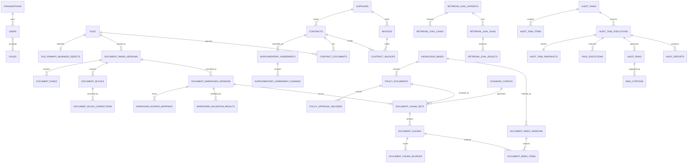

# FinAudit Agent 数据库设计说明书

## 文档信息

| 项目 | 内容 |
|---|---|
| 项目名称 | FinAudit Agent——企业财务文档智能审核与风险分析平台 |
| 文档名称 | 数据库设计说明书 |
| 文档版本 | V1.0 |
| 需求基线 | 《FinAudit Agent 项目需求规格说明书 V1.3》 |
| 编制日期 | 2026-08-05 |
| 数据库范围 | PostgreSQL、Qdrant；Neo4j 为 P1 预留设计 |
| 目标读者 | 后端工程师、AI 工程师、数据库工程师、测试工程师、运维工程师、安全工程师 |
| 核心原则 | 从业务对象和业务流程推导；PostgreSQL 为唯一事实源；版本不可变；证据可追溯；人工操作可审计；向量与关系图均为可重建派生数据 |

## 已批准变更同步

| 变更 | 日期 | 数据库影响 | 状态 |
|---|---|---|---|
| `CR-001-R2` | 2026-08-07 | P0 核心表由 55 张调整为 57 张；新增 `async_job_steps`、`break_glass_requests`，补齐上传意图、强制换密、可恢复 Job、六态扫描、bootstrap、规则与分块种子所有权 | 已批准合同 |
| `CR-002-R4` | 2026-08-07 | `ai_call_logs/outbox_events` 增加发送前预算预留、顺序事件、未知结果、Policy/价格版本和幂等投影合同 | 已批准 contract；Provider 网络与生产未放行 |
| `CR-012-R3` | 2026-08-09 | 冻结 `contracts/invoices/suppliers` 的规范字符串、条件唯一、来源矩阵、四个循环外键以及 `20260807_006` 原子升级/空表降级合同 | 已批准 contract；仅授权九份 Request 同步、空表 DDL/ORM 和离线/专用合成 PostgreSQL 16 验证；业务运行时、真实数据、Provider、部署与 production 未放行 |
| `CR-004-R2` | 2026-08-09 | approved contract scope：冻结 reliability 三表完整列、状态/字段矩阵、索引、四函数/trigger、删除边界和 `20260807_007` ownership | 已批准 contract；只授权空表 DDL/ORM 与本地/专用合成 PostgreSQL 16 验证 |
| `CR-011-R4` | 2026-08-09 | 同步 `AiCallEventV1` 与未来 AI-005 投影兼容说明；表、列、约束、migration 和 seed 增量为 0 | 已批准 contract；只授权 11 文件同步与 BASE-004 contract/offline Gate B，持久 runtime 未授权 |
| `CR-011-R5` | 2026-08-10 | approved contract-offline startup scope：同步本地启动采用的零数据库边界 | 已批准 contract；表、列、migration、seed、Repository 与 AI-005 投影增量均为 0，持久 runtime 未授权 |
| `CR-011-R6` | 2026-08-10 | approved startup evidence-boundary successor：同步 startup evidence 的零数据库变化 | 已批准 contract；表、列、migration、Repository 与 AI-005 增量为 0，持久 runtime 未授权 |
| `CR-003-R3` | 2026-08-11 | approved privileged-auth current-baseline successor：同步 R1/R2 effective contract 的既有数据库约束 | 已批准 contract；同步本身不建表；Gate B PASS 后才授权 `20260807_008` 两空表 Gate C，Repository/runtime/ACL/真实数据不授权 |

---

## 已批准 CR-004-R2 reliability 数据合同

本节完整列集与状态边界规范性替换 5.2.12、5.2.13、5.6.2 中不一致或不完整的旧说明。

`async_jobs` 完整列集固定为：

```text
id, organization_id, job_type, resource_type, resource_id, status, stage,
attempt_no, max_attempts, current_attempt_start_step_code, next_retry_at,
worker_id, started_at, finished_at, error_code, error_message, input_hash,
input_json, input_schema_version, idempotency_record_id,
handler_registry_version, handler_registry_hash,
retry_policy_version, retry_policy_hash, lease_policy_version, lease_policy_hash,
lease_owner, lease_expires_at, heartbeat_at, row_version, trace_id, created_by, created_at
```

`async_job_steps` 完整列集固定为：

```text
id, job_id, step_seq, step_code, status, attempt_no, started_at, finished_at,
summary_json, error_code, trace_id
```

`outbox_events` 完整列集固定为：

```text
id, aggregate_type, aggregate_id, event_id, event_type, event_version,
event_sequence, payload_json, status, attempt_count, next_attempt_at,
published_at, last_error, trace_id, created_at
```

- Job 状态闭集为 `queued/running/cancel_requested/succeeded/failed/cancelled`。初始 queued 必须为 `attempt_no=0/max_attempts>=1/row_version=1`，无 stage、时间、错误或 Lease；任何可变写入以 `id + status + expected row_version` CAS，成功时 `row_version` 恰增一。running/cancel_requested 必须有 started/stage 及完整 Worker/Lease；终态清空 Worker/Lease，时间、stage、错误和 retry 时间按 effective contract 状态矩阵强制。
- `current_attempt_start_step_code` 为 1～80 位、匹配 `^[a-z][a-z0-9_]*$` 的非空值，并须命中 Job 冻结 Registry。初始 Job 取首步；partial retry 写 scope 映射；claim 保留；Lease recovery 不回退首步。每个 attempt 的 `step_seq` 是 Registry 绝对 1-based 位置，并从该起点形成连续片段。
- Step 状态闭集为 `running/succeeded/failed/cancelled/skipped`；仅允许一次 `running ->` 终态。唯一 UPDATE 白名单为 `status/finished_at/summary_json/error_code`；终态禁止 UPDATE，所有记录禁止 DELETE/TRUNCATE。固定唯一约束为 `UNIQUE(job_id,step_seq,attempt_no)`，并以部分唯一索引保证同一 `(job_id,attempt_no)` 只有一个 running Step。
- 延迟一致性在提交时保证 running/cancel_requested Job 恰有一条同 attempt 且 `stage=step_code` 的 running Step；其他 Job 不得留 running Step。Step 与 Job 的成功、失败或执行中取消必须在同一事务共享 `database_now` 和安全错误码。
- Outbox 状态机为 `pending -> processing`、`processing -> published|failed|dead_letter`、`failed -> processing|dead_letter`；published/dead_letter 终态。identity/payload/trace/created 字段插入后不可变，唯一 UPDATE 白名单为 `status/attempt_count/next_attempt_at/published_at/last_error`；所有记录禁止 DELETE/TRUNCATE。
- Outbox 初始 pending 为 attempt 0；processing 为 1..8；failed 只允许 1..7；published/dead_letter 为 1..8。每次 claim 原子加一并返回 `(id,attempt_count,next_attempt_at)` fencing；第八次失败或 processing lease 耗尽直接 `DELIVERY_ATTEMPTS_EXHAUSTED`，不得产生第九次。未知底层码只保存 `UNKNOWN_DELIVERY_ERROR`，不得保存 Broker 自由文本。
- 关键索引至少包括活动 Job `(organization_id,job_type,resource_type,resource_id,input_hash)` 条件唯一、Step 三列唯一与 running 部分唯一、Outbox `(event_id,event_type)` 唯一和 `(aggregate_type,aggregate_id,event_sequence)` 唯一，以及 Job/Outbox claim 查询索引。`job.dispatch.requested` 的 sequence 精确等于计划 attempt。
- 三表只由 `enforce_async_jobs_state_v1()`、`enforce_async_job_steps_state_v1()`、`enforce_job_step_consistency_v1()`、`enforce_outbox_events_state_v1()` 四个函数及其 row/constraint/TRUNCATE triggers 强制，不得增加第五个 helper function。Step/Outbox 的 DELETE 与 statement-level TRUNCATE 均须拒绝。
- 每个状态转换只捕获一次 `clock_timestamp()`；heartbeat、阶段/终态与业务结果只在 `database_now < lease_expires_at` 可写，recovery 只在 `database_now >= lease_expires_at + interval '15 seconds'` 可执行。`lease_owner` 由 PostgreSQL 生成 canonical lowercase UUIDv4，不能复用 `worker_id`。
- 唯一 owner revision 为 `20260807_007`，`down_revision=20260807_006`，文件名 `20260807_007_create_reliability_core.py`；同一 revision 按 Job→Step→Outbox 创建三张空表、全部约束/索引/trigger 和四函数，不播种任何业务、Registry 或 Policy 行，也不创建第四张表。
- 空表 downgrade 在单一事务设置 `lock_timeout='5s'`，按 Job→Step→Outbox 取得 `ACCESS EXCLUSIVE` 锁；锁超时为 `55P03`，任一表非空在 DDL 前以 `55000` 失败。通过后无 `CASCADE` 地按 Outbox→Step→Job 删表，再按固定逆向依赖顺序删除四函数；任一失败整事务回滚。

---

## 已批准 CR-011-R4 零数据库投影

- `AiCallEventV1` DTO、sequence 1/2/3、JCS/hash 与 Sink 结果合同只作为未来 AI-005 持久投影的兼容前置；本轮不创建或修改任何表、列、约束、索引、trigger、migration 或 seed。
- Fake/in-memory Sink 不得写数据库，也不得声明 durable、transactional、Outbox-backed、exactly-once 或 restart-safe。
- 未来 AI-005/BASE-005/006 的持久 reserve/complete、Outbox、late reconciliation 和 `ai_call_logs` 投影仍须另行批准并执行数据库 Gate；CR-011-R4 的 Gate B 不构成该授权。

## 已批准 CR-011-R5 零数据库投影

- 本地 Policy loader/adoption 不读取或写入数据库；表、列、约束、索引、trigger、migration、seed、Repository 和 AI-005 持久投影增量均为 0。
- R5 Gate C 的 startup 证据不构成 durable、transactional、Outbox-backed、Redis/Broker 或 production 数据库授权。

## 已批准 CR-011-R6 startup evidence-boundary 零数据库投影

- 表、列、migration、Repository 与 AI-005 的 delta 均为 0。

## 已批准 CR-003-R3 特权授权 current-baseline 数据库投影

本节精确绑定 R1 24270/cbe087aeb13f149fe6961f4daa71791ef8dd62b5d43bd1b1bb03b17c64cb8045、R2 35977/7a69b8555d422a7c2bee9d74da7030b8170692c934d83c12dd722c15c85c8363 与 R3 29321/35b1cdd758128afa485f91e34c5ef0dcfd95c4a648906e488099f68ff792e68c effective contract；R2 仍为 0/9 且未同步；与本文件中尚未同步的旧说明冲突时，以本节及 CR-003-R3 exact effective contract 为准。

- 保留 `decided_by/revoke_reason`、状态/来源矩阵、GiST `[)` 半开区间、不可变/双向/SoD trigger，以及 008 ownership 与安全 downgrade 语义。
- 同步本身不建表；`20260807_008` 只可在 Gate B PASS 后按 Gate C 创建两张空 storage 表，不授权 Repository、runtime、ACL、operation log 或真实数据。

---

# 1. 设计结论

1. **PostgreSQL 是 P0 唯一业务事实源。** 合同、补充协议、发票、制度、审核任务、风险、版本、审批、人工修改和审计日志均以 PostgreSQL 为准。
2. **MinIO 保存文件二进制，PostgreSQL 保存对象键、哈希和业务关系。** 数据库不保存大文件正文二进制。
3. **Qdrant 只保存向量和检索过滤所需的引用元数据。** 分块正文、制度状态和权限事实仍从 PostgreSQL 读取并校验。
4. **Neo4j 属于 P1 GraphRAG 能力。** Neo4j 不进入 P0 验收前置条件，不接受业务主写入，只从 PostgreSQL 的已提交事件增量同步。
5. **所有解析、Markdown、分块、索引、评测和审核执行均版本化。** 活动版本通过条件唯一索引保证唯一，历史版本不得覆盖。
6. **业务事实修正与技术派生版本变化分开处理。** 合同、发票、补充协议或主合同关系变化可使审核执行过期；Markdown、分块和索引变化不修改历史审核快照。
7. **审计数据追加写。** 人工修改记录、审批记录、风险复核记录、操作日志和 AI 调用摘要禁止原地覆盖和前台删除。
8. **P0 PostgreSQL 基线共 57 张核心表。** `BASE-005` 只写五个固定角色和版本化种子机制；不创建默认组织、默认管理员、真实规则行或组织级默认分块配置。

---

# 2. 从需求对象与流程推导数据模型

## 2.1 推导链路

| 需求对象或流程 | 数据事实 | 推导的数据对象 |
|---|---|---|
| 单组织、固定角色、职责分离与临时授权 | 企业、用户、角色、会话、角色分配、break-glass 审批 | `organizations`、`users`、`roles`、`user_roles`、`break_glass_requests`、`token_sessions` |
| 文件上传、存储、归档、去重 | 文件元数据、MinIO 对象键、哈希、状态 | `files` |
| 一个文件最多一个主要业务对象 | 文件与合同/发票/补充协议/制度的一对零或一关系 | `file_primary_business_objects` |
| 解析/OCR、页面、结构块、人工纠错 | 不可变解析版本、页面、块、纠错记录 | `document_parse_versions`、`document_pages`、`document_blocks`、`document_block_corrections` |
| 图片、印章、签字、复杂表格 | 文件资源及其来源位置 | `document_assets` |
| 页眉、页脚、水印、噪声排除 | 可审计排除项 | `document_content_exclusions` |
| Markdown 转换、质量校验、来源映射 | 不可变 Markdown、验证结果、原文映射 | `document_markdown_versions`、`markdown_validation_results`、`markdown_source_mappings` |
| 合同、补充协议及变更项 | 合同主数据、字段证据、协议和生效变更 | `contracts`、`contract_fields`、`supplementary_agreements`、`supplementary_agreement_changes` |
| 发票及明细 | 发票主数据、明细和字段证据摘要 | `invoices`、`invoice_items` |
| 供应商候选与确认 | 标准供应商主数据 | `suppliers` |
| 合同与发票候选/主关系 | 可解释候选、唯一主合同、取消原因 | `contract_invoices` |
| 制度业务审批、版本、有效期 | 知识库、制度版本、审批与发布记录 | `knowledge_bases`、`policy_documents`、`policy_approval_records` |
| Markdown 分块 | 分块配置、集合版本、分块和多来源映射 | `chunking_configs`、`document_chunk_sets`、`document_chunks`、`document_chunk_sources` |
| 知识库级索引 | 索引版本、成员清单、Qdrant point 映射 | `document_index_versions`、`document_index_items` |
| 检索命中率测试 | 数据集、用例、运行、逐题 Top-K 结果 | `retrieval_eval_datasets`、`retrieval_eval_cases`、`retrieval_eval_runs`、`retrieval_eval_results` |
| AI 问答及反馈 | 问题、答案、拒答、引用摘要、反馈 | `qa_queries`、`qa_feedback` |
| 审核任务与执行版本 | 稳定案件、关联对象、不可变执行、快照 | `audit_tasks`、`audit_task_items`、`audit_task_executions`、`audit_task_snapshots` |
| 规则、风险、引用和报告 | 规则版本、执行结果、风险、冻结引用、报告版本 | `audit_rules`、`rule_executions`、`audit_risks`、`risk_citations`、`audit_reports` |
| 人工修改和操作审计 | 字段/风险修改记录、完整操作日志 | `user_corrections`、`operation_logs` |
| AI 调用追踪 | 模型、Prompt、Schema、耗时和降级 | `ai_call_logs` |
| 异步任务与幂等 | 持久任务状态、追加写步骤、幂等结果、可靠事件 | `async_jobs`、`async_job_steps`、`idempotency_records`、`outbox_events` |

## 2.2 逻辑关系总览



---

# 3. PostgreSQL 物理设计规范

## 3.1 PostgreSQL 版本与扩展

建议使用 PostgreSQL 16.x，并启用：

```sql
CREATE EXTENSION IF NOT EXISTS pgcrypto;   -- gen_random_uuid()
CREATE EXTENSION IF NOT EXISTS btree_gist; -- 制度有效期排除约束
CREATE EXTENSION IF NOT EXISTS citext;     -- 用户名、邮箱不区分大小写
```

P0 不依赖 PostgreSQL 向量扩展，向量检索统一由 Qdrant 承担。

## 3.2 命名规范

- 表名、字段名：`snake_case`。
- 主键：统一为 `id UUID`。
- 外键：`<对象>_id`。
- 时间：`*_at TIMESTAMPTZ`。
- 业务日期：`*_date`、`effective_from`、`effective_to` 使用 `DATE`。
- 金额：`NUMERIC(18,2)`。
- 税率：`NUMERIC(8,6)`。
- 哈希：SHA-256 使用 `CHAR(64)`。
- 状态：`VARCHAR(40)` + 命名 `CHECK` 约束；应用层使用 Python Enum。
- JSON：仅用于版本快照、可扩展配置、坐标和低频结构，不替代需要关联、唯一性或审计的核心字段。

## 3.3 主键与时间

```sql
id UUID PRIMARY KEY DEFAULT gen_random_uuid()
created_at TIMESTAMPTZ NOT NULL DEFAULT now()
updated_at TIMESTAMPTZ NOT NULL DEFAULT now()
```

所有数据库连接统一使用 UTC；前端按用户时区展示。

## 3.4 通用字段模板

### M1：可变主数据表

| 字段 | 类型 | 约束 |
|---|---|---|
| `id` | UUID | PK，默认 `gen_random_uuid()` |
| `organization_id` | UUID | FK → `organizations.id`；单组织表可省略 |
| `row_version` | BIGINT | NOT NULL DEFAULT 1；乐观锁 |
| `created_at` | TIMESTAMPTZ | NOT NULL DEFAULT now() |
| `created_by` | UUID | FK → `users.id`，系统初始化可为空 |
| `updated_at` | TIMESTAMPTZ | NOT NULL DEFAULT now() |
| `updated_by` | UUID | FK → `users.id` |
| `deleted_at` | TIMESTAMPTZ | 可空；软删除 |
| `deleted_by` | UUID | FK → `users.id` |
| `delete_reason` | TEXT | 软删除时必填 |

### I1：不可变版本/记录表

| 字段 | 类型 | 约束 |
|---|---|---|
| `id` | UUID | PK |
| `created_at` | TIMESTAMPTZ | NOT NULL DEFAULT now() |
| `created_by` | UUID | FK → `users.id`，系统任务可为空 |
| `trace_id` | UUID | 可空；关联 API/Worker/AI 调用 |
| `archived_at` | TIMESTAMPTZ | 可空；仅归档，不删除 |

不可变表允许通过受控状态动作更新 `status`、失败原因、批准人、激活时间等生命周期字段，但禁止覆盖正文、输入、版本号、哈希和快照。

## 3.5 数据完整性层级

1. **数据库硬约束**：主键、外键、非空、唯一、条件唯一、检查约束、排除约束。
2. **数据库触发器**：跨行、跨表、状态迁移、不可变性和职责分离。
3. **应用服务约束**：复杂权限、业务流程前置条件、证据覆盖率。
4. **离线一致性任务**：PostgreSQL 与 Qdrant point 数量、ID、版本和哈希校验。

---

# 4. 数据状态枚举

物理层采用 `VARCHAR + CHECK`，避免 PostgreSQL 原生 ENUM 在版本变更和回滚时难以收缩。以下为逻辑枚举。

## 4.1 文档链路枚举

| 枚举 | 允许值 |
|---|---|
| `file_status` | `uploaded`、`validating`、`stored`、`rejected`、`archived` |
| `security_scan_status` | `pending`、`clean`、`infected`、`scan_failed`、`unsupported`、`not_configured`；只有 `clean` 可进入解析 |
| `parse_version_status` | `queued`、`running`、`succeeded`、`manual_review_required`、`active`、`failed`、`superseded` |
| `markdown_version_status` | `queued`、`converting`、`validating`、`review_required`、`ready`、`active`、`failed`、`superseded`、`archived` |
| `chunk_set_status` | `queued`、`building`、`quality_review`、`ready`、`active`、`failed`、`blocked`、`superseded`、`archived` |
| `index_version_status` | `queued`、`building`、`consistency_check`、`evaluation_pending`、`approved`、`active`、`failed`、`rejected`、`superseded` |
| `validation_severity` | `info`、`warning`、`error`、`blocking` |
| `block_type` | `title`、`paragraph`、`list`、`table`、`quote`、`asset`、`other` |
| `asset_type` | `image`、`signature`、`seal`、`complex_table`、`attachment_fragment` |
| `exclusion_type` | `header`、`footer`、`page_number`、`watermark`、`duplicate_region`、`ocr_noise`、`other` |

## 4.2 业务对象枚举

| 枚举 | 允许值 |
|---|---|
| `file_business_type` | `contract`、`supplementary_agreement`、`invoice`、`policy` |
| `confirmation_status` | `unconfirmed`、`confirmed`、`rejected` |
| `contract_status` | `draft`、`active`、`expired`、`terminated`、`archived` |
| `supplementary_status` | `draft`、`pending_confirmation`、`confirmed`、`rejected`、`archived` |
| `invoice_status` | `draft`、`confirmed`、`voided`、`archived` |
| `duplicate_status` | `not_checked`、`unique`、`suspected`、`confirmed_duplicate`、`exception_approved` |
| `contract_invoice_status` | `candidate`、`suggested`、`confirmed_primary`、`cancelled` |
| `policy_status` | `draft`、`pending_business_review`、`approved`、`rejected`、`published`、`superseded`、`revoked`、`archived` |
| `approval_action` | `submit`、`approve`、`reject`、`publish`、`supersede`、`revoke`、`archive`、`return` |

## 4.3 审核与技术枚举

| 枚举 | 允许值 |
|---|---|
| `audit_execution_status` | `draft`、`validating`、`queued`、`running`、`pending_finance_review`、`pending_audit_review`、`returned_for_correction`、`completed`、`failed`、`cancelled`、`outdated` |
| `risk_level` | `none`、`notice`、`low`、`medium`、`high` |
| `risk_review_status` | `pending`、`confirmed`、`dismissed`、`adjusted` |
| `rule_execution_status` | `passed`、`failed`、`not_applicable`、`error` |
| `report_status` | `queued`、`generating`、`ready`、`failed`、`outdated`、`archived` |
| `job_status` | `queued`、`running`、`succeeded`、`failed`、`cancel_requested`、`cancelled` |
| `eval_dataset_status` | `draft`、`pending_review`、`approved`、`rejected`、`superseded`、`archived` |
| `eval_run_status` | `queued`、`running`、`succeeded`、`failed`、`cancelled` |
| `correction_type` | `document_block`、`contract_field`、`invoice_field`、`supplementary_change`、`contract_invoice_relation`、`risk_review` |
| `outbox_status` | `pending`、`processing`、`published`、`failed`、`dead_letter` |
| `ai_call_status` | `pending`、`succeeded`、`failed`、`degraded`、`rejected`、`outcome_unknown` |

---

# 5. PostgreSQL 表结构

## 5.1 组织、用户与权限

### 5.1.1 `organizations`

P0 仅允许一个企业主体。

| 字段 | 类型 | 约束/说明 |
|---|---|---|
| `id` | UUID | PK |
| `singleton_key` | SMALLINT | NOT NULL DEFAULT 1，CHECK = 1，UNIQUE；强制单组织 |
| `name` | VARCHAR(200) | NOT NULL |
| `unified_social_credit_code` | VARCHAR(32) | NOT NULL UNIQUE |
| `tax_number` | VARCHAR(32) | NOT NULL UNIQUE |
| `status` | VARCHAR(20) | NOT NULL，`active/inactive` |
| M1 字段 | — | 不含 `organization_id` |

索引：`uq_organizations_singleton(singleton_key)`。

### 5.1.2 `users`

| 字段 | 类型 | 约束/说明 |
|---|---|---|
| `id` | UUID | PK |
| `organization_id` | UUID | NOT NULL FK |
| `username` | CITEXT | NOT NULL |
| `email` | CITEXT | 可空 |
| `display_name` | VARCHAR(100) | NOT NULL |
| `password_hash` | VARCHAR(255) | NOT NULL |
| `status` | VARCHAR(20) | `active/disabled/locked` |
| `failed_login_count` | INTEGER | NOT NULL DEFAULT 0，CHECK >= 0 |
| `locked_until` | TIMESTAMPTZ | 可空 |
| `password_changed_at` | TIMESTAMPTZ | NOT NULL |
| `force_change_on_login` | BOOLEAN | NOT NULL DEFAULT FALSE；bootstrap 与管理员重置必须设为 TRUE |
| `token_invalid_before` | TIMESTAMPTZ | NOT NULL DEFAULT now()；禁用后使旧 Token 失效 |
| M1 字段 | — | — |

条件唯一索引：

```sql
CREATE UNIQUE INDEX uq_users_username_active
ON users (organization_id, username)
WHERE deleted_at IS NULL;

CREATE UNIQUE INDEX uq_users_email_active
ON users (organization_id, email)
WHERE email IS NOT NULL AND deleted_at IS NULL;
```

### 5.1.3 `roles`

| 字段 | 类型 | 约束/说明 |
|---|---|---|
| `id` | UUID | PK |
| `code` | VARCHAR(40) | NOT NULL UNIQUE；固定五种角色 |
| `name` | VARCHAR(100) | NOT NULL |
| `description` | TEXT | 可空 |
| `is_system_role` | BOOLEAN | NOT NULL DEFAULT TRUE |
| `is_enabled` | BOOLEAN | NOT NULL DEFAULT TRUE |
| `created_at` | TIMESTAMPTZ | NOT NULL |

固定代码：`system_admin`、`finance_reviewer`、`audit_reviewer`、`contract_admin`、`read_only`。

### 5.1.4 `user_roles`

| 字段 | 类型 | 约束/说明 |
|---|---|---|
| `id` | UUID | PK |
| `user_id` | UUID | NOT NULL FK → `users.id` |
| `role_id` | UUID | NOT NULL FK → `roles.id` |
| `assigned_by` | UUID | 可空 FK → `users.id`；只允许 bootstrap 分配为空 |
| `assignment_source` | VARCHAR(20) | NOT NULL，`bootstrap/user/break_glass` |
| `assigned_at` | TIMESTAMPTZ | NOT NULL DEFAULT now() |
| `expires_at` | TIMESTAMPTZ | 可空；break-glass 限时授权 |
| `break_glass_request_id` | UUID | 可空 FK → `break_glass_requests.id`；临时敏感角色必填 |
| `assignment_reason` | TEXT | 临时/敏感角色分配时必填 |
| `revoked_at` | TIMESTAMPTZ | 可空 |
| `revoked_by` | UUID | 可空 FK |
| `revoke_reason` | TEXT | 可空 |

有效分配使用条件唯一索引，撤销记录保留历史：

```sql
CREATE UNIQUE INDEX uq_user_role_active
ON user_roles(user_id, role_id)
WHERE revoked_at IS NULL;
```

重新分配时新建记录，不覆盖旧分配。

数据库 CHECK/触发器必须保证：`assignment_source='bootstrap'` 时 `assigned_by IS NULL`，普通 `user` 分配时 `assigned_by IS NOT NULL`；`break_glass` 分配必须引用已批准请求，目标用户、角色、`assigned_at` 和 `expires_at` 与请求完全一致。生产环境禁止同一有效账号同时长期拥有 `system_admin` 与 `finance_reviewer` 或 `audit_reviewer`。

### 5.1.5 `break_glass_requests`

该表保存双人控制的独立批准事实，记录不可物理删除，决定后的目标、角色、原因和请求时长不可原地覆盖。

| 字段 | 类型 | 约束/说明 |
|---|---|---|
| `id` | UUID | PK |
| `organization_id` | UUID | NOT NULL FK |
| `target_user_id` | UUID | NOT NULL FK → `users.id` |
| `target_role_code` | VARCHAR(40) | NOT NULL；只允许 `system_admin/finance_reviewer/audit_reviewer/contract_admin` |
| `requested_by` | UUID | NOT NULL FK → `users.id`；有效 `system_admin` |
| `reason` | TEXT | NOT NULL |
| `requested_duration_seconds` | INTEGER | NOT NULL，CHECK `1..14400` |
| `status` | VARCHAR(20) | `pending/approved/rejected/revoked/expired` |
| `effective_from` | TIMESTAMPTZ | 可空；批准时使用数据库当前时间 |
| `expires_at` | TIMESTAMPTZ | 可空；与临时角色分配一致 |
| `approved_by` | UUID | 可空 FK；必须是另一名有效 `system_admin`，且不同于请求人和目标用户 |
| `decision_at` | TIMESTAMPTZ | 可空 |
| `decision_reason` | TEXT | 可空；批准或拒绝时必填 |
| `revoked_by` | UUID | 可空 FK |
| `revoked_at` | TIMESTAMPTZ | 可空 |
| `row_version` | INTEGER | NOT NULL DEFAULT 1 |
| `created_at/updated_at` | TIMESTAMPTZ | NOT NULL |
| `trace_id` | UUID | NOT NULL |

批准请求与创建 `user_roles` 必须在同一事务完成。授权判定必须在查询时同时校验请求和角色的有效时间，不得仅依赖后台过期任务。禁止预约、延期、续期、自批、单管理员绕过、跨组织或向已持有同角色的用户重复授予。

### 5.1.6 `token_sessions`

| 字段 | 类型 | 约束/说明 |
|---|---|---|
| `id` | UUID | PK，会话 ID |
| `user_id` | UUID | NOT NULL FK |
| `refresh_token_hash` | CHAR(64) | NOT NULL UNIQUE；不保存明文 Token |
| `issued_at` | TIMESTAMPTZ | NOT NULL |
| `expires_at` | TIMESTAMPTZ | NOT NULL，CHECK > issued_at |
| `revoked_at` | TIMESTAMPTZ | 可空 |
| `revoke_reason` | VARCHAR(100) | 可空 |
| `ip_address` | INET | 可空 |
| `user_agent` | TEXT | 可空 |
| `last_seen_at` | TIMESTAMPTZ | 可空 |

索引：`idx_token_sessions_user_active(user_id, expires_at) WHERE revoked_at IS NULL`。

---

## 5.2 文件、解析、Markdown 与异步任务

### 5.2.1 `files`

| 字段 | 类型 | 约束/说明 |
|---|---|---|
| `id` | UUID | PK |
| `organization_id` | UUID | NOT NULL FK |
| `original_name` | VARCHAR(500) | NOT NULL |
| `extension` | VARCHAR(16) | NOT NULL |
| `mime_type` | VARCHAR(100) | NOT NULL |
| `detected_mime_type` | VARCHAR(100) | NOT NULL |
| `size_bytes` | BIGINT | NOT NULL，CHECK > 0 |
| `sha256` | CHAR(64) | NOT NULL |
| `minio_bucket` | VARCHAR(100) | NOT NULL |
| `minio_object_key` | VARCHAR(1000) | NOT NULL UNIQUE |
| `status` | VARCHAR(20) | NOT NULL，`file_status` |
| `intended_business_type` | VARCHAR(30) | NOT NULL；上传时冻结的主要业务类型 |
| `target_knowledge_base_id` | UUID | 可空 FK；仅 `intended_business_type='policy'` 时必填 |
| `auto_process_requested` | BOOLEAN | NOT NULL DEFAULT FALSE；只允许 `FALSE → TRUE` |
| `security_scan_status` | VARCHAR(20) | NOT NULL DEFAULT `pending`；`pending/clean/infected/scan_failed/unsupported/not_configured` |
| `rejection_code` | VARCHAR(80) | 可空 |
| `rejection_message` | TEXT | 可空 |
| `uploaded_by` | UUID | NOT NULL FK |
| `stored_at` | TIMESTAMPTZ | 可空 |
| M1 字段 | — | — |

去重索引：

```sql
CREATE UNIQUE INDEX uq_files_content_active
ON files (organization_id, sha256, size_bytes)
WHERE deleted_at IS NULL AND status <> 'rejected';
```

重复上传返回已有 `file_id`，不创建第二个文件事实。业务类型或目标知识库不一致时返回 `FILE_CLASSIFICATION_CONFLICT`；新请求把 `auto_process_requested` 从 FALSE 提升为 TRUE 时必须在行锁和幂等约束下原子升级并最多创建一个处理 Job，TRUE 不得被后续 FALSE 请求回退。

### 5.2.2 `file_primary_business_objects`

该表直接来自“一个文件最多创建一个主要合同、发票、补充协议或制度对象”的需求，避免跨四张业务表无法使用普通唯一约束的问题。

| 字段 | 类型 | 约束/说明 |
|---|---|---|
| `id` | UUID | PK |
| `file_id` | UUID | NOT NULL UNIQUE FK → `files.id` |
| `business_type` | VARCHAR(40) | NOT NULL，`file_business_type` |
| `contract_id` | UUID | 可空 UNIQUE FK |
| `invoice_id` | UUID | 可空 UNIQUE FK |
| `supplementary_agreement_id` | UUID | 可空 UNIQUE FK |
| `policy_document_id` | UUID | 可空 UNIQUE FK |
| `bound_at` | TIMESTAMPTZ | NOT NULL |
| `bound_by` | UUID | NOT NULL FK |

检查约束：四个业务外键必须且只能有一个非空，并与 `business_type` 一致；约束触发器还必须保证 `file_primary_business_objects.business_type = files.intended_business_type`。该绑定记录不可原地改绑或删除；错误分类通过归档错误业务对象、记录审计原因并执行受控数据修复处理，避免同一文件产生多个历史主对象。

### 5.2.3 `document_assets`

| 字段 | 类型 | 约束/说明 |
|---|---|---|
| `id` | UUID | PK；用于 `asset://<id>` |
| `file_id` | UUID | NOT NULL FK |
| `parse_version_id` | UUID | NOT NULL FK |
| `page_no` | INTEGER | NOT NULL，CHECK > 0 |
| `asset_type` | VARCHAR(40) | NOT NULL |
| `bbox_json` | JSONB | 可空；坐标不可得时为空 |
| `coordinate_unavailable_reason` | TEXT | 坐标为空时必填 |
| `mime_type` | VARCHAR(100) | NOT NULL |
| `minio_object_key` | VARCHAR(1000) | NOT NULL UNIQUE |
| `content_sha256` | CHAR(64) | NOT NULL |
| `security_status` | VARCHAR(20) | NOT NULL |
| `metadata_json` | JSONB | NOT NULL DEFAULT `{}` |
| I1 字段 | — | — |

### 5.2.4 `document_parse_versions`

| 字段 | 类型 | 约束/说明 |
|---|---|---|
| `id` | UUID | PK |
| `file_id` | UUID | NOT NULL FK |
| `version_no` | INTEGER | NOT NULL，CHECK > 0 |
| `parent_version_id` | UUID | 可空 FK；人工纠错或重试来源 |
| `source_type` | VARCHAR(20) | `parser/ocr/manual_correction` |
| `parser_name` | VARCHAR(100) | NOT NULL |
| `parser_version` | VARCHAR(100) | NOT NULL |
| `ocr_name` | VARCHAR(100) | 可空 |
| `ocr_version` | VARCHAR(100) | 可空 |
| `code_version` | VARCHAR(100) | NOT NULL |
| `status` | VARCHAR(40) | NOT NULL |
| `page_count` | INTEGER | CHECK >= 0 |
| `raw_text_object_key` | VARCHAR(1000) | 可空；大文本存 MinIO |
| `raw_text_sha256` | CHAR(64) | 可空 |
| `average_confidence` | NUMERIC(6,5) | 可空，CHECK 0..1 |
| `error_code` | VARCHAR(80) | 可空 |
| `error_message` | TEXT | 可空 |
| `activated_at` | TIMESTAMPTZ | 可空 |
| `superseded_at` | TIMESTAMPTZ | 可空 |
| I1 字段 | — | — |

约束：

```sql
UNIQUE (file_id, version_no);

CREATE UNIQUE INDEX uq_parse_version_active
ON document_parse_versions(file_id)
WHERE status = 'active' AND archived_at IS NULL;
```

### 5.2.5 `document_pages`

| 字段 | 类型 | 约束/说明 |
|---|---|---|
| `id` | UUID | PK |
| `parse_version_id` | UUID | NOT NULL FK |
| `page_no` | INTEGER | NOT NULL，CHECK > 0 |
| `width` | NUMERIC(12,4) | 可空 |
| `height` | NUMERIC(12,4) | 可空 |
| `unit` | VARCHAR(20) | `pixel/point/unknown` |
| `page_text` | TEXT | 可空 |
| `text_sha256` | CHAR(64) | 可空 |
| `preview_object_key` | VARCHAR(1000) | 可空 |
| `confidence` | NUMERIC(6,5) | 可空，CHECK 0..1 |
| `metadata_json` | JSONB | NOT NULL DEFAULT `{}` |

唯一约束：`UNIQUE(parse_version_id, page_no)`。

### 5.2.6 `document_blocks`

| 字段 | 类型 | 约束/说明 |
|---|---|---|
| `id` | UUID | PK |
| `parse_version_id` | UUID | NOT NULL FK |
| `page_id` | UUID | NOT NULL FK |
| `block_index` | INTEGER | NOT NULL，CHECK >= 0 |
| `block_type` | VARCHAR(30) | NOT NULL |
| `text_content` | TEXT | 可空；资源块可为空 |
| `text_sha256` | CHAR(64) | 可空 |
| `bbox_json` | JSONB | 可空 |
| `reading_order` | INTEGER | NOT NULL |
| `confidence` | NUMERIC(6,5) | 可空，CHECK 0..1 |
| `asset_id` | UUID | 可空 FK |
| `is_effective_content` | BOOLEAN | NOT NULL DEFAULT TRUE |
| `metadata_json` | JSONB | NOT NULL DEFAULT `{}` |

唯一约束：`UNIQUE(parse_version_id, block_index)`；索引：`(parse_version_id, page_id, reading_order)`。

### 5.2.7 `document_block_corrections`

追加写，不修改历史纠错。

| 字段 | 类型 | 约束/说明 |
|---|---|---|
| `id` | UUID | PK |
| `source_parse_version_id` | UUID | NOT NULL FK |
| `source_block_id` | UUID | NOT NULL FK |
| `result_parse_version_id` | UUID | 可空 FK；新版本创建后回填 |
| `field_name` | VARCHAR(40) | `text_content/block_type/reading_order/bbox` |
| `before_value_json` | JSONB | NOT NULL |
| `after_value_json` | JSONB | NOT NULL |
| `reason` | TEXT | NOT NULL |
| `corrected_by` | UUID | NOT NULL FK |
| `corrected_at` | TIMESTAMPTZ | NOT NULL |
| `trace_id` | UUID | NOT NULL |

禁止 UPDATE/DELETE。

### 5.2.8 `document_content_exclusions`

| 字段 | 类型 | 约束/说明 |
|---|---|---|
| `id` | UUID | PK |
| `parse_version_id` | UUID | NOT NULL FK |
| `block_id` | UUID | NOT NULL FK |
| `exclusion_type` | VARCHAR(40) | NOT NULL |
| `reason` | TEXT | NOT NULL |
| `rule_version` | VARCHAR(100) | 可空 |
| `review_status` | VARCHAR(20) | `pending/approved/rejected` |
| `submitted_by` | UUID | 可空 FK |
| `approved_by` | UUID | 可空 FK |
| `approved_at` | TIMESTAMPTZ | 可空 |
| I1 字段 | — | — |

通过约束或触发器要求 `review_status='approved'` 时 `approved_by/approved_at` 非空。

### 5.2.9 `document_markdown_versions`

| 字段 | 类型 | 约束/说明 |
|---|---|---|
| `id` | UUID | PK |
| `file_id` | UUID | NOT NULL FK |
| `parse_version_id` | UUID | NOT NULL FK |
| `version_no` | INTEGER | NOT NULL |
| `converter_name` | VARCHAR(100) | NOT NULL |
| `converter_version` | VARCHAR(100) | NOT NULL |
| `schema_version` | VARCHAR(50) | NOT NULL |
| `code_version` | VARCHAR(100) | NOT NULL |
| `status` | VARCHAR(40) | NOT NULL |
| `markdown_text` | TEXT | NOT NULL；P0 50MB 文件上限可接受，超阈值可迁移 MinIO |
| `content_sha256` | CHAR(64) | NOT NULL |
| `char_count` | INTEGER | NOT NULL，CHECK >= 0 |
| `token_count` | INTEGER | 可空，CHECK >= 0 |
| `document_metadata_json` | JSONB | NOT NULL DEFAULT `{}`；不进入可分块正文 |
| `quality_summary_json` | JSONB | NOT NULL DEFAULT `{}` |
| `warning_count` | INTEGER | NOT NULL DEFAULT 0 |
| `blocking_issue_count` | INTEGER | NOT NULL DEFAULT 0 |
| `failure_reason` | TEXT | 可空 |
| `activated_at` | TIMESTAMPTZ | 可空 |
| `superseded_at` | TIMESTAMPTZ | 可空 |
| I1 字段 | — | — |

约束：

```sql
UNIQUE(file_id, version_no);
UNIQUE(parse_version_id, converter_version, schema_version, content_sha256);

CREATE UNIQUE INDEX uq_markdown_version_active
ON document_markdown_versions(file_id)
WHERE status = 'active' AND archived_at IS NULL;
```

### 5.2.10 `markdown_source_mappings`

| 字段 | 类型 | 约束/说明 |
|---|---|---|
| `id` | UUID | PK |
| `markdown_version_id` | UUID | NOT NULL FK |
| `ast_node_id` | VARCHAR(200) | NOT NULL |
| `mapping_type` | VARCHAR(30) | `source/generated_metadata/formatting` |
| `md_char_start` | INTEGER | NOT NULL，CHECK >= 0 |
| `md_char_end` | INTEGER | NOT NULL，CHECK > `md_char_start` |
| `md_line_start` | INTEGER | 可空 |
| `md_line_end` | INTEGER | 可空 |
| `page_id` | UUID | 可空 FK |
| `block_id` | UUID | 可空 FK |
| `bbox_json` | JSONB | 可空 |
| `coverage_status` | VARCHAR(20) | `full/partial/not_applicable` |
| `coordinate_unavailable_reason` | TEXT | 可空 |

唯一索引：`(markdown_version_id, ast_node_id, md_char_start, md_char_end, block_id)`。

业务约束：`mapping_type='source'` 时 `page_id` 和 `block_id` 不得同时为空。

### 5.2.11 `markdown_validation_results`

| 字段 | 类型 | 约束/说明 |
|---|---|---|
| `id` | UUID | PK |
| `markdown_version_id` | UUID | NOT NULL FK |
| `validator_code` | VARCHAR(80) | NOT NULL |
| `validator_version` | VARCHAR(80) | NOT NULL |
| `severity` | VARCHAR(20) | NOT NULL |
| `issue_code` | VARCHAR(80) | NOT NULL |
| `message` | TEXT | NOT NULL |
| `ast_node_id` | VARCHAR(200) | 可空 |
| `md_char_start` | INTEGER | 可空 |
| `md_char_end` | INTEGER | 可空 |
| `source_block_id` | UUID | 可空 FK |
| `is_blocking` | BOOLEAN | NOT NULL |
| `details_json` | JSONB | NOT NULL DEFAULT `{}` |
| `created_at` | TIMESTAMPTZ | NOT NULL |

索引：`(markdown_version_id, is_blocking, severity)`。

### 5.2.12 `async_jobs`

Redis 负责队列和锁，PostgreSQL 保存持久状态。

| 字段 | 类型 | 约束/说明 |
|---|---|---|
| `id` | UUID | PK，对外 `job_id` |
| `organization_id` | UUID | NOT NULL FK |
| `job_type` | VARCHAR(60) | `parse/markdown/chunk/index/eval/audit/report/...` |
| `resource_type` | VARCHAR(60) | NOT NULL |
| `resource_id` | UUID | NOT NULL |
| `status` | VARCHAR(30) | NOT NULL |
| `stage` | VARCHAR(80) | 可空；不保存虚假百分比 |
| `attempt_no` | INTEGER | NOT NULL DEFAULT 0 |
| `max_attempts` | INTEGER | NOT NULL |
| `next_retry_at` | TIMESTAMPTZ | 可空 |
| `worker_id` | VARCHAR(100) | 可空 |
| `started_at` | TIMESTAMPTZ | 可空 |
| `finished_at` | TIMESTAMPTZ | 可空 |
| `error_code` | VARCHAR(80) | 可空 |
| `error_message` | TEXT | 可空 |
| `input_hash` | CHAR(64) | NOT NULL |
| `input_json` | JSONB | NOT NULL；只保存稳定标识、版本和参数，不保存正文或 secret |
| `input_schema_version` | INTEGER | NOT NULL |
| `idempotency_record_id` | UUID | 可空 FK → `idempotency_records.id` |
| `lease_owner` | VARCHAR(100) | 可空 |
| `lease_expires_at` | TIMESTAMPTZ | 可空 |
| `heartbeat_at` | TIMESTAMPTZ | 可空 |
| `trace_id` | UUID | NOT NULL |
| `created_by` | UUID | 可空 FK |
| `created_at` | TIMESTAMPTZ | NOT NULL |

索引：`(status, next_retry_at)`、`(resource_type, resource_id, created_at DESC)`。对 `queued/running/cancel_requested` 建立 `(organization_id, job_type, resource_type, resource_id, input_hash)` 条件唯一约束。同一 Job 重试沿用 `job_id` 并递增 `attempt_no`；Lease 到期且心跳超时后才允许恢复。

### 5.2.13 `async_job_steps`

追加写记录每次 Job 尝试的步骤历史；已完成步骤禁止 UPDATE/DELETE。

| 字段 | 类型 | 约束/说明 |
|---|---|---|
| `id` | UUID | PK |
| `job_id` | UUID | NOT NULL FK → `async_jobs.id` |
| `step_seq` | INTEGER | NOT NULL，CHECK > 0 |
| `step_code` | VARCHAR(80) | NOT NULL |
| `status` | VARCHAR(30) | NOT NULL |
| `attempt_no` | INTEGER | NOT NULL，CHECK > 0 |
| `started_at/finished_at` | TIMESTAMPTZ | 开始必填，结束可空 |
| `summary_json` | JSONB | NOT NULL DEFAULT `{}`；只保存脱敏摘要 |
| `error_code` | VARCHAR(80) | 可空 |
| `trace_id` | UUID | NOT NULL |

唯一：`UNIQUE(job_id, step_seq, attempt_no)`。Outbox 只投递 `job_id` 与事件 Schema 版本，Worker 从 PostgreSQL 重新读取权威输入和状态。

---

## 5.3 合同、补充协议、发票与供应商

`CR-012-R3/FIN-D-001～006` 已在 `contract` 范围批准。`contract_no` 和供应商 generic `tax_number` 只接受 `NULL` 或已经规范化的非空字符串：禁止 U+0000～U+001F、U+007F～U+009F，去除两端 ASCII space 后必须非空，保存值不得含首尾 ASCII space；不做 Unicode normalization、音译、大小写转换或字符替换。PostgreSQL 本身拒绝 NUL 与 surrogate；每个对应命名 CHECK 必须展开为下列等价表达式，并以 `COLLATE "C"` 按保存值精确比较：

```sql
value IS NULL OR (
  (value COLLATE "C") <> ('' COLLATE "C")
  AND (value COLLATE "C") = (btrim(value, ' ') COLLATE "C")
  AND (value COLLATE "C") !~ U&'[\0001-\001F\007F-\009F]'
)
```

`unified_social_credit_code` 还必须满足 `(value COLLATE "C") ~ '^[0-9A-Z]+$'`，只保存非空 ASCII `0-9/A-Z`。可信输入边界未来只可对该字段执行 ASCII lowercase → uppercase；不得据长度、字符形状或模型文字猜测字段类型。Migration 不改写既有值；非规范输入必须拒绝并进入另行批准的纠错流程。

### 5.3.1 `contracts`

| 字段 | 类型 | 约束/说明 |
|---|---|---|
| `id` | UUID | PK |
| `organization_id` | UUID | NOT NULL FK |
| `contract_no` | VARCHAR(100) | 可空；非空值满足 5.3 节规范字符串 CHECK |
| `name` | VARCHAR(300) | NOT NULL |
| `party_a_name` | VARCHAR(300) | 可空 |
| `party_a_tax_no` | VARCHAR(32) | 可空 |
| `party_b_name` | VARCHAR(300) | 可空 |
| `party_b_tax_no` | VARCHAR(32) | 可空 |
| `supplier_id` | UUID | 可空 FK → `suppliers.id`；默认 `NO ACTION`，由 `20260807_006` 建表后添加 |
| `amount` | NUMERIC(18,2) | 可空，CHECK >= 0 |
| `currency` | CHAR(3) | 可空 |
| `signed_date` | DATE | 可空 |
| `effective_date` | DATE | 可空 |
| `expiry_date` | DATE | 可空，CHECK >= effective_date |
| `payment_method` | VARCHAR(100) | 可空 |
| `payment_terms` | TEXT | 可空 |
| `confirmation_status` | VARCHAR(20) | NOT NULL；CHECK `unconfirmed/confirmed/rejected` |
| `status` | VARCHAR(20) | NOT NULL；CHECK `draft/active/expired/terminated/archived` |
| `confirmed_by` | UUID | 可空 FK |
| `confirmed_at` | TIMESTAMPTZ | 可空 |
| `critical_fact_hash` | CHAR(64) | NOT NULL；用于识别已完成执行是否过期 |
| M1 字段 | — | — |

合同编号为空时允许多个合同；非空时在同一组织、全部业务状态、仅未软删除记录中按保存值唯一。`draft/active/expired/terminated/archived` 均占用编号，软删除释放编号：

```sql
CREATE UNIQUE INDEX uq_contracts_organization_contract_no
ON contracts (organization_id, (contract_no COLLATE "C"))
WHERE contract_no IS NOT NULL
  AND deleted_at IS NULL;
```

合同金额 CHECK 为 `amount IS NULL OR amount >= 0`；日期 CHECK 要求 `expiry_date` 与 `effective_date` 同时非空时 `expiry_date >= effective_date`。M1 软删除 CHECK 继续要求 `deleted_at` 非空时提供非空白 `delete_reason`。API 状态码、业务错误码和响应投影不在本存储合同内，由 GAP-064 继续阻断。

### 5.3.2 `contract_fields`

保存可扩展条款字段、候选值、人工确认和证据。

| 字段 | 类型 | 约束/说明 |
|---|---|---|
| `id` | UUID | PK |
| `contract_id` | UUID | NOT NULL FK |
| `field_code` | VARCHAR(80) | NOT NULL |
| `value_type` | VARCHAR(20) | `string/number/date/json` |
| `extracted_value_json` | JSONB | 可空 |
| `confirmed_value_json` | JSONB | 可空 |
| `confidence` | NUMERIC(6,5) | 可空，CHECK 0..1 |
| `confirmation_status` | VARCHAR(20) | NOT NULL |
| `evidence_file_id` | UUID | 可空 FK |
| `evidence_parse_version_id` | UUID | 可空 FK |
| `evidence_block_id` | UUID | 可空 FK |
| `page_no` | INTEGER | 可空 |
| `quote_text` | TEXT | 可空 |
| `bbox_json` | JSONB | 可空 |
| `confirmed_by` | UUID | 可空 FK |
| `confirmed_at` | TIMESTAMPTZ | 可空 |
| `row_version` | BIGINT | NOT NULL DEFAULT 1 |

唯一约束：`UNIQUE(contract_id, field_code)`。

### 5.3.3 `supplementary_agreements`

| 字段 | 类型 | 约束/说明 |
|---|---|---|
| `id` | UUID | PK |
| `organization_id` | UUID | NOT NULL FK |
| `contract_id` | UUID | NOT NULL FK |
| `agreement_no` | VARCHAR(100) | 可空 |
| `name` | VARCHAR(300) | NOT NULL |
| `signed_date` | DATE | 可空 |
| `effective_date` | DATE | NOT NULL |
| `status` | VARCHAR(30) | NOT NULL |
| `confirmation_status` | VARCHAR(20) | NOT NULL |
| `confirmed_by` | UUID | 可空 FK |
| `confirmed_at` | TIMESTAMPTZ | 可空 |
| `confirmation_reason` | TEXT | 可空 |
| `critical_fact_hash` | CHAR(64) | NOT NULL |
| M1 字段 | — | — |

索引：`(contract_id, effective_date, status)`。

### 5.3.4 `supplementary_agreement_changes`

| 字段 | 类型 | 约束/说明 |
|---|---|---|
| `id` | UUID | PK |
| `supplementary_agreement_id` | UUID | NOT NULL FK |
| `field_code` | VARCHAR(80) | NOT NULL |
| `value_type` | VARCHAR(20) | NOT NULL |
| `old_value_json` | JSONB | 可空 |
| `new_value_json` | JSONB | NOT NULL |
| `evidence_block_id` | UUID | 可空 FK |
| `page_no` | INTEGER | 可空 |
| `quote_text` | TEXT | 可空 |
| `bbox_json` | JSONB | 可空 |
| `confirmation_status` | VARCHAR(20) | NOT NULL |
| `confirmed_by` | UUID | 可空 FK |
| `confirmed_at` | TIMESTAMPTZ | 可空 |

唯一约束：`UNIQUE(supplementary_agreement_id, field_code)`。若同一字段允许多次变更，增加 `change_seq` 并改为三列唯一。

### 5.3.5 `contract_documents`

普通附件关系，不替代补充协议实体。

| 字段 | 类型 | 约束/说明 |
|---|---|---|
| `id` | UUID | PK |
| `contract_id` | UUID | NOT NULL FK |
| `file_id` | UUID | NOT NULL FK |
| `document_role` | VARCHAR(40) | `attachment/evidence/other` |
| `description` | TEXT | 可空 |
| `linked_by` | UUID | NOT NULL FK |
| `linked_at` | TIMESTAMPTZ | NOT NULL |
| `unlinked_at` | TIMESTAMPTZ | 可空 |
| `unlink_reason` | TEXT | 可空 |

条件唯一索引：活动关系 `UNIQUE(contract_id, file_id, document_role)`。

### 5.3.6 `invoices`

不设置发票号硬唯一约束，因为重复发票必须保留并进入规则判断。

| 字段 | 类型 | 约束/说明 |
|---|---|---|
| `id` | UUID | PK |
| `organization_id` | UUID | NOT NULL FK |
| `invoice_code` | VARCHAR(50) | 可空 |
| `invoice_number` | VARCHAR(50) | 可空 |
| `invoice_type` | VARCHAR(40) | 可空 |
| `invoice_date` | DATE | 可空 |
| `buyer_name` | VARCHAR(300) | 可空 |
| `buyer_tax_no` | VARCHAR(32) | 可空 |
| `seller_name` | VARCHAR(300) | 可空 |
| `seller_tax_no` | VARCHAR(32) | 可空 |
| `supplier_id` | UUID | 可空 FK → `suppliers.id`；默认 `NO ACTION`，由 `20260807_006` 建表后添加 |
| `amount_excluding_tax` | NUMERIC(18,2) | 可空 |
| `tax_amount` | NUMERIC(18,2) | 可空 |
| `total_amount` | NUMERIC(18,2) | 可空 |
| `currency` | CHAR(3) | NOT NULL DEFAULT `CNY` |
| `confirmation_status` | VARCHAR(20) | NOT NULL；CHECK `unconfirmed/confirmed/rejected` |
| `duplicate_status` | VARCHAR(30) | NOT NULL DEFAULT `not_checked`；CHECK `not_checked/unique/suspected/confirmed_duplicate/exception_approved` |
| `status` | VARCHAR(20) | NOT NULL；CHECK `draft/confirmed/voided/archived` |
| `field_evidence_json` | JSONB | NOT NULL DEFAULT `{}`；固定核心字段证据 |
| `confirmed_by` | UUID | 可空 FK |
| `confirmed_at` | TIMESTAMPTZ | 可空 |
| `critical_fact_hash` | CHAR(64) | NOT NULL |
| M1 字段 | — | — |

重复检测索引：

```sql
CREATE INDEX idx_invoices_duplicate_lookup
ON invoices (organization_id, invoice_code, invoice_number, seller_tax_no)
WHERE deleted_at IS NULL AND status <> 'voided';
```

### 5.3.7 `invoice_items`

| 字段 | 类型 | 约束/说明 |
|---|---|---|
| `id` | UUID | PK |
| `invoice_id` | UUID | NOT NULL FK |
| `line_no` | INTEGER | NOT NULL，CHECK > 0 |
| `item_name` | VARCHAR(500) | 可空 |
| `specification` | VARCHAR(300) | 可空 |
| `unit` | VARCHAR(50) | 可空 |
| `quantity` | NUMERIC(18,6) | 可空 |
| `unit_price` | NUMERIC(18,6) | 可空 |
| `amount_excluding_tax` | NUMERIC(18,2) | 可空 |
| `tax_rate` | NUMERIC(8,6) | 可空，CHECK 0..1 |
| `tax_amount` | NUMERIC(18,2) | 可空 |
| `total_amount` | NUMERIC(18,2) | 可空 |
| `evidence_json` | JSONB | NOT NULL DEFAULT `{}` |
| `row_version` | BIGINT | NOT NULL DEFAULT 1 |

唯一约束：`UNIQUE(invoice_id, line_no)`。

### 5.3.8 `suppliers`

| 字段 | 类型 | 约束/说明 |
|---|---|---|
| `id` | UUID | PK |
| `organization_id` | UUID | NOT NULL FK |
| `standard_name` | VARCHAR(300) | NOT NULL |
| `unified_social_credit_code` | VARCHAR(32) | 可空；非空值满足 5.3 节 ASCII 大写规范 CHECK |
| `tax_number` | VARCHAR(32) | 可空；非空值满足 5.3 节 generic 规范字符串 CHECK |
| `source_type` | VARCHAR(30) | NOT NULL，无数据库默认；CHECK `contract/invoice/manual` |
| `source_contract_id` | UUID | 可空 FK → `contracts.id`；默认 `NO ACTION`，由 `20260807_006` 建表后添加 |
| `source_invoice_id` | UUID | 可空 FK → `invoices.id`；默认 `NO ACTION`，由 `20260807_006` 建表后添加 |
| `confirmation_status` | VARCHAR(20) | NOT NULL；CHECK `unconfirmed/confirmed/rejected` |
| `status` | VARCHAR(20) | NOT NULL，无数据库默认；CHECK `candidate/active/inactive` |
| `confirmed_by` | UUID | 可空 FK |
| `confirmed_at` | TIMESTAMPTZ | 可空 |
| M1 字段 | — | — |

`candidate/inactive` 可以没有税务身份；`active` 至少一个税务身份列非空。两个税务身份列同时非空时必须按 C collation 逐字相同，数据库统一身份表达式固定为 `COALESCE(unified_social_credit_code, tax_number)`：

```sql
CHECK (
  unified_social_credit_code IS NULL
  OR tax_number IS NULL
  OR (unified_social_credit_code COLLATE "C") = (tax_number COLLATE "C")
);

CHECK (
  status <> 'active'
  OR COALESCE(unified_social_credit_code, tax_number) IS NOT NULL
);
```

来源矩阵 CHECK 固定为：

```sql
CHECK (
  (source_type = 'contract' AND source_contract_id IS NOT NULL AND source_invoice_id IS NULL)
  OR (source_type = 'invoice' AND source_contract_id IS NULL AND source_invoice_id IS NOT NULL)
  OR (source_type = 'manual' AND source_contract_id IS NULL AND source_invoice_id IS NULL)
);
```

来源外键不得使用 `CASCADE`。

只有未软删除的 `active` 供应商占用税务身份；`candidate/inactive` 与软删除行不占用，重新激活时重新校验。标准名称不强制唯一：

```sql
CREATE UNIQUE INDEX uq_suppliers_organization_tax_identity
ON suppliers (
  organization_id,
  (COALESCE(unified_social_credit_code, tax_number) COLLATE "C")
)
WHERE status = 'active'
  AND deleted_at IS NULL
  AND COALESCE(unified_social_credit_code, tax_number) IS NOT NULL;
```

#### 5.3.8.1 `20260807_006` 三表与循环外键

`contracts`、`invoices`、`suppliers` 必须在同一线性 revision、同一 PostgreSQL migration 事务中创建为空表，不写合同、发票、供应商或其他业务种子。先创建三表及其指向既有 `organizations/users` 的外键，再通过 `ALTER TABLE` 添加四个循环外键：

```text
contracts.supplier_id          -> suppliers.id
invoices.supplier_id           -> suppliers.id
suppliers.source_contract_id   -> contracts.id
suppliers.source_invoice_id    -> invoices.id
```

全部外键使用默认 `NO ACTION`；不得省略、禁用、改为 `CASCADE`，也不得把这些 PostgreSQL 事实转移到 Redis 或应用内存。本切片不实现 Supplier/Contract/Invoice Service、Router、状态转换、API 冲突映射、`SUPP-003`、CON-005 或 AI generic tax 投影；这些运行时事实仍由 GAP-064 阻断。

### 5.3.9 `contract_invoices`

| 字段 | 类型 | 约束/说明 |
|---|---|---|
| `id` | UUID | PK |
| `contract_id` | UUID | NOT NULL FK |
| `invoice_id` | UUID | NOT NULL FK |
| `status` | VARCHAR(30) | NOT NULL |
| `match_reasons_json` | JSONB | NOT NULL；税号、名称、日期等可解释依据 |
| `suggested_by` | VARCHAR(20) | `system/user` |
| `confirmed_by` | UUID | 可空 FK |
| `confirmed_at` | TIMESTAMPTZ | 可空 |
| `cancelled_by` | UUID | 可空 FK |
| `cancelled_at` | TIMESTAMPTZ | 可空 |
| `cancel_reason` | TEXT | 取消时必填 |
| `row_version` | BIGINT | NOT NULL DEFAULT 1 |
| `created_at` | TIMESTAMPTZ | NOT NULL |
| `created_by` | UUID | NOT NULL FK |
| `deleted_at` | TIMESTAMPTZ | 可空 |

约束：

```sql
CREATE UNIQUE INDEX uq_contract_invoice_pair_active
ON contract_invoices(contract_id, invoice_id)
WHERE deleted_at IS NULL AND status <> 'cancelled';

CREATE UNIQUE INDEX uq_invoice_confirmed_primary_contract
ON contract_invoices(invoice_id)
WHERE status = 'confirmed_primary' AND deleted_at IS NULL;
```

并发确认时，第二个事务由条件唯一索引拒绝。

---

## 5.4 制度、分块、索引和检索评测

### 5.4.1 `knowledge_bases`

| 字段 | 类型 | 约束/说明 |
|---|---|---|
| `id` | UUID | PK |
| `organization_id` | UUID | NOT NULL FK |
| `code` | VARCHAR(80) | NOT NULL |
| `name` | VARCHAR(200) | NOT NULL |
| `description` | TEXT | 可空 |
| `status` | VARCHAR(20) | `active/archived` |
| `default_top_k` | INTEGER | NOT NULL DEFAULT 5 |
| `default_score_threshold` | NUMERIC(8,6) | 可空 |
| M1 字段 | — | — |

唯一：`UNIQUE(organization_id, code)`（活动记录）。

### 5.4.2 `policy_documents`

一行表示一个制度业务版本。

| 字段 | 类型 | 约束/说明 |
|---|---|---|
| `id` | UUID | PK |
| `knowledge_base_id` | UUID | NOT NULL FK |
| `policy_code` | VARCHAR(100) | NOT NULL |
| `name` | VARCHAR(300) | NOT NULL |
| `version` | VARCHAR(50) | NOT NULL |
| `issuing_department` | VARCHAR(200) | 可空 |
| `effective_from` | DATE | NOT NULL |
| `effective_to` | DATE | 可空；左闭右开 |
| `scope_json` | JSONB | NOT NULL DEFAULT `{}` |
| `access_scope` | VARCHAR(40) | NOT NULL DEFAULT `internal` |
| `allowed_role_codes` | TEXT[] | NOT NULL DEFAULT `{}` |
| `status` | VARCHAR(40) | NOT NULL |
| `submitted_by` | UUID | 可空 FK |
| `submitted_at` | TIMESTAMPTZ | 可空 |
| `business_approved_by` | UUID | 可空 FK |
| `business_approved_at` | TIMESTAMPTZ | 可空 |
| `technical_published_by` | UUID | 可空 FK |
| `technical_published_at` | TIMESTAMPTZ | 可空 |
| `superseded_by_policy_id` | UUID | 可空 FK 自关联 |
| `revoked_at` | TIMESTAMPTZ | 可空 |
| `revoked_by` | UUID | 可空 FK |
| `revoke_reason` | TEXT | 可空 |
| M1 字段 | — | — |

唯一与有效期：

```sql
ALTER TABLE policy_documents
ADD CONSTRAINT uq_policy_code_version
UNIQUE (knowledge_base_id, policy_code, version);

ALTER TABLE policy_documents
ADD CONSTRAINT ex_policy_effective_range_no_overlap
EXCLUDE USING gist (
  knowledge_base_id WITH =,
  policy_code WITH =,
  daterange(effective_from, effective_to, '[)') WITH &&
)
WHERE (
  status IN ('published','superseded')
  AND deleted_at IS NULL
);
```

发布触发器要求：业务已批准、提交人与批准人不同、技术发布人与业务批准人职责分离、活动分块存在、所属活动索引包含该分块集合。

### 5.4.3 `policy_approval_records`

追加写，形成完整制度状态时间线。

| 字段 | 类型 | 约束/说明 |
|---|---|---|
| `id` | UUID | PK |
| `policy_document_id` | UUID | NOT NULL FK |
| `action` | VARCHAR(30) | NOT NULL |
| `from_status` | VARCHAR(40) | 可空 |
| `to_status` | VARCHAR(40) | NOT NULL |
| `actor_id` | UUID | NOT NULL FK |
| `actor_role_code` | VARCHAR(40) | NOT NULL；冻结操作时角色 |
| `reason` | TEXT | 敏感动作必填 |
| `related_index_version_id` | UUID | 可空 FK |
| `created_at` | TIMESTAMPTZ | NOT NULL |
| `trace_id` | UUID | NOT NULL |

禁止 UPDATE/DELETE。

### 5.4.4 `chunking_configs`

| 字段 | 类型 | 约束/说明 |
|---|---|---|
| `id` | UUID | PK |
| `organization_id` | UUID | NOT NULL FK |
| `name` | VARCHAR(150) | NOT NULL |
| `version` | INTEGER | NOT NULL |
| `strategy` | VARCHAR(50) | P0 固定 `markdown_ast_structural` |
| `target_length` | INTEGER | NOT NULL |
| `max_length` | INTEGER | NOT NULL |
| `min_length` | INTEGER | NOT NULL |
| `overlap_length` | INTEGER | NOT NULL |
| `title_handling_json` | JSONB | NOT NULL |
| `table_handling_json` | JSONB | NOT NULL |
| `noise_handling_json` | JSONB | NOT NULL |
| `config_hash` | CHAR(64) | NOT NULL |
| `status` | VARCHAR(20) | `draft/published/archived` |
| `publish_reason` | TEXT | 可空；发布时必须保存 CHUNK-002 的非空 `reason`，发布后不可覆盖 |
| `published_at` | TIMESTAMPTZ | 可空 |
| `published_by` | UUID | 可空 FK |
| I1 字段 | — | — |

唯一：`UNIQUE(organization_id, name, version)`、`UNIQUE(organization_id, config_hash)`。

`BASE-005` 只创建表和约束，不写组织级配置。首组织 bootstrap 后由 `KB-004` 创建并发布首版：`strategy=markdown_ast_structural`、`target_length=700`、`max_length=1200`、`min_length=50`、`overlap_length=100`；继承完整标题路径，小于最大长度的表格尽量整体保留，拆分时重复表头，只排除已批准噪声模式。发布后任何变化均创建新版本。

### 5.4.5 `document_chunk_sets`

| 字段 | 类型 | 约束/说明 |
|---|---|---|
| `id` | UUID | PK |
| `policy_document_id` | UUID | NOT NULL FK |
| `markdown_version_id` | UUID | NOT NULL FK；必须为活动 Markdown |
| `chunking_config_id` | UUID | NOT NULL FK；必须已发布 |
| `version_no` | INTEGER | NOT NULL |
| `status` | VARCHAR(40) | NOT NULL |
| `chunk_count` | INTEGER | NOT NULL DEFAULT 0 |
| `content_manifest_hash` | CHAR(64) | 可空 |
| `quality_summary_json` | JSONB | NOT NULL DEFAULT `{}` |
| `blocking_issue_count` | INTEGER | NOT NULL DEFAULT 0 |
| `failure_reason` | TEXT | 可空 |
| `activated_at` | TIMESTAMPTZ | 可空 |
| I1 字段 | — | — |

约束：

```sql
UNIQUE(policy_document_id, version_no);

CREATE UNIQUE INDEX uq_policy_active_chunk_set
ON document_chunk_sets(policy_document_id)
WHERE status = 'active' AND archived_at IS NULL;
```

### 5.4.6 `document_chunks`

| 字段 | 类型 | 约束/说明 |
|---|---|---|
| `id` | UUID | PK |
| `chunk_set_id` | UUID | NOT NULL FK |
| `chunk_index` | INTEGER | NOT NULL |
| `parent_chunk_id` | UUID | 可空 FK；P0 为空 |
| `title_path` | TEXT[] | NOT NULL DEFAULT `{}` |
| `content_text` | TEXT | NOT NULL |
| `content_sha256` | CHAR(64) | NOT NULL |
| `ast_node_ids` | TEXT[] | NOT NULL |
| `md_char_start` | INTEGER | NOT NULL |
| `md_char_end` | INTEGER | NOT NULL |
| `display_line_start` | INTEGER | 可空 |
| `display_line_end` | INTEGER | 可空 |
| `start_page_no` | INTEGER | NOT NULL |
| `end_page_no` | INTEGER | NOT NULL |
| `char_count` | INTEGER | NOT NULL |
| `token_count` | INTEGER | 可空 |
| `quality_flags` | TEXT[] | NOT NULL DEFAULT `{}` |
| `status` | VARCHAR(20) | `ready/active/archived` |
| I1 字段 | — | — |

唯一：`UNIQUE(chunk_set_id, chunk_index)`；索引：`(chunk_set_id, content_sha256)`、GIN(`title_path`)。

### 5.4.7 `document_chunk_sources`

一个分块可对应多个 Markdown 节点和多个原文块。

| 字段 | 类型 | 约束/说明 |
|---|---|---|
| `id` | UUID | PK |
| `chunk_id` | UUID | NOT NULL FK |
| `source_seq` | INTEGER | NOT NULL |
| `markdown_mapping_id` | UUID | NOT NULL FK |
| `parse_version_id` | UUID | NOT NULL FK |
| `page_id` | UUID | NOT NULL FK |
| `block_id` | UUID | NOT NULL FK |
| `page_no` | INTEGER | NOT NULL |
| `bbox_json` | JSONB | 可空 |
| `quoted_text_sha256` | CHAR(64) | NOT NULL |
| `coordinate_unavailable_reason` | TEXT | 可空 |

唯一：`UNIQUE(chunk_id, source_seq)`、`UNIQUE(chunk_id, markdown_mapping_id, block_id)`。

### 5.4.8 `document_index_versions`

知识库级不可变索引快照。

| 字段 | 类型 | 约束/说明 |
|---|---|---|
| `id` | UUID | PK |
| `knowledge_base_id` | UUID | NOT NULL FK |
| `version_no` | INTEGER | NOT NULL |
| `status` | VARCHAR(40) | NOT NULL |
| `member_manifest_json` | JSONB | NOT NULL；制度/Markdown/ChunkSet 清单 |
| `member_manifest_hash` | CHAR(64) | NOT NULL |
| `embedding_model` | VARCHAR(200) | NOT NULL |
| `embedding_model_version` | VARCHAR(100) | NOT NULL |
| `vector_dimension` | INTEGER | NOT NULL |
| `distance_metric` | VARCHAR(20) | `cosine/dot/euclid` |
| `qdrant_collection_name` | VARCHAR(200) | NOT NULL |
| `qdrant_version` | VARCHAR(100) | NOT NULL |
| `expected_point_count` | INTEGER | NOT NULL |
| `actual_point_count` | INTEGER | 可空 |
| `consistency_hash` | CHAR(64) | 可空 |
| `evaluation_run_id` | UUID | 可空 FK |
| `approved_by` | UUID | 可空 FK |
| `approved_at` | TIMESTAMPTZ | 可空 |
| `activated_by` | UUID | 可空 FK |
| `activated_at` | TIMESTAMPTZ | 可空 |
| `failure_reason` | TEXT | 可空 |
| I1 字段 | — | — |

约束：

```sql
UNIQUE(knowledge_base_id, version_no);
UNIQUE(knowledge_base_id, member_manifest_hash, embedding_model_version);

CREATE UNIQUE INDEX uq_kb_active_index
ON document_index_versions(knowledge_base_id)
WHERE status = 'active' AND archived_at IS NULL;
```

活动切换必须在 PostgreSQL 事务中将旧版本改为 `superseded`、新版本改为 `active`，并使用知识库行锁或 advisory lock 防止并发切换。

### 5.4.9 `document_index_items`

| 字段 | 类型 | 约束/说明 |
|---|---|---|
| `id` | UUID | PK |
| `index_version_id` | UUID | NOT NULL FK |
| `member_order` | INTEGER | NOT NULL |
| `policy_document_id` | UUID | NOT NULL FK |
| `markdown_version_id` | UUID | NOT NULL FK |
| `chunk_set_id` | UUID | NOT NULL FK |
| `chunk_id` | UUID | NOT NULL FK |
| `qdrant_point_id` | UUID | NOT NULL |
| `chunk_content_sha256` | CHAR(64) | NOT NULL |
| `vector_payload_hash` | CHAR(64) | NOT NULL |
| `sync_status` | VARCHAR(20) | `pending/synced/failed/deleted` |
| `synced_at` | TIMESTAMPTZ | 可空 |
| `sync_error` | TEXT | 可空 |
| I1 字段 | — | — |

约束：`UNIQUE(index_version_id, chunk_id)`、`UNIQUE(index_version_id, qdrant_point_id)`、`UNIQUE(index_version_id, member_order)`。

### 5.4.10 `retrieval_eval_datasets`

一行表示一个数据集版本。

| 字段 | 类型 | 约束/说明 |
|---|---|---|
| `id` | UUID | PK |
| `organization_id` | UUID | NOT NULL FK |
| `dataset_code` | VARCHAR(80) | NOT NULL |
| `name` | VARCHAR(200) | NOT NULL |
| `version_no` | INTEGER | NOT NULL |
| `purpose` | TEXT | 可空 |
| `status` | VARCHAR(30) | NOT NULL |
| `submitted_by` | UUID | 可空 FK |
| `submitted_at` | TIMESTAMPTZ | 可空 |
| `approved_by` | UUID | 可空 FK |
| `approved_at` | TIMESTAMPTZ | 可空 |
| `content_hash` | CHAR(64) | NOT NULL |
| `case_count` | INTEGER | NOT NULL DEFAULT 0 |
| I1 字段 | — | — |

唯一：`UNIQUE(organization_id, dataset_code, version_no)`。触发器禁止提交人与批准人为同一账号。

### 5.4.11 `retrieval_eval_cases`

| 字段 | 类型 | 约束/说明 |
|---|---|---|
| `id` | UUID | PK |
| `dataset_id` | UUID | NOT NULL FK |
| `case_no` | VARCHAR(80) | NOT NULL |
| `question` | TEXT | NOT NULL |
| `answerability` | VARCHAR(20) | `answerable/no_answer/unauthorized` |
| `evidence_anchors_json` | JSONB | NOT NULL DEFAULT `[]` |
| `permission_context_json` | JSONB | NOT NULL |
| `baseline_date` | DATE | NOT NULL |
| `tags` | TEXT[] | NOT NULL DEFAULT `{}` |
| `difficulty` | VARCHAR(20) | `easy/medium/hard` |
| `expected_filter_result_json` | JSONB | NOT NULL DEFAULT `{}` |
| `approved_by` | UUID | 可空 FK |
| `approved_at` | TIMESTAMPTZ | 可空 |
| `case_hash` | CHAR(64) | NOT NULL |
| I1 字段 | — | — |

唯一：`UNIQUE(dataset_id, case_no)`、`UNIQUE(dataset_id, case_hash)`。

### 5.4.12 `retrieval_eval_runs`

| 字段 | 类型 | 约束/说明 |
|---|---|---|
| `id` | UUID | PK |
| `dataset_id` | UUID | NOT NULL FK |
| `index_version_id` | UUID | NOT NULL FK |
| `index_member_manifest_hash` | CHAR(64) | NOT NULL |
| `retrieval_code_version` | VARCHAR(100) | NOT NULL |
| `embedding_model_version` | VARCHAR(100) | NOT NULL |
| `qdrant_version` | VARCHAR(100) | NOT NULL |
| `top_k` | INTEGER | NOT NULL |
| `score_threshold` | NUMERIC(8,6) | 可空 |
| `filter_config_json` | JSONB | NOT NULL |
| `status` | VARCHAR(30) | NOT NULL |
| `metrics_json` | JSONB | NOT NULL DEFAULT `{}` |
| `total_case_count` | INTEGER | NOT NULL DEFAULT 0 |
| `answerable_case_count` | INTEGER | NOT NULL DEFAULT 0 |
| `started_at` | TIMESTAMPTZ | 可空 |
| `finished_at` | TIMESTAMPTZ | 可空 |
| `failure_reason` | TEXT | 可空 |
| `run_by` | UUID | NOT NULL FK |
| I1 字段 | — | — |

索引：`(index_version_id, created_at DESC)`、`(dataset_id, created_at DESC)`。

### 5.4.13 `retrieval_eval_results`

同一表同时保存用例级汇总和 Top-K 排名明细：`rank_no=0` 为用例汇总，`rank_no>=1` 为返回结果。

| 字段 | 类型 | 约束/说明 |
|---|---|---|
| `id` | UUID | PK |
| `run_id` | UUID | NOT NULL FK |
| `case_id` | UUID | NOT NULL FK |
| `record_type` | VARCHAR(20) | `case_summary/ranked_result` |
| `rank_no` | INTEGER | NOT NULL，CHECK >= 0 |
| `returned_chunk_id` | UUID | 可空 FK；汇总行为空 |
| `returned_policy_document_id` | UUID | 可空 FK |
| `returned_markdown_version_id` | UUID | 可空 FK |
| `score` | NUMERIC(12,8) | 可空 |
| `is_document_hit` | BOOLEAN | NOT NULL DEFAULT FALSE |
| `is_evidence_hit` | BOOLEAN | NOT NULL DEFAULT FALSE |
| `first_hit_rank` | INTEGER | 汇总行可用 |
| `filter_stage` | VARCHAR(40) | 可空 |
| `filter_reason` | VARCHAR(100) | 可空 |
| `embedding_latency_ms` | INTEGER | 汇总行可用 |
| `vector_latency_ms` | INTEGER | 汇总行可用 |
| `filter_latency_ms` | INTEGER | 汇总行可用 |
| `total_latency_ms` | INTEGER | 可空 |
| `miss_reason` | VARCHAR(80) | 汇总行记录未命中原因 |
| `details_json` | JSONB | NOT NULL DEFAULT `{}` |
| `created_at` | TIMESTAMPTZ | NOT NULL |

唯一：`UNIQUE(run_id, case_id, rank_no)`。检查约束要求汇总行 `rank_no=0` 且 `record_type='case_summary'`；排名行 `rank_no>=1` 且 `record_type='ranked_result'`。无返回结果时仍必须保存一条汇总行。

### 5.4.14 `qa_queries`

| 字段 | 类型 | 约束/说明 |
|---|---|---|
| `id` | UUID | PK |
| `organization_id` | UUID | NOT NULL FK |
| `user_id` | UUID | NOT NULL FK |
| `knowledge_base_id` | UUID | NOT NULL FK |
| `index_version_id` | UUID | NOT NULL FK |
| `question` | TEXT | NOT NULL |
| `baseline_date` | DATE | NOT NULL |
| `permission_context_json` | JSONB | NOT NULL |
| `answer_text` | TEXT | 可空 |
| `answer_status` | VARCHAR(30) | `answered/refused/error/degraded` |
| `evidence_sufficiency` | VARCHAR(20) | `sufficient/insufficient/conflicting/unknown` |
| `citation_summary_json` | JSONB | NOT NULL DEFAULT `[]` |
| `model_name` | VARCHAR(200) | 可空 |
| `prompt_version` | VARCHAR(100) | 可空 |
| `latency_ms` | INTEGER | 可空 |
| `trace_id` | UUID | NOT NULL |
| `created_at` | TIMESTAMPTZ | NOT NULL |

### 5.4.15 `qa_feedback`

| 字段 | 类型 | 约束/说明 |
|---|---|---|
| `id` | UUID | PK |
| `qa_query_id` | UUID | NOT NULL FK |
| `user_id` | UUID | NOT NULL FK |
| `feedback_type` | VARCHAR(30) | `helpful/unhelpful/wrong_citation/missed_evidence/unsafe/other` |
| `comment` | TEXT | 可空 |
| `proposed_eval_case` | BOOLEAN | NOT NULL DEFAULT FALSE |
| `review_status` | VARCHAR(20) | `pending/accepted/rejected` |
| `reviewed_by` | UUID | 可空 FK |
| `reviewed_at` | TIMESTAMPTZ | 可空 |
| `created_at` | TIMESTAMPTZ | NOT NULL |

---

## 5.5 审核任务、风险、报告与审计

### 5.5.1 `audit_tasks`

稳定业务案件，不保存某次执行结果。

| 字段 | 类型 | 约束/说明 |
|---|---|---|
| `id` | UUID | PK |
| `organization_id` | UUID | NOT NULL FK |
| `task_no` | VARCHAR(80) | NOT NULL |
| `name` | VARCHAR(300) | NOT NULL |
| `owner_id` | UUID | NOT NULL FK |
| `current_execution_id` | UUID | 可空 FK；延迟添加以避免建表循环 |
| `status` | VARCHAR(30) | `open/completed/archived` |
| `description` | TEXT | 可空 |
| M1 字段 | — | — |

唯一：`UNIQUE(organization_id, task_no)`。

### 5.5.2 `audit_task_items`

| 字段 | 类型 | 约束/说明 |
|---|---|---|
| `id` | UUID | PK |
| `audit_task_id` | UUID | NOT NULL FK |
| `item_type` | VARCHAR(20) | `contract/invoice` |
| `contract_id` | UUID | 可空 FK |
| `invoice_id` | UUID | 可空 FK |
| `is_primary_contract` | BOOLEAN | NOT NULL DEFAULT FALSE |
| `included_at` | TIMESTAMPTZ | NOT NULL |
| `included_by` | UUID | NOT NULL FK |
| `removed_at` | TIMESTAMPTZ | 可空 |
| `removed_by` | UUID | 可空 FK |
| `remove_reason` | TEXT | 可空 |

检查约束：合同与发票外键必须且只能有一个非空并与 `item_type` 一致。

条件唯一：活动任务项内同一对象唯一；每个任务最多一个活动主合同。使用 `DEFERRABLE INITIALLY DEFERRED` 约束触发器，在创建事务提交时保证每个新任务至少存在一张活动发票；执行前再次校验，避免后续移除导致无发票任务进入执行。

### 5.5.3 `audit_task_executions`

| 字段 | 类型 | 约束/说明 |
|---|---|---|
| `id` | UUID | PK |
| `audit_task_id` | UUID | NOT NULL FK |
| `version_no` | INTEGER | NOT NULL |
| `baseline_date` | DATE | NOT NULL |
| `status` | VARCHAR(40) | NOT NULL |
| `overall_risk_level` | VARCHAR(20) | NOT NULL DEFAULT `none` |
| `conclusion` | TEXT | 可空 |
| `ai_degradation_statement` | TEXT | 可空 |
| `trigger_type` | VARCHAR(30) | `initial/rerun/fact_correction/manual_reassessment` |
| `trigger_reason` | TEXT | 可空 |
| `started_at` | TIMESTAMPTZ | 可空 |
| `completed_at` | TIMESTAMPTZ | 可空 |
| `failed_at` | TIMESTAMPTZ | 可空 |
| `cancelled_at` | TIMESTAMPTZ | 可空 |
| `outdated_at` | TIMESTAMPTZ | 可空 |
| `outdated_reason` | TEXT | 可空 |
| `failure_code` | VARCHAR(80) | 可空 |
| `failure_reason` | TEXT | 可空 |
| `created_by` | UUID | NOT NULL FK |
| `created_at` | TIMESTAMPTZ | NOT NULL |
| `trace_id` | UUID | NOT NULL |

唯一：`UNIQUE(audit_task_id, version_no)`。

状态触发器禁止 `draft → completed`，并限制需求定义的合法迁移。`completed/outdated/cancelled` 后核心字段不可修改。

### 5.5.4 `audit_task_snapshots`

一条执行对应一条不可变快照。

| 字段 | 类型 | 约束/说明 |
|---|---|---|
| `id` | UUID | PK |
| `audit_task_execution_id` | UUID | NOT NULL UNIQUE FK |
| `snapshot_schema_version` | VARCHAR(50) | NOT NULL |
| `snapshot_json` | JSONB | NOT NULL |
| `snapshot_hash` | CHAR(64) | NOT NULL |
| `contract_fact_hash` | CHAR(64) | 可空 |
| `invoice_fact_hash` | CHAR(64) | NOT NULL |
| `relation_fact_hash` | CHAR(64) | 可空 |
| `rule_manifest_hash` | CHAR(64) | NOT NULL |
| `policy_manifest_hash` | CHAR(64) | 可空 |
| `code_version` | VARCHAR(100) | NOT NULL |
| `created_at` | TIMESTAMPTZ | NOT NULL |

禁止 UPDATE/DELETE。快照至少包含需求第 11.3 节列出的合同、补充协议、发票、累计金额清单、规则、制度、Markdown、分块、索引、模型、Prompt 和检索配置。

### 5.5.5 `audit_rules`

一行表示一个不可变规则版本。

| 字段 | 类型 | 约束/说明 |
|---|---|---|
| `id` | UUID | PK |
| `rule_code` | VARCHAR(40) | NOT NULL |
| `version` | INTEGER | NOT NULL |
| `name` | VARCHAR(200) | NOT NULL |
| `category` | VARCHAR(80) | NOT NULL |
| `input_schema_json` | JSONB | NOT NULL |
| `implementation_key` | VARCHAR(200) | NOT NULL；后端注册函数键 |
| `implementation_hash` | CHAR(64) | NOT NULL |
| `default_risk_level` | VARCHAR(20) | NOT NULL |
| `explanation_template` | TEXT | NOT NULL |
| `requires_policy_citation` | BOOLEAN | NOT NULL DEFAULT FALSE |
| `is_enabled` | BOOLEAN | NOT NULL DEFAULT TRUE |
| `published_at` | TIMESTAMPTZ | NOT NULL |
| `change_reason` | TEXT | NOT NULL |
| `created_at` | TIMESTAMPTZ | NOT NULL |

唯一：`UNIQUE(rule_code, version)`；已发布版本禁止修改。

### 5.5.6 `rule_executions`

| 字段 | 类型 | 约束/说明 |
|---|---|---|
| `id` | UUID | PK |
| `audit_task_execution_id` | UUID | NOT NULL FK |
| `audit_rule_id` | UUID | NOT NULL FK |
| `status` | VARCHAR(30) | NOT NULL |
| `input_json` | JSONB | NOT NULL |
| `input_hash` | CHAR(64) | NOT NULL |
| `actual_value_json` | JSONB | 可空 |
| `expected_value_json` | JSONB | 可空 |
| `calculation_details_json` | JSONB | NOT NULL DEFAULT `{}` |
| `inclusion_exclusion_json` | JSONB | NOT NULL DEFAULT `{}`；累计金额口径 |
| `risk_level` | VARCHAR(20) | NOT NULL |
| `message` | TEXT | 可空 |
| `executed_at` | TIMESTAMPTZ | NOT NULL |
| `duration_ms` | INTEGER | 可空 |
| `trace_id` | UUID | NOT NULL |

唯一：`UNIQUE(audit_task_execution_id, audit_rule_id)`。

### 5.5.7 `audit_risks`

| 字段 | 类型 | 约束/说明 |
|---|---|---|
| `id` | UUID | PK |
| `audit_task_execution_id` | UUID | NOT NULL FK |
| `rule_execution_id` | UUID | 可空 FK；人工提示风险可为空 |
| `risk_code` | VARCHAR(80) | NOT NULL |
| `title` | VARCHAR(300) | NOT NULL |
| `category` | VARCHAR(80) | NOT NULL |
| `original_level` | VARCHAR(20) | NOT NULL |
| `effective_level` | VARCHAR(20) | NOT NULL |
| `actual_value_json` | JSONB | 可空 |
| `expected_value_json` | JSONB | 可空 |
| `explanation` | TEXT | 可空 |
| `recommendation` | TEXT | 可空 |
| `review_status` | VARCHAR(20) | NOT NULL DEFAULT `pending` |
| `reviewed_by` | UUID | 可空 FK |
| `reviewed_at` | TIMESTAMPTZ | 可空 |
| `review_comment` | TEXT | 可空 |
| `adjustment_reason` | TEXT | 可空 |
| `created_at` | TIMESTAMPTZ | NOT NULL |
| `trace_id` | UUID | NOT NULL |

约束：`review_status='adjusted'` 时 `adjustment_reason` 必填；从 `high` 降级必须由 `audit_reviewer` 完成并写操作日志。

### 5.5.8 `risk_citations`

冻结引用，不依赖后续活动索引状态。

| 字段 | 类型 | 约束/说明 |
|---|---|---|
| `id` | UUID | PK |
| `audit_risk_id` | UUID | NOT NULL FK |
| `citation_seq` | INTEGER | NOT NULL |
| `knowledge_base_id` | UUID | NOT NULL FK |
| `policy_document_id` | UUID | NOT NULL FK |
| `parse_version_id` | UUID | NOT NULL FK |
| `markdown_version_id` | UUID | NOT NULL FK |
| `chunk_set_id` | UUID | NOT NULL FK |
| `chunk_id` | UUID | NOT NULL FK |
| `index_version_id` | UUID | NOT NULL FK |
| `page_no` | INTEGER | NOT NULL |
| `title_path` | TEXT[] | NOT NULL |
| `quoted_text` | TEXT | NOT NULL |
| `quoted_text_sha256` | CHAR(64) | NOT NULL |
| `score` | NUMERIC(12,8) | 可空 |
| `created_at` | TIMESTAMPTZ | NOT NULL |

唯一：`UNIQUE(audit_risk_id, citation_seq)`。

### 5.5.9 `audit_reports`

| 字段 | 类型 | 约束/说明 |
|---|---|---|
| `id` | UUID | PK |
| `audit_task_execution_id` | UUID | NOT NULL FK |
| `report_version` | INTEGER | NOT NULL |
| `report_type` | VARCHAR(20) | `pdf/xlsx` |
| `status` | VARCHAR(30) | NOT NULL |
| `template_version` | VARCHAR(80) | NOT NULL |
| `minio_object_key` | VARCHAR(1000) | 可空 UNIQUE |
| `file_sha256` | CHAR(64) | 可空 |
| `generated_at` | TIMESTAMPTZ | 可空 |
| `generated_by` | UUID | 可空 FK |
| `outdated_at` | TIMESTAMPTZ | 可空 |
| `outdated_reason` | TEXT | 可空 |
| `failure_reason` | TEXT | 可空 |
| `created_at` | TIMESTAMPTZ | NOT NULL |

唯一：`UNIQUE(audit_task_execution_id, report_type, report_version)`。报告文件不得覆盖同一对象键。

### 5.5.10 `user_corrections`

统一保存业务字段、关系和风险人工修改；文档块纠错另用专表。

| 字段 | 类型 | 约束/说明 |
|---|---|---|
| `id` | UUID | PK |
| `organization_id` | UUID | NOT NULL FK |
| `correction_type` | VARCHAR(40) | NOT NULL |
| `object_type` | VARCHAR(60) | NOT NULL |
| `object_id` | UUID | NOT NULL |
| `field_path` | VARCHAR(300) | NOT NULL |
| `before_value_json` | JSONB | 可空 |
| `after_value_json` | JSONB | 可空 |
| `reason` | TEXT | NOT NULL |
| `actor_id` | UUID | NOT NULL FK |
| `actor_role_code` | VARCHAR(40) | NOT NULL |
| `related_execution_id` | UUID | 可空 FK |
| `caused_outdated` | BOOLEAN | NOT NULL DEFAULT FALSE |
| `created_at` | TIMESTAMPTZ | NOT NULL |
| `trace_id` | UUID | NOT NULL |

禁止 UPDATE/DELETE。对 `object_type/object_id` 的存在性由服务层和审计触发器校验。

### 5.5.11 `ai_call_logs`

由 AI-005 消费 `AiCallEventV1` 后，以每个物理 HTTP 请求的 `event_id` 幂等投影；AI-001/002 和业务模块不得直接写表。只保存允许的结构化元数据与哈希。

| 字段 | 类型 | 约束/说明 |
|---|---|---|
| `id` | UUID | PK；等于物理请求 `event_id` |
| `event_version` | INTEGER | NOT NULL DEFAULT 1 |
| `event_sequence` | INTEGER | NOT NULL；pending 为 1，终态完成为 2 |
| `organization_id` | UUID | NOT NULL FK |
| `business_operation_id` | UUID | NOT NULL；聚合同一业务操作的 retry/fallback/repair |
| `job_id` | UUID | 可空 FK → `async_jobs.id` |
| `request_id` | UUID | 可空 |
| `resource_type` | VARCHAR(60) | 可空 |
| `resource_id` | UUID | 可空 |
| `trace_id` | UUID | NOT NULL |
| `call_type` | VARCHAR(50) | NOT NULL；合同/发票提取、风险解释、RAG、报告或 Embedding |
| `logical_generation_no` | INTEGER | NOT NULL，CHECK > 0 |
| `provider_attempt_no` | INTEGER | NOT NULL，CHECK > 0 |
| `adapter_id` | VARCHAR(100) | NOT NULL |
| `endpoint_id` | VARCHAR(100) | NOT NULL |
| `model_id` | VARCHAR(200) | NOT NULL |
| `model_version` | VARCHAR(100) | 可空 |
| `prompt_id` | VARCHAR(100) | 可空；Embedding 可空 |
| `prompt_version` | VARCHAR(100) | 可空；Embedding 可空 |
| `prompt_hash` | CHAR(64) | 可空；Embedding 可空 |
| `schema_version` | VARCHAR(100) | 可空 |
| `policy_version` | VARCHAR(80) | NOT NULL |
| `policy_hash` | CHAR(64) | NOT NULL |
| `pricing_version` | VARCHAR(80) | NOT NULL |
| `input_hash` | CHAR(64) | NOT NULL |
| `output_hash` | CHAR(64) | 可空 |
| `reserved_input_tokens` | INTEGER | NOT NULL，CHECK >= 0 |
| `reserved_output_tokens` | INTEGER | NOT NULL，CHECK >= 0 |
| `reserved_cost_micro_usd` | BIGINT | NOT NULL，CHECK >= 0 |
| `input_tokens` | INTEGER | 可空 |
| `output_tokens` | INTEGER | 可空 |
| `vector_count` | INTEGER | 可空；Embedding 数量摘要 |
| `attempt_count` | INTEGER | NOT NULL DEFAULT 1 |
| `is_fallback` | BOOLEAN | NOT NULL DEFAULT FALSE |
| `breaker_state` | VARCHAR(30) | 可空 |
| `citation_validation_status` | VARCHAR(30) | 可空 |
| `status` | VARCHAR(30) | NOT NULL，`ai_call_status` |
| `error_category` | VARCHAR(80) | 可空；标准错误分类 |
| `safe_error_code` | VARCHAR(80) | 可空；固定安全错误码，不保存自由文本 |
| `http_status` | INTEGER | 可空 |
| `started_at` | TIMESTAMPTZ | NOT NULL |
| `completed_at` | TIMESTAMPTZ | 可空 |
| `duration_ms` | BIGINT | 可空，CHECK >= 0 |

每个物理请求只允许一次 `pending → succeeded/failed/degraded/rejected/outcome_unknown` 终态转换；触发器只允许 sequence 1 到 2 的终态字段白名单更新。迟到完成只在 Outbox 追加 `late_completion` 关联证据并报警，不把 `outcome_unknown` 改成成功。禁止 API Key、Authorization、Token、完整 Prompt、完整模型输入/输出、合同/发票正文、制度 Chunk、Provider 原始响应/异常及任何自由文本错误列。

### 5.5.12 `operation_logs`

全局追加写审计日志。

| 字段 | 类型 | 约束/说明 |
|---|---|---|
| `id` | UUID | PK |
| `organization_id` | UUID | 可空；系统启动日志可空 |
| `actor_id` | UUID | 可空 FK；系统任务可空 |
| `actor_role_codes` | TEXT[] | NOT NULL DEFAULT `{}` |
| `action_code` | VARCHAR(100) | NOT NULL |
| `resource_type` | VARCHAR(80) | NOT NULL |
| `resource_id` | UUID | 可空 |
| `before_hash` | CHAR(64) | 可空 |
| `after_hash` | CHAR(64) | 可空 |
| `change_summary_json` | JSONB | NOT NULL DEFAULT `{}`；脱敏 |
| `reason` | TEXT | 可空 |
| `result` | VARCHAR(20) | `success/failure/denied` |
| `error_code` | VARCHAR(80) | 可空 |
| `ip_address` | INET | 可空 |
| `user_agent` | TEXT | 可空 |
| `trace_id` | UUID | NOT NULL |
| `correlation_id` | UUID | 可空；异步链路 |
| `created_at` | TIMESTAMPTZ | NOT NULL |

分区建议：按 `created_at` 月度范围分区。禁止 UPDATE/DELETE；保留周期由 TBD-007 确认。

---

## 5.6 技术支撑表

### 5.6.1 `idempotency_records`

| 字段 | 类型 | 约束/说明 |
|---|---|---|
| `id` | UUID | PK |
| `organization_id` | UUID | NOT NULL FK |
| `user_id` | UUID | NOT NULL FK |
| `idempotency_key` | VARCHAR(200) | NOT NULL |
| `request_method` | VARCHAR(10) | NOT NULL |
| `request_path` | VARCHAR(500) | NOT NULL |
| `request_hash` | CHAR(64) | NOT NULL |
| `response_status` | INTEGER | 可空 |
| `response_body_json` | JSONB | 可空；敏感字段脱敏 |
| `resource_type` | VARCHAR(80) | 可空 |
| `resource_id` | UUID | 可空 |
| `expires_at` | TIMESTAMPTZ | NOT NULL |
| `created_at` | TIMESTAMPTZ | NOT NULL |

唯一：`UNIQUE(organization_id, user_id, idempotency_key)`。相同 key 但请求哈希不同返回 `IDEMPOTENCY_CONFLICT`。

### 5.6.2 `outbox_events`

用于“数据库提交成功但 Worker/Neo4j/Qdrant 同步消息丢失”的可靠投递。

| 字段 | 类型 | 约束/说明 |
|---|---|---|
| `id` | UUID | PK |
| `aggregate_type` | VARCHAR(80) | NOT NULL |
| `aggregate_id` | UUID | NOT NULL |
| `event_id` | UUID | NOT NULL；同一物理 HTTP 请求的 started/completed 复用 |
| `event_type` | VARCHAR(100) | NOT NULL |
| `event_version` | INTEGER | NOT NULL |
| `event_sequence` | INTEGER | NOT NULL |
| `payload_json` | JSONB | NOT NULL；不得包含密钥和大正文 |
| `status` | VARCHAR(30) | NOT NULL |
| `attempt_count` | INTEGER | NOT NULL DEFAULT 0 |
| `next_attempt_at` | TIMESTAMPTZ | 可空 |
| `published_at` | TIMESTAMPTZ | 可空 |
| `last_error` | TEXT | 可空；AI 事件只允许固定投影/投递错误码，禁止 Provider 自由文本 |
| `trace_id` | UUID | NOT NULL |
| `created_at` | TIMESTAMPTZ | NOT NULL |

唯一：`UNIQUE(event_id, event_type)`、`UNIQUE(aggregate_type, aggregate_id, event_sequence)`；索引：`(status, next_attempt_at, created_at)`。AI 事件固定 `aggregate_type='ai_call'`、`aggregate_id=event_id`、`event_version=1`；`ai.call.started` 为 sequence 1，`ai.call.completed` 为 sequence 2。乱序事件必须暂存重试，重复且内容相同 no-op，相同 ID 内容不同或未知版本隔离告警。`late_completion` 只作为关联审计证据，不反向改写 `ai_call_logs` 的未知终态。

---

# 6. 关键关系与约束实现

## 6.1 合同与发票关联

- 合同与发票为多对多候选关系。
- 一张发票在 P0 最多一个 `confirmed_primary` 合同。
- 条件唯一索引是最终并发保护；应用层先校验只用于友好提示。
- 取消确认不删除历史关系，改为 `cancelled` 并保存原因。
- 已完成审核执行引用的主合同变化，写入 `user_corrections`，将相关执行和报告标记 `outdated`。

## 6.2 审核任务与风险

- `audit_tasks` 是稳定案件。
- `audit_task_executions` 是不可变执行版本。
- `rule_executions`、`audit_risks`、`risk_citations`、`audit_reports` 必须直接关联执行版本，禁止只关联任务。
- 总体风险由未 `dismissed` 风险的最高 `effective_level` 计算。
- 风险表保存 `original_level` 和 `effective_level`；人工复核不覆盖原等级。
- `high` 风险未完成审计复核时，状态触发器禁止执行版本进入 `completed`。

## 6.3 文件与业务对象

- 主业务对象使用 `file_primary_business_objects`，数据库层保证一个文件最多一个主要业务对象。
- 合同普通附件使用 `contract_documents`。
- 证据关系使用字段证据、Markdown 来源映射、分块来源和风险引用表。
- 文件被业务对象、解析版本、快照或报告引用后只能归档，不允许物理删除。

## 6.4 活动版本唯一

```sql
CREATE UNIQUE INDEX uq_parse_version_active
ON document_parse_versions(file_id) WHERE status='active' AND archived_at IS NULL;

CREATE UNIQUE INDEX uq_markdown_version_active
ON document_markdown_versions(file_id) WHERE status='active' AND archived_at IS NULL;

CREATE UNIQUE INDEX uq_policy_chunk_set_active
ON document_chunk_sets(policy_document_id) WHERE status='active' AND archived_at IS NULL;

CREATE UNIQUE INDEX uq_knowledge_base_index_active
ON document_index_versions(knowledge_base_id) WHERE status='active' AND archived_at IS NULL;
```

活动切换必须在同一事务内执行并锁定父对象。

## 6.5 制度有效期与状态

- 有效期采用 `[effective_from, effective_to)`。
- `superseded` 可按其历史有效期参与新审核。
- `revoked/archived` 不参与任何新检索。
- 历史执行通过 `risk_citations` 和快照继续查看，不重新解释当前状态。
- 当前 `revoked` 状态在 PostgreSQL 权限/状态预过滤中处理，不依赖修改不可变 Qdrant 索引成员。

## 6.6 不可变性触发器

建议为以下表安装通用不可变触发器：

- `document_parse_versions`
- `document_block_corrections`
- `document_markdown_versions`
- `chunking_configs`（published 后）
- `document_chunk_sets`
- `document_chunks`
- `document_index_versions`
- `retrieval_eval_datasets`（approved 后）
- `retrieval_eval_cases`（数据集 approved 后）
- `audit_task_snapshots`
- `audit_rules`
- `rule_executions`
- `risk_citations`
- `policy_approval_records`
- `user_corrections`
- `operation_logs`
- `async_job_steps`
- `break_glass_requests`（决定后关键申请字段不可改，状态只走批准状态机）
- `ai_call_logs`（只允许 pending 到单一终态的固定字段白名单更新）
- `outbox_events` 的 AI payload/event identity（追加后不可改写；仅投递状态字段可按白名单更新）

触发器允许更新的字段应使用白名单，不使用“除某些字段外全部允许”的黑名单方式。

---

# 7. 人工修改记录设计

## 7.1 两类记录

1. **文档结构块纠错**：`document_block_corrections`。纠错后创建新解析版本。
2. **业务事实与风险修改**：`user_corrections`。保存对象、字段路径、前后值、原因、角色和是否导致过期。

## 7.2 必须记录的动作

- 合同字段确认或修改。
- 发票字段、明细确认或修改。
- 补充协议变更项确认或修改。
- 主合同确认、取消或更换。
- 风险确认、驳回、等级调整。
- high 风险降级。
- 制度元数据和有效期修改。
- 评测证据锚点、权限标签修改。
- 结构块文本、类型、顺序和坐标纠错。

## 7.3 过期传播

业务服务更新关键事实时：

1. 计算新 `critical_fact_hash`。
2. 查找引用旧事实哈希且状态为 `completed` 的执行。
3. 将执行改为 `outdated`，写 `outdated_reason`。
4. 将对应报告改为 `outdated`。
5. 写 `user_corrections`、`operation_logs` 和 `outbox_events`。
6. 不修改旧快照、规则结果、风险和报告文件。

---

# 8. 操作审计设计

## 8.1 审计覆盖

`operation_logs.action_code` 至少覆盖：

- 认证：登录、失败、锁定、退出、Token 撤销。
- 用户与角色：创建、启停、分配、撤销、break-glass。
- 文件：上传、下载、归档、解析重试。
- 文档：结构块纠错、解析激活、Markdown 转换/校验/激活。
- 知识库：制度提交/审批/发布/替代/撤销、分块构建/激活、索引构建/批准/切换。
- 评测：数据集变更、批准、运行、导出。
- 审核：任务创建、执行、重试、取消、提交审计、完成、过期。
- 风险：确认、驳回、调整、high 降级。
- 报告：生成、预览、下载。
- 安全：权限拒绝、注入拦截、敏感下载拒绝。

## 8.2 脱敏

- 税号默认仅保留前 4 后 4。
- 文档正文不进入操作日志。
- 密码、Token、API Key、系统 Prompt 永不写入。
- `change_summary_json` 保存字段名、值哈希和必要的脱敏摘要。
- 完整证据通过受控业务表读取，而非日志复制。

## 8.3 防篡改

P0：

- 数据库权限禁止应用账号 UPDATE/DELETE `operation_logs`。
- 日志按月分区并每日计算分区链式哈希，哈希写入备份清单。
- 生产数据库审计账号与业务应用账号分离。

P1 可将日志哈希写入外部 WORM 存储。

---

# 9. 软删除与归档策略

## 9.1 基本规则

| 对象类型 | 策略 |
|---|---|
| 未被引用的可变主数据 | 允许软删除 |
| 文件、合同、发票、补充协议、制度 | 被引用后只允许归档 |
| 解析、Markdown、分块、索引、评测运行、审核执行、报告 | 不删除；通过 `superseded/archived/outdated` 保留 |
| 人工修改、审批、风险引用、操作日志 | 永不软删除，追加写 |
| Qdrant point | 仅在索引版本清理任务中删除；PostgreSQL 成员记录先保留 |
| Neo4j 节点/关系 | 由 PostgreSQL 状态同步为 `archived=true`，不作为物理删除依据 |

## 9.2 `deleted_at` 使用范围

适用：`users`、`files`、`contracts`、`supplementary_agreements`、`invoices`、`suppliers`、`knowledge_bases`、`audit_tasks` 等可变主对象。

不适用：版本、快照、日志、审批、纠错、规则执行和引用记录。

## 9.3 物理清理

P0 前台不提供物理删除。后台清理必须满足：

1. 超过已批准保留周期。
2. 不被任何业务对象、快照、报告、索引、评测或审计记录引用。
3. 经过双人审批。
4. 先生成清理清单和哈希。
5. MinIO、Qdrant、Neo4j 与 PostgreSQL 按可恢复顺序处理。
6. 清理结果写入 `operation_logs`。
7. `TBD-007` 审计保留周期获批前，禁止物理删除或到期清理 `outbox_events`、`ai_call_logs` 及关联 late-completion 证据；Docker 日志轮转值不能替代该批准。

---

# 10. 数据库索引设计

## 10.1 高频业务索引

```sql
-- 文件列表与去重
CREATE INDEX idx_files_org_status_created
ON files(organization_id, status, created_at DESC);

-- 合同检索
CREATE INDEX idx_contracts_org_status
ON contracts(organization_id, status, updated_at DESC);

CREATE INDEX idx_contracts_party_b_tax
ON contracts(organization_id, party_b_tax_no);

-- 发票检索与重复判断
CREATE INDEX idx_invoices_org_date
ON invoices(organization_id, invoice_date DESC);

CREATE INDEX idx_invoices_seller_tax
ON invoices(organization_id, seller_tax_no);

-- 制度日期过滤
CREATE INDEX idx_policy_lookup
ON policy_documents(knowledge_base_id, policy_code, status, effective_from, effective_to);

-- 审核待办
CREATE INDEX idx_audit_execution_pending
ON audit_task_executions(status, created_at)
WHERE status IN ('pending_finance_review','pending_audit_review','failed');

-- 风险列表
CREATE INDEX idx_audit_risks_execution_level
ON audit_risks(audit_task_execution_id, effective_level, review_status);

-- 审计日志
CREATE INDEX idx_operation_logs_resource
ON operation_logs(resource_type, resource_id, created_at DESC);

CREATE INDEX idx_operation_logs_actor
ON operation_logs(actor_id, created_at DESC);
```

## 10.2 JSONB 索引原则

只为稳定且高频的过滤路径建立表达式或 GIN 索引，例如：

- `policy_documents.scope_json`
- `retrieval_eval_cases.tags`
- `operation_logs.change_summary_json` 不默认建立全量 GIN，避免写放大。
- 快照 JSON 不建通用 GIN；通过显式哈希和执行外键查询。

---

# 11. 事务与并发控制

## 11.1 乐观锁

可变业务对象使用 `row_version`：

```sql
UPDATE contracts
SET amount = :amount,
    row_version = row_version + 1,
    updated_at = now()
WHERE id = :id
  AND row_version = :expected_row_version
  AND deleted_at IS NULL;
```

受影响行数为 0 返回 `RESOURCE_VERSION_CONFLICT`。

## 11.2 悲观锁使用点

- 主合同确认：锁定 `invoices` 行，条件唯一索引兜底。
- 活动解析/Markdown/ChunkSet/Index 切换：锁定父对象或使用 PostgreSQL advisory lock。
- 审核执行状态迁移：`SELECT ... FOR UPDATE` 锁定执行行。
- 规则执行与风险汇总完成：锁定执行行，防止重复完成。
- 制度发布：锁定同一 `knowledge_base_id + policy_code` 的版本集合。
- AI 发送前预算：`reserve_attempt()` 按 `(organization_id, business_operation_id, policy_version)` 获取 transaction advisory lock，在同一事务汇总已提交 started 预留、校验请求/Token/费用/deadline 并追加 sequence 1 事件。

## 11.3 幂等与重试

- API 使用 `idempotency_records`。
- Worker 使用 `async_jobs.input_hash + resource_id + job_type` 防止重复任务。
- Qdrant upsert 使用稳定 `qdrant_point_id`，天然幂等。
- 通用 outbox 消费者以事件 ID/版本幂等；AI 投影以物理请求 `event_id` 和 `event_type` 去重，并严格按 aggregate sequence 处理。

## 11.4 AI reserve、complete 与补偿事务

1. `reserve_attempt()` 的结果未知时，调用方必须以同一 `event_id` 查询 PostgreSQL：同内容存在则成功、不存在才允许同 ID 幂等重试、内容不同则冲突；持续未知时不得发送 Provider。
2. 预留采用最坏 Token/费用且提交后不释放，避免并发超支和崩溃后无界重放。
3. Provider 返回后，`complete_attempt()` 必须验证同 ID 已提交预留。异步业务结果与 completed 事件在同一 PostgreSQL 事务提交；完成事件写入失败时 AI 结果不得成为业务事实。
4. started 超过对应调用总截止时间加 30 秒后，reconciler 持同 aggregate 锁先查询权威 Outbox；无 completed 才投影 `outcome_unknown`，且不得自动重放 Provider。

---

# 12. Qdrant Collection 与 Metadata 设计

## 12.1 Collection 策略

P0 只有一个主要 Embedding 模型，建议按“环境 + 向量模型/维度”建 Collection，而不是每个制度或每次索引版本建一个 Collection。

命名示例：

```text
finaudit_policy_chunks_dev_e1024_v1
finaudit_policy_chunks_test_e1024_v1
finaudit_policy_chunks_prod_e1024_v1
```

当 Embedding 模型、维度或距离度量变化时创建新 Collection，不在原 Collection 原地改变向量配置。

## 12.2 Vector 配置

| 配置 | 建议 |
|---|---|
| `size` | 由 TBD-003 确认，例如 1024 |
| `distance` | 优先 Cosine，由固定评测验证 |
| `on_disk` | 生产建议启用 |
| `hnsw_config` | 先使用受控默认值，参数变化必须重跑完整评测 |
| `quantization` | P0 默认关闭，避免影响基线；P1 再评测 |
| point ID | `document_index_items.qdrant_point_id` UUID |
| vector name | 单向量时使用默认；P1 多向量再命名 |

## 12.3 Point 粒度

一个 Qdrant point 对应一个 `document_index_item`，即“某知识库索引版本中的一个分块成员”。

同一 `document_chunk` 可以出现在不同 `document_index_version` 中，因此 point 不能直接使用 `chunk_id` 作为全局唯一 ID；必须使用独立、稳定的 `qdrant_point_id`。

## 12.4 Payload Metadata

Qdrant 不保存完整分块正文，搜索命中后由 PostgreSQL 按 `chunk_id` 读取正文并校验哈希。

```json
{
  "organization_id": "uuid",
  "knowledge_base_id": "uuid",
  "index_version_id": "uuid",
  "index_member_manifest_hash": "sha256",
  "index_item_id": "uuid",
  "policy_document_id": "uuid",
  "policy_code": "PAYMENT-AUDIT",
  "policy_version": "V2.0",
  "policy_status_snapshot": "published",
  "effective_from_days": 20454,
  "effective_to_days": null,
  "access_scope": "internal",
  "allowed_role_codes": ["finance_reviewer", "audit_reviewer"],
  "markdown_version_id": "uuid",
  "chunk_set_id": "uuid",
  "chunk_id": "uuid",
  "chunk_index": 12,
  "title_path": ["第四章", "4.3 累计开票金额"],
  "start_page_no": 3,
  "end_page_no": 3,
  "chunk_content_sha256": "sha256",
  "vector_payload_hash": "sha256",
  "schema_version": 1
}
```

日期可保存为从 Unix Epoch 起的天数，便于 Qdrant 数值范围过滤；字符串日期可作为展示冗余，但不作为唯一过滤依据。

## 12.5 过滤流程

为保证权限、有效期和撤销状态 100% 正确，采用两阶段过滤：

1. PostgreSQL 根据用户角色、数据权限、基准日期、制度当前状态生成允许的 `policy_document_id` 集合。
2. Qdrant 使用以下 must 条件：
   - `organization_id`
   - `knowledge_base_id`
   - `index_version_id = 当前活动索引`
   - `policy_document_id in 允许集合`
   - 必要时再加有效期数值范围
3. Qdrant 返回 point。
4. PostgreSQL 按 `index_item_id/chunk_id` 读取正文，校验：
   - 索引版本仍为活动版本。
   - `chunk_content_sha256` 一致。
   - 制度未被撤销/归档。
   - 用户仍有权限。
5. 校验失败的结果不交给生成模型，并记录过滤原因。

这样既保留索引版本不可变，又能即时响应制度撤销和权限变化。

## 12.6 Payload Index

建议创建：

- keyword：`organization_id`
- keyword：`knowledge_base_id`
- keyword：`index_version_id`
- keyword：`policy_document_id`
- keyword：`access_scope`
- keyword：`allowed_role_codes`
- integer：`effective_from_days`
- integer：`effective_to_days`
- keyword：`chunk_content_sha256`

## 12.7 一致性校验

索引批准前必须满足：

1. `document_index_items` 数量 = `document_index_versions.expected_point_count`。
2. Qdrant 指定 `index_version_id` 的 point 数量相同。
3. 每个 `qdrant_point_id` 均存在且唯一。
4. payload 中 `chunk_id`、`index_item_id`、版本和哈希与 PostgreSQL 相同。
5. 抽样或全量重算向量 payload 哈希。
6. 不一致时索引状态不得进入 `approved/active`。

Qdrant 丢失时，根据活动索引成员和活动分块重建，不从 Qdrant 反向恢复 PostgreSQL。

---

# 13. Neo4j 节点与关系模型（P1）

## 13.1 定位

- Neo4j 属于 P1 `AIR-008 GraphRAG`。
- PostgreSQL 是唯一事实源。
- Neo4j 仅保存适合多跳关系查询和 GraphRAG 的投影。
- 节点和关系使用 PostgreSQL UUID 作为 `source_id`。
- Neo4j 不直接修改合同、发票、风险或制度状态。
- 同步使用 `outbox_events`，失败可重放和全量重建。

## 13.2 节点模型

| 标签 | 关键属性 | PostgreSQL 来源 |
|---|---|---|
| `Organization` | `source_id`、`name`、`tax_no`、`status` | `organizations` |
| `Supplier` | `source_id`、`standard_name`、`tax_no`、`status` | `suppliers` |
| `Contract` | `source_id`、`contract_no`、`name`、`amount`、`currency`、`effective_date`、`expiry_date`、`status`、`fact_hash` | `contracts` |
| `SupplementaryAgreement` | `source_id`、`agreement_no`、`effective_date`、`status`、`fact_hash` | `supplementary_agreements` |
| `Invoice` | `source_id`、`invoice_code`、`invoice_number`、`invoice_date`、`total_amount`、`currency`、`status`、`duplicate_status`、`fact_hash` | `invoices` |
| `KnowledgeBase` | `source_id`、`code`、`name`、`status` | `knowledge_bases` |
| `PolicyVersion` | `source_id`、`policy_code`、`name`、`version`、`effective_from`、`effective_to`、`status` | `policy_documents` |
| `ClauseChunk` | `source_id`、`chunk_index`、`title_path`、`page_range`、`content_hash`、`chunk_set_id` | `document_chunks` |
| `AuditTask` | `source_id`、`task_no`、`name`、`status` | `audit_tasks` |
| `AuditExecution` | `source_id`、`version_no`、`baseline_date`、`status`、`overall_risk_level`、`snapshot_hash` | `audit_task_executions/snapshots` |
| `RuleVersion` | `source_id`、`rule_code`、`version`、`name`、`default_risk_level` | `audit_rules` |
| `Risk` | `source_id`、`risk_code`、`title`、`original_level`、`effective_level`、`review_status` | `audit_risks` |
| `File` | `source_id`、`original_name`、`sha256`、`status` | `files` |

不建议将用户密码、Token、完整合同正文、完整发票正文、系统 Prompt 或日志载荷同步到 Neo4j。

## 13.3 关系模型

| 关系 | 起点 → 终点 | 属性 |
|---|---|---|
| `(:Contract)-[:PARTY_A]->(:Organization)` | 合同 → 本企业 | `source`, `confirmed_at` |
| `(:Contract)-[:PARTY_B]->(:Supplier)` | 合同 → 供应商 | `source`, `confirmed_at` |
| `(:Invoice)-[:BUYER]->(:Organization)` | 发票 → 本企业 | — |
| `(:Invoice)-[:SELLER]->(:Supplier)` | 发票 → 供应商 | — |
| `(:Invoice)-[:LINKED_TO_CONTRACT]->(:Contract)` | 发票 → 合同 | `status`, `match_reasons`, `confirmed_at` |
| `(:Contract)-[:AMENDED_BY]->(:SupplementaryAgreement)` | 合同 → 补充协议 | `effective_date` |
| `(:SupplementaryAgreement)-[:CHANGES_FIELD]->(:Contract)` | 协议 → 合同 | `field_code`, `old_value_hash`, `new_value_hash` |
| `(:KnowledgeBase)-[:CONTAINS]->(:PolicyVersion)` | 知识库 → 制度版本 | — |
| `(:PolicyVersion)-[:CONTAINS_CHUNK]->(:ClauseChunk)` | 制度版本 → 分块 | `chunk_set_id`, `order` |
| `(:AuditTask)-[:HAS_EXECUTION]->(:AuditExecution)` | 任务 → 执行 | `version_no` |
| `(:AuditExecution)-[:AUDITS]->(:Invoice)` | 执行 → 发票 | `included`, `snapshot_hash` |
| `(:AuditExecution)-[:USES_CONTRACT]->(:Contract)` | 执行 → 合同 | `baseline_date` |
| `(:AuditExecution)-[:EXECUTED_RULE]->(:RuleVersion)` | 执行 → 规则 | `result_status` |
| `(:AuditExecution)-[:GENERATED]->(:Risk)` | 执行 → 风险 | — |
| `(:Risk)-[:TRIGGERED_BY]->(:RuleVersion)` | 风险 → 规则 | — |
| `(:Risk)-[:SUPPORTED_BY]->(:ClauseChunk)` | 风险 → 制度分块 | `quoted_text_hash`, `page_no`, `index_version_id` |
| `(:File)-[:SOURCE_OF]->(:Contract|Invoice|SupplementaryAgreement|PolicyVersion)` | 文件 → 业务对象 | — |

## 13.4 Neo4j 约束与索引

```cypher
CREATE CONSTRAINT contract_source_id IF NOT EXISTS
FOR (n:Contract) REQUIRE n.source_id IS UNIQUE;

CREATE CONSTRAINT invoice_source_id IF NOT EXISTS
FOR (n:Invoice) REQUIRE n.source_id IS UNIQUE;

CREATE CONSTRAINT policy_source_id IF NOT EXISTS
FOR (n:PolicyVersion) REQUIRE n.source_id IS UNIQUE;

CREATE CONSTRAINT risk_source_id IF NOT EXISTS
FOR (n:Risk) REQUIRE n.source_id IS UNIQUE;

CREATE INDEX invoice_number_idx IF NOT EXISTS
FOR (n:Invoice) ON (n.invoice_number);

CREATE INDEX contract_no_idx IF NOT EXISTS
FOR (n:Contract) ON (n.contract_no);

CREATE INDEX policy_code_version_idx IF NOT EXISTS
FOR (n:PolicyVersion) ON (n.policy_code, n.version);
```

所有关系 upsert 使用 PostgreSQL 关系记录 ID 或稳定复合键，保证重放幂等。

## 13.5 同步策略

1. PostgreSQL 事务同时写业务表和 `outbox_events`。
2. Graph projector 消费事件并执行 Neo4j `MERGE`。
3. 每个节点保存 `source_updated_at`、`source_row_version`、`sync_event_id`。
4. 低版本事件不得覆盖高版本节点。
5. 软删除/归档同步为 `archived=true` 或状态属性，不立即物理删除。
6. 每日运行 PostgreSQL—Neo4j 数量与关键哈希对账。
7. Neo4j 故障不阻断 P0 审核流程。

---

# 14. 数据库迁移方案

## 14.1 工具与目录

使用 SQLAlchemy 2.x + Alembic。

```text
backend/
└── alembic/
    ├── versions/
    ├── env.py
    └── script.py.mako
```

迁移文件命名：

```text
20260805_001_create_auth_tables.py
20260805_002_create_document_pipeline.py
20260805_003_create_finance_objects.py
20260805_004_create_knowledge_rag.py
20260805_005_create_audit_domain.py
20260805_006_add_constraints_and_triggers.py
```

每个迁移必须包含 `upgrade()`、可执行的 `downgrade()` 或明确标注不可逆并提供恢复脚本。

## 14.2 初始迁移顺序

1. 扩展、组织、用户、角色、会话。
2. 文件、解析、页面、块、Markdown。
3. 供应商、合同、补充协议、发票。
4. 文件主业务对象绑定和合同附件。
5. 知识库、制度、分块、索引、评测。
6. 审核任务、规则、风险、引用、报告。
7. 日志、幂等、异步任务、outbox。
8. 条件唯一索引、排除约束、状态触发器和不可变触发器。
9. 种子数据：只幂等写入五个固定角色和版本化种子机制；`audit_rules` 在 `BASE-005` 后保持空表，由 `AUD-003` 在真实实现、Schema 和测试完成后发布 15 条规则；组织级分块配置由 `KB-004` 在 bootstrap 后创建，不在迁移中写默认组织或配置。

首次组织初始化不属于迁移种子：一次性离线 bootstrap CLI 使用 PostgreSQL advisory lock 和单事务创建首组织、首管理员、首个 `system_admin` 分配及 `system_bootstrap` 审计。首管理员固定 `force_change_on_login=TRUE`；凭据只从 TTY/stdin/受限文件描述符/Secret Manager 注入。相同身份与输入哈希重跑为 no-op；已初始化后不同参数返回 `BOOTSTRAP_ALREADY_COMPLETED`；半初始化或五角色集合/哈希不一致时 fail closed，不自动修复。禁止匿名初始化 HTTP、默认组织、默认用户名或默认密码。

### 14.2.1 `20260807_006` 升级与空表降级

`20260807_006` 的 `down_revision` 固定为 `20260807_005`。Upgrade 的第一个数据库检查必须执行 `SHOW server_encoding;`，并断言返回值精确为 `UTF8`；任何其他值在创建对象前 fail closed。该 migration 不导入、清理、合并或静默规范化任何真实数据，只创建 5.3 节定义的三张空表、CHECK、索引和全部外键。

Downgrade 必须在同一事务中按以下固定顺序执行：

1. `SET LOCAL lock_timeout = '5s'`。
2. 按字典序依次对 `contracts`、`invoices`、`suppliers` 取得 `ACCESS EXCLUSIVE` 锁；任一锁超时即让整个 downgrade 失败，不继续删除对象。
3. 取得全部锁后检查三表；任一表非空时以 SQLSTATE `55000` 原子拒绝，并保留三表、全部数据、约束、索引和 Alembic revision。
4. 仅当三表全部为空时，先删除四个循环外键，再按依赖安全顺序删除三表；禁止 `CASCADE`。

升级中创建任一表、索引或循环外键失败，以及降级中的锁超时、非空拒绝或删除失败，都必须依赖 PostgreSQL 事务完整回滚，不允许留下半升级、缺失循环外键或部分删表状态。真实环境 downgrade 还必须先进入维护模式、停止 Backend 新写入、排空 Worker 写任务并确认无活跃业务写事务；这不构成 production 放行，production migration 仍需独立审批。

## 14.3 变更迁移原则

采用 Expand → Backfill → Validate → Switch → Contract：

1. **Expand**：先增加可空字段、新表或新索引，不立即删除旧字段。
2. **Backfill**：使用可重入脚本分批填充，记录批次和失败项。
3. **Validate**：建立 `NOT VALID` 外键/检查约束，再 `VALIDATE CONSTRAINT`。
4. **Switch**：应用双写或切换读路径，观察一轮发布。
5. **Contract**：确认无旧版本应用后删除旧字段或旧索引。

大表创建索引使用 `CREATE INDEX CONCURRENTLY`；Alembic 迁移中使用独立 autocommit block。

## 14.4 状态枚举迁移

由于物理层使用 `VARCHAR + CHECK`：

1. 新增状态：先更新 CHECK 约束，再部署写入新状态的代码。
2. 删除状态：先迁移存量数据和代码，再收紧 CHECK。
3. 状态机变化：必须更新数据库触发器、服务层、API 错误码和测试用例。
4. 不直接修改历史版本状态语义；语义重大变化应新增状态或主版本。
5. 旧 `security_scan_status='error'` 必须前向回填为 `scan_failed` 并保留原脱敏错误码，再把 CHECK 收紧为批准六态；不得映射为 `clean`。
6. AI Outbox/`ai_call_logs` 只做前向 Schema 迁移，消费者至少兼容当前和前一事件版本；不得通过回滚删除预算、未知结果或审计证据。

## 14.5 不可变表变更

- 新增列必须可空或有确定默认值。
- 哈希算法变化新增 `*_hash_v2`，不得覆盖旧哈希。
- 快照 Schema 使用 `snapshot_schema_version`，读取层保留旧版本适配器。
- Qdrant payload Schema 使用 `schema_version`，新旧 Collection 可并行。

## 14.6 Qdrant 迁移

当 Embedding、维度、距离度量或 payload 结构重大变化时：

1. 创建新 Collection。
2. 创建新的 `document_index_version`。
3. 按 PostgreSQL 成员清单重新 Embedding 和 upsert。
4. 全量一致性检查。
5. 运行固定评测集。
6. 通过后原子切换 PostgreSQL 活动索引。
7. 保留旧 Collection 至回滚窗口结束。
8. 清理旧 Collection 前生成成员和 point 清单。

## 14.7 Neo4j 迁移（P1）

- 节点/关系 Schema 由 projector 版本控制。
- 先新增属性和关系，再切换 GraphRAG 查询。
- 重大模型变化建立新的图投影版本，支持全量重建。
- 任何 Neo4j 迁移失败不得回写 PostgreSQL，也不得影响 P0。

## 14.8 回滚和备份

上线前：

1. PostgreSQL 全量备份和 WAL/PITR 检查。
2. MinIO 对象清单和版本化/快照。
3. Qdrant Collection snapshot。
4. 记录活动 Markdown、ChunkSet、Index 版本 ID。
5. 执行迁移 dry-run 和恢复演练。

回滚优先回退应用读写路径；已写入的新业务事实不应通过粗暴数据库回滚删除，应使用向前修复迁移。

---

# 15. 数据安全、备份与恢复

## 15.1 数据库角色

| 角色 | 权限 |
|---|---|
| `finaudit_app_rw` | 业务表受控读写；无 DDL；无日志删除 |
| `finaudit_worker_rw` | 文档、索引和通用任务受控写入；不得由 AI-001/002 直接写 `ai_call_logs` |
| `finaudit_ai_audit_rw` | 仅 AI-005 的 reserve/complete/Outbox 投影与补偿路径使用；对 AI 审计表最小必要写权限 |
| `finaudit_readonly` | 只读报表与排障 |
| `finaudit_migrator` | Alembic DDL；仅部署时使用 |
| `finaudit_audit_ro` | 审计日志只读 |
| `finaudit_backup` | 备份所需权限 |

## 15.2 敏感字段

- 密码仅保存强哈希。
- Refresh Token 仅保存 SHA-256 哈希。
- 税号、合同金额、发票金额按业务权限返回。
- AI 日志和操作日志不复制全文。
- AI 审计只保存 `AiCallEventV1` 允许字段；不保存 Provider 原始响应/异常、自由文本错误、完整 Prompt 或模型输入输出。
- 数据库备份加密，密钥不与备份同库保存。
- MinIO 对象键不可直接作为公共 URL。

## 15.3 备份

- PostgreSQL：每日全量 + WAL 连续归档；定期 PITR 演练。
- MinIO：版本化或对象级增量备份。
- Qdrant：活动 Collection 定期 snapshot，但可从 PostgreSQL 重建。
- Neo4j：P1 可备份，也可从 PostgreSQL 全量重建。
- 备份必须覆盖评测数据集、运行结果、快照、日志和批准基线。

---

# 16. 数据质量与一致性检查

## 16.1 每次版本激活前

### Markdown

- AST 可解析。
- 阻断问题为 0。
- 证据来源映射完整率 100%。
- 有效结构块覆盖率 100%。
- 非法资源占位符 0。

### ChunkSet

- 空分块 0。
- 无批准例外的超长分块 0。
- 来源可追溯率 100%。
- 同集合非预期重复不高于门限。
- `content_manifest_hash` 可重算一致。

### Index

- PostgreSQL 成员与 Qdrant point 数量一致。
- ID、版本、哈希一致。
- 固定评测门禁通过。
- 同一知识库只有一个活动索引。

## 16.2 定期对账

| 对账 | 频率 | 异常处理 |
|---|---|---|
| PostgreSQL 文件与 MinIO 对象 | 每日 | 标记缺失、阻止下载、进入补偿 |
| 活动索引成员与 Qdrant point | 每日及每次激活 | 索引标记异常，保留旧活动版本 |
| 审核执行与快照 | 每日 | 缺快照执行禁止继续 |
| 风险总体等级与明细 | 每日/完成前 | 重算并记录差异 |
| 报告对象与 MinIO 文件 | 每日 | 报告状态改为失败/缺失 |
| PostgreSQL 与 Neo4j | P1 每日 | 重放 outbox 或全量投影 |

---

# 17. 验收对应关系

| 数据库设计点 | 对应验收 |
|---|---|
| 固定角色、职责分离触发器、审计日志 | AC-001 |
| 文件哈希、MinIO 对象键、状态与扫描 | AC-002 |
| 合同字段和证据 | AC-003 |
| 补充协议及生效变更 | AC-004 |
| 发票重复检索索引且不硬去重 | AC-005 |
| `confirmed_primary` 条件唯一索引 | AC-006 |
| 规则版本、输入、累计金额纳入/排除明细 | AC-007 |
| 解析/Markdown/ChunkSet/Index 活动版本唯一及不可变 | AC-008 |
| 评测数据集、运行和逐题版本冻结 | AC-009 |
| 制度有效期排除约束、历史版本和撤销过滤 | AC-010 |
| 权限上下文、拒答与 AI 调用日志 | AC-011 |
| 审核任务与执行版本、快照和状态机 | AC-012 |
| high 风险复核和降级审计 | AC-013 |
| 报告版本和过期状态 | AC-014 |
| Trace ID、操作日志和脱敏 | AC-015 |
| PostgreSQL/MinIO 持久化与 Qdrant 可重建 | AC-016 |

---

# 18. 实施优先级

## 18.1 P0 必须实现

- 本说明书全部 PostgreSQL 核心业务表。
- Qdrant Collection、point metadata、一致性检查和重建。
- 条件唯一索引、制度有效期排除约束、状态迁移与不可变性触发器。
- 人工修改、审批和操作审计。
- Alembic 初始迁移、升级、回滚和种子数据。
- PostgreSQL/MinIO 备份恢复脚本。

## 18.2 P1 实现

- Neo4j 节点、关系、约束和 projector。
- GraphRAG 查询模型。
- 高级供应商别名/合并关系。
- 多策略分块、A/B 实验和趋势数据。
- Langfuse、Prometheus、Grafana 相关持久化或外部存储。

---

# 19. 待确认事项对数据库设计的影响

| 待确认项 | 影响 |
|---|---|
| OCR 引擎 | `document_parse_versions` 的引擎字段和置信度结构无需改表，仅配置值变化 |
| Embedding 模型、维度、距离度量 | 决定 Qdrant Collection 和 `document_index_versions` 配置 |
| 异步任务框架 | `async_jobs` 保持不变，Redis 队列适配器变化 |
| 数据保留周期 | 决定分区、归档和物理清理作业 |
| 发票类型范围 | 可能扩展 `invoice_type`、红字状态及金额约束 |
| Markdown 解析器与表格资源格式 | 影响 Schema 版本、验证器和 `document_assets.metadata_json` |
| 首版分块参数（CLOSED 2026-08-07） | CR-001-R2 已固定 `markdown_ast_structural/700/1200/50/100`；由 KB-004 在 bootstrap 后发布，后续变化创建新版本 |
| 历史制度最长追溯周期 | 影响制度归档和 Qdrant 旧索引保留策略 |
| 单文件多文档拆分方式 | 可能在 P1 增加 `file_segments`，P0 仍要求拆分后重新上传 |

---

# 20. 最终自检

| 检查项 | 结论 |
|---|---|
| 是否从业务对象和流程推导 | 是；第 2 章给出逐项追踪 |
| PostgreSQL 表结构 | 已覆盖认证、文件、文档链路、财务对象、知识库、评测、审核、日志和技术支撑 |
| 字段类型和约束 | 已定义类型、非空、检查、唯一、条件唯一和排除约束 |
| 主键、外键和唯一索引 | 已定义 |
| 合同与发票关联 | 候选多对多 + 发票唯一主合同 |
| 审核任务与风险关系 | 风险直接绑定不可变执行版本 |
| 文件与业务对象关系 | 独立主业务绑定表 + 合同附件 + 证据关系 |
| 人工修改记录 | 文档块纠错与业务修改分表追加写 |
| 操作审计记录 | 全局追加写、脱敏、Trace ID、分区建议 |
| 数据状态枚举 | 已完整定义七类状态机及辅助枚举 |
| 软删除策略 | 主数据软删；版本、快照和日志归档/追加写 |
| 数据库迁移方案 | Alembic、Expand/Contract、Qdrant/Neo4j 迁移与回滚 |
| Neo4j 节点和关系模型 | 已给出，明确属于 P1 |
| Qdrant Collection 与 Metadata | 已给出 Collection、point、payload、过滤和一致性方案 |
| PostgreSQL 是否仍为唯一事实源 | 是 |
| 是否把 Neo4j 错放入 P0 | 否 |
| 是否允许 Qdrant 反向覆盖业务事实 | 否 |

---

# 结束语

本说明书以《FinAudit Agent 项目需求规格说明书 V1.3》为唯一需求基线。后续 ORM 模型、Alembic 迁移、Repository、API Schema、Worker、Qdrant 索引器和 P1 Neo4j projector 必须引用本文的数据对象、状态、约束和版本语义。任何改变主合同唯一性、制度有效期、审核执行不可变性、证据追溯、职责分离或索引版本语义的设计变更，必须通过正式需求变更或数据库设计变更评审。
