# FinAudit Agent 系统架构设计说明书 V1.0

## 文档信息

| 项目 | 内容 |
|---|---|
| 项目名称 | FinAudit Agent——企业财务文档智能审核与风险分析平台 |
| 文档名称 | 系统架构设计说明书 |
| 文档版本 | V1.0 |
| 文档状态 | 架构设计基线 |
| 编制日期 | 2026-08-05 |
| 需求基线 | 《FinAudit Agent 项目需求规格说明书 V1.3》 |
| 适用阶段 | 数据库设计、API 详细设计、UI 原型、开发任务拆分、测试设计、部署设计 |
| 目标读者 | 架构师、后端工程师、前端工程师、AI 工程师、测试工程师、运维工程师、安全工程师 |
| 架构范围 | P0 MVP 架构及 P1 扩展边界 |
| 架构原则 | 模块化单体优先、异步任务解耦、业务事实唯一、派生数据可重建、AI 可降级、证据可追溯、职责分离 |

## 修订记录

| 版本 | 日期 | 说明 | 状态 |
|---|---|---|---|
| V1.0 | 2026-08-05 | 形成 P0 架构设计基线 | 当前版本 |
| CR-001-R2 / CR-002-R4 | 2026-08-07 | 同步可恢复 Job、上传意图、强制换密、break-glass、扫描六态、bootstrap 与 AI Provider/预算/日志/出站安全合同 | 已批准 contract；Provider 网络与 production 未放行 |
| CR-012-R3 | 2026-08-09 | 同步 `contracts/invoices/suppliers` 同 revision、同事务建表，PostgreSQL 身份约束与四个循环外键边界 | 已批准 contract；仅授权空表 DDL/ORM 和离线/专用合成 PostgreSQL 16 验证；业务运行时、真实数据、Provider、部署与 production 未放行 |
| CR-004-R2 | 2026-08-09 | approved contract scope：同步 Job/Step/Outbox、Handler Registry meta contract、queue/task/wake-up identity 与 attempt/Lease/Outbox 边界 | 已批准 contract；生产 Handler artifact、Job runtime、Broker/网络、部署与 production 未授权 |
| CR-011-R4 | 2026-08-09 | approved contract scope：同步 Policy/companion/parser/resolver/Event DTO/Sink Port 分层与 Fake/in-memory 边界 | 已批准 contract；只授权 11 文件同步与 BASE-004 contract/offline Gate B，持久化、Provider/网络、部署和 production 未授权 |
| CR-011-R5 | 2026-08-10 | approved contract-offline startup scope：同步本地 pre-socket Policy loader/adoption 顺序 | 已批准 contract；只授权 11 文件同步及其后本地离线 Gate C，不引入外部 client、持久 runtime、Provider、部署或 production |
| CR-011-R6 | 2026-08-10 | approved startup evidence-boundary successor：同步 top-level pin owner/no-pin core 与 trusted locked subject 分层证据合同 | 已批准 contract；application/runtime behavior 零 delta，不增加 runtime client、hook、driver、持久化、Provider、部署或 production |
| CR-003-R3 | 2026-08-11 | approved privileged-auth current-baseline successor：同步 R1/R2 effective contract 到当前 R6 基线 | 已批准 contract；保留数据库硬约束、历史身份/当前资格分离与固定锁后 `db_now`；Gate B 不引入 runtime、ACL、wrapper、operation log、部署或 production |

---

## 已批准 CR-004-R2 可靠性架构投影

本节规范性替换本文后续与 `CR-004-R2` 不一致的旧 Job/Outbox 说明。

- `async_jobs` 不存在持久 `retryable/idempotency_key` 列；只保存 `idempotency_record_id`，并冻结 `input_schema_version`、Handler Registry、retry Policy、lease Policy 的 version/hash、`current_attempt_start_step_code` 和 `row_version`。`retryable` 只能由后端基于权威行、数据库时钟和已批准制品派生。
- Handler Registry 顶层精确为 `registry_version/handlers`；handler 精确为 `job_type/input_schema_version/input_schema_id/input_schema_sha256/handler_code_version/logical_queue/max_attempts/retry_scopes/steps`。`retry_scopes` 精确为 `scope_code/start_step_code`，step 精确为 `step_code/summary_schema_id/summary_schema_sha256`；严格整数拒绝 boolean/字符串/小数，所有未知键、重复键、缺失 Schema、错 hash 或未安装 callable 均 fail closed。
- 七个逻辑队列固定为 `document/extraction/knowledge/evaluation/audit/report/maintenance`。Celery task 名只由 `app.workers.tasks.<logical_queue>.execute_job` 公式产生；物理 queue/routing key 只由已验证 Settings 映射。代码内封闭 allowlist 解析 callable，禁止动态导入、数据库模块路径和环境变量覆盖。
- Job 应用 kwargs 精确为 `job_id/event_schema_version`，其中版本为严格整数 1；Celery protocol v2 body 的 `args=[]`，embed 只含值全为 null 的 `callbacks/errbacks/chain/chord`。Outbox `event_id` 同时绑定 task id 和 correlation id，publish 显式 `retry=False`，配置固定 `task_publish_retry=False`；Celery 自重试不得代替 PostgreSQL Job/Outbox 状态机。
- Broker 消息只是非权威 wake-up。Worker 回查 Job 与 Outbox identity、版本、sequence、状态、attempt 和无 Step/Lease 前像后才可 claim；`resource_type='audit_task_execution'` 的审计路径固定锁序为 `audit_task_executions -> async_jobs -> outbox_events`，通用路径为 `async_jobs -> outbox_events`，加锁后必须重验不可变分类。
- `current_attempt_start_step_code` 是当前计划 attempt 的唯一持久起点；claim、partial retry 和 Lease recovery 均按冻结 Registry 的绝对 step 顺序执行。每次状态转换只捕获一次 PostgreSQL `clock_timestamp()`；旧 Worker 在 `database_now >= lease_expires_at` 失去写权限，recovery 仅在加 15 秒 grace 后允许。
- Outbox 第 1～7 次可恢复失败进入 failed；第 8 次直接 dead-letter 并使用 `DELIVERY_ATTEMPTS_EXHAUSTED`。任何 Broker 调用后的未知结果保守映射 `JOB_DISPATCH_OUTCOME_UNKNOWN`；只有首尝试且 publish 前的确定性版本/序列化失败可映射 `JOB_DISPATCH_FAILED`。
- 本次只批准 meta contract。具体 Registry/Registry Schema、Input/Summary Schema bundle、Handler manifest/version/hash 和生产 scope mapping 仍为 `PENDING / NOT GENERATED / NOT APPROVED`；真实 Job 创建、Loader runtime、Dispatcher、Worker、Redis/Broker、AI runtime、真实数据、部署和 production 均 fail closed。

---

## 已批准 CR-011-R4 AI contract/offline 架构投影

- `CR-011-R4` 原子采纳其绑定的 R3 decision snapshot 与 artifact manifest；`AI-D-009`～`AI-D-014` 的算法、字段和固定向量以该 exact contract 为唯一来源。
- 应用入口必须按固定顺序组合执行 Draft 2020-12 Schema 与全部 companion rules；raw JSON 词法、JCS/hash、引用图、CIDR/hostname 和 registry 均 fail closed。
- parser、resolver、retry/deadline、response/gzip、network-policy 与 Event DTO 使用纯值依赖注入；时钟、随机源、DNS/peer 和 bytes 只来自测试注入，不调用系统 resolver、不打开 socket、不 sleep、不读取真实 `.env`。
- `AiCallEventSink` 保持 Port；Fake/in-memory 实现只用于 Gate B 的顺序、六加六结果、故障窗口及单次 permit 证据，不具备 durable、transactional、Outbox-backed 或 restart-safe 语义。
- `AI_PROVIDER_CALLS_ENABLED=false` 保持不变；本轮不接入数据库、Redis/Broker、真实 HTTP Transport、Provider、部署或 production。

## 已批准 CR-011-R5 本地 pre-socket 架构投影

- 启动顺序固定为 `Settings → fixed-local-physical-drive/path/package preconditions → read → single-pass POL-VAL-001～POL-VAL-012(accept) → approval identity pin → Settings/Policy cross-binding → adoption`；任一步失败即关闭，不得跳过、重排或二次 hash。
- FastAPI 必须在 app factory/import/bootstrap 暴露 ASGI app 与 server bind 前完成该顺序；Worker 必须在创建 Celery app 或任何 Broker socket 前完成同一验证。
- R5 只采用 R3 exact artifacts 与 R4 active baseline，不引入外部 client、数据库/Redis/Broker、持久 runtime、真实 Provider/network、部署或 production。

## 已批准 CR-011-R6 startup evidence-boundary 架构投影

- 记录固定 top-level pin owner 与无 pin launcher/core 的职责分离；top-level 持 pin、启动/解析/diff/cleanup 并排除于 subject projection，无 pin evidence core 作为唯一 observed application child 进入 expected/observed exact-set；child 仅在 guard 后以 self-PID Toolhelp closed FFI 只读枚举自身 module，固定 pre-run expected、child-owned post-run observed、Python guard 与 closed allowlist 不进入 `policy_loader`/application runtime，不增加 runtime client、hook、driver 或持久化。

## 已批准 CR-003-R3 特权授权 current-baseline 架构投影

本节精确绑定 R1 24270/cbe087aeb13f149fe6961f4daa71791ef8dd62b5d43bd1b1bb03b17c64cb8045、R2 35977/7a69b8555d422a7c2bee9d74da7030b8170692c934d83c12dd722c15c85c8363 与 R3 29321/35b1cdd758128afa485f91e34c5ef0dcfd95c4a648906e488099f68ff792e68c effective contract；R2 仍为 0/9 且未同步；与本文件中尚未同步的旧说明冲突时，以本节及 CR-003-R3 exact effective contract 为准。

- 保留 R1/R2 的数据库硬约束、历史身份与当前资格分离和固定锁后 `db_now`；Frontend 与 AI 不参与授权决定。
- 本次同步不引入 runtime、ACL、wrapper、operation log、真实账号、Provider、部署或 production。

---

# 1. 文档目的

本文档根据已经确认的需求基线，对 FinAudit Agent 的系统架构进行细化，主要确定：

1. 前端、后端、Worker 和 AI 服务的职责划分。
2. FastAPI 后端模块和代码结构。
3. 文档解析、Markdown、字段提取、规则引擎、RAG 和 Agent 的协作方式。
4. PostgreSQL、Qdrant、Neo4j、Redis 和 MinIO 的数据边界。
5. 同步请求和异步任务的划分原则。
6. 文件上传后的完整解析和审核流程。
7. 模型调用失败后的重试、熔断和降级策略。
8. Docker Compose 的服务组成、网络和持久化设计。
9. 日志、监控、审计和链路追踪方案。
10. 各模块之间的调用边界和关键业务时序。

本文档不改变需求基线中的业务规则、角色权限、状态机、P0 范围和验收标准。若后续设计需要改变这些内容，必须通过正式需求变更流程处理。

---

# 2. 架构设计结论

## 2.1 总体架构形态

P0 采用：

> **前后端分离 + 模块化单体 FastAPI + 独立异步 Worker + 外部 AI 模型服务 + 多存储协作**

不采用微服务架构。

主要原因：

1. P0 业务模块较多，但团队规模、部署环境和交付周期更适合模块化单体。
2. 合同、发票、审核任务、风险和报告之间存在较强事务关系。
3. 微服务会增加服务发现、分布式事务、跨服务鉴权和部署复杂度。
4. FastAPI Backend 和 Worker 可以共用领域模型、Repository、Schema、规则和 AI Adapter。
5. 后续可以按照模块边界逐步拆分，不需要在 MVP 阶段提前承担微服务成本。

## 2.2 P0 可部署单元

P0 包含三个主要业务计算单元：

| 可部署单元 | 主要职责 |
|---|---|
| frontend | 页面、交互、状态展示、文件预览、审核操作 |
| backend | API、认证、权限、同步业务、任务创建、状态查询 |
| worker | 文档解析、OCR、Markdown、字段提取、分块、索引、评测、审核执行和报告生成 |

外部基础设施包括：

- PostgreSQL
- Redis
- MinIO
- Qdrant
- OCR 服务或本地 OCR 适配器
- vLLM 或 OpenAI 兼容模型服务

## 2.3 AI 服务形态

P0 不单独建设一个包含业务数据库访问权限的“AI 微服务”。

AI 能力分为两层：

1. **AI Gateway 模块**
   - 位于 Backend/Worker 共享代码中。
   - 统一管理模型路由、超时、重试、结构化输出、脱敏事件生成和降级；只调用 `AiCallEventSink` Port，不持久化调用日志。
   - 对业务模块提供稳定接口。
   - 不允许业务模块直接调用 vLLM。

2. **外部模型服务**
   - vLLM 或 OpenAI 兼容接口。
   - 负责模型推理。
   - 不直接访问 PostgreSQL、MinIO、Redis、Qdrant。
   - 不直接操作业务状态。

## 2.4 Agent 和 Neo4j 定位

### P0

- 不启用 LangGraph Agent。
- 不部署 Neo4j。
- 审核流程由确定性的 `AuditOrchestrator` 编排。
- RAG 使用 PostgreSQL、Qdrant 和 LLM Gateway 完成。
- 所有流程节点、输入、输出和状态转换由后端代码控制。

### P1

- 引入 LangGraph Agent，负责复杂审核推理和工具编排。
- 引入 Neo4j，保存从 PostgreSQL 投影出的业务关系图。
- Agent 只能调用后端提供的白名单工具，不直接访问数据库。
- Neo4j 不替代 PostgreSQL，不成为业务事实源。
- Agent 失败不能影响确定性规则结果和人工审核流程。

---

# 3. 架构设计原则

## 3.1 业务事实唯一

PostgreSQL 是以下数据的唯一事实来源：

- 用户、角色和权限。
- 文件及处理版本。
- 合同、补充协议、发票和供应商。
- 制度元数据和审批状态。
- Markdown、分块和索引版本元数据。
- 审核任务、执行版本、规则结果、风险和报告。
- 操作审计和 AI 调用摘要。

任何 Qdrant、Neo4j、Redis 或 MinIO 中的数据，都必须能通过 PostgreSQL 中的业务标识和版本信息进行追踪。

## 3.2 原始数据不可覆盖

以下对象采用不可变版本：

- 文档解析版本。
- Markdown 版本。
- 分块集合。
- 知识库索引版本。
- 规则版本。
- 审核执行版本。
- 报告版本。
- 检索评测数据集版本和运行结果。

修改行为必须创建新版本，不得直接覆盖已激活或已发布数据。

## 3.3 AI 不负责确定性业务判断

AI 负责：

- OCR 后文本理解。
- 合同和发票字段候选提取。
- 条款和文本解释。
- RAG 回答。
- 风险解释和报告草稿。

规则引擎负责：

- 税号一致性。
- 金额比较。
- 日期范围。
- 发票重复。
- 字段完整性。
- 币种一致性。
- 风险初始等级。

人工负责：

- 字段确认。
- 制度业务审批。
- 风险复核。
- high 风险最终处理。
- 制度适用性和业务结论确认。

## 3.4 派生数据可重建

以下数据属于派生数据：

- Markdown。
- 文档分块。
- Embedding。
- Qdrant Point。
- Neo4j 图关系。
- AI 风险解释。
- 报告草稿。

派生数据必须记录来源版本、处理器版本、配置哈希和内容哈希，并可以从上游数据重新构建。

## 3.5 同步请求短、异步任务长

普通 API 请求不得长时间等待 OCR、LLM、Embedding、索引或报告生成。

同步接口主要负责：

- 参数校验。
- 权限校验。
- 业务状态检查。
- 数据库短事务。
- 创建任务。
- 返回资源 ID、Job ID 和 Trace ID。

长时间任务由 Worker 异步执行。

---

# 4. 总体架构图

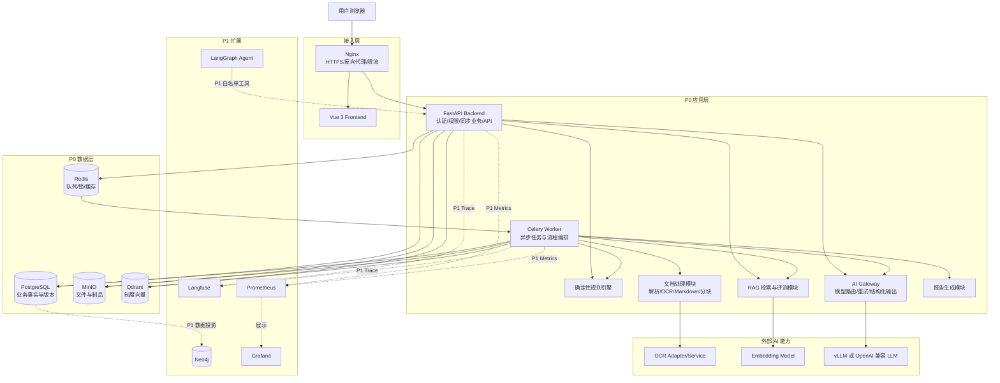

---

# 5. 业务架构

## 5.1 业务域划分

系统划分为八个业务域。

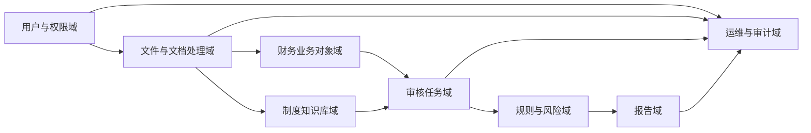

## 5.2 用户与权限域

负责：

- 登录、刷新和退出。
- 用户启停。
- 固定角色分配。
- Token 会话撤销。
- 接口权限检查。
- 职责分离。
- 首次登录/管理员重置后的受限强制换密。
- break-glass 请求、查询、独立批准/拒绝、撤销和基于数据库时间的限时鉴权；申请人与批准人双人控制。

不负责：

- 业务风险审批逻辑。
- 数据范围之外的业务判断。
- 通过前端按钮隐藏代替后端鉴权。

break-glass 状态固定 `pending/approved/rejected/revoked/expired`，记录不可物理删除。申请人必须是同组织有效 `system_admin`，目标是同组织有效用户，每次只申请一个目标当前未持有的 `system_admin/finance_reviewer/audit_reviewer/contract_admin`；批准人必须是另一名有效 `system_admin`，且不得是申请人或目标。请求时长为整数 `1..14400` 秒，批准事务以数据库当前时间同时写请求与 `user_roles` 的生效/过期时间；禁止预约、延期、续期、自批和单管理员降级。鉴权始终直接校验数据库时间边界，后台过期回收只补写状态。

## 5.3 文件与文档处理域

负责：

- 文件上传和校验。
- MinIO 存储。
- 解析和 OCR。
- 结构化文档块。
- 人工纠错。
- Markdown 转换和来源映射。
- Markdown 质量校验。
- 文档资源和排除项管理。

不负责：

- 合同、发票业务规则。
- 制度业务审批。
- 审核风险最终结论。

## 5.4 财务业务对象域

负责：

- 合同。
- 补充协议。
- 发票。
- 发票明细。
- 企业主体。
- 供应商。
- 合同发票候选关系和主合同关系。

该域保存已经提取或人工确认的业务事实。

## 5.5 制度知识库域

负责：

- 知识库。
- 制度版本。
- 制度业务审批。
- 分块配置。
- 分块集合。
- 知识库索引版本。
- 检索调试。
- 检索评测。
- RAG 查询和引用。

## 5.6 审核任务域

负责：

- 稳定审核任务。
- 审核执行版本。
- 执行快照。
- 审核状态机。
- 财务初审。
- 审计复核。
- 过期和重审。

## 5.7 规则与风险域

负责：

- 内置规则注册。
- 规则版本。
- 规则执行。
- 风险生成。
- 风险等级汇总。
- 风险复核。
- 制度引用冻结。

## 5.8 报告域

负责：

- PDF 审核报告。
- Excel 风险明细。
- 报告版本。
- 报告过期标记。
- 下载权限。
- 报告中的 AI 降级声明。

## 5.9 运维与审计域

负责：

- 异步任务状态。
- Trace ID。
- 操作日志。
- AI 调用日志。
- 依赖健康检查。
- 失败任务重试。
- 索引一致性检查。
- 数据补偿。

---

# 6. 应用架构

## 6.1 应用分层

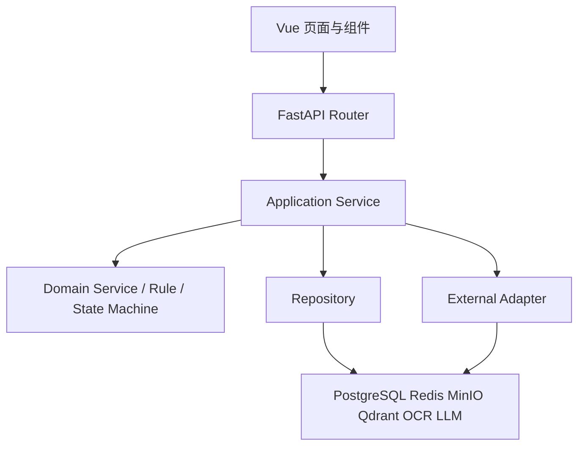

## 6.2 各层职责

### API Router 层

负责：

- HTTP 参数解析。
- 请求 Schema 校验。
- 身份认证。
- 接口权限检查。
- Idempotency-Key 读取。
- 调用 Application Service。
- 统一响应和错误码转换。

不得：

- 直接操作数据库 Session。
- 直接调用 Qdrant、MinIO 或模型。
- 编写业务状态机。
- 实现规则判断。

### Application Service 层

负责：

- 用例编排。
- 事务边界。
- 状态转换。
- Repository 调用。
- 异步任务创建。
- 领域事件写入。
- 权限和职责分离的业务校验。

### Domain Service 层

负责：

- 合同有效字段计算。
- 补充协议生效计算。
- 规则执行。
- 风险汇总。
- 制度有效期判断。
- 状态机校验。
- 分块算法。
- 评测指标计算。

Domain Service 尽量保持纯函数化和可单元测试。

### Repository 层

负责：

- PostgreSQL 数据访问。
- 查询封装。
- 乐观锁。
- 条件唯一约束错误转换。
- 批量写入。
- 事务内对象加载。

### Adapter 层

负责隔离外部依赖：

- OCR Adapter。
- LLM Adapter。
- Embedding Adapter。
- MinIO Adapter。
- Qdrant Adapter。
- PDF/DOCX Parser Adapter。
- 文件扫描 Adapter。
- 报告渲染 Adapter。

### Worker 层

负责：

- 获取异步任务。
- 更新任务阶段。
- 调用 Application Service。
- 重试和超时。
- 传播 Trace Context。
- 记录处理结果。
- 失败补偿。

Worker 不应复制业务逻辑。

---

# 7. 前端、后端与 AI 服务划分

## 7.1 前端职责

前端采用 Vue 3，主要负责：

1. 页面路由和菜单。
2. 登录态管理。
3. 文件上传交互。
4. 文件、解析、Markdown、分块、索引等独立状态展示。
5. 原文件、结构块和 Markdown 联动预览。
6. 合同、发票字段确认。
7. 制度审批和索引评测操作。
8. 审核任务、风险和报告展示。
9. 异步 Job 状态轮询。
10. 错误码、操作建议和 Trace ID 展示。

前端不得：

- 自行判断用户是否有接口权限。
- 自行计算风险等级。
- 自行确认制度是否有效。
- 保存唯一业务事实。
- 直接访问 MinIO、Qdrant 或模型服务。

## 7.2 FastAPI Backend 职责

Backend 负责：

- REST API。
- 身份认证与 RBAC。
- 请求幂等。
- 数据库事务。
- 业务状态转换。
- 文件上传接收。
- Job 创建。
- 同步检索接口。
- 下载鉴权。
- 审核操作。
- 任务状态查询。
- OpenAPI。
- 统一异常和 Trace ID。

## 7.3 Worker 职责

Worker 负责：

- 文档解析。
- OCR。
- 字段提取。
- Markdown 转换。
- Markdown 校验。
- 分块。
- Embedding。
- 索引构建和一致性校验。
- 检索评测。
- 审核执行。
- AI 风险解释。
- PDF 和 Excel 报告生成。
- 数据补偿和重建。

## 7.4 AI Gateway 职责

AI Gateway 对业务模块提供以下统一接口：

```python
extract_contract_fields(...)
extract_invoice_fields(...)
generate_risk_explanation(...)
answer_with_evidence(...)
generate_report_draft(...)
embed_texts(...)
```

AI Gateway 统一实现：

- 模型选择。
- Prompt 版本。
- JSON Schema。
- 超时。
- 重试。
- 熔断。
- 降级。
- Token 限制。
- 输入脱敏。
- 输出校验。
- `AiCallEventV1` 脱敏事件生成与 `AiCallEventSink` 调用；持久化和查询由 AI-005 独占。
- Trace 传播。

## 7.5 模型服务职责

模型服务只负责推理，不负责：

- 查询业务数据库。
- 修改合同或发票。
- 修改风险等级。
- 创建审核任务。
- 调用任意文件系统。
- 执行 SQL。
- 访问未授权制度。
- 直接生成最终业务审批结果。

---

# 8. FastAPI 模块拆分

## 8.1 推荐目录结构

```text
app/
├── main.py
├── api/
│   ├── dependencies/
│   │   ├── auth.py
│   │   ├── permissions.py
│   │   ├── pagination.py
│   │   └── idempotency.py
│   ├── exception_handlers.py
│   └── v1/
│       ├── router.py
│       └── endpoints/
│           ├── auth.py
│           ├── users.py
│           ├── files.py
│           ├── parse_versions.py
│           ├── markdown_versions.py
│           ├── contracts.py
│           ├── supplementary_agreements.py
│           ├── invoices.py
│           ├── suppliers.py
│           ├── contract_invoices.py
│           ├── knowledge_bases.py
│           ├── policies.py
│           ├── chunk_sets.py
│           ├── index_versions.py
│           ├── retrieval.py
│           ├── retrieval_evaluation.py
│           ├── qa.py
│           ├── audit_tasks.py
│           ├── audit_executions.py
│           ├── audit_risks.py
│           ├── reports.py
│           ├── jobs.py
│           └── health.py
├── core/
│   ├── config.py
│   ├── security.py
│   ├── logging.py
│   ├── tracing.py
│   ├── errors.py
│   ├── constants.py
│   ├── database.py
│   ├── redis.py
│   └── lifecycle.py
├── models/
│   ├── auth.py
│   ├── files.py
│   ├── documents.py
│   ├── contracts.py
│   ├── invoices.py
│   ├── policies.py
│   ├── retrieval.py
│   ├── audit.py
│   ├── reports.py
│   └── operations.py
├── schemas/
│   ├── common.py
│   ├── auth.py
│   ├── files.py
│   ├── documents.py
│   ├── contracts.py
│   ├── invoices.py
│   ├── policies.py
│   ├── retrieval.py
│   ├── audit.py
│   ├── reports.py
│   └── jobs.py
├── repositories/
│   ├── base.py
│   ├── users.py
│   ├── files.py
│   ├── documents.py
│   ├── contracts.py
│   ├── invoices.py
│   ├── policies.py
│   ├── retrieval.py
│   ├── audit.py
│   ├── reports.py
│   ├── jobs.py
│   └── operation_logs.py
├── services/
│   ├── auth_service.py
│   ├── user_service.py
│   ├── file_service.py
│   ├── document_service.py
│   ├── contract_service.py
│   ├── invoice_service.py
│   ├── policy_service.py
│   ├── retrieval_service.py
│   ├── audit_service.py
│   ├── risk_service.py
│   ├── report_service.py
│   └── job_service.py
├── parsers/
│   ├── base.py
│   ├── pdf_parser.py
│   ├── docx_parser.py
│   ├── image_parser.py
│   ├── ocr_adapter.py
│   └── parser_registry.py
├── markdown/
│   ├── converter.py
│   ├── ast_parser.py
│   ├── schema.py
│   ├── source_mapper.py
│   ├── validator.py
│   ├── sanitizer.py
│   └── versioning.py
├── chunking/
│   ├── config.py
│   ├── ast_chunker.py
│   ├── table_chunker.py
│   ├── quality_checker.py
│   └── source_resolver.py
├── retrieval/
│   ├── embedding_gateway.py
│   ├── qdrant_repository.py
│   ├── index_builder.py
│   ├── index_validator.py
│   ├── filters.py
│   ├── retriever.py
│   ├── citation_validator.py
│   └── answer_service.py
├── evaluation/
│   ├── dataset_service.py
│   ├── runner.py
│   ├── metrics.py
│   ├── anchor_matcher.py
│   └── exporter.py
├── ai/
│   ├── gateway.py
│   ├── model_router.py
│   ├── schemas.py
│   ├── prompts.py
│   ├── retry_policy.py
│   ├── circuit_breaker.py
│   ├── safety.py
│   └── adapters/
│       ├── openai_compatible.py
│       └── embedding_compatible.py
├── rules/
│   ├── registry.py
│   ├── context.py
│   ├── result.py
│   ├── executor.py
│   └── builtin/
│       ├── rule_001.py
│       ├── rule_002.py
│       └── ...
├── audit/
│   ├── snapshot_builder.py
│   ├── orchestrator.py
│   ├── state_machine.py
│   ├── risk_aggregator.py
│   └── citation_freezer.py
├── reports/
│   ├── pdf_renderer.py
│   ├── excel_renderer.py
│   └── templates/
├── workers/
│   ├── celery_app.py
│   ├── routing.py
│   ├── callbacks.py
│   └── tasks/
│       ├── document_tasks.py
│       ├── extraction_tasks.py
│       ├── markdown_tasks.py
│       ├── chunk_tasks.py
│       ├── index_tasks.py
│       ├── evaluation_tasks.py
│       ├── audit_tasks.py
│       ├── report_tasks.py
│       └── compensation_tasks.py
├── adapters/
│   ├── minio.py
│   ├── antivirus.py
│   ├── qdrant.py
│   └── external_services.py
├── migrations/
├── tests/
│   ├── unit/
│   ├── integration/
│   ├── contract/
│   ├── security/
│   └── e2e/
└── scripts/
```

## 8.2 模块依赖规则

允许的主要依赖方向：

```text
API → Application Service → Domain/Repository/Adapter
Worker Task → Application Service → Domain/Repository/Adapter
Domain → 纯领域对象和接口
Repository → PostgreSQL
Adapter → 外部基础设施
```

禁止：

```text
Router → SQLAlchemy Model 直接写入
Router → Qdrant
Router → vLLM
Rule → FastAPI Request
Rule → MinIO
Markdown Module → 合同 Repository
AI Gateway → 任意业务状态更新
Qdrant → 作为业务事实来源
Neo4j → 回写核心业务事实
```

## 8.3 模块边界表

| 模块 | 输入 | 输出 | 不负责 |
|---|---|---|---|
| file_service | 上传流、文件类型、用户 | 文件记录、对象键、Job | OCR、字段提取 |
| parser | 原始文件 | 页面、文档块、置信度 | 合同业务判断 |
| markdown | 解析版本 | Markdown、来源映射、校验结果 | 字段确认 |
| extraction | 文档块、页面 | 合同/发票候选字段 | 最终业务事实确认 |
| chunking | 活动 Markdown AST | 分块集合 | Embedding |
| index_builder | 分块集合、Embedding 配置 | 候选索引版本 | 制度业务审批 |
| retrieval | 查询、权限、基准日期 | 排名结果和证据 | 最终业务结论 |
| rules | 审核快照 | 确定性规则结果 | 修改快照 |
| audit_orchestrator | 审核执行 ID | 执行状态、风险、引用 | 用户审批 |
| ai_gateway | Prompt、Schema、证据 | 结构化 AI 输出 | 数据库事务 |
| report | 冻结执行结果 | PDF、Excel | 重新计算规则 |
| agent | P1 工具和上下文 | 编排建议 | 直接数据库操作 |

---

# 9. 文档解析、RAG、规则引擎和 Agent 协作

## 9.1 P0 协作模型

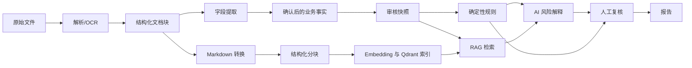

## 9.2 文档解析模块职责

文档解析模块把 PDF、DOCX 和图片恢复为：

- 页面。
- 标题块。
- 段落块。
- 列表块。
- 表格块。
- 图片和印章等资源。
- 页码。
- 坐标。
- OCR 置信度。

解析模块不直接生成最终合同或发票业务对象。

## 9.3 字段提取模块职责

字段提取模块读取结构化文档块，生成：

- 字段名称。
- 候选值。
- 标准化值。
- 置信度。
- 页码。
- 原文片段。
- 文档块 ID。
- 坐标。

提取结果进入候选状态，必须经过业务用户确认后才成为核心审核事实。

## 9.4 Markdown 模块职责

Markdown 模块与字段提取模块并行运行。

Markdown 模块负责：

- 结构恢复。
- GFM 表格。
- 标题层级。
- 资源占位符。
- 来源映射。
- 内容覆盖率。
- 安全校验。
- HTML 消毒。

制度分块必须读取活动 Markdown，不得直接读取 OCR 纯文本。

## 9.5 分块与 RAG 职责

分块模块负责确定性地生成检索单元。

RAG 模块负责：

1. 对查询进行 Embedding。
2. 在 Qdrant 中检索候选分块。
3. 根据权限、制度状态和基准日期过滤。
4. 返回候选证据。
5. 验证证据是否属于当前活动索引。
6. 调用 LLM 生成答案或解释。
7. 验证引用。
8. 证据不足时拒答。

## 9.6 规则引擎职责

规则引擎只读取审核快照，不直接读取活动业务表。

这样可以保证：

- 同一审核执行结果可复现。
- 后续字段修改不会改变历史结果。
- 规则版本可追踪。
- 重审必须生成新的执行版本。

规则引擎产生：

- `passed`
- `failed`
- `not_applicable`
- `error`

规则引擎输出包含：

- 规则编号和版本。
- 输入字段。
- 实际值。
- 预期值。
- 判断过程。
- 风险等级。
- 纳入和排除明细。
- 是否要求制度引用。

## 9.7 AI 风险解释职责

AI 风险解释只能基于：

- 规则结果。
- 审核快照事实。
- 已通过权限和日期过滤的制度证据。
- 固定 Prompt 和 Schema。

AI 不允许：

- 更改规则是否命中。
- 更改规则初始风险等级。
- 补造合同或发票字段。
- 引用未检索到的制度。
- 在证据不足时输出确定性合规结论。

## 9.8 P1 Agent 协作方式

P1 引入 Agent 后，架构如下：

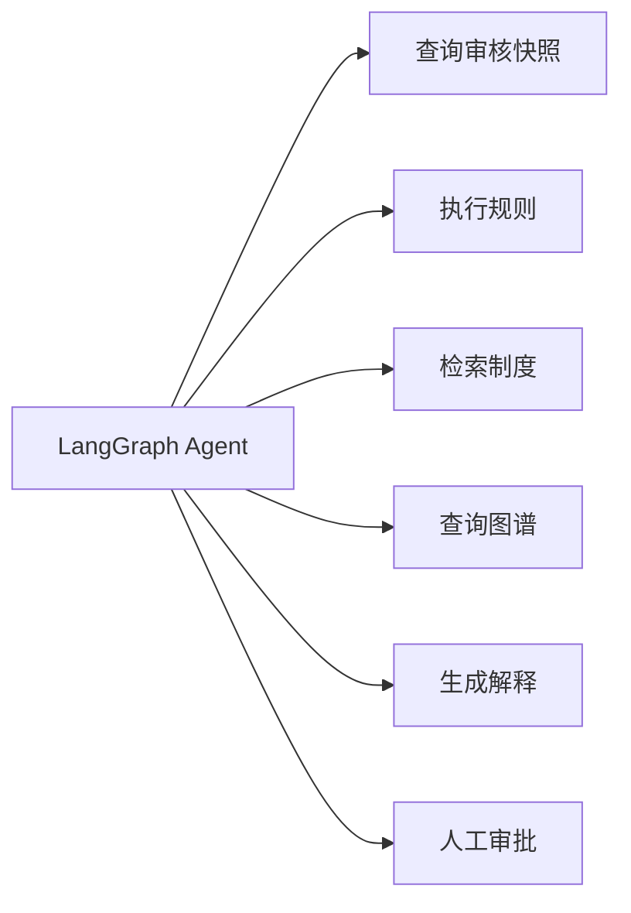

Agent 工具必须由 Backend 提供，采用白名单方式注册。

建议工具：

- `get_audit_snapshot`
- `get_rule_results`
- `search_policy_evidence`
- `get_contract_invoice_relations`
- `get_graph_context`
- `draft_risk_explanation`
- `request_human_review`

Agent 不得拥有：

- 任意 SQL 工具。
- 任意 Python 执行工具。
- 任意文件系统工具。
- 任意网络请求工具。
- 用户和权限修改工具。
- 风险最终审批工具。
- 制度发布工具。

---

# 10. 数据架构

## 10.1 数据分层

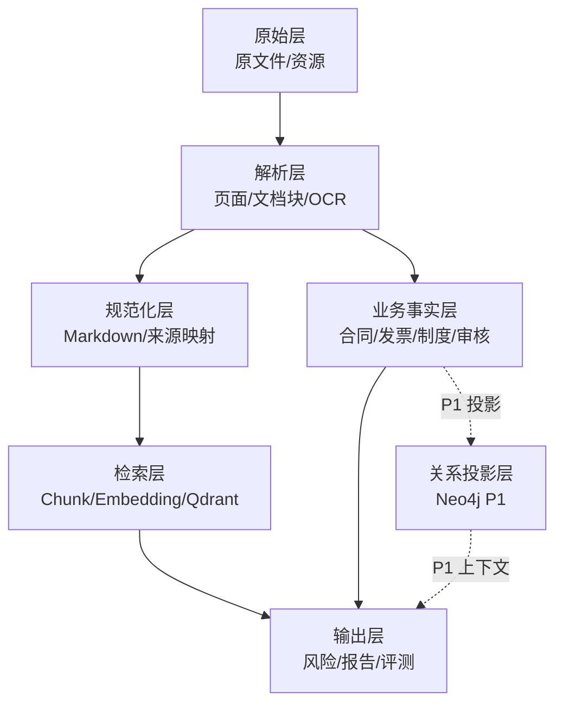

## 10.2 PostgreSQL 存储内容

PostgreSQL 保存：

### 用户与权限

- 用户。
- 固定角色。
- 用户角色。
- Token 会话。
- 登录锁定状态。

### 文件与文档版本

- 文件元数据。
- MinIO 对象键。
- 文件哈希。
- 文档资源元数据。
- 解析版本。
- 文档块。
- 人工纠错。
- 内容排除记录。
- Markdown 正文或正文引用。
- Markdown 来源映射。
- Markdown 校验结果。

### 财务业务事实

- 企业主体。
- 供应商。
- 合同。
- 合同字段。
- 补充协议。
- 补充协议变更项。
- 发票。
- 发票明细。
- 合同发票关系。

`CR-012-R3` 冻结的财务主数据切片由 `20260807_006` 在同一个 PostgreSQL migration 事务中创建 `contracts`、`invoices`、`suppliers` 三张空表：先建立指向既有 `organizations/users` 的外键，再通过 `ALTER TABLE` 添加 `contracts.supplier_id`、`invoices.supplier_id`、`suppliers.source_contract_id` 和 `suppliers.source_invoice_id` 四个循环外键。合同编号和供应商统一税务身份的 CHECK、C-collation 条件唯一索引、来源矩阵及 `NO ACTION` 外键均是 PostgreSQL 权威业务不变量，不得只在 Service、Redis 或进程内实现。

该切片只建立存储事实，不新增 Supplier/Contract/Invoice Service、Repository、Router 或 API，不冻结状态转换、数据库冲突到 HTTP/业务错误的映射、供应商读写投影、`SUPP-003`、CON-005、来源回填或 AI generic tax 写入。上述运行时边界继续由 GAP-064 阻断；CR-012-R3 也不授权真实数据处理、Provider 网络、部署或 production migration。

### 制度与 RAG 元数据

- 知识库。
- 制度业务版本。
- 制度审批记录。
- 分块配置。
- 分块集合。
- 分块正文。
- 分块来源。
- 索引版本。
- 索引成员。
- Qdrant Point ID。
- Embedding 配置和版本。

### 审核数据

- 审核任务。
- 审核执行版本。
- 审核快照。
- 规则版本。
- 规则结果。
- 风险。
- 风险引用。
- 报告版本。

### 评测和运维

- 检索评测数据集。
- 评测用例。
- 评测运行。
- 逐题结果。
- AI 调用摘要。
- 操作日志。
- 异步 Job 元数据。
- Transactional Outbox 事件。

## 10.3 Qdrant 存储内容

Qdrant 只保存企业制度分块向量。

每个 Point 包含：

```json
{
  "id": "deterministic-point-id",
  "vector": [],
  "payload": {
    "knowledge_base_id": "...",
    "index_version_id": "...",
    "index_member_id": "...",
    "policy_document_id": "...",
    "policy_version": "...",
    "markdown_version_id": "...",
    "chunk_set_id": "...",
    "chunk_id": "...",
    "content_hash": "...",
    "effective_from": "...",
    "effective_to": "...",
    "policy_status": "...",
    "permission_scope": "...",
    "title_path": "...",
    "start_page": 1,
    "end_page": 2
  }
}
```

Qdrant 不保存：

- 用户。
- 合同金额。
- 发票金额。
- 审核结果。
- 风险审批状态。
- 制度业务审批事实。
- 报告。

## 10.4 Qdrant 索引版本策略

推荐 P0 使用：

> 一个知识库对应一个稳定 Collection，同一 Collection 中通过 `index_version_id` 区分索引快照。

构建流程：

1. PostgreSQL 创建 `building` 索引版本。
2. 固化索引成员清单和成员哈希。
3. 生成 Embedding。
4. 使用确定性 Point ID 写入 Qdrant。
5. 检查数量、Point ID、内容哈希和维度。
6. 索引状态变为 `evaluation_pending`。
7. 完成评测。
8. 审批后在 PostgreSQL 中原子切换活动索引 ID。
9. 查询时强制过滤活动 `index_version_id`。
10. 旧索引数据延迟清理。

这样可以避免索引构建过程中污染当前线上检索结果。

## 10.5 Redis 存储内容

Redis 用于：

- Celery 消息队列。
- Job 临时状态加速。
- 分布式锁。
- 幂等键短期缓存。
- API 限流计数。
- 短期会话辅助数据。
- 健康检查缓存。
- 熔断器状态。
- 可选的短期检索结果缓存。

Redis 不保存：

- 唯一业务事实。
- 最终审核状态。
- 唯一风险记录。
- 唯一制度状态。
- 唯一任务快照。

Redis 数据丢失后，系统应能根据 PostgreSQL 恢复业务状态。

## 10.6 MinIO 存储内容

建议 Bucket 划分：

| Bucket | 内容 |
|---|---|
| quarantine | 尚未完成安全扫描的上传文件 |
| originals | 已通过校验的原始文件 |
| assets | 图片、签字、印章、复杂表格等资源 |
| previews | 页面预览图和缩略图 |
| reports | PDF 报告 |
| exports | Excel 和评测导出文件 |
| temp | 可清理的临时文件 |

MinIO 中每个对象的以下信息必须记录在 PostgreSQL：

- 对象键。
- Bucket。
- MIME。
- 文件大小。
- SHA-256。
- 创建时间。
- 安全状态。
- 关联业务对象。
- 版本 ID。

Markdown 正文可直接存储于 PostgreSQL。若正文过大，也可在 MinIO 保存副本，但 PostgreSQL 必须保存内容哈希、版本和对象键。

## 10.7 Neo4j 存储内容

Neo4j 属于 P1。

Neo4j 保存从 PostgreSQL 投影出的关系图，例如：

### 节点

- Organization
- Supplier
- Contract
- SupplementaryAgreement
- Invoice
- Policy
- AuditTask
- AuditExecution
- Risk
- Document
- Chunk

### 关系

- `PARTY_OF`
- `SUPPLIES_TO`
- `AMENDS`
- `INVOICES_FOR`
- `PRIMARY_CONTRACT`
- `GENERATES_RISK`
- `SUPPORTED_BY`
- `REFERENCES_POLICY`
- `RELATED_TO`
- `SAME_TAX_ID`
- `POSSIBLE_DUPLICATE`

Neo4j 数据同步原则：

1. PostgreSQL 事务成功后写入 Outbox Event。
2. 图谱同步 Worker 消费事件。
3. 使用业务对象 ID 幂等更新 Neo4j。
4. 保存投影版本和同步时间。
5. Neo4j 同步失败不回滚 PostgreSQL 业务事务。
6. Neo4j 查询结果必须回到 PostgreSQL 执行最终权限和状态校验。
7. Neo4j 不得直接修改核心业务对象。

## 10.8 数据存储边界汇总

| 存储 | 定位 | 保存内容 | 是否事实源 |
|---|---|---|---:|
| PostgreSQL | 关系型业务数据库 | 业务对象、状态、版本、快照、日志元数据 | 是 |
| MinIO | 对象存储 | 原文件、资源、预览、报告、导出 | 文件事实源 |
| Qdrant | 向量数据库 | 制度 Chunk Embedding 和检索元数据 | 否 |
| Redis | 临时基础设施 | 队列、锁、缓存、限流、熔断状态 | 否 |
| Neo4j | P1 图数据库 | 业务关系投影和 GraphRAG 上下文 | 否 |

---

# 11. 同步任务和异步任务划分

## 11.1 同步任务

以下操作同步完成：

- 登录、刷新、退出。
- 用户和角色读取。
- 普通列表和详情查询。
- 草稿元数据创建和修改。
- 权限校验。
- 文件上传流接收与基础校验。
- 文件哈希计算。
- MinIO 初始存储。
- Job 创建。
- 字段人工确认。
- 合同发票主关系确认。
- 风险人工复核。
- 制度审批动作。
- 索引审批和激活动作。
- 报告下载鉴权。
- Job 状态查询。
- 普通 Top-K 检索调试。
- AI 问答请求。

AI 问答保持同步，但必须设置严格超时。超过请求时限时返回明确错误，不在 HTTP 请求中无限等待。

## 11.2 异步任务

以下操作必须异步执行：

- 恶意文件扫描。
- PDF/DOCX 解析。
- OCR。
- 多业务文档检测。
- 合同字段提取。
- 发票字段提取。
- Markdown 转换。
- Markdown 来源映射。
- Markdown 质量校验。
- 分块构建。
- 分块质量检查。
- 批量 Embedding。
- Qdrant 索引构建。
- 索引一致性检查。
- 检索评测。
- 审核执行。
- 批量 AI 风险解释。
- PDF 报告生成。
- Excel 导出。
- Qdrant 补偿和重建。
- Neo4j 数据投影。

## 11.3 异步框架选型

P0 确定采用：

> **Celery 5 + Redis Broker**

主要原因：

1. 支持队列路由。
2. 支持任务重试和倒计时。
3. 支持任务链。
4. 支持超时控制。
5. Python 和 FastAPI 生态成熟。
6. 可通过同一 Worker 镜像横向扩容。
7. 支持后续拆分 OCR、AI、索引和报告队列。

Redis 只作为 Broker 和短期状态存储，Job 的最终状态必须写回 PostgreSQL。

## 11.4 队列划分

P0 使用以下逻辑队列：

| 队列 | 任务 |
|---|---|
| document | 扫描、解析、OCR、Markdown |
| extraction | 合同和发票字段提取 |
| knowledge | 分块、Embedding、索引、一致性检查 |
| evaluation | 检索评测 |
| audit | 审核执行、规则和 AI 解释 |
| report | PDF、Excel、导出 |
| maintenance | 重建、补偿、清理 |

P0 可以使用一个 Worker 容器监听全部队列。

资源增加后，可使用相同镜像拆分为多个 Worker：

```text
worker-document
worker-ai
worker-knowledge
worker-report
```

## 11.5 Job 持久化

P0 必须使用以下技术表：

```text
async_jobs
async_job_steps
outbox_events
```

`async_jobs` 至少包含：

- Job ID。
- Job 类型。
- 业务对象 ID。
- 当前阶段。
- 状态。
- 尝试次数。
- 最大尝试次数。
- Trace ID。
- 创建人。
- 开始时间。
- 完成时间。
- 错误码。
- 可重试标记。
- 输入参数哈希。
- 幂等键。
- 版本化 `input_json/input_schema_version`，只含稳定标识、版本和参数，不含文件正文、密码、Token、模型原文或 secret。
- `idempotency_record_id`、`lease_owner/lease_expires_at/heartbeat_at`。

`async_job_steps` 对每次执行步骤追加写入 `step_seq/step_code/status/attempt_no`、开始/结束时间、脱敏摘要、安全错误码和 Trace ID；已完成步骤不得更新或删除。活动任务以 `(organization_id, job_type, resource_type, resource_id, input_hash)` 条件唯一。同一业务 Job 的技术重试沿用 `job_id`、递增 `attempt_no` 并追加步骤历史，不创建第二个 Job。只有 Lease 到期且心跳超时的 `running` Job 可在 `max_attempts` 内恢复并写审计。

Job 权威输入、状态和最终结果只在 PostgreSQL；Worker 收到的 Outbox/Celery 消息只携带 `job_id` 与事件 Schema 版本，并重新从 PostgreSQL读取。Redis 只用于可恢复投递、锁和短期协调，不得成为唯一输入或完成事实。

## 11.6 Transactional Outbox

为避免出现“数据库已提交但消息未发送”的问题，使用 Transactional Outbox：

1. Backend 在同一个 PostgreSQL 事务中：
   - 创建业务记录。
   - 创建 Job。
   - 写入 Outbox Event。
2. Outbox Dispatcher 读取未发送事件。
3. Outbox 事件只携带 `job_id` 与 `event_schema_version`；Dispatcher 将该最小消息发送到 Redis/Celery。
4. 更新事件发送状态。
5. 发送失败时重试。
6. Worker 根据 Job ID、Lease 和当前阶段幂等执行；重复消息不得重复提交业务结果。
7. Dispatcher/Worker 崩溃、Redis 丢失或 Lease 过期后，系统只依赖 PostgreSQL 即可继续、补偿或安全失败。

---

# 12. 文件上传后进入解析流程

## 12.1 完整流程

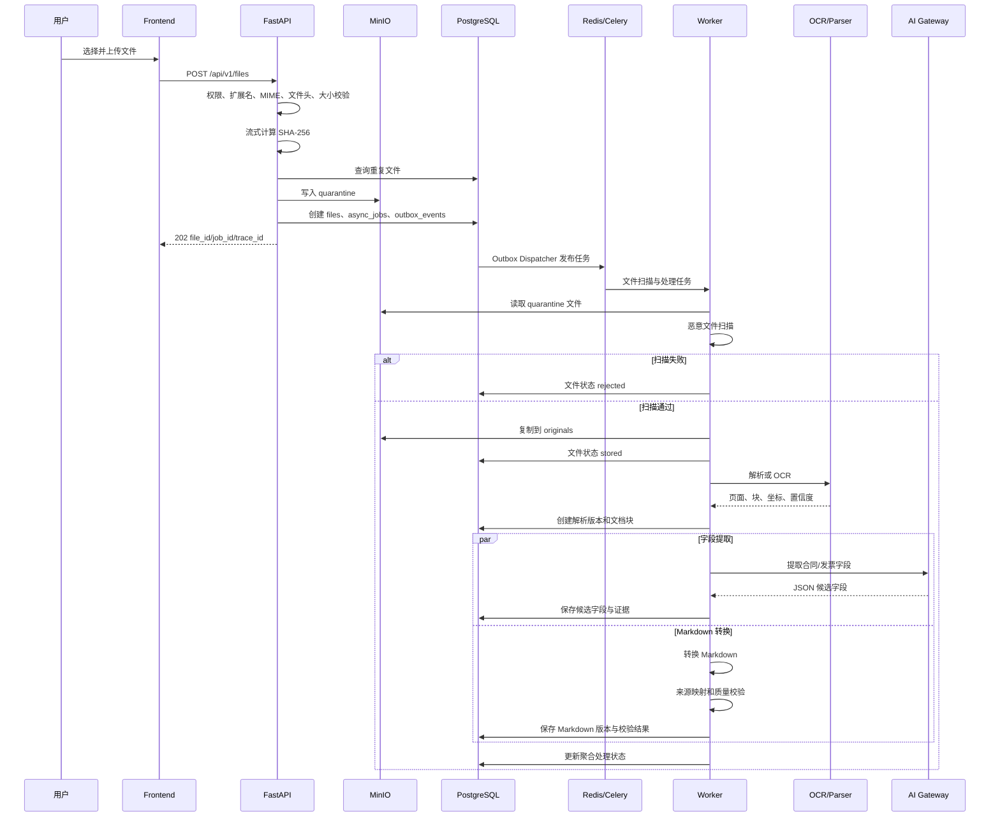

## 12.2 上传阶段

Backend 在上传请求中完成：

1. 验证用户权限。
2. 验证文件数量。
3. 验证文件大小。
4. 验证扩展名。
5. 验证 MIME。
6. 验证文件头。
7. 流式计算 SHA-256。
8. 检查重复文件。
9. 将文件写入 MinIO 隔离区。
10. 创建或复用文件记录，并持久化 `intended_business_type/target_knowledge_base_id/auto_process_requested`；policy 必须有目标知识库，其他类型必须为空。
11. 去重命中时分类/知识库不一致返回 `FILE_CLASSIFICATION_CONFLICT`；`auto_process_requested` 只允许原子 `false→true`，不得被后续 false 回退。
12. 需要自动处理时创建或复用唯一活动 Job，把 file ID、上传意图和输入 Schema 版本冻结到 `async_jobs.input_json`。
13. 返回 HTTP 202。

Backend 不在上传请求中等待 OCR 和模型处理完成。

## 12.3 安全扫描阶段

生产环境必须执行恶意文件扫描。

状态固定为：

- `pending`：尚未完成扫描，不得解析。
- `clean`：扫描通过，唯一允许继续解析的状态。
- `infected`：拒绝并隔离，不自动重试。
- `scan_failed`：扫描器或传输失败，可受限技术重试，但不得解析。
- `unsupported`：P0 确定性拒绝，不提供人工放行绕过。
- `not_configured`：只允许本地/离线测试记录；生产必须 fail closed。

扫描 Adapter、数据库 CHECK、API Schema、筛选和测试只能使用上述六态；历史模糊 `error` 迁移为 `scan_failed` 并保留脱敏错误码。生产扫描器未配置、不可用或依赖健康失败时，上传不得进入解析流水线。

## 12.4 解析阶段

根据文件类型选择解析器：

| 文件类型 | 处理方式 |
|---|---|
| 可提取文本 PDF | PDF 文本和布局解析 |
| 扫描 PDF | 页面渲染后 OCR |
| DOCX | OpenXML 结构解析 |
| JPG/JPEG/PNG | OCR 和版面分析 |

解析结果形成不可变解析版本。

## 12.5 低质量解析处理

以下情况进入 `manual_review_required`：

- OCR 置信度过低。
- 页面严重模糊。
- 文本顺序无法确定。
- 检测到多个独立业务文档。
- 关键页面解析失败。
- 表格结构严重损坏。

授权用户修正文档块后，系统创建新的解析版本，并重新运行字段提取和 Markdown 转换。

## 12.6 并行处理

解析成功后，启动两个并行任务：

```text
结构化文档块
├── 合同/发票字段提取
└── Markdown 转换与校验
```

两条流程互不阻塞。

规则：

- 字段提取失败，不影响 Markdown 转换结果。
- Markdown 失败，不覆盖已确认字段。
- 制度 Markdown 失败时，禁止分块、索引和发布。
- 合同和发票 Markdown 失败时，允许字段确认和确定性审核，但页面必须展示异常。

---

# 13. 制度分块、索引和发布流程

## 13.1 流程图

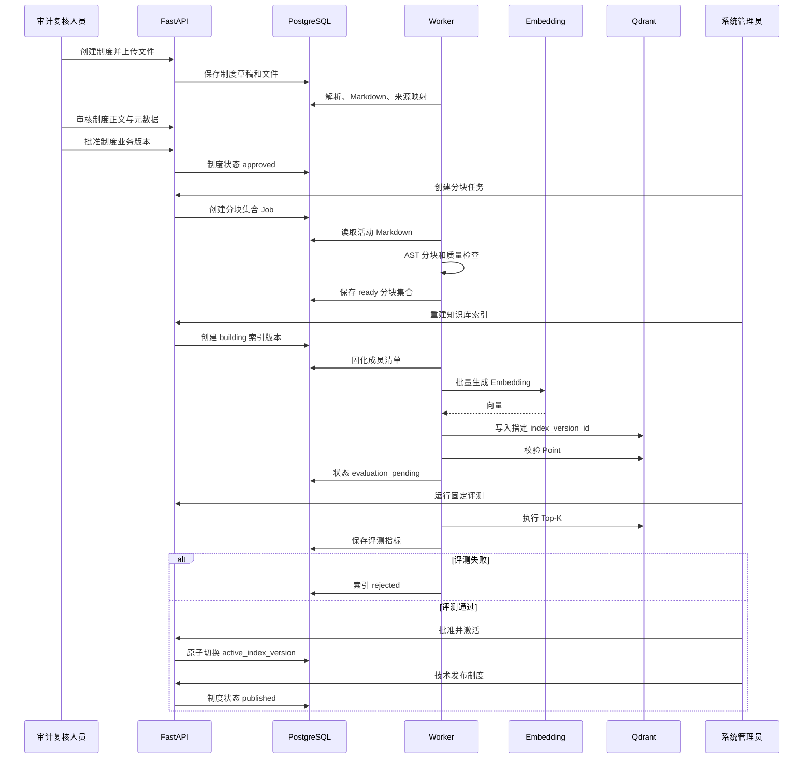

## 13.2 分块前置条件

制度分块必须满足：

- 制度存在已通过质量校验的活动 Markdown。
- Markdown 来源映射完整。
- 不存在阻断级质量问题。
- 分块配置已发布。
- 制度业务对象未被归档或撤销。

## 13.3 索引成员选择

候选索引包含：

- 已业务批准的制度。
- 已发布制度。
- 可按历史有效期检索的 `superseded` 制度。
- 活动 Markdown。
- 活动分块集合。
- 未归档、未撤销的分块。

成员清单固化后不得修改。

## 13.4 索引激活

索引激活必须满足：

1. PostgreSQL 成员数量正确。
2. Qdrant Point 数量正确。
3. Point ID 一致。
4. 内容哈希一致。
5. Embedding 维度一致。
6. 评测数据集已批准。
7. 检索指标通过门禁。
8. 操作者具有系统管理员权限。

激活操作只修改 PostgreSQL 中的活动索引引用，必须在单个数据库事务中完成。

---

# 14. 审核任务执行架构

## 14.1 审核执行流程

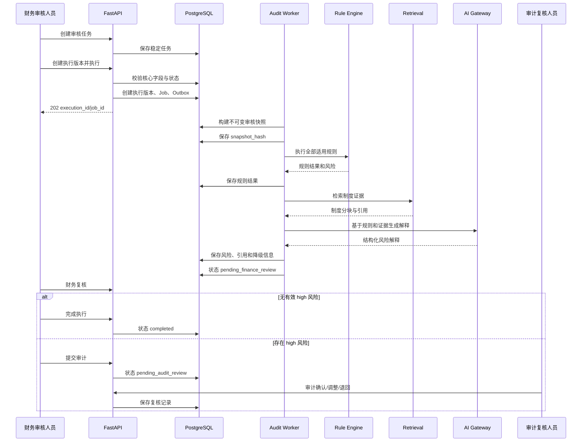

## 14.2 审核执行顺序

固定执行顺序：

```text
前置条件校验
→ 创建执行版本
→ 构建并冻结快照
→ 执行确定性规则
→ 检索制度依据
→ 生成 AI 风险解释
→ 汇总总体风险
→ 财务初审
→ high 风险审计复核
→ 生成报告
```

## 14.3 快照原则

执行开始后，规则、RAG 和报告只能读取快照。

快照至少包含：

- 合同字段。
- 基准日期生效的补充协议。
- 发票字段和明细。
- 累计金额纳入和排除清单。
- 主合同关系。
- 企业主体。
- 供应商。
- 规则版本。
- 制度版本。
- Markdown 版本。
- 分块集合版本。
- 索引版本。
- 模型版本。
- Prompt 版本。
- Schema 版本。
- 代码版本。

## 14.4 AI 降级下的审核流程

LLM 不可用时：

- 规则继续执行。
- 确定性风险继续保存。
- 审核执行进入 `pending_finance_review`。
- 标记 `ai_explanation_unavailable=true`。
- 不生成虚假的制度解释。
- 报告必须包含 AI 降级声明。
- 用户可根据规则结果和原文人工复核。

Embedding 或 Qdrant 不可用时：

- 不触发 RULE-013。
- 记录检索服务异常。
- 不声称“没有制度依据”。
- 显示“制度检索暂不可用”。
- 允许人工查看制度并复核。

---

# 15. RAG 查询架构

## 15.1 RAG 查询流程

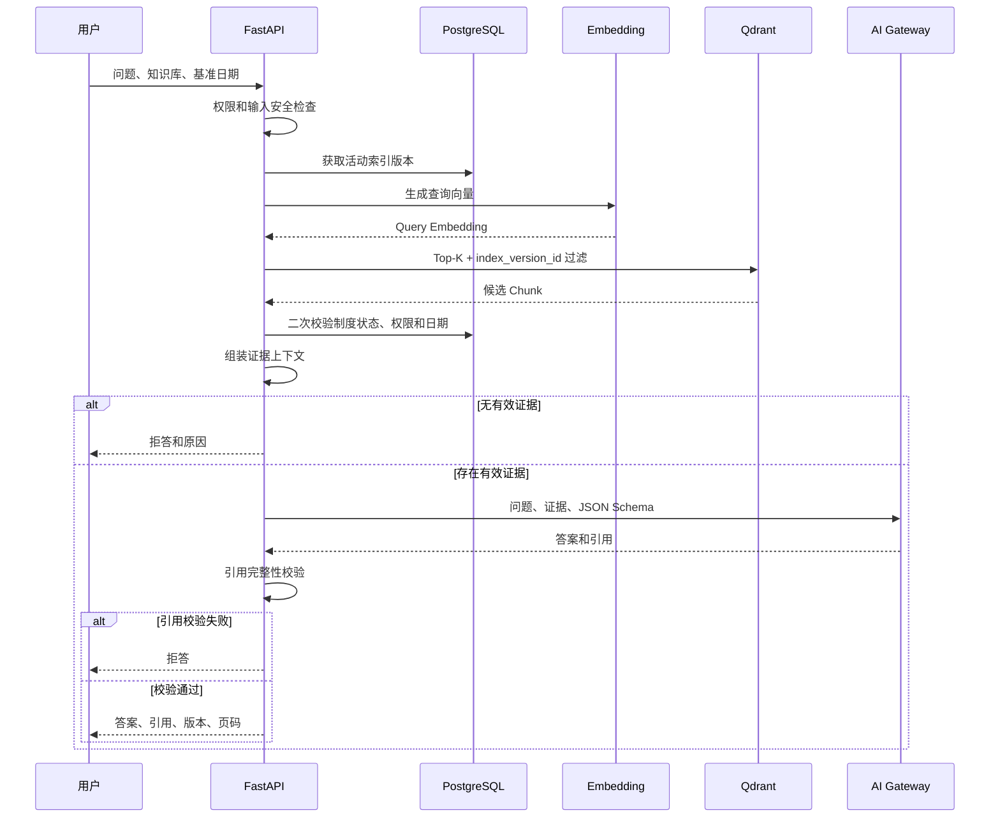

## 15.2 双重过滤

RAG 查询采用双重过滤。

### Qdrant 初步过滤

过滤：

- `index_version_id`
- `knowledge_base_id`
- 权限范围
- 制度状态
- 有效日期

### PostgreSQL 最终过滤

再次校验：

- 用户权限。
- 制度是否发布或历史有效。
- 是否已撤销或归档。
- 基准日期。
- 索引成员关系。
- Markdown、分块和制度版本对应关系。

Qdrant Payload 只用于提高检索效率，最终权限和业务状态以 PostgreSQL 为准。

## 15.3 引用校验

模型输出的引用必须满足：

1. Chunk 属于本次检索结果。
2. Chunk 属于活动索引。
3. 制度属于用户权限范围。
4. 制度在基准日期有效。
5. 引用文本与冻结 Chunk 内容一致。
6. 页码、标题路径和 Markdown 版本存在。
7. 未引用模型未见过的内容。

任意条件失败，均不展示模型答案。

---

# 16. 模型调用重试、熔断和降级

## 16.1 统一调用策略

所有模型调用必须经过 AI Gateway。

业务代码不得自行实现不同的重试逻辑。

## 16.2 错误分类

| 错误类型 | 是否重试 | 处理 |
|---|---:|---|
| 连接失败、连接/读取超时 | 是 | `transient`，受总截止时间限制 |
| HTTP 429 | 是 | `rate_limited`；合法 `Retry-After` 与本地退避取较大值 |
| HTTP 500/502/503/504 | 是 | `server_error`；其他 5xx 不重试 |
| HTTP 400/401/403/404 | 否 | `client_error`；精确安全子分类除外 |
| TLS/证书、禁止 DNS/IP、代理或重定向 | 否 | `provider_configuration_error`，不得通过重试绕过 |
| 上下文超限 | 否 | `context_limit`；Adapter 不截断、不压缩、不改写证据 |
| HTTP 200 但 JSON/包络/usage/向量非法 | 否 | `invalid_response`；由上层决定是否发起新的修复请求 |
| 内容安全拒绝 | 否 | `content_rejected`，不得伪装成普通无答案 |
| JSON Schema 不合法 | 否（transport） | AI-002 可在共享预算内发起模型修复；Schema 错误不触发 fallback |
| 引用校验失败 | 否 | 拒答或人工复核，不自动 fallback |
| Embedding 维度不一致 | 否 | 阻断候选索引构建，保持旧活动索引 |
| OCR 质量过低 | 否 | 进入人工纠错 |

只有非流式 `openai-chat-completions-v1` 的 `POST /chat/completions` 和 `openai-embeddings-v1` 的 `POST /embeddings` 两个显式 Profile 可用于 P0。两者固定 Bearer 认证、`200 application/json` 成功条件和严格包络；`stream=false`。不实现 Responses API、流式响应、工具调用或 Provider 扩展。不同协议必须新增独立 Adapter/Profile，不能由同一解析器猜测。

## 16.3 Transport Policy、截止时间与预算

所有真实 HTTP 请求在发送前依次检查业务操作请求总量、当前逻辑生成尝试、总截止时间、Token/费用预留、熔断和限流。首次生成、transport retry、主备切换和最多两次模型修复共享单一业务操作预算，禁止乘法展开。

| 调用 | 连接超时 | 总截止时间 | 固定序列 | Provider 请求总上限 |
|---|---:|---:|---|---:|
| 合同字段提取 | 5 秒 | 120 秒 | 主 1 → 同目标 retry 1 → 备用 1 | 6 |
| 发票字段提取 | 5 秒 | 60 秒 | 主 1 → 同目标 retry 1 → 备用 1 | 6 |
| 风险解释 | 5 秒 | 60 秒 | 主 1 → 同目标 retry 1 → 备用 1 | 6 |
| RAG 回答 | 5 秒 | 90 秒 | 主 1 → 同目标 retry 1 → 备用 1 | 6 |
| 报告草稿 | 5 秒 | 90 秒 | 主 1 → 同目标 retry 1；显式开关才追加备用 1 | 6 |
| Embedding 单批 | 5 秒 | 30 秒 | 同一目标最多 3 次；无 fallback | 3 |

LLM 每次逻辑生成 `max_attempts=3/max_same_target_attempts=2`；未启用 fallback 的报告为 2/2，Embedding 为 3/3。前四类必须配置非空且不同于主目标的备用模型；报告仅由 `LLM_REPORT_DRAFT_USE_FALLBACK=false|true` 决定。单请求输入/输出、业务总 Token 和外部费用初始上限分别为：合同 `32768/2500/212000/500000 micro_usd`，发票 `16384/2500/114000/250000`，风险 `16384/1600/108000/250000`，RAG `16384/1800/110000/250000`，报告 `16384/3000/117000/250000`，Embedding `16384/0/50000/50000`。Token、Tokenizer/哈希、context window、`pricing_version` 与整数 `micro_usd` 价格均由不可变 Policy 定义；任一未知即 fail closed。

## 16.4 重试与 fallback

- 本地退避固定 `base=1 秒/multiplier=2/max=30 秒/jitter_ratio=0.2`。`Retry-After` 支持非负十进制秒数和 HTTP-date；合法值与本地退避取较大值，抖动不得缩短它。等待超过 30 秒或剩余截止时间时不提前重试。
- 主目标仅在允许的技术失败耗尽或熔断已打开后进入备用目标；不可重试错误立即停止。主熔断跳过的格数不得变成备用 retry，备用失败后不得回切主模型。
- `client_error/context_limit/content_rejected`、Schema/引用/权限失败不得触发自动 fallback。Embedding 禁止跨模型、版本或维度 fallback。
- AI-002 修复使用产生非法结构的实际目标；每次修复内部最多同目标技术 retry 一次，不再次跨目标 fallback。
- 结构化输出顺序为首次生成 → 本地确定性去单围栏/提取唯一 JSON/解析/Schema 校验 → 最多两次模型修复。修复只携带 JSON Pointer 和安全错误类别，不携带失败值或 Provider 原文；不得补猜字段或改变业务事实。

## 16.5 熔断策略

- 熔断键固定为 `adapter_id + endpoint_id + model_id`，并按 `policy_version` 隔离 Redis key；调用类型通过独立限流池隔离。
- 60 秒滚动窗口累计 5 次批准的技术失败即打开，30 秒后半开，每键全局最多 1 个探测。连接/读取超时、429、500/502/503/504 计入；业务拒答、Schema、上下文、引用与客户端错误不计入。
- 受控环境初始容量池：RAG 每目标并发 2/12 RPM/100000 TPM/burst 2；异步提取、解释、报告为 4/30/250000/4；Embedding 为 2/30/500000/2。实际值取本地批准值和 Provider 合同配额的较小者。
- Redis 不可用时，在途请求可完成但审计事件不得丢失；外部计费 Profile 固定 `fail_closed`。只有获批内部不计费或本地测试 Profile 可进入 `process_local_restricted`（每进程并发 1、阈值 1、冷却 30 秒），且不得宣称分布式能力通过。

## 16.6 模型降级顺序

```text
主模型 → 允许的同目标 retry → 同契约备用模型（仅一次）
→ 确定性规则模式
→ 人工复核
```

备用模型必须满足：

- 支持相同接口。
- 支持相同 JSON Schema。
- 具有明确模型版本。
- 属于同一调用类型并通过最低评测。
- 输出日志中明确记录实际模型。

不得在无记录的情况下静默切换模型。

## 16.7 Policy、日志所有权与出站安全

- Profile/Policy 不可变，以 `policy_version + policy_hash` 标识；哈希使用 RFC 8785 规范化 JSON 的 UTF-8 bytes 计算 SHA-256，序列化内容只含 secret slot 标识。初始固定 `AI_POLICY_VERSION=1`、`AI_PROVIDER_CALLS_ENABLED=false`。
- `AI-001` 只通过 `AiCallEventSink` 产生允许字段白名单内的 `AiCallEventV1`，不得导入 Repository 或直接写数据库。`AI-005` 独占发送前 durable reserve、完成事件、Outbox 消费、`ai_call_logs` 幂等顺序投影、补偿和 OPS-005。
- 每个物理 HTTP 请求在首次 reserve 前生成固定 `event_id`；started/completed 使用同一 aggregate 的 sequence 1/2。reserve 结果未知只能用同 ID 查询或幂等重试，不得换 ID 盲发。完成事件未持久化时，AI 输出不得成为成功业务事实；超时未决进入 `outcome_unknown`，迟到完成只追加 `late_completion` 证据。
- Provider endpoint 只能由批准标识映射固定 URL；外部仅 HTTPS，`trust_env=false`、禁代理继承和自动重定向，连接前校验 DNS/IP 与实际 peer。请求体/响应头/Chat 解压响应/Embedding 解压响应上限固定为 `4194304/65536/2097152/4194304` bytes，只接受 identity/gzip。
- 出站关联 Header 只允许有效或新建的 `traceparent`。原始响应、错误正文、Prompt、模型输入/输出、财务正文、密钥和 Token 不得进入日志、Trace、指标或持久事件；只保留标准错误分类、安全错误码、HTTP 状态和解析后的安全 `Retry-After`。

## 16.8 各场景降级

### OCR 失败

- 解析版本进入 `manual_review_required`。
- 用户修正文档块。
- 创建新解析版本。
- 不覆盖原版本。

### 字段提取失败

- 保留解析和 Markdown。
- 允许人工录入字段。
- 标记字段来源为人工。
- 保存失败模型和错误原因。

### Markdown 失败

- 制度禁止分块和发布。
- 合同和发票保留字段提取结果。
- 旧活动 Markdown 保持可用。

### Embedding 失败

- 候选索引构建失败。
- 不影响旧活动索引。
- 可对失败批次单独重试。

### Qdrant 失败

- 新索引不激活。
- 旧索引继续服务。
- 无旧索引时 RAG 返回不可用状态。
- 不伪装成“未找到制度”。

### LLM 失败

- 保存确定性规则结果。
- 风险解释为空。
- 进入财务人工复核。
- 报告标记 AI 降级。

### 引用校验失败

- 不展示 AI 答案。
- 返回拒答。
- 记录安全和质量日志。

---

# 17. 服务调用关系

## 17.1 调用矩阵

| 调用方 | 被调用方 | 协议 | 用途 |
|---|---|---|---|
| Browser | Nginx | HTTPS | 页面和 API |
| Nginx | Frontend | HTTP | 静态页面 |
| Nginx | Backend | HTTP | API 反向代理 |
| Backend | PostgreSQL | TCP | 业务事务 |
| Backend | Redis | TCP | 限流、幂等、Job 辅助状态 |
| Backend | MinIO | S3 API | 上传和签名 URL |
| Backend | Qdrant | HTTP/gRPC | 同步 RAG 查询 |
| Backend | Embedding | HTTP | 查询向量 |
| Backend | LLM | HTTP | RAG 回答 |
| Backend | Celery | Redis Broker | 发布异步任务 |
| Worker | PostgreSQL | TCP | 状态、结果和快照 |
| Worker | MinIO | S3 API | 文件和报告 |
| Worker | OCR | Adapter/HTTP | 文档识别 |
| Worker | LLM | HTTP | 字段提取和解释 |
| Worker | Embedding | HTTP | 批量向量 |
| Worker | Qdrant | HTTP/gRPC | 索引写入和校验 |
| Worker | Redis | TCP | 队列和锁 |
| P1 Graph Worker | Neo4j | Bolt | 数据投影 |
| P1 Agent | Backend Tools | HTTP/Internal | 白名单工具调用 |

## 17.2 禁止调用关系

- Frontend 不得直接访问 PostgreSQL。
- Frontend 不得直接访问 Qdrant。
- Frontend 不得直接调用模型。
- vLLM 不得访问 PostgreSQL。
- Qdrant 不得决定权限。
- Neo4j 不得作为审批结果来源。
- Agent 不得绕过 Backend 工具调用数据库。
- Rule Engine 不得调用 LLM 决定是否命中。

---

# 18. 部署架构

## 18.1 P0 部署图

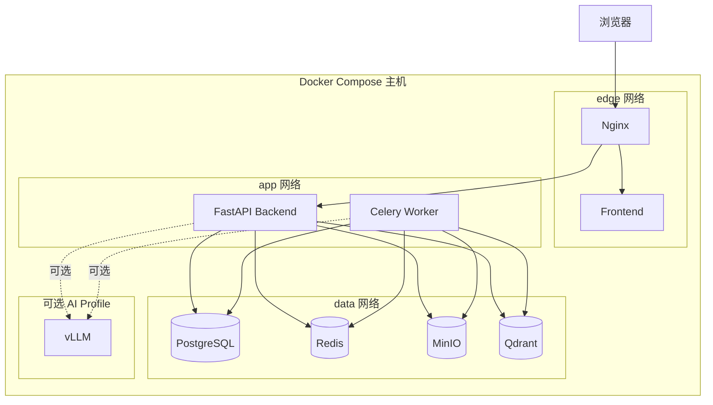

## 18.2 Docker Compose 服务

P0 必需服务：

```text
frontend
backend
worker
postgresql
redis
minio
qdrant
nginx
```

可选服务：

```text
vllm
```

P1 服务：

```text
neo4j
langfuse
prometheus
grafana
reranker
```

可选的技术增强服务：

```text
otel-collector
```

`otel-collector` 不作为 P0 业务验收前置条件。

## 18.3 服务职责

### frontend

- 构建并提供 Vue 静态资源。
- 仅在内部网络暴露服务。
- 外部访问统一经过 Nginx。

### backend

- 运行 FastAPI。
- 提供 `/api/v1`。
- 提供 `/health` 和 `/health/dependencies`。
- 不直接执行长任务。

### worker

- 使用和 Backend 相同的业务代码镜像。
- 启动 Celery Worker。
- 监听一个或多个逻辑队列。
- 可通过 Compose Scale 横向扩容。

### postgresql

- 保存业务事实。
- 使用持久卷。
- Alembic 迁移建立 57 张核心表并只幂等写五个固定角色；不创建默认组织、管理员、密码、真实规则行或组织分块配置。
- 首组织/首管理员通过一次性离线 bootstrap CLI，使用 advisory lock 和单事务；凭据只从 TTY/stdin/受限 FD/Secret Manager 注入，禁止 argv、日志和匿名 HTTP。
- 必须备份和恢复。

### redis

- Celery Broker。
- 分布式锁。
- 限流。
- 短期缓存。
- 不承担永久事实存储。

### minio

- 原文件和制品。
- 使用持久卷。
- Bucket 初始化。
- 下载使用短时签名 URL。

### qdrant

- 制度 Embedding。
- 使用持久卷。
- 必须支持快照和重建校验。

### nginx

- 对外唯一入口。
- HTTPS。
- API 代理。
- 上传大小限制。
- 基础限流。
- 安全响应头。
- 前端路由回退。

## 18.4 网络隔离

建议建立三个 Docker 网络：

| 网络 | 服务 |
|---|---|
| edge_net | nginx、frontend、backend |
| app_net | backend、worker |
| data_net | backend、worker、postgresql、redis、minio、qdrant |

规则：

- PostgreSQL 不映射公网端口。
- Redis 不映射公网端口。
- Qdrant 不映射公网端口。
- MinIO 管理端口仅允许受控访问。
- vLLM 只对 Backend 和 Worker 开放。
- 外部只暴露 Nginx 的 HTTP/HTTPS 端口。

## 18.5 持久卷

至少包含：

```text
postgres_data
minio_data
qdrant_data
redis_data
```

Redis 持久化只用于提高恢复能力，不作为业务一致性的依赖。

P1 增加：

```text
neo4j_data
langfuse_data
prometheus_data
grafana_data
```

## 18.6 健康检查

| 服务 | 健康检查 |
|---|---|
| frontend | 静态页面响应 |
| backend | `/health` |
| backend dependencies | `/health/dependencies` |
| worker | Celery Ping 或心跳 |
| PostgreSQL | `pg_isready` |
| Redis | `redis-cli ping` |
| MinIO | 健康检查接口 |
| Qdrant | readiness 接口 |
| vLLM | 当前 contract/offline 阶段不发起网络探针；仅在 `fixed_test_provider` 获批且 `AI_PROVIDER_CALLS_ENABLED=true` 后才可调用 `/v1/models`，且结果不得替代真实 Chat/Embedding 证据 |
| Neo4j | Bolt/HTTP readiness |
| Prometheus | `/-/ready` |
| Grafana | `/api/health` |

## 18.7 启动顺序

建议：

```text
PostgreSQL、Redis、MinIO、Qdrant
→ 数据库迁移（57 表 + 五角色）
→ 按需运行一次性离线 bootstrap（首组织/首管理员，强制换密）
→ Backend
→ Worker
→ Frontend
→ Nginx
→ AUD-003 发布真实规则、KB-004 发布组织分块配置
→ 可选离线 AI Mock；未获目标环境批准不得进行 Provider 网络调用
```

业务服务必须能够处理依赖暂时不可用，不应仅依靠 Compose 启动顺序保证可用性。

## 18.8 配置管理

使用：

- `.env.example`
- 环境变量
- 只读配置文件
- 数据库版本化配置

敏感配置包括：

- 数据库密码。
- Redis 密码。
- MinIO 密钥。
- 模型 API Key。
- JWT 密钥。
- Qdrant API Key。
- Neo4j 密码。

敏感信息不得写入 Git、日志、前端构建文件或报告。

---

# 19. 日志设计

## 19.1 日志分类

系统日志分为四类：

### 应用日志

记录：

- API 请求。
- Worker 执行。
- 外部依赖调用。
- 异常。
- 性能耗时。

### 操作审计日志

记录：

- 登录。
- 用户启停。
- 角色变更。
- 文件上传和下载。
- 字段修改。
- 主合同确认。
- 制度审批和发布。
- 索引激活。
- 风险复核。
- 报告生成和下载。

### AI 调用日志

AI-001 只向 `AiCallEventSink` 发送白名单字段：事件/Policy 身份，组织/业务操作/Job/请求/资源/Trace，调用类型与逻辑/物理尝试序号，实际 Adapter/endpoint/model，Prompt/Schema 版本和哈希，开始/完成/耗时，输入输出哈希/Token/向量摘要/价格版本，三项预算预留，fallback/熔断/引用/结果状态，以及标准错误分类和安全错误码。

AI-005 是 reserve、complete、Outbox、幂等顺序投影、`outcome_unknown/late_completion` 补偿和 OPS-005 的唯一所有者。每个物理请求一个固定 `event_id`；持久化完成证据失败时，AI 结果不得成为成功业务事实。

严禁记录 API Key、Authorization、完整 Prompt、完整模型输入/输出、合同/发票正文、制度 Chunk、Provider 原始响应/异常和自由文本错误。

### 质量日志

记录：

- OCR 置信度。
- Markdown 覆盖率。
- 来源映射完整率。
- 分块数量。
- 分块质量问题。
- 索引成员哈希。
- Qdrant 一致性。
- Hit@K。
- MRR。
- 未命中分类。
- 引用校验失败。

## 19.2 JSON 日志格式

推荐字段：

```json
{
  "timestamp": "2026-08-05T12:00:00+08:00",
  "level": "INFO",
  "service": "backend",
  "environment": "development",
  "trace_id": "...",
  "span_id": "...",
  "request_id": "...",
  "job_id": "...",
  "user_id": "...",
  "module": "document.markdown",
  "event": "markdown_validation_completed",
  "resource_type": "document_markdown_version",
  "resource_id": "...",
  "duration_ms": 1200,
  "status": "ready",
  "error_code": null
}
```

## 19.3 日志脱敏

以下内容不得写入日志：

- 密码。
- Access Token。
- Refresh Token。
- API Key。
- JWT 密钥。
- 完整系统 Prompt。
- MinIO Secret。
- 数据库密码。
- 未授权完整财务正文。

税号、统一社会信用代码和人员信息按照环境和角色执行脱敏。

## 19.4 日志输出

P0：

- 应用日志输出到 stdout/stderr。
- Docker 配置日志轮转。
- 关键操作写入 PostgreSQL `operation_logs`。
- AI Gateway 只产生脱敏 `AiCallEventV1`；AI-005 通过 durable reserve/complete、Outbox 与顺序幂等投影写入 `ai_call_logs`，其他模块不得直接写该表。

P1：

- 统一采集到日志平台。
- Langfuse 展示 AI Trace。
- Grafana 展示指标。
- 根据错误率和积压触发告警。

---

# 20. 链路追踪设计

## 20.1 Trace ID 生成

每个外部请求必须拥有 Trace ID。

规则：

1. 若请求携带合法 `traceparent`，继续使用。
2. 若请求未携带，则由 Nginx 或 Backend 创建。
3. Backend 在响应中返回 `trace_id`。
4. Backend 将 Trace Context 写入 Celery Header。
5. Worker 继续该 Trace 或创建关联子 Trace。
6. OCR、Embedding、Qdrant 和 LLM 调用记录相同 Trace ID。

## 20.2 关键 Trace Span

建议包含：

```text
http.request
auth.validate
permission.check
database.transaction
file.upload
minio.put_object
document.parse
ocr.page
field.extract
markdown.convert
markdown.validate
chunk.build
embedding.batch
qdrant.upsert
index.consistency_check
retrieval.query
retrieval.filter
llm.generate
citation.validate
rule.execute
audit.snapshot
report.render
```

## 20.3 异步 Trace

异步任务必须同时记录：

- Trace ID。
- Parent Span ID。
- Job ID。
- Celery Task ID。
- 业务对象 ID。
- 执行版本 ID。
- 当前任务阶段。

用户在前端看到错误时，可以使用 Trace ID 查询 API、Worker、模型和存储的完整链路。

## 20.4 P0 与 P1 区别

P0：

- 传播 Trace ID。
- 结构化日志中记录 Span 信息。
- 通过 AI-005 保存脱敏 AI 审计投影；其他模块不直接写表。
- 不要求部署完整 Trace 平台。

P1：

- 接入 OpenTelemetry。
- AI Trace 发送到 Langfuse。
- 系统 Trace 可发送到兼容后端。
- Prometheus 采集指标。
- Grafana 展示看板。

---

# 21. 监控设计

## 21.1 P0 监控方式

P0 不部署 Prometheus 和 Grafana，但必须提供：

- `/health`
- `/health/dependencies`
- 结构化阶段耗时日志。
- Job 状态和错误码。
- Worker 心跳。
- 依赖连通性检查。
- 索引一致性检查。
- 基础管理查询接口。

## 21.2 P1 指标体系

### API 指标

- 请求数量。
- 2xx、4xx、5xx 比例。
- P50、P95、P99。
- 并发请求数。
- 限流次数。
- 权限拒绝次数。

### Worker 指标

- 队列长度。
- 等待时间。
- 执行时间。
- 成功率。
- 重试次数。
- 失败任务数量。
- Worker 存活数量。

### 文档处理指标

- 文件上传成功率。
- 解析成功率。
- OCR 失败率。
- 人工纠错率。
- Markdown 转换成功率。
- 来源映射完整率。
- 平均处理页数和耗时。

### RAG 指标

- Embedding 延迟。
- Qdrant 检索延迟。
- Top-K 查询量。
- 检索失败率。
- 无答案比例。
- 引用校验失败率。
- Hit@K。
- MRR。
- 高置信误召回率。

### AI 指标

- 模型调用量。
- 模型错误率。
- 超时率。
- 结构化输出失败率。
- 重试率。
- 降级率。
- Token 使用量。
- 平均响应时间。

### 审核指标

- 审核任务数量。
- 执行成功率。
- 各风险等级数量。
- high 风险待复核数量。
- 过期执行数量。
- 报告生成失败率。

### 基础设施指标

- PostgreSQL 连接数和慢查询。
- Redis 内存和队列。
- MinIO 容量和错误。
- Qdrant Point 数量和查询延迟。
- 磁盘空间。
- 容器 CPU 和内存。

## 21.3 告警建议

P1 建议告警：

| 告警 | 条件示例 |
|---|---|
| Backend 高错误率 | 5xx 持续超过阈值 |
| Worker 离线 | 无心跳 |
| 队列积压 | 队列长度持续增长 |
| 模型不可用 | 连续调用失败 |
| OCR 大量失败 | 失败率明显高于基线 |
| Markdown 质量失败 | 出现来源映射阻断问题 |
| 索引不一致 | 成员和 Point 不一致 |
| Qdrant 不可用 | 健康检查失败 |
| high 风险超时 | 超过业务复核时限 |
| 磁盘不足 | 使用率超过阈值 |
| 权限泄露测试失败 | 任意非零泄露事件 |

---

# 22. 数据一致性与事务设计

## 22.1 PostgreSQL 事务边界

以下操作必须在单个数据库事务中完成：

- 用户角色变更和职责分离校验。
- 主合同关系确认。
- 审核执行版本创建。
- 审核快照保存。
- 风险复核状态和有效等级更新。
- 制度审批状态更新。
- 活动 Markdown 切换。
- 活动分块集合切换。
- 活动索引版本切换。
- 报告版本创建。
- 关键事实修改和历史执行过期标记。

## 22.2 MinIO 和 PostgreSQL 一致性

对象存储和数据库无法使用同一事务，采用补偿机制：

1. 先写入 MinIO 临时对象。
2. 写 PostgreSQL 文件记录。
3. 数据库事务成功后确认对象。
4. 数据库失败时清理临时对象。
5. 定时任务清理孤立对象。
6. 下载前同时校验数据库权限和对象存在性。

## 22.3 Qdrant 和 PostgreSQL 一致性

采用“构建后校验、校验后激活”：

1. 创建候选索引版本。
2. 固化成员。
3. 写入 Qdrant。
4. 校验。
5. 运行评测。
6. 激活。

Qdrant 写入失败不得修改活动索引。

## 22.4 幂等设计

以下接口必须支持 `Idempotency-Key`：

- 文件上传。
- 创建审核执行版本。
- 启动解析。
- 启动 Markdown 转换。
- 启动分块。
- 重建索引。
- 启动评测。
- 启动审核执行。
- 生成报告。

服务端保存：

- 用户 ID。
- 接口。
- Idempotency-Key。
- 请求参数哈希。
- 返回资源。
- 过期时间。

相同 Key 和相同参数返回原结果；相同 Key 和不同参数返回 `IDEMPOTENCY_CONFLICT`。

---

# 23. 安全架构

## 23.1 认证

- Access Token 短期有效。
- Refresh Token 保存在 `token_sessions`。
- 用户禁用后会话立即撤销。
- 密码使用安全哈希。
- 登录失败达到阈值后锁定。
- 生产使用 HTTPS。

## 23.2 授权

授权分为三层：

1. 接口角色权限。
2. 业务对象权限。
3. 职责分离校验。

前端权限控制只用于改善交互，最终权限必须由 Backend 校验。

## 23.3 文件安全

- 扩展名、MIME、文件头联合校验。
- 隔离 Bucket。
- 恶意文件扫描。
- 文件大小限制。
- 文件数量限制。
- 路径不使用原始文件名。
- MinIO 对象键由系统生成。
- 下载使用短时签名 URL。
- 原始文件不公开访问。

## 23.4 Markdown 安全

- raw HTML 白名单。
- 预览前消毒。
- Content Security Policy。
- `asset://` 资源必须验证权限。
- 禁止执行脚本。
- 禁止远程图片自动加载。
- 禁止 iframe。

## 23.5 Prompt Injection 防护

- 系统指令和文档内容分离。
- 文档内容标记为不可信数据。
- 模型无任意工具权限。
- 工具调用由 Backend 白名单控制。
- 引用必须来自本次授权检索结果。
- 不向模型提供 API Key 和数据库密码。
- 不允许模型直接决定审批和状态转换。
- 注入攻击进入安全测试集。

---

# 24. 技术选型说明

## 24.1 核心技术选型

| 类别 | 选型 | 说明 |
|---|---|---|
| 前端 | Vue 3 + TypeScript | 适合管理后台和复杂表单 |
| 构建工具 | Vite | 开发速度快、配置简单 |
| UI 状态 | Pinia | Vue 官方推荐状态方案 |
| 路由 | Vue Router | 标准路由管理 |
| 后端 | Python 3.10 + FastAPI | 异步 API、OpenAPI、Pydantic 生态 |
| Schema | Pydantic | 请求、响应和 AI JSON 校验 |
| ORM | SQLAlchemy 2.x | 成熟的事务和模型支持 |
| 数据迁移 | Alembic | 数据库版本管理 |
| 主数据库 | PostgreSQL | 事务、JSONB、约束和复杂查询 |
| 向量数据库 | Qdrant | Payload 过滤、版本过滤、部署简单 |
| 对象存储 | MinIO | S3 兼容、适合本地私有化 |
| 缓存与队列 | Redis | Celery Broker、锁、限流 |
| 异步任务 | Celery 5 | 重试、队列和 Worker 扩展成熟 |
| Web 入口 | Nginx | HTTPS、代理、限流和静态资源 |
| 模型服务 | vLLM/OpenAI 兼容 API | 支持本地和外部模型切换 |
| OCR | Adapter 模式 | 具体引擎仍可替换 |
| Markdown | CommonMark/GFM 兼容 AST | 结构明确、可追溯、可分块 |
| PDF 报告 | HTML 模板转 PDF | 模板化和中文排版可控 |
| Excel | openpyxl 或 xlsxwriter | 风险明细导出 |
| 容器 | Docker Compose | 符合 P0 部署要求 |
| 测试 | pytest | Python 测试生态 |
| 类型检查 | mypy/pyright | 提升可维护性 |
| 代码质量 | Ruff | 格式和静态检查 |
| P1 图数据库 | Neo4j | 关系查询和 GraphRAG |
| P1 Agent | LangGraph | 状态化 Agent 编排 |
| P1 AI 观测 | Langfuse | Prompt、模型和 Trace |
| P1 指标 | Prometheus + Grafana | 系统指标和告警 |

## 24.2 PostgreSQL 而非全部使用 Neo4j

选择 PostgreSQL 作为主数据库，因为系统核心数据具有：

- 强事务。
- 唯一约束。
- 状态机。
- 版本关系。
- 审计要求。
- 金额和日期计算。
- 报表查询。

Neo4j 更适合：

- 多跳关系。
- 风险传播。
- 关联网络。
- GraphRAG。

因此 Neo4j 只作为 P1 投影库。

## 24.3 Qdrant 而非 PostgreSQL 向量扩展

选择 Qdrant 的原因：

- 向量检索能力独立。
- Payload 过滤能力明确。
- 支持私有化部署。
- 可记录索引版本。
- 易于按 `index_version_id` 隔离。
- 符合已经确认的需求技术栈。

PostgreSQL 仍保存 Chunk 正文、版本、来源和索引成员事实。

## 24.4 Celery 而非在 FastAPI 内创建后台任务

FastAPI `BackgroundTasks` 不适合关键长任务，因为：

- 进程重启后任务可能丢失。
- 不具备可靠重试。
- 不具备队列积压管理。
- 不适合 OCR、Embedding 和报告。
- 不容易横向扩容。

因此关键长任务使用 Celery。

## 24.5 模块化单体而非微服务

选择模块化单体的原因：

- 事务边界清晰。
- 部署简单。
- 开发调试成本低。
- API 和 Worker 可共享代码。
- 适合 P0 里程碑。
- 后续可按模块边界拆分。

---

# 25. 关键架构决策

## ADR-001：P0 使用模块化单体

- 决策：FastAPI Backend 和 Worker 共用一个代码仓库。
- 原因：降低分布式复杂度。
- 影响：必须严格执行模块边界，禁止跨模块直接访问内部表。

## ADR-002：PostgreSQL 为唯一业务事实源

- 决策：Qdrant、Redis、Neo4j 不得保存唯一业务事实。
- 原因：保证事务、约束和审计。
- 影响：外部存储结果必须能追溯到 PostgreSQL 版本。

## ADR-003：P0 使用确定性审核编排，不使用 Agent

- 决策：使用 `AuditOrchestrator` 编排固定流程。
- 原因：P0 要求可复现、可验收。
- 影响：LangGraph Agent 进入 P1。

## ADR-004：字段提取和 Markdown 转换并行

- 决策：结构化文档块生成后并行执行。
- 原因：避免不必要耦合。
- 影响：Markdown 失败不覆盖已确认业务字段。

## ADR-005：制度分块只读取活动 Markdown

- 决策：禁止从 OCR 纯文本直接分块。
- 原因：保证结构、版本和来源追溯。
- 影响：制度 Markdown 失败将阻断索引。

## ADR-006：索引采用候选构建、评测、原子切换

- 决策：新索引构建失败时保留旧索引。
- 原因：保证线上检索连续性。
- 影响：必须保存活动索引 ID 和成员清单哈希。

## ADR-007：Celery + Redis 执行异步任务

- 决策：长任务不在 API 请求中执行。
- 原因：支持恢复、重试和扩容。
- 影响：需要 Job 表、Outbox 和任务幂等。

## ADR-008：Agent 只能调用白名单工具

- 决策：P1 Agent 不直接访问数据库。
- 原因：防止越权和不可控副作用。
- 影响：所有 Agent 工具必须由 Backend 实现权限和审计。

---

# 26. 关键非功能设计

## 26.1 性能

- 列表接口必须分页。
- 大文件使用流式上传。
- Markdown 和分块批量写入。
- Embedding 使用批处理。
- Qdrant 查询使用 Payload 索引。
- 报告异步生成。
- 数据库建立业务组合索引。
- 审核快照使用 JSONB 或独立表一次性冻结。
- 避免在请求中加载完整大文件。

## 26.2 可用性

- 所有外部依赖设置超时。
- 有限重试。
- 使用熔断器。
- Worker 任务幂等。
- 活动版本切换采用事务。
- 新版本失败时保留旧版本。
- Qdrant 可重建。
- Redis 丢失不丢业务事实。
- MinIO 不可用时不得返回伪成功。

## 26.3 可维护性

- 模块边界明确。
- Adapter 隔离外部服务。
- 规则独立文件。
- Prompt 版本化。
- Schema 版本化。
- Alembic 管理数据库迁移。
- OpenAPI 自动生成。
- 使用单元、集成、契约和端到端测试。

## 26.4 可测试性

重点测试：

- 状态机。
- 权限和职责分离。
- 规则函数。
- 补充协议生效。
- Markdown 来源映射。
- 分块确定性。
- 索引一致性。
- 评测指标。
- 模型结构化输出。
- 引用校验。
- 异步任务幂等。
- 降级流程。

---

# 27. 需求与架构模块映射

| 需求能力 | 架构模块 |
|---|---|
| 固定角色认证 | auth、users、security |
| 文件上传和存储 | file_service、MinIO Adapter |
| 解析和 OCR | parsers、document_tasks |
| 结构块纠错 | document_service、parse_versions |
| 合同字段提取 | extraction、AI Gateway |
| 发票字段提取 | extraction、AI Gateway |
| Markdown 转换 | markdown |
| 来源映射 | markdown.source_mapper |
| 分块 | chunking |
| 知识库索引 | retrieval.index_builder |
| 检索评测 | evaluation |
| RAG 问答 | retrieval.answer_service |
| 内置规则 | rules |
| 审核执行版本 | audit.orchestrator |
| 风险复核 | risk_service |
| 报告 | reports |
| Trace 和日志 | core.logging、core.tracing |
| Docker Compose | deployment |
| P1 Agent | LangGraph Agent |
| P1 GraphRAG | Neo4j |

---

# 28. 待确认技术项

以下事项不改变总体架构，但必须在对应详细设计阶段确定。

| 编号 | 事项 | 建议 |
|---|---|---|
| ARC-TBD-001 | OCR 引擎 | 通过 Adapter 接入，先完成可替换接口 |
| ARC-TBD-002 | 生成模型 | 使用已验证的 Qwen/vLLM 或兼容模型 |
| ARC-TBD-003 | Embedding 模型 | 固定模型、维度、距离度量和版本 |
| ARC-TBD-004 | Markdown AST 解析器 | 选择 CommonMark/GFM 兼容实现 |
| ARC-TBD-005 | PDF 渲染方案 | 根据中文字体、表格和页眉要求验证 |
| CLOSED-ARC-006 | 模型备用目标合同 | CR-002-R4 已冻结：前四类真实 LLM 调用必须有不同备用目标；报告由严格布尔控制，Embedding 无 fallback；具体端点/模型仍按环境签署 |
| ARC-TBD-007 | 文件扫描产品 | 生产上线前必须确定 |
| ARC-TBD-008 | 日志保留周期 | 在生产设计阶段确定 |
| ARC-TBD-009 | Qdrant Collection 细节 | 数据库详细设计阶段确定命名和 Payload 索引 |
| ARC-TBD-010 | Worker 并发参数 | 在性能测试环境中确定 |

---

# 29. 架构验收检查表

## 29.1 架构边界

- [ ] P0 未引入 Agent 作为验收前置条件。
- [ ] P0 未引入 Neo4j 作为验收前置条件。
- [ ] PostgreSQL 是唯一业务事实源。
- [ ] Qdrant 只存储制度分块向量。
- [ ] Redis 不保存唯一业务状态。
- [ ] MinIO 对象具有 PostgreSQL 元数据。
- [ ] 前端不直接访问数据库和模型。

## 29.2 文档处理

- [ ] 文件上传请求不等待 OCR。
- [ ] 解析版本不可变。
- [ ] 字段提取和 Markdown 并行。
- [ ] 分块只读取活动 Markdown。
- [ ] 人工纠错创建新解析版本。
- [ ] 制度 Markdown 失败阻断索引。

## 29.3 审核流程

- [ ] 规则只读取冻结快照。
- [ ] AI 不修改规则结果。
- [ ] high 风险必须审计复核。
- [ ] LLM 失败保留规则结果。
- [ ] 检索失败不误触发制度依据缺失规则。
- [ ] 事实修改创建新执行版本。

## 29.4 索引和 RAG

- [ ] 索引成员清单不可变。
- [ ] Qdrant Point 与 PostgreSQL 成员一致。
- [ ] 新索引必须先评测后激活。
- [ ] 新索引失败时旧索引可用。
- [ ] RAG 执行权限和日期双重过滤。
- [ ] 引用校验失败时拒答。

## 29.5 异步和可靠性

- [ ] 使用 Celery 和 Redis。
- [ ] Job 状态写入 PostgreSQL。
- [ ] 使用 Transactional Outbox。
- [ ] 异步任务幂等。
- [ ] 外部调用有超时和有限重试。
- [ ] Worker 中断后任务可恢复或明确失败。

## 29.6 可观测性

- [ ] API 响应包含 Trace ID。
- [ ] Trace ID 可传播到 Worker。
- [ ] 模型调用记录模型和 Prompt 版本。
- [ ] 敏感信息不写入日志。
- [ ] 文档、Markdown、分块、索引状态分别记录。
- [ ] P1 可平滑接入 Langfuse、Prometheus 和 Grafana。

---

# 30. 结论

FinAudit Agent P0 采用模块化单体架构，以 FastAPI Backend 和 Celery Worker 为核心，以 PostgreSQL 作为业务事实唯一来源，以 MinIO 保存文件，以 Redis 支持异步任务和锁，以 Qdrant 提供企业制度向量检索。

文档处理采用：

```text
文件上传
→ 安全校验
→ 解析/OCR
→ 结构化文档块
→ 字段提取与 Markdown 转换并行
→ 制度 Markdown 分块
→ Embedding
→ 知识库索引
→ 检索评测
→ 激活
```

审核处理采用：

```text
确认后的业务事实
→ 创建审核执行版本
→ 冻结快照
→ 确定性规则
→ 制度 RAG
→ AI 风险解释
→ 财务初审
→ high 风险审计复核
→ 报告
```

P0 不将 Agent 和 Neo4j 纳入 MVP。P1 引入 LangGraph Agent 和 Neo4j 时，必须继续遵守以下边界：

- PostgreSQL 仍是唯一业务事实源。
- Neo4j 只保存关系投影。
- Agent 只调用 Backend 白名单工具。
- Agent 不得直接操作数据库、审批状态或风险结果。
- AI 失败不得破坏确定性规则和人工审核闭环。

本说明书 V1.0 作为后续《数据库设计说明书》《API 详细设计说明书》《前端设计说明书》《AI 与 RAG 技术设计说明书》《部署运维说明书》和《开发任务拆分》的架构基线。
