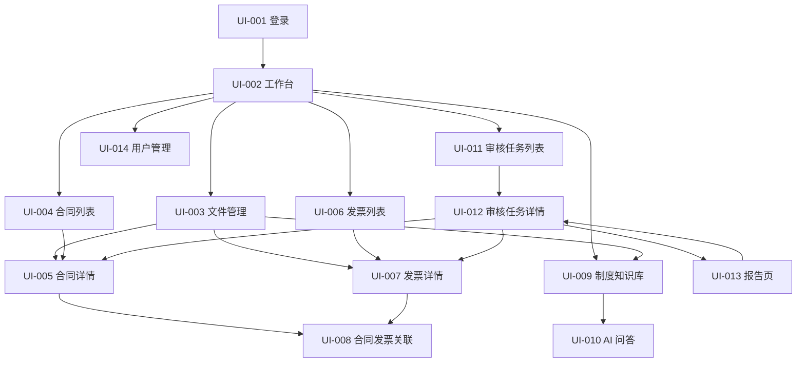

# FinAudit Agent 页面与交互设计说明书 V1.0

## 文档信息

| 项目 | 内容 |
|---|---|
| 项目名称 | FinAudit Agent——企业财务文档智能审核与风险分析平台 |
| 文档名称 | 页面与交互设计说明书 |
| 文档版本 | V1.0 |
| 文档状态 | 前端设计基线 |
| 编制日期 | 2026-08-05 |
| 需求基线 | 《FinAudit Agent 项目需求规格说明书 V1.3》 |
| 架构基线 | 《FinAudit Agent 系统架构设计说明书 V1.0》 |
| 数据基线 | 《FinAudit Agent 数据库设计说明书 V1.0》 |
| API 基线 | 《FinAudit Agent API 接口设计说明书 V1.0》 |
| 适用阶段 | UI 原型、前端开发、接口联调、测试设计、开发任务拆分、验收 |
| 目标读者 | 产品经理、项目经理、UI/UX 设计师、前端工程师、后端工程师、AI 工程师、测试工程师、安全工程师 |
| 页面范围 | P0 MVP 的 UI-001～UI-014；P1 页面仅说明边界，不进入本版本验收 |
| 设计原则 | 证据优先、状态分离、权限可解释、人工可干预、异步可感知、错误可追踪、版本不可覆盖 |

## 修订记录

| 版本 | 日期 | 说明 | 状态 |
|---|---|---|---|
| V1.0 | 2026-08-05 | 根据需求 V1.3、架构 V1.0、数据库 V1.0 和 API V1.0 形成首版页面与交互详细设计 | 当前版本 |
| CR-001-R2 / CR-002-R4 | 2026-08-07 | 同步强制换密、break-glass 双人控制、上传意图、可恢复 Job 与已批准 AI 合同；真实 Provider 网络和 production 不在本次范围 | 已批准合同同步 |
| CR-012-R3 | 2026-08-09 | 同步财务主数据身份和空表 `20260807_006` 存储边界；页面、路由和交互增量为 0 | 已批准 contract；GAP-064 运行时、真实数据、Provider/网络和 production 未授权 |
| CR-004-R2 | 2026-08-09 | approved contract scope：同步 Job `row_version/retryable`、条件重试/取消和后端 scope 门禁 | 已批准 contract；页面/路由增量为 0，前端 runtime 未授权 |
| CR-011-R4 | 2026-08-09 | approved contract scope：同步 AI contract/offline 展示边界；页面、路由和交互增量为 0 | 已批准 contract；前端不得读取 Policy secret、直连 Provider 或推断 runtime 状态 |
| CR-011-R5 | 2026-08-10 | approved contract-offline startup scope：同步本地 startup adoption 的零页面边界 | 已批准 contract；页面/路由增量为 0，前端不得读取 Policy/secret 或推断 Provider/runtime readiness |
| CR-011-R6 | 2026-08-10 | approved startup evidence-boundary successor：同步分层 startup evidence 的零页面变化 | 已批准 contract；页面/路由增量为 0，前端不得把 `NOT_CLAIMED` 显示为 readiness |
| CR-003-R3 | 2026-08-11 | approved privileged-auth current-baseline successor：同步特权授权五态与决定/撤销事实 | 已批准 contract；页面/路由增量为 0，UI 不得推断 actor 资格、延长授权或代替后端 CAS |

---

## 已批准 CR-004-R2 页面模型与交互投影

本节规范性替换下文 Job 重试/取消的冲突旧说明；页面范围仍为 UI-001～UI-014，不新增路由、页面或前端自维护 retry 状态。

- Job 模型必须保存并展示 OPS-001 返回的权威 `row_version` 与只读 `retryable`。FILE/AUDIT 重试、审核取消只能发送最近一次 OPS-001 或动作响应返回的 Job 版本；`JOB_VERSION_CONFLICT` 时重新读取权威状态，不静默覆盖或自动重放。
- 重试按钮只在后端 `retryable=true` 且返回固定 scope 时可用；不得从 status 之外的页面缓存、错误文案或本地错误码表推断。提交 FILE-007/AUDIT-007 时同时发送后端 scope、reason 和 `row_version`，成功后采用返回的新版本、queued 状态、计划 stage 与 scheduled attempt。
- AUDIT-008 对 draft/validating 的 execution-only 取消显式发送 `row_version=null`；queued/running 必须发送当前 Job 版本。queued 成功后显示 cancelled；running 成功后显示 cancel_requested，并继续轮询直到后端权威终态。
- 相同取消请求的 replay 始终展示后端重读后的当前动作投影，不能缓存首次 cancel_requested 响应冒充最新状态。前端不创建假 Job、假 attempt、假 Step，也不推断 execution 与 Job 已同步。
- 具体 API/runtime、生产 Handler scope、Worker、Broker、浏览器 E2E、部署和 production 仍未授权；空表 `20260807_007` 通过不代表 UI 功能完成。

---

## 已批准 CR-011-R4 零页面投影

- 本轮页面、路由、导航、按钮和交互状态增量均为 0；现有 UI 不因 Gate B 静态或 Fake 证据展示“Provider 可用”“持久化完成”或“生产就绪”。
- Frontend 不读取 Policy 文件或 secret slot 值，不直连 Provider，不接收 `SendPermit/AdoptPermit`，也不得从 contract/offline 结果推断真实 runtime 状态。
- `AI_PROVIDER_CALLS_ENABLED=false`、Provider/网络和 production 未授权仍是用户可感知能力边界。

## 已批准 CR-011-R5 零页面投影

- 页面、路由、导航、组件、按钮与交互状态增量均为 0；本地 startup adoption 不新增任何用户可调用能力。
- Frontend 不读取 Policy 文件、package resource 或 secret，不推断 Provider/runtime readiness，也不得把进程内部 fail-closed 结果展示为环境已就绪。

## 已批准 CR-011-R6 startup evidence-boundary 零页面投影

- 页面与路由的 delta 均为 0；前端不得把 `NOT_CLAIMED` 显示为 readiness。

## 已批准 CR-003-R3 特权授权 current-baseline 页面投影

本节精确绑定 R1 24270/cbe087aeb13f149fe6961f4daa71791ef8dd62b5d43bd1b1bb03b17c64cb8045、R2 35977/7a69b8555d422a7c2bee9d74da7030b8170692c934d83c12dd722c15c85c8363 与 R3 29321/35b1cdd758128afa485f91e34c5ef0dcfd95c4a648906e488099f68ff792e68c effective contract；R2 仍为 0/9 且未同步；与本文件中尚未同步的旧说明冲突时，以本节及 CR-003-R3 exact effective contract 为准。

- 保留特权授权五态、决定/撤销事实、冲突与过期语义；页面只展示后端事实。
- UI 不得推断 actor 当前资格、延长授权、代替后端 CAS 或把本次 contract 同步显示为 runtime readiness；页面与路由增量为 0。

---

# 1. 文档目的与设计边界

## 1.1 文档目的

本文档把已确认的业务流程、角色权限、数据对象、状态机和 API 落实为可执行的前端页面设计，明确：

1. 页面清单、菜单结构、页面区域与路由。
2. 列表查询条件、表格字段、详情字段与默认排序。
3. 按钮、操作权限、状态前置条件和二次确认。
4. 页面跳转、返回路径、查询条件保留和深层链接处理。
5. 首次加载、局部加载、空状态、错误状态和权限状态。
6. OCR、Markdown、分块、索引、评测、审核和报告等异步任务的处理中交互。
7. 合同、发票、制度的原文件、结构块、Markdown、字段与证据联动方式。
8. 风险事实、规则计算、制度依据、AI 解释和人工结论的分层展示。
9. 人工纠错、字段确认、风险复核、退回修正与重审交互。
10. 页面、接口、角色和核心数据对象之间的追踪关系。

## 1.2 不改变的基线

本说明书不改变以下已确认内容：

- P0 固定五种角色及职责分离规则。
- P0 页面数量为 UI-001～UI-014。
- PostgreSQL 是业务事实唯一来源。
- 原文件、解析版本、Markdown、分块、索引、审核执行和报告采用版本化设计。
- AI 不负责确定性规则判断，不替代人工最终复核。
- high 风险只能由审计复核人员最终处理。
- 制度业务审批与技术构建、索引激活、技术发布相互分离。
- 异步任务只展示真实阶段，不展示未经计算的百分比。
- P0 不提供 WYSIWYG Markdown 编辑器、在线规则 DSL、动态图谱和多 Agent 页面。

## 1.3 设计推导顺序

```text
需求中的角色、流程和状态机
→ 数据库中的对象、字段、版本与约束
→ API 中的资源、动作、权限与错误码
→ 页面信息架构和交互流程
→ 前端组件、状态管理和验收条件
```

## 1.4 P0 页面收敛原则

为避免 MVP 页面膨胀：

- 文件列表、文件详情、解析版本、结构块纠错、Markdown 版本和来源映射统一归入 UI-003。
- 制度、Markdown、分块、索引、检索调试和检索评测统一归入 UI-009 的标签页。
- 审核任务、执行版本、快照、规则、风险、复核和时间线统一归入 UI-012。
- 报告版本、预览和下载统一归入 UI-013。
- P0 不新增独立“任务中心”“日志中心”“系统配置中心”页面；相关技术状态在关联业务页面中按权限展示。

## 1.5 CR-012-R3 页面零增量边界

- `ui_page_delta=0`、`route_delta=0`、`component/store_delta=0`；P0 仍为 UI-001～UI-014。CR-012-R3 不新增字段、表单、按钮、动作、错误文案、状态标签或浏览器流程。
- 合同编号唯一范围、供应商双税务来源列、来源矩阵和循环外键是 PostgreSQL 存储事实。前端不得据此推断统一税务字段、身份类型、冲突语义或状态转换，也不得新增 `supplier_identity_kind`。
- GAP-064 获批并同步前，不得实现或宣称验收 `SUPP-003`、CON-005 的供应商确认/复用、来源回填、AI generic tax 投影和数据库冲突页面行为；现有页面描述不是绕过阻断的授权。
- 本次批准只允许九份 Request 同步、空表 `20260807_006` DDL/ORM 和离线或专用全合成 PostgreSQL 16 验证；不使用真实数据，不发起 Provider/其他网络调用，不部署或 production 放行。

---

# 2. 用户角色与前端权限模型

## 2.1 固定角色

| 角色代码 | 中文名称 | 前端主要入口 | 关键操作 |
|---|---|---|---|
| `system_admin` | 系统管理员 | 工作台、文件运维、制度知识库、用户管理 | 用户启停、失败任务重试、分块配置、索引构建/批准/激活、制度技术发布 |
| `finance_reviewer` | 财务审核人员 | 工作台、文件、合同、发票、关联、审核任务、报告 | 字段确认、主合同确认、创建/执行任务、复核非 high 风险、提交审计、导出报告 |
| `audit_reviewer` | 审计复核人员 | 工作台、合同/发票只读、制度知识库、审核任务、报告 | 制度业务审批、评测数据集审批、high 风险复核、退回事实修正 |
| `contract_admin` | 合同管理员 | 工作台、文件、合同、发票关联查看、合同发票关联 | 合同/补充协议维护、合同附件、关联建议 |
| `read_only` | 只读用户 | 工作台、授权合同/发票、已完成任务、报告预览 | 仅查看；P0 不下载、不导出 |

## 2.2 前端权限处理原则

1. 前端根据 `AUTH-004 /auth/me` 返回的 `roles` 和 `permissions` 控制菜单、按钮和入口。
2. 前端权限只用于减少误操作，不替代后端鉴权。
3. 无权限且无理解价值的操作按钮隐藏。
4. 用户有查看权但因对象状态不满足而暂不可操作时，按钮禁用，并显示明确原因。
5. 后端返回 `AUTH_FORBIDDEN` 时，不推测资源是否存在；统一展示“无权访问或资源不可用”。
6. 页面深层链接被拒绝时，保留 Trace ID，并提供返回有权限列表页的入口。
7. 角色变更后，前端下一次请求必须刷新 `/auth/me`；旧权限缓存不得继续允许操作。

## 2.3 操作权限表现方式

| 场景 | 表现 |
|---|---|
| 完全无操作权限 | 隐藏按钮和菜单 |
| 有权限但状态不满足 | 按钮禁用，悬停/聚焦显示原因 |
| 需要填写原因 | 打开确认弹窗或侧边抽屉，原因为必填 |
| 高风险敏感动作 | 显示角色要求、影响范围、不可逆提示和二次确认 |
| 乐观锁冲突 | 禁止静默覆盖，展示对比并要求刷新 |
| 幂等请求处理中 | 禁止重复提交，保留首次请求状态 |

---

# 3. 信息架构与全局导航

## 3.1 一级菜单

| 菜单 | 页面 | 可见角色 |
|---|---|---|
| 工作台 | UI-002 | 全部已登录角色 |
| 文件管理 | UI-003 | system_admin、finance_reviewer、audit_reviewer、contract_admin；read_only 仅授权文件入口 |
| 合同管理 | UI-004、UI-005 | finance_reviewer、audit_reviewer、contract_admin、read_only |
| 发票管理 | UI-006、UI-007 | finance_reviewer、audit_reviewer、contract_admin、read_only |
| 合同发票关联 | UI-008 | finance_reviewer、contract_admin、audit_reviewer |
| 制度知识库 | UI-009 | 全部已登录角色，按制度和技术权限裁剪 |
| AI 问答 | UI-010 | 全部已登录角色 |
| 审核任务 | UI-011、UI-012 | finance_reviewer、audit_reviewer、contract_admin、read_only |
| 审核报告 | UI-013 | 从任务详情进入；不单独作为默认一级菜单 |
| 用户管理 | UI-014 | system_admin |

## 3.2 页面路由

| 页面 | 建议路由 | 说明 |
|---|---|---|
| UI-001 登录页 | `/login` | 未登录入口 |
| UI-002 工作台 | `/dashboard` | 登录默认页 |
| UI-003 文件管理 | `/files`、`/files/:fileId` | 同一页面模块的列表态与详情态 |
| UI-004 合同列表 | `/contracts` | 合同查询 |
| UI-005 合同详情 | `/contracts/:contractId` | 含补充协议、附件和历史 |
| UI-006 发票列表 | `/invoices` | 发票查询 |
| UI-007 发票详情 | `/invoices/:invoiceId` | 含明细、重复检测和证据 |
| UI-008 合同发票关联 | `/contract-invoice-links` | 支持带 `invoiceId` 或 `contractId` 查询参数进入 |
| UI-009 制度知识库 | `/knowledge-bases`、`/knowledge-bases/:kbId` | 标签页由 `tab` 查询参数保持 |
| UI-010 AI 问答 | `/qa` | 知识库、基准日期和问题 |
| UI-011 审核任务列表 | `/audit-tasks` | 任务和当前执行摘要 |
| UI-012 审核任务详情 | `/audit-tasks/:taskId` | 执行版本通过 `executionId` 查询参数切换 |
| UI-013 报告页 | `/audit-reports/:reportId` | 从任务详情进入 |
| UI-014 用户管理 | `/users` | system_admin 专属 |

## 3.3 页面跳转总图



## 3.4 返回与查询条件保留

1. 列表页查询条件、分页、排序和滚动位置写入 URL 查询参数或路由状态。
2. 详情页返回列表时恢复原筛选条件，不回到默认第一页。
3. 从风险证据跳转到合同、发票或制度后，返回时恢复原风险和展开位置。
4. 从 UI-009 的标签页跳转到文件详情后，返回时恢复知识库、制度版本和标签页。
5. 深层链接直接打开时，若用户有权限则加载目标；若无权限则不显示目标对象名称和摘要。

---

# 4. 全局页面框架

## 4.1 桌面端布局

```text
┌──────────────────────────────────────────────────────────┐
│ 顶部栏：系统名称 / 全局任务提示 / 用户与角色 / 退出      │
├──────────────┬───────────────────────────────────────────┤
│ 侧边菜单      │ 面包屑 / 页面标题 / 页面级主要操作         │
│              ├───────────────────────────────────────────┤
│              │ 主内容区                                   │
│              │                                           │
│              └───────────────────────────────────────────┤
└──────────────┴───────────────────────────────────────────┘
```

## 4.2 顶部栏

顶部栏至少包含：

- 项目名称“FinAudit Agent”。
- 当前环境标识：开发、测试、生产；生产环境不显示敏感配置。
- 当前用户显示名。
- 当前有效角色；多角色时可展示全部角色标签，但不提供绕过职责分离的“角色切换模拟”。
- 异步任务摘要入口：仅展示当前用户有权查看的进行中或失败任务数量；点击后定位到相关业务页面，不建立独立 P0 任务中心。
- 退出登录。

## 4.3 面包屑

- 面包屑按“模块 > 列表 > 对象详情 > 子标签”展示。
- 对象名过长时截断，完整名称通过悬停或聚焦查看。
- 不在面包屑中展示完整税号、文件哈希、Token 或内部对象键。

## 4.4 页面标题区

每个页面标题区包含：

- 页面名称。
- 对象状态或摘要。
- 页面级主操作，最多突出一个主要按钮。
- 次要操作放入普通按钮或“更多”菜单。
- 过期、降级、低置信、待复核等重要状态必须在标题区或首屏可见。

---

# 5. 通用组件与数据展示规范

## 5.1 查询区

1. 常用查询条件首行展示；低频条件放入“更多筛选”。
2. 查询按钮使用“查询”，重置按钮使用“重置”。
3. 输入关键字按 Enter 触发查询。
4. 日期范围使用闭区间输入，提交时按 API 定义转换。
5. 查询条件改变后不自动请求，避免大列表频繁调用；用户点击查询或按 Enter 后请求。
6. 已应用筛选以可移除标签展示。

## 5.2 表格

| 项目 | 规范 |
|---|---|
| 默认分页 | `page=1`、`page_size=20` |
| 可选分页 | 20、50、100；不得超过 API 上限 100 |
| 空值 | 展示 `—`，不使用空字符串 |
| 金额 | 使用千位分隔符和币种；计算与请求仍使用十进制字符串 |
| 日期 | `YYYY-MM-DD` |
| 日期时间 | 按用户时区展示，悬停显示 UTC 原值（需要时） |
| 状态 | 使用“文字 + 图形/标识”，不得只依赖颜色 |
| 长文本 | 单行省略，悬停或点击查看完整内容 |
| 操作列 | 固定在右侧；高频操作直接显示，低频操作放入更多菜单 |
| 排序 | 仅允许 API 白名单字段；当前排序写入 URL |
| 批量操作 | 仅在 API 和业务规则支持时出现，不通过前端拼接单条请求模拟事务性批量操作 |

## 5.3 表单

1. 必填字段显示明确标识。
2. 数字和金额字段不得使用 JavaScript 浮点直接计算财务结果。
3. 保存草稿和执行状态动作分离，不能通过一个“保存”按钮隐式推进状态。
4. 修改接口携带当前 `row_version`。
5. 关键事实修改必须展示原值、新值和原因。
6. 表单提交中禁用重复提交，并保留首次 `Idempotency-Key`。
7. 关闭有未保存内容的弹窗、抽屉或页面时进行离开确认。

## 5.4 弹窗与抽屉

| 类型 | 使用场景 |
|---|---|
| 轻量确认弹窗 | 归档、取消、重试等少量字段动作 |
| 表单弹窗 | 创建用户、简单角色替换、创建知识库 |
| 侧边抽屉 | 字段证据、风险详情、结构块纠错、评测逐题详情 |
| 全屏对照模式 | 原文、结构块、Markdown、字段或风险证据联动查看 |

## 5.5 通知反馈

- 成功：说明完成的动作和对象，不使用“操作成功”作为唯一信息。
- 异步受理：说明“任务已创建”，显示当前阶段和查看入口，不宣称处理已完成。
- 警告：说明当前结果仍可使用的范围，例如“AI 解释失败，规则结果已保存”。
- 错误：展示用户可理解信息、错误码、可操作建议和 Trace ID。

---

# 6. 全局状态设计

## 6.1 首次加载

- 页面框架立即显示，主内容使用骨架屏。
- 首次加载超过合理时间时显示“仍在加载”，并提供刷新操作。
- 不在加载期间用旧对象数据冒充当前对象。

## 6.2 局部加载

- 表格查询只覆盖表格区域。
- 标签页切换只加载目标标签。
- 提交按钮显示动作中状态并禁用。
- 文件预览、证据定位和 Markdown 加载互不阻塞。

## 6.3 空状态分类

| 空状态 | 文案重点 | 推荐操作 |
|---|---|---|
| 系统尚无数据 | 说明可创建的首个对象 | 按角色显示上传/创建按钮 |
| 当前筛选无结果 | 说明筛选条件导致无结果 | 清除筛选 |
| 尚未生成派生版本 | 说明前置条件 | 发起转换/构建，或查看前置错误 |
| 尚未生成风险 | 区分未执行与执行无风险 | 执行任务或查看规则结果 |
| 尚未生成报告 | 说明必须先完成审核执行 | 生成报告 |
| 无访问权限 | 不泄露资源信息 | 返回列表或工作台 |

## 6.4 错误状态结构

错误组件至少包含：

```text
错误标题
用户可理解说明
错误码
建议操作
Trace ID + 复制按钮
重试 / 刷新 / 返回列表
```

不得展示：

- SQL 和数据库表内部异常。
- MinIO 内部对象路径和密钥。
- 模型系统 Prompt。
- API Key、Token 或完整敏感正文。
- 后端调用堆栈。

## 6.5 并发冲突

收到 `RESOURCE_VERSION_CONFLICT` 时：

1. 保留用户当前编辑内容，不自动丢弃。
2. 显示“该对象已被其他用户修改”。
3. 提供“查看最新数据”和“复制我的修改”操作。
4. 不提供强制覆盖按钮。
5. 刷新后要求用户基于最新 `row_version` 重新提交。

## 6.6 异步任务状态

### 6.6.1 通用状态

| 状态 | 页面表现 |
|---|---|
| `queued` | 已排队，展示创建时间和任务类型 |
| `running` | 展示真实 `stage` 和尝试次数 |
| `succeeded` | 刷新关联资源，展示完成时间 |
| `failed` | 展示脱敏错误、可重试性、Trace ID |
| `cancel_requested` | 展示正在请求取消，不宣称已取消 |
| `cancelled` | 展示取消时间和后续可执行操作 |

### 6.6.2 阶段中文映射

| 后端阶段示例 | 页面文案 |
|---|---|
| `security_scan` | 正在进行文件安全检查 |
| `parsing` | 正在解析文档 |
| `ocr` | 正在执行 OCR 识别 |
| `field_extraction` | 正在提取业务字段 |
| `markdown_converting` | 正在转换 Markdown |
| `markdown_validating` | 正在校验 Markdown |
| `chunk_building` | 正在生成文档分块 |
| `embedding` | 正在生成向量 |
| `index_consistency_check` | 正在校验索引一致性 |
| `retrieval_evaluation` | 正在执行检索评测 |
| `snapshot_building` | 正在冻结审核快照 |
| `rule_execution` | 正在执行审核规则 |
| `policy_retrieval` | 正在检索制度证据 |
| `risk_explanation` | 正在生成风险解释 |
| `report_generating` | 正在生成审核报告 |

页面不得把阶段转换为虚假百分比。

## 6.7 部分成功与降级

页面必须分别展示独立处理链路：

- 文件存储状态。
- 解析状态。
- 字段提取状态。
- Markdown 状态。
- 制度分块状态。
- 知识库索引状态。
- AI 解释状态。
- 报告状态。

示例：字段提取成功但 Markdown 失败时，合同/发票字段仍可确认；文件详情同时显示 Markdown 异常。LLM 不可用时，审核规则结果仍可复核，页面显示 AI 降级声明。

---

# 7. 状态标签与对象状态分离

## 7.1 文件状态

`uploaded / validating / stored / rejected / archived`

页面中文：已上传、校验中、已存储、已拒绝、已归档。

## 7.2 解析版本状态

`queued / running / succeeded / manual_review_required / active / failed / superseded`

特别规则：

- `manual_review_required` 显示“需要人工纠错”。
- `succeeded` 不等于活动版本。
- 同一文件只突出一个 `active` 解析版本。

## 7.3 Markdown 状态

`queued / converting / validating / review_required / ready / active / failed / superseded / archived`

特别规则：

- `ready` 显示“质量通过，待激活”。
- `review_required` 显示阻断问题数量。
- 制度无活动 Markdown 时，分块按钮禁用。

## 7.4 分块集合状态

`queued / building / quality_review / ready / active / failed / blocked / superseded / archived`

`blocked` 必须展示阻断原因，不与 `failed` 混合。

## 7.5 索引版本状态

`queued / building / consistency_check / evaluation_pending / approved / active / failed / rejected / superseded`

- `approved` 表示通过技术和质量门禁但尚未切换。
- `active` 表示线上检索正在使用。
- 旧活动索引在新索引失败时仍显示“当前可用”。

## 7.6 制度业务状态

`draft / pending_business_review / approved / rejected / published / superseded / revoked / archived`

- `superseded` 可按历史基准日期参与检索。
- `revoked` 不参与新检索。
- 制度业务状态不得与索引状态合并为一个标签。

## 7.7 审核执行状态

`draft / validating / queued / running / pending_finance_review / pending_audit_review / returned_for_correction / completed / failed / cancelled / outdated`

- `outdated` 在详情和报告首屏显示明显过期提示。
- `returned_for_correction` 显示退回原因和待修正对象。

## 7.8 风险等级与复核状态

风险等级：`none / notice / low / medium / high`。

复核状态：`pending / confirmed / dismissed / adjusted`。

页面必须同时展示：

- `original_level`：规则产生的原始等级。
- `effective_level`：人工调整后的有效等级。
- `review_status`：人工复核状态。

---

# 8. 页面—接口总览

| 页面 | 页面名称 | 主要接口 |
|---|---|---|
| UI-001 | 登录页 | AUTH-001、AUTH-002、AUTH-003、AUTH-010 |
| UI-002 | 工作台 | AUTH-004、AUDIT-001、OPS-001 |
| UI-003 | 文件管理 | FILE-001～FILE-008、PARSE-001～PARSE-005、MD-001～MD-008、OPS-001 |
| UI-004 | 合同列表 | CON-001 |
| UI-005 | 合同详情 | CON-002～CON-007、SAGR-001～SAGR-004、SUPP-001～SUPP-003、FILE-005 |
| UI-006 | 发票列表 | INV-001、INV-006、SUPP-001 |
| UI-007 | 发票详情 | INV-002～INV-006、SUPP-001～SUPP-003、FILE-005 |
| UI-008 | 合同发票关联 | LINK-001～LINK-004 |
| UI-009 | 制度知识库与检索测试 | KB-001～KB-004、POL-001～POL-010、CHUNK-001～CHUNK-007、INDEX-001～INDEX-005、RET-001、EVAL-001～EVAL-008 |
| UI-010 | AI 问答 | QA-001、QA-002 |
| UI-011 | 审核任务列表 | AUDIT-001～AUDIT-005、AUDIT-007 |
| UI-012 | 审核任务详情 | AUDIT-003～AUDIT-008、RULE-001～RULE-002、RISK-001～RISK-002、REVIEW-001～REVIEW-003 |
| UI-013 | 报告页 | REPORT-001～REPORT-003、EXPORT-001、OPS-001 |
| UI-014 | 用户管理 | AUTH-005～AUTH-009、AUTH-011～AUTH-015 |

---

# 9. UI-001 登录页

## 9.1 页面定义

| 项目 | 设计 |
|---|---|
| 页面目标 | 完成用户认证，并明确处理认证失败、账号锁定、禁用和首次强制换密状态 |
| 路由 | `/login` |
| 访问角色 | 匿名用户；已登录用户访问时跳转工作台 |
| 主要接口 | AUTH-001、AUTH-002、AUTH-003、AUTH-010 |

## 9.2 页面区域

1. 品牌区：项目名称和一句话说明。
2. 登录表单区：用户名、密码、记住我、登录按钮。
3. 强制换密区：仅在 `AUTH_PASSWORD_CHANGE_REQUIRED` 时展示当前临时密码、新密码、确认新密码和提交按钮。
4. 错误提示区：认证错误、锁定、禁用、限流和受限换密 Token 失效。
5. 安全说明区：不展示默认账号、API 地址或环境密钥。

## 9.3 字段与校验

| 字段 | 必填 | 校验 |
|---|---:|---|
| 用户名 | 是 | 去除首尾空格；不得在前端判断账号是否存在 |
| 密码 | 是 | 仅在 HTTPS 发送；不在日志、URL 或本地持久化中保存 |
| 记住我 | 否 | 仅影响 Refresh Token 生命周期，由后端决定 |

## 9.4 状态与错误

| 错误码 | 页面文案和操作 |
|---|---|
| `AUTH_INVALID_CREDENTIALS` | 用户名或密码错误；不区分账号是否存在 |
| `AUTH_ACCOUNT_LOCKED` | 账号已锁定；显示可重试时间（后端提供时） |
| `AUTH_USER_DISABLED` | 账号已停用，请联系系统管理员 |
| `AUTH_PASSWORD_CHANGE_REQUIRED` | 不进入普通登录态；切换到强制换密区，并只在内存中持有后端返回的 5 分钟一次性 `password_change_token` |
| `AUTH_PASSWORD_CHANGE_TOKEN_INVALID` | 受限 Token 无效、已使用或过期；清空换密表单和内存 Token，返回登录表单重新认证 |
| `RATE_LIMITED` | 登录尝试过于频繁，请稍后再试 |

## 9.5 验收条件

1. 登录中禁止重复提交。
2. 登录失败不清空用户名，清空密码。
3. 普通登录成功才跳转 `/dashboard`；强制换密响应不得签发或保存 Access/Refresh Token，也不得进入工作台。
4. 强制换密成功后清除临时密码和一次性 Token，提示用户使用新密码重新登录；一次性 Token 不进入 URL、日志、Cookie、LocalStorage、SessionStorage 或状态持久化插件。
5. 登录及换密错误不暴露账号存在性，不保留密码字段。
6. Access Token 过期时尝试受控刷新；刷新失败返回登录页并清理本地登录态。

---

# 10. UI-002 工作台

## 10.1 页面定义

| 项目 | 设计 |
|---|---|
| 页面目标 | 按角色展示当前待办、风险、最近任务和需要关注的异步失败 |
| 路由 | `/dashboard` |
| 访问角色 | 全部已登录角色 |
| 主要接口 | AUTH-004、AUDIT-001、OPS-001；其他摘要接口若 API 未提供则不得前端全量拉取模拟 |

## 10.2 页面区域

1. 用户与角色欢迎区。
2. 我的待办卡片。
3. 审核状态摘要。
4. 高风险或待审计摘要。
5. 最近审核任务表格。
6. 与当前用户相关的失败任务提示。

## 10.3 角色化内容

| 角色 | 核心卡片 |
|---|---|
| system_admin | 失败技术任务、待构建/待评测索引、待技术发布制度、用户状态异常 |
| finance_reviewer | 待确认字段、待财务复核、退回修正、可生成报告任务 |
| audit_reviewer | 待 high 风险复核、待制度业务审批、待评测数据集审批 |
| contract_admin | 待确认合同字段、待确认补充协议、待处理关联建议 |
| read_only | 最近已完成任务和可查看报告 |

## 10.4 最近任务表格

| 字段 | 说明 |
|---|---|
| 任务编号 | 点击进入 UI-012 |
| 任务名称 | 任务摘要 |
| 当前执行版本 | `V1/V2...` |
| 当前执行状态 | 与稳定任务状态分开 |
| 总体风险 | 展示有效总体风险 |
| 负责人 | 授权范围内显示 |
| 更新时间 | 最近状态变化时间 |

## 10.5 跳转规则

- 点击待财务复核卡片：跳转 UI-011，带 `execution_status=pending_finance_review`。
- 点击待审计卡片：带 `execution_status=pending_audit_review`。
- 点击 high 风险卡片：带 `risk_level=high`。
- 点击失败任务提示：跳转到关联文件、制度、审核任务或报告页面，并定位失败阶段。

## 10.6 验收条件

1. 工作台待办数与对应列表筛选结果一致。
2. 不为生成卡片而请求用户无权访问的业务明细。
3. 无待办时展示角色化空状态，不显示错误。

---

# 11. UI-003 文件管理

## 11.1 页面定义

| 项目 | 设计 |
|---|---|
| 页面目标 | 管理文件上传、存储、解析、结构块纠错、Markdown、预览、重试和归档 |
| 路由 | `/files`、`/files/:fileId` |
| 访问角色 | 按业务范围和角色控制 |
| 主要接口 | FILE-001～FILE-008、PARSE-001～PARSE-005、MD-001～MD-008、OPS-001 |

## 11.2 列表页查询条件

| 查询条件 | API 参数 |
|---|---|
| 关键字 | `keyword`：文件名或业务编号 |
| 业务类型 | `business_type` |
| 文件状态 | `file_status` |
| 解析状态 | `parse_status` |
| Markdown 状态 | `markdown_status` |
| 分页 | `page/page_size` |

## 11.3 文件列表字段

| 字段 | 说明 |
|---|---|
| 文件名 | 点击进入详情；显示扩展名 |
| 业务类型 | 合同、补充协议、发票、制度 |
| 文件状态 | 单独状态列 |
| 安全扫描状态 | 独立展示 `pending/clean/infected/scan_failed/unsupported/not_configured`，不得并入文件状态；只有 `clean` 可继续解析 |
| 解析状态 | 单独状态列 |
| Markdown 状态 | 单独状态列 |
| 主业务对象 | 已绑定时显示编号/名称并可跳转 |
| 文件大小 | 人类可读格式 |
| 上传人 | 按权限展示 |
| 上传时间 | 日期时间 |
| 最近处理阶段 | 来自最新 Job |
| 操作 | 预览、查看详情、重试、下载、归档 |

默认排序：上传时间倒序。文件、解析和 Markdown 状态不得合并为一个“处理状态”。

## 11.4 页面级按钮

| 操作 | system_admin | finance_reviewer | audit_reviewer | contract_admin | read_only |
|---|---:|---:|---:|---:|---:|
| 上传合同/发票 | 运维补传 | 可 | 无 | 合同/补充协议 | 无 |
| 上传制度 | 技术上传 | 无 | 可 | 无 | 无 |
| 批量上传 | 按上述业务范围 | 可 | 制度 | 合同/补充协议 | 无 |
| 原文件下载 | 运维受限 | 可 | 可 | 可 | 无 |
| Markdown 下载 | 按文件权限 | 可 | 可 | 可 | 无 |
| 归档 | 技术或业务范围 | 可 | 制度范围 | 合同范围 | 无 |

## 11.5 上传交互

1. 支持拖拽和文件选择。
2. 展示允许格式：PDF、DOCX、JPG、JPEG、PNG。
3. 展示单文件默认上限 50MB、单批默认上限 20 个。
4. 上传前做扩展名和大小快速校验；MIME、文件头和安全扫描以后端结果为准。
5. 每个文件独立显示上传、受理和后续处理状态。
6. 重复文件返回已有对象时，提示用户跳转已有文件，不创建虚假新行。
7. 单文件检测到多个独立业务文档时，显示“需要拆分”，不提供自动拆分 P0 操作。
8. 上传表单显式提交 `intended_business_type`、制度文件的 `target_knowledge_base_id` 和 `auto_process_requested`；非制度文件不得携带知识库目标。
9. 去重复用时必须展示 `reused`、已生效的上传意图和现有 Job 状态；分类冲突显示 `FILE_CLASSIFICATION_CONFLICT`，不得静默覆盖。`auto_process_requested` 只能从 false 原子升级为 true，不能回退。

## 11.6 文件详情布局

```text
标题区：文件名 / 业务类型 / 文件、解析、Markdown 独立状态 / 操作
处理链路区：安全检查 → 解析/OCR → 字段提取 || Markdown 转换/校验
主内容区：
┌─────────────────────────┬────────────────────────────┐
│ 原文件/页面预览          │ 解析块 / Markdown / 质量问题 │
└─────────────────────────┴────────────────────────────┘
底部：版本历史 / 处理任务 / 操作记录摘要
```

## 11.7 详情标签页

### 11.7.1 概览

展示文件元数据、主业务对象、活动解析版本、活动 Markdown 版本、最新 Job 和失败建议。

### 11.7.2 原文件预览

- 支持页码、缩放、适应宽度、旋转。
- 预览 URL 过期时自动重新请求授权，不在本地长期保存。
- read_only 可预览授权文件，但不可下载原文件。

### 11.7.3 解析版本与结构块

解析版本列表字段：版本号、来源类型、解析器/OCR 版本、平均置信度、页数、状态、创建时间、是否活动。

结构块列表字段：页码、顺序、类型、文本摘要、置信度、是否有效内容、资源类型、操作。

### 11.7.4 Markdown 版本

版本字段：版本号、解析版本、转换器版本、状态、字符数、Token 数、警告数、阻断数、内容哈希、创建时间、是否活动。

### 11.7.5 来源映射与质量

展示 AST 节点、Markdown 字符/行范围、页码、结构块、坐标、覆盖状态和质量问题。

## 11.8 结构块纠错

1. 用户选择结构块后打开侧边抽屉。
2. 展示原块文本、块类型、顺序、页码、坐标和原页面高亮。
3. 可修改：文本、块类型、阅读顺序和允许的坐标字段。
4. 必须填写纠错原因。
5. 提交后创建新解析版本，不能覆盖旧版本。
6. 新版本重新触发字段提取与 Markdown 转换。
7. 页面明确说明旧活动版本仍保留，只有通过门禁的新版本才能激活。

## 11.9 Markdown 交互

- Markdown 为只读预览，不提供直接编辑。
- 点击 Markdown 节点定位到原文件页码、结构块和坐标。
- 点击原文结构块定位到 Markdown 节点。
- 质量问题按 `blocking/error/warning/info` 分类。
- 激活按钮仅在状态为 `ready` 且无阻断问题时可用。
- 制度文件的活动 Markdown 被后续分块引用时，页面提示版本影响范围。

## 11.10 重试与归档

- 重试弹窗显示失败阶段、尝试次数和是否可恢复。
- 技术重试沿用同一 `job_id`，递增 `attempt_no` 并追加 Job Step 历史；不得为同一业务工作创建第二个 Job，也不得覆盖旧失败记录。
- 归档前展示该文件是否被合同、发票、制度或审核快照引用。
- 被引用对象只能按后端规则归档，不提供前端物理删除。

## 11.11 验收条件

1. 文件、解析、Markdown 独立展示。
2. 点击结构块或 Markdown 节点能定位到原文。
3. 纠错创建新解析版本并保留历史。
4. 失败任务展示错误码、建议和 Trace ID。
5. 字段提取成功但 Markdown 失败时，页面能同时显示部分成功状态。

---

# 12. UI-004 合同列表

## 12.1 页面定义

| 项目 | 设计 |
|---|---|
| 路由 | `/contracts` |
| 访问角色 | finance_reviewer、audit_reviewer、contract_admin、read_only |
| 主要接口 | CON-001 |

## 12.2 查询条件

| 条件 | API 参数 |
|---|---|
| 关键字 | `keyword`：合同编号、名称、乙方名称 |
| 合同状态 | `status` |
| 确认状态 | `confirmation_status` |
| 供应商 | `supplier_id` |
| 分页 | `page/page_size` |

API V1.0 未定义签订日期、有效期范围等列表参数，本版本页面不把这些条件作为 P0 必做筛选；如产品确认需要，先进入 API 变更。

## 12.3 表格字段

| 字段 | 说明 |
|---|---|
| 合同编号 | 可为空；点击详情 |
| 合同名称 | 主标题 |
| 乙方/供应商 | 供应商标准名称优先 |
| 合同金额 | 金额字符串格式化展示 |
| 币种 | 三字母币种 |
| 确认状态 | 未确认、已确认、已拒绝 |
| 合同状态 | 草稿、有效、到期、终止、归档 |
| 更新时间 | 最近更新时间 |
| 操作 | 查看；财务/合同管理员可进入维护 |

默认排序：更新时间倒序；API 未明确可排序字段时，前端不自行发送未支持排序。

## 12.4 页面操作

- “从文件创建合同”仅 finance_reviewer、contract_admin 显示；入口跳转 UI-003 选择有权文件。
- audit_reviewer、read_only 只读。
- system_admin 默认无业务列表入口。

## 12.5 空状态

- 无合同：有权限用户显示“上传合同文件”；只读用户只显示无数据。
- 筛选无结果：显示“清除筛选”。
- 无权草稿：不提示草稿数量，避免泄露。

## 12.6 验收条件

1. 金额不使用浮点计算。
2. 只读用户不可看到未授权草稿。
3. 点击返回后保留筛选和分页。

---

# 13. UI-005 合同详情

## 13.1 页面定义

| 项目 | 设计 |
|---|---|
| 路由 | `/contracts/:contractId` |
| 主要接口 | CON-002～CON-007、SAGR-001～SAGR-004、SUPP-001～SUPP-003、FILE-005 |
| 页面目标 | 查看并确认合同事实、证据、补充协议、附件、供应商和修改历史 |

## 13.2 页面布局

```text
标题区：合同编号/名称、确认状态、合同状态、主要操作
左侧：原文件预览
右侧标签：基础字段 / 关键条款 / 补充协议 / 附件 / 供应商 / 修改历史
```

## 13.3 基础字段

| 分组 | 字段 |
|---|---|
| 合同标识 | 合同编号、名称 |
| 主体 | 甲方名称/税号、乙方名称/税号、供应商 |
| 金额 | 合同金额、币种 |
| 日期 | 签订日期、生效日期、到期日期 |
| 付款 | 付款方式、付款条件 |
| 状态 | 字段确认状态、合同状态 |

每个可提取字段显示：

- AI/解析候选值。
- 人工确认值。
- 置信度。
- 确认状态。
- 页码、原文片段和坐标。
- 修改历史入口。

## 13.4 原始字段与有效字段

存在已确认且按基准日期生效的补充协议时：

- “原合同字段”与“当前有效字段”分开展示。
- 页面提供基准日期选择，用于查看对应日期的有效字段。
- 有效字段标记来源补充协议和生效日期。
- 不直接覆盖原合同值。

## 13.5 字段编辑与确认

| 操作 | finance_reviewer | contract_admin | audit_reviewer | system_admin | read_only |
|---|---:|---:|---:|---:|---:|
| 修改草稿字段 | 可 | 可 | 无 | 无 | 无 |
| 批量确认字段 | 可 | 可 | 无 | 无 | 无 |
| 查看证据 | 可 | 可 | 可 | 运维受限 | 可 |
| 退回事实修正 | 无 | 无 | 从任务页发起 | 无 | 无 |

交互规则：

1. 点击字段证据，左侧原文件定位并高亮。
2. 低置信核心字段在首屏和字段列表明确标记。
3. 修改值时显示原识别值和确认值差异。
4. 关键事实修改必须填写原因并携带 `row_version`。
5. 关键事实被已完成执行引用时，提交前提示相关执行和报告将被标记 `outdated`。

## 13.6 补充协议

列表字段：协议编号、名称、生效日期、确认状态、状态、变更项数量、来源文件、操作。

详情展示每个变更项：字段代码、原值、新值、证据、确认状态。

- contract_admin 可确认或拒绝补充协议。
- finance_reviewer 可在审核范围确认。
- audit_reviewer 只读并可在审核任务中退回事实修正。

## 13.7 普通附件

- 展示文件名、附件角色、描述、关联人、关联时间。
- 补充协议不得作为普通附件替代业务对象。
- 取消附件关系需确认并填写原因（后端要求时）。

## 13.8 供应商

展示候选供应商名称、税号、来源、确认状态。财务和合同管理员可确认或修改候选；审计只读。

> 上述为既有目标页面描述，不表示运行时合同已闭合。GAP-064 获批并同步前，前端不得实现或模拟 `SUPP-003`/CON-005 确认、复用、来源回填、统一税务字段投影、身份类型推断或数据库冲突错误交互；相关浏览器验收为 `NOT_RUN`。

## 13.9 验收条件

1. 原文、字段和证据双向定位。
2. 原合同字段与补充协议生效后的有效字段分开。
3. 关键事实修改提示历史执行过期影响。
4. audit_reviewer 不可直接修改合同字段。

---

# 14. UI-006 发票列表

## 14.1 页面定义

| 项目 | 设计 |
|---|---|
| 路由 | `/invoices` |
| 访问角色 | finance_reviewer、audit_reviewer、contract_admin、read_only |
| 主要接口 | INV-001、INV-006、SUPP-001 |

## 14.2 查询条件

| 条件 | API 参数 |
|---|---|
| 关键字 | `keyword`：发票代码、号码、销售方 |
| 发票状态 | `status` |
| 重复状态 | `duplicate_status` |
| 开票日期范围 | `invoice_date_from/to` |
| 分页 | `page/page_size` |

## 14.3 表格字段

| 字段 | 说明 |
|---|---|
| 发票代码 | 可为空 |
| 发票号码 | 点击详情 |
| 开票日期 | `YYYY-MM-DD` |
| 销售方 | 名称 |
| 价税合计 | 金额字符串格式化 |
| 确认状态 | 独立列 |
| 重复状态 | 独立列，不与确认状态合并 |
| 主合同 | 已确认时显示合同编号 |
| 更新时间 | 最近更新时间 |
| 操作 | 查看、重复检测、进入关联 |

## 14.4 按钮权限

- finance_reviewer：从文件创建、维护、确认、执行重复检测、进入关联。
- contract_admin：只读发票摘要，可进入关联建议。
- audit_reviewer：只读。
- read_only：仅授权范围只读。

## 14.5 重复状态表现

| 状态 | 页面说明 |
|---|---|
| `not_checked` | 尚未检测 |
| `unique` | 当前未发现重复 |
| `suspected` | 疑似重复，需要人工处理 |
| `confirmed_duplicate` | 已确认重复 |
| `exception_approved` | 已批准例外，展示原因和处理人 |

## 14.6 验收条件

1. 重复状态独立展示。
2. 疑似重复可从列表快速筛选。
3. 合同管理员不能修改发票字段。

---

# 15. UI-007 发票详情

## 15.1 页面定义

| 项目 | 设计 |
|---|---|
| 路由 | `/invoices/:invoiceId` |
| 主要接口 | INV-002～INV-006、SUPP-001～SUPP-003、FILE-005 |
| 页面目标 | 查看、修正和确认发票字段、明细、证据、重复检测及合同关系 |

## 15.2 布局

左侧原文件预览；右侧标签：发票字段、明细、证据、重复检测、合同关系、供应商、修改历史。

## 15.3 发票字段

| 分组 | 字段 |
|---|---|
| 标识 | 发票代码、发票号码、发票类型 |
| 日期 | 开票日期 |
| 购买方 | 名称、税号 |
| 销售方 | 名称、税号、供应商 |
| 金额 | 不含税金额、税额、价税合计、币种 |
| 状态 | 确认状态、重复状态、发票状态 |

每个核心字段显示候选值、确认值、置信度、页码、原文、坐标和修改历史。

## 15.4 发票明细表

| 字段 | 说明 |
|---|---|
| 行号 | 文件内行号 |
| 项目名称 | 明细名称 |
| 规格型号 | 可空 |
| 单位 | 可空 |
| 数量 | 十进制 |
| 单价 | 十进制 |
| 不含税金额 | 金额 |
| 税率 | 百分比展示，底层十进制 |
| 税额 | 金额 |
| 价税合计 | 金额 |
| 证据 | 定位到原文表格 |

## 15.5 字段编辑权限

仅 finance_reviewer 可修改和确认发票。audit_reviewer、contract_admin、read_only 均只读；system_admin 默认无业务修改入口。

## 15.6 重复检测

- 显示检测时间、匹配条件、候选发票和当前处理状态。
- 不把重复检测描述为税务机关真伪验证。
- 疑似重复候选列表展示发票代码、号码、销售方税号、日期和金额等确定性依据。

## 15.7 合同关系

- 显示候选关系和唯一主合同。
- 点击“管理关联”进入 UI-008，并携带 `invoiceId`。
- 已存在主合同时，确认另一个主合同前必须先处理冲突。

## 15.8 验收条件

1. 字段和明细均可定位原文。
2. 金额不使用浮点计算。
3. 审计发现事实错误时不能在此页修改，只能从审核任务退回。
4. 发票详情不能越权读取无权合同正文。

---

# 16. UI-008 合同发票关联

## 16.1 页面定义

| 项目 | 设计 |
|---|---|
| 路由 | `/contract-invoice-links` |
| 主要接口 | LINK-001～LINK-004 |
| 页面目标 | 解释和确认合同—发票候选关系，保证一张发票最多一个主合同 |

## 16.2 页面入口模式

1. 发票中心模式：传入 `invoiceId`，展示该发票的候选合同。
2. 合同中心模式：传入 `contractId`，展示该合同的候选发票。
3. 至少提供一个对象 ID；不支持 P0 全量无条件关系图。

## 16.3 页面布局

```text
左侧：当前发票或合同摘要
中间：候选关系列表
右侧：选中候选的匹配依据与原始对象对照
```

## 16.4 候选关系字段

| 字段 | 说明 |
|---|---|
| 合同编号/发票号码 | 目标对象 |
| 关系状态 | candidate、suggested、confirmed_primary、cancelled |
| 税号匹配 | 独立布尔依据 |
| 名称匹配 | 独立布尔依据 |
| 日期范围匹配 | 独立布尔依据 |
| 当前主合同 | 发票已有主合同时突出 |
| 建议来源 | system/user |
| 操作 | 建议、确认主合同、取消 |

不得只显示不可解释的综合分数后自动确认。

## 16.5 权限

| 操作 | finance_reviewer | contract_admin | audit_reviewer |
|---|---:|---:|---:|
| 查看候选 | 可 | 可 | 可 |
| 创建人工建议 | 可 | 可 | 无 |
| 确认主合同 | 可 | 无 | 复核只读 |
| 取消已确认主合同 | 可 | 无 | 无 |
| 取消本人未确认建议 | 可 | 可 | 无 |

## 16.6 冲突处理

收到 `PRIMARY_CONTRACT_CONFLICT`：

- 展示当前已确认主合同。
- 不自动替换。
- 提供查看当前关系和按权限取消旧关系的入口。

## 16.7 验收条件

1. 一张发票页面最多突出一个 `confirmed_primary`。
2. 合同管理员不能最终确认主合同。
3. 取消关系必须保留原因和历史。

---

# 17. UI-009 制度知识库与检索测试

## 17.1 页面定义

| 项目 | 设计 |
|---|---|
| 路由 | `/knowledge-bases`、`/knowledge-bases/:kbId?tab=...` |
| 访问角色 | 全部已登录角色，按业务和技术权限裁剪 |
| 主要接口 | KB-001～KB-004、POL-001～POL-010、CHUNK-001～CHUNK-007、INDEX-001～INDEX-005、RET-001、EVAL-001～EVAL-008 |
| 页面目标 | 在一个模块中完成制度版本、Markdown、分块、知识库索引、检索调试和评测闭环 |

## 17.2 模块标签页

1. 知识库概览。
2. 制度文档。
3. Markdown 与来源。
4. 分块集合。
5. 索引版本。
6. 检索调试。
7. 评测数据集。
8. 评测运行。

普通业务用户只看到已发布制度、活动版本摘要、授权检索调试和只读评测结果；system_admin 和 audit_reviewer 根据职责看到完整标签和操作。

## 17.3 知识库概览

### 查询和列表

- 状态：active/archived。
- 字段：代码、名称、状态、默认 Top-K、阈值、活动索引版本、更新时间。

### 操作

- 创建知识库、修改配置：system_admin。
- 普通用户只读。

## 17.4 制度文档标签

### 查询条件

| 条件 | API 参数 |
|---|---|
| 知识库 | `knowledge_base_id`，必填 |
| 制度状态 | `status` |
| 制度编号 | `policy_code` |
| 基准日期 | `baseline_date` |
| 分页 | `page/page_size` |

### 表格字段

| 字段 | 说明 |
|---|---|
| 制度编号 | 同一制度的业务标识 |
| 制度名称 | 名称 |
| 版本 | 业务版本 |
| 生效日期 | `effective_from` |
| 失效日期 | 可空 |
| 业务状态 | 独立显示 |
| Markdown 状态 | 独立显示 |
| 分块状态 | 独立显示 |
| 是否进入活动索引 | 由索引成员决定 |
| 业务批准时间 | 已批准时显示 |
| 操作 | 查看、提交审批、批准/驳回、构建、发布、撤销、归档 |

### 制度审批权限

| 操作 | system_admin | audit_reviewer | 其他角色 |
|---|---:|---:|---:|
| 创建草稿 | 技术上传，不审批业务 | 可 | 无 |
| 修改元数据/正文业务信息 | 无 | 可 | 无 |
| 提交业务审批 | 无 | 可 | 无 |
| 批准/驳回业务版本 | 无 | 可；不得审批本人提交 | 无 |
| 技术发布 | 可；前置门禁全部通过 | 无 | 无 |
| 撤销 | 技术落地 | 业务发起/确认 | 无 |

### 时间线

制度详情显示：创建、提交、批准、驳回、Markdown 激活、分块激活、索引纳入、技术发布、替代、撤销和归档记录。

## 17.5 Markdown 与来源标签

- 复用 UI-003 的原文—结构块—Markdown 对照组件。
- 制度业务审批人员可检查制度正文、元数据和来源映射。
- P0 不直接编辑 Markdown；错误通过结构块纠错创建新解析版本。
- 阻断问题未清除时禁止分块。

展示字段：版本号、解析版本、状态、覆盖率、警告数、阻断数、内容哈希、活动状态。

## 17.6 分块集合标签

### 集合列表字段

| 字段 | 说明 |
|---|---|
| 集合版本 | 版本号 |
| 来源 Markdown | 版本号和哈希 |
| 分块配置 | 名称和版本 |
| 状态 | 独立分块状态 |
| 分块数量 | 总数 |
| 空块数 | 质量指标 |
| 超长未例外数 | 质量指标 |
| 来源缺失数 | 质量指标 |
| 内容清单哈希 | 技术追踪 |
| 是否活动 | 同一制度版本最多一个 |

### 分块列表字段

- 分块序号。
- 标题路径。
- 正文摘要。
- 字符数、Token 数。
- 起止页。
- Markdown 行/字符范围。
- 质量标记。
- 来源数量。

点击分块打开三联对照：分块正文、Markdown 标题路径/范围、原文件页码/区域。

### 操作权限

- system_admin：创建/发布分块配置、构建集合、激活集合。
- audit_reviewer：查看质量和业务证据，不执行技术激活。
- 其他角色：仅查看授权已发布制度对应活动集合摘要。

## 17.7 索引版本标签

### 表格字段

| 字段 | 说明 |
|---|---|
| 索引版本 | 版本号/ID |
| 状态 | 索引状态 |
| 成员数量 | PostgreSQL 成员数 |
| 预期 Point 数 | 预期向量数 |
| 实际 Point 数 | Qdrant 实际数 |
| 数量一致 | 布尔 |
| ID 一致 | 布尔 |
| 哈希一致 | 布尔 |
| 维度一致 | 布尔 |
| 评测门禁 | 未运行/通过/不通过 |
| 是否活动 | 当前线上版本 |
| 创建时间 | 时间 |

### 详情

显示成员制度、Markdown、分块集合、Embedding 配置、成员清单哈希、一致性报告和绑定评测。

### 操作

- 重建候选索引：system_admin。
- 批准候选索引：system_admin，必须一致且评测通过。
- 激活索引：system_admin，原子切换。
- audit_reviewer 只读技术报告和业务标签结果。

新索引失败时，页面必须明确显示旧活动索引仍在使用。

## 17.8 检索调试标签

### 输入区

- 知识库。
- 问题。
- 索引版本，默认活动版本。
- Top-K。
- 相似度阈值。
- 基准日期，必填。
- 权限上下文由后端生成；管理测试覆盖能力仅在后端允许时显示。

### 结果表

| 字段 | 说明 |
|---|---|
| 排名 | 1..K |
| 相似度 | 十进制字符串展示 |
| 制度名称/版本 | 业务证据 |
| 标题路径 | Markdown 结构 |
| 页码 | 原文位置 |
| 引用片段 | 截断展示 |
| Markdown 版本 | 版本追踪 |
| 分块 ID | 技术追踪 |
| 过滤阶段 | 向量候选或 PostgreSQL 最终校验 |
| 过滤原因 | allowed/权限/有效期/状态等 |
| 操作 | 查看三联证据 |

不得把检索调试结果描述为最终合规结论。

## 17.9 评测数据集标签

### 数据集字段

- 名称、版本、用途、状态、用例数量、创建人、提交人、批准人、更新时间。

### 用例字段

- 用例编号、问题、可回答标签、证据锚点、权限上下文、基准日期、难度、标签。

### 审批

- audit_reviewer 创建、导入、提交和审批。
- 提交人与批准人不得为同一账号。
- 已批准数据集不可静默修改；变化创建新版本。

## 17.10 评测运行标签

### 运行列表字段

- 运行 ID。
- 数据集版本。
- 索引版本。
- Top-K、阈值。
- 状态。
- 总用例数。
- Hit@K、Recall@K、MRR。
- 权限过滤准确率。
- P95 延迟。
- 创建时间。

### 逐题结果分类

页面必须明确区分：

1. 检索未命中。
2. 被权限过滤。
3. 被有效期过滤。
4. 命中但排名过低。
5. 标准答案缺失。
6. 检索执行错误。

不得把所有情况统一为“失败”。

### 逐题表字段

- 用例编号。
- 可回答性。
- 命中状态。
- 首次命中排名。
- 文档命中/证据命中。
- 返回制度、Markdown、分块版本。
- 分数。
- 过滤原因。
- 总耗时。
- 未命中分类。

无返回结果也必须展示用例汇总行。

## 17.11 发布前门禁提示

制度技术发布按钮仅在以下全部满足时可用：

- 制度业务已批准。
- 活动 Markdown 存在且质量通过。
- 活动分块集合存在且无阻断问题。
- 候选索引一致性通过。
- 批准评测集运行通过门禁。
- 索引已批准并激活。
- 当前用户为 system_admin。

禁用按钮必须逐项展示未满足条件。

## 17.12 验收条件

1. 一个模块内完成制度到检索评测闭环。
2. 制度、Markdown、分块、索引状态分开。
3. 分块可定位 Markdown 和原文。
4. 评测结果分类准确且可查看实际命中版本。
5. 新索引失败不影响旧活动索引。
6. 制度提交、业务批准和技术发布职责分离。

---

# 18. UI-010 AI 问答

## 18.1 页面定义

| 项目 | 设计 |
|---|---|
| 路由 | `/qa` |
| 访问角色 | 全部已登录角色，按知识库和制度权限 |
| 主要接口 | QA-001、QA-002 |
| 页面目标 | 基于授权企业制度回答问题，展示证据充分性、引用或明确拒答 |

## 18.2 输入区

- 知识库，默认企业制度库。
- 基准日期。
- 问题输入框。
- 提问按钮。

P0 不提供复杂多轮记忆、查询改写、混合检索和 Reranker 配置。

## 18.3 回答展示

回答区域分为：

1. 回答正文。
2. 证据充分性或拒答状态。
3. 引用卡片。
4. 使用的知识库和活动索引版本。
5. 用户反馈。

## 18.4 引用卡片字段

- 制度名称、编号、版本。
- 生效范围。
- 标题路径和章节。
- 页码。
- 原文片段。
- Markdown 版本。
- 分块 ID。
- 索引版本。
- 查看原文。

## 18.5 拒答状态

以下情况不展示伪确定答案：

- 无足够证据。
- 引用校验失败。
- 证据冲突。
- 版本不确定。
- 用户无权访问证据。
- 模型不可用且无法生成可靠回答。

拒答文案应说明原因类别，但不得泄露未授权制度名称和正文。

## 18.6 用户反馈

提供“有帮助/无帮助”和可选意见。反馈不得直接改变制度、规则或发布门禁数据集；后续进入受控处理流程。

## 18.7 状态

- 检索中和生成中可分阶段展示。
- 超时后展示明确错误，不无限等待。
- 模型失败时不保留半截未经验证回答。

## 18.8 验收条件

1. 引用可定位原文。
2. 无答案和越权问题正确拒答。
3. 文档中的提示注入内容不改变系统行为。
4. 不展示系统 Prompt、API Key 或内部配置。

---

# 19. UI-011 审核任务列表

## 19.1 页面定义

| 项目 | 设计 |
|---|---|
| 路由 | `/audit-tasks` |
| 主要接口 | AUDIT-001～AUDIT-005、AUDIT-007 |
| 页面目标 | 创建、筛选和管理稳定审核任务及当前执行版本 |

## 19.2 查询条件

| 条件 | API 参数 |
|---|---|
| 任务状态 | `status`：open/completed/archived |
| 当前执行状态 | `execution_status` |
| 负责人 | `owner_id` |
| 总体风险 | `risk_level` |
| 关键字 | `keyword`：任务号或名称 |
| 分页 | `page/page_size` |

## 19.3 表格字段

| 字段 | 说明 |
|---|---|
| 任务编号 | 点击详情 |
| 任务名称 | 稳定任务名称 |
| 任务状态 | 与执行状态分开 |
| 当前执行版本 | 版本号 |
| 当前执行状态 | 运行/待复核等 |
| 总体风险 | 当前执行有效风险 |
| 合同 | 可为空 |
| 发票数量 | 至少一张 |
| 负责人 | 负责人 |
| 更新时间 | 最近变化 |
| 操作 | 查看、创建执行、执行、重试 |

## 19.4 创建任务

仅 finance_reviewer 可创建。

表单字段：

- 任务名称。
- 至少一张已确认核心字段的发票。
- 可选合同。
- 基准日期。
- 负责人。

交互：

1. 从发票列表选择对象。
2. 合同为空时允许创建，但明确提示将执行“缺少合同”规则。
3. 前置字段未确认时阻止执行，列出缺失字段并提供对象跳转。
4. 创建稳定任务与创建执行版本分离。

## 19.5 执行与重试

- 执行操作返回 Job 后，行内展示阶段。
- 失败时 finance_reviewer 可重试；system_admin 可技术重试但默认不能查看完整业务正文。
- 重试失败执行，不修改历史规则、风险和报告。

## 19.6 角色范围

- finance_reviewer：本人或授权任务，可创建和执行。
- audit_reviewer：待审计及审计范围任务。
- contract_admin：仅关联合同摘要，只读。
- read_only：仅已完成授权任务。
- system_admin：默认无业务任务列表。

## 19.7 验收条件

1. 任务状态和执行状态分开。
2. 工作台待办与筛选一致。
3. 未确认核心字段时不能执行。
4. 重复幂等请求只创建一个执行或 Job。

---

# 20. UI-012 审核任务详情与人工复核

## 20.1 页面定义

| 项目 | 设计 |
|---|---|
| 路由 | `/audit-tasks/:taskId?executionId=...` |
| 主要接口 | AUDIT-003～AUDIT-008、RULE-001～RULE-002、RISK-001～RISK-002、REVIEW-001～REVIEW-003 |
| 页面目标 | 查看任务对象、执行版本、快照、规则、风险、证据、人工复核和时间线 |

## 20.2 标题区

展示：

- 任务编号和名称。
- 稳定任务状态。
- 当前查看的执行版本。
- 执行状态。
- 总体风险。
- `outdated`、AI 降级和证据缺失提示。
- 当前角色可用的主要操作。

## 20.3 标签页

1. 任务概览。
2. 执行快照。
3. 规则结果。
4. 风险与复核。
5. 制度证据。
6. 执行历史。
7. 时间线。

## 20.4 任务概览

展示稳定任务、关联合同、发票清单、负责人、基准日期、当前执行摘要和报告摘要。

合同、发票名称点击进入详情；返回时恢复当前执行和标签页。

## 20.5 执行快照

快照只读，至少展示：

- 快照哈希。
- 合同字段和生效补充协议。
- 发票字段和明细。
- 累计金额纳入和排除清单。
- 主合同关系。
- 企业主体和供应商。
- 规则版本。
- 制度、Markdown、分块集合和索引版本。
- 模型、Prompt、Schema 和代码版本摘要。

禁止从快照页直接修改业务事实。

## 20.6 规则结果

### 汇总

通过、失败、不适用、错误数量。

### 表格字段

- 规则编号和版本。
- 规则名称。
- 状态：passed/failed/not_applicable/error。
- 输入字段。
- 实际值。
- 预期值。
- 判断过程摘要。
- 初始风险等级。
- 是否要求制度引用。
- 操作：查看计算详情。

规则错误与规则失败必须区分；规则错误不应被展示为业务风险命中。

## 20.7 风险列表

### 筛选

- 有效风险等级 `effective_level`。
- 复核状态 `review_status`。

### 字段

| 字段 | 说明 |
|---|---|
| 风险编号/规则编号 | 来源 |
| 风险标题 | 摘要 |
| 原始等级 | 规则初始等级 |
| 有效等级 | 人工调整后等级 |
| 复核状态 | pending/confirmed/dismissed/adjusted |
| 实际值 | 业务事实 |
| 预期值 | 规则阈值或目标 |
| 制度引用数 | 冻结引用 |
| 复核人 | 已复核时 |
| 操作 | 查看、确认、驳回、调整 |

## 20.8 风险证据详情

风险抽屉分为四层：

### A. 规则事实

- 规则编号、版本和状态。
- 输入字段。
- 实际值与预期值。
- 纳入/排除明细。
- 判断过程。

### B. 业务原文证据

- 文件、业务对象、字段。
- 页码和原文片段。
- 坐标高亮。
- 原始识别值与人工确认值。
- 解析版本。

### C. 制度依据

- 制度名称、编号、版本。
- 有效期。
- 标题路径、页码和引用原文。
- Markdown 版本、分块 ID、索引版本。
- 查看原文。

### D. AI 解释

- 风险解释。
- 建议。
- AI 降级声明。
- 明确标识“AI 解释不改变规则命中和原始等级”。

## 20.9 人工复核操作

| 操作 | finance_reviewer | audit_reviewer |
|---|---:|---:|
| 确认 notice/low/medium | 可 | 可 |
| 驳回 notice/low/medium | 可 | 可 |
| 调整 notice/low/medium | 可 | 可 |
| high 风险查看 | 可 | 可 |
| high 最终确认/驳回/调整 | 无 | 可 |
| high 降级 | 无 | 可，原因必填 |

表单字段：复核动作、有效等级（调整时）、意见、原因。

- 驳回或调整必须填写原因。
- high 降级必须显示职责提示并记录审计复核人。
- 复核完成后同时展示原始值和有效值，不覆盖历史。

## 20.10 任务级动作

### 提交审计

仅 finance_reviewer，在存在未完成 high 风险且当前状态允许时显示。

### 退回事实修正

仅 audit_reviewer：

1. 选择问题对象：合同、补充协议、发票或关联关系。
2. 选择/填写问题字段。
3. 填写退回原因。
4. 提交后执行状态进入 `returned_for_correction`。
5. 审计不得在此操作中直接修改事实。

### 完成执行

- finance_reviewer：仅无有效未处理 high 风险时。
- audit_reviewer：处理 high 后。
- 未完成 high 时收到 `UNREVIEWED_HIGH_RISK`，页面定位未处理风险。

### 创建新执行版本

关键事实修正后，在原任务下创建新版本。旧执行保持 `outdated` 和只读。

## 20.11 执行历史

字段：版本号、基准日期、状态、总体风险、快照哈希、开始/完成时间、过期时间、过期原因、报告版本。

切换历史版本后，页面全部内容绑定所选 `execution_id`，不得混用当前活动数据。

## 20.12 时间线

展示创建任务、创建执行、开始执行、规则完成、AI 降级、财务复核、提交审计、审计复核、退回、完成、事实修改、过期、报告生成等事件。

## 20.13 验收条件

1. 快照、规则、风险和报告均绑定执行版本。
2. high 风险不能由财务完成最终处理。
3. 审计只能退回事实修正，不能直接修改合同/发票。
4. 规则、制度和 AI 解释分层展示。
5. 旧执行过期后保持可查看且不可修改。

---

# 21. UI-013 报告页

## 21.1 页面定义

| 项目 | 设计 |
|---|---|
| 路由 | `/audit-reports/:reportId` |
| 主要接口 | REPORT-001～REPORT-003、EXPORT-001、OPS-001 |
| 页面目标 | 查看报告版本、生成状态、内容预览、过期状态和授权下载 |

## 21.2 标题区

展示：任务编号、执行版本、报告类型、报告版本、报告状态、生成时间和是否过期。

`outdated` 报告必须在标题区显示：“该报告基于旧事实版本，仅供历史追溯”。

## 21.3 报告版本列表

| 字段 | 说明 |
|---|---|
| 报告类型 | PDF/XLSX |
| 报告版本 | 不可覆盖 |
| 状态 | queued/generating/ready/failed/outdated/archived |
| 文件哈希 | 技术追踪，可截断显示 |
| 生成时间 | 时间 |
| 过期时间 | 可空 |
| 操作 | 预览、下载、查看来源执行 |

## 21.4 报告预览

PDF 报告预览至少应能查看：

- 任务和审核对象。
- 快照版本。
- 总体风险和结论。
- 风险明细。
- 规则版本。
- 制度引用。
- Markdown、分块和索引版本。
- 财务和审计复核结果。
- AI 降级或证据缺失声明。

XLSX 不在浏览器中完整渲染时，页面展示字段摘要和授权下载入口。

## 21.5 生成交互

1. 从已完成执行发起生成。
2. 返回 Job 后展示 `report_generating` 阶段。
3. 生成失败不覆盖旧报告。
4. 技术重试沿用同一 `job_id`、递增尝试号并追加阶段历史；是否产生新报告版本只按后端业务结果展示。

## 21.6 下载权限

| 角色 | 预览 | 下载 |
|---|---:|---:|
| finance_reviewer | 可 | 可 |
| audit_reviewer | 可 | 可 |
| contract_admin | 授权摘要 | 无 |
| read_only | 可查看 | 无 |
| system_admin | 运维受限 | 默认无业务下载 |

下载 URL 必须短时授权，不在页面源代码中长期保存。

## 21.7 验收条件

1. 同类型多版本均可查看。
2. 过期报告明显标记。
3. read_only 无下载链接。
4. 报告生成状态通过 Job 真实阶段展示。

---

# 22. UI-014 用户管理

## 22.1 页面定义

| 项目 | 设计 |
|---|---|
| 路由 | `/users` |
| 访问角色 | system_admin |
| 主要接口 | AUTH-005～AUTH-009、AUTH-011～AUTH-015 |
| 页面目标 | 创建用户、查询用户、启停账号、替换普通固定角色、重置密码，并管理 break-glass 限时敏感角色申请 |

## 22.2 查询条件

| 条件 | API 参数 |
|---|---|
| 状态 | `status`：active/disabled/locked |
| 角色 | `role_code` |
| 关键字 | `keyword`：用户名、显示名、邮箱 |
| 分页 | `page/page_size` |

## 22.3 表格字段

- 用户名。
- 显示名。
- 邮箱。
- 状态。
- 有效角色。
- 是否锁定及锁定到期时间（接口返回时）。
- `row_version` 不直接作为主列，可在详情中显示。
- 操作：编辑状态、替换普通角色、重置密码、发起或查看 break-glass 申请。

不得展示密码哈希、Refresh Token 哈希和完整认证敏感信息。

## 22.4 创建用户

字段：用户名、显示名、邮箱、初始密码、固定角色。

- 使用 Idempotency-Key。
- 角色组合违反职责分离时展示 `ROLE_COMBINATION_FORBIDDEN`。
- 初始密码不在成功提示中再次明文展示。

## 22.5 状态变更

- 禁用账号必须填写原因。
- 提示禁用后现有 Access/Refresh Token 将失效。
- 携带 `row_version`。
- 不允许通过前端绕过敏感角色双人控制策略。

## 22.6 角色替换

- 显示当前角色和替换后的完整角色集合。
- 生产环境禁止长期同时拥有 system_admin 与 finance_reviewer 或 audit_reviewer。
- 角色变更原因必填。
- 变更成功后提示用户权限将在下一次请求生效。
- 普通角色替换不得填写生效/过期时间，也不得隐式授予 break-glass；临时敏感角色只能走独立申请与双人审批流程。

## 22.7 密码重置

- 二次确认。
- 不在日志和页面提示中展示密码。
- 成功后固定提示旧会话已撤销，且用户下次登录必须完成强制换密；前端不提供关闭 `force_change_on_login` 的开关。

## 22.8 Break-glass 申请与审批

页面以独立标签页展示申请列表、详情和状态时间线，并遵循：

1. 申请人必须是同组织有效 `system_admin`；目标用户必须同组织、有效且未禁用。每次只能选择 `system_admin/finance_reviewer/audit_reviewer/contract_admin` 中一个目标用户当前未持有的角色，`read_only` 只能通过普通角色替换授予。
2. 申请表只允许整数 `requested_duration_seconds=1..14400`，不得选择未来生效时间、续期或原地延长；原因必填。
3. 批准人必须是另一名有效 `system_admin`，且不得是申请人或目标用户。单管理员环境显示 fail-closed 说明，不提供自批或降级入口。
4. 批准、拒绝、撤销都显示 `row_version` 并处理并发冲突；批准后展示后端数据库时间确定的 `effective_from/expires_at`，前端时间只用于展示，不参与授权判定。
5. 状态固定为 `pending/approved/rejected/revoked/expired`；已决申请只读，不允许删除或编辑关键申请内容。继续授权必须创建新申请。

## 22.9 验收条件

1. 仅 system_admin 可访问。
2. 列表不泄露敏感认证字段。
3. 禁用用户后旧 Token 立即失效。
4. 并发更新只有一个成功，冲突不静默覆盖。
5. 普通角色替换与 break-glass 完全分流，自批、跨组织、禁用用户、未知/多角色、`read_only`、已持有角色、超 4 小时、未来生效、续期和过期/撤销授权均不可生效。

---

# 23. 原文、识别结果与 Markdown 对照设计

## 23.1 适用页面

- UI-003 文件管理。
- UI-005 合同详情。
- UI-007 发票详情。
- UI-009 制度知识库。
- UI-012 风险证据。

## 23.2 标准双栏对照

```text
┌─────────────────────────────┬──────────────────────────────┐
│ 原文件页面                   │ 字段 / 结构块 / Markdown / 风险 │
│ 页码、缩放、旋转、区域高亮    │ 值、置信度、状态、来源与操作    │
└─────────────────────────────┴──────────────────────────────┘
```

## 23.3 三联对照

制度 Markdown 和分块场景使用：

```text
原文件页面 | Markdown 节点/范围 | 分块正文与标题路径
```

屏幕宽度不足时使用标签页切换，但保留当前选中证据。

## 23.4 联动规则

1. 点击字段：定位页码和坐标；无坐标时定位结构块。
2. 点击结构块：定位原文并定位相关 Markdown 节点。
3. 点击 Markdown 节点：定位原文页码、块和坐标。
4. 点击分块：定位 Markdown 标题路径、字符/行范围及所有来源原文块。
5. 点击风险引用：定位冻结版本，不使用当前最新制度替换历史证据。
6. 坐标不可得时显示原因，不伪造高亮区域。

## 23.5 视觉区分

- 原始识别值：标记“AI/解析候选”。
- 人工确认值：标记“已确认”。
- 当前编辑值：标记“未保存”。
- 低置信：文字提示和图标，不只用颜色。
- 历史版本：显示版本号和只读状态。

## 23.6 修改差异

字段或结构块修改抽屉必须展示：

- 修改前。
- 修改后。
- 差异高亮。
- 证据位置。
- 修改原因。
- 对历史审核和报告的潜在影响。

---

# 24. 风险证据展示规范

## 24.1 展示目标

用户必须能够回答以下问题：

1. 哪条规则产生了风险？
2. 规则使用了哪些冻结事实？
3. 实际值和预期值是什么？
4. 原始文件证据在哪里？
5. 制度依据来自哪个有效版本？
6. AI 解释是否可用、是否降级？
7. 谁进行了人工复核，最终有效等级是什么？

## 24.2 风险卡片最小字段

- 风险编号。
- 标题。
- 原始等级。
- 有效等级。
- 复核状态。
- 规则编号和版本。
- 实际值和预期值摘要。
- 证据数量。
- AI 降级标记。
- 复核人和时间。

## 24.3 证据版本冻结

风险引用展示的制度、Markdown、分块、索引、原文和页码必须来自该执行快照；页面不得自动替换为最新活动版本。

## 24.4 无制度依据

当规则不要求制度引用，或检索未获得可靠依据时：

- 明确显示“未检索到明确制度依据”或“该规则不要求制度引用”。
- 不把 AI 生成文字伪装为制度条款。
- 确定性规则结果仍可保留。

---

# 25. 人工复核与退回修正交互

## 25.1 单条风险复核

操作流程：

```text
查看规则事实
→ 查看业务原文
→ 查看制度依据
→ 阅读 AI 解释
→ 选择确认/驳回/调整
→ 填写意见和必要原因
→ 提交
→ 更新有效等级与复核状态
```

## 25.2 复核表单校验

| 动作 | 原因 | 有效等级 |
|---|---:|---|
| 确认 | 可选或按规则要求 | 保持原始等级 |
| 驳回 | 必填 | 风险不参与总体汇总 |
| 调整 | 必填 | 必选新等级 |
| high 降级 | 必填 | 仅 audit_reviewer |

## 25.3 退回修正

审计退回时：

- 选择待修正业务对象。
- 指明字段或关系。
- 填写原因和建议。
- 旧执行进入 `returned_for_correction`。
- 财务或合同管理员跳转对应详情页修正。
- 修正关键事实后，旧完成执行和报告标记 `outdated`。
- 必须创建新执行版本重审。

## 25.4 不允许的交互

- 审计在风险页直接修改合同或发票字段。
- 财务最终处理 high 风险。
- 覆盖原始风险等级。
- 修改已完成执行的快照或规则结果。
- 在历史报告中使用最新制度替换旧引用。

---

# 26. 前端状态管理与数据刷新

## 26.1 建议状态域

- `auth`：当前用户、角色、权限和会话。
- `route-filters`：列表筛选、分页和排序。
- `jobs`：当前有权查看的进行中 Job。
- `document-viewer`：页码、缩放、当前高亮和来源映射。
- `audit-context`：任务 ID、执行 ID、标签和展开风险。
- `knowledge-context`：知识库 ID、制度 ID、标签和索引版本。

业务事实不得只保存在前端状态中；刷新后必须从后端恢复。

## 26.2 Job 轮询

1. 异步接口返回 `job_id` 后开始轮询 `OPS-001`。
2. 页面可见时使用适度轮询间隔；页面隐藏时降低频率。
3. 到达终态后停止轮询并刷新关联资源。
4. 网络断开时不把 Job 标记失败；恢复后继续查询。
5. 轮询超时只表示客户端停止等待，不代表服务端任务失败。

## 26.3 缓存与失效

- 列表可短期缓存，但状态动作成功后必须失效关联列表和详情。
- 预览签名 URL 不持久缓存。
- 用户角色、制度状态、索引活动版本和审核状态属于高敏感状态，应以服务端最新结果为准。

---

# 27. 错误码到页面行为映射

| 错误码 | 页面行为 |
|---|---|
| `AUTH_TOKEN_REVOKED` | 清理登录态并返回登录页 |
| `AUTH_FORBIDDEN` | 显示无权访问，不泄露对象存在性 |
| `RESOURCE_NOT_FOUND` | 显示资源不可用并返回列表 |
| `RESOURCE_VERSION_CONFLICT` | 保留编辑内容，要求刷新合并 |
| `FILE_FORMAT_NOT_SUPPORTED` | 上传项内展示支持格式 |
| `FILE_SIGNATURE_MISMATCH` | 提示文件内容与扩展名不一致 |
| `FILE_TOO_LARGE` | 显示上限和当前大小 |
| `FILE_DUPLICATED` | 提供查看已有文件入口 |
| `MULTI_DOCUMENT_FILE_REVIEW_REQUIRED` | 提示用户拆分后重新上传 |
| `PARSE_REVIEW_REQUIRED` | 定位结构块纠错标签 |
| `MARKDOWN_VALIDATION_FAILED` | 定位质量问题和阻断项 |
| `MARKDOWN_SOURCE_MAPPING_INCOMPLETE` | 禁止激活并定位缺失映射 |
| `MARKDOWN_NOT_ACTIVE` | 禁用分块并说明前置条件 |
| `CHUNK_QUALITY_BLOCKED` | 定位阻断分块和质量原因 |
| `INDEX_INCONSISTENT` | 显示一致性报告，不允许批准/激活 |
| `EVAL_DATASET_NOT_APPROVED` | 定位数据集审批状态 |
| `EVAL_GATE_NOT_PASSED` | 显示未通过指标和逐题问题 |
| `POLICY_NOT_BUSINESS_APPROVED` | 禁止技术发布并定位审批时间线 |
| `AUDIT_PRECONDITION_FAILED` | 列出未确认字段并提供跳转 |
| `AUDIT_STATE_CONFLICT` | 刷新当前执行状态 |
| `PRIMARY_CONTRACT_CONFLICT` | 显示当前主合同并进入关联页 |
| `UNREVIEWED_HIGH_RISK` | 定位所有未处理 high 风险 |
| `MODEL_UNAVAILABLE` | 显示 AI 降级；保留规则结果 |
| `INTERNAL_ERROR` | 展示通用错误、Trace ID 和重试入口 |

---

# 28. 页面与数据对象追踪矩阵

| 页面 | 核心 PostgreSQL 对象 | 外部存储/派生数据 |
|---|---|---|
| UI-001 | users、user_roles、token_sessions | 无 |
| UI-002 | audit_tasks、audit_task_executions、async_jobs | 无 |
| UI-003 | files、document_parse_versions、document_pages、document_blocks、document_markdown_versions、markdown_source_mappings、async_jobs | MinIO 原文件、页面预览和资源 |
| UI-004/005 | contracts、contract_fields、supplementary_agreements、supplementary_agreement_changes、contract_documents、suppliers | MinIO 原文件预览 |
| UI-006/007 | invoices、invoice_items、suppliers、contract_invoices | MinIO 原文件预览 |
| UI-008 | contract_invoices、contracts、invoices | 无 |
| UI-009 | knowledge_bases、policy_documents、policy_approval_records、chunking_configs、document_chunk_sets、document_chunks、document_chunk_sources、document_index_versions、document_index_items、retrieval_eval_* | MinIO 制度文件；Qdrant 向量索引 |
| UI-010 | qa_queries、qa_feedback、policy_documents、document_chunks、document_index_versions | Qdrant 检索、LLM 回答 |
| UI-011/012 | audit_tasks、audit_task_items、audit_task_executions、audit_task_snapshots、rule_executions、audit_risks、risk_citations | AI 风险解释 |
| UI-013 | audit_reports、audit_task_executions | MinIO PDF/XLSX |
| UI-014 | users、roles、user_roles、token_sessions | 无 |

---

# 29. 浏览器、响应式与可访问性

## 29.1 浏览器

P0 支持当前主流 Chrome 和 Edge。前端应在两者上完成核心流程验收。

## 29.2 屏幕宽度

- 主要面向桌面端。
- 建议最低可用宽度 1280px。
- 原文对照在较窄屏幕切换为标签页或全屏模式，不强行压缩到不可读双栏。
- P0 不要求移动端完整审核能力。

## 29.3 可访问性基线

1. 所有状态不能只用颜色表达。
2. 表单字段有可关联标签和错误提示。
3. 键盘可访问主要按钮、标签页和弹窗。
4. 图标按钮有文本说明。
5. 风险等级、错误和警告保持足够对比度。
6. PDF/图片预览不可用时，提供文本证据替代视图。

---

# 30. 安全与隐私交互

1. 文件预览和下载均通过后端鉴权。
2. 短时签名 URL 过期后重新请求，不写入长期存储。
3. 页面不展示对象存储密钥、内部服务地址、完整 Prompt 和未脱敏日志。
4. Markdown 预览按白名单消毒，不直接执行文档中的脚本和指令。
5. 文档内容视为不可信数据；页面不得把文档中的“忽略规则”等文本渲染为系统操作提示。
6. 用户复制 Trace ID 时不附带敏感正文。
7. 只读用户可以查看授权报告但 P0 无下载和导出。

---

# 31. UI 验收总表

## 31.1 全局验收

- [ ] 页面全部使用简体中文。
- [ ] 页面、按钮和接口权限一致。
- [ ] 前端隐藏按钮不替代后端鉴权。
- [ ] 所有关键修改填写原因。
- [ ] 乐观锁冲突不静默覆盖。
- [ ] 异步任务展示阶段，不展示虚假百分比。
- [ ] 错误展示错误码、建议和 Trace ID。
- [ ] 金额不使用浮点参与业务计算。
- [ ] 文件、解析、Markdown、分块、索引和制度业务状态相互独立。
- [ ] 低置信、AI 降级和过期状态首屏可见。

## 31.2 证据验收

- [ ] 合同和发票字段可定位原文。
- [ ] Markdown 节点可定位原文块。
- [ ] 分块可定位 Markdown 标题路径和原文页码/区域。
- [ ] 风险显示规则事实、业务证据、制度依据和 AI 解释四层信息。
- [ ] 历史风险使用冻结版本，不自动替换为最新制度。
- [ ] 坐标不可得时显示原因，不伪造高亮。

## 31.3 人工复核验收

- [ ] 财务可处理 notice/low/medium。
- [ ] high 最终处理仅审计可执行。
- [ ] high 降级原因必填。
- [ ] 审计不能直接修改合同/发票，只能退回修正。
- [ ] 关键事实修正后旧执行和报告标记 outdated。
- [ ] 新审核通过新执行版本完成。

## 31.4 制度与检索验收

- [ ] 制度提交、业务批准和技术发布职责分离。
- [ ] 无活动 Markdown 时不能分块。
- [ ] 分块阻断问题未解决时不能激活。
- [ ] 索引数量、ID、哈希和维度不一致时不能批准。
- [ ] 评测未通过时不能激活候选索引。
- [ ] 新版本失败时旧活动版本保持可用。
- [ ] 评测页面区分未命中、权限过滤、有效期过滤、排名过低和标准答案缺失。

## 31.5 报告验收

- [ ] 报告版本不可覆盖。
- [ ] PDF 包含规则、制度、Markdown、分块、索引和复核版本信息。
- [ ] 旧事实对应报告显示过期。
- [ ] read_only 无下载操作。

---

# 32. P1 页面边界

以下页面或能力不进入本 V1.0 的 P0 页面验收：

- 动态角色和权限树。
- 在线规则管理中心和 DSL 编辑器。
- 完整供应商主数据、别名、合并和回滚。
- 系统动态配置中心。
- 独立日志审计查询中心。
- 统一 AI 评测中心、A/B 实验、趋势看板和告警。
- Prompt 管理页面。
- Neo4j 图谱关系页面。
- LangGraph Agent 编排页面。
- WYSIWYG Markdown 编辑器。
- 移动端完整审核工作台。

P1 需求不得通过前端临时功能混入 P0；新增页面、接口或数据对象必须走正式需求变更。

---

# 33. 开发任务拆分前置检查

在生成《FinAudit Agent 开发任务拆分与实施计划 V1.0》前，应使用本说明书反向核查：

```text
页面操作
→ 是否存在对应 API
→ API 是否返回页面所需字段
→ 是否存在明确角色和状态前置条件
→ 数据库是否保存状态、版本和审计事实
→ 异步任务是否可查询
→ 错误是否有可操作语义
→ 测试是否有可执行验收条件
```

若页面需要的查询参数或响应字段在 API V1.0 中不存在，不允许前端自行全量拉取、拼接或推断，应先形成 API 变更记录并同步评估数据库和需求影响。

---

# 结束语

《FinAudit Agent 页面与交互设计说明书 V1.0》是需求、架构、数据库和 API 设计之后、开发任务拆分之前的前端设计基线。UI 原型、前端组件、接口联调和端到端测试必须遵循本说明书的页面编号、权限边界、状态分离、证据定位和人工复核规则。后续需求可以变更，但必须记录变更原因、影响页面、关联接口、数据对象、验收条件和生效版本。
