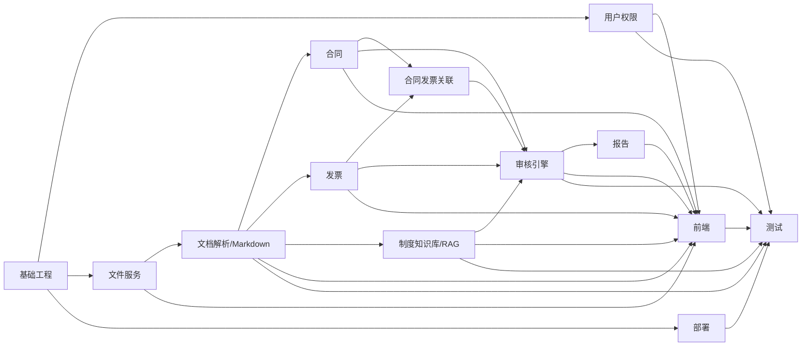

# FinAudit Agent 项目开发任务分解与实施计划 V1.0
## 文档信息
| 项目 | 内容 |
|---|---|
| 项目名称 | FinAudit Agent——企业财务文档智能审核与风险分析平台 |
| 文档名称 | 项目开发任务分解与实施计划 |
| 文档版本 | V1.0 |
| 编制日期 | 2026-08-05 |
| 需求基线 | 《FinAudit Agent 项目需求规格说明书 V1.3》 |
| 架构基线 | 《FinAudit Agent 系统架构设计说明书 V1.0》 |
| 数据库基线 | 《FinAudit Agent 数据库设计说明书 V1.0》 |
| API 基线 | 《FinAudit Agent API 接口设计说明书 V1.0》 |
| 页面基线 | 《FinAudit Agent 页面与交互设计说明书 V1.0》 |
| 任务范围 | P0 MVP 实施任务；明确标识少量 P1/待 CR 项 |
| 任务数量 | P0：86 个；P1/待 CR：3 个 |
| 估算总工作量 | P0 约 561 人日，未含需求变更、外部采购审批和生产数据清洗 |
| 文档状态 | 开发实施基线，负责人姓名与实际排期需在项目启动会后替换 |

## 修订记录

| 版本 | 日期 | 说明 | 状态 |
|---|---|---|---|
| V1.0 | 2026-08-05 | 根据需求、架构、数据库、API、页面五份已确认设计生成首版开发任务分解与实施计划 | 当前版本 |
| CR-001-R2 / CR-002-R4 | 2026-08-07 | 同步 57 表、122 API、可恢复 Job、强制换密、break-glass、上传意图、AI transport 与日志所有权；工作包总数保持 86 | 已批准合同 |
| CR-012-R3 | 2026-08-09 | 在 BASE-005 内增加 `20260807_006` 三张财务主数据空表的 migration/ORM 与专项 Gate；工作包总数保持 86 | 已批准 contract；不代表 BASE-005 完成，不授权业务运行时、真实数据、Provider、部署或 production |
| CR-004-R2 | 2026-08-09 | approved contract scope：在 BASE-005 增加 `20260807_007` reliability 三表空 DDL/ORM 切片及专项 Gate；BASE-006 runtime 继续等待生产 Handler artifact 与其他前置 | 已批准 contract；工作包仍为 86，不授权 runtime/网络/真实数据/部署/production |
| CR-011-R4 | 2026-08-09 | approved contract scope：授权 BASE-004 contract/offline Schema/companion/parser/resolver/Event DTO/Fake Sink Gate B 最小切片 | 已批准 contract；工作包仍为 86，AI-001 仍为 partial，持久化、Provider/网络、部署和 production 未授权 |
| CR-011-R5 | 2026-08-10 | approved contract-offline startup scope：授权十一文件同步后实施 BASE-004 本地 pre-socket loader/adoption Gate C | 已批准 contract；工作包数量不变，Gate C 不自动完成 BASE-004 或其他工作包/AC |
| CR-011-R6 | 2026-08-10 | approved startup evidence-boundary successor：十一文件同步后按分层证据合同继续 BASE-004 startup Gate C | 已批准 contract；BASE-004/P0/AC/Provider/DB/Redis/Broker/deploy/production 状态保持不升级 |
| CR-003-R3 | 2026-08-11 | approved privileged-auth current-baseline successor：十一文件 Gate B PASS 后才实施 008 两空表 Gate C | 已批准 contract；008 成功后仅到 15/57，`BASE-005` 与 `work_package.AUTH-005` 仍 partial，P0/AC/runtime/deploy/production 不升级 |

## CR-004-R2 实施计划投影

- BASE-005 新增且只新增 `20260807_007_create_reliability_core.py`，`down_revision=20260807_006`；同一 revision 创建空的 `async_jobs/async_job_steps/outbox_events`、完整 ORM、三表约束/索引/trigger 与四个固定函数。不得播种 Job、Step、Outbox、Registry、Policy 或业务行，也不得新增工作包、第四张表或额外 helper。
- `007` 专项 Gate 必须覆盖 ORM/catalog 等价、Job/Step/Outbox 状态与字段矩阵、版本/CAS、数据库时钟/Lease、删除/TRUNCATE、八次 dead-letter、双连接唯一/终态/锁约束，以及 `006 -> 007 -> 006 -> 007` 与 base/current-head PostgreSQL 16 往返；downgrade 固定 `lock_timeout='5s'`、`55P03`、`55000` 和无 `CASCADE`。
- `007` 通过后 BASE-005 仅从 10/57 推进到 13/57，仍为 partial。BASE-006 的生产 Registry/Schema/Input/Summary/Handler bundle、Loader、Repository/Service/Router、Dispatcher、Worker、reaper、Scheduler、Redis/Broker 和实际 Job 写入继续等待独立批准与 runtime Gate；不得以空表切片代替。
- 本轮只允许本地离线或专用可丢弃合成 PostgreSQL 16 数据；不运行 Provider/其他网络，不接触真实数据，不部署或执行 production migration，P0 与全部 AC 状态不变。

## CR-011-R4 批准后实施计划投影

- 11 文件同步完成后，只允许实施 `BASE-004 contract/offline` 最小切片：Policy Schema+companion、raw parser/JCS/hash、纯 resolver/retry/response/network-policy、Event DTO/JCS/hash，以及 Fake/in-memory Sink 六加六结果、故障窗口和 single-use permit 证据。
- 同步本身不完成 Gate B。同步完成时 `BASE-004` 继续为 partial；Gate B 通过后再按正式 DoD 逐项裁定为 implemented 或带缺项的 partial。`AI-001` 始终保持 partial。
- AI-005、BASE-005/006 持久 runtime、数据库/Outbox/Worker、Redis/Broker、真实 HTTP/Provider、业务 E2E、真实数据、部署、canary 和 production 均不在本轮授权范围。
- P0 工作包仍为 86，表仍为 57，API 仍为 122；本投影不新增任务、接口、表、页面或依赖后续 P1/P2。

## CR-011-R5 批准后实施计划投影

- Gate B 十一文件同步 PASS 后，才允许实施 BASE-004 本地离线 pre-socket loader/adoption Gate C；Gate C PASS 后必须按 BASE-004 专项标准与本计划 §11 全局 DoD 逐条复核。
- Gate C 只使用 synthetic Policy，且本轮禁止 commit/push/PR；缺少目标环境 Profile、完整分层配置、protected-branch merge、review + QA 或第三方可复现证据时，BASE-004 继续为 partial。
- `AI-001`、AI-005、BASE-005/006、TEST-001、P0、AC、部署和 production 状态不因 R5 Gate B/C 自动变化；工作包、表、API 和页面数量均无增量。

## CR-011-R6 批准后 startup evidence-boundary 实施计划投影

- BASE-004/P0/AC/Provider/DB/Redis/Broker/deploy/production 状态保持不升级。

## CR-003-R3 批准后特权授权 current-baseline 实施计划投影

本节精确绑定 R1 24270/cbe087aeb13f149fe6961f4daa71791ef8dd62b5d43bd1b1bb03b17c64cb8045、R2 35977/7a69b8555d422a7c2bee9d74da7030b8170692c934d83c12dd722c15c85c8363 与 R3 29321/35b1cdd758128afa485f91e34c5ef0dcfd95c4a648906e488099f68ff792e68c effective contract；R2 仍为 0/9 且未同步；与本文件中尚未同步的旧说明冲突时，以本节及 CR-003-R3 exact effective contract 为准。

- 十一文件 Gate B PASS 后才可实施 `20260807_008` 两空表 Gate C；成功后只把 PostgreSQL 空表切片推进到 `15/57`。
- `BASE-005` 与 `work_package.AUTH-005` 仍为 partial；API runtime、P0、AC、Provider、Redis、Broker、真实数据、部署与 production 状态不升级。

# 1. 编制原则与范围结论

本计划不从项目名称或功能想象直接拆任务，而按以下追踪链生成：

```text
需求条目与验收标准
→ 角色、业务流程和对象状态机
→ 应用模块、同步/异步边界与存储职责
→ API 接口、数据表和页面交互
→ 可独立开发、联调、测试和验收的工作包
```

实施范围结论：

1. P0 采用前后端分离、模块化单体 FastAPI、独立 Celery Worker、PostgreSQL、Redis、MinIO、Qdrant 和 Nginx；不在 P0 引入微服务、Neo4j 或 LangGraph Agent。
2. PostgreSQL 是业务事实唯一来源；MinIO 保存文件制品；Qdrant 和 Markdown/Chunk/Embedding 属于可重建派生数据；Redis 不保存最终业务事实。
3. OCR、解析、Markdown、分块、Embedding、索引、评测、审核执行和报告生成均作为异步任务；普通 API 只做短事务、权限、状态校验与 Job 创建。
4. P0 报告只实现 PDF 审核报告和 Excel 风险明细；Word、Markdown 和多模板报告列为 P1。
5. P0 实现结构化日志、Trace ID、健康检查和最小 `/metrics` 端点；Langfuse、Prometheus、Grafana 完整部署与自动告警列为 P1。
6. 当前 API 基线没有发票批量导出接口。该诉求列为 `INV-P1-001`，必须先通过需求、API、页面和验收变更，不能直接混入 P0。
7. 所有 P1、P2 项均不得成为 P0 验收前置条件。

# 2. 估算与负责人使用说明

## 2.1 负责人代号

| 代号 | 建议职责 |
|---|---|
| ARCH/PM | 架构决策、范围控制、依赖协调、里程碑和变更管理 |
| BE-A | 认证、文件、知识库、通用基础设施和运维接口后端 |
| BE-B | 合同、发票、审核、风险和报告后端 |
| AI | OCR/解析、Markdown、分块、Embedding、RAG、Prompt 与 AI 回归 |
| FE-A | 全局框架、文件、知识库和 AI 问答前端 |
| FE-B | 合同、发票、审核和报告前端 |
| QA | 测试设计、自动化、验收、回归和质量门禁 |
| OPS/DBA/SEC | 容器、网络、存储、备份、数据库、安全与生产部署 |

实际团队未提供姓名，因此每项任务的“负责人”使用岗位代号。项目启动后应替换为唯一责任人，协作人员可另列。

## 2.2 工作量口径

- 1 人日按 8 小时有效开发时间估算，包含编码、自测、代码评审修改和必要技术文档，不包含跨部门等待。
- 估算基于已有五份设计基线稳定、外部 OCR/LLM/Embedding 接口可用、测试数据可及时提供。
- P0 总量约 561 人日。按 8 个专业角色并行、70%～75% 有效投入，参考周期约 16～20 周；按 6 人团队，参考周期约 22～26 周。
- 若由单人制作求职作品集，应另立“演示版范围裁剪”变更，不能把完整 P0 误判为短周期个人项目。

# 3. 工作流总览与工作量

| 工作流 | P0 任务数 | 估算人日 | 主要输出 |
|---|---:|---:|---|
| 项目基础工程 | 6 | 29 | 仓库、前后端骨架、配置、迁移、Worker 基础 |
| 用户权限 | 5 | 26 | JWT、RBAC、用户管理、职责分离 |
| 文件服务 | 5 | 26 | 上传、MinIO、预览、归档、Job 状态 |
| 文档解析 | 8 | 52 | PDF/DOCX/图片、OCR、结构块、Markdown、来源映射 |
| 合同模块 | 5 | 29 | 合同、补充协议、附件、供应商 |
| 发票模块 | 4 | 22 | 发票候选、明细、确认、重复检测 |
| 合同发票关联 | 3 | 12 | 候选建议、主合同确认、取消与历史 |
| 知识库模块 | 12 | 81 | 制度、分块、索引、评测、RAG |
| 审核引擎 | 8 | 56 | 任务、快照、规则、风险、复核、状态机 |
| AI 模块 | 5 | 31 | 模型网关、结构化输出、Prompt、日志 |
| 报告模块 | 3 | 16 | PDF、Excel、报告版本 |
| 前端模块 | 9 | 83 | UI-001～UI-014 和全局交互 |
| 测试模块 | 7 | 69 | 单元、API、E2E、AI、安全、性能 |
| 部署监控 | 6 | 29 | Compose、Nginx、日志、健康、备份、最小指标 |
| **合计** | **86** | **561** | P0 完整交付 |

# 4. 依赖关系与实施顺序



## 4.1 建议里程碑

| 里程碑 | 参考周次 | 完成条件 |
|---|---|---|
| M0 基础可运行 | 第 1～2 周 | 仓库、Backend、Frontend、配置、迁移、Worker、Compose 基础可启动 |
| M1 身份与文件闭环 | 第 3～4 周 | 登录/RBAC、上传、MinIO、Job、列表、预览可联调 |
| M2 文档规范化闭环 | 第 5～7 周 | PDF/DOCX/OCR、结构块纠错、Markdown、来源映射和质量门禁完成 |
| M3 财务对象闭环 | 第 6～9 周 | 合同、补充协议、发票、供应商、关联和对应页面完成 |
| M4 制度 RAG 闭环 | 第 7～11 周 | 制度审批、Chunk、Embedding、索引、评测、问答完成 |
| M5 审核与报告闭环 | 第 10～14 周 | 快照、规则、风险、复核、PDF/Excel 和页面完成 |
| M6 质量与部署验收 | 第 15～20 周 | API/E2E/AI/安全/性能、备份恢复、部署与 AC-001～AC-016 通过 |

说明：周次按 8 个角色并行估算；6 人团队需根据资源冲突顺延。里程碑只在前置质量门禁通过后关闭。

# 5. 详细开发任务

## 5.1 项目基础工程

### BASE-001 建立 Git 仓库、分支与提交规范 

| 字段 | 内容 |
|---|---|
| 任务编号 | BASE-001 |
| 所属模块 | 项目基础工程 |
| 前置依赖 | 无 |
| 输入 | 五份设计基线、项目命名与版本规则 |
| 输出 | 初始化仓库、README、CHANGELOG、分支保护与提交模板 |
| 开发内容 | 建立 frontend、backend、infra、docs、scripts 顶层目录；定义 main/develop/feature/release/hotfix 流程；配置 Conventional Commits、代码评审清单和版本标签。 |
| 涉及接口 | 无 |
| 涉及数据表 | 无 |
| 验收标准 | 新成员可按 README 在本地完成初始化；目录与架构文档一致；禁止密钥提交；基线文档有固定引用路径。 |
| 优先级 | P0-阻断 |
| 负责人 | ARCH/PM |
| 预计工作量 | 2 人日 |
| 测试要求 | 仓库初始化检查；敏感文件扫描；分支保护演练 |

### BASE-002 搭建 FastAPI 模块化单体骨架 

| 字段 | 内容 |
|---|---|
| 任务编号 | BASE-002 |
| 所属模块 | 项目基础工程 |
| 前置依赖 | BASE-001 |
| 输入 | 系统架构目录结构、API 前缀与分层规则 |
| 输出 | 可启动 Backend、统一路由、异常处理、依赖注入和 OpenAPI |
| 开发内容 | 创建 api/core/models/schemas/repositories/services/parsers/markdown/chunking/retrieval/evaluation/ai/rules/audit/reports/workers/adapters/tests；实现 /api/v1 路由聚合、统一成功/错误响应、Trace ID 中间件。 |
| 涉及接口 | /health、/api/v1 基础路由 |
| 涉及数据表 | operation_logs（接口预留） |
| 验收标准 | Backend 可启动；OpenAPI 可访问；Router 不直接访问数据库或模型；所有错误响应含 trace_id。 |
| 优先级 | P0-阻断 |
| 负责人 | BE-A |
| 预计工作量 | 4 人日 |
| 测试要求 | 启动测试；异常映射单测；架构依赖静态检查 |

### BASE-003 搭建 Vue 3 前端骨架与全局布局 

| 字段 | 内容 |
|---|---|
| 任务编号 | BASE-003 |
| 所属模块 | 项目基础工程 |
| 前置依赖 | BASE-001 |
| 输入 | UI-001～UI-014、路由与权限展示规则 |
| 输出 | Vue 3 工程、路由、状态管理、请求层、全局布局和通用组件 |
| 开发内容 | 建立登录页、顶部栏、侧边栏、面包屑、错误组件、空状态、骨架屏、状态标签、Trace ID 复制组件；所有界面使用简体中文。 |
| 涉及接口 | AUTH-004（Mock）、全局 API 客户端 |
| 涉及数据表 | 无 |
| 验收标准 | 14 个路由占位可访问；未授权路由可拦截；请求层统一处理 Token、错误码、幂等键和 row_version。 |
| 优先级 | P0-阻断 |
| 负责人 | FE-A |
| 预计工作量 | 5 人日 |
| 测试要求 | 路由测试；组件单测；错误码与状态标签快照测试 |

### BASE-004 统一环境配置、密钥与配置校验 

| 字段 | 内容 |
|---|---|
| 任务编号 | BASE-004 |
| 所属模块 | 项目基础工程 |
| 前置依赖 | BASE-002 |
| 输入 | PostgreSQL、Redis、MinIO、Qdrant、OCR、LLM、Embedding 配置项 |
| 输出 | .env.example、Pydantic Settings、Profile/Policy v1 Schema、启动前配置校验和配置分层 |
| 开发内容 | 区分 local/test/prod；敏感配置仅从环境或 Secret 读取；实现 CR-002-R4 的逐调用 deadline/尝试/Token/费用、熔断/容量/字节边界和不可变 Policy hash，默认 `AI_PROVIDER_CALLS_ENABLED=false`。旧全局 timeout/retry/concurrency 字段不得静默换算；真实调用启用但 Profile/Policy/环境签署值不完整时 fail closed。 |
| 涉及接口 | 无 |
| 涉及数据表 | 无 |
| 验收标准 | 缺失关键配置时服务明确失败；日志不打印密钥；contract 阶段只允许离线 Mock；legacy 配置拒绝迁移、calls-disabled 默认和 Policy JCS/SHA-256 均有确定性测试。 |
| 优先级 | P0-阻断 |
| 负责人 | BE-A/OPS |
| 预计工作量 | 3 人日 |
| 测试要求 | 配置单测；密钥脱敏测试；错误配置启动测试 |

### BASE-005 建立数据库迁移、种子与回滚框架 

| 字段 | 内容 |
|---|---|
| 任务编号 | BASE-005 |
| 所属模块 | 项目基础工程 |
| 前置依赖 | BASE-002、BASE-004 |
| 输入 | 数据库设计 V1.0 的 57 张核心表、批准枚举、CR-001-R2 数据合同和已批准 `CR-012-R3/FIN-D-001～006` |
| 输出 | Alembic 基线迁移、固定五角色、规则种子机制、升级/回滚与前向修复脚本；`20260807_006` 三张财务主数据空表 migration、SQLAlchemy ORM 模型及导出 |
| 开发内容 | 按业务域分批创建迁移；启用 pgcrypto、btree_gist、citext；建立 UUID、UTC、软删除、乐观锁和不可变记录约定；创建 `async_job_steps/break_glass_requests`。`20260807_006` 在同一事务创建 `contracts/invoices/suppliers` 的精确列、CHECK、索引和全部 FK，循环 FK 在三表建成后添加，降级仅允许原子删除三张空表。不写真实规则行、默认组织、默认管理员、组织级分块配置或财务业务数据。 |
| 涉及接口 | 无 |
| 涉及数据表 | 全部 PostgreSQL 核心表 |
| 验收标准 | PostgreSQL 16 空库一次升级形成精确 57 表；回滚/前向恢复演练可重复；固定五角色幂等且无默认组织/账号/密码；规则表、组织分块配置表和三张财务主数据表无业务种子行；扫描/Job/break-glass/AI 约束可执行；迁移不丢失既有审计证据；`20260807_006` 另满足下列专项 Gate。 |
| 优先级 | P0-阻断 |
| 负责人 | BE-B/DBA |
| 预计工作量 | 8 人日 |
| 测试要求 | 迁移升级/回滚测试；约束测试；种子幂等测试；`20260807_006` PostgreSQL 16 catalog、并发唯一、故障注入与锁超时测试 |

#### CR-012-R3 `20260807_006` 专项 Gate

1. ORM、migration 与 PostgreSQL catalog 精确一致：三表列序、类型、nullable/default、M1、业务枚举 CHECK、合同金额/日期 CHECK、规范字符串 CHECK、来源矩阵、全部索引和外键均逐项核对；四个循环外键必须在建表后添加并保持默认 `NO ACTION`。
2. 合同编号覆盖 `NULL`、空字符串拒绝、首尾 ASCII space、Unicode control、大小写/Unicode exactness、并发重复、`archived` 仍冲突和软删除后复用；供应商覆盖无身份 candidate、active 缺身份、双列 C-collation 同值/异值、generic Unicode 税号、USCC ASCII uppercase、candidate/inactive/软删除不占用 active 身份、重新激活冲突和同名不同身份。
3. 来源矩阵覆盖三种 `source_type` × 无来源/仅合同/仅发票/双来源共 12 种组合；发票重复号必须可保存，`idx_invoices_duplicate_lookup` 可命中且不得误建唯一约束。
4. Upgrade 首先执行 `SHOW server_encoding;` 并精确断言 `UTF8`；专用数据库分别验证 UTF8 通过和非 UTF8 fail closed。创建三表和添加四个循环 FK 的各阶段故障注入必须完整回滚到 `20260807_005`。
5. 空表 `head → previous → head` 可重复；任一表非空时 downgrade 以 SQLSTATE `55000` 原子失败并保留 revision。分别持有 `contracts/invoices/suppliers` 冲突锁超过 5 秒时，固定字典锁序的 downgrade 必须因 `lock_timeout` 原子失败，不得无限等待或部分删表。
6. Ruff、格式、mypy、全量 pytest、Alembic 单一 head 和安全 PostgreSQL 16 往返通过；未配置安全 `TEST_DATABASE_URL` 时 PostgreSQL 运行证据记为 `NOT_RUN`，不得用离线 SQL 或 SQLite 冒充。
7. 本切片不实现或验证 `SUPP-003`、CON-005、供应商确认/复用、API 冲突映射或 AI generic tax 投影；不导入真实数据，不调用 Provider，不部署或执行 production migration。

完成 `20260807_006` 只推进 BASE-005 的三表切片，不得把 BASE-005、P0 或任何 AC 标记为完成；BASE-005 仍须以 57 张核心表、全部迁移/种子和完整 Gate 的实际证据判定。

### BASE-006 建立异步任务与 Transactional Outbox 基础框架 

| 字段 | 内容 |
|---|---|
| 任务编号 | BASE-006 |
| 所属模块 | 项目基础工程 |
| 前置依赖 | BASE-002、BASE-005 |
| 输入 | Celery 5 + Redis、版本化 Job 输入/Lease/心跳/追加步骤状态模型、Outbox 事件版本与顺序设计 |
| 输出 | Worker 启动、队列路由、Job 生命周期、Outbox 发布器和幂等执行框架 |
| 开发内容 | 建立 document/extraction/knowledge/evaluation/audit/report/maintenance 队列；消息只带 `job_id + event_schema_version`，Worker 从 PostgreSQL 恢复权威输入；实现 Lease/心跳、同 Job 尝试递增、追加步骤、trace、超时、取消、死信，以及 event version/sequence、同 ID 幂等、乱序等待、冲突/未知版本隔离。 |
| 涉及接口 | OPS-001 |
| 涉及数据表 | async_jobs、async_job_steps、outbox_events、idempotency_records |
| 验收标准 | 任务创建与业务事务原子提交；Worker/Redis 崩溃后仅依赖 PostgreSQL 可恢复或安全失败；重复消息不产生重复业务结果；同一技术重试不创建第二个 Job；Job 只展示真实 stage 和追加步骤。 |
| 优先级 | P0-阻断 |
| 负责人 | BE-B |
| 预计工作量 | 7 人日 |
| 测试要求 | 任务重试单测；消息重复集成测试；Worker 崩溃恢复测试 |

## 5.2 用户权限

### AUTH-001 实现组织、用户、固定角色与会话数据层 

| 字段 | 内容 |
|---|---|
| 任务编号 | AUTH-001 |
| 所属模块 | 用户权限 |
| 前置依赖 | BASE-005 |
| 输入 | 固定五角色、单组织和职责分离规则 |
| 输出 | 用户/角色 Repository、密码哈希、会话模型、五角色种子和一次性离线 bootstrap CLI |
| 开发内容 | 实现 organizations、users、roles、user_roles、token_sessions 与 force_change_on_login；用户名/邮箱不区分大小写；Refresh Token 仅保存哈希。bootstrap 使用 advisory lock 和单事务创建首组织、首管理员、首个 system_admin 分配与审计，凭据只从 TTY/stdin/受限 FD/Secret Manager 注入。 |
| 涉及接口 | AUTH-001～AUTH-009；bootstrap 无匿名 HTTP |
| 涉及数据表 | organizations、users、roles、user_roles、token_sessions、operation_logs |
| 验收标准 | 组织单例约束有效；固定角色不可被普通接口删除；密码与 Refresh Token 均不明文落库；bootstrap 并发最多一次成功，相同参数重跑 no-op，不同参数冲突。 |
| 优先级 | P0-阻断 |
| 负责人 | BE-A |
| 预计工作量 | 4 人日 |
| 测试要求 | Repository 单测；唯一约束测试；密码哈希测试 |

### AUTH-002 实现登录、刷新、退出与会话撤销 

| 字段 | 内容 |
|---|---|
| 任务编号 | AUTH-002 |
| 所属模块 | 用户权限 |
| 前置依赖 | AUTH-001、BASE-004 |
| 输入 | 认证接口定义、Token 生命周期和错误码 |
| 输出 | JWT Access Token、Refresh Token 旋转、锁定、退出和强制换密机制 |
| 开发内容 | 实现登录失败计数、账号锁定、token_invalid_before、刷新重放检测和退出幂等；force_change_on_login 命中时只签发 5 分钟一次性 password:change Token，AUTH-010 换密后撤销旧会话并要求重新登录；所有事件写操作日志。 |
| 涉及接口 | AUTH-001～AUTH-004、AUTH-010 |
| 涉及数据表 | users、user_roles、roles、token_sessions、operation_logs |
| 验收标准 | 旧 Refresh Token 旋转后不可复用；禁用用户立即失效；错误凭据不泄露账号存在性；退出重复调用返回 204；临时密码用户在换密前不能获得业务 Token。 |
| 优先级 | P0-阻断 |
| 负责人 | BE-A |
| 预计工作量 | 6 人日 |
| 测试要求 | 认证单测；Token 重放测试；锁定策略安全测试 |

### AUTH-003 实现 RBAC、数据范围与后端强制鉴权 

| 字段 | 内容 |
|---|---|
| 任务编号 | AUTH-003 |
| 所属模块 | 用户权限 |
| 前置依赖 | AUTH-001、AUTH-002 |
| 输入 | 权限矩阵、页面—接口追踪矩阵 |
| 输出 | FastAPI 权限依赖、资源级授权和拒绝审计 |
| 开发内容 | 按角色、资源归属、对象状态和职责分离执行鉴权；前端隐藏按钮不作为授权依据；无权访问时避免泄露资源存在性。 |
| 涉及接口 | 除匿名接口外全部接口 |
| 涉及数据表 | users、user_roles、roles、operation_logs |
| 验收标准 | 五角色矩阵逐项通过；system_admin 默认不能修改财务事实；read_only 无下载；拒绝访问有 trace_id 和审计记录。 |
| 优先级 | P0-阻断 |
| 负责人 | BE-A/SEC |
| 预计工作量 | 7 人日 |
| 测试要求 | 权限矩阵参数化测试；越权 IDOR 测试；负向 API 测试 |

### AUTH-004 实现用户创建、启停、角色替换和密码重置 

| 字段 | 内容 |
|---|---|
| 任务编号 | AUTH-004 |
| 所属模块 | 用户权限 |
| 前置依赖 | AUTH-002、AUTH-003 |
| 输入 | 用户管理接口和 UI-014 交互 |
| 输出 | 用户管理 Application Service、乐观锁和会话失效 |
| 开发内容 | 创建用户、列表查询、状态/普通角色更新、角色整体替换、管理员密码重置；重置固定 force_change_on_login=TRUE，不接受关闭开关；角色变更或禁用后撤销会话。 |
| 涉及接口 | AUTH-005～AUTH-009 |
| 涉及数据表 | users、user_roles、roles、token_sessions、operation_logs |
| 验收标准 | 重复用户名返回明确冲突；角色替换原子执行；禁用与重置后旧会话失效；所有敏感动作有原因和操作者。 |
| 优先级 | P0-高 |
| 负责人 | BE-A |
| 预计工作量 | 5 人日 |
| 测试要求 | API 单元/集成测试；并发版本冲突测试；审计日志测试 |

### AUTH-005 实现职责分离与 break-glass 约束 

| 字段 | 内容 |
|---|---|
| 任务编号 | AUTH-005 |
| 所属模块 | 用户权限 |
| 前置依赖 | AUTH-003、AUTH-004 |
| 输入 | system_admin 与 finance_reviewer/audit_reviewer 禁止长期组合、提交人与批准人分离 |
| 输出 | `break_glass_requests` Repository、双人批准事务、数据库触发器、服务校验和临时授权审计 |
| 开发内容 | 生产环境禁止同账号长期同时拥有 system_admin 与 finance_reviewer 或 audit_reviewer；实现请求/查询/批准/拒绝/撤销，批准与临时 user_roles 在同一事务；单角色 allowlist、独立批准人和 1..14400 秒有效期 fail closed；制度和评测审批校验同人冲突。 |
| 涉及接口 | AUTH-011～AUTH-015；POL/EVAL 审批动作 |
| 涉及数据表 | break_glass_requests、user_roles、users、roles、policy_approval_records、retrieval_eval_datasets、operation_logs |
| 验收标准 | 自批、批准人与目标相同、单管理员、跨组织、未知/多角色、read_only、已有同角色、预约、超过4小时、延期、过期和撤销授权均不能生效；同人提交/批准无法完成。 |
| 优先级 | P0-高 |
| 负责人 | BE-A/DBA |
| 预计工作量 | 4 人日 |
| 测试要求 | 触发器测试；越权审批测试；到期授权测试 |

## 5.3 文件服务

### FILE-001 实现文件上传校验、哈希与去重 

| 字段 | 内容 |
|---|---|
| 任务编号 | FILE-001 |
| 所属模块 | 文件服务 |
| 前置依赖 | BASE-004、BASE-005、BASE-006、AUTH-003 |
| 输入 | PDF/DOCX/JPG/JPEG/PNG、50MB、批量 20 个、MIME/文件头规则 |
| 输出 | 单文件与批量上传服务、SHA-256、重复返回和拒绝记录 |
| 开发内容 | 校验扩展名、MIME、文件头、大小和上传意图；持久化 intended_business_type/target_knowledge_base_id/auto_process_requested 并冻结到 Job input_json；重复内容只在分类一致时复用，处理意图只允许 FALSE→TRUE；拒绝文件记录脱敏原因。 |
| 涉及接口 | FILE-001、FILE-002 |
| 涉及数据表 | files、idempotency_records、operation_logs |
| 验收标准 | 非法格式、超限、MIME 欺骗被拒绝；重复上传不创建第二条文件事实；批量文件逐项返回结果。 |
| 优先级 | P0-阻断 |
| 负责人 | BE-A |
| 预计工作量 | 6 人日 |
| 测试要求 | 边界文件测试；恶意 MIME 测试；大文件与批量测试；幂等测试 |

### FILE-002 实现 MinIO 隔离存储与安全扫描链路 

| 字段 | 内容 |
|---|---|
| 任务编号 | FILE-002 |
| 所属模块 | 文件服务 |
| 前置依赖 | FILE-001、BASE-006 |
| 输入 | quarantine/originals/assets/previews/reports/exports/temp Bucket 规划 |
| 输出 | MinIO Adapter、Bucket 初始化、quarantine 到 originals 迁移和扫描状态 |
| 开发内容 | 上传先进入 quarantine；安全扫描完成后迁移；对象键不可预测且在 PostgreSQL 留存哈希、大小和关联；扫描失败可重试。 |
| 涉及接口 | FILE-001、FILE-002、FILE-007 |
| 涉及数据表 | files、async_jobs、outbox_events |
| 验收标准 | 感染文件不进入 originals；对象元数据与数据库一致；扫描失败不丢文件且可恢复；对象路径不暴露给客户端。 |
| 优先级 | P0-阻断 |
| 负责人 | BE-A/OPS |
| 预计工作量 | 6 人日 |
| 测试要求 | MinIO 集成测试；扫描模拟测试；断点/失败补偿测试 |

### FILE-003 实现文件列表、详情和聚合处理状态 

| 字段 | 内容 |
|---|---|
| 任务编号 | FILE-003 |
| 所属模块 | 文件服务 |
| 前置依赖 | FILE-001、FILE-002、BASE-006 |
| 输入 | 文件、解析、Markdown、Job 独立状态模型 |
| 输出 | 文件查询接口、分页排序过滤、聚合状态 DTO |
| 开发内容 | 实现按关键字、业务类型、文件/解析/Markdown 状态查询；详情返回活动版本、最新 Job、主业务对象和可执行动作。 |
| 涉及接口 | FILE-003、FILE-004、OPS-001 |
| 涉及数据表 | files、file_primary_business_objects、document_parse_versions、document_markdown_versions、async_jobs |
| 验收标准 | 状态不被合并；分页总数正确；无权限对象不泄露；Job stage 与数据库一致。 |
| 优先级 | P0-高 |
| 负责人 | BE-A |
| 预计工作量 | 5 人日 |
| 测试要求 | 查询过滤测试；分页排序测试；资源权限测试 |

### FILE-004 实现预览、原文件下载和签名 URL 

| 字段 | 内容 |
|---|---|
| 任务编号 | FILE-004 |
| 所属模块 | 文件服务 |
| 前置依赖 | FILE-002、AUTH-003 |
| 输入 | UI-003 原文件预览、短时签名 URL、下载权限 |
| 输出 | 预览/下载接口、预览制品生成和 URL 续签 |
| 开发内容 | 对 PDF/图片生成可预览资源；DOCX 生成受控预览；签名 URL 短时有效；read_only 仅预览无下载。 |
| 涉及接口 | FILE-005、FILE-008 |
| 涉及数据表 | files、document_pages、document_assets、operation_logs |
| 验收标准 | 过期 URL 可重新获取；对象键不返回；下载权限符合角色矩阵；预览失败不影响原文件保存。 |
| 优先级 | P0-高 |
| 负责人 | BE-A/FE-A |
| 预计工作量 | 5 人日 |
| 测试要求 | 签名过期测试；下载越权测试；多格式预览集成测试 |

### FILE-005 实现文件归档、处理重试与引用校验 

| 字段 | 内容 |
|---|---|
| 任务编号 | FILE-005 |
| 所属模块 | 文件服务 |
| 前置依赖 | FILE-003、BASE-006 |
| 输入 | 归档规则、可恢复失败、被业务对象或快照引用限制 |
| 输出 | 归档动作、重试 Job、引用影响提示和审计记录 |
| 开发内容 | 归档前检查合同/发票/制度/任务引用；可恢复失败沿用同一 job_id、递增 attempt_no 并追加 async_job_steps；不重复创建业务对象；禁止前台物理删除。 |
| 涉及接口 | FILE-006、FILE-007、OPS-001 |
| 涉及数据表 | files、async_jobs、file_primary_business_objects、audit_task_snapshots、operation_logs |
| 验收标准 | 已引用文件按规则只能归档；重复重试不会并行创建冲突 Job；归档与重试均有原因、操作者和 trace_id。 |
| 优先级 | P0-高 |
| 负责人 | BE-A |
| 预计工作量 | 4 人日 |
| 测试要求 | 归档约束测试；活动 Job 冲突测试；重试幂等测试 |

## 5.4 文档解析

### DOC-001 实现解析版本、页面、结构块与资源数据层 

| 字段 | 内容 |
|---|---|
| 任务编号 | DOC-001 |
| 所属模块 | 文档解析 |
| 前置依赖 | BASE-005、FILE-002 |
| 输入 | 不可变解析版本、活动版本唯一、证据坐标模型 |
| 输出 | 文档 Repository、版本号生成、活动切换与不可变约束 |
| 开发内容 | 实现 document_parse_versions、document_pages、document_blocks、document_assets、document_content_exclusions；建立版本唯一、活动唯一和来源一致性校验。 |
| 涉及接口 | PARSE-001～PARSE-003 |
| 涉及数据表 | document_parse_versions、document_pages、document_blocks、document_assets、document_content_exclusions |
| 验收标准 | 同一文件仅一个 active 解析版本；历史正文不可覆盖；结构块可按页码/顺序稳定查询。 |
| 优先级 | P0-阻断 |
| 负责人 | BE-B/AI |
| 预计工作量 | 6 人日 |
| 测试要求 | 数据库约束测试；Repository 单测；版本并发测试 |

### DOC-002 实现 PDF 解析适配器 

| 字段 | 内容 |
|---|---|
| 任务编号 | DOC-002 |
| 所属模块 | 文档解析 |
| 前置依赖 | DOC-001、BASE-006 |
| 输入 | PDF 文件、解析器版本和结构块 Schema |
| 输出 | PDF 页面、文本块、表格、图片资源与置信度 |
| 开发内容 | 解析文本型和扫描型 PDF；恢复页码、阅读顺序、块类型和坐标；无法解析时输出标准失败码或进入 OCR。 |
| 涉及接口 | 由 FILE-001 触发；PARSE-001～PARSE-003 查询 |
| 涉及数据表 | document_parse_versions、document_pages、document_blocks、document_assets、async_jobs |
| 验收标准 | 标准样本页数与文本顺序正确；扫描 PDF 自动转 OCR；失败不产生伪成功版本。 |
| 优先级 | P0-阻断 |
| 负责人 | AI |
| 预计工作量 | 7 人日 |
| 测试要求 | 文本 PDF、扫描 PDF、加密/损坏 PDF 样本测试；回归快照 |

### DOC-003 实现 DOCX 解析适配器 

| 字段 | 内容 |
|---|---|
| 任务编号 | DOC-003 |
| 所属模块 | 文档解析 |
| 前置依赖 | DOC-001、BASE-006 |
| 输入 | DOCX 文件、标题/段落/列表/表格结构 |
| 输出 | DOCX 结构块、图片资源和页序近似信息 |
| 开发内容 | 提取标题层级、段落、列表、表格和内嵌图片；无法获得精确页码/坐标时记录原因，不伪造坐标。 |
| 涉及接口 | 由 FILE-001 触发；PARSE-001～PARSE-003 查询 |
| 涉及数据表 | document_parse_versions、document_pages、document_blocks、document_assets |
| 验收标准 | 标题与表格结构保留；资源引用完整；坐标不可得原因可追踪。 |
| 优先级 | P0-高 |
| 负责人 | AI |
| 预计工作量 | 5 人日 |
| 测试要求 | 多层标题、合并单元格、图片 DOCX 测试；结构回归 |

### DOC-004 实现图片解析与 OCR Adapter 

| 字段 | 内容 |
|---|---|
| 任务编号 | DOC-004 |
| 所属模块 | 文档解析 |
| 前置依赖 | DOC-001、BASE-004、BASE-006 |
| 输入 | JPG/JPEG/PNG、OCR 服务配置、超时与重试策略 |
| 输出 | OCR 文本块、坐标、置信度和引擎版本 |
| 开发内容 | 隔离 OCR 厂商/本地引擎；支持超时、限流、重试和降级；低置信结果进入 manual_review_required。 |
| 涉及接口 | 由 FILE-001 触发；PARSE-001～PARSE-003 查询 |
| 涉及数据表 | document_parse_versions、document_pages、document_blocks、async_jobs；不直接写 `ai_call_logs` |
| 验收标准 | OCR 引擎可替换不影响领域层；低置信不自动激活；完整记录引擎与版本。 |
| 优先级 | P0-阻断 |
| 负责人 | AI |
| 预计工作量 | 7 人日 |
| 测试要求 | 清晰/模糊/旋转图片测试；OCR 超时重试测试；低置信门禁测试 |

### DOC-005 实现结构块人工纠错与新解析版本 

| 字段 | 内容 |
|---|---|
| 任务编号 | DOC-005 |
| 所属模块 | 文档解析 |
| 前置依赖 | DOC-001、DOC-002、DOC-003、DOC-004 |
| 输入 | UI-003 纠错动作、前值/后值/原因和证据 |
| 输出 | 纠错 API、新不可变解析版本、纠错记录与重处理事件 |
| 开发内容 | 允许修改文本、块类型、阅读顺序和允许坐标；禁止修改原文件；基于源版本生成新版本并触发字段提取和 Markdown。 |
| 涉及接口 | PARSE-004 |
| 涉及数据表 | document_block_corrections、document_parse_versions、document_blocks、user_corrections、outbox_events |
| 验收标准 | 每次纠错创建新版本；旧版本不变；原因必填；来源和结果版本可追踪；重复请求幂等。 |
| 优先级 | P0-高 |
| 负责人 | BE-B/AI |
| 预计工作量 | 6 人日 |
| 测试要求 | 版本对比测试；并发纠错测试；审计完整性测试 |

### DOC-006 实现解析版本质量门禁与激活 

| 字段 | 内容 |
|---|---|
| 任务编号 | DOC-006 |
| 所属模块 | 文档解析 |
| 前置依赖 | DOC-005 |
| 输入 | 解析状态机、平均置信度和阻断问题 |
| 输出 | 激活动作、旧活动版本 superseded、下游重建事件 |
| 开发内容 | 校验版本状态、页面/块完整性和质量门禁；原子切换 active；旧版本保留；触发下游字段提取与 Markdown 重建。 |
| 涉及接口 | PARSE-005 |
| 涉及数据表 | document_parse_versions、outbox_events、operation_logs |
| 验收标准 | 同一文件不会出现两个活动版本；不合格版本不能激活；切换失败自动回滚。 |
| 优先级 | P0-高 |
| 负责人 | BE-B |
| 预计工作量 | 4 人日 |
| 测试要求 | 状态机测试；并发激活测试；事务回滚测试 |

### DOC-007 实现 Markdown 转换器与版本化 

| 字段 | 内容 |
|---|---|
| 任务编号 | DOC-007 |
| 所属模块 | 文档解析 |
| 前置依赖 | DOC-001、BASE-006 |
| 输入 | 活动解析版本、CommonMark/GFM 规范和资源占位符 |
| 输出 | 版本化 Markdown、AST、内容哈希和转换元数据 |
| 开发内容 | 保留标题、列表、表格；复杂资源使用 asset://；页眉页脚水印按排除记录处理；转换器不得概括或改写事实。 |
| 涉及接口 | MD-001～MD-003 |
| 涉及数据表 | document_markdown_versions、document_assets、document_content_exclusions、async_jobs |
| 验收标准 | 相同输入与版本配置生成相同内容哈希；正文 UTF-8；复杂资源可回溯；转换失败不覆盖旧活动版本。 |
| 优先级 | P0-阻断 |
| 负责人 | AI/BE-B |
| 预计工作量 | 8 人日 |
| 测试要求 | 黄金样本文本对比；表格/资源测试；确定性哈希测试 |

### DOC-008 实现 Markdown 来源映射、校验和激活 

| 字段 | 内容 |
|---|---|
| 任务编号 | DOC-008 |
| 所属模块 | 文档解析 |
| 前置依赖 | DOC-007、DOC-006 |
| 输入 | AST 节点、字符偏移、页码、结构块和坐标 |
| 输出 | 来源映射、质量问题、覆盖率、激活/下载接口 |
| 开发内容 | 构建 AST 节点到原文的映射；实现结构、覆盖率、安全 HTML 和阻断校验；ready 后方可激活；提供分页映射和 Markdown 下载。 |
| 涉及接口 | MD-004～MD-008 |
| 涉及数据表 | markdown_source_mappings、markdown_validation_results、document_markdown_versions、operation_logs |
| 验收标准 | 可作为证据的正文均有来源映射；阻断问题禁止激活；点击映射可定位原文；同一文件仅一个 active Markdown。 |
| 优先级 | P0-阻断 |
| 负责人 | AI/BE-B |
| 预计工作量 | 9 人日 |
| 测试要求 | 覆盖率计算测试；恶意 HTML/Prompt Injection 内容测试；激活并发测试 |

## 5.5 合同模块

### CON-001 实现合同候选创建与字段证据模型 

| 字段 | 内容 |
|---|---|
| 任务编号 | CON-001 |
| 所属模块 | 合同模块 |
| 前置依赖 | DOC-001、AI-003、FILE-003 |
| 输入 | 解析块、AI 结构化候选、来源证据 |
| 输出 | 合同候选、合同字段、主文件绑定和供应商候选 |
| 开发内容 | 从文件创建合同对象；保存核心字段候选、置信度、页码、原文、块 ID 和坐标；同一文件最多一个主业务对象。 |
| 涉及接口 | CON-002 |
| 涉及数据表 | contracts、contract_fields、file_primary_business_objects、suppliers、user_corrections |
| 验收标准 | 重复创建返回冲突或已有对象；每个核心候选含证据；AI 值不直接标记为 confirmed。 |
| 优先级 | P0-阻断 |
| 负责人 | BE-B/AI |
| 预计工作量 | 6 人日 |
| 测试要求 | 候选创建集成测试；证据完整性测试；单文件单主对象约束测试 |

### CON-002 实现合同列表、详情、编辑与字段确认 

| 字段 | 内容 |
|---|---|
| 任务编号 | CON-002 |
| 所属模块 | 合同模块 |
| 前置依赖 | CON-001、AUTH-003 |
| 输入 | 合同字段字典、状态机、乐观锁和 UI-004/UI-005 |
| 输出 | 合同查询、详情 DTO、草稿修改和批量确认 |
| 开发内容 | 实现合同列表过滤、详情、字段差异、关键事实修改原因、row_version、批量确认与状态更新。 |
| 涉及接口 | CON-001、CON-003～CON-005 |
| 涉及数据表 | contracts、contract_fields、suppliers、user_corrections、operation_logs |
| 验收标准 | 列表分页正确；audit_reviewer 只读；并发修改返回 RESOURCE_VERSION_CONFLICT；关键事实修改可追踪。 |
| 优先级 | P0-高 |
| 负责人 | BE-B |
| 预计工作量 | 7 人日 |
| 测试要求 | API 契约测试；权限测试；乐观锁测试；金额/日期边界测试 |

### CON-003 实现补充协议及生效变更 

| 字段 | 内容 |
|---|---|
| 任务编号 | CON-003 |
| 所属模块 | 合同模块 |
| 前置依赖 | CON-001、DOC-001 |
| 输入 | 主合同、协议字段、变更项和基准日期 |
| 输出 | 补充协议候选、变更项维护、确认/拒绝和有效字段计算 |
| 开发内容 | 补充协议必须关联主合同；保存原值、新值、证据、生效日期；按基准日期计算当前有效字段但不覆盖原合同。 |
| 涉及接口 | SAGR-001～SAGR-004 |
| 涉及数据表 | supplementary_agreements、supplementary_agreement_changes、contracts、user_corrections |
| 验收标准 | 未确认变更不进入审核快照；同字段多次变更按生效时间确定；关键变更使历史执行过期。 |
| 优先级 | P0-高 |
| 负责人 | BE-B |
| 预计工作量 | 8 人日 |
| 测试要求 | 生效日期组合测试；确认/拒绝状态机测试；历史字段回放测试 |

### CON-004 实现合同普通附件关系 

| 字段 | 内容 |
|---|---|
| 任务编号 | CON-004 |
| 所属模块 | 合同模块 |
| 前置依赖 | CON-002、FILE-003 |
| 输入 | 合同、文件和附件角色 |
| 输出 | 附件关联、取消关系和审计 |
| 开发内容 | 普通附件仅保存 attachment/evidence/other；补充协议不能被普通附件替代；取消关系保留历史和原因。 |
| 涉及接口 | CON-006、CON-007 |
| 涉及数据表 | contract_documents、contracts、files、operation_logs |
| 验收标准 | 活动关系唯一；取消后历史可见；被快照引用的证据按规则不可物理删除。 |
| 优先级 | P0-中 |
| 负责人 | BE-B |
| 预计工作量 | 3 人日 |
| 测试要求 | 关系唯一测试；取消审计测试；权限测试 |

### CON-005 实现供应商候选确认与修正 

| 字段 | 内容 |
|---|---|
| 任务编号 | CON-005 |
| 所属模块 | 合同模块 |
| 前置依赖 | CON-001、INV-001；GAP-064 对应运行时合同已获批准并原子同步九份 Request |
| 输入 | 合同乙方、发票销售方、税号精确匹配 |
| 输出 | 供应商列表、详情、候选确认/修改和回填关系 |
| 开发内容 | 只有 GAP-064 对应运行时合同获批并同步后，P0 才可实现标准名称、税号、来源、状态、候选确认/修正及关系回填；禁止自动复杂合并；合同与发票可引用确认后的供应商。该前置满足前，本任务的 Service/Repository/Router、`SUPP-003`、复用/回填及验收全部为 `NOT_RUN`。 |
| 涉及接口 | SUPP-001～SUPP-003 |
| 涉及数据表 | suppliers、contracts、invoices、user_corrections |
| 验收标准 | 税号精确匹配可复用供应商；冲突候选需人工处理；修改有 row_version 和审计。 |
| 优先级 | P0-高 |
| 负责人 | BE-B |
| 预计工作量 | 5 人日 |
| 测试要求 | 税号匹配测试；重复候选测试；并发修改测试 |

## 5.6 发票模块

### INV-001 实现发票 OCR/AI 候选创建与明细解析 

| 字段 | 内容 |
|---|---|
| 任务编号 | INV-001 |
| 所属模块 | 发票模块 |
| 前置依赖 | DOC-001、AI-003、FILE-003 |
| 输入 | 解析块、OCR/AI 结构化结果和字段证据 |
| 输出 | 发票候选、明细项、供应商候选和文件绑定 |
| 开发内容 | 提取发票代码、号码、日期、买卖方、税号、金额、税额、价税合计、币种与基础明细；保存证据和置信度。 |
| 涉及接口 | INV-002 |
| 涉及数据表 | invoices、invoice_items、suppliers、file_primary_business_objects、user_corrections |
| 验收标准 | 金额字段使用 Decimal；总额关系校验可解释；同一文件不重复创建发票；候选不自动确认。 |
| 优先级 | P0-阻断 |
| 负责人 | BE-B/AI |
| 预计工作量 | 7 人日 |
| 测试要求 | 标准/电子/图片发票样本测试；金额精度测试；证据映射测试 |

### INV-002 实现发票列表、详情与明细编辑 

| 字段 | 内容 |
|---|---|
| 任务编号 | INV-002 |
| 所属模块 | 发票模块 |
| 前置依赖 | INV-001、AUTH-003 |
| 输入 | UI-006/UI-007、乐观锁和字段字典 |
| 输出 | 发票查询、详情 DTO、字段与明细更新 |
| 开发内容 | 支持关键字、状态、重复状态查询；明细增删改；关键事实修改原因；合同管理员和审计只读。 |
| 涉及接口 | INV-001、INV-003、INV-004 |
| 涉及数据表 | invoices、invoice_items、suppliers、user_corrections、operation_logs |
| 验收标准 | 价税金额不使用浮点；明细合计与票面值差异有提示；越权修改被拒绝；并发冲突不覆盖。 |
| 优先级 | P0-高 |
| 负责人 | BE-B |
| 预计工作量 | 7 人日 |
| 测试要求 | 金额/税率边界测试；明细事务测试；权限与并发测试 |

### INV-003 实现发票确认状态机 

| 字段 | 内容 |
|---|---|
| 任务编号 | INV-003 |
| 所属模块 | 发票模块 |
| 前置依赖 | INV-002 |
| 输入 | 核心字段完整性、重复状态和确认规则 |
| 输出 | 确认动作、确认人/时间和审计记录 |
| 开发内容 | 确认前校验买卖方、日期、金额、税额等核心字段；疑似重复时要求明确处理，不自动删除重复票。 |
| 涉及接口 | INV-005 |
| 涉及数据表 | invoices、invoice_items、operation_logs |
| 验收标准 | 不完整票不能确认；疑似重复保留记录；确认后仍需受控修改并使相关执行过期。 |
| 优先级 | P0-高 |
| 负责人 | BE-B |
| 预计工作量 | 3 人日 |
| 测试要求 | 确认前置条件测试；重复票流程测试；状态机测试 |

### INV-004 实现发票重复检测 

| 字段 | 内容 |
|---|---|
| 任务编号 | INV-004 |
| 所属模块 | 发票模块 |
| 前置依赖 | INV-001、INV-002 |
| 输入 | 发票代码/号码、销售方税号、日期、金额和哈希 |
| 输出 | 重复候选、重复状态和可解释匹配详情 |
| 开发内容 | 使用数据库索引检索候选；输出命中字段与差异；支持 unique/suspected/confirmed_duplicate/exception_approved。 |
| 涉及接口 | INV-006 |
| 涉及数据表 | invoices、files、operation_logs |
| 验收标准 | 数据库不以发票号硬去重；候选结果可解释；重复检测可重复执行且结果一致。 |
| 优先级 | P0-高 |
| 负责人 | BE-B |
| 预计工作量 | 5 人日 |
| 测试要求 | 精确/近似重复样本测试；性能测试；幂等测试 |

### INV-P1-001 发票批量导出（需需求变更） （P1）

| 字段 | 内容 |
|---|---|
| 任务编号 | INV-P1-001 |
| 所属模块 | 发票模块 |
| 前置依赖 | INV-002 |
| 输入 | 用户提出的批量导出诉求；当前 V1.3/API V1.0 无对应接口 |
| 输出 | 待 CR 批准后的 CSV/XLSX 导出接口、异步 Job 和权限规则 |
| 开发内容 | 先完成字段、范围、脱敏、权限、最大导出量和接口设计变更；不得复用报告导出接口伪实现。 |
| 涉及接口 | 待新增，例如 /api/v1/invoices/export |
| 涉及数据表 | 可能复用 invoices、invoice_items、async_jobs；是否新增 export 记录待设计 |
| 验收标准 | 只有 CR、API、页面和验收同步更新后才进入开发；P0 验收不依赖本任务。 |
| 优先级 | P1-待CR |
| 负责人 | PM/BE-B |
| 预计工作量 | 4～6 人日 |
| 测试要求 | 导出范围/权限/大数据量/公式注入安全测试 |

## 5.7 合同发票关联

### LINK-001 实现候选关系计算与查询 

| 字段 | 内容 |
|---|---|
| 任务编号 | LINK-001 |
| 所属模块 | 合同发票关联 |
| 前置依赖 | CON-002、INV-003 |
| 输入 | 合同/发票税号、名称、日期和候选解释规则 |
| 输出 | 候选关系、匹配分数、解释字段和查询接口 |
| 开发内容 | P0 使用确定性税号、名称和日期建议；不使用 AI 推荐；候选关系与确认关系分离。 |
| 涉及接口 | LINK-001 |
| 涉及数据表 | contract_invoices、contracts、invoices、suppliers |
| 验收标准 | 候选结果说明命中规则；无权对象不出现；重复计算不生成重复活动关系。 |
| 优先级 | P0-高 |
| 负责人 | BE-B |
| 预计工作量 | 5 人日 |
| 测试要求 | 候选规则单测；权限过滤测试；重复计算测试 |

### LINK-002 实现人工建议与主合同确认 

| 字段 | 内容 |
|---|---|
| 任务编号 | LINK-002 |
| 所属模块 | 合同发票关联 |
| 前置依赖 | LINK-001 |
| 输入 | 人工选择、角色职责和一张发票一个主合同约束 |
| 输出 | 人工建议、确认主合同、条件唯一约束和审计 |
| 开发内容 | finance_reviewer 最终确认；contract_admin 只能建议；确认时原子取消其他主关系或拒绝冲突。 |
| 涉及接口 | LINK-002、LINK-003 |
| 涉及数据表 | contract_invoices、user_corrections、operation_logs |
| 验收标准 | 同一发票最多一个 confirmed_primary；合同管理员不能最终确认；确认记录含操作者和证据。 |
| 优先级 | P0-阻断 |
| 负责人 | BE-B |
| 预计工作量 | 4 人日 |
| 测试要求 | 唯一约束并发测试；角色测试；确认状态机测试 |

### LINK-003 实现关系取消与历史保留 

| 字段 | 内容 |
|---|---|
| 任务编号 | LINK-003 |
| 所属模块 | 合同发票关联 |
| 前置依赖 | LINK-002 |
| 输入 | 取消原因、角色限制和审核过期规则 |
| 输出 | 取消动作、历史关系和过期事件 |
| 开发内容 | 财务可取消确认关系；合同管理员仅可取消本人未确认建议；关键关系变化标记相关执行和报告 outdated。 |
| 涉及接口 | LINK-004 |
| 涉及数据表 | contract_invoices、audit_task_executions、audit_reports、operation_logs |
| 验收标准 | 取消不物理删除；历史任务快照不改；新审核使用最新关系。 |
| 优先级 | P0-高 |
| 负责人 | BE-B |
| 预计工作量 | 3 人日 |
| 测试要求 | 角色取消测试；过期传播测试；历史回放测试 |

## 5.8 知识库模块

### KB-001 实现知识库 CRUD 与权限配置 

| 字段 | 内容 |
|---|---|
| 任务编号 | KB-001 |
| 所属模块 | 知识库模块 |
| 前置依赖 | AUTH-003、BASE-005 |
| 输入 | 单组织知识库、授权范围和配置字段 |
| 输出 | 知识库列表、详情、创建和配置修改 |
| 开发内容 | 实现知识库元数据、活动索引引用、权限范围和 row_version；P0 不做多租户空间。 |
| 涉及接口 | KB-001～KB-004 |
| 涉及数据表 | knowledge_bases、document_index_versions、operation_logs |
| 验收标准 | system_admin 可创建/修改；其他角色按授权只读；配置变更可审计且不直接切换索引。 |
| 优先级 | P0-高 |
| 负责人 | BE-A |
| 预计工作量 | 4 人日 |
| 测试要求 | CRUD 测试；权限测试；乐观锁测试 |

### KB-002 实现制度草稿、版本与业务审批 

| 字段 | 内容 |
|---|---|
| 任务编号 | KB-002 |
| 所属模块 | 知识库模块 |
| 前置依赖 | KB-001、FILE-003、AUTH-005 |
| 输入 | 制度元数据、有效期、适用范围、提交/批准职责分离 |
| 输出 | 制度创建、修改、提交、批准、驳回和审批记录 |
| 开发内容 | audit_reviewer 创建和审批；提交人与批准人不得相同；system_admin 只能技术上传，不审批业务内容。 |
| 涉及接口 | POL-001～POL-007 |
| 涉及数据表 | policy_documents、policy_approval_records、files、operation_logs |
| 验收标准 | 状态迁移符合 draft→pending→approved/rejected；有效期约束生效；每次动作追加审批记录。 |
| 优先级 | P0-阻断 |
| 负责人 | BE-A |
| 预计工作量 | 8 人日 |
| 测试要求 | 状态机测试；同人审批拒绝测试；有效期排除约束测试 |

### KB-003 实现制度发布、替代、撤销与归档 

| 字段 | 内容 |
|---|---|
| 任务编号 | KB-003 |
| 所属模块 | 知识库模块 |
| 前置依赖 | KB-002、KB-008、KB-009 |
| 输入 | 业务审批、活动索引、质量门禁和技术发布职责 |
| 输出 | 发布/撤销/归档动作、旧版本 superseded 与历史检索边界 |
| 开发内容 | 发布必须同时满足业务批准、活动 Markdown/Chunk、候选索引通过门禁；新版本发布后旧版本 superseded；revoked 不参与新检索。 |
| 涉及接口 | POL-008～POL-010 |
| 涉及数据表 | policy_documents、policy_approval_records、document_index_versions、operation_logs |
| 验收标准 | 未通过任一门禁不可发布；旧版本历史有效期可检索；撤销后新查询过滤；历史快照仍可查看。 |
| 优先级 | P0-阻断 |
| 负责人 | BE-A |
| 预计工作量 | 7 人日 |
| 测试要求 | 发布前置条件矩阵测试；历史日期检索测试；撤销过滤测试 |

### KB-004 实现分块配置版本与发布 

| 字段 | 内容 |
|---|---|
| 任务编号 | KB-004 |
| 所属模块 | 知识库模块 |
| 前置依赖 | DOC-008、KB-002、AUTH-001（bootstrap 已完成） |
| 输入 | 首版 `strategy=markdown_ast_structural/target=700/max=1200/min=50/overlap=100`，完整标题路径、表格整体保留/重复表头和批准噪声规则 |
| 输出 | 不可变分块配置、配置哈希和发布动作 |
| 开发内容 | 支持标题、条款、列表、表格、最小长度、重叠和排除策略；发布后不可覆盖，变化创建新版本。 |
| 涉及接口 | CHUNK-001、CHUNK-002 |
| 涉及数据表 | chunking_configs、operation_logs |
| 验收标准 | 相同配置哈希唯一；非法长度关系被拒绝；发布配置不可编辑；无已发布组织配置时分块任务 fail closed，不从代码或环境变量加载隐式默认。 |
| 优先级 | P0-高 |
| 负责人 | AI/BE-A |
| 预计工作量 | 4 人日 |
| 测试要求 | 配置校验单测；版本不可变测试；哈希稳定性测试 |

### KB-005 实现 Markdown AST 结构化分块 

| 字段 | 内容 |
|---|---|
| 任务编号 | KB-005 |
| 所属模块 | 知识库模块 |
| 前置依赖 | KB-004、DOC-008 |
| 输入 | 活动制度 Markdown、分块配置、来源映射 |
| 输出 | 分块集合、Chunk 正文、标题路径、页码与多来源映射 |
| 开发内容 | 按标题/条款/列表/表格边界分块；长表格重复表头分割；短块合并；每个 Chunk 回溯 Markdown 与原始 Block。 |
| 涉及接口 | CHUNK-003、CHUNK-005、CHUNK-007 |
| 涉及数据表 | document_chunk_sets、document_chunks、document_chunk_sources、document_markdown_versions、markdown_source_mappings |
| 验收标准 | 只读取 active Markdown；同配置结果可重建；每个 Chunk 有内容哈希、标题路径和原文来源。 |
| 优先级 | P0-阻断 |
| 负责人 | AI |
| 预计工作量 | 9 人日 |
| 测试要求 | 分块黄金样本测试；表格/短条款测试；来源追踪测试 |

### KB-006 实现分块质量检查与激活 

| 字段 | 内容 |
|---|---|
| 任务编号 | KB-006 |
| 所属模块 | 知识库模块 |
| 前置依赖 | KB-005 |
| 输入 | 最小/最大长度、来源覆盖、空块、重复块和阻断规则 |
| 输出 | 质量摘要、blocked/ready 状态、活动切换 |
| 开发内容 | 计算长度分布、来源覆盖、重复和资源完整性；阻断问题不可激活；旧活动集合 superseded。 |
| 涉及接口 | CHUNK-004、CHUNK-006 |
| 涉及数据表 | document_chunk_sets、document_chunks、document_chunk_sources、operation_logs |
| 验收标准 | 同一制度版本仅一个活动集合；失败不影响旧集合；质量问题可定位到 Chunk 和来源。 |
| 优先级 | P0-阻断 |
| 负责人 | AI/BE-A |
| 预计工作量 | 5 人日 |
| 测试要求 | 质量规则单测；激活并发测试；旧版本回退测试 |

### KB-007 实现 Embedding Gateway 与批量向量生成 

| 字段 | 内容 |
|---|---|
| 任务编号 | KB-007 |
| 所属模块 | 知识库模块 |
| 前置依赖 | AI-001、KB-006 |
| 输入 | 活动 Chunk、Embedding 模型、维度、批次和超时配置 |
| 输出 | 批量向量、模型/版本/维度记录和可恢复 Job |
| 开发内容 | 统一 Embedding Adapter；按内容哈希缓存或复用；批量调用限流、重试；模型或维度变化必须创建新索引版本。 |
| 涉及接口 | 由 INDEX-002 触发 |
| 涉及数据表 | document_chunks、document_index_versions、async_jobs；AI 事件仅经 Sink，不直接写 `ai_call_logs` |
| 验收标准 | 向量维度与配置一致；失败可从批次续跑；日志不保存不必要正文。 |
| 优先级 | P0-阻断 |
| 负责人 | AI |
| 预计工作量 | 6 人日 |
| 测试要求 | 维度校验测试；批量失败恢复测试；模型切换测试 |

### KB-008 实现 Qdrant 索引构建与一致性校验 

| 字段 | 内容 |
|---|---|
| 任务编号 | KB-008 |
| 所属模块 | 知识库模块 |
| 前置依赖 | KB-007、BASE-006 |
| 输入 | 知识库成员清单、Chunk 向量、确定性 Point ID |
| 输出 | 候选索引版本、成员记录、Qdrant Points 和一致性报告 |
| 开发内容 | 知识库一个稳定 Collection，以 index_version_id 隔离快照；构建数量、ID、哈希、维度一致性；失败不污染活动索引。 |
| 涉及接口 | INDEX-001～INDEX-003 |
| 涉及数据表 | document_index_versions、document_index_items、document_chunks、async_jobs |
| 验收标准 | 候选索引与成员清单哈希一致；Qdrant 可由 PostgreSQL 重建；构建过程中线上查询仍使用旧活动索引。 |
| 优先级 | P0-阻断 |
| 负责人 | AI/BE-A |
| 预计工作量 | 9 人日 |
| 测试要求 | 数量/哈希一致性测试；中断恢复测试；旧索引隔离测试 |

### KB-009 实现索引评测门禁、批准与原子激活 

| 字段 | 内容 |
|---|---|
| 任务编号 | KB-009 |
| 所属模块 | 知识库模块 |
| 前置依赖 | KB-008、KB-011 |
| 输入 | 一致性报告、已批准评测集和门禁阈值 |
| 输出 | 索引 approve/activate 动作、活动索引原子切换与回滚 |
| 开发内容 | 只有一致性与评测通过才可批准；激活在 PostgreSQL 原子切换；查询强制过滤 active index_version_id。 |
| 涉及接口 | INDEX-004、INDEX-005 |
| 涉及数据表 | document_index_versions、knowledge_bases、operation_logs |
| 验收标准 | 同知识库仅一个 active 索引；新索引失败时旧索引可用；激活与审批操作者留痕。 |
| 优先级 | P0-阻断 |
| 负责人 | BE-A/AI |
| 预计工作量 | 5 人日 |
| 测试要求 | 并发激活测试；门禁拒绝测试；切换回滚测试 |

### KB-010 实现单次检索调试、过滤与引用验证 

| 字段 | 内容 |
|---|---|
| 任务编号 | KB-010 |
| 所属模块 | 知识库模块 |
| 前置依赖 | KB-008、AUTH-003 |
| 输入 | 查询、Top-K、阈值、权限、基准日期和活动索引 |
| 输出 | 候选 Chunk、排名、过滤原因、引用和调试摘要 |
| 开发内容 | Qdrant 初筛后回 PostgreSQL 校验权限、制度状态、有效期和版本；返回真实 Markdown/Chunk/页码引用。 |
| 涉及接口 | RET-001 |
| 涉及数据表 | document_index_versions、document_index_items、document_chunks、policy_documents；不直接写 `ai_call_logs` |
| 验收标准 | 可区分权限过滤、有效期过滤和低分；revoked 不返回；引用可定位原文件。 |
| 优先级 | P0-阻断 |
| 负责人 | AI/BE-A |
| 预计工作量 | 7 人日 |
| 测试要求 | 权限/日期过滤测试；历史版本测试；引用完整性测试 |

### KB-011 实现检索评测数据集、运行与指标 

| 字段 | 内容 |
|---|---|
| 任务编号 | KB-011 |
| 所属模块 | 知识库模块 |
| 前置依赖 | KB-008、AUTH-005 |
| 输入 | 证据锚点、可回答标签、权限上下文、基准日期、Top-K |
| 输出 | 评测数据集/用例审批、异步运行、Hit@K/Recall@K/MRR/过滤与逐题结果 |
| 开发内容 | 提交人与批准人分离；运行冻结索引版本、成员哈希、模型和参数；逐题记录实际制度/Markdown/Chunk、排名和未命中原因。 |
| 涉及接口 | EVAL-001～EVAL-008 |
| 涉及数据表 | retrieval_eval_datasets、retrieval_eval_cases、retrieval_eval_runs、retrieval_eval_results、async_jobs |
| 验收标准 | 无答案问题不进入 Hit@K 分母；指标可复算；逐题结果可区分未命中、过滤、排名低和标准答案缺失。 |
| 优先级 | P0-阻断 |
| 负责人 | AI/BE-A |
| 预计工作量 | 10 人日 |
| 测试要求 | 指标公式单测；固定数据集回归；权限标签测试；运行冻结测试 |

### KB-012 实现企业制度 RAG 问答与反馈 

| 字段 | 内容 |
|---|---|
| 任务编号 | KB-012 |
| 所属模块 | 知识库模块 |
| 前置依赖 | KB-010、AI-004 |
| 输入 | 知识库权限、基准日期、问题和引用要求 |
| 输出 | 带证据回答、拒答、查询记录和反馈 |
| 开发内容 | 先检索和过滤，再调用 LLM；证据不足明确拒答；验证引用属于当前活动索引；保存脱敏查询摘要和反馈。 |
| 涉及接口 | QA-001、QA-002 |
| 涉及数据表 | qa_queries、qa_feedback、document_chunks、policy_documents；AI 事件仅经 Sink，不直接写 `ai_call_logs` |
| 验收标准 | 回答必须附可定位引用；未检索证据不得生成确定性结论；Prompt Injection 不改变系统约束。 |
| 优先级 | P0-高 |
| 负责人 | AI/BE-A |
| 预计工作量 | 7 人日 |
| 测试要求 | 有答案/无答案/越权/注入测试；引用幻觉测试；超时降级测试 |

## 5.9 审核引擎

### AUD-001 实现审核任务、任务项与执行版本数据层 

| 字段 | 内容 |
|---|---|
| 任务编号 | AUD-001 |
| 所属模块 | 审核引擎 |
| 前置依赖 | CON-002、INV-003、LINK-002、BASE-005 |
| 输入 | 稳定任务、不可变执行版本和任务对象关系 |
| 输出 | 任务 Repository、执行版本号、对象项和状态机 |
| 开发内容 | 任务与执行版本分离；任务可包含合同和至少一张发票；同一任务下新执行版本递增；执行状态受控。 |
| 涉及接口 | AUDIT-001～AUDIT-004、AUDIT-006 |
| 涉及数据表 | audit_tasks、audit_task_items、audit_task_executions |
| 验收标准 | 任务至少含一张发票；同一任务不可并行创建冲突执行；历史执行不可覆盖。 |
| 优先级 | P0-阻断 |
| 负责人 | BE-B |
| 预计工作量 | 7 人日 |
| 测试要求 | 状态机单测；并发创建测试；任务项约束测试 |

### AUD-002 实现审核快照冻结与过期检测 

| 字段 | 内容 |
|---|---|
| 任务编号 | AUD-002 |
| 所属模块 | 审核引擎 |
| 前置依赖 | AUD-001、CON-003、LINK-003 |
| 输入 | 合同/补充协议/发票/主合同关系、规则/制度/Prompt/模型版本 |
| 输出 | 不可变审核快照、关键事实哈希和 outdated 传播 |
| 开发内容 | 执行前冻结所有业务事实和版本；关键事实修改只标记历史执行/报告过期，不修改快照；重审创建新执行。 |
| 涉及接口 | AUDIT-004、AUDIT-005 |
| 涉及数据表 | audit_task_snapshots、audit_task_executions、audit_reports、contracts、invoices、supplementary_agreements、contract_invoices |
| 验收标准 | 同一执行快照内容哈希稳定；事实变更后历史结果仍可复现；新执行使用最新事实。 |
| 优先级 | P0-阻断 |
| 负责人 | BE-B |
| 预计工作量 | 8 人日 |
| 测试要求 | 快照一致性测试；过期传播测试；历史复现测试 |

### AUD-003 实现内置规则注册表与版本化 

| 字段 | 内容 |
|---|---|
| 任务编号 | AUD-003 |
| 所属模块 | 审核引擎 |
| 前置依赖 | BASE-005、AUD-002 |
| 输入 | P0 内置主体、金额、日期、重复、完整性、币种规则 |
| 输出 | audit_rules 种子、规则接口、纯函数规则上下文 |
| 开发内容 | 每条规则包含编号、版本、输入 Schema、风险等级和适用条件；P0 不提供在线 DSL 编辑。 |
| 涉及接口 | RULE-001 |
| 涉及数据表 | audit_rules |
| 验收标准 | 同规则版本不可覆盖；规则可独立单测；页面只读查看规则目录。 |
| 优先级 | P0-阻断 |
| 负责人 | BE-B/AI |
| 预计工作量 | 6 人日 |
| 测试要求 | 规则注册单测；版本唯一测试；边界输入测试 |

### AUD-004 实现规则执行器与规则结果持久化 

| 字段 | 内容 |
|---|---|
| 任务编号 | AUD-004 |
| 所属模块 | 审核引擎 |
| 前置依赖 | AUD-003、AUD-002 |
| 输入 | 审核快照、规则注册表 |
| 输出 | passed/failed/not_applicable/error 结果、输入/预期/实际和明细 |
| 开发内容 | 规则仅读取快照；并行或顺序执行可配置；错误不伪装为通过；保存纳入/排除明细和版本。 |
| 涉及接口 | RULE-002 |
| 涉及数据表 | rule_executions、audit_rules、audit_task_snapshots |
| 验收标准 | 同一快照和规则版本结果可复现；单条规则错误不丢失其他结果；每个结果可解释。 |
| 优先级 | P0-阻断 |
| 负责人 | BE-B |
| 预计工作量 | 8 人日 |
| 测试要求 | 全规则单测；异常隔离测试；确定性回归 |

### AUD-005 实现风险生成、汇总与制度引用冻结 

| 字段 | 内容 |
|---|---|
| 任务编号 | AUD-005 |
| 所属模块 | 审核引擎 |
| 前置依赖 | AUD-004、KB-010、AI-004 |
| 输入 | 规则失败、制度证据和 AI 解释 |
| 输出 | 风险记录、原始/有效等级、冻结引用和总体风险 |
| 开发内容 | 规则决定是否命中与初始等级；RAG 提供制度证据；AI 仅解释；冻结文件/页码/制度/Markdown/Chunk 引用。 |
| 涉及接口 | RISK-001 |
| 涉及数据表 | audit_risks、risk_citations、rule_executions、document_chunks；AI 事件仅经 Sink，不直接写 `ai_call_logs` |
| 验收标准 | AI 不可改变规则命中与原始等级；无制度证据时明确标记；历史引用不受活动索引切换影响。 |
| 优先级 | P0-阻断 |
| 负责人 | BE-B/AI |
| 预计工作量 | 8 人日 |
| 测试要求 | 风险汇总测试；引用冻结测试；AI 降级测试 |

### AUD-006 实现异步审核编排、重试、取消和降级 

| 字段 | 内容 |
|---|---|
| 任务编号 | AUD-006 |
| 所属模块 | 审核引擎 |
| 前置依赖 | AUD-002、AUD-004、AUD-005、BASE-006 |
| 输入 | AuditOrchestrator、状态机和外部依赖策略 |
| 输出 | snapshot→rules→retrieval→explanation 完整执行 Job |
| 开发内容 | 创建 execution 后异步执行；按阶段更新 Job；规则必须保留；LLM 失败时降级为规则结果和无 AI 解释；支持技术重试和安全取消。 |
| 涉及接口 | AUDIT-005、AUDIT-007、AUDIT-008、OPS-001 |
| 涉及数据表 | audit_task_executions、async_jobs、async_job_steps、outbox_events；不直接写 `ai_call_logs` |
| 验收标准 | 重复 execute 不生成两个活动 Job；取消不会留下半成品可见状态；LLM 不可用仍进入人工复核。 |
| 优先级 | P0-阻断 |
| 负责人 | BE-B/AI |
| 预计工作量 | 9 人日 |
| 测试要求 | 端到端执行测试；阶段失败注入；重试/取消/幂等测试 |

### AUD-007 实现风险人工复核与高风险职责分离 

| 字段 | 内容 |
|---|---|
| 任务编号 | AUD-007 |
| 所属模块 | 审核引擎 |
| 前置依赖 | AUD-005、AUTH-005 |
| 输入 | notice/low/medium/high 权限、调整原因和审计 |
| 输出 | 单风险 confirmed/dismissed/adjusted 操作与有效等级 |
| 开发内容 | 财务处理非 high；审计可处理全部及 high；high 降级原因必填；原始等级永久保留。 |
| 涉及接口 | RISK-002 |
| 涉及数据表 | audit_risks、user_corrections、operation_logs |
| 验收标准 | finance_reviewer 无法处理 high；调整前后值和原因完整；并发复核不覆盖。 |
| 优先级 | P0-阻断 |
| 负责人 | BE-B |
| 预计工作量 | 5 人日 |
| 测试要求 | 角色矩阵测试；高风险降级审计测试；并发测试 |

### AUD-008 实现提交审计、退回修正和完成执行 

| 字段 | 内容 |
|---|---|
| 任务编号 | AUD-008 |
| 所属模块 | 审核引擎 |
| 前置依赖 | AUD-006、AUD-007 |
| 输入 | 执行风险状态、职责分离和完成条件 |
| 输出 | pending_finance_review→pending_audit_review/returned/completed 状态动作 |
| 开发内容 | 存在 high 必须提交审计；审计可退回事实修正；无有效 high 时财务可完成；处理 high 后审计完成。 |
| 涉及接口 | REVIEW-001～REVIEW-003 |
| 涉及数据表 | audit_task_executions、audit_risks、operation_logs |
| 验收标准 | 未处理 high 不可完成；退回原因必填；完成后执行不可变；状态动作均可审计。 |
| 优先级 | P0-阻断 |
| 负责人 | BE-B |
| 预计工作量 | 5 人日 |
| 测试要求 | 状态迁移矩阵测试；越权完成测试；退回闭环测试 |

## 5.10 AI 模块

### AI-001 实现 AI Gateway、模型路由与外部适配器 

| 字段 | 内容 |
|---|---|
| 任务编号 | AI-001 |
| 所属模块 | AI 模块 |
| 前置依赖 | BASE-004、BASE-002 |
| 输入 | vLLM/OpenAI 兼容接口、Embedding/OCR 适配需求 |
| 输出 | 统一 LLM/Embedding 调用接口、显式 Provider Profile、版本化 Policy、单一总预算和脱敏事件 Sink Port |
| 开发内容 | 业务模块不得直连模型；按 CR-002-R4 实现非流式 Chat/Embedding 包络、主备固定尝试、截止时间、Token/费用、熔断、限流、出站安全和 Trace；AI-001 只依赖 `AiCallEventSink` Port，该 Port 由 AI-005 实现，AI-001 不访问数据库或实现 OPS-005。Provider 开关保持关闭，合同阶段只执行离线 Mock。 |
| 涉及接口 | 内部服务 |
| 涉及数据表 | 无直接访问 |
| 验收标准 | 严格 HTTP 200/MIME/model/usage/vector 包络、逐类 deadline/预算、固定尝试、两次 repair、熔断/限流、出站字节与错误分类均由无 socket Mock 可复现；Policy/Profile 缺失 fail closed；不记录 API Key/原始正文。离线通过不等于真实 Provider。 |
| 优先级 | P0-阻断 |
| 负责人 | AI |
| 预计工作量 | 7 人日 |
| 测试要求 | 离线 Adapter 包络；429/5xx/4xx/上下文；预算/Retry-After；熔断/限流/Redis；DNS/IP/TLS/重定向/压缩；配置切换。禁止 Provider 网络 |

### AI-002 实现结构化输出 Schema 与校验修复 

| 字段 | 内容 |
|---|---|
| 任务编号 | AI-002 |
| 所属模块 | AI 模块 |
| 前置依赖 | AI-001 |
| 输入 | 合同、发票、风险解释和问答 JSON Schema |
| 输出 | Pydantic Schema、JSON 解析、有限修复和失败分类 |
| 开发内容 | 模型输出必须通过 Schema；先执行不调用模型的确定性清理，再最多执行两次模型修复；repair、transport retry 和 fallback 共用业务操作总请求/截止时间/Token/费用预算；无法修复时返回明确错误。 |
| 涉及接口 | 内部服务 |
| 涉及数据表 | 无直接访问；只产生允许哈希/元数据的 `AiCallEventV1` |
| 验收标准 | 非法字段、类型、枚举和金额被拒绝；本地清理边界和最多两次修复可验证；原始响应、原始异常和自由文本错误绝不持久化。 |
| 优先级 | P0-阻断 |
| 负责人 | AI |
| 预计工作量 | 5 人日 |
| 测试要求 | Schema fuzz 测试；非法 JSON 测试；Decimal/日期类型测试 |

### AI-003 实现合同与发票字段提取 Prompt 

| 字段 | 内容 |
|---|---|
| 任务编号 | AI-003 |
| 所属模块 | AI 模块 |
| 前置依赖 | AI-002、DOC-001 |
| 输入 | 结构化文档块、字段字典和证据 Schema |
| 输出 | 版本化 Prompt、合同/发票候选结果和证据 |
| 开发内容 | 要求模型只从提供内容提取，不补造；每字段返回值、置信度、页码/块引用；合同与发票 Prompt 独立版本。 |
| 涉及接口 | CON-002、INV-002 的内部提取链路 |
| 涉及数据表 | contract_fields、invoices、invoice_items；AI 事件仅经 Sink，不直接写 `ai_call_logs` |
| 验收标准 | 黄金样本核心字段达到基线；无证据字段返回 null；每次调用记录 Prompt/模型/Schema 版本。 |
| 优先级 | P0-阻断 |
| 负责人 | AI |
| 预计工作量 | 8 人日 |
| 测试要求 | 字段黄金集回归；幻觉测试；多页/表格样本测试 |

### AI-004 实现风险解释与 RAG 回答 Prompt 

| 字段 | 内容 |
|---|---|
| 任务编号 | AI-004 |
| 所属模块 | AI 模块 |
| 前置依赖 | AI-002、KB-010、AUD-004 |
| 输入 | 规则结果、审核快照和已过滤制度证据 |
| 输出 | 风险解释、问答答案、引用列表和拒答输出 |
| 开发内容 | Prompt 明确 AI 不可改变规则结论；只使用提供证据；证据不足拒答；输出引用必须在候选集合内。 |
| 涉及接口 | QA-001、审核执行内部接口 |
| 涉及数据表 | qa_queries、audit_risks、risk_citations；AI 事件仅经 Sink，不直接写 `ai_call_logs` |
| 验收标准 | 引用外候选被校验拦截；规则结论不被模型改写；无证据时稳定拒答。 |
| 优先级 | P0-阻断 |
| 负责人 | AI |
| 预计工作量 | 7 人日 |
| 测试要求 | 提示注入测试；引用幻觉测试；规则结论篡改测试；拒答回归 |

### AI-005 实现 AI 调用日志、脱敏与成本/性能摘要 

| 字段 | 内容 |
|---|---|
| 任务编号 | AI-005 |
| 所属模块 | AI 模块 |
| 前置依赖 | AI-001、BASE-002、BASE-005、BASE-006 |
| 输入 | 仅 `AiCallEventV1` 允许字段：事件/Policy 身份、关联 ID、物理目标、版本/哈希、Token/预留、状态、标准错误分类与安全错误码 |
| 输出 | `AiCallEventSink`、发送前 durable reserve、完成事件、Outbox 幂等投影、未知结果补偿、OPS-005 查询和 trace 关联 |
| 开发内容 | 在 Provider 发送前按业务操作和 Policy 原子预留请求/Token/费用；started/completed 事件与业务结果通过 Outbox 顺序投影到 ai_call_logs；处理重复、乱序、冲突、崩溃、outcome_unknown 和 late_completion；禁止完整敏感正文和密钥。 |
| 涉及接口 | OPS-005 |
| 涉及数据表 | outbox_events、ai_call_logs、operation_logs |
| 验收标准 | reserve 结果未知使用同 `event_id` 查询/幂等重试；complete 失败不得采用 AI 结果；重复/乱序/冲突/未知版本、`outcome_unknown/late_completion` 可恢复；敏感正文、原始响应/异常和自由文本错误不进入持久化或指标。 |
| 优先级 | P0-高 |
| 负责人 | AI/BE-A |
| 预计工作量 | 4 人日 |
| 测试要求 | reserve/complete/reconcile 全故障注入；并发预算；重复/乱序/冲突/未知版本；脱敏与查询权限；trace 关联 |

## 5.11 报告模块

### REP-001 实现审核报告版本与生成任务 

| 字段 | 内容 |
|---|---|
| 任务编号 | REP-001 |
| 所属模块 | 报告模块 |
| 前置依赖 | AUD-008、BASE-006 |
| 输入 | 已完成审核执行、风险、规则、引用和 AI 降级状态 |
| 输出 | 不可变报告版本、异步生成 Job 和过期状态 |
| 开发内容 | 生成报告前冻结执行引用；同一执行允许多个报告版本；关键事实变化后报告标记 outdated。 |
| 涉及接口 | REPORT-001、REPORT-002 |
| 涉及数据表 | audit_reports、audit_task_executions、audit_risks、risk_citations、async_jobs |
| 验收标准 | 未完成执行不能生成；重复请求幂等；历史报告不覆盖；过期提示准确。 |
| 优先级 | P0-阻断 |
| 负责人 | BE-B |
| 预计工作量 | 5 人日 |
| 测试要求 | 生成前置条件测试；版本测试；过期传播测试 |

### REP-002 实现 PDF 审核报告渲染与预览下载 

| 字段 | 内容 |
|---|---|
| 任务编号 | REP-002 |
| 所属模块 | 报告模块 |
| 前置依赖 | REP-001、FILE-002 |
| 输入 | 报告模板、规则结果、风险、引用和审批记录 |
| 输出 | PDF 文件、预览元数据、MinIO 对象和下载接口 |
| 开发内容 | 报告包含任务/执行版本、事实摘要、规则结果、风险、制度证据、人工结论、AI 降级声明和 trace；使用固定模板。 |
| 涉及接口 | REPORT-003、EXPORT-001 |
| 涉及数据表 | audit_reports、files（制品引用可选）、operation_logs |
| 验收标准 | PDF 可打开且中文字体正常；引用可识别；read_only 不可下载；签名 URL 短时有效。 |
| 优先级 | P0-阻断 |
| 负责人 | BE-B/FE-B |
| 预计工作量 | 7 人日 |
| 测试要求 | PDF 内容快照测试；下载权限测试；大报告测试 |

### REP-003 实现 Excel 风险明细导出 

| 字段 | 内容 |
|---|---|
| 任务编号 | REP-003 |
| 所属模块 | 报告模块 |
| 前置依赖 | REP-001 |
| 输入 | 风险、规则、引用、人工复核和金额字段 |
| 输出 | XLSX 风险明细制品与下载 |
| 开发内容 | 按固定列导出，不执行公式；文本以安全方式写入避免 CSV/Excel 公式注入；金额保持数值精度。 |
| 涉及接口 | REPORT-001、EXPORT-001 |
| 涉及数据表 | audit_reports、audit_risks、rule_executions、risk_citations |
| 验收标准 | 列定义稳定；金额无精度损失；以 =,+,-,@ 开头的用户文本被安全处理；权限符合矩阵。 |
| 优先级 | P0-高 |
| 负责人 | BE-B/QA |
| 预计工作量 | 4 人日 |
| 测试要求 | XLSX 内容验证；公式注入测试；金额精度测试 |

### REP-P1-001 Word/Markdown/多模板报告 （P1）

| 字段 | 内容 |
|---|---|
| 任务编号 | REP-P1-001 |
| 所属模块 | 报告模块 |
| 前置依赖 | REP-001 |
| 输入 | V1.3 P1 增强范围 |
| 输出 | DOCX、Markdown 和多模板报告能力 |
| 开发内容 | 需先完成模板版本、格式选择、接口参数、存储与验收变更；不得作为 P0 前置。 |
| 涉及接口 | 待扩展 REPORT 接口 |
| 涉及数据表 | audit_reports 可能增加模板/格式字段，需数据库变更评审 |
| 验收标准 | P1 需求和设计基线批准后实施；P0 仅交付 PDF 与 Excel。 |
| 优先级 | P1 |
| 负责人 | PM/BE-B |
| 预计工作量 | 8～12 人日 |
| 测试要求 | 多格式一致性测试；模板兼容测试；权限测试 |

## 5.12 前端模块

### FE-001 实现登录、全局会话和用户管理页面 

| 字段 | 内容 |
|---|---|
| 任务编号 | FE-001 |
| 所属模块 | 前端模块 |
| 前置依赖 | BASE-003、AUTH-002、AUTH-004、AUTH-005 |
| 输入 | UI-001、UI-014、角色与错误码 |
| 输出 | 登录/强制换密页、Token 刷新、路由守卫、用户管理与 break-glass 审批界面 |
| 开发内容 | 实现认证状态、自动刷新、退出、五分钟一次性换密 Token 的纯内存流程、用户列表/创建/启停/普通角色替换/密码重置，以及 break-glass 请求/查询/批准/拒绝/撤销；敏感操作二次确认，临时授权不得混入普通角色表单。 |
| 涉及接口 | AUTH-001～AUTH-015 |
| 涉及数据表 | 无（通过 API） |
| 验收标准 | 登录失败不泄露账号；强制换密不建立普通会话且 Token 不持久化；权限变更后刷新 /auth/me；无权用户不可进入 /users；break-glass 状态、职责分离和过期/撤销结果准确展示。 |
| 优先级 | P0-高 |
| 负责人 | FE-A |
| 预计工作量 | 6 人日 |
| 测试要求 | 登录/强制换密/break-glass 组件测试；路由权限 E2E；普通与受限 Token 过期/重放 E2E |

### FE-002 实现工作台与通用异步任务状态组件 

| 字段 | 内容 |
|---|---|
| 任务编号 | FE-002 |
| 所属模块 | 前端模块 |
| 前置依赖 | BASE-003、FILE-003、AUD-001 |
| 输入 | UI-002、OPS-001、角色化待办 |
| 输出 | 工作台卡片、最近任务、Job stage 轮询和失败入口 |
| 开发内容 | 只展示已有接口支持的摘要；不前端全量拉取模拟；阶段显示真实 stage，不显示虚假百分比。 |
| 涉及接口 | AUTH-004、AUDIT-001、OPS-001 |
| 涉及数据表 | 无 |
| 验收标准 | 待办数与列表筛选一致；失败任务可定位业务页面；无数据有角色化空状态。 |
| 优先级 | P0-高 |
| 负责人 | FE-A |
| 预计工作量 | 5 人日 |
| 测试要求 | Mock/API 集成测试；轮询停止条件测试；无权限数据测试 |

### FE-003 实现文件管理、预览、解析纠错与 Markdown 对照 

| 字段 | 内容 |
|---|---|
| 任务编号 | FE-003 |
| 所属模块 | 前端模块 |
| 前置依赖 | FILE-001～FILE-005、DOC-008 |
| 输入 | UI-003 完整交互 |
| 输出 | 文件列表/详情、上传、状态链、原文预览、结构块纠错、Markdown 与映射 |
| 开发内容 | 实现独立状态列、版本历史、左右对照、节点双向定位、质量问题、重试/归档、Trace ID 和并发冲突保护。 |
| 涉及接口 | FILE-001～FILE-008、PARSE-001～PARSE-005、MD-001～MD-008、OPS-001 |
| 涉及数据表 | 无 |
| 验收标准 | 字段提取成功但 Markdown 失败时可正确展示部分成功；纠错不会直接编辑 Markdown；映射可定位原文。 |
| 优先级 | P0-阻断 |
| 负责人 | FE-A |
| 预计工作量 | 12 人日 |
| 测试要求 | 上传 E2E；预览定位 E2E；纠错版本 E2E；错误/空/加载状态测试 |

### FE-004 实现合同、补充协议与供应商页面 

| 字段 | 内容 |
|---|---|
| 任务编号 | FE-004 |
| 所属模块 | 前端模块 |
| 前置依赖 | CON-002～CON-005 |
| 输入 | UI-004、UI-005、字段证据和角色权限 |
| 输出 | 合同列表/详情、字段确认、补充协议、附件和供应商交互 |
| 开发内容 | 展示候选/确认值、置信度、证据；原合同字段与基准日期有效字段分开；关键修改提示历史执行过期。 |
| 涉及接口 | CON-001～CON-007、SAGR-001～SAGR-004、SUPP-001～SUPP-003、FILE-005 |
| 涉及数据表 | 无 |
| 验收标准 | 审计只读；字段点击定位原文；补充协议变更来源清楚；row_version 冲突不静默覆盖。 |
| 优先级 | P0-阻断 |
| 负责人 | FE-B |
| 预计工作量 | 10 人日 |
| 测试要求 | 字段确认 E2E；补充协议日期 E2E；权限/冲突测试 |

### FE-005 实现发票与合同发票关联页面 

| 字段 | 内容 |
|---|---|
| 任务编号 | FE-005 |
| 所属模块 | 前端模块 |
| 前置依赖 | INV-002～INV-004、LINK-003 |
| 输入 | UI-006、UI-007、UI-008 |
| 输出 | 发票列表/详情/明细、重复检测、候选关系和主合同确认 |
| 开发内容 | 展示金额精度、证据、重复候选解释；合同管理员仅建议，财务最终确认；取消关系展示影响。 |
| 涉及接口 | INV-001～INV-006、LINK-001～LINK-004、SUPP-001～SUPP-003 |
| 涉及数据表 | 无 |
| 验收标准 | 一张发票只显示一个主合同；越权按钮隐藏且后端仍拒绝；金额与 API 字符串一致。 |
| 优先级 | P0-阻断 |
| 负责人 | FE-B |
| 预计工作量 | 9 人日 |
| 测试要求 | 重复检测 E2E；主合同并发确认 E2E；金额显示测试 |

### FE-006 实现制度知识库、分块、索引与评测页面 

| 字段 | 内容 |
|---|---|
| 任务编号 | FE-006 |
| 所属模块 | 前端模块 |
| 前置依赖 | KB-001～KB-011 |
| 输入 | UI-009 多标签页与技术/业务职责分离 |
| 输出 | 制度列表/详情、审批、Markdown/Chunk、索引、检索调试和评测页面 |
| 开发内容 | 同页区分制度业务状态、Markdown、ChunkSet、Index 状态；评测逐题区分未命中、权限过滤、有效期过滤、排名低和标准答案缺失。 |
| 涉及接口 | KB-001～KB-004、POL-001～POL-010、CHUNK-001～CHUNK-007、INDEX-001～INDEX-005、RET-001、EVAL-001～EVAL-008 |
| 涉及数据表 | 无 |
| 验收标准 | system_admin 不能完成业务审批；audit_reviewer 不能切换技术索引；发布按钮显示全部门禁。 |
| 优先级 | P0-阻断 |
| 负责人 | FE-A/FE-B |
| 预计工作量 | 15 人日 |
| 测试要求 | 审批职责 E2E；索引切换 E2E；评测逐题显示测试；状态分离测试 |

### FE-007 实现 AI 问答页面 

| 字段 | 内容 |
|---|---|
| 任务编号 | FE-007 |
| 所属模块 | 前端模块 |
| 前置依赖 | KB-012 |
| 输入 | UI-010、知识库/日期/问题/引用和反馈 |
| 输出 | 问答表单、引用卡片、拒答、超时/降级和反馈 |
| 开发内容 | 引用点击定位制度页码/Chunk；拒答与系统错误区分；不在浏览器持久化敏感问题正文。 |
| 涉及接口 | QA-001、QA-002 |
| 涉及数据表 | 无 |
| 验收标准 | 无证据时展示拒答；越权制度不出现；超时可重试但不重复创建反馈。 |
| 优先级 | P0-高 |
| 负责人 | FE-A |
| 预计工作量 | 5 人日 |
| 测试要求 | 问答 E2E；引用跳转测试；拒答/超时状态测试 |

### FE-008 实现审核任务、风险复核与报告页面 

| 字段 | 内容 |
|---|---|
| 任务编号 | FE-008 |
| 所属模块 | 前端模块 |
| 前置依赖 | AUD-008、REP-003 |
| 输入 | UI-011、UI-012、UI-013 |
| 输出 | 任务列表/详情、执行版本、快照、规则、风险、复核、报告预览/下载 |
| 开发内容 | 分层展示事实、规则计算、制度依据、AI 解释和人工结论；high 风险按钮按角色；outdated 首屏提示；支持退回修正和新执行。 |
| 涉及接口 | AUDIT-001～AUDIT-008、RULE-001～RULE-002、RISK-001～RISK-002、REVIEW-001～REVIEW-003、REPORT-001～REPORT-003、EXPORT-001、OPS-001 |
| 涉及数据表 | 无 |
| 验收标准 | 未处理 high 不可完成；历史执行切换不混淆；报告过期提示清楚；read_only 只预览不下载。 |
| 优先级 | P0-阻断 |
| 负责人 | FE-B |
| 预计工作量 | 14 人日 |
| 测试要求 | 审核主流程 E2E；高风险职责 E2E；过期重审 E2E；报告权限测试 |

### FE-009 完成全局可访问性、响应状态与安全交互 

| 字段 | 内容 |
|---|---|
| 任务编号 | FE-009 |
| 所属模块 | 前端模块 |
| 前置依赖 | FE-001～FE-008 |
| 输入 | 全局交互规范、错误/加载/空/冲突状态 |
| 输出 | 统一组件验收、键盘可用性、敏感信息展示控制 |
| 开发内容 | 完善骨架屏、局部加载、空状态、错误码、Trace ID、焦点管理、二次确认、未保存离开提示和 XSS 安全渲染。 |
| 涉及接口 | 全部前端接口 |
| 涉及数据表 | 无 |
| 验收标准 | 14 页面均覆盖首次加载、局部加载、空、错误、无权和并发冲突；Markdown/AI 文本经消毒。 |
| 优先级 | P0-高 |
| 负责人 | FE-A/FE-B |
| 预计工作量 | 7 人日 |
| 测试要求 | 组件可访问性测试；XSS 测试；状态覆盖清单验收 |

## 5.13 测试模块

### TEST-001 建立测试策略、数据集与环境隔离 

| 字段 | 内容 |
|---|---|
| 任务编号 | TEST-001 |
| 所属模块 | 测试模块 |
| 前置依赖 | BASE-001、BASE-004 |
| 输入 | AC-001～AC-016、接口/页面/AI 验收条件 |
| 输出 | 测试计划、测试矩阵、固定样本、账号与环境 |
| 开发内容 | 定义 unit/API/integration/security/E2E/AI regression 分层；准备脱敏合同、协议、发票、制度、模糊图片、无答案和越权样本。 |
| 涉及接口 | 全部 |
| 涉及数据表 | 全部核心表 |
| 验收标准 | 每个 P0 任务可追踪到至少一个测试用例；测试数据不含真实敏感数据；环境可重复初始化。 |
| 优先级 | P0-阻断 |
| 负责人 | QA |
| 预计工作量 | 6 人日 |
| 测试要求 | 测试数据校验；环境重建演练；追踪矩阵评审 |

### TEST-002 完成领域与规则单元测试 

| 字段 | 内容 |
|---|---|
| 任务编号 | TEST-002 |
| 所属模块 | 测试模块 |
| 前置依赖 | DOC-002～DOC-008、CON-003、INV-004、KB-005、AUD-004 |
| 输入 | 纯函数领域逻辑、状态机、指标和金额日期规则 |
| 输出 | 单元测试套件和覆盖率报告 |
| 开发内容 | 重点覆盖状态迁移、Decimal、有效期、补充协议、分块、Hit@K/MRR、规则和风险汇总。 |
| 涉及接口 | 内部模块 |
| 涉及数据表 | 相关核心表不依赖真实数据库或使用轻量测试 |
| 验收标准 | 核心领域逻辑分支覆盖率建议 ≥85%；所有规则有正/反/边界用例。 |
| 优先级 | P0-阻断 |
| 负责人 | QA/开发负责人 |
| 预计工作量 | 10 人日 |
| 测试要求 | 自动单测；变异/边界测试；失败用例归档 |

### TEST-003 完成 122 个 API 契约与权限测试 

| 字段 | 内容 |
|---|---|
| 任务编号 | TEST-003 |
| 所属模块 | 测试模块 |
| 前置依赖 | 所有后端接口完成 |
| 输入 | API V1.0、错误码、角色矩阵、幂等与乐观锁 |
| 输出 | API 自动化测试、OpenAPI 差异报告和权限负向用例 |
| 开发内容 | 逐接口验证方法、URL、请求/响应、状态码、错误码、权限、幂等、关联数据和验收。 |
| 涉及接口 | AUTH/FILE/PARSE/MD/CON/SAGR/INV/LINK/KB/POL/CHUNK/INDEX/RET/EVAL/QA/AUDIT/RULE/RISK/REVIEW/REPORT/EXPORT/OPS 共 122 个 |
| 涉及数据表 | 全部相关表 |
| 验收标准 | 122 接口均有成功、参数错误、无权和关键冲突用例；OpenAPI 与设计无未审批差异。 |
| 优先级 | P0-阻断 |
| 负责人 | QA |
| 预计工作量 | 15 人日 |
| 测试要求 | API 自动化；契约快照；RBAC 参数化；幂等/并发测试 |

### TEST-004 完成核心业务链路集成与 E2E 测试 

| 字段 | 内容 |
|---|---|
| 任务编号 | TEST-004 |
| 所属模块 | 测试模块 |
| 前置依赖 | FE-003～FE-008、TEST-003 |
| 输入 | 上传→解析→确认→关联→审核→报告与制度发布流程 |
| 输出 | 端到端自动化和人工验收脚本 |
| 开发内容 | 覆盖合同/发票主流程、补充协议、制度发布、索引切换、无合同任务、高风险退回、事实修正与重审。 |
| 涉及接口 | 核心 P0 接口 |
| 涉及数据表 | 全部核心业务表、MinIO、Qdrant、Redis |
| 验收标准 | AC-001～AC-016 全部通过；关键路径失败时错误可定位且旧版本不被污染。 |
| 优先级 | P0-阻断 |
| 负责人 | QA/全组 |
| 预计工作量 | 12 人日 |
| 测试要求 | Playwright E2E；容器集成测试；故障注入 |

### TEST-005 完成 AI 与检索回归测试 

| 字段 | 内容 |
|---|---|
| 任务编号 | TEST-005 |
| 所属模块 | 测试模块 |
| 前置依赖 | AI-001、AI-002、AI-003、AI-004、AI-005、BASE-006、KB-011、AUD-005 |
| 输入 | 固定字段提取集、检索评测集、注入和无答案集 |
| 输出 | AI 回归报告、基线指标和门禁阈值 |
| 开发内容 | 先用无 socket Mock 验证严格 Chat/Embedding 包络、错误分类、固定 retry/fallback、共享预算、两次 repair、`5/60/30/1` 与三容量池、Redis 模式、审计恢复；再验证字段、引用、拒答、注入和检索指标。fixed-test/production 网络套件保持 PENDING 直至另批。 |
| 涉及接口 | QA-001、RET-001、EVAL-001～EVAL-008、审核内部链路 |
| 涉及数据表 | retrieval_eval_*、ai_call_logs、qa_queries、audit_risks |
| 验收标准 | 模型/Prompt/Chunk/Embedding 变化必须运行回归；未通过门禁不得激活新索引或发布制度。 |
| 优先级 | P0-阻断 |
| 负责人 | QA/AI |
| 预计工作量 | 10 人日 |
| 测试要求 | 固定种子/配置运行；差异分析；人工抽检 |

### TEST-006 完成安全、隐私与审计测试 

| 字段 | 内容 |
|---|---|
| 任务编号 | TEST-006 |
| 所属模块 | 测试模块 |
| 前置依赖 | AUTH-003、FILE-002、AI-001、AI-005、FE-009 |
| 输入 | OWASP、上传安全、权限、日志脱敏和下载授权 |
| 输出 | 安全测试报告和整改清单 |
| 开发内容 | 覆盖 IDOR、JWT、Refresh 重放、文件欺骗、XSS、Prompt Injection、公式注入、签名 URL；补 Provider 固定 URL、TLS、DNS/IP/peer、代理/重定向、gzip/字节上限/Header 泄漏，以及 AiCallEventV1/Outbox/日志敏感信息。 |
| 涉及接口 | 全部公开接口 |
| 涉及数据表 | operation_logs、ai_call_logs、token_sessions、files |
| 验收标准 | 高危/严重问题为 0；敏感数据不进入错误、日志、指标和 URL；审计链完整。 |
| 优先级 | P0-阻断 |
| 负责人 | QA/SEC |
| 预计工作量 | 8 人日 |
| 测试要求 | DAST/手工渗透；权限矩阵；敏感信息扫描 |

### TEST-007 完成性能、稳定性与恢复测试 

| 字段 | 内容 |
|---|---|
| 任务编号 | TEST-007 |
| 所属模块 | 测试模块 |
| 前置依赖 | OPS-001～OPS-005、DEP-001～DEP-005、AI-001、AI-005、BASE-006 |
| 输入 | 文件上限、并发用户、队列、模型超时和存储故障场景 |
| 输出 | 性能基线、容量建议、恢复演练报告 |
| 开发内容 | 测试上传、列表、检索、问答、审核 Job、报告生成；注入 PostgreSQL/Redis/MinIO/Qdrant/离线 AI transport 短时故障；验证 Job Lease/同 ID 重试、Outbox 恢复、三限流池和 Redis 的外部 fail-closed/内部受限模式。真实 Provider 容量测试等待环境审批。 |
| 涉及接口 | 核心接口、/health、/health/dependencies |
| 涉及数据表 | async_jobs、operation_logs、各业务表 |
| 验收标准 | 无数据丢失；队列可恢复；长任务不阻塞 API；恢复后 Job 结果一致。 |
| 优先级 | P0-高 |
| 负责人 | QA/OPS |
| 预计工作量 | 8 人日 |
| 测试要求 | 负载测试；故障注入；备份恢复演练 |

## 5.14 部署监控

### DEP-001 编写 P0 Docker Compose 与网络/卷 

| 字段 | 内容 |
|---|---|
| 任务编号 | DEP-001 |
| 所属模块 | 部署监控 |
| 前置依赖 | BASE-004、BASE-006 |
| 输入 | frontend/backend/worker/postgresql/redis/minio/qdrant/nginx，vLLM 可选 Profile |
| 输出 | docker-compose.yml、网络、持久卷、健康依赖和初始化脚本 |
| 开发内容 | 划分 edge/app/data 网络；业务服务不直接暴露数据端口；配置持久卷、重启策略、资源限制和可选 vLLM Profile；所有环境默认 Provider calls disabled，内部 vLLM 也使用 Bearer，未获环境批准不得启动探针或联网。 |
| 涉及接口 | /health、/health/dependencies |
| 涉及数据表 | 无 |
| 验收标准 | 一条命令可启动 P0；容器重启数据保留；外部只暴露 Nginx；服务依赖健康后启动。 |
| 优先级 | P0-阻断 |
| 负责人 | OPS |
| 预计工作量 | 7 人日 |
| 测试要求 | 冷启动测试；重启持久化测试；端口暴露检查 |

### DEP-002 配置 Nginx HTTPS、路由、上传限制与安全头 

| 字段 | 内容 |
|---|---|
| 任务编号 | DEP-002 |
| 所属模块 | 部署监控 |
| 前置依赖 | DEP-001、BASE-003 |
| 输入 | 前端 SPA、/api/v1、健康接口和文件大小限制 |
| 输出 | Nginx 配置、TLS、限流和安全响应头 |
| 开发内容 | 统一入口；前端路由回退；API 反代；上传限制与后端一致；/metrics 仅内网；设置 HSTS/CSP 等。 |
| 涉及接口 | 全部 HTTP 接口 |
| 涉及数据表 | 无 |
| 验收标准 | 直接访问数据服务不可达；大文件按规则拒绝；SPA 深链可刷新；TLS 与安全头通过检查。 |
| 优先级 | P0-阻断 |
| 负责人 | OPS |
| 预计工作量 | 4 人日 |
| 测试要求 | TLS 扫描；路由测试；限流与上传边界测试 |

### DEP-003 实现结构化日志、Trace 与操作审计 

| 字段 | 内容 |
|---|---|
| 任务编号 | DEP-003 |
| 所属模块 | 部署监控 |
| 前置依赖 | BASE-002、AI-005 |
| 输入 | 请求、Worker、Job、业务动作和脱敏要求 |
| 输出 | JSON 日志、request_id/trace_id 传播、审计查询 |
| 开发内容 | Backend/Worker/Adapter 统一通用日志字段；敏感正文/Token/密钥不写日志；操作日志追加写并按权限查询。AI 审计持久化和 OPS-005 由 AI-005 独占，本任务只负责 Trace 串联和受控查询接入。 |
| 涉及接口 | OPS-004、OPS-005 |
| 涉及数据表 | operation_logs、async_jobs；`ai_call_logs` 仅经 AI-005/OPS-005 只读查询，不由本任务写入 |
| 验收标准 | 一次请求可跨 API、Worker、AI 串联；生产日志无堆栈泄露；审计记录不可前台删除。 |
| 优先级 | P0-阻断 |
| 负责人 | BE-A/OPS |
| 预计工作量 | 6 人日 |
| 测试要求 | Trace 贯通测试；脱敏扫描；日志权限测试 |

### DEP-004 实现健康检查与依赖状态 

| 字段 | 内容 |
|---|---|
| 任务编号 | DEP-004 |
| 所属模块 | 部署监控 |
| 前置依赖 | DEP-001 |
| 输入 | PostgreSQL、Redis、MinIO、Qdrant、Worker、生产安全扫描器和按审批状态启用的 OCR/LLM 可选依赖 |
| 输出 | /health、/health/dependencies、容器 healthcheck |
| 开发内容 | 基础探针仅判断进程；依赖探针返回脱敏状态和 200/503；生产扫描器未配置/不可用必须 503 且上传不得解析。Provider contract 阶段只显示 disabled，不发网络；fixed-test/production 获批后才启用对应探针，模型列表不得替代真实生成。不得输出凭据、对象路径或内部堆栈。 |
| 涉及接口 | OPS-002、OPS-003 |
| 涉及数据表 | 无 |
| 验收标准 | 编排器可据此判断健康；单依赖故障准确显示；匿名探针暴露信息最小化。 |
| 优先级 | P0-阻断 |
| 负责人 | OPS/BE-A |
| 预计工作量 | 3 人日 |
| 测试要求 | 依赖断开测试；状态码测试；信息泄露检查 |

### DEP-005 实现 PostgreSQL/MinIO 备份恢复与 Qdrant 重建 

| 字段 | 内容 |
|---|---|
| 任务编号 | DEP-005 |
| 所属模块 | 部署监控 |
| 前置依赖 | DEP-001、KB-008 |
| 输入 | 业务事实、文件事实和派生向量数据边界 |
| 输出 | 备份脚本、恢复手册、Qdrant 重建与一致性验证 |
| 开发内容 | PostgreSQL 和 MinIO 定期备份；恢复后按 PostgreSQL 成员重建 Qdrant；Redis 不作为恢复事实来源。 |
| 涉及接口 | 运维脚本；INDEX-002 可用于重建 |
| 涉及数据表 | 全部业务表、MinIO 对象、document_index_* |
| 验收标准 | 恢复演练后业务对象、文件哈希和版本一致；Qdrant 可完全重建；RPO/RTO 由部署环境记录。 |
| 优先级 | P0-高 |
| 负责人 | OPS/DBA |
| 预计工作量 | 6 人日 |
| 测试要求 | 全量恢复演练；抽样哈希校验；Qdrant 重建测试 |

### DEP-006 提供 P0 指标端点最小实现 

| 字段 | 内容 |
|---|---|
| 任务编号 | DEP-006 |
| 所属模块 | 部署监控 |
| 前置依赖 | BASE-002、BASE-006 |
| 输入 | OPS-006 接口预留与敏感标签限制 |
| 输出 | /metrics 最小指标注册表（不部署完整监控栈） |
| 开发内容 | 暴露请求数/延迟/错误率、队列积压、Job 成败、AI 降级和索引一致性等低基数指标；仅内网采集。 |
| 涉及接口 | OPS-006 |
| 涉及数据表 | 不直接查询业务表 |
| 验收标准 | 指标不含 user_id、文件名、税号和正文；P0 可被 curl 验证；不把 Prometheus/Grafana 作为 P0 前置。 |
| 优先级 | P0-中 |
| 负责人 | OPS/BE-A |
| 预计工作量 | 3 人日 |
| 测试要求 | 指标格式测试；敏感标签扫描；内网鉴权测试 |

### DEP-P1-001 部署 Langfuse、Prometheus、Grafana 与自动告警 （P1）

| 字段 | 内容 |
|---|---|
| 任务编号 | DEP-P1-001 |
| 所属模块 | 部署监控 |
| 前置依赖 | DEP-003、DEP-006 |
| 输入 | V1.3 P1 可观测性范围 |
| 输出 | 完整 AI Trace、指标采集、Dashboard 和告警 |
| 开发内容 | 需独立 P1 需求确认资源、保留期、告警阈值、访问权限和敏感数据策略；Compose 增加对应服务。 |
| 涉及接口 | OPS-006 及新增管理接口（如需） |
| 涉及数据表 | 外部服务存储；可能增加配置表 |
| 验收标准 | 不影响 P0 业务；告警可验证；Dashboard 不包含敏感高基数标签。 |
| 优先级 | P1 |
| 负责人 | OPS/AI |
| 预计工作量 | 10～15 人日 |
| 测试要求 | 采集完整性测试；告警演练；访问控制测试 |

# 6. 跨模块联调批次

| 批次 | 联调范围 | 必须通过的关键场景 |
|---|---|---|
| INT-01 认证与基础设施 | AUTH、文件、Job、日志 | 登录/刷新/退出；上传去重；安全扫描；Job 查询；越权拒绝 |
| INT-02 文档处理 | 文件、解析、OCR、Markdown | 多格式上传；扫描 PDF OCR；结构块纠错产生新版本；Markdown 双向定位 |
| INT-03 财务对象 | 合同、补充协议、发票、供应商、关联 | 字段确认；补充协议生效；重复发票；主合同唯一；关键事实修改 |
| INT-04 知识库 | 制度审批、分块、索引、评测、RAG | 业务/技术职责分离；旧索引可用；历史日期过滤；Hit@K/MRR；拒答 |
| INT-05 审核报告 | 任务、快照、规则、风险、人工复核、报告 | 无合同任务；high 提交审计；退回修正；新执行；PDF/Excel；outdated |
| INT-06 全链路 | UI-001～UI-014、Compose、备份恢复 | 上传到报告完整流程；依赖故障降级；恢复后版本和证据链一致 |

# 7. 测试与质量门禁

| 门禁 | 进入条件 | 退出条件 |
|---|---|---|
| G1 代码合并 | 任务自测完成、接口/表变更已同步设计 | 代码评审通过；单元测试通过；无高危静态扫描问题 |
| G2 模块联调 | 上下游接口 Mock 或实现可用 | 成功/失败/无权/并发/幂等场景通过；Trace 可串联 |
| G3a AI contract/offline | Profile/Policy、Prompt、Schema 或 transport 变更 | 无 socket 的包络、预算、retry/fallback/repair、熔断/限流、出站安全和审计故障套件通过；calls disabled |
| G3b fixed-test-provider | 五方已签署完整固定测试 Profile/Policy | 真实 Chat/Embedding、主动超时、Trace、固定集和费用上限通过；当前 PENDING/BLOCKED |
| G3c production | 固定测试通过且生产值独立签署 | 最小 canary、观测和回滚证据通过；当前 PENDING/BLOCKED |
| G3d 检索变更 | Markdown、Chunk、Embedding 或检索参数变化 | 固定回归集通过；指标不低于批准阈值；失败差异有分析 |
| G4 索引激活 | 候选索引一致性检查完成 | 评测门禁通过；批准记录完整；活动索引原子切换可回滚 |
| G5 制度发布 | 业务审批、Markdown、Chunk、索引全部可用 | 提交人与批准人分离；技术发布成功；历史版本行为正确 |
| G6 发布候选 | AC-001～AC-016 测试完成 | 阻断缺陷为 0；高危安全问题为 0；备份恢复演练通过 |

# 8. P0 验收映射

| 验收编号 | 主要任务 |
|---|---|
| AC-001 固定角色与职责分离 | AUTH-001～AUTH-005、FE-001、TEST-003/006 |
| AC-002 文件上传、存储与扫描 | FILE-001～FILE-005、FE-003、TEST-004 |
| AC-003 合同字段与证据 | CON-001～CON-002、AI-003、FE-004 |
| AC-004 补充协议生效变更 | CON-003、FE-004、TEST-002/004 |
| AC-005 发票字段、明细与重复检测 | INV-001～INV-004、AI-003、FE-005 |
| AC-006 主合同唯一 | LINK-001～LINK-003、FE-005、TEST-003 |
| AC-007 内置规则核验 | AUD-003～AUD-004、TEST-002 |
| AC-008 解析/Markdown/Chunk/Index 版本链 | DOC-001～DOC-008、KB-004～KB-009、FE-003/006 |
| AC-009 检索评测 | KB-011、FE-006、TEST-005 |
| AC-010 制度审批、有效期与引用 | KB-002～KB-003、KB-010、AUD-005 |
| AC-011 RAG 拒答与 AI 安全 | KB-012、AI-004～AI-005、TEST-005/006 |
| AC-012 审核任务与执行版本 | AUD-001～AUD-006、FE-008 |
| AC-013 high 风险复核 | AUD-007～AUD-008、FE-008 |
| AC-014 报告版本与过期 | REP-001～REP-003、FE-008 |
| AC-015 Trace、日志与脱敏 | BASE-002、AI-005、DEP-003、TEST-006 |
| AC-016 Docker Compose、持久化与重建 | DEP-001～DEP-006、TEST-007 |

# 9. 范围边界与待变更项

| 项目 | 当前处理 | 进入开发的必要条件 |
|---|---|---|
| 发票批量导出 | `INV-P1-001`，当前 API/页面基线未定义，不进入 P0 | 提交 CR；补充导出字段、权限、上限、异步接口、页面和验收 |
| Word/Markdown/多模板报告 | `REP-P1-001`，V1.3 明确为 P1 | 完成报告格式、模板版本、API 和数据库变更设计 |
| Langfuse/Prometheus/Grafana | `DEP-P1-001`，完整监控栈为 P1；P0 只保留最小 `/metrics` | 确定保留期、资源、权限、告警阈值和敏感数据策略 |
| Neo4j GraphRAG/LangGraph Agent | P1，不在本计划 P0 详细任务中 | 完成 P1 架构、工具白名单、数据投影和 Agent 评测设计 |
| 动态规则中心、自定义角色、混合检索/Reranker | P1 | 分别完成需求、数据库、API、页面和验收变更 |

# 10. 变更管理规则

1. 新需求先创建变更请求，记录变更原因、业务价值、优先级、影响版本和提出人。
2. 必须评估受影响的需求条目、角色权限、状态机、数据库表/约束、API、页面、任务、测试、部署和数据迁移。
3. 未批准的变更不得直接插入当前 Sprint；紧急缺陷与需求变更必须区分。
4. 设计基线变化后，本计划同步升级版本；旧任务保留变更历史，不静默改写已完成验收结果。
5. 影响 Markdown、Chunk、Embedding、索引或检索参数的变更必须触发 AI/检索回归；未过门禁不得激活。
6. 影响合同、发票、补充协议或主合同关系的关键事实变更，必须验证历史执行和报告 `outdated` 传播。

# 11. 开发完成定义（Definition of Done）

单个任务只有同时满足以下条件才可标记完成：

1. 代码已合并到受保护分支，符合模块依赖规则，无临时代码和硬编码密钥。
2. 接口、数据表、状态机和页面行为与五份设计基线一致；差异已有批准的变更记录。
3. 任务要求的单元、API、集成、权限或 AI 回归测试已通过，并保存测试证据。
4. 错误码、Trace ID、日志脱敏、幂等、乐观锁和审计要求已验证。
5. 异步任务可重试、可恢复，不显示虚假进度；失败不污染活动版本。
6. 负责人完成自测，代码评审人和 QA 完成复核；关联文档和迁移脚本已更新。
7. 验收标准可由第三方按步骤重复执行，不依赖开发者口头说明。
8. Request 合同同步、代码实现、离线测试、fixed-test Provider 验证、production 放行和 AC 通过分别保存证据；不得由前一项推断后一项完成。

# 12. 最终实施结论

本计划共拆分 86 个 P0 可验收工作包和 3 个明确的 P1/待 CR 工作包，覆盖 122 个 API、57 张 PostgreSQL 核心表、UI-001～UI-014、异步任务链、AI/RAG 回归、Docker Compose、日志、健康检查和备份恢复。AUTH-010 归 AUTH-002，AUTH-011～AUTH-015 归 AUTH-005，未新增无主工作包。实施时应优先保护版本不可变、职责分离、证据可追溯、活动索引原子切换和历史审核可复现五条主线。
