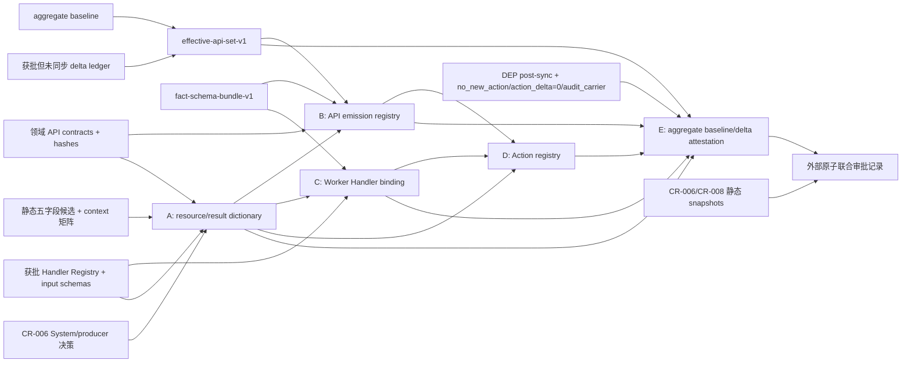

# CR-008-R1：P0 操作日志动作注册表合同闭合

文档性质：`STATIC CONTRACT CANDIDATE`。审批、制品生成与实施进展只记录在唯一的“第 11 节 当前决策状态”，不得改写本静态头。

日期：2026-08-07

## 1. 变更原因

`CR-006-R1` 推荐所有操作日志只能通过版本化 `operation-log-action-registry-v1` 精确放行，并要求注册表逐项冻结 `action_code/resource_type/producer_session_role/actor_nullable/allowed_results`。当前 Request 已给出 122 个 API 合同、`operation_logs.action_code` 的最低审计覆盖类别和六个示例动作，但没有提供可以直接生成 JCS bytes、SHA-256 和数据库 wrapper allowlist 的闭合集合。

如果只验证“点分小写”或让各 Service 自行命名，将产生以下风险：

1. 同一动作出现 `risk/risk_review/audit_risk` 等不可兼容拼写，OPS-004 无法稳定筛选。
2. 应用账号可伪造 Worker/System 动作或使用未批准的资源类型。
3. `success/failure/denied` 可被任意组合，业务驳回与安全拒绝混为一谈。
4. 为普通 GET 机械写日志，造成高噪声、存储膨胀和错误的审计事实。
5. Worker `job_type` 仍含省略号和跨 CR 候选，无法生成真正闭合的动作集合。

本 CR 定义可独立复现、供联合审批使用的静态合同，不以文档存在替代批准。即使 `CR-001-R2` 与 `CR-002-R4` 已另行获批，也不等于本 CR、`CR-003/004/005/007/009` 或下述注册表已经获批。本 CR 固有 `api_delta=0/core_table_delta=0`；最终集合只从生成时已同步、绑定 hash 的有效 Request baseline 解析，CR delta ledger 只用于证明不存在“已批准但尚未同步”的遗漏，禁止对已经进入 baseline 的 delta 再次累加。预同步规划才允许使用“锚点 + 尚未同步的已批准 delta”，不能把当前 122 API 锚点当作未来最终集合。

## 2. 范围与非授权边界

### 2.1 本草案覆盖

- 当前已批准 122 API 锚点中的 73 个非 GET 与 49 个 GET；其中只有 Request 明确要求留痕的 5 个 GET。
- 强依赖 CR 已提出的新 API：CR-005 的 PARSE-006、CR-009 的 CHUNK-008/009，以及最终准备批准包前出现的其他有效 delta。
- 认证、用户、文件、文档、财务对象、知识库、评测、问答、审核、风险、报告和安全拒绝动作。
- Worker 生命周期动作候选及现有 CR System 动作。
- `resource_type`、actor、result、拒绝动作优先级和最小去重规则。

### 2.2 本草案不授权

- 不授权同步或修改 `Request/`。
- 不授权创建或修改 Alembic 迁移、数据库函数、角色、权限或运行时代码。
- 不授权计算、发布或声称存在最终 `operation-log-action-registry-v1` JCS bytes/hash。
- 不授权 fixed-test-provider、真实 Provider 或任何其他网络调用。
- 不授权 production 放行、部署、数据回填或审计保留期裁决。
- 不批准 `CR-003/004/005/006/007/009` 中尚未批准的推荐合同。

只有第 8 节规定的五类机器制品实例、Schema、测试向量、依赖快照和第 9 节联合审批记录全部存在且相互绑定后，批准包才能作为实现输入；本文件自身不授权生成、发布或实现。

## 3. API 覆盖基线

### 3.1 当前锚点的 73 个非 GET 接口

以下集合是 baseline manifest `717c040569c536a13f4d770ad81414f86da7fc13c2ac6940c8df5ccfd1222f41` 下的精确锚点集合；该机械计数是该 manifest 的历史核对证据，但不是最终 registry 的冻结输入。一项接口可以按实际 decision/delta 或受影响资源映射到多个互斥或并存动作，实际发出规则由第 8.4—8.6 节的闭合 emission 合同和对应机器实例唯一决定。

```text
AUTH-001 AUTH-002 AUTH-003 AUTH-005 AUTH-006 FILE-001 FILE-002 FILE-006 FILE-007
PARSE-004 PARSE-005 MD-001 MD-004 MD-006 CON-002 CON-004 CON-005 CON-006
SAGR-001 SAGR-003 SAGR-004 INV-002 INV-004 INV-005 INV-006 LINK-002 LINK-003
LINK-004 KB-002 POL-002 POL-004 POL-005 POL-006 POL-007 POL-008 POL-009
CHUNK-001 CHUNK-002 CHUNK-003 CHUNK-006 INDEX-002 INDEX-004 INDEX-005 RET-001
EVAL-001 EVAL-002 EVAL-003 EVAL-004 EVAL-005 EVAL-007 QA-001 QA-002 AUDIT-002
AUDIT-004 AUDIT-005 AUDIT-007 AUDIT-008 RISK-002 REVIEW-001 REVIEW-002 REVIEW-003
REPORT-001 AUTH-008 AUTH-009 AUTH-010 AUTH-011 AUTH-013 AUTH-014 AUTH-015 CON-007
SUPP-003 KB-004 POL-010
```

`RET-001` 虽然业务语义是检索调试，但请求方法为 POST，且合同明确关联 `operation_logs`，因此不按普通纯读 GET 排除。

### 3.2 5 个必须留痕的 GET

```text
FILE-005 FILE-008 MD-007 REPORT-003 EXPORT-001
```

- `FILE-005` 的验收条件明确要求预览操作记录资源和 `trace_id`。
- `FILE-008` 与 `MD-007` 明确要求每次下载写 `operation_logs`。
- 数据库审计覆盖明确包含报告预览和下载，因此纳入 `REPORT-003/EXPORT-001`。

其余 44 个 GET 不生成成功访问动作。特别是 `AUDIT-003` 只是读取操作时间线，`OPS-004` 是读取操作日志；“关联数据表包含 `operation_logs`”不等于该 GET 自身必须再写一条日志。

### 3.3 强依赖 CR 的已知候选 delta

在当前锚点之后，本 CR 自己声明为强依赖的草案已经提出：

```text
PARSE-006  POST /api/v1/document-parse-versions/{parse_version_id}/security-revalidations
CHUNK-008  POST /api/v1/chunking-configs/{config_id}/archive
CHUNK-009  GET  /api/v1/chunking-configs
```

PARSE-006 与 CHUNK-008 必须各映射一个成功应用动作；CHUNK-009 是普通管理 GET，不进入第 3.2 节成功留痕 allowlist。仅在当前锚点上叠加 CR-005/009 候选 API 的历史反事实复核向量为 125 API/75 non-GET/50 GET；最终实例不得读取该向量或据此推断 approval/sync live state。该数值只用于依赖闭合检查，不能硬编码为永久事实。

## 4. 注册表通用规则

### 4.1 注册表条目与排序

- 每个物化条目固定包含 `action_code/resource_type/producer_session_role/actor_nullable/allowed_results` 五项。
- 条目身份按 `(action_code, resource_type, producer_session_role)` 唯一；同一 `action_code` 只有在下表明确列出多个 producer 时才允许重复。
- 应用业务动作必须匹配小写 ASCII 点分段；下划线只作为段内单词连接符。System 保留现有下划线动作，Worker 固定使用 `worker.<job_type>.<state>`。
- `resource_type` 固定为小写 ASCII snake_case；禁止复数、别名、大小写折叠或运行时自动规范化。
- `allowed_results` 是去重后按 `denied/failure/success` 固定顺序排列的闭合集合；未知值或不在该动作集合中的值 fail closed。
- 最终 JCS 对象结构、条目排序和 hash 按第 8、9 节生成并绑定；本合同不提供占位 hash，也不允许人工抄写最终实例。

### 4.2 Actor 与资源

- `actor_nullable=false` 的应用动作必须由数据库验证为同组织、active、未删除用户，并由数据库生成角色快照。
- `actor_nullable=true` 只表示该动作允许 NULL，不表示调用者可以任意省略；具体 producer wrapper 仍须按下表和 CR-006 矩阵强制。
- Worker 和 System 动作的 actor 必须为 NULL；调用方不能把目标用户、Job 创建人或服务账号伪造成 actor。
- Worker 统一以 `resource_type='async_job'`、`resource_id=job_id` 留痕；业务资源只进入批准的脱敏摘要，避免同一 Worker action 对多个 resource type 开口。
- `api_request` 是拒绝事件的技术资源类型，`resource_id` 固定为 NULL；摘要只允许接口 ID、HTTP 方法、固定错误码和不可逆请求指纹，不记录可用于确认资源存在性的原始 ID。
- 对成功创建或修改的业务对象，`resource_id` 使用该对象的 UUID。失败上传等确实尚无可验证对象时允许 resource_id 为 NULL，但不得伪造 UUID。四个允许 NULL actor 的认证动作 `auth.login.failure/auth.login.denied/auth.account.lock/auth.token.revoke` 只覆盖已识别组织和已知目标用户，`resource_type='user'` 且 `resource_id` 必须是该目标用户 UUID；未知登录账号、缺失/畸形/过期 Token 或无法解析组织/用户的请求只进入脱敏结构化安全日志，不写 `operation_logs`。

### 4.3 Result 语义

- 已提交的业务创建、更新、确认、驳回、撤销、取消、归档和异步任务受理均写 `success`。业务决定是“reject/dismiss/revoke/cancel”不等于审计 `denied`。
- `denied` 只用于安全或授权层阻止请求产生其目标效果。
- `failure` 只用于已明确需要留痕且组织和目标用户均已识别的登录失败、上传校验失败、审计型预览/下载/调试技术失败、Worker 失败和 System 维护失败。
- 普通业务事务在提交前失败并回滚时不伪造成功业务动作；授权拒绝按第 7 节单独留痕。

## 5. 应用动作候选

### 5.1 认证、用户、break-glass 与安全

| `action_code` | `resource_type` | `producer_session_role` | `actor_nullable` | `allowed_results` | API/触发 |
|---|---|---|---:|---|---|
| `auth.login.success` | `user` | `finaudit_app_rw` | false | `["success"]` | AUTH-001 |
| `auth.login.failure` | `user` | `finaudit_app_rw` | true | `["failure"]` | AUTH-001 凭据失败 |
| `auth.login.denied` | `user` | `finaudit_app_rw` | true | `["denied"]` | AUTH-001 锁定、禁用等登录拒绝 |
| `auth.account.lock` | `user` | `finaudit_app_rw` | true | `["success"]` | AUTH-001 失败阈值触发锁定 |
| `auth.token.refresh` | `token_session` | `finaudit_app_rw` | false | `["success"]` | AUTH-002 |
| `auth.logout` | `token_session` | `finaudit_app_rw` | false | `["success"]` | AUTH-003 |
| `auth.token.revoke` | `user` | `finaudit_app_rw` | true | `["success"]` | refresh 重放、用户禁用、密码重置或退出引起的撤销 |
| `user.create` | `user` | `finaudit_app_rw` | false | `["success"]` | AUTH-005 |
| `user.enable` | `user` | `finaudit_app_rw` | false | `["success"]` | AUTH-006 |
| `user.disable` | `user` | `finaudit_app_rw` | false | `["success"]` | AUTH-006 |
| `user.role.assign` | `user` | `finaudit_app_rw` | false | `["success"]` | AUTH-006/AUTH-008 角色增量 |
| `user.role.revoke` | `user` | `finaudit_app_rw` | false | `["success"]` | AUTH-006/AUTH-008 角色减量 |
| `user.password.reset` | `user` | `finaudit_app_rw` | false | `["success"]` | AUTH-009 |
| `user.password.change` | `user` | `finaudit_app_rw` | false | `["success"]` | AUTH-010 |
| `break_glass.request.create` | `break_glass_request` | `finaudit_app_rw` | false | `["success"]` | AUTH-011 |
| `break_glass.request.approve` | `break_glass_request` | `finaudit_app_rw` | false | `["success"]` | AUTH-013 |
| `break_glass.request.reject` | `break_glass_request` | `finaudit_app_rw` | false | `["success"]` | AUTH-014 |
| `break_glass.request.revoke` | `break_glass_request` | `finaudit_app_rw` | false | `["success"]` | AUTH-015 |
| `security.authorization.denied` | `api_request` | `finaudit_app_rw` | false | `["denied"]` | 已识别组织和用户的角色、范围、IDOR 或职责分离拒绝 |
| `security.prompt_injection.blocked` | `api_request` | `finaudit_app_rw` | false | `["denied"]` | QA-001 等提示注入拦截 |
| `security.sensitive_download.denied` | `api_request` | `finaudit_app_rw` | false | `["denied"]` | FILE-008、MD-007、EXPORT-001 下载拒绝 |

### 5.2 文件、解析与 Markdown

| `action_code` | `resource_type` | `producer_session_role` | `actor_nullable` | `allowed_results` | API/触发 |
|---|---|---|---:|---|---|
| `file.upload` | `file` | `finaudit_app_rw` | false | `["failure","success"]` | FILE-001/FILE-002；批量按文件留痕 |
| `file.preview` | `file` | `finaudit_app_rw` | false | `["failure","success"]` | FILE-005 |
| `file.archive` | `file` | `finaudit_app_rw` | false | `["success"]` | FILE-006 |
| `file.processing.retry` | `file` | `finaudit_app_rw` | false | `["success"]` | FILE-007；具体 stage 写入摘要 |
| `file.download` | `file` | `finaudit_app_rw` | false | `["failure","success"]` | FILE-008；权限拒绝使用专用 security 动作 |
| `document.block.correct` | `document_block` | `finaudit_app_rw` | false | `["success"]` | PARSE-004；保留 Request 示例拼写 |
| `document.parse.activate` | `document_parse_version` | `finaudit_app_rw` | false | `["success"]` | PARSE-005 |
| `document_parse.security_revalidation.requested` | `document_parse_version` | `finaudit_app_rw` | false | `["success"]` | PARSE-006；候选 Parse/Job/Outbox/幂等结果同事务 |
| `document.markdown.convert` | `document_markdown_version` | `finaudit_app_rw` | false | `["success"]` | MD-001；表示 Job 已提交 |
| `document.markdown.validate` | `document_markdown_version` | `finaudit_app_rw` | false | `["success"]` | MD-004；表示 Job 已提交 |
| `document.markdown.activate` | `document_markdown_version` | `finaudit_app_rw` | false | `["success"]` | MD-006 |
| `document.markdown.download` | `document_markdown_version` | `finaudit_app_rw` | false | `["failure","success"]` | MD-007 |

### 5.3 合同、补充协议、发票、关联与供应商

| `action_code` | `resource_type` | `producer_session_role` | `actor_nullable` | `allowed_results` | API/触发 |
|---|---|---|---:|---|---|
| `contract.candidate.create` | `contract` | `finaudit_app_rw` | false | `["success"]` | CON-002 |
| `contract.update` | `contract` | `finaudit_app_rw` | false | `["success"]` | CON-004 |
| `contract.fields.confirm` | `contract` | `finaudit_app_rw` | false | `["success"]` | CON-005 |
| `contract.document.attach` | `contract_document` | `finaudit_app_rw` | false | `["success"]` | CON-006 |
| `contract.document.detach` | `contract_document` | `finaudit_app_rw` | false | `["success"]` | CON-007 |
| `supplementary_agreement.candidate.create` | `supplementary_agreement` | `finaudit_app_rw` | false | `["success"]` | SAGR-001 |
| `supplementary_agreement.update` | `supplementary_agreement` | `finaudit_app_rw` | false | `["success"]` | SAGR-003 |
| `supplementary_agreement.confirm` | `supplementary_agreement` | `finaudit_app_rw` | false | `["success"]` | SAGR-004 decision=confirm |
| `supplementary_agreement.reject` | `supplementary_agreement` | `finaudit_app_rw` | false | `["success"]` | SAGR-004 decision=reject |
| `invoice.candidate.create` | `invoice` | `finaudit_app_rw` | false | `["success"]` | INV-002 |
| `invoice.update` | `invoice` | `finaudit_app_rw` | false | `["success"]` | INV-004 |
| `invoice.confirm` | `invoice` | `finaudit_app_rw` | false | `["success"]` | INV-005 |
| `invoice.duplicate_check` | `invoice` | `finaudit_app_rw` | false | `["success"]` | INV-006 |
| `contract_invoice.suggestion.create` | `contract_invoice` | `finaudit_app_rw` | false | `["success"]` | LINK-002 |
| `contract_invoice.primary.confirm` | `contract_invoice` | `finaudit_app_rw` | false | `["success"]` | LINK-003 |
| `contract_invoice.cancel` | `contract_invoice` | `finaudit_app_rw` | false | `["success"]` | LINK-004 |
| `supplier.update` | `supplier` | `finaudit_app_rw` | false | `["success"]` | SUPP-003；确认状态写入摘要 |

### 5.4 知识库、制度、分块、索引、评测与问答

| `action_code` | `resource_type` | `producer_session_role` | `actor_nullable` | `allowed_results` | API/触发 |
|---|---|---|---:|---|---|
| `knowledge_base.create` | `knowledge_base` | `finaudit_app_rw` | false | `["success"]` | KB-002 |
| `knowledge_base.update` | `knowledge_base` | `finaudit_app_rw` | false | `["success"]` | KB-004 |
| `policy.create` | `policy_document` | `finaudit_app_rw` | false | `["success"]` | POL-002 |
| `policy.update` | `policy_document` | `finaudit_app_rw` | false | `["success"]` | POL-004 |
| `policy.submit` | `policy_document` | `finaudit_app_rw` | false | `["success"]` | POL-005 |
| `policy.approve` | `policy_document` | `finaudit_app_rw` | false | `["success"]` | POL-006；保留 Request 示例拼写 |
| `policy.reject` | `policy_document` | `finaudit_app_rw` | false | `["success"]` | POL-007 |
| `policy.publish` | `policy_document` | `finaudit_app_rw` | false | `["success"]` | POL-008 |
| `policy.supersede` | `policy_document` | `finaudit_app_rw` | false | `["success"]` | POL-008 发布替代版本时，对旧版本追加 |
| `policy.revoke` | `policy_document` | `finaudit_app_rw` | false | `["success"]` | POL-009 |
| `policy.archive` | `policy_document` | `finaudit_app_rw` | false | `["success"]` | POL-010 |
| `chunk.config.create` | `chunking_config` | `finaudit_app_rw` | false | `["success"]` | CHUNK-001 |
| `chunk.config.publish` | `chunking_config` | `finaudit_app_rw` | false | `["success"]` | CHUNK-002 |
| `chunk.config.archive` | `chunking_config` | `finaudit_app_rw` | false | `["success"]` | CHUNK-008；配置状态/幂等结果同事务 |
| `chunk.build` | `document_chunk_set` | `finaudit_app_rw` | false | `["success"]` | CHUNK-003；表示 Job 已提交 |
| `chunk.activate` | `document_chunk_set` | `finaudit_app_rw` | false | `["success"]` | CHUNK-006 |
| `index.build` | `document_index_version` | `finaudit_app_rw` | false | `["success"]` | INDEX-002；表示 Job 已提交 |
| `index.approve` | `document_index_version` | `finaudit_app_rw` | false | `["success"]` | INDEX-004 |
| `index.activate` | `document_index_version` | `finaudit_app_rw` | false | `["success"]` | INDEX-005；保留 Request 示例拼写 |
| `retrieval.debug.execute` | `knowledge_base` | `finaudit_app_rw` | false | `["failure","success"]` | RET-001 |
| `evaluation.dataset.create` | `retrieval_eval_dataset` | `finaudit_app_rw` | false | `["success"]` | EVAL-001 |
| `evaluation.dataset.case.import` | `retrieval_eval_dataset` | `finaudit_app_rw` | false | `["success"]` | EVAL-002 |
| `evaluation.dataset.submit` | `retrieval_eval_dataset` | `finaudit_app_rw` | false | `["success"]` | EVAL-003 |
| `evaluation.dataset.approve` | `retrieval_eval_dataset` | `finaudit_app_rw` | false | `["success"]` | EVAL-004 |
| `evaluation.run.start` | `retrieval_eval_run` | `finaudit_app_rw` | false | `["success"]` | EVAL-005 |
| `evaluation.run.export` | `retrieval_eval_run` | `finaudit_app_rw` | false | `["success"]` | EVAL-007 |
| `qa.query.execute` | `qa_query` | `finaudit_app_rw` | false | `["failure","success"]` | QA-001；answered/refused/degraded 是已接受业务结果 |
| `qa.feedback.create` | `qa_feedback` | `finaudit_app_rw` | false | `["success"]` | QA-002 |

PARSE-006 与 CHUNK-008 的 emission 都是 `required`、每次首次成功请求恰好一条、与业务事实和首次完成的 idempotency record 同一事务；相同 Key/hash 重放复用首次日志，不追加第二条。失败/回滚不写 success；授权拒绝仍按第 7 节唯一拒绝动作处理。CHUNK-009 成功读取不发 action。

### 5.5 审核、风险与报告

| `action_code` | `resource_type` | `producer_session_role` | `actor_nullable` | `allowed_results` | API/触发 |
|---|---|---|---:|---|---|
| `audit.task.create` | `audit_task` | `finaudit_app_rw` | false | `["success"]` | AUDIT-002 |
| `audit.execution.create` | `audit_task_execution` | `finaudit_app_rw` | false | `["success"]` | AUDIT-004 |
| `audit.execution.start` | `audit_task_execution` | `finaudit_app_rw` | false | `["success"]` | AUDIT-005 |
| `audit.execution.retry` | `audit_task_execution` | `finaudit_app_rw` | false | `["success"]` | AUDIT-007 |
| `audit.execution.cancel` | `audit_task_execution` | `finaudit_app_rw` | false | `["success"]` | AUDIT-008 |
| `risk.review.confirm` | `audit_risk` | `finaudit_app_rw` | false | `["success"]` | RISK-002 decision=confirm |
| `risk.review.dismiss` | `audit_risk` | `finaudit_app_rw` | false | `["success"]` | RISK-002 decision=dismiss |
| `risk.review.adjust` | `audit_risk` | `finaudit_app_rw` | false | `["success"]` | RISK-002 普通调整；保留 Request 示例拼写 |
| `risk.review.high_downgrade` | `audit_risk` | `finaudit_app_rw` | false | `["success"]` | RISK-002 high 降级；与普通 adjust 二选一 |
| `audit.execution.submit` | `audit_task_execution` | `finaudit_app_rw` | false | `["success"]` | REVIEW-001 |
| `audit.execution.return_for_correction` | `audit_task_execution` | `finaudit_app_rw` | false | `["success"]` | REVIEW-002 |
| `audit.execution.complete` | `audit_task_execution` | `finaudit_app_rw` | false | `["success"]` | REVIEW-003；保留 Request 示例拼写 |
| `audit.execution.outdate` | `audit_task_execution` | `finaudit_app_rw` | false | `["success"]` | 关键事实修改使 completed execution 过期；每个受影响 execution 一行 |
| `report.generate` | `audit_report` | `finaudit_app_rw` | false | `["success"]` | REPORT-001；表示 Job 已提交 |
| `report.preview` | `audit_report` | `finaudit_app_rw` | false | `["failure","success"]` | REPORT-003 |
| `report.download` | `audit_report` | `finaudit_app_rw` | false | `["failure","success"]` | EXPORT-001 |

## 6. Worker 与 System 候选

### 6.1 Worker 生成规则

对每个最终获批并存在于同一发布只读 Handler Registry 的精确 `job_type`，必须把下面四行物化进注册表；运行时通配符不是注册表条目。

| `action_code` 模板 | `resource_type` | `producer_session_role` | `actor_nullable` | `allowed_results` |
|---|---|---|---:|---|
| `worker.<job_type>.started` | `async_job` | `finaudit_worker_rw` | true，且必须 NULL | `["success"]` |
| `worker.<job_type>.succeeded` | `async_job` | `finaudit_worker_rw` | true，且必须 NULL | `["success"]` |
| `worker.<job_type>.failed` | `async_job` | `finaudit_worker_rw` | true，且必须 NULL | `["failure"]` |
| `worker.<job_type>.cancelled` | `async_job` | `finaudit_worker_rw` | true，且必须 NULL | `["success"]` |

当前可评审的最小 Handler 候选集合为：

```text
file_process
file_scan
manual_correction_snapshot
asset_security_revalidation
markdown_convert
markdown_validate
chunk_build
index_build
retrieval_eval_run
retrieval_eval_export
audit_execute
report_generate
```

这 12 个名称不是现行 Request 可唯一推导的已批准事实：Request 仅示例 `parse/markdown/chunk/index/eval/audit/report/...`；`file_process/file_scan` 来自 CR-007 候选，两个文档完整性 Handler 来自 CR-005 候选，其余细分名是本 CR 推荐。最终集合必须由 CR-004 Handler Registry、CR-005 文档 Handler 和 CR-007 文件生命周期共同裁决。

恢复或技术重试不新增 `worker.<job_type>.recovered`。同一 Job 每次新 `attempt_no` 再写一条 `started`；恢复原因、旧 lease 与 attempt 只写入批准的脱敏摘要。若 CR-004 最终要求独立 recovery action，则必须修订本 CR 版本，不能静默扩展 v1。

### 6.2 现有 System 动作

| `action_code` | `resource_type` | `producer_session_role` | `actor_nullable` | `allowed_results` |
|---|---|---|---:|---|
| `system_bootstrap` | `organization` | `finaudit_bootstrap` | true，且必须 NULL | `["success"]` |
| `system_startup` | `service` | `finaudit_backend_boot` | true，且必须 NULL | `["success"]` |
| `system_startup` | `service` | `finaudit_worker_boot` | true，且必须 NULL | `["success"]` |
| `operation_log_partition_maintenance_failed` | `operation_log_partition` | `finaudit_oplog_partition_scheduler` | true，且必须 NULL | `["failure"]` |
| `operation_log_chain_failed` | `operation_log_chain` | `finaudit_oplog_chain_sealer` | true，且必须 NULL | `["failure"]` |

不新增 `operation_log_chain_sealed`：成功封账的权威事实是链状态水位和不可覆盖 manifest，现有 CR 只定义失败动作。

### 6.3 候选条目计数

- 当前 122 API 锚点对应第 5 节原有 92 个应用注册表条目；加入已知依赖候选 PARSE-006/CHUNK-008 后为 94 个，`action_code` 均唯一。CHUNK-009 不增加条目。
- 若第 6.1 节 12 个 Handler 候选全部获批，Worker 笛卡尔积产生 `12 × 4 = 48` 个物化条目。
- 第 6.2 节有 5 个 System 条目；`system_startup` 因两个精确 producer 形成两行，因此是 4 个唯一 System action_code。
- 在 CR-005/009 所列候选和 12 个 Handler 全部生效这一审查场景下会得到 147 个注册表条目、146 个唯一 `action_code`。这两个数只用于复核本候选表，不是永久验收常量；最终值必须由第 8.8 节公式和已批准 artifact 实例机械重算，不能据此预先生成 v1 hash。

## 7. 拒绝动作优先级与去重

同一请求至多写一条请求级拒绝动作，按以下最具体优先级选择：

1. 登录请求：仅当组织和目标用户均已识别时，无效凭据使用 `auth.login.failure`，已知账号被锁定、禁用等策略拒绝使用 `auth.login.denied`；未知账号或无法解析组织/用户时只写脱敏结构化安全日志。
2. 检测到提示注入：`security.prompt_injection.blocked`。
3. FILE-008、MD-007、EXPORT-001 的授权拒绝：`security.sensitive_download.denied`。
4. 其他已解析组织和 actor 的角色、范围、IDOR 或职责分离拒绝：`security.authorization.denied`。

被上述动作覆盖时，不再为目标业务动作写第二条 `result=denied` 的日志。存储不可用、制品未就绪等非权限失败使用对应 preview/download 动作的 `failure`；成功预览或下载使用对应资源动作的 `success`。响应仍必须遵循 403/404 隐藏规则，日志不得成为向调用方泄露资源存在性的旁路。

## 8. 可执行决策与机器制品合同

### 8.1 六项固定决策

| 决策 ID | 唯一选择 | Fail-closed 规则 |
|---|---|---|
| `OPLREG-D-001` | 应用动作中只有 `auth.login.failure/auth.login.denied/auth.account.lock/auth.token.revoke` 允许 `actor_id=NULL`；四者仍要求已识别的非空 `organization_id` 和目标用户 UUID `resource_id`。其他应用 actor 非空，Worker/System actor 必须 NULL。 | 不能验证组织、目标用户、producer 或 actor 模式时不得追加。 |
| `OPLREG-D-002` | 缺失、畸形、过期、伪造或不能解析到现有组织/用户的凭据，以及未知登录账号，只进入脱敏结构化安全日志，不写 `operation_logs`，也不新增全局 pre-auth action。 | 禁止伪造组织、用户、资源 UUID 或用 NULL 组织降级写入。 |
| `OPLREG-D-003` | `resource_type` 只允许版本化 Resource/Result Dictionary 中的小写 ASCII 单数 snake_case；`api_request` 与 `async_job` 是两个技术资源类型。 | 别名、复数、大小写折叠、Unicode 等价替换和运行时自动规范化全部拒绝。 |
| `OPLREG-D-004` | 每个有效 API ID 在 API→Action Emission Registry 中恰好出现一次；每项 emission 必须同时冻结 requirement、条件 AST、基数、事务、顺序和幂等。 | 缺字段、孤儿 API、孤儿 action、自由文本条件或条件引用未绑定事实来源时不得生成 action registry。 |
| `OPLREG-D-005` | 成功访问留痕 GET allowlist 恰为 `FILE-005/FILE-008/MD-007/REPORT-003/EXPORT-001`；其余 GET（含 `CHUNK-009`）没有成功 emission。 | 扩大或缩小 allowlist 必须新建 CR；不得按页面敏感度或“关联 operation_logs”自动推导。 |
| `OPLREG-D-006` | 已提交的目标业务效果使用 `success`；安全/授权阻断使用 `denied`；只有本文明确审计的技术失败、Worker 失败和 System 失败使用 `failure`。 | 回滚事务不得写目标业务 `success`；业务决定名含 reject/revoke/cancel 不改变 result 语义。 |

上述六项是静态合同选择，不表示已经审批。批准记录必须逐字绑定 `OPLREG-D-001..006=ALL_SELECTED`，不能在实现时另选解释。

### 8.2 五类制品与共同 JSON 规则

批准包只允许以下五类逻辑实例及其同名 JSON Schema 2020-12；文件名固定，版本升级新建实例，不覆盖旧版本：

| 类别 | 实例文件 | Schema 文件 | 唯一职责 |
|---|---|---|---|
| A | `operation-log-resource-result-dictionary-v1.json` | `operation-log-resource-result-dictionary-v1.schema.json` | resource/result/producer/context/rejection/System 闭合词典 |
| B | `operation-log-api-emission-registry-v1.json` | `operation-log-api-emission-registry-v1.schema.json` | 每个有效 API 的成功、失败与条件 emission |
| C | `operation-log-worker-handler-binding-v1.json` | `operation-log-worker-handler-binding-v1.schema.json` | Handler Registry 到四态 Worker action 的绑定 |
| D | `operation-log-action-registry-v1.json` | `operation-log-action-registry-v1.schema.json` | CR-006 wrapper 使用的五字段最终 allowlist |
| E | `operation-log-baseline-delta-attestation-v1.json` | `operation-log-baseline-delta-attestation-v1.schema.json` | baseline/delta、五类制品、动态计数和零增量依赖证明 |

批准包还必须包含十个共同/直接消费的支持 Schema，但它们不增加 A—E 逻辑实例计数：`effective-api-set-v1.schema.json`、`operation-log-fact-schema-bundle-v1.schema.json`、`cr006-cr008-joint-approval-record-v1.schema.json`、`request-sync-transition-evidence-v1.schema.json`、`request-sync-authorization-v1.schema.json`、`source-contract-approval-record-v1.schema.json`、`dep005-detached-approval-evidence-v1.schema.json`、`approval-signer-registry-v1.schema.json`、`cr004-handler-registry-approved-fact-set-v1.schema.json`、`cr010-scanner-registry-contract-fact-set-v1.schema.json`。前两个还必须有同名完整实例；其余实例通过 joint record/dependency/source-approval refs 绑定，不进入 A—E 计数。DEP-only 的 `dep005-post-sync-baseline-attestation-v1.schema.json` 另由 E 与 joint artifact role绑定，不计入上述共同十项。支持 Schema 与实例使用本节同一 raw/JCS/hash/no-replace 规则；实际文件、registry/pin 和 hash 未生成时只阻断联合批准，不阻断静态 contract-review snapshot。

`effective-api-set-v1` 根对象精确五键：`schema_version='effective-api-set-v1'`、`set_version`、`baseline_manifest_sha256`、`delta_records`、`apis`。`baseline_manifest_sha256` 必须逐字等于 E.`post_all_upstream_sync_baseline_manifest_sha256`，并同时通过 E 两个 baseline source bindings、CR-010 末跳 `post_baseline_manifest_sha256` 与 no-replace aggregate manifest exact identity验证；任一方不可寻址或不等即失败。`delta_records` 必须与 E.`delta_records` 整个 RFC 8785 JCS array bytes 逐字相等并使用下述封闭两项观察；禁止只比较成员数、摘要字段或重新按 live state生成。`apis[]` 每项精确五键 `api_id/method/path_template/source_contract_id/source_contract_sha256`，按 `(api_id,method,path_template)` 升序且 api_id 唯一，内容必须恰好等于第 8.8 节 observation-point 集合公式。`effective_api_set_sha256=SHA256(JCS(整个实例))`，hash 不写回实例；B 与 E 必须绑定相同 set version/raw Schema hash/instance hash。该实例在同一 joint APPROVED record 形成前只是 candidate，不得被 runtime、Request sync 或 migration 消费。

`source_contract_id/source_contract_sha256` 在本 revision 只有一套 API 身份规则：CR-006-R1 与 CR-008-R1 的两个 `api_add/api_remove` 都为空，因此每个 effective API 都来自 aggregate baseline；ID 固定为 `Request/FinAudit_Agent_API接口设计说明书_V1.0.md`，hash 固定为 E.`baseline_source_bindings.api_contract.raw_sha256`。B API 行以及下述 fact bundle 的 `api` source binding 必须逐字复用 effective-set 对同一 `api_id` 的这套身份。未来若出现非零 API delta 或另一权威 source，必须提升本 CR revision和 artifact version并定义新的 observation，不得给本 v1 增加第二条 source 分支。

`operation-log-fact-schema-bundle-v1` 根对象精确三键：`schema_version='operation-log-fact-schema-bundle-v1'`、`bundle_version`、`schemas`。`schemas[]` 每项精确六键 `schema_id/schema_version/relative_path/schema_sha256/byte_length/source_bindings`；`schema_id/schema_version` 都是非空 ASCII string，relative path 必须是仓库相对 POSIX path，不含空段、`.`、`..`、反斜杠或绝对路径，byte length 为正 SafeInteger。数组按 `(schema_id,schema_version,schema_sha256)` 升序且该三元组唯一；每项只能解析批准清单中的本地 raw Schema bytes，禁止网络 resolver。

`source_bindings[]` 非空，每项精确六键 `binding_kind/api_id/job_type/handler_input_schema_version/source_contract_id/source_contract_sha256`；`binding_kind` 是 string 且封闭为 `api/worker_handler`，`api_id/job_type` 各为 string 或 null，`handler_input_schema_version` 为正 SafeInteger 或 null，source contract ID 是非空 string，hash 是小写 64 hex。Schema 必须用 `oneOf` 与 `if/then` 实施以下互斥矩阵，companion 再验证跨制品等式：

- `api`：`api_id` 为 non-empty string，`job_type=null`、`handler_input_schema_version=null`；同一 source binding 的 `source_contract_id/source_contract_sha256` 必须逐字等于 effective-api-set 中唯一同 `api_id` 行。B 的 parent API 行每个 fact binding 必须在其命中的 schema item 中再唯一命中同 `api_id` 的这一 branch。
- `worker_handler`：`api_id=null`，`job_type` 是匹配 `^[a-z][a-z0-9_]{0,59}$` 的 string，`handler_input_schema_version` 是正 SafeInteger；source contract ID 固定为 `CR-004-R1:cr004-handler-registry-approved-fact-set-v1`，hash 唯一取 joint dependency 中 `source_id=CR-004` 的 `approved_fact_set_sha256`。该 fact set 必须通过 `cr004-handler-registry-approved-fact-set-v1` raw Schema与八角色 `approved_artifact` 签名，且其 `input_schema_bundle_sha256` 逐字等于 C 根字段；同一 `job_type + handler_input_schema_version` 必须唯一命中该 fact set 绑定的 Handler Registry handler，并要求 enclosing schema item 的 `schema_id/schema_version/schema_sha256` 分别逐字等于 handler 的 `input_schema_id`、无前导零十进制 `input_schema_version` string、`input_schema_sha256`。C 的 parent job type 每个 fact binding 必须在其命中的 schema item 中再唯一命中同 `job_type` 的这一 branch，不得查找或伪造 effective API。

每个 schema item 内 source binding 按 `(binding_kind_order,api_id_or_empty,job_type_or_empty,handler_input_schema_version_or_zero,source_contract_id,source_contract_sha256)` 升序，其中 kind 顺序固定 `api,worker_handler`，null 的排序替代值分别为空 string/0；完整六元组和身份四元组 `(binding_kind,api_id,job_type,handler_input_schema_version)` 都不得重复。每个 source binding 必须被 B 或 C 至少引用一次，B/C 引用全集也不得超出 bundle；同一 parent 的同一 fact root 只能命中一个 schema item与一个 source branch。bundle instance hash 对 JCS bytes 计算且不写回自身；B/C 每个 fact binding 必须逐字复用命中项的 schema ID/version/raw hash，任何零命中或多命中均失败关闭。

所有 Schema 固定 `$schema="https://json-schema.org/draft/2020-12/schema"`，具有唯一相对 `$id`、固定 `title`、根 `type=object`；根和每个 object 都必须 `additionalProperties=false`，并以 `required` 列出其全部属性；实例中禁止 schema 未声明的键。解析前拒绝 duplicate key；禁止远程 `$ref`、网络 resolver、注释和非有限数。文本必须是 UTF-8 无 BOM、仅 LF。UUID 为小写连字符，SHA-256 为小写 64 hex，SafeInteger 为 `0..9007199254740991`。实例以 RFC 8785 JCS bytes 计算 SHA-256；Schema 以仓库原始 bytes 计算 SHA-256；对象不得包含自身 hash。所有标识数组先去重再按 Unicode code point 升序，动作条目按 `(action_code,resource_type,producer_session_role)` 升序，API 按 `api_id` 升序，Worker 按 `job_type` 升序。Schema、实例、companion validator 和固定正反测试向量都必须由外部批准清单绑定相对路径、byte length 与 SHA-256。

数组排序是 Schema/companion 的逐字段合同，不允许实现依赖 catalog/JSON 输入顺序：effective-set 与 E 的 delta records 使用 `(source_id,revision,decision_snapshot_sha256)`，其中 api_add/api_remove 使用 `(api_id,method,path_template)`；effective-set/B apis 使用 `(api_id,method,path_template)`；fact bundle schemas 使用 `(schema_id,schema_version,schema_sha256)`，每个 schema 的 source bindings 使用上一段精确六元排序；A resource types 使用 Unicode code point，result codes 使用 `denied/failure/success`，producer roles 使用 `producer_session_role`，context policies 使用 `(action_code,resource_type,producer_session_role)`，rejection policies 使用 `(priority,policy_code)`，system actions 使用动作条目身份，所有 `allowed_results` 使用 `denied/failure/success`；B/C fact bindings 使用事实根顺序 `request_validated/committed_before/committed_after/security_decision/idempotency_result` 再 `(schema_id,schema_version)`，B rejection codes 使用 A.priority，B emissions 使用 `(order,emission_id)`；AST `all/any.items` 按各子节点 `SHA256(JCS(node))` 升序且无重复；C job types 使用 job_type，handler versions 使用 `(input_schema_version,input_schema_id,input_schema_sha256,handler_code_version)`，worker actions 使用 `started/succeeded/failed/cancelled`，transition codes 使用 Handler Registry enum 顺序；D entries 使用动作条目身份；E artifact bindings 使用 `resource_result_dictionary/api_emission_registry/worker_handler_binding/action_registry`；共同审批 artifact/role 数组使用第 9.3 节封闭 enum 顺序。未在本段出现的 A—E/support array 即 Schema 错误，禁止新增“实现自定”顺序。

### 8.3 五类 Schema 的精确数据面

1. **A / Resource-Result Dictionary**
   - 根对象精确且必需：`schema_version/dictionary_version/resource_types/result_codes/producer_roles/context_policies/rejection_policies/system_actions`；`schema_version` 固定 `operation-log-resource-result-dictionary-v1`。
   - `resource_types[]` 元素直接是匹配 `^[a-z][a-z0-9_]{0,79}$` 的 string，集合恰为：`api_request/async_job/audit_report/audit_risk/audit_task/audit_task_execution/break_glass_request/chunking_config/contract/contract_document/contract_invoice/document_block/document_chunk_set/document_index_version/document_markdown_version/document_parse_version/file/invoice/knowledge_base/operation_log_chain/operation_log_partition/organization/policy_document/qa_feedback/qa_query/retrieval_eval_dataset/retrieval_eval_run/service/supplementary_agreement/supplier/token_session/user`。新增、别名或删除任一值都必须提升本 CR revision。
   - `result_codes[]` 元素精确包含 `result/effect_semantic/committed_effect_required/error_code_mode`，且恰有三行：`denied/blocked/false/required`、`failure/audited_technical_failure/false/required`、`success/committed_target_effect/true/forbidden`。
   - `producer_roles[]` 元素精确包含 `producer_session_role/producer_class/default_actor_mode/default_organization_mode/action_code_policy`；class 恰为 `application/worker/system`，actor mode 恰为 `required_user/known_target_nullable/must_be_null`，organization mode 恰为 `required/must_be_null`，action policy 恰为 `application_registry/worker_materialized/system_exact`。
   - `context_policies[]` 元素精确包含 `action_code/resource_type/producer_session_role/organization_id_mode/actor_id_mode/resource_id_by_result`；organization mode 恰为 `required/must_be_null`，actor mode 恰为 `required_user/known_target_nullable/must_be_null`；最后一项是精确含 `denied/failure/success` 三键的 object，值恰为 `required_uuid/nullable_uuid/must_be_null/not_allowed`。A 直接从第 5 节静态五字段应用候选、获批 Handler Registry 按第 6.1 节四态展开的五字段 Worker 候选和第 6.2 节五个 System 候选生成，不读取 B、C 或 D；D 每个条目必须唯一命中一项 context policy，未被最终 D 使用的静态候选 policy 不产生 wrapper 权限。
   - `rejection_policies[]` 元素精确包含 `policy_code/priority/condition/audit_disposition/action_code/resource_type/result/resource_id_source/max_rows_per_request/transaction/order/idempotency`；priority 是不重复正整数，disposition 恰为 `operation_log/security_log_only`，后者 action/resource/result/resource_id_source/transaction/order/idempotency 必须全为 null，前者必须全部非空并复用 B 的同名结构；`max_rows_per_request` 固定 1。
   - `producer_roles[]` 恰有七个 producer：`finaudit_app_rw/finaudit_worker_rw/finaudit_bootstrap/finaudit_backend_boot/finaudit_worker_boot/finaudit_oplog_partition_scheduler/finaudit_oplog_chain_sealer`。app 默认 `application/required_user/required/application_registry`，四个 actor-null 例外由 context policy 收窄；worker 为 `worker/must_be_null/required/worker_materialized`；bootstrap 为 `system/must_be_null/required/system_exact`；其余四个 System producer 为 `system/must_be_null/must_be_null/system_exact`。
   - `system_actions[]` 元素就是 D 的五字段条目；必须物化第 6.2 节五行，分区失败 producer 逐字且唯一为 `finaudit_oplog_partition_scheduler`。
   - `rejection_policies[]` 的 policy/priority/disposition/action/resource/result 恰为：`auth_login_invalid_known_target/10/operation_log/auth.login.failure/user/failure`、`auth_login_policy_denied_known_target/20/operation_log/auth.login.denied/user/denied`、`prompt_injection_blocked/30/operation_log/security.prompt_injection.blocked/api_request/denied`、`sensitive_download_denied/40/operation_log/security.sensitive_download.denied/api_request/denied`、`authorization_denied/50/operation_log/security.authorization.denied/api_request/denied`、`preauth_unresolved/60/security_log_only/null/null/null`。condition 必须是第 8.4 节 AST；priority 从小到大 first-match。两个 login policy 的 resource source 固定 `security_decision + /target_user_id + forbidden`，三个 `api_request` policy 固定 `null + null + always`。五个 operation-log policy 的 order=10、幂等为 `request_instance/append_each_request`；只有会原子提交失败计数/锁定效果的 login-invalid policy 使用 `same_request_audit_transaction/security_decision_and_effects`，其余四项使用 `same_request_audit_transaction/security_decision_only`。
   - context 唯一推导矩阵固定：所有 `finaudit_app_rw` policy 的 organization=`required`，四个 `auth.login.failure/auth.login.denied/auth.account.lock/auth.token.revoke` actor=`known_target_nullable`，其余应用 actor=`required_user`；`api_request` 的 allowed result resource ID=`must_be_null`，`file.upload/failure=nullable_uuid`，其他应用 allowed result=`required_uuid`，未允许 result=`not_allowed`。Worker organization=`required`、actor=`must_be_null`、四态 allowed result resource ID=`required_uuid`。`system_bootstrap` organization=`required`、actor=`must_be_null`、success resource ID=`required_uuid`；两个 `system_startup` 及 partition/chain failure 的 organization/actor=`must_be_null`、allowed result resource ID=`must_be_null`；其余 result=`not_allowed`。输入五字段的 actor_nullable 必须与该矩阵一致，任何身份命中零项/多项或人工覆盖都失败。此矩阵和源候选先生成 A，再由 A 单向校验 B/C/D，避免 A↔D 环。

2. **B / API→Action Emission Registry**
   - 根对象精确十一键且必需：`schema_version/registry_version/effective_api_set_version/effective_api_set_schema_sha256/effective_api_set_sha256/dictionary_version/dictionary_sha256/fact_schema_bundle_version/fact_schema_bundle_schema_sha256/fact_schema_bundle_sha256/apis`；schema 固定 `operation-log-api-emission-registry-v1`。effective set 与 fact bundle 必须分别逐字绑定第 8.2 节支持 Schema raw hash 和实例 hash，不能绑定摘要表、候选计数或只有文件名的清单。
   - `apis[]` 元素精确且必需：`api_id/method/path_template/source_contract_id/source_contract_sha256/fact_schema_bindings/success_audit_mode/rejection_policy_codes/emissions`；method 恰为 `DELETE/GET/PATCH/POST/PUT`，success mode 恰为 `required/conditional/none`。每个 effective API ID 恰好一行；method/path 必须与绑定 source contract 相等。
   - `fact_schema_bindings[]` 元素精确包含 `fact_source/schema_id/schema_version/schema_sha256`；fact_source 使用下述封闭枚举并在 API 行内唯一，schema ID/version 非空且 hash 为批准的原始 Schema bytes。其中 `schema_id/schema_version/schema_sha256` 三元组先唯一命中根绑定 fact-schema bundle 的 schema item，再以 parent `apis[].api_id` 唯一命中该 item 的 `binding_kind=api` source branch；该 branch 的 source ID/hash 必须等于 parent B API 行和 effective-set 行，三方逐字相等。数组必须恰好覆盖该 API 的 emissions、所引用 rejection policies、resource/cardinality/idempotency 中出现的全部非空 fact source，不得缺失、携带未引用项或借用另一 API/Worker 的 branch。
   - `emissions[]` 元素精确且必需：`emission_id/phase/requirement/condition/action_code/resource_type/result/resource_id_source/cardinality/transaction/order/idempotency`。phase 恰为 `on_business_commit/on_audited_failure/on_security_decision`；requirement 恰为 `required/conditional`；required 的 condition 必须为 null，conditional 的 condition 必须是第 8.4 节 AST；result 必须在 A 对应 context policy 的 `resource_id_by_result` 中不是 `not_allowed`。`emission_id` 是小写 64 hex，固定为 `SHA256(JCS({api_id,phase,requirement,condition,action_code,resource_type,result,resource_id_source,cardinality,transaction,order,idempotency}))`；preimage 的十二键按 JCS 处理且不含 emission_id。所有 B 行内及全实例 emission_id 必须唯一，内容、条件或 order 任一变化都会得到新 ID。
   - success mode 的条件矩阵必须由 Schema `if/then` 与 companion 同时验证：`none` 当且仅当 `emissions=[]`；`required` 至少含一个 required `on_business_commit`；`conditional` 至少含一个 conditional success/failure 分支。method=GET 且 api_id 不在五项 allowlist 时强制 none/空数组；五项 allowlist 强制 conditional，且 success/failure 分支互斥；non-GET 强制 required 或 conditional。
   - B、A rejection policy 与 C 共用唯一事实根枚举 `request_validated/committed_before/committed_after/security_decision/idempotency_result`；每个 pointer 都必须同时携带该 enum 中的根，禁止“裸 pointer”。`resource_id_source` 精确包含 `fact_source/json_pointer/null_mode`：null mode 恰为 `forbidden/only_when_object_not_created/always`；前两者要求非空 fact_source 与 RFC 6901 pointer，always 要求二者均为 null。`only_when_object_not_created` 只允许 `on_audited_failure` 且源合同明确没有资源 UUID 的分支。
   - `cardinality` 精确包含 `mode/fact_source/source_json_pointer/minimum/maximum/item_order`。mode 恰为 `per_request/per_input_file/per_delta_member/per_affected_resource`。per_request 强制 fact_source/pointer/order 为 null 且 minimum=maximum=1；per_input_file 强制 `request_validated` 根、非空 pointer、minimum=1、order=`input_ordinal_then_uuid`；per_delta_member 强制 `committed_after` 根、非空 pointer、minimum=0、order=`unicode_codepoint_code`；per_affected_resource 强制 `committed_after` 根、非空 pointer、minimum=0、order=`unicode_codepoint_uuid`。后三者 maximum 为绑定 source contract 的 SafeInteger 上限或 null。
   - `transaction` 精确包含 `mode/commit_boundary`，按 phase 只允许：`on_business_commit → same_business_transaction/business_fact_and_idempotency`；`on_audited_failure → same_request_audit_transaction/audit_only_after_target_rollback`；`on_security_decision → same_request_audit_transaction/security_decision_only|security_decision_and_effects`。只有同时提交安全状态效果的 `auth.account.lock`、AUTH-002 refresh-replay revoke 与 login-invalid policy 使用 `security_decision_and_effects`；其他 security decision 使用 `security_decision_only`。
   - `order` 是同一 API/同一可并存分支中的唯一正整数；按数值升序追加。`idempotency` 精确包含 `mode/key_fact_source/key_json_pointer/replay_disposition/attempt_fact_source/attempt_json_pointer`，且只允许下表三种矩阵；其他组合均拒绝。

| `mode` | `key_fact_source` | `key_json_pointer` | `replay_disposition` | `attempt_fact_source` | `attempt_json_pointer` |
|---|---|---|---|---|---|
| `business_key` | `idempotency_result` | `/key_hash` | `reuse_first_committed` | null | null |
| `request_instance` | `request_validated` | `/request_id` | `append_each_request` | null | null |
| `attempt_key` | `committed_after` | `/job_id` | `append_each_new_attempt` | `committed_after` | `/attempt_no` |

3. **C / Worker Handler Binding**
   - 根对象精确十三键且必需：`schema_version/binding_version/handler_registry_version/handler_registry_sha256/handler_registry_schema_version/handler_registry_schema_sha256/input_schema_bundle_sha256/dictionary_version/dictionary_sha256/fact_schema_bundle_version/fact_schema_bundle_schema_sha256/fact_schema_bundle_sha256/job_types`；schema 固定 `operation-log-worker-handler-binding-v1`。fact bundle 必须与 B 绑定同一 version/Schema raw hash/instance hash；`input_schema_bundle_sha256` 必须逐字等于 CR-004 approved fact set 的同名字段和共同 artifact role。
   - `job_types[]` 对 Handler Registry 每个唯一 `job_type` 恰好一行，精确包含 `job_type/handler_versions/fact_schema_bindings/worker_actions`。`handler_versions[]` 精确包含 `input_schema_version/input_schema_id/input_schema_sha256/handler_code_version`；同一 job type 的多输入版本留在同一行。fact bindings 使用 B 的精确四键结构，并恰好覆盖该 job type 的 resource/cardinality/idempotency/transition 条件引用根；每个 binding 的 `schema_id/schema_version/schema_sha256` 三元组先唯一命中 fact bundle schema item，再以 parent `job_type` 唯一命中 `binding_kind=worker_handler` branch，并按第 8.2 节逐字等于同一 Handler Registry handler 的 input schema ID/十进制 version/raw hash 与 CR-004 approved fact-set source identity。零命中、多命中、effective API source 或不同 handler version 的 branch 均失败关闭。
   - `worker_actions[]` 恰好四行，精确包含 `state/action_code/result/phase/requirement/condition/transition_codes/cardinality/transaction/order/idempotency`；state 恰为 `started/succeeded/failed/cancelled`，action 精确为 `worker.<job_type>.<state>`，result 按第 6.1 节固定。四行 phase=`on_business_commit`、requirement=`conditional`，condition 为第 8.4 节 AST 且只能引用该行 transition_codes；transaction 固定 `same_business_transaction/business_fact_and_idempotency`，cardinality=`per_request`、order=10、idempotency=`attempt_key`。transition code 来自 Handler Registry 的闭合枚举并排序。

4. **D / Action Registry**
   - 根对象精确且必需：`schema_version/registry_version/dictionary_version/dictionary_sha256/emission_registry_version/emission_registry_sha256/handler_binding_version/handler_binding_sha256/entries`；schema 固定 `operation-log-action-registry-v1`。
   - `entries[]` 每项只含并必需第 4.1 节五字段；身份唯一、排序固定、无通配符。应用条目必须可由 B 的 emission 或 A 的 operation-log rejection policy 到达；Worker 条目必须由 C 物化；System 条目必须与 A 完全相等。任何孤儿、缺失或跨 producer 借用都失败关闭。

5. **E / Baseline-Delta Attestation**
   - 根对象精确二十二键且必需：`schema_version/attestation_version/observation_point/source_baseline_manifest_sha256/dep005_post_sync_baseline_attestation_schema_sha256/dep005_post_sync_baseline_attestation_ref/dep005_post_sync_baseline_attestation_sha256/dep005_post_sync_baseline_manifest_sha256/post_all_upstream_sync_baseline_manifest_sha256/sync_evidence_chain/baseline_source_bindings/baseline_counts/delta_records/effective_api_set_version/effective_api_set_schema_sha256/effective_api_set_sha256/effective_counts/artifact_bindings/generator/companion_validator_sha256/test_vector_bundle_sha256/dep005_zero_effect`；schema 固定 `operation-log-baseline-delta-attestation-v1`，`observation_point` 固定为 `post_cr006_cr008_joint_approval_pre_request_sync`。该值表示实例以 prospective bytes 描述“同一 joint record 已批准、但 CR-006/008 尚未同步 Request”的目标观察点，不表示生成 candidate 时批准已发生。DEP ref 使用 `ArtifactRef` 且显式 hash 等于 ref.sha256；DEP support Schema raw hash、source/DEP-post/final-all-upstream 三个 baseline 身份不得相互偷换。
   - `baseline_source_bindings` 精确二键 `api_contract/core_table_contract`；每项精确三键 `path/artifact_ref/raw_sha256`，ref 使用共同 `ArtifactRef` 且 `artifact_ref.sha256=raw_sha256`。两个 path 分别固定为 `Request/FinAudit_Agent_API接口设计说明书_V1.0.md` 与 `Request/FinAudit_Agent_数据库设计说明书_V1.0.md`；每个 raw hash 必须同时等于 `post_all_upstream_sync_baseline_manifest_sha256` 所标识 no-replace aggregate manifest 的 exact path entry、最后一项 CR-010 sync evidence 解引用后 `request_files` 同 path 的 `post_raw_sha256` 以及 artifact_ref 所解析 raw bytes 的 SHA-256。任一 manifest/evidence/ref 不可寻址、path 缺失、hash 三方不等或 bytes 不是 UTF-8 无 BOM/LF-only 均失败关闭。
   - `baseline_counts` 精确五键 `api_total/non_get/get/audited_get/core_parent_tables`；`effective_counts` 精确八键 `api_total/non_get/get/audited_get/core_parent_tables/action_registry_entries/unique_action_codes/worker_job_types`；全部为 SafeInteger。baseline 不含尚未获批/同步的 CR-008 action registry 与 Worker 数据，禁止伪造后三项 baseline 值，也不得把第 6.3 节场景数复制成 const。
   - `delta_records[]` 成员全集恰为两项，按 `(source_id,revision,decision_snapshot_sha256)` Unicode code point 升序；两项 `(source_id,revision)` 分别固定为 `(CR-006,CR-006-R1)` 与 `(CR-008,CR-008-R1)`，各自 `decision_snapshot_sha256` 必须按对应 CR 的 review snapshot 算法复算并逐字等于同一 joint record 的 `cr_bindings`。`source_id` 单独唯一，完整三元组也唯一。每项精确七键 `source_id/revision/decision_snapshot_sha256/approval_status/sync_status/declared_delta/effective_contribution`；`approval_status` 固定 string `prospective_joint_approval`，`sync_status` 固定 string `unsynced`，不得写入或推导 approved/rejected/not_approved/synced live state。
   - `declared_delta/effective_contribution` 都精确三键 `api_add/api_remove/core_parent_tables`；两个 API array 元素仍使用精确五键 `api_id/method/path_template/source_contract_id/source_contract_sha256` 和 `(api_id,method,path_template)` 排序/唯一规则，但本 revision 四个数组全部恰为空。CR-006 两个 object 都固定 `api_add=[]/api_remove=[]/core_parent_tables=1`；CR-008 两个 object 都固定 `api_add=[]/api_remove=[]/core_parent_tables=0`。`operation_log_actions` 不属于任一 delta object；action tuple 与 effective action counts 的唯一来源是 A—D，DEP 零 action 另由 `dep005_zero_effect` 证明。
   - `effective_contribution=declared_delta` 是对目标 observation 的 prospective 等式，不是 candidate 自授权。只有同一个 no-replace `cr006-cr008-joint-approval-record-v1` 以 `decision=APPROVED` 同时绑定本 E instance hash、effective-set instance hash、两份 snapshot、两组六项 selected decisions、八角色 APPROVED 和上述两项 delta/count 等式后，这些 contribution 与 effective counts 才可消费；E 不内嵌 joint record hash，避免自引用。joint 未形成时 E/effective-set/A—D 全部只是不可消费 candidate。joint 判定后本 E 保持该 observation 的历史 no-replace attestation；此后发生的批准撤销、后续拒绝或 Request sync 状态变化都不得原地改写 `approval_status/sync_status` 或重新 hash，新的 observation 必须提升 attestation/artifact version；CR-006/008 同步 Request 后还必须提升 CR revision并由新 aggregate baseline 生成新合同 attestation。
   - `artifact_bindings[]` 对 A—D 各一行，精确包含 `artifact_kind/schema_version/schema_sha256/instance_version/instance_sha256/byte_length`；artifact kind 恰为 `resource_result_dictionary/api_emission_registry/worker_handler_binding/action_registry`，不得包含 E 自身。generator 精确包含 `name/version/source_revision_sha256`，禁止时间、主机名或 run ID 进入确定性输入。
   - `dep005_zero_effect` 精确且必需：`dep_revision/decision_snapshot_sha256/no_new_action/operation_log_action_delta/audit_carrier`，其值分别绑定获批 DEP-005 revision/snapshot、`true`、`0`、`no_replace_artifacts`。该断言只证明备份/恢复通过不可覆盖制品审计，不新增 backup/restore operation action。
   - `sync_evidence_chain[]` 恰好按 `DEP-005/CR-003/CR-004/CR-005/CR-007/CR-009/CR-010` 固定顺序各一项，每项精确七键 `source_id/revision/decision_snapshot_sha256/pre_baseline_manifest_sha256/post_baseline_manifest_sha256/sync_evidence_ref/sync_evidence_sha256`；ref/hash 相等。首项必须逐字复用 DEP post-sync attestation，pre=source baseline、post=`dep005_post_sync_baseline_manifest_sha256`；后六项必须通过共同 `request-sync-transition-evidence-v1` raw Schema hash，其 authorization 又必须通过 DEP-005 owner truth 的二十三键 `request-sync-authorization-v1`。验证器必须逐项检查 source/revision/marker/snapshot、十键 `source_approval_binding`、完整 signed source record/fact-set、same `ApprovalSignerRegistryRef` + package 外 expected pin、九路径、授权期限与 E 外层 pre/post/ref/hash；preimage或snapshot不能冒充批准。authorization raw Schema expected hash只从 DEP `approved_artifact` record 的外部绑定取得并与 joint role一致。后项 pre 必须等于前项 post，末项 post、effective-set.`baseline_manifest_sha256` 与 E.`post_all_upstream_sync_baseline_manifest_sha256` 必须三方逐字相等。失败/部分同步不能进入链。E 的 baseline_counts 只从上述两个 baseline source binding 按第 8.8 节解析；effective set 只叠加本 observation 两项 prospective contribution。禁止把 DEP-only post hash 当最终全上游 hash、用未绑定工作区文件计数或在既有实例上查询 live approval/sync state。

### 8.4 Condition AST 与跨字段校验

B 和 A 的 `condition` 只能为 null 或以下封闭 AST，禁止字符串、SQL、Python/JavaScript 表达式、模板或自然语言：

- 叶节点按 `op` 使用唯一精确键集：`eq` 为 `op/fact_source/json_pointer/value`；`exists` 为 `op/fact_source/json_pointer/expected`；`transition` 为 `op/fact_source/json_pointer/from_value/to_value`；`set_added/set_removed` 为 `op/fact_source/json_pointer`。
- 组合节点精确为 `op/items`，op 只能是 `all/any`，items 至少一项且递归使用本 AST；不提供隐式 NOT 或任意函数。
- `fact_source` 只能是 `request_validated/committed_before/committed_after/security_decision/idempotency_result`；pointer 必须是 RFC 6901；value/from/to 只能是 JSON scalar；expected 只能是 boolean。
- AST 的每个事实根必须存在于同一 B API 行（Worker 则为同一 C job type）的 `fact_schema_bindings`，pointer 必须在对应 hash 的 Schema 中存在且类型相容；`source_contract_sha256` 只证明接口合同身份，不能替代事实 Schema 绑定。string scalar 必须等于该事实 Schema 的 enum/const 值，不能是无约束自由文本。缺 binding、hash 不符、pointer 找不到、类型不符或未提交事实被当作 committed 时失败关闭。

固定 companion validator 必须验证：跨文件 version/hash 相等、effective API 一一覆盖、fact root 的引用集合与 `fact_schema_bindings` 精确相等且每个 pointer/type/enum 可由绑定 Schema 证明、条件 null matrix、AST 精确键、排序/唯一性、result/context 合法性、B/C/A 到 D 的集合等式、动态计数等式、DEP-005 零增量三元组和所有 JCS/hash。JSON Schema 无法单独表达的等式不得降级为人工目测。

### 8.5 逐接口 emission 决策

以下中文表只作为人工复核 B 完整实例的验收映射清单，不是 JSON 生成源，也不得被生成器解释为条件、范围、默认值或省略号。联合批准前必须后续完整物化唯一 B 规范实例：effective set 每个 API 恰好一行，每行直接保存真实 source-contract/fact-Schema raw hash、完整 `rejection_policy_codes`，以及每个 emission 的 full AST、resource source、cardinality、transaction、order、idempotency 和确定性 emission_id；不得引用“见本文表格”、API 分组、动作前缀或自然语言。经第 9.3 节共同批准后，B instance bytes 才是逐 API emission 的唯一机器事实来源；任何生成器只能读取 effective-api-set、A、获批 source contracts/fact-schema bundle 和已物化 B，不得解释本段中文补齐字段。

下表中的“条件”只表示批准者必须在 B 中看到并验证第 8.4 节 AST，不是可复制进 `condition` 的 string。除表内失败/拒绝分支外，业务提交 emission 使用 `on_business_commit + same_business_transaction/business_fact_and_idempotency`。首次业务幂等成功使用 `business_key + reuse_first_committed`；没有业务幂等键的写请求与审计 GET 使用 `request_instance + append_each_request`，同一 request_id 的内部重试复用，新请求必须取得新 request_id。

| API 集合 | action 与 requirement | 基数、顺序和特殊事务/幂等 |
|---|---|---|
| `AUTH-005 FILE-006 FILE-007 PARSE-004 PARSE-005 PARSE-006 MD-001 MD-004 MD-006 CON-002 CON-004 CON-005 CON-006 CON-007 SAGR-001 SAGR-003 INV-002 INV-004 INV-005 INV-006 LINK-002 LINK-003 LINK-004 KB-002 KB-004 POL-002 POL-004 POL-005 POL-006 POL-007 POL-009 POL-010 CHUNK-001 CHUNK-002 CHUNK-003 CHUNK-006 CHUNK-008 INDEX-002 INDEX-004 INDEX-005 EVAL-001 EVAL-002 EVAL-003 EVAL-004 EVAL-005 EVAL-007 QA-002 AUDIT-002 AUDIT-004 AUDIT-005 AUDIT-007 AUDIT-008 REVIEW-001 REVIEW-002 REVIEW-003 REPORT-001 AUTH-011 AUTH-013 AUTH-014 AUTH-015 SUPP-003` | 各自使用第 5 节 API/触发列唯一对应的业务 action，`required`、condition=null、result=success。 | `per_request`、order=10；PARSE-006/CHUNK-008 相同 Key/hash 重放复用首次日志。 |
| `FILE-001 FILE-002` | `file.upload` 的 success 与 failure 均为 conditional，AST 分别比较每个输入文件的 committed/validation outcome。 | `per_input_file`，按 input ordinal 后 UUID；success 与创建事实同事务，failure 用 audit-only 事务；同一文件一次请求只取互斥 result。 |
| `AUTH-001` | B 只含 conditional `auth.login.success/auth.account.lock`；AST 分别绑定 authenticated、已提交 unlocked→locked。`auth.login.failure/denied` 只由 A 的 rejection policy 产生，不得在 B 重复定义。 | success 使用 `on_business_commit`、`per_request`、order=10；lock 使用 `on_security_decision + same_request_audit_transaction/security_decision_and_effects`、`per_request`、order=20，并与 login-invalid policy 同事务。未知组织或用户执行 A 的 security-log-only policy。 |
| `AUTH-002` | `auth.token.refresh` 在新 token session 提交时 conditional；`auth.token.revoke` 在 refresh replay 已提交撤销时 conditional。 | refresh `per_request` order=10；replay revoke 使用 `on_security_decision + same_request_audit_transaction/security_decision_and_effects`、`per_affected_resource`、UUID 排序、order=20；重放首次成功不追加 refresh，新 replay request 按 request_id 只追加其实际新撤销。 |
| `AUTH-003` | `auth.logout` required；`auth.token.revoke` 在退出导致用户其他 session 首次失效时 conditional。 | logout order=10；revoke `per_affected_resource`、UUID 排序、order=20；业务 key 重放复用。 |
| `AUTH-006` | `user.enable/user.disable` 按 committed 状态 transition 互斥 conditional；`user.role.assign/revoke` 按 committed set delta conditional；disable 导致 session 撤销时再发 `auth.token.revoke`。 | 状态 order=10、role revoke/assign=20/30、token revoke=40；delta 按 role code，受影响用户按 UUID；同一业务事务，重放复用。 |
| `AUTH-008` | `user.role.revoke/assign` 分别绑定 committed role set_removed/set_added。 | `per_delta_member`，revoke/assign order=10/20，role code 排序；没有 committed delta 的首次请求必须由源合同判定 no-op 或拒绝，不能伪造 action。 |
| `AUTH-009 AUTH-010` | 主动作分别为 `user.password.reset/user.password.change` required；实际提交 session 撤销时 `auth.token.revoke` conditional。 | 主动作 order=10；revoke `per_affected_resource`、UUID 排序、order=20；同事务，重放复用。 |
| `SAGR-004` | `supplementary_agreement.confirm/reject` 按 committed decision 二选一 conditional。 | `per_request`、order=10；必须恰有一项成立。 |
| `RISK-002` | `risk.review.confirm/dismiss/adjust/high_downgrade` 按 committed decision 与 high→lower transition 四选一 conditional。 | `per_request`、order=10；必须恰有一项成立，普通 adjust 与 high_downgrade 不可并存。 |
| `POL-008` | `policy.publish` required；存在已提交的被替代旧版本时 `policy.supersede` conditional。 | publish order=10；supersede `per_affected_resource`、UUID 排序、order=20；同事务、重放复用。 |
| `RET-001 QA-001` | 各自主 action 的 success/failure 按已接受响应或明确审计的技术失败互斥 conditional；QA-001 提示注入阻断只走 rejection policy，不再发 `qa.query.execute`。 | `per_request`；success 同业务提交边界，failure 为 audit-only；每个请求至多一个主 action result。 |
| `FILE-005 FILE-008 MD-007 REPORT-003 EXPORT-001` | 各自 preview/download action 的 success/failure 互斥 conditional；授权拒绝只走 rejection policy。 | `per_request`、order=10、`append_each_request`；failure 为 audit-only，拒绝时不发资源 action。 |
| 所有 effective API 的批准 `audit.execution.outdate` 来源 | 当绑定领域合同确认关键事实提交并返回受影响 completed execution UUID 集合时 conditional。 | `per_affected_resource`、UUID 排序；在主动作之后取下一连续 order；与关键事实同事务并复用其业务幂等结果。B 必须逐 API 显式列出，禁止运行时按 action 前缀猜测。 |

任何 effective non-GET 若不在上表或后续获批 delta 中，B 仍必须有唯一 API 行和至少一个批准的 success/conditional business emission；新增 API 必须由其获批 CR 提供同样完整字段、事实 Schema 和 action/context 候选后才能进入 effective set，否则提升本 CR revision。`CHUNK-009` 及普通 GET 使用 `success_audit_mode=none`、`emissions=[]`，但仍绑定完整 rejection policy codes 及这些 policies 引用的 fact schemas；因此“空 emissions”不等于空 API 行或免事实校验。

### 8.6 拒绝、GET 与去重机器规则

A 的 `rejection_policies` 按 priority 固定为：已知目标登录 invalid credential → `auth.login.failure`；已知目标登录 policy denied → `auth.login.denied`；prompt injection → `security.prompt_injection.blocked`；FILE-008/MD-007/EXPORT-001 敏感下载拒绝 → `security.sensitive_download.denied`；其余已解析组织与 actor 的角色、scope、IDOR、SoD 拒绝 → `security.authorization.denied`；无法建立可信组织/用户的 pre-auth 情形 → `security_log_only`。B 的 `rejection_policy_codes` 固定映射为：AUTH-001 使用两个 login policy 与 preauth；QA-001 使用 prompt/authorization/preauth；FILE-008/MD-007/EXPORT-001 使用 sensitive-download/authorization/preauth；其余 effective API 使用 authorization/preauth。数组按 A.priority 升序。第一个成立的请求级 policy 胜出，`max_rows_per_request=1`，其余请求级拒绝 emission 被抑制。已提交的 `auth.account.lock` 是状态效果，不属于请求级拒绝，允许在 login failure 后按 order 共存。

companion validator 必须证明同一请求的 `(action_code,resource_type,result,resource_id)` 不会同时由 B.emissions 与 A.rejection policy 产生；AUTH-001 的 failure/denied 只走 A，QA-001 和五个审计 GET 被拒绝时只走 A。运行时只能执行 priority first-match 的一个请求级 policy，不能先写通用 authorization 再写更具体动作。

五个 allowlist GET 每次真实请求只在 success、audited failure、rejection 三类互斥结果中选一条；普通 GET 和 CHUNK-009 的成功/普通技术失败不写 operation log，授权/安全拒绝仍按相同 policy 处理。403/404 隐藏策略不因内部 disposition 改变，响应、日志摘要和 trace 不得泄露资源存在性。

### 8.7 Worker Handler 绑定规则

- `started` 只在 Worker 成功 claim 新 attempt 并提交新的 `(job_id,attempt_no)` 时写一条，使用 `attempt_key + append_each_new_attempt`，与 claim/recovery transition 同事务；同 attempt 的 lease 重新取得复用既有 started，不追加第二条，只有恢复流程原子递增 attempt_no 才写新 started。恢复不新增 `recovered` action。
- `succeeded/failed` 只随 Handler Registry 允许的 Job terminal CAS transition 写入，与 terminal state 同事务；数据库唯一性保证每个 `(job_id,attempt_no)` 至多一个 terminal action，CAS 失败或同终态重放不追加。`failed` result=failure，其余终态 result=success。
- `cancelled` 只由 Worker 实际执行的 running→cancelled terminal CAS 写入，并与 succeeded/failed 共用上述“每 attempt 至多一个 terminal”唯一性；API 将 queued Job 直接取消时使用该业务 API 自身动作，不伪造 Worker cancelled。claim 前 finalizer 或调度器清理不得伪造 `worker.*.failed`。
- 四态全部固定 `resource_type=async_job/resource_id=job_id/producer_session_role=finaudit_worker_rw/actor_id=NULL`，organization 非空。Handler 未注册、input schema/hash 不匹配、状态 transition 未列入 C 或 attempt key 缺失时 fail closed。
- 第 6.1 节 12 个名称只是一组可复核推荐输入；最终 job type 和行数只能来自获批、同发布、只读 Handler Registry 与 C 的集合等式。

### 8.8 无环 DAG 与动态计数



箭头只表示输入依赖。hash DAG 固定为：各 Schema raw hash 独立产生；effective-api-set 绑定 final aggregate baseline identity 与两项 prospective delta records，且其 baseline hash/delta JCS array 与 E 逐字相等；fact bundle 只绑定 raw fact Schemas以及 effective-set API/CR-004 fact-set 两类 source branch；A 只绑定静态五字段候选、Handler Registry 与本合同 context 矩阵，不绑定 B—E；B 绑定 effective set、A、source contracts 与 fact bundle，且自身保存全部逐 API 字段；C 绑定 A、fact bundle 与外部 Handler/input-schema bundle；D 只绑定 A/B/C；E 绑定 DEP 中间 baseline、后续 sync chain、两个可寻址 aggregate baseline source、effective set 和 A—D，并另绑定不含任何最终实例 hash 的 companion validator 与合成测试向量 bundle。E 不含 E instance hash或 joint record hash，也不绑定自身；companion/vector 不得反向嵌入 E 或任一最终实例 hash。外部 no-replace joint record 最终同时绑定 supporting artifacts、A—E、companion、vector、两份 CR snapshot与决策，APPROVED 后才把 prospective observation 变成可消费的历史 attestation，因此不存在自引用、“先批准对方”或 live-state 重算。

baseline parser 和动态公式固定如下；任何实现不得换用文档摘要中的手写计数：

- `baseline_api_set` 只读取 E.`baseline_source_bindings.api_contract.artifact_ref` 的已验证 raw bytes。文本中 exact heading line `# 8. 接口总目录` 与 `# 9. 接口详细设计阅读说明` 必须各出现一次且前者在前；取两者之间内容，删除首尾空行后必须依次是 exact header `| 编号 | 接口名称 | 方法 | URL | 成功状态 | 主要角色 |`、exact delimiter `| --- | --- | --- | --- | --- | --- |` 和至少一行数据，数据行之间不得有空行或其他文本。每行按 literal U+007C 分隔，首尾字段必须为空且中间恰六格，每格只裁剪首尾 U+0020；转义 pipe、tab、空格外 trim、空格折叠均不支持。六格都非空，`api_id` 必须匹配 `^[A-Z][A-Z0-9]*-[0-9]{3}$`，method 必须恰为 `DELETE/GET/PATCH/POST/PUT`，path 必须匹配 `^/[!-~]+$`。`api_id` 与 `(api_id,method,path_template)` 都唯一；任一 malformed/重复行失败。每个结果行的 source ID/hash 固定为 API binding 的 path/raw hash。
- `baseline_core_parent_table_set` 只读取 E.`baseline_source_bindings.core_table_contract.artifact_ref` 的已验证 raw bytes。exact heading line `# 5. PostgreSQL 表结构` 与 `# 6. 关键关系与约束实现` 必须各出现一次且前者在前；两者之间每个以 `### ` 开头的 heading 都必须且只能匹配 ``^### 5\.([1-9][0-9]*)\.([1-9][0-9]*) `([a-z][a-z0-9_]{0,62})`$``。捕获的 `(section,ordinal)` 与 table name 各自唯一，section 集合必须从 1 连续到 max，每个 section 的 ordinal 必须从 1 连续到 max；集合元素就是捕获的 table name，禁止从“共 N 张”摘要、SQL 示例或迁移文件推测。
- 敏感 GET allowlist 是有序无关精确集合 `{FILE-005,FILE-008,MD-007,REPORT-003,EXPORT-001}`。baseline/effective API 集合都必须使五项各唯一存在且 method=GET；`audited_get` 只计 `method=GET AND api_id∈allowlist`。B 必须对这些行逐一保存 `success_audit_mode=conditional`，其他 GET 必须保存 `none`，因此 companion 还必须验证该集合计数等于 `|B.apis where method=GET and success_audit_mode!=none|`；不得解析中文“敏感”、下载语义或历史日志来判定。
- E.`baseline_counts.api_total=|baseline_api_set|`、`non_get=|method!=GET|`、`get=|method=GET|`、`audited_get=|method=GET and api_id∈allowlist|`、`core_parent_tables=|baseline_core_parent_table_set|`，并验证 `api_total=non_get+get`。这五值只绑定 CR-008 生效前的 aggregate Request baseline；E 中不存在 baseline action/Worker 计数字段。
- `effective_api_set = baseline_api_set ∪ prospective_joint_additions − prospective_joint_removals`，其中 additions/removals 分别是 E 两项 `effective_contribution.api_add/api_remove` 的并集；本 revision 四个数组恰为空，因此集合必须逐字等于 `baseline_api_set`。API identity 为 `api_id/method/path_template`；同一 identity 重复或冲突即失败，结果必须逐字等于 `effective-api-set-v1.apis` 且实例 hash 同时被 B/E 绑定。`effective_counts.api_total=|effective_api_set|`、`non_get=|method!=GET|`、`get=|method=GET|`、`audited_get=|method=GET and api_id∈allowlist|`，并验证 `api_total=non_get+get`。
- `application_keys = unique((action_code,resource_type,'finaudit_app_rw') from B.emissions ∪ A.operation_log rejection policies)`；对每个 key，把可达 result 去重后按 `denied/failure/success` 排成 `allowed_results`，并从 A 的唯一 context policy 映射 `actor_id_mode`：`required_user→actor_nullable=false`，`known_target_nullable|must_be_null→actor_nullable=true`，物化为五字段 `application_entries`。没有可达 result、context 不唯一或 producer/class 不符即失败。
- `worker_entries` 由 C 每个唯一 job type 的四行 action/result 与 A context 物化，因此 `|worker_entries|=4×|unique(C.job_types)|`；`system_entries=A.system_actions`。`D.entries = sort(unique(application_entries ∪ worker_entries ∪ system_entries))` 必须为完整五字段集合等式；E.`effective_counts.action_registry_entries=|D.entries|`，`unique_action_codes=|unique(D.entries.action_code)|`，`worker_job_types=|unique(C.job_types.job_type)|`，并要求 C 每个 job type 唯一。
- E.`effective_counts.core_parent_tables=baseline_counts.core_parent_tables + Σ(delta_records[].effective_contribution.core_parent_tables)`；求和用有符号整数并要求最终值落在 SafeInteger。固定两项贡献只有 `CR-006=+1/CR-008=0`，因此结果必须等于 baseline + 1；DEP-005 与已进入 aggregate baseline 的 CR-003/004/005/007/009/010 不属于本 delta_records。八个 effective_counts 字段至此都有且只有上述一个 observation-point 生成公式；joint APPROVED 前这些值不可消费，后续 approval/sync 变化不得回写本实例。

`122/73/49`、`125/75/50`、`94`、`12×4`、`147/146` 和“无其他表 delta 时 58”都只是绑定特定 baseline/候选输入的复核向量；最终验收只比较上述公式、artifact 集合等式和联合审批绑定值，不把这些数硬编码成永久常量。

## 9. 依赖、批准与生效门禁

### 9.1 强依赖

| 依赖 | 本 CR 等待的裁决 |
|---|---|
| `CR-003` | 以获批 revision/snapshot/hash 提供 break-glass 操作者事实、角色 set delta、actor NULL 边界、SoD 与拒绝语义，供 B 的 AST 和 A 的 context/rejection policy 使用。 |
| `CR-004` | 提供唯一、获批、只读 Handler Registry 及其 Schema/hash/input-schema bundle；C 必须与其 job type、版本、transition 集合完全相等。 |
| `CR-005` | 提供 `manual_correction_snapshot/asset_security_revalidation` Handler、PARSE-006 及文档资源的获批 revision/snapshot/hash。 |
| `CR-007` | 提供 `file_process/file_scan` Handler、上传失败/扫描状态与文件/知识库边界的获批 revision/snapshot/hash。 |
| `CR-009` | 提供 CHUNK-008 archive emission、CHUNK-009 普通 GET 排除和 API delta 的获批 revision/snapshot/hash。 |
| `CR-010` | 必须以获批 revision/snapshot/fact-set 提供 `scanner-registry-profile-v1` version/Schema hash、`file_process/file_scan/asset_security_revalidation` 的 Profile consumer/Handler 绑定、`api_delta=0/core_table_delta=+1/operation_log_action_delta=0/owned_alembic_revision_count=1`，以及已落链 migration file/revision/down_revision/object-allowlist evidence。任一字段未显式批准或 action delta 非零都阻断 A—E 与联合审批。 |
| `CR-006` | 固定数据库 wrapper/context 校验、System 动作和 producer；分区 producer 必须为 `finaudit_oplog_partition_scheduler`。与本 CR 只通过外部同一审批记录原子批准，不要求对方先批准。 |
| `DEP-005` | 绑定获批 revision/snapshot 及 `no_new_action=true/operation_log_action_delta=0/audit_carrier=no_replace_artifacts`；备份/恢复只以 no-replace artifacts 承载审计，不增加 action。DEP-005 还必须满足 CR-006 对 approved_artifact/恢复输入的硬门禁。 |

任一上游合同未获批、hash 未绑定、相互冲突，或获批上游事实按其授权本应同步但尚未进入第 8.3 节连续 sync evidence chain 时，均不得形成可批准的 A—E 实例、数据库 allowlist 或实现。这里不授权提前同步尚未批准的 CR-006/CR-008。CR-009/010 可独立形成自身 snapshot；B/D 只消费批准时 effective API/action/Handler 事实，不能靠 CR-008 反向批准上游。CR-006 与 CR-008 不互相嵌入批准结果，外部联合审批记录同时绑定两份静态 snapshot 和 supporting+A—E hashes，因此无循环。

### 9.2 联合批准与无环实施顺序

1. **DEP 静态 snapshot**：完成 DEP-005 第 1—8 节静态复核并生成不含审批状态的 contract-review snapshot；snapshot 只固定待签 bytes。
2. **DEP 三个 pre-meta 与 trust pin**：从未改 DEP snapshot 生成/复核 `source-contract-approval-record-v1`、`dep005-detached-approval-evidence-v1`、`approval-signer-registry-v1` raw bytes，发布唯一 no-replace registry，并由 package 外 authenticated approval system 建立 `ApprovalSignerRegistryRef` pin；不得由待验 package 自签/自报。
3. **DEP meta 批准**：DEP 八角色使用同一三个 pre-meta、registry/pin、snapshot 与 detached signatures分别形成 `meta_contract_only` records；八项全 APPROVED 后才形成 meta 批准。
4. **DEP artifact 批准**：meta 后生成九个制品 Schema、`request-sync-authorization-v1` 与 `dep005-post-sync-baseline-attestation-v1` 两个 post-meta Schema、A/B/E Profile、F Policy set和vector，随后以同一 registry/pin完成 DEP `approved_artifact` 八角色 record set。
5. **CR-006/008 与 shared support bootstrap**：完成 CR-006/008 静态复核和各自 review snapshot；只生成/复核共同 `request-sync-transition-evidence-v1`、CR-004/010 fact-set 与其余 shared support raw bytes/hash。此步不生成 A—E/final registry、不形成 joint approval、不授权实现。
6. **DEP-only 同步证据**：使用二十三键 authorization 的 `source_id=DEP-005` 分支与十键 signed source binding，先同步 DEP 九文件并生成 `dep005-post-sync-baseline-attestation-v1`；其 post hash 是中间 baseline，不能声称已含其他 CR。
7. **aggregate baseline 链**：再按 `CR-003 → CR-004 → CR-005 → CR-007 → CR-009 → CR-010` 固定顺序，为每个 source 取得 role-complete signed approval binding与单 source authorization，生成 no-replace transition evidence推进 pre→post baseline；无内容变化也必须有 verified no-change evidence。最后一项 post hash 才是 aggregate baseline。
8. **确定性生成与原子联合批准**：由 aggregate baseline 与 `CR-006-R1/CR-008-R1` 两项 prospective delta records 生成 effective-api-set、fact-schema bundle、A、完整 B、C、D、E、companion和正反向量；E/effective-set 的 delta JCS array 与 baseline identity必须逐字相等。同一 no-replace joint record 绑定两份 snapshot、两组六项决策、全部 artifacts、baseline chain、registry/pin、delta、migration/table贡献、DEP零 action三元组和机械计数；只有其 APPROVED 才使 observation 可消费，任一不一致两份 CR 均不生效。
9. **批准后同步与实施**：另获 CR-006/008 Request 同步和实现授权后发布同一只读 D，驱动应用常量、C 校验与 CR-006 wrapper allowlist；仅在 migration implementation attestation 通过后执行目标 migration/权限、Service/Worker、拒绝路径、OPS-004、链与恢复集成测试，禁止三份手写副本。同步发生后本 E 仍是 `post joint approval/pre Request sync` 历史证据，不得改写 status/contribution；要表达 post-sync 状态必须提升 CR revision与 attestation/artifact version并从新 aggregate baseline 重建。
10. **运行授权分离**：真实备份/恢复、Provider/Qdrant 网络与 production 各自另获运行授权；合同、hash、migration或离线测试通过均不构成放行。

### 9.3 原子联合审批记录的必填绑定

本节与 CR-006 第 7 节共同定义且只接受同一个 `cr006-cr008-joint-approval-record-v1.schema.json` raw hash；两处出现差异即阻断，不允许各自生成兼容层。Schema 是 Draft 2020-12、无 remote `$ref`、每层 `additionalProperties=false`/全部键 required；根精确十七键 `record_schema_version/canonicalization_version/hash_algorithm/approval_id/decision/decision_scope/approvals/cr_bindings/baseline_binding/artifact_bindings/dependency_bindings/deltas_and_counts/scope/decided_at/evidence_ref/evidence_sha256/safe_notes_code`，前三个常量分别为该版本、`RFC8785-JCS`、`SHA-256`。禁止 `notes/evidence_uri/comment/reason_text` 或未知字段；所有 evidence 使用 `ArtifactRef` 且显式 hash 等于 ref.sha256。

`decision_scope` 必须分别把 OPLOG-D 与 OPLREG-D 六项划分为 sorted selected/rejected 全集；`approvals[]` 恰好按 `requirements_product/architecture/data_dba/backend_api/ai_rag/ops/security/test` 固定顺序各一项，每项使用 CR-006 第 7 节同一精确八键、类型和 safe-code enum，evidence scope 固定 `joint_approver_decision`；根 evidence scope 固定 `joint_aggregate`。detached 根十五键、七值 scope、十三键 item payload、十五键 aggregate payload、签名 message/encoding 必须逐字采用 CR-006/DEP owner truth。signer registry 根三键、key 十键含 approver_id；`approval_signer_registry_schema/approval_signer_registry/approval_signer_registry_trust_anchor_pin` 三项必须重构同一七键 `ApprovalSignerRegistryRef`，并与 package 外 authenticated expected pin逐字比较。individual key 必须绑定 payload approver_id/role/scope，aggregate 只能用 role=null 的专用 service key。`cr_bindings` 同时绑定 `CR-006-R1/CR-008-R1` 及两份 snapshot，且必须逐字等于 E 两项 delta identity。`baseline_binding` 必须区分 source baseline、DEP-only post-sync attestation/ref/hash与中间 baseline、`prospective_joint_delta_ledger_sha256`、E aggregate attestation hash和最终 aggregate baseline；该 ledger digest 固定为 `SHA256(JCS(E.delta_records))` 且 effective-set 的整个 delta array 必须与 E 相等，DEP 中间 hash不得等于字段约束强制成 aggregate hash。`artifact_bindings` 必须按共同 Schema 的封闭 role enum 恰好覆盖 CR-006 bundle、十个共同/直接支持 Schema、effective-set/fact-bundle实例、A—E Schema/instance、companion/vector、Handler bundle、DEP-only post-sync Schema、generic source approval Schema、八个 DEP approved-artifact record instances、registry/pin 与 DEP post-sync instance；批准后才产生的 migration implementation attestation instance 不进入本 record。

`dependency_bindings` 必须按 `CR-003/004/005/007/009/010` 固定顺序各一项并使用共同 Schema 的精确十一键，显式绑定 `approved_fact_set_kind/version/schema_version/schema_sha256/ref/hash` 与 sync evidence。kind/version/null 矩阵固定：CR-003/005/007/009 使用 `decision_preimage/<revision>`，两个 Schema 字段为 null，fact-set bytes/hash 就是各自 snapshot preimage/hash；这些 bytes只标识待签内容，sync authorization 的十键 `source_approval_binding` 还必须解析 generic `source-contract-approval-record-v1` 的八/九角色 APPROVED record set、decision selections、set digest与同一 registry/pin。CR-004 使用 `handler_registry_bundle/<approved registry version>/cr004-handler-registry-approved-fact-set-v1/<raw Schema hash>`；CR-010 使用 `scanner_registry_contract_bundle/CR-010-R1/cr010-scanner-registry-contract-fact-set-v1/<raw Schema hash>`。后二者 ref 必须解析为 CR-006 第 7 节定义的十七键/十六键 JCS；approval item 各为新增 approval_id 的精确七键，分别使用 `cr004_artifact_approver_decision/cr010_contract_approver_decision` 二键 wrapper payload，验证八角色 set digest与同一 registry/pin。CR010 另证明 profile Schema、排序后的 `asset_security_revalidation/file_process/file_scan` consumer job types、零 API/零 action、`core_table_delta=+1`、单一 migration identity与 object allowlist。泛型 evidence URI、未具名“fact set”、preimage/snapshot 单独或缺字段即不批准。`deltas_and_counts` 使用共同 Schema 十七键，必须把 E 两项 prospective delta机械重算为 `CR-006 api=0/core=+1`、`CR-008 api=0/core=0`，再绑定 CR-010/DEP 固定贡献与从 effective-set/A—E 重算的 API/core/action/Worker 计数；action count 不从 E delta object读取。`scope` 固定 `contract/none/none/none/none`，不授予 Request sync、migration release、network 或 production。

APPROVED/REJECTED null matrix、安全码和数组顺序逐字采用 CR-006 第 7 节：APPROVED 必须全选两组决策、八角色全 APPROVED、四组 binding 全 non-null且完整、safe code=`NONE`，并且只有该分支把 E/effective-set 的 prospective observation 变为可消费；REJECTED 必须至少一项决策和一名 approver 拒绝，baseline/artifact/dependency/count bindings 全 null，使用封闭非 NONE safe code，既有 candidate保持不可消费且不得改写成 rejected E。审批聚合器必须先按共同 Schema、raw Schema hash、JCS/hash和集合等式验证每个字段；不同 bytes、部分角色、口头批准、自由 notes、占位/全零或只批准文档不批准 artifacts 均不是联合批准。

### 9.4 CR-008 decision snapshot 算法

1. 严格按 UTF-8 解码整个文件；拒绝 BOM、非法序列和替换字符。先把 CRLF 与孤立 CR 都规范化为 LF。
2. marker 是唯一一行由 `##`、一个 U+0020、`11.`、一个 U+0020 和 `当前决策状态` 拼成的二级标题；必须从行首开始、整行完全相等且全文件恰好一次。
3. preimage 取 marker 行首之前的全部字符，即本文件第 1—10 节与静态头；删除 preimage 末尾全部 LF，再追加恰好一个 LF。marker、第 11 节及其后所有字节不进入 preimage。
4. 除上述换行处理外，不做 Unicode normalization、不裁剪空格、不改制表符、不重排 Markdown；将 preimage 编码为 UTF-8 无 BOM 后计算 SHA-256，以小写 64 hex 表示。
5. 第 1—10 节或静态头任何字节变化都必须提升 revision、重新生成 snapshot 并使既有签名失效；只更新第 11 节不会改变 snapshot。snapshot 不内嵌自身 hash，实际值只进入外部审批记录与第 11 节。
6. 静态头和第 1—10 节通过 UTF-8/marker、封闭 enum/矩阵、DAG 与无未解释占位值检查后，即可生成 `snapshot_purpose=contract_review/approval_state=NOT_APPROVED` 的首次 review snapshot；该 snapshot 只固定合同 bytes，不声称 supporting/A—E artifacts 已存在。
7. 若 effective-set、fact bundle、A—E、joint approval Schema、companion/vector 或依赖 hash 未绑定，则只阻断共同批准、Request sync、migration/runtime，不阻断第 6 步 review snapshot。不得向 preimage、snapshot record 或第 1—10 节写入占位/全零/猜测 artifact hash；后续 artifact 必须绑定同一未改字节的 snapshot，否则提升 revision。

## 10. 验收要求

- 对锚定 manifest 机械复现 122/73/49 和第 3.1/3.2 节集合，证明该历史锚点没有计数错误；最终按 DEP-only 中间 baseline→CR-003/004/005/007/009/010 连续 sync evidence 得到 aggregate baseline，验证 E 两个 baseline source ref/path/hash、CR-010末跳、aggregate manifest 与 effective-set baseline hash 全部相等，再按第 8.8 节 exact heading/header/row 语法解析 baseline_counts。effective-set 与 E 必须逐字复用相同两项 prospective delta JCS array；禁止解析摘要数、读取 live approval/sync state、重复累加或把锚点计数复制为最终结果。
- 最终集合中的普通 GET 只有明确获批的敏感 GET allowlist 写成功访问动作；CHUNK-009 保持无成功 action。allowlist 之外的 GET 数量由最终集合机械计算，不硬编码 44。
- B 对 effective API set 一一覆盖且是经共同批准后的唯一逐 API 机器来源；每行直接保存完整 AST/fact bindings/emissions，emission_id 由固定 JCS preimage重算。每个 API fact binding 必须经 parent api_id 唯一命中 fact bundle 的 `api` source branch并与 effective-set source ID/hash 三方相等。每个要求留痕的 non-GET/敏感 GET 映射至少一个批准动作，PARSE-006/CHUNK-008 分别精确映射新增 action，CHUNK-009 与普通 GET 的 emissions 恰为空但 rejection fact bindings 完整。生成器解释中文表、condition string、未知 fact source、Schema raw hash 缺失、source 身份双轨或缺任一字段均必须被拒绝。
- 六个 Request 示例动作 `file.upload/document.block.correct/policy.approve/index.activate/audit.execution.complete/risk.review.adjust` 拼写保持不变。
- A—E 五个 Schema 与十个共同/直接 support Schema 均通过 Draft 2020-12 meta-schema与固定正反向测试；DEP-only post-sync Schema 另按同一门禁验证。实例严格拒绝 duplicate key、额外属性、fact source branch null/type 矩阵、任何逐字段数组乱序、hash/version 漂移、跨制品集合或计数不等。companion validator 与测试向量自身也被审批 hash 绑定。
- A context policies 必须仅由静态应用候选、Handler Registry 四态展开、System 五行和封闭矩阵唯一生成；逐项覆盖四个 auth actor-null 例外、file.upload failure nullable resource、api_request/System null resource、Worker/业务 UUID 规则，并证明 A 不读取 B/C/D。
- A/B/C 的可达 action tuple 联合集合与 D.entries 完全相等；baseline 五计数与 effective 八计数分别使用第 8.8 节唯一公式，禁止为 baseline 虚构 action/Worker 值或把 94、147/146、58 当作 Schema const。
- 应用、Worker、Bootstrap、Boot、Partition Scheduler、Chain Sealer 之间的 action/resource/organization/actor/result 越权组合全部被数据库拒绝；分区 producer 只接受 `finaudit_oplog_partition_scheduler`。
- 对登录失败、自动锁定、权限拒绝、提示注入、敏感下载拒绝、Worker 失败、维护失败分别有成功持久化的负向测试；日志内容不泄露密码、Token、正文、Prompt、密钥或资源存在性。
- Worker Handler 未注册、registry/input-schema 版本或 hash 漂移、未知 transition/action/resource/result、actor 约束不满足时全部 fail closed；每个 C fact binding 必须经 parent job_type 唯一命中 `worker_handler` source branch，branch 只接受 CR-004 approved fact-set hash并逐字匹配 Handler Registry 的 job type/input schema ID/十进制 version/raw hash，不得借用 effective API。started/terminal/取消/重试规则按第 8.7 节逐 attempt 验证。
- E 精确证明 DEP-005 `no_new_action=true/operation_log_action_delta=0/audit_carrier=no_replace_artifacts`，不存在 backup/restore action；同时逐跳验证 DEP intermediate、六项后续 sync evidence、aggregate baseline 与两个可寻址 baseline source bindings。delta_records 必须恰为 CR-006/008 两项，status 固定 prospective/unsynced，四个 API array 全空、core contribution 恰为 +1/0，且两个 delta object 都不允许 `operation_log_actions`。baseline parser 语法漂移、ref/path/hash 不等、成员/排序/值漂移或中间/aggregate hash 偷换时失败。
- CR-010 dependency item 必须验证 profile Schema/consumer/Handler facts、零 API/零 action、核心表 +1、单一 migration身份与 object allowlist；缺字段、未同步或与 CR-004/005/007 Handler facts冲突时联合审批失败。
- `cr006-cr008-joint-approval-record-v1` 必须通过共同 raw Schema hash、八角色/decision/null矩阵、artifact role 全集、两份 snapshot、prospective delta digest和动态计数等式；joint APPROVED 前 candidate 不可消费，REJECTED 或后续 Request sync 都不得改写 E/effective-set，新的 observation 必须使用新 attestation/artifact version，post-sync 还必须提升 CR revision。任何自由 notes/URI、角色缺失、DEP record set/post-sync证据、CR010或support artifact未绑定都失败。
- 用包含 CRLF、孤立 CR、尾部多 LF、非 ASCII、BOM、重复 marker 的固定向量验证第 9.4 节算法；只有合法单 marker 输入产生确定 preimage，测试不得在本文件预填实际 snapshot。
- 不把文档存在、注册表 hash 生成、迁移通过或离线测试通过表述为 AC、真实环境或 production 已通过。

## 11. 当前决策状态

| 项目 | 状态 |
|---|---|
| 当前 manifest 的 122/73/49 锚点 | `MECHANICALLY VERIFIED / NOT FINAL` |
| `OPLREG-D-001..006` 静态选择 | `DEFINED / NOT APPROVED` |
| aggregate baseline / prospective delta ledger / 动态计数 | `OBSERVATION DEFINED / ARTIFACTS NOT GENERATED / JOINT APPROVAL PENDING` |
| 5 个 GET allowlist / CHUNK-009 排除 | `DEFINED / NOT APPROVED` |
| 第 5 节 94 个应用候选条目 | `MECHANICALLY UNIQUE REVIEW SET / FINAL INSTANCE FROM B+D` |
| Condition AST / 逐接口 emission / 拒绝规则 | `DEFINED / B INSTANCE NOT GENERATED` |
| Worker 12 个 job_type 候选 | `RECOMMENDED REVIEW SET / FINAL SET FROM APPROVED HANDLER REGISTRY+C` |
| System 五行及 partition scheduler producer | `DEFINED / CO-APPROVAL WITH CR-006` |
| A—E JSON Schema | `PENDING / NOT GENERATED / NOT APPROVED` |
| effective API / fact Schema bundle / joint approval support | `DEFINED / NOT GENERATED / NOT APPROVED` |
| A—E JSON instances / companion validator / test vectors | `PENDING / NOT GENERATED / NOT APPROVED` |
| DEP intermediate → aggregate baseline chain | `DEFINED / E INSTANCE NOT GENERATED` |
| CR-010 dependency/approval binding | `DEFINED / UPSTREAM APPROVAL+FACT SET PENDING` |
| DEP-005 零 action 三元组 | `CONSUMPTION DEFINED / APPROVED SNAPSHOT+ARTIFACT BINDING PENDING` |
| CR-008 decision snapshot | `GENERATED_FOR_REVIEW / NOT APPROVED` |
| 最终 JCS bytes / SHA-256 | `preimage_bytes=96741 / 2f67b69bc1dc8967f7299919a33f7b6e7253b0108ba77e9466b1613d0183f9b8 / NOT APPROVED` |
| CR-006/CR-008 原子联合审批 | `PENDING` |
| api/core table delta | `0 / 0` |
| Request 同步 | `NOT AUTHORIZED` |
| 迁移与实现 | `NOT AUTHORIZED` |
| 网络调用 | `NOT AUTHORIZED` |
| production 放行 | `NOT AUTHORIZED` |
